# 命令行界面（Terminal UI）

<cite>
**本文引用的文件**
- [App.tsx](file://terminal-ui/src/App.tsx)
- [cli.tsx](file://terminal-ui/src/cli.tsx)
- [MainContent.tsx](file://terminal-ui/src/MainContent.tsx)
- [CommandPanel.tsx](file://terminal-ui/src/components/CommandPanel.tsx)
- [index.tsx（上下文聚合导出）](file://terminal-ui/src/contexts/index.tsx)
- [CommandContext.tsx](file://terminal-ui/src/contexts/CommandContext.tsx)
- [DialogContext.tsx](file://terminal-ui/src/contexts/DialogContext.tsx)
- [ThemeContext.tsx](file://terminal-ui/src/contexts/ThemeContext.tsx)
- [KeybindContext.tsx](file://terminal-ui/src/contexts/KeybindContext.tsx)
- [Dialog.tsx](file://terminal-ui/src/components/Dialog.tsx)
- [HomeView.tsx](file://terminal-ui/src/views/HomeView.tsx)
- [SessionView.tsx](file://terminal-ui/src/views/SessionView.tsx)
- [api.ts](file://terminal-ui/src/api.ts)
- [slash.ts](file://terminal-ui/src/slash.ts)
- [events.ts](file://terminal-ui/src/events.ts)
</cite>

## 目录
1. [简介](#简介)
2. [项目结构](#项目结构)
3. [核心组件](#核心组件)
4. [架构总览](#架构总览)
5. [组件详解](#组件详解)
6. [依赖关系分析](#依赖关系分析)
7. [性能考量](#性能考量)
8. [故障排查指南](#故障排查指南)
9. [结论](#结论)
10. [附录](#附录)

## 简介
本文件面向Secbot命令行界面（Terminal UI）的技术文档，围绕基于Ink的终端UI架构进行系统化说明。重点涵盖：
- 组件系统与上下文管理
- 视图渲染机制与滚动/分页策略
- 命令面板的设计与实现（输入、自动补全、执行）
- 对话框系统（模态、确认、配置）
- 上下文系统（命令上下文、对话框上下文、主题上下文等）
- 交互设计原则与用户体验优化
- 键盘快捷键、命令历史与错误处理

## 项目结构
终端UI位于terminal-ui目录，采用React + Ink构建，入口脚本负责TTY检测、备用窗口启动、后端连通性检查与alternate screen切换，并通过Provider树注入全局上下文。

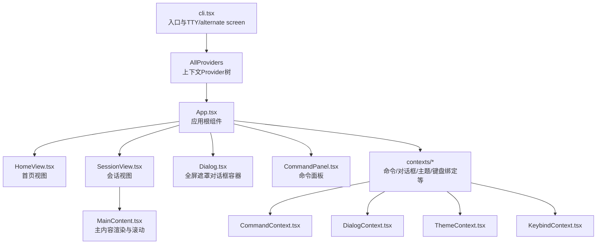

图表来源
- [cli.tsx](file://terminal-ui/src/cli.tsx#L67-L126)
- [index.tsx（上下文聚合导出）](file://terminal-ui/src/contexts/index.tsx#L17-L47)
- [App.tsx](file://terminal-ui/src/App.tsx#L26-L201)
- [HomeView.tsx](file://terminal-ui/src/views/HomeView.tsx#L30-L199)
- [SessionView.tsx](file://terminal-ui/src/views/SessionView.tsx#L30-L473)
- [Dialog.tsx](file://terminal-ui/src/components/Dialog.tsx#L12-L43)
- [CommandPanel.tsx](file://terminal-ui/src/components/CommandPanel.tsx#L11-L91)

章节来源
- [cli.tsx](file://terminal-ui/src/cli.tsx#L1-L143)
- [index.tsx（上下文聚合导出）](file://terminal-ui/src/contexts/index.tsx#L1-L63)
- [App.tsx](file://terminal-ui/src/App.tsx#L1-L202)

## 核心组件
- 应用根组件App：负责尺寸监听、事件桥接、命令注册、键盘绑定与对话框栈管理，决定渲染HomeView或SessionView。
- 视图层：HomeView（首页）与SessionView（会话），分别承载输入、斜杠命令建议、状态栏与底部快捷键提示。
- 对话框系统：Dialog作为全屏遮罩容器，配合DialogContext维护栈式结构；CommandPanel作为命令选择面板。
- 上下文系统：CommandContext（命令注册/触发）、DialogContext（栈操作）、ThemeContext（赛博朋克风格主题）、KeybindContext（快捷键匹配与打印）。
- 主内容渲染：MainContent负责流式内容块的分段、可见范围裁剪、并行判别与滚动条绘制。

章节来源
- [App.tsx](file://terminal-ui/src/App.tsx#L26-L201)
- [HomeView.tsx](file://terminal-ui/src/views/HomeView.tsx#L30-L199)
- [SessionView.tsx](file://terminal-ui/src/views/SessionView.tsx#L30-L473)
- [Dialog.tsx](file://terminal-ui/src/components/Dialog.tsx#L12-L43)
- [CommandPanel.tsx](file://terminal-ui/src/components/CommandPanel.tsx#L11-L91)
- [MainContent.tsx](file://terminal-ui/src/MainContent.tsx#L52-L216)
- [CommandContext.tsx](file://terminal-ui/src/contexts/CommandContext.tsx#L20-L49)
- [DialogContext.tsx](file://terminal-ui/src/contexts/DialogContext.tsx#L19-L55)
- [ThemeContext.tsx](file://terminal-ui/src/contexts/ThemeContext.tsx#L41-L58)
- [KeybindContext.tsx](file://terminal-ui/src/contexts/KeybindContext.tsx#L102-L136)

## 架构总览
Ink驱动的终端UI采用“入口脚本 + Provider树 + 根组件 + 视图层 + 对话框”的分层架构。入口脚本确保TTY与alternate screen，根组件统一处理键盘输入、命令注册与对话框栈，视图层负责具体交互与渲染，上下文提供跨组件共享的状态与能力。

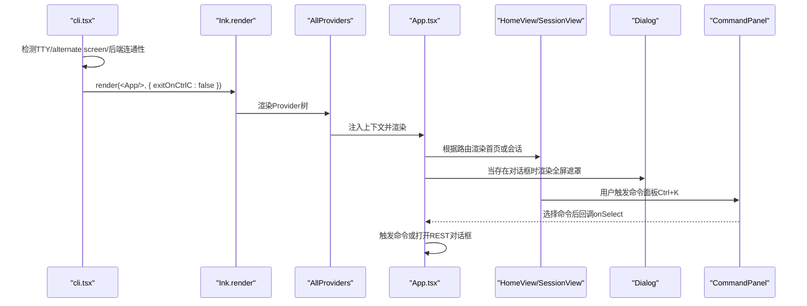

图表来源
- [cli.tsx](file://terminal-ui/src/cli.tsx#L67-L126)
- [index.tsx（上下文聚合导出）](file://terminal-ui/src/contexts/index.tsx#L17-L47)
- [App.tsx](file://terminal-ui/src/App.tsx#L26-L201)
- [HomeView.tsx](file://terminal-ui/src/views/HomeView.tsx#L76-L99)
- [SessionView.tsx](file://terminal-ui/src/views/SessionView.tsx#L297-L373)
- [Dialog.tsx](file://terminal-ui/src/components/Dialog.tsx#L12-L43)
- [CommandPanel.tsx](file://terminal-ui/src/components/CommandPanel.tsx#L32-L48)

## 组件详解

### 应用根组件（App）
- 尺寸监听：读取stdout columns/rows，支持resize事件更新布局。
- 事件桥接：订阅tuiEvents（Toast与CommandExecute），转发至Toast与命令触发器。
- 命令注册：注册常用斜杠命令（切换模式、智能体、REST查询等），并以onSelect打开对应对话框或切换模式。
- 键盘绑定：统一处理退出（Esc/Ctrl+C）、命令列表（Ctrl+K）、智能体切换（Tab）等快捷键。
- 视图切换：当存在对话框时仅渲染遮罩层，否则根据路由渲染HomeView或SessionView。

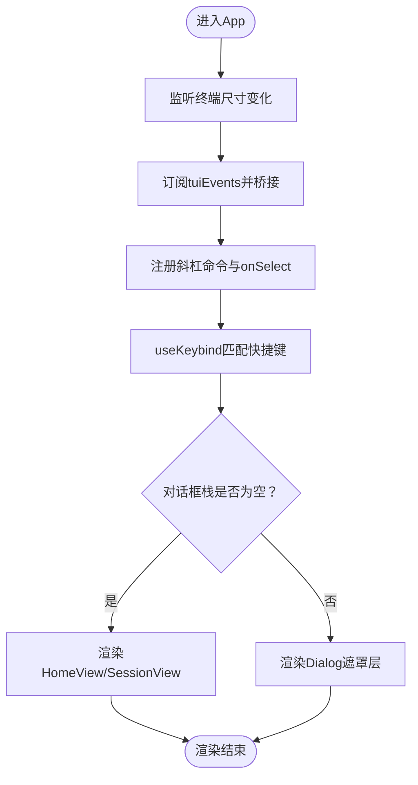

图表来源
- [App.tsx](file://terminal-ui/src/App.tsx#L26-L201)

章节来源
- [App.tsx](file://terminal-ui/src/App.tsx#L26-L201)

### 视图层（HomeView 与 SessionView）
- HomeView：ASCII艺术标题、输入框、斜杠命令建议、快捷键提示与底部状态栏；支持/ask与/agent等命令直达。
- SessionView：主内容区（MainContent）、斜杠建议、输入行、底部状态栏（模式/智能体）与统计/快捷键提示；支持滚动、块展开、权限确认对话框等。

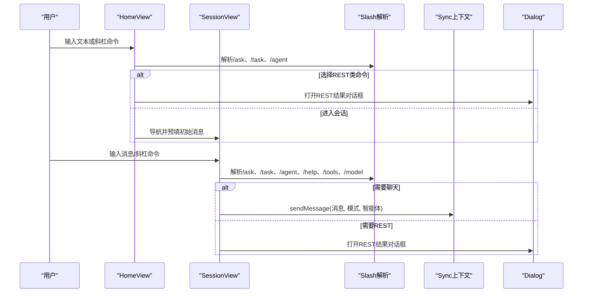

图表来源
- [HomeView.tsx](file://terminal-ui/src/views/HomeView.tsx#L76-L99)
- [SessionView.tsx](file://terminal-ui/src/views/SessionView.tsx#L297-L373)
- [slash.ts](file://terminal-ui/src/slash.ts#L42-L144)

章节来源
- [HomeView.tsx](file://terminal-ui/src/views/HomeView.tsx#L30-L199)
- [SessionView.tsx](file://terminal-ui/src/views/SessionView.tsx#L30-L473)
- [slash.ts](file://terminal-ui/src/slash.ts#L42-L144)

### 命令面板（CommandPanel）
- 功能：过滤命令（fuzzysort）、上下箭头导航、回车执行、Esc关闭（由App统一clear）。
- 设计：按分类分组显示，支持显示快捷键标签；限制每页展示数量，提升可读性。

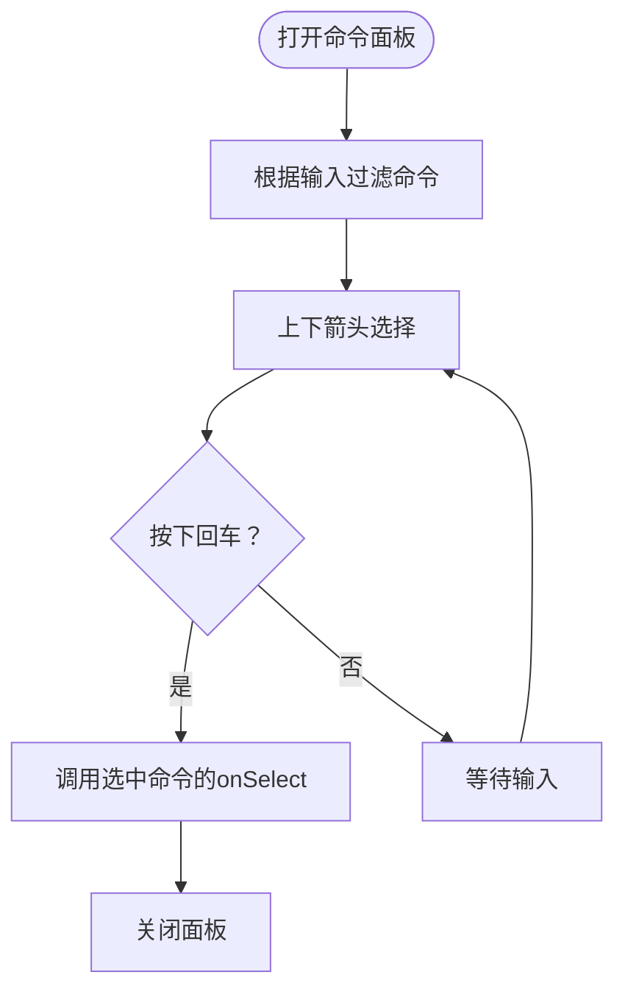

图表来源
- [CommandPanel.tsx](file://terminal-ui/src/components/CommandPanel.tsx#L11-L91)

章节来源
- [CommandPanel.tsx](file://terminal-ui/src/components/CommandPanel.tsx#L11-L91)

### 对话框系统（Dialog + DialogContext）
- DialogContext：提供replace/pop/clear栈操作，支持onClose回调；弹栈时调用顶层元素的onClose。
- Dialog：全屏不透明遮罩，居中内容区，round边框与主题色；Esc由App统一clear，避免与内部pop竞态。
- 典型对话框：AgentSelectDialog、ModelConfigDialog、RestResultDialog、RootPermissionDialog等。

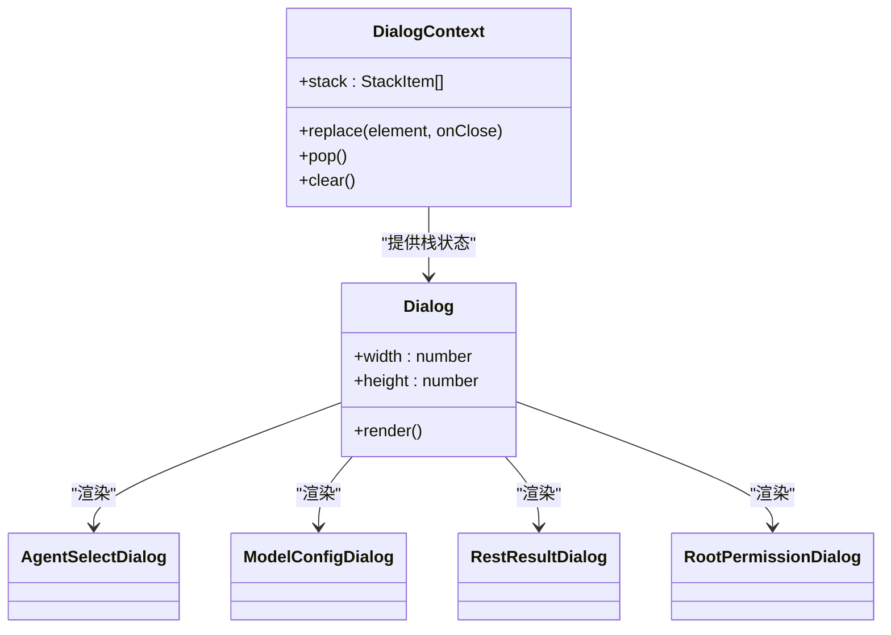

图表来源
- [DialogContext.tsx](file://terminal-ui/src/contexts/DialogContext.tsx#L19-L55)
- [Dialog.tsx](file://terminal-ui/src/components/Dialog.tsx#L12-L43)

章节来源
- [DialogContext.tsx](file://terminal-ui/src/contexts/DialogContext.tsx#L1-L63)
- [Dialog.tsx](file://terminal-ui/src/components/Dialog.tsx#L1-L44)

### 上下文系统
- CommandContext：集中管理命令列表与触发器，支持注册/注销命令。
- DialogContext：维护对话框栈，提供替换、弹栈与清空。
- ThemeContext：赛博朋克风格主题色板，支持覆盖默认值。
- KeybindContext：统一快捷键定义、匹配与打印；支持从配置合并覆盖。

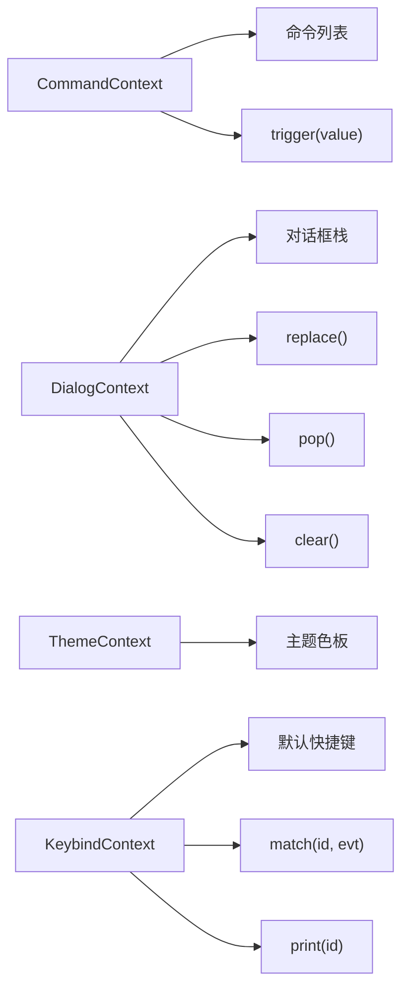

图表来源
- [CommandContext.tsx](file://terminal-ui/src/contexts/CommandContext.tsx#L20-L49)
- [DialogContext.tsx](file://terminal-ui/src/contexts/DialogContext.tsx#L19-L55)
- [ThemeContext.tsx](file://terminal-ui/src/contexts/ThemeContext.tsx#L41-L58)
- [KeybindContext.tsx](file://terminal-ui/src/contexts/KeybindContext.tsx#L102-L136)

章节来源
- [CommandContext.tsx](file://terminal-ui/src/contexts/CommandContext.tsx#L1-L50)
- [DialogContext.tsx](file://terminal-ui/src/contexts/DialogContext.tsx#L1-L63)
- [ThemeContext.tsx](file://terminal-ui/src/contexts/ThemeContext.tsx#L1-L59)
- [KeybindContext.tsx](file://terminal-ui/src/contexts/KeybindContext.tsx#L1-L137)

### 主内容渲染（MainContent）
- 流式块拼接：将历史与当前流式状态转换为内容块，计算行号区间。
- 可见范围裁剪：仅渲染屏幕可见块，避免逻辑行与终端行不一致导致叠加。
- 并行判别：使用判别器池（POOL_SIZE=3）并行判定块类型，提升渲染性能。
- 滚动条：ASCII字符绘制滚动条，支持总高度/可视高度/拇指位置计算。
- 临时工具块：系统信息、网络分析等工具完成后短暂显示后自动消失。

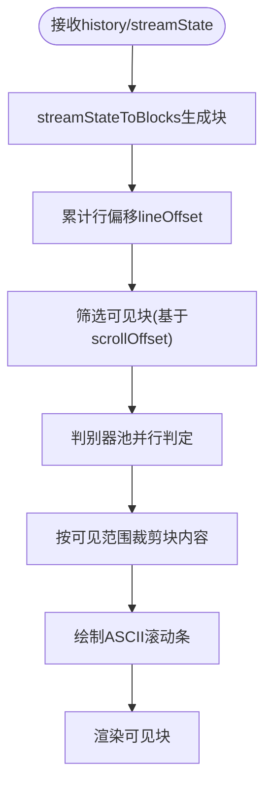

图表来源
- [MainContent.tsx](file://terminal-ui/src/MainContent.tsx#L81-L216)

章节来源
- [MainContent.tsx](file://terminal-ui/src/MainContent.tsx#L1-L217)

### 斜杠命令系统（slash.ts）
- 本地命令：/ask、/task、/agent（切换智能体）等，直接返回chat或状态变更。
- REST命令：/help、/list-agents、/tools、/model，返回fetchThen异步获取内容。
- 工具帮助文本：内置静态帮助，展示各类安全工具概览。

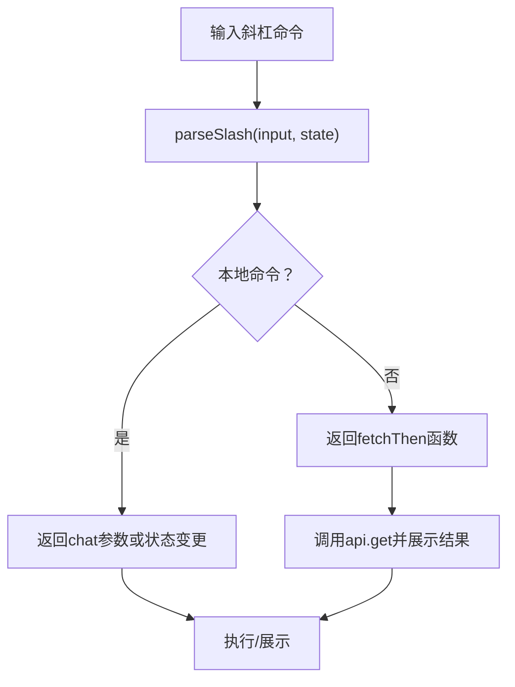

图表来源
- [slash.ts](file://terminal-ui/src/slash.ts#L42-L144)
- [api.ts](file://terminal-ui/src/api.ts#L6-L23)

章节来源
- [slash.ts](file://terminal-ui/src/slash.ts#L1-L165)
- [api.ts](file://terminal-ui/src/api.ts#L1-L24)

### 事件系统（events.ts）
- 类型安全事件总线：ToastShow与CommandExecute两类事件，提供on与emit方法。
- 应用内通信：App订阅事件并桥接到Toast与命令触发器。

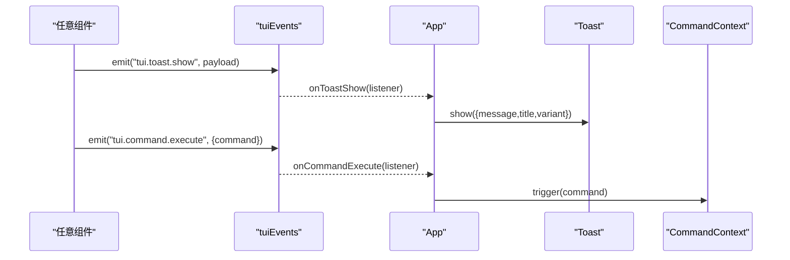

图表来源
- [events.ts](file://terminal-ui/src/events.ts#L82-L91)
- [App.tsx](file://terminal-ui/src/App.tsx#L57-L66)

章节来源
- [events.ts](file://terminal-ui/src/events.ts#L1-L92)
- [App.tsx](file://terminal-ui/src/App.tsx#L57-L66)

## 依赖关系分析
- 入口依赖：cli.tsx依赖config与checkBackend，确保TTY与后端可用；渲染App并开启alternate screen。
- 根组件依赖：App依赖contexts（命令、对话框、主题、键盘绑定）、views（HomeView/SessionView）、components（Dialog/CommandPanel）。
- 视图依赖：HomeView/SessionView依赖上下文（useRoute/useCommand/useSync/useDialog/useToast/useKeybind/useTheme/useExit）与slash解析。
- 对话框依赖：Dialog依赖DialogContext与ThemeContext；CommandPanel依赖CommandContext、DialogContext、ThemeContext、KeybindContext。
- 主内容依赖：MainContent依赖contentBlocks与判别器池，以及ThemeContext。

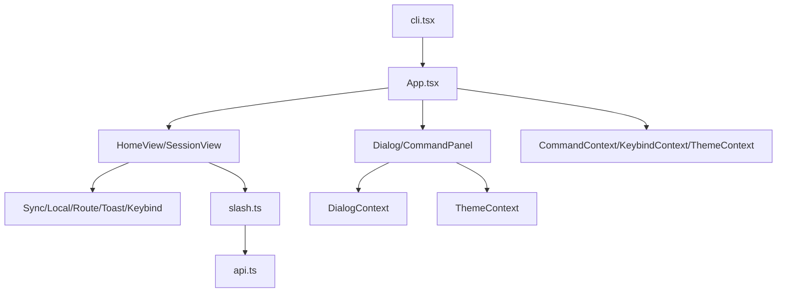

图表来源
- [cli.tsx](file://terminal-ui/src/cli.tsx#L67-L126)
- [App.tsx](file://terminal-ui/src/App.tsx#L26-L201)
- [HomeView.tsx](file://terminal-ui/src/views/HomeView.tsx#L30-L199)
- [SessionView.tsx](file://terminal-ui/src/views/SessionView.tsx#L30-L473)
- [slash.ts](file://terminal-ui/src/slash.ts#L42-L144)
- [api.ts](file://terminal-ui/src/api.ts#L6-L23)

章节来源
- [cli.tsx](file://terminal-ui/src/cli.tsx#L1-L143)
- [App.tsx](file://terminal-ui/src/App.tsx#L1-L202)
- [HomeView.tsx](file://terminal-ui/src/views/HomeView.tsx#L1-L200)
- [SessionView.tsx](file://terminal-ui/src/views/SessionView.tsx#L1-L474)
- [slash.ts](file://terminal-ui/src/slash.ts#L1-L165)
- [api.ts](file://terminal-ui/src/api.ts#L1-L24)

## 性能考量
- 并行判别：MainContent使用判别器池（POOL_SIZE=3）并行判定块类型，减少主线程压力。
- 可见范围裁剪：仅渲染屏幕可见块，避免全量渲染带来的闪烁与卡顿。
- 自动滚动：新增内容时自动滚动到底部，保持良好阅读体验。
- 临时工具块：系统信息、网络分析等工具完成后短暂显示后自动消失，降低冗余渲染。

章节来源
- [MainContent.tsx](file://terminal-ui/src/MainContent.tsx#L10-L14)

## 故障排查指南
- TTY与alternate screen
  - 现象：非TTY或终端不支持Raw模式。
  - 排查：Windows无TTY时自动在新控制台窗口重启；错误写入tui-error.log与tui-launch.log。
- 后端不可达
  - 现象：无法连接后端。
  - 排查：检查uv run python main.py --backend；查看错误日志。
- 渲染异常
  - 现象：渲染抛错或退出码异常。
  - 排查：捕获uncaughtException/unhandledRejection，记录详细堆栈并退出。

章节来源
- [cli.tsx](file://terminal-ui/src/cli.tsx#L27-L46)
- [cli.tsx](file://terminal-ui/src/cli.tsx#L71-L90)
- [cli.tsx](file://terminal-ui/src/cli.tsx#L114-L125)
- [cli.tsx](file://terminal-ui/src/cli.tsx#L128-L140)

## 结论
该终端UI以Ink为核心，通过Provider树实现清晰的上下文分层，结合命令面板、对话框系统与主内容渲染，提供了高效、可扩展且具有良好终端适配性的交互体验。斜杠命令系统将本地切换与REST查询统一抽象，配合事件总线实现组件间解耦。未来可在命令历史、多语言支持与更丰富的块类型方面进一步增强。

## 附录
- 键盘快捷键（默认）
  - 退出：Ctrl+C
  - 打开命令列表：Ctrl+K
  - ESC：关闭对话框/清除命令面板
  - 智能体切换：Tab
  - 页面翻动：Page Up/Down
  - 首/尾：Home/End
  - 半页移动：Ctrl+Page Up/Down
  - 展开块：Ctrl+E
- 交互设计原则
  - 一致性：命令面板、对话框、视图均遵循统一主题与键盘映射。
  - 可发现性：斜杠命令建议与快捷键提示贯穿首页与会话视图。
  - 容错性：未知斜杠命令提示与自动清空输入，避免误触发。
  - 可访问性：ASCII滚动条与纯色主题在不同终端兼容性良好。

章节来源
- [KeybindContext.tsx](file://terminal-ui/src/contexts/KeybindContext.tsx#L27-L42)
- [HomeView.tsx](file://terminal-ui/src/views/HomeView.tsx#L174-L182)
- [SessionView.tsx](file://terminal-ui/src/views/SessionView.tsx#L460-L470)