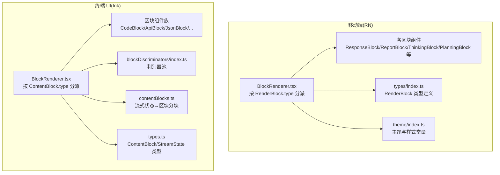
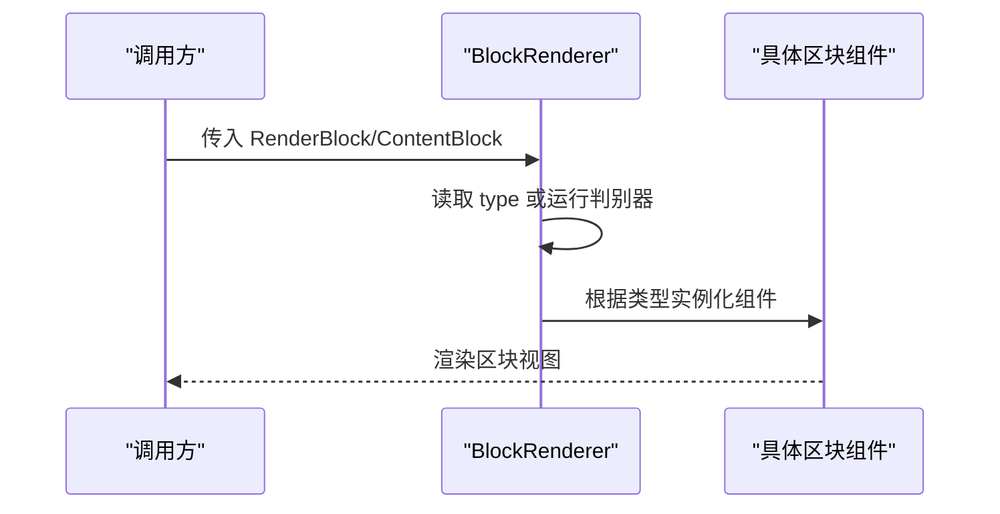
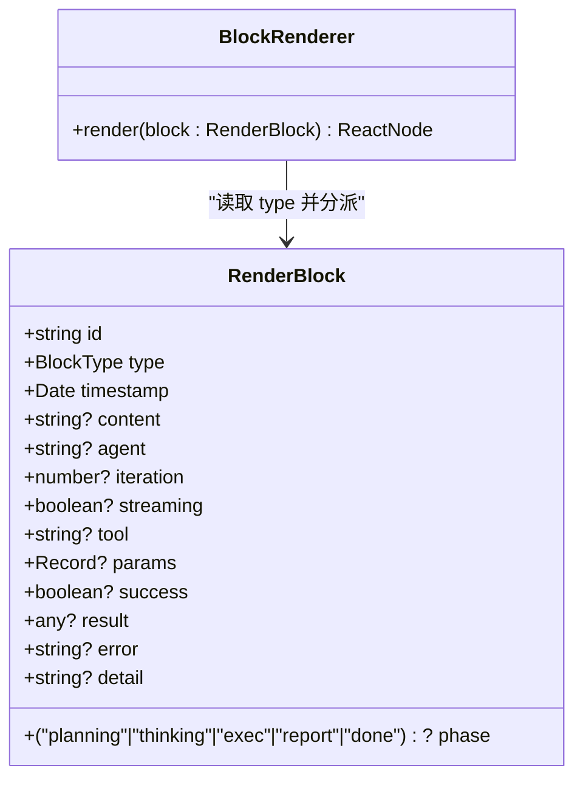
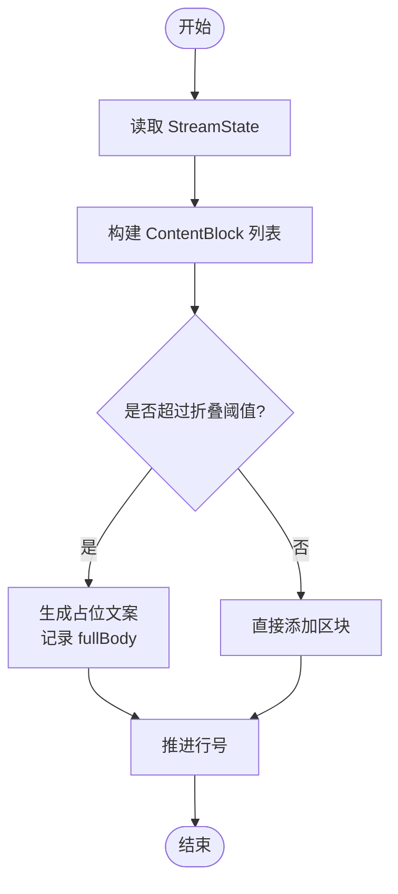
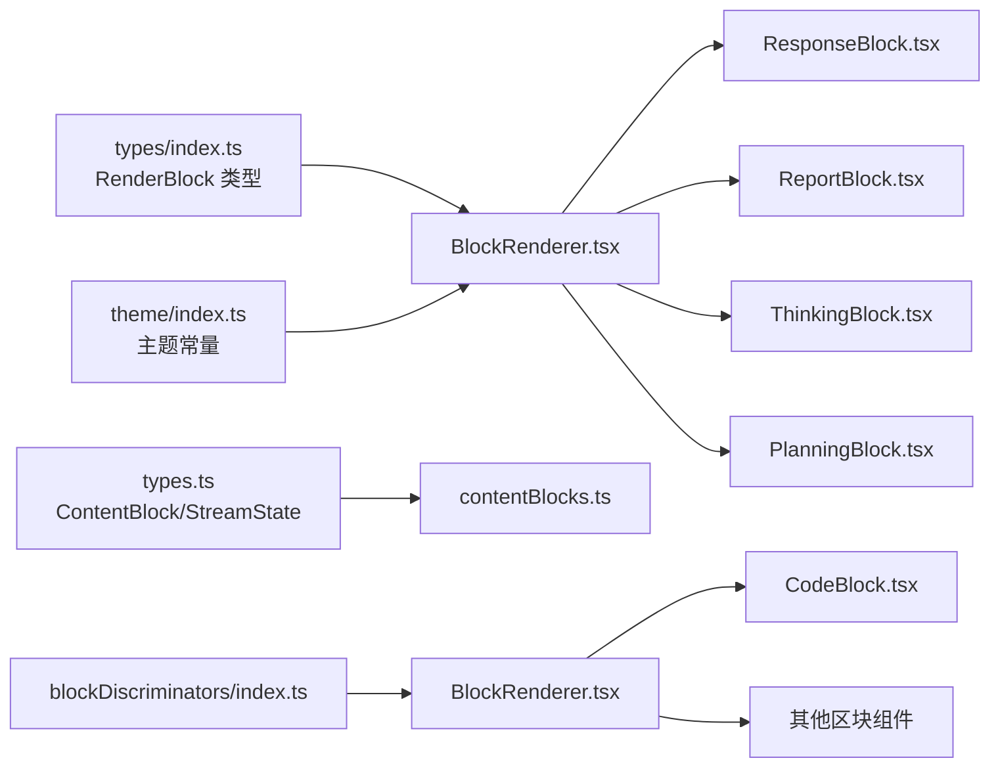

# Blocks区块系统

<cite>
**本文引用的文件**
- [BlockRenderer.tsx](file://app/src/components/BlockRenderer.tsx)
- [ResponseBlock.tsx](file://app/src/components/ResponseBlock.tsx)
- [ReportBlock.tsx](file://app/src/components/ReportBlock.tsx)
- [ThinkingBlock.tsx](file://app/src/components/ThinkingBlock.tsx)
- [PlanningBlock.tsx](file://app/src/components/PlanningBlock.tsx)
- [index.ts](file://app/src/types/index.ts)
- [index.ts](file://app/src/theme/index.ts)
- [BlockRenderer.tsx](file://terminal-ui/src/components/blocks/BlockRenderer.tsx)
- [CodeBlock.tsx](file://terminal-ui/src/components/blocks/CodeBlock.tsx)
- [index.ts](file://terminal-ui/src/components/blocks/index.ts)
- [types.ts](file://terminal-ui/src/types.ts)
- [index.ts](file://terminal-ui/src/blockDiscriminators/index.ts)
- [contentBlocks.ts](file://terminal-ui/src/contentBlocks.ts)
</cite>

## 目录
1. [简介](#简介)
2. [项目结构](#项目结构)
3. [核心组件](#核心组件)
4. [架构总览](#架构总览)
5. [详细组件分析](#详细组件分析)
6. [依赖关系分析](#依赖关系分析)
7. [性能考量](#性能考量)
8. [故障排查指南](#故障排查指南)
9. [结论](#结论)
10. [附录：扩展与最佳实践](#附录扩展与最佳实践)

## 简介
本文件系统性梳理 Secbot 的 Blocks 区块系统，覆盖移动端与终端 UI 两条路径。移动端以 BlockRenderer 为核心，依据 RenderBlock.type 分派到具体区块组件；终端 UI 则通过 BlockRenderer 将 ContentBlock 按类型分发至丰富多样的区块组件族，配合判别池与内容分块器实现复杂流程的可视化呈现。本文重点阐述：
- 渲染器设计与分派机制
- 区块类型系统与数据结构
- 典型区块组件实现（CodeBlock、ResponseBlock、ReportBlock、ThinkingBlock、PlanningBlock）
- 样式系统与主题集成
- 交互行为与流式渲染
- 条件渲染与折叠策略
- 性能优化与扩展指南

## 项目结构
Blocks 系统横跨两个 UI 子项目：
- 移动端（React Native）：基于 RenderBlock 类型驱动的 BlockRenderer，负责用户消息、规划、推理、执行、报告、最终响应与错误等区块的渲染。
- 终端 UI（Ink/TUI）：基于 ContentBlock 的 BlockRenderer，结合判别池与内容分块器，支持更丰富的区块类型（如 JSON、表格、链接、差异、终端输出等），并提供折叠、占位、流式等高级能力。

图表来源
- [BlockRenderer.tsx](file://app/src/components/BlockRenderer.tsx#L21-L96)
- [index.ts](file://app/src/types/index.ts#L25-L58)
- [index.ts](file://app/src/theme/index.ts#L5-L63)
- [BlockRenderer.tsx](file://terminal-ui/src/components/blocks/BlockRenderer.tsx#L48-L149)
- [index.ts](file://terminal-ui/src/blockDiscriminators/index.ts#L5-L12)
- [contentBlocks.ts](file://terminal-ui/src/contentBlocks.ts#L43-L159)
- [types.ts](file://terminal-ui/src/types.ts#L47-L74)

章节来源
- [BlockRenderer.tsx](file://app/src/components/BlockRenderer.tsx#L1-L97)
- [BlockRenderer.tsx](file://terminal-ui/src/components/blocks/BlockRenderer.tsx#L1-L150)
- [contentBlocks.ts](file://terminal-ui/src/contentBlocks.ts#L1-L160)

## 核心组件
- 移动端渲染器：根据 RenderBlock.type 在若干区块组件间进行分派，支持用户消息、规划、任务阶段指示器、推理（流式/折叠）、执行（进行中/结果）、观察、报告（流式/完成）、最终响应、错误等。
- 终端 UI 渲染器：根据 ContentBlock.type 或运行时判别结果，分派到 API、阶段、错误、规划、推理、动作、内容、报告、回复、警告、摘要、代码、JSON、表格、项目符号、编号、引用、标题、分割线、链接、键值、差异、终端、安全、工具结果、异常、建议、成功、信息等区块组件。
- 内容分块器：将流式状态（StreamState）转换为 ContentBlock 列表，支持折叠阈值、占位文案、截断、瞬时工具隐藏等策略。
- 判别池：提供多种判别器（按类型、内容、结构、回退），统一入口 defaultPool.discriminate，提升灵活性与可扩展性。

章节来源
- [BlockRenderer.tsx](file://app/src/components/BlockRenderer.tsx#L21-L96)
- [BlockRenderer.tsx](file://terminal-ui/src/components/blocks/BlockRenderer.tsx#L48-L149)
- [contentBlocks.ts](file://terminal-ui/src/contentBlocks.ts#L43-L159)
- [index.ts](file://terminal-ui/src/blockDiscriminators/index.ts#L5-L12)

## 架构总览
移动端与终端 UI 的渲染器均采用“类型驱动 + 组件分派”的架构，但终端 UI 更强调“内容分块 + 判别器 + 多样化区块”的组合模式，适合复杂工作流与多模态输出。

图表来源
- [BlockRenderer.tsx](file://app/src/components/BlockRenderer.tsx#L21-L96)
- [BlockRenderer.tsx](file://terminal-ui/src/components/blocks/BlockRenderer.tsx#L48-L149)

## 详细组件分析

### 移动端区块类型与渲染器
- 类型系统：RenderBlock 定义了移动端可用的区块类型集合，以及各类型携带的字段（如 content、agent、iteration、streaming、tool、params、success、result、error、phase、detail 等）。
- 渲染器：BlockRenderer 依据 RenderBlock.type 进行 switch 分派，将数据映射到对应区块组件，同时对流式状态与折叠逻辑进行适配。

图表来源
- [index.ts](file://app/src/types/index.ts#L25-L58)
- [BlockRenderer.tsx](file://app/src/components/BlockRenderer.tsx#L21-L96)

章节来源
- [index.ts](file://app/src/types/index.ts#L25-L58)
- [BlockRenderer.tsx](file://app/src/components/BlockRenderer.tsx#L21-L96)

#### CodeBlock（终端 UI）
- 用途：展示代码片段，固定宽度字体、带边框，支持标题与语言标签。
- 关键点：按行渲染，支持无边距模式与标题/语言显示。

章节来源
- [CodeBlock.tsx](file://terminal-ui/src/components/blocks/CodeBlock.tsx#L17-L36)

#### ResponseBlock（移动端）
- 用途：展示最终响应，绿色主题、圆角边框、机器人图标与代理名称。
- 关键点：使用 MarkdownText 渲染富文本内容，样式与主题常量集成。

章节来源
- [ResponseBlock.tsx](file://app/src/components/ResponseBlock.tsx#L18-L33)
- [index.ts](file://app/src/theme/index.ts#L5-L63)

#### ReportBlock（移动端）
- 用途：展示报告内容，支持流式闪烁光标与完成态双线边框。
- 关键点：流式时使用 Animated 循环闪烁，完成态使用 MarkdownText；提供“streaming”徽章。

章节来源
- [ReportBlock.tsx](file://app/src/components/ReportBlock.tsx#L19-L72)
- [index.ts](file://app/src/theme/index.ts#L5-L63)

#### ThinkingBlock（移动端）
- 用途：展示推理过程，流式时展开，完成后默认折叠（预览前两行）。
- 关键点：支持点击标题切换展开/折叠；流式时闪烁光标；预览文本由前若干行拼接生成。

章节来源
- [ThinkingBlock.tsx](file://app/src/components/ThinkingBlock.tsx#L21-L128)
- [index.ts](file://app/src/theme/index.ts#L5-L63)

#### PlanningBlock（移动端）
- 用途：展示规划内容，紫色主题、圆角边框、清单图标。
- 关键点：使用 MarkdownText 渲染规划内容。

章节来源
- [PlanningBlock.tsx](file://app/src/components/PlanningBlock.tsx#L17-L31)
- [index.ts](file://app/src/theme/index.ts#L5-L63)

### 终端 UI 区块类型与渲染器
- 类型系统：ContentBlock 定义了更丰富的区块类型集合，涵盖 API、阶段、错误、规划、推理、动作、内容、报告、回复、警告、摘要、代码、JSON、表格、项目符号、编号、引用、标题、分割线、链接、键值、差异、终端、安全、工具结果、异常、建议、成功、信息等。
- 渲染器：BlockRenderer 根据 resolvedType 或运行 defaultPool.discriminate 结果进行分派，支持占位文案与无边距模式。
- 内容分块器：将 StreamState 转换为 ContentBlock 列表，支持折叠阈值、占位提示、截断、瞬时工具过滤等。

图表来源
- [contentBlocks.ts](file://terminal-ui/src/contentBlocks.ts#L58-L70)

章节来源
- [types.ts](file://terminal-ui/src/types.ts#L47-L74)
- [BlockRenderer.tsx](file://terminal-ui/src/components/blocks/BlockRenderer.tsx#L48-L149)
- [contentBlocks.ts](file://terminal-ui/src/contentBlocks.ts#L43-L159)

#### CodeBlock（终端 UI）
- 用途：代码块渲染，支持标题与语言标签。
- 关键点：使用 Ink 的 Box/Text，按行渲染，带单线边框。

章节来源
- [CodeBlock.tsx](file://terminal-ui/src/components/blocks/CodeBlock.tsx#L17-L36)

#### 其他区块组件（终端 UI）
- ApiBlock、PhaseBlock、ErrorBlock、PlanningBlock、ThoughtBlock、ActionsBlock、ResultBlock、ReportBlock、ResponseBlock、WarningBlock、SummaryBlock、JsonBlock、TableBlock、BulletBlock、NumberedBlock、QuoteBlock、HeadingBlock、DividerBlock、LinkBlock、KeyValueBlock、DiffBlock、TerminalBlock、SecurityBlock、ToolResultBlock、ExceptionBlock、SuggestionBlock、SuccessBlock、InfoBlock。
- 说明：这些组件均由 BlockRenderer 按类型分派，支持标题、正文、无边距、占位等通用特性；部分组件（如 PlanningBlock、ThoughtBlock、ActionsBlock）还具备特定数据结构（如 todos、actions）。

章节来源
- [BlockRenderer.tsx](file://terminal-ui/src/components/blocks/BlockRenderer.tsx#L52-L148)
- [index.ts](file://terminal-ui/src/components/blocks/index.ts#L4-L40)

## 依赖关系分析
- 移动端
  - BlockRenderer 依赖 RenderBlock 类型定义与主题常量，分派到各区块组件。
  - 区块组件共享主题常量，保证视觉一致性。
- 终端 UI
  - BlockRenderer 依赖判别池 defaultPool 与 ContentBlock 类型。
  - contentBlocks 将流式状态转换为 ContentBlock，决定区块数量与布局。
  - 各区块组件独立，通过统一的导出入口集中管理。

图表来源
- [index.ts](file://app/src/types/index.ts#L25-L58)
- [index.ts](file://app/src/theme/index.ts#L5-L63)
- [BlockRenderer.tsx](file://app/src/components/BlockRenderer.tsx#L21-L96)
- [types.ts](file://terminal-ui/src/types.ts#L47-L74)
- [contentBlocks.ts](file://terminal-ui/src/contentBlocks.ts#L43-L159)
- [index.ts](file://terminal-ui/src/blockDiscriminators/index.ts#L5-L12)
- [BlockRenderer.tsx](file://terminal-ui/src/components/blocks/BlockRenderer.tsx#L48-L149)
- [CodeBlock.tsx](file://terminal-ui/src/components/blocks/CodeBlock.tsx#L17-L36)

章节来源
- [BlockRenderer.tsx](file://app/src/components/BlockRenderer.tsx#L21-L96)
- [BlockRenderer.tsx](file://terminal-ui/src/components/blocks/BlockRenderer.tsx#L48-L149)
- [contentBlocks.ts](file://terminal-ui/src/contentBlocks.ts#L43-L159)

## 性能考量
- 折叠与占位
  - 终端 UI 使用折叠阈值与占位文案减少长内容渲染压力，仅在展开时加载 fullBody。
- 截断
  - 对执行结果、内容、报告、回复等区块进行最大行数截断，避免界面刷屏与内存占用过高。
- 瞬时工具过滤
  - 对系统信息、网络分析等瞬时工具的结果进行过滤，避免在执行列表中重复展示。
- 动画与流式
  - 移动端流式闪烁光标使用原生驱动的 Animated.loop，确保流畅度；非流式时及时停止动画。
- 渲染器分派
  - 通过类型分派避免不必要的组件实例化与重渲染；终端 UI 的判别器池可扩展，便于按需定制。

章节来源
- [contentBlocks.ts](file://terminal-ui/src/contentBlocks.ts#L8-L26)
- [contentBlocks.ts](file://terminal-ui/src/contentBlocks.ts#L14-L15)
- [contentBlocks.ts](file://terminal-ui/src/contentBlocks.ts#L112-L138)
- [ReportBlock.tsx](file://app/src/components/ReportBlock.tsx#L20-L43)
- [ThinkingBlock.tsx](file://app/src/components/ThinkingBlock.tsx#L25-L49)

## 故障排查指南
- 错误显示
  - 移动端：错误区块接收 error 或 content 字段作为错误信息，若为空则显示“未知错误”。
  - 终端 UI：contentBlocks 将常见错误（如终止、超时、中止）归一化为可读提示，便于用户理解。
- 连接问题
  - 归一化错误消息包含“连接已中断/请求已取消/连接超时”等提示，建议检查后端状态与网络配置。
- 占位与展开
  - 若区块被折叠，检查 expandedBlockIds 与占位文案特征；按提示展开查看完整内容。
- 流式渲染
  - 若流式闪烁光标不出现，确认 streaming 标志与 Animated 循环是否正确启动；完成后自动停止。

章节来源
- [BlockRenderer.tsx](file://app/src/components/BlockRenderer.tsx#L90-L91)
- [contentBlocks.ts](file://terminal-ui/src/contentBlocks.ts#L28-L41)
- [contentBlocks.ts](file://terminal-ui/src/contentBlocks.ts#L48-L50)

## 结论
Secbot 的 Blocks 区块系统在移动端与终端 UI 两端分别实现了“类型驱动 + 组件分派”的清晰架构。移动端侧重简洁直观的对话式区块，终端 UI 则通过判别池与内容分块器支撑复杂工作流的多模态可视化。两者共同遵循统一的主题与样式体系，辅以折叠、截断、占位与流式动画等性能与体验优化策略，满足从简单到复杂的多样化展示需求。

## 附录：扩展与最佳实践
- 自定义移动端区块
  - 新增枚举值到 BlockType 与 RenderBlock 字段定义，扩展 BlockRenderer 的分派分支，新增对应区块组件并接入主题常量。
- 自定义终端 UI 区块
  - 在 ContentBlock 类型集合中新增类型，编写区块组件并在 BlockRenderer 中注册；如需自动判别，向判别池添加判别器。
- 数据结构与事件
  - 保持区块数据结构稳定，必要时在类型定义中新增字段；事件处理建议通过上层容器统一调度，区块组件专注渲染。
- 组合模式与条件渲染
  - 使用判别器池实现“按类型/内容/结构”的多级判别；对长内容采用折叠与占位，对瞬时结果采用过滤与短暂展示。
- 性能优化建议
  - 控制区块数量与长度，合理设置折叠阈值与最大行数；避免在流式渲染中进行昂贵的计算；利用原生动画与懒加载策略。

章节来源
- [index.ts](file://app/src/types/index.ts#L25-L58)
- [BlockRenderer.tsx](file://app/src/components/BlockRenderer.tsx#L21-L96)
- [types.ts](file://terminal-ui/src/types.ts#L47-L74)
- [BlockRenderer.tsx](file://terminal-ui/src/components/blocks/BlockRenderer.tsx#L48-L149)
- [contentBlocks.ts](file://terminal-ui/src/contentBlocks.ts#L43-L159)