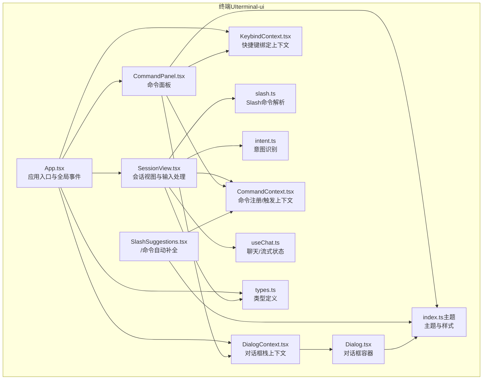
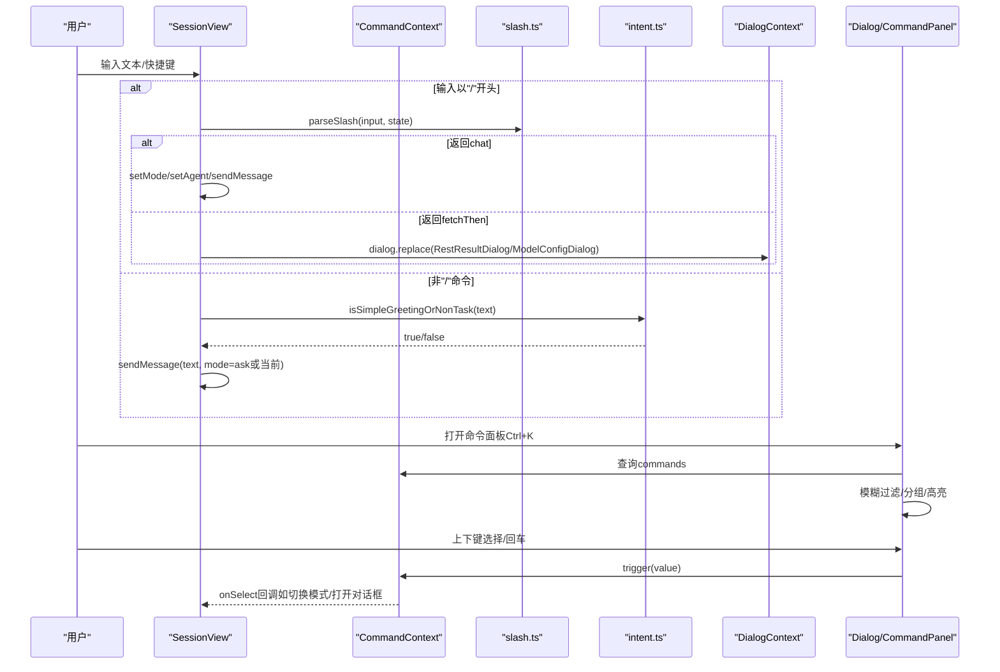
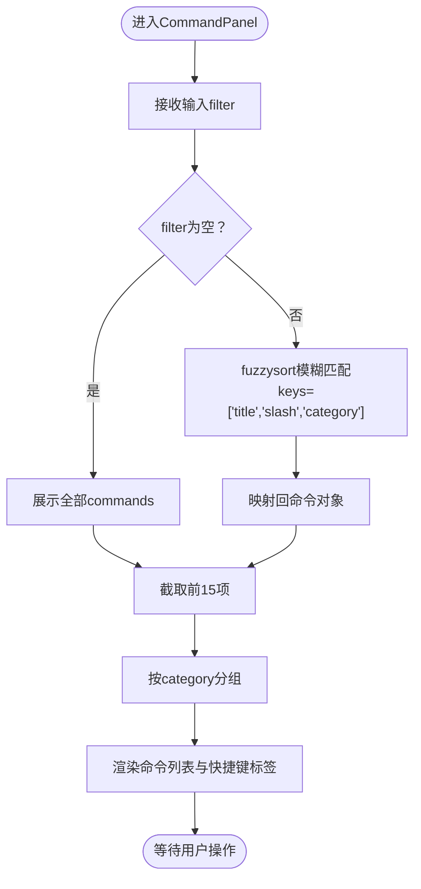
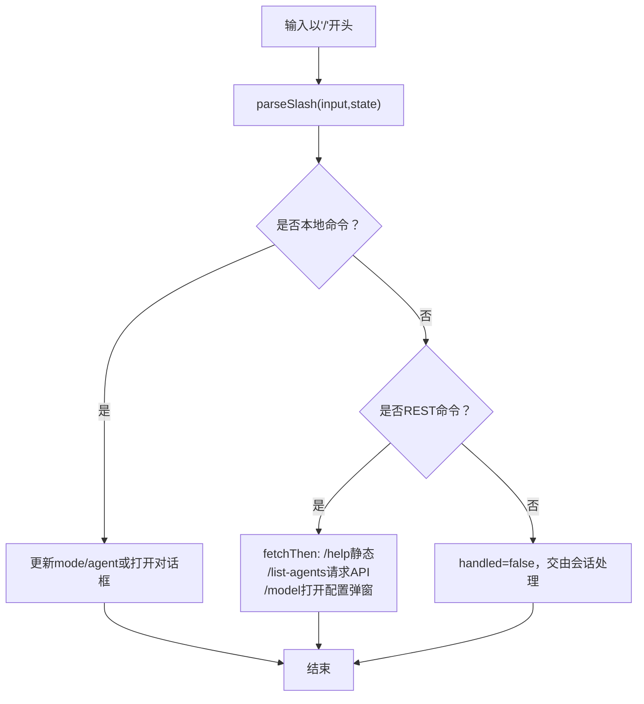
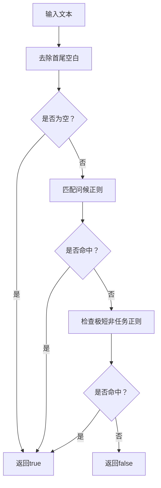
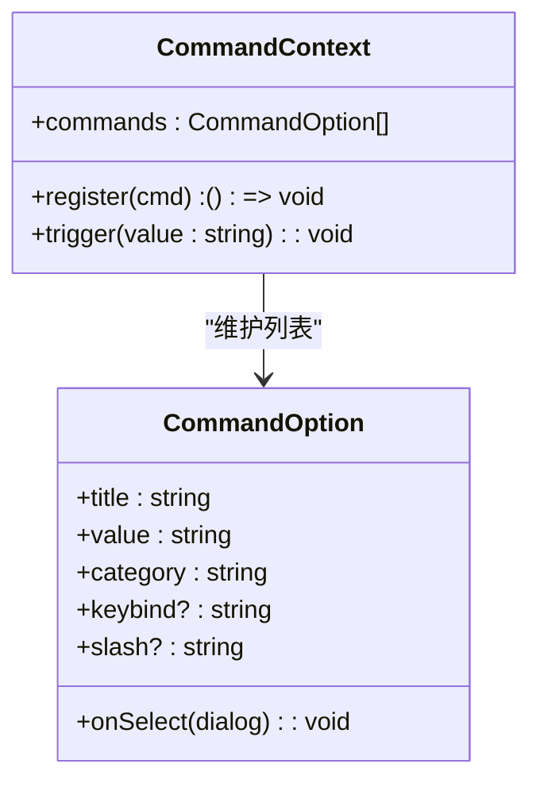
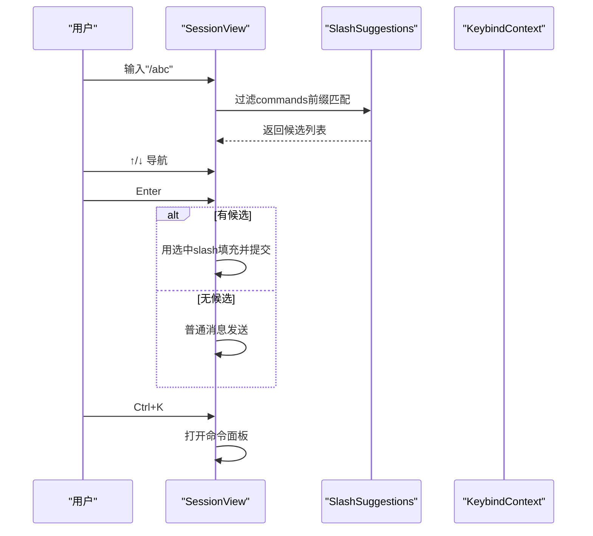
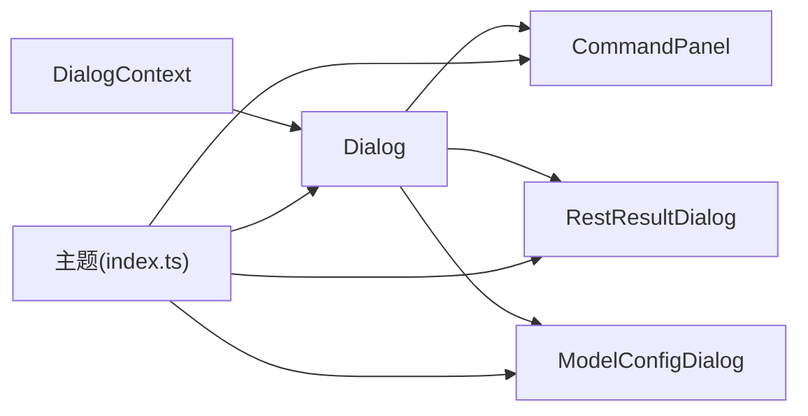
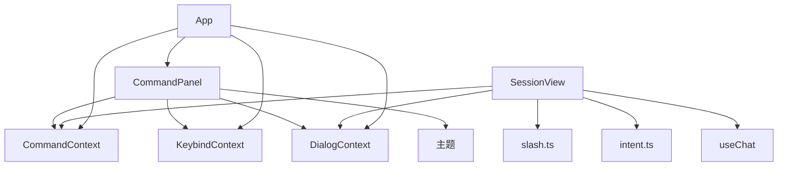

# 命令面板

<cite>
**本文引用的文件**
- [CommandPanel.tsx](file://terminal-ui/src/components/CommandPanel.tsx)
- [SlashSuggestions.tsx](file://terminal-ui/src/components/SlashSuggestions.tsx)
- [intent.ts](file://terminal-ui/src/intent.ts)
- [slash.ts](file://terminal-ui/src/slash.ts)
- [CommandContext.tsx](file://terminal-ui/src/contexts/CommandContext.tsx)
- [KeybindContext.tsx](file://terminal-ui/src/contexts/KeybindContext.tsx)
- [DialogContext.tsx](file://terminal-ui/src/contexts/DialogContext.tsx)
- [App.tsx](file://terminal-ui/src/App.tsx)
- [SessionView.tsx](file://terminal-ui/src/views/SessionView.tsx)
- [Dialog.tsx](file://terminal-ui/src/components/Dialog.tsx)
- [slash-commands-flow.md](file://terminal-ui/docs/slash-commands-flow.md)
- [types.ts](file://terminal-ui/src/types.ts)
- [useChat.ts](file://terminal-ui/src/useChat.ts)
- [package.json](file://terminal-ui/package.json)
- [index.ts](file://app/src/theme/index.ts)
</cite>

## 目录
1. [简介](#简介)
2. [项目结构](#项目结构)
3. [核心组件](#核心组件)
4. [架构总览](#架构总览)
5. [详细组件分析](#详细组件分析)
6. [依赖关系分析](#依赖关系分析)
7. [性能考量](#性能考量)
8. [故障排查指南](#故障排查指南)
9. [结论](#结论)
10. [附录](#附录)

## 简介
本文件面向Secbot终端UI中的命令面板与Slash命令系统，提供从架构到实现细节的全景式技术文档。重点涵盖：
- CommandPanel命令面板的设计与交互（输入过滤、自动补全、历史与快捷键）
- Slash命令系统的工作机制（解析、参数处理、执行流程）
- 意图识别系统intent.ts的功能与实现
- 命令注册与扩展机制（自定义命令开发指南）
- 样式定制、键盘导航与无障碍访问支持

## 项目结构
命令面板与相关功能主要位于terminal-ui子工程中，采用React + Ink构建终端界面，配合自研上下文与工具模块完成命令注册、快捷键绑定、对话框栈管理与Slash命令解析。

图表来源
- [App.tsx](file://terminal-ui/src/App.tsx#L1-L202)
- [SessionView.tsx](file://terminal-ui/src/views/SessionView.tsx#L1-L474)
- [CommandPanel.tsx](file://terminal-ui/src/components/CommandPanel.tsx#L1-L92)
- [SlashSuggestions.tsx](file://terminal-ui/src/components/SlashSuggestions.tsx#L1-L52)
- [CommandContext.tsx](file://terminal-ui/src/contexts/CommandContext.tsx#L1-L50)
- [KeybindContext.tsx](file://terminal-ui/src/contexts/KeybindContext.tsx#L1-L137)
- [DialogContext.tsx](file://terminal-ui/src/contexts/DialogContext.tsx#L1-L63)
- [slash.ts](file://terminal-ui/src/slash.ts#L1-L165)
- [intent.ts](file://terminal-ui/src/intent.ts#L1-L39)
- [Dialog.tsx](file://terminal-ui/src/components/Dialog.tsx#L1-L44)
- [types.ts](file://terminal-ui/src/types.ts#L1-L75)
- [useChat.ts](file://terminal-ui/src/useChat.ts#L1-L219)
- [index.ts](file://app/src/theme/index.ts#L1-L64)

章节来源
- [App.tsx](file://terminal-ui/src/App.tsx#L1-L202)
- [SessionView.tsx](file://terminal-ui/src/views/SessionView.tsx#L1-L474)
- [CommandPanel.tsx](file://terminal-ui/src/components/CommandPanel.tsx#L1-L92)
- [SlashSuggestions.tsx](file://terminal-ui/src/components/SlashSuggestions.tsx#L1-L52)
- [CommandContext.tsx](file://terminal-ui/src/contexts/CommandContext.tsx#L1-L50)
- [KeybindContext.tsx](file://terminal-ui/src/contexts/KeybindContext.tsx#L1-L137)
- [DialogContext.tsx](file://terminal-ui/src/contexts/DialogContext.tsx#L1-L63)
- [slash.ts](file://terminal-ui/src/slash.ts#L1-L165)
- [intent.ts](file://terminal-ui/src/intent.ts#L1-L39)
- [Dialog.tsx](file://terminal-ui/src/components/Dialog.tsx#L1-L44)
- [types.ts](file://terminal-ui/src/types.ts#L1-L75)
- [useChat.ts](file://terminal-ui/src/useChat.ts#L1-L219)
- [index.ts](file://app/src/theme/index.ts#L1-L64)

## 核心组件
- 命令面板CommandPanel：提供模糊搜索、上下键选择、回车执行、按类别分组展示与快捷键标签显示。
- Slash命令解析slash.ts：解析以“/”开头的命令，区分本地模式切换、REST异步命令与静态帮助。
- 意图识别intent.ts：判断问候/非任务型输入，决定是否走ask模式而非触发代理执行。
- 命令注册上下文CommandContext：集中注册命令、触发命令、查询命令集合。
- 快捷键上下文KeybindContext：统一管理快捷键映射、匹配与打印。
- 对话框上下文DialogContext：全屏遮罩式对话框栈，支持替换、弹栈与清空。
- 会话视图SessionView：输入处理、Slash自动补全、意图识别、命令触发与Slash解析的主流程。
- 应用入口App：注册内置命令、监听全局快捷键、控制命令面板与对话框生命周期。

章节来源
- [CommandPanel.tsx](file://terminal-ui/src/components/CommandPanel.tsx#L1-L92)
- [slash.ts](file://terminal-ui/src/slash.ts#L1-L165)
- [intent.ts](file://terminal-ui/src/intent.ts#L1-L39)
- [CommandContext.tsx](file://terminal-ui/src/contexts/CommandContext.tsx#L1-L50)
- [KeybindContext.tsx](file://terminal-ui/src/contexts/KeybindContext.tsx#L1-L137)
- [DialogContext.tsx](file://terminal-ui/src/contexts/DialogContext.tsx#L1-L63)
- [SessionView.tsx](file://terminal-ui/src/views/SessionView.tsx#L1-L474)
- [App.tsx](file://terminal-ui/src/App.tsx#L1-L202)

## 架构总览
命令面板与Slash系统通过上下文解耦，围绕命令注册、快捷键匹配与对话框栈协作，形成“输入—解析—执行”的闭环。

图表来源
- [SessionView.tsx](file://terminal-ui/src/views/SessionView.tsx#L297-L373)
- [slash.ts](file://terminal-ui/src/slash.ts#L42-L144)
- [intent.ts](file://terminal-ui/src/intent.ts#L29-L38)
- [CommandContext.tsx](file://terminal-ui/src/contexts/CommandContext.tsx#L23-L31)
- [DialogContext.tsx](file://terminal-ui/src/contexts/DialogContext.tsx#L22-L49)
- [Dialog.tsx](file://terminal-ui/src/components/Dialog.tsx#L12-L43)
- [CommandPanel.tsx](file://terminal-ui/src/components/CommandPanel.tsx#L11-L92)

## 详细组件分析

### 命令面板CommandPanel
- 功能要点
  - 输入过滤：使用fuzzysort对title/slash/category进行模糊匹配，支持阈值与多字段检索。
  - 交互控制：上下箭头移动选中项，回车执行选中命令的onSelect回调，并关闭面板。
  - 展示分组：按category分组，不足15项时截断展示，支持“其他”兜底。
  - 快捷键标签：读取KeybindContext打印对应按键提示。
- 性能与复杂度
  - 过滤阶段时间复杂度近似O(k·n)，k为查询词特征数，n为命令总数；分组与截断O(n)。
  - 使用useMemo缓存过滤结果与分组结果，减少重复计算。
- 无障碍与样式
  - 选中项高亮与颜色对比遵循主题；类别标题与命令行分层清晰。

图表来源
- [CommandPanel.tsx](file://terminal-ui/src/components/CommandPanel.tsx#L21-L62)

章节来源
- [CommandPanel.tsx](file://terminal-ui/src/components/CommandPanel.tsx#L1-L92)

### Slash命令系统
- 解析流程
  - 以“/”开头即进入解析；按空白分割命令与参数。
  - 本地命令：/ask切换到ask模式；/task切换到agent模式；/agent切换智能体。
  - REST命令：/help静态文案、/list-agents调用后端API、/model打开配置弹窗、/tools展示工具统计。
  - 未识别：返回handled=false，交由会话视图提示或进入普通聊天。
- 参数处理
  - /agent支持super/hackbot/default别名；/model特殊处理为直接打开配置弹窗。
- 执行策略
  - chat分支：更新mode/agent并发起聊天请求。
  - fetchThen分支：弹出对话框展示异步结果（/help静态、/list-agents动态）。
- 文档参考
  - slash-commands-flow.md明确了不同命令的触发路径与实际效果。

图表来源
- [slash.ts](file://terminal-ui/src/slash.ts#L42-L144)
- [slash-commands-flow.md](file://terminal-ui/docs/slash-commands-flow.md#L1-L39)

章节来源
- [slash.ts](file://terminal-ui/src/slash.ts#L1-L165)
- [slash-commands-flow.md](file://terminal-ui/docs/slash-commands-flow.md#L1-L39)

### 意图识别系统intent.ts
- 目标：快速判断问候/非任务型输入，避免触发代理执行，直接进入ask模式。
- 识别规则
  - 多语言问候正则集合（中文/英文/语气词）。
  - 极短且无明确指令的输入（1-3字符）判定为非任务。
- 返回值
  - true：走ask模式；false：按常规聊天处理。

图表来源
- [intent.ts](file://terminal-ui/src/intent.ts#L29-L38)

章节来源
- [intent.ts](file://terminal-ui/src/intent.ts#L1-L39)

### 命令注册与扩展机制
- 注册接口
  - CommandContext.register：向全局命令表追加命令，返回注销函数。
  - CommandContext.trigger：按value触发已注册命令的onSelect回调。
- 命令结构
  - title/value/category/keybind/slash/onSelect，支持slash字段作为“/命令”展示与自动补全。
- 扩展指南
  - 在App或各视图初始化时调用register注入新命令。
  - onSelect中实现具体行为（如切换模式、打开对话框、调用API）。
  - 若需要键盘触发，可在value中加入唯一标识并通过KeybindContext绑定快捷键。

图表来源
- [CommandContext.tsx](file://terminal-ui/src/contexts/CommandContext.tsx#L3-L16)

章节来源
- [CommandContext.tsx](file://terminal-ui/src/contexts/CommandContext.tsx#L1-L50)
- [App.tsx](file://terminal-ui/src/App.tsx#L68-L154)

### 交互设计与输入处理
- 命令面板
  - Esc不在此处关闭，由App统一clear避免竞态；Enter执行选中命令；上下箭头导航。
- Slash自动补全
  - 会话视图与SlashSuggestions共同实现：输入“/”后按前缀过滤commands，最多12项，支持上下箭头选择。
- 历史与滚动
  - 会话视图支持消息滚动、半页翻动、首尾跳转、展开块等快捷键。
- 快捷键支持
  - KeybindContext统一管理默认与覆盖配置，提供match/print能力。

图表来源
- [SessionView.tsx](file://terminal-ui/src/views/SessionView.tsx#L86-L90)
- [SlashSuggestions.tsx](file://terminal-ui/src/components/SlashSuggestions.tsx#L19-L28)
- [KeybindContext.tsx](file://terminal-ui/src/contexts/KeybindContext.tsx#L114-L122)

章节来源
- [CommandPanel.tsx](file://terminal-ui/src/components/CommandPanel.tsx#L32-L48)
- [SlashSuggestions.tsx](file://terminal-ui/src/components/SlashSuggestions.tsx#L1-L52)
- [SessionView.tsx](file://terminal-ui/src/views/SessionView.tsx#L271-L295)
- [KeybindContext.tsx](file://terminal-ui/src/contexts/KeybindContext.tsx#L1-L137)

### 对话框与样式定制
- 对话框栈
  - DialogContext提供replace/pop/clear，Dialog组件以全屏遮罩渲染栈顶元素。
  - App统一处理Esc/Ctrl+C，避免与面板内部pop竞态。
- 样式与主题
  - 主题定义了主色、背景、文字、状态色与圆角、字号、间距等，命令面板与建议列表遵循主题色彩。
- 无障碍
  - 高对比度颜色、键盘导航、焦点顺序清晰，建议在自定义命令时保持一致的视觉与交互反馈。

图表来源
- [DialogContext.tsx](file://terminal-ui/src/contexts/DialogContext.tsx#L22-L49)
- [Dialog.tsx](file://terminal-ui/src/components/Dialog.tsx#L12-L43)
- [index.ts](file://app/src/theme/index.ts#L5-L36)

章节来源
- [DialogContext.tsx](file://terminal-ui/src/contexts/DialogContext.tsx#L1-L63)
- [Dialog.tsx](file://terminal-ui/src/components/Dialog.tsx#L1-L44)
- [index.ts](file://app/src/theme/index.ts#L1-L64)

## 依赖关系分析
- 组件耦合
  - CommandPanel依赖CommandContext、KeybindContext、DialogContext与主题；与slash.ts无直接耦合，通过App注册的onSelect间接联动。
  - SessionView是核心协调者，依赖slash.ts、intent.ts、CommandContext、DialogContext与useChat。
- 外部依赖
  - fuzzysort用于命令面板模糊匹配；ink与ink-text-input提供终端UI能力；package.json声明依赖版本与引擎要求。

图表来源
- [CommandPanel.tsx](file://terminal-ui/src/components/CommandPanel.tsx#L1-L10)
- [SessionView.tsx](file://terminal-ui/src/views/SessionView.tsx#L1-L18)
- [slash.ts](file://terminal-ui/src/slash.ts#L1-L6)
- [intent.ts](file://terminal-ui/src/intent.ts#L1-L3)
- [useChat.ts](file://terminal-ui/src/useChat.ts#L1-L4)
- [App.tsx](file://terminal-ui/src/App.tsx#L1-L16)

章节来源
- [package.json](file://terminal-ui/package.json#L17-L30)

## 性能考量
- 命令面板
  - 过滤与分组均使用useMemo缓存，避免高频输入导致的重复计算。
  - 截断展示限制为15项，降低渲染压力。
- Slash解析
  - parseSlash为纯函数，O(n)遍历commands匹配，n通常较小；REST请求在外部异步执行，不影响UI主线程。
- 会话视图
  - useChat维护流式状态与历史快照，合理复用引用避免不必要的重渲染。

[本节为通用性能讨论，不直接分析具体文件]

## 故障排查指南
- 命令面板无响应
  - 检查是否正确包裹在CommandProvider与KeybindProvider/ThemeContext中。
  - 确认App已注册命令，或在组件初始化时调用register。
- Slash命令无效
  - 确认输入以“/”开头且符合命令格式；检查parseSlash返回handled=true。
  - 对REST命令，确认后端接口可用且返回结构符合预期。
- Esc无法关闭面板
  - App统一clear，避免面板内部pop与外层clear竞态；确保未在面板内部处理Esc。
- 快捷键不生效
  - 检查KeybindContext的默认映射或覆盖配置；确认match/print调用正确。

章节来源
- [App.tsx](file://terminal-ui/src/App.tsx#L156-L175)
- [DialogContext.tsx](file://terminal-ui/src/contexts/DialogContext.tsx#L26-L49)
- [slash.ts](file://terminal-ui/src/slash.ts#L42-L144)

## 结论
命令面板与Slash系统通过上下文解耦与清晰的职责划分，实现了高效、可扩展的终端命令体验。命令注册机制简洁直观，Slash解析与意图识别保证了“命令优先”的交互一致性。建议在扩展新命令时遵循现有上下文与主题规范，确保一致的键盘导航与无障碍体验。

[本节为总结性内容，不直接分析具体文件]

## 附录
- 自定义命令开发步骤
  - 在组件初始化时调用CommandContext.register注册命令，提供title/value/category/slash/onSelect。
  - 若需要键盘触发，在KeybindContext中为该命令分配一个KeybindId并绑定按键。
  - 在onSelect中实现具体行为（切换模式、打开对话框、调用API等）。
- 样式与主题
  - 修改app/src/theme/index.ts中的Colors/FontSize/Spacing等，影响命令面板与建议列表的整体风格。
- 键盘导航与无障碍
  - 保持高对比度与清晰的焦点反馈；为常用操作提供快捷键提示（状态栏已展示部分常用键）。

章节来源
- [CommandContext.tsx](file://terminal-ui/src/contexts/CommandContext.tsx#L23-L31)
- [KeybindContext.tsx](file://terminal-ui/src/contexts/KeybindContext.tsx#L27-L57)
- [index.ts](file://app/src/theme/index.ts#L5-L36)