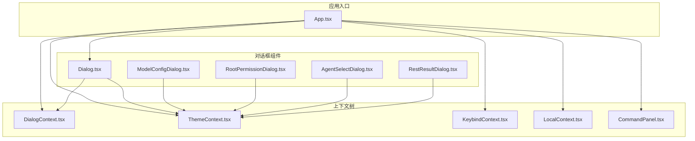
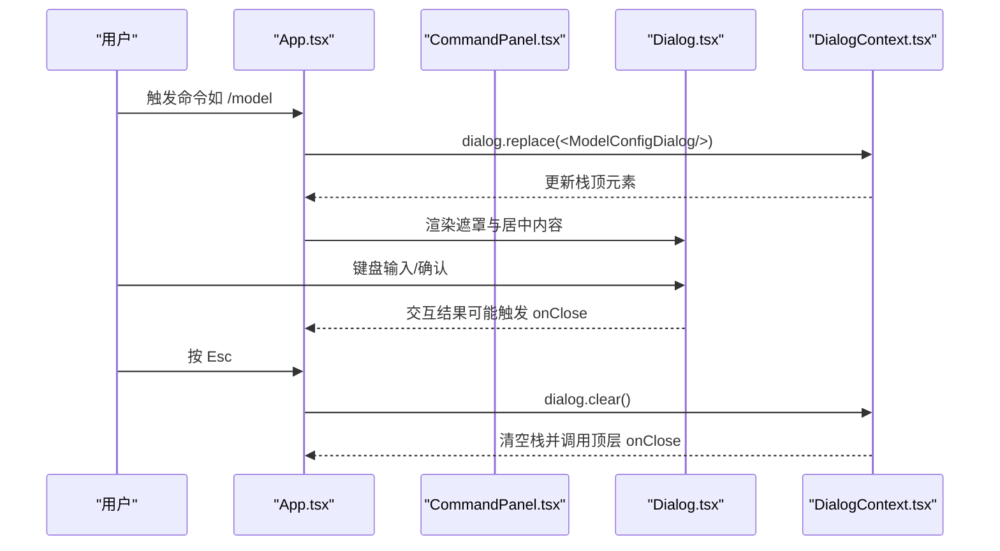
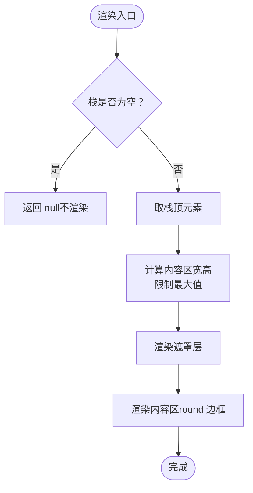
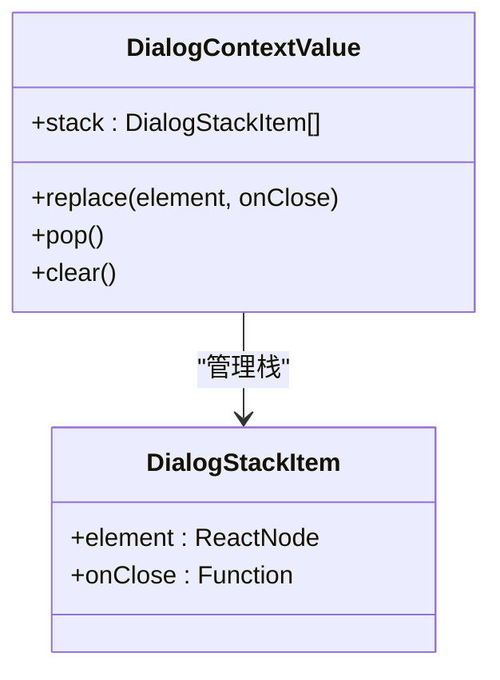
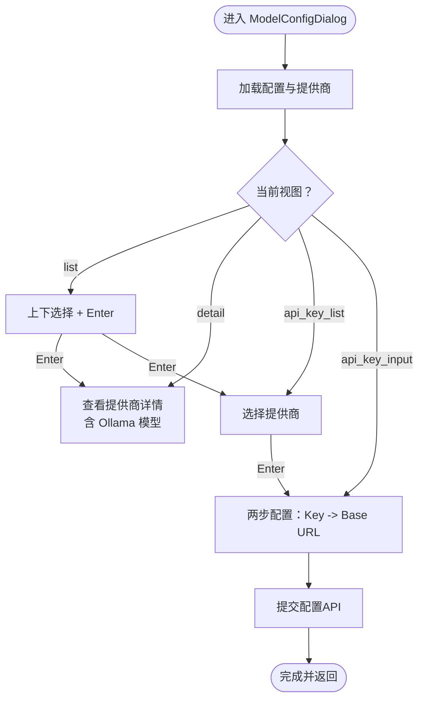
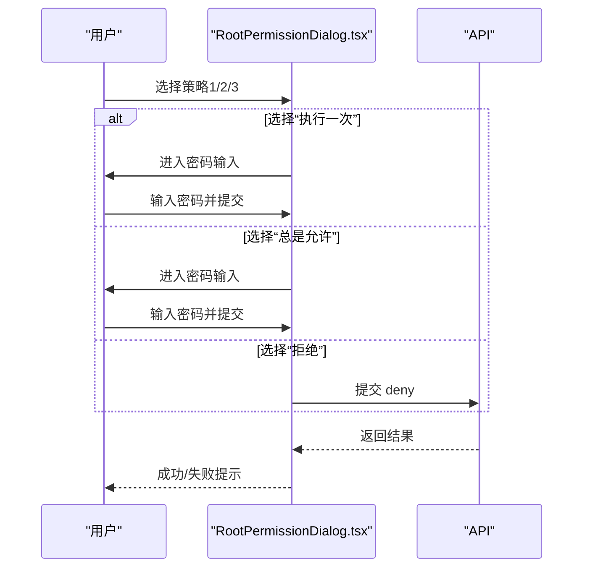
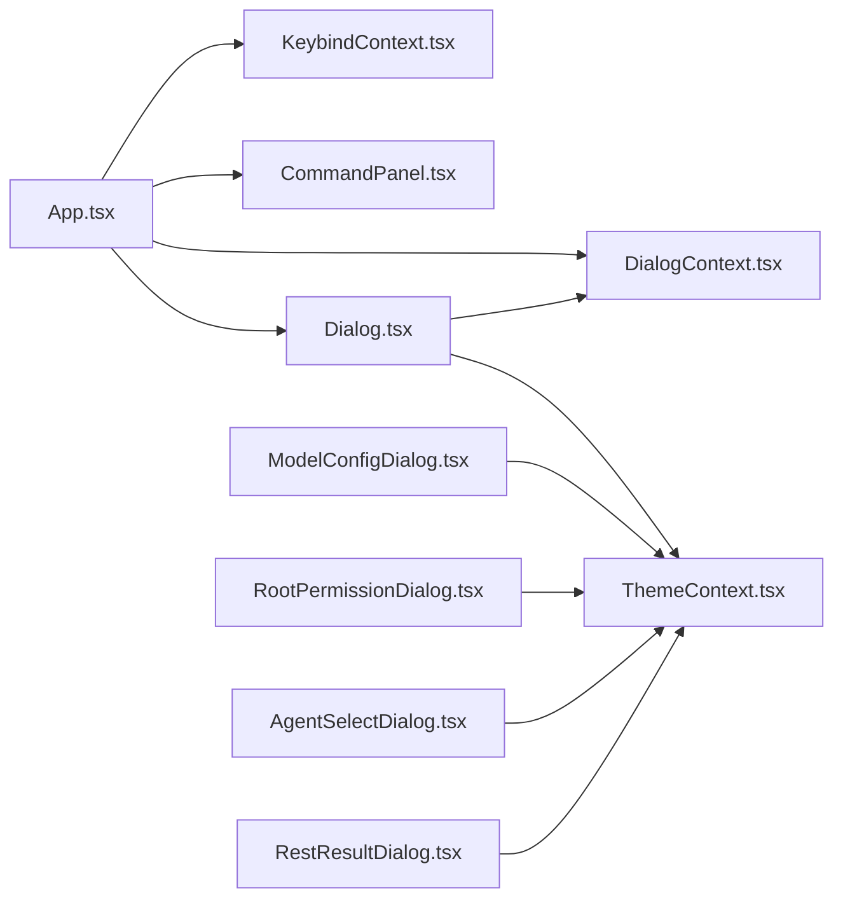

# 对话框系统

<cite>
**本文引用的文件**
- [Dialog.tsx](file://terminal-ui/src/components/Dialog.tsx)
- [DialogContext.tsx](file://terminal-ui/src/contexts/DialogContext.tsx)
- [ModelConfigDialog.tsx](file://terminal-ui/src/components/ModelConfigDialog.tsx)
- [RootPermissionDialog.tsx](file://terminal-ui/src/components/RootPermissionDialog.tsx)
- [AgentSelectDialog.tsx](file://terminal-ui/src/components/AgentSelectDialog.tsx)
- [RestResultDialog.tsx](file://terminal-ui/src/components/RestResultDialog.tsx)
- [App.tsx](file://terminal-ui/src/App.tsx)
- [index.tsx](file://terminal-ui/src/contexts/index.tsx)
- [ThemeContext.tsx](file://terminal-ui/src/contexts/ThemeContext.tsx)
- [KeybindContext.tsx](file://terminal-ui/src/contexts/KeybindContext.tsx)
- [LocalContext.tsx](file://terminal-ui/src/contexts/LocalContext.tsx)
- [CommandPanel.tsx](file://terminal-ui/src/components/CommandPanel.tsx)
- [UI-DESIGN-AND-INTERACTION.md](file://docs/UI-DESIGN-AND-INTERACTION.md)
</cite>

## 目录
1. [简介](#简介)
2. [项目结构](#项目结构)
3. [核心组件](#核心组件)
4. [架构总览](#架构总览)
5. [详细组件分析](#详细组件分析)
6. [依赖关系分析](#依赖关系分析)
7. [性能考量](#性能考量)
8. [故障排查指南](#故障排查指南)
9. [结论](#结论)
10. [附录](#附录)

## 简介
本文件系统性梳理 Secbot 终端用户界面中的对话框系统，围绕基础对话框组件 Dialog、对话框上下文系统 DialogContext 的设计与实现进行深入解析，并详细说明多种具体对话框（如模型配置对话框、根权限对话框、智能体选择对话框、REST 结果对话框）的交互流程、状态管理与生命周期控制。同时提供扩展指南、样式定制建议、动画与键盘交互支持说明，帮助开发者快速理解并高效扩展对话框体系。

## 项目结构
对话框系统位于终端 UI 子工程 terminal-ui 中，采用 Ink + React 构建，核心文件组织如下：
- 组件层：对话框组件集中于 components 目录，包含基础 Dialog、具体业务对话框（ModelConfigDialog、RootPermissionDialog、AgentSelectDialog、RestResultDialog、CommandPanel 等）
- 上下文层：对话框栈与主题、快捷键、命令等上下文集中于 contexts 目录，通过 Provider 树组合
- 应用入口：App.tsx 注册命令、绑定快捷键、协调对话框与主视图渲染

图表来源
- [App.tsx](file://terminal-ui/src/App.tsx#L1-L202)
- [DialogContext.tsx](file://terminal-ui/src/contexts/DialogContext.tsx#L1-L63)
- [Dialog.tsx](file://terminal-ui/src/components/Dialog.tsx#L1-L44)
- [ModelConfigDialog.tsx](file://terminal-ui/src/components/ModelConfigDialog.tsx#L1-L385)
- [RootPermissionDialog.tsx](file://terminal-ui/src/components/RootPermissionDialog.tsx#L1-L149)
- [AgentSelectDialog.tsx](file://terminal-ui/src/components/AgentSelectDialog.tsx#L1-L72)
- [RestResultDialog.tsx](file://terminal-ui/src/components/RestResultDialog.tsx#L1-L88)
- [ThemeContext.tsx](file://terminal-ui/src/contexts/ThemeContext.tsx#L1-L58)
- [KeybindContext.tsx](file://terminal-ui/src/contexts/KeybindContext.tsx#L1-L137)
- [LocalContext.tsx](file://terminal-ui/src/contexts/LocalContext.tsx#L1-L33)
- [CommandPanel.tsx](file://terminal-ui/src/components/CommandPanel.tsx#L1-L74)

章节来源
- [App.tsx](file://terminal-ui/src/App.tsx#L1-L202)
- [index.tsx](file://terminal-ui/src/contexts/index.tsx#L1-L63)

## 核心组件
- Dialog 基础对话框组件：负责在全屏遮罩层上居中渲染当前栈顶对话框元素，自动适配容器尺寸与主题边框圆角
- DialogContext 对话框上下文：维护对话框栈，提供 replace/pop/clear 方法，统一处理 Esc 关闭与 onClose 回调
- 具体对话框：ModelConfigDialog（模型/推理配置）、RootPermissionDialog（根权限）、AgentSelectDialog（智能体切换）、RestResultDialog（REST 结果展示）

章节来源
- [Dialog.tsx](file://terminal-ui/src/components/Dialog.tsx#L1-L44)
- [DialogContext.tsx](file://terminal-ui/src/contexts/DialogContext.tsx#L1-L63)

## 架构总览
对话框系统遵循“上下文树 + 组件树”的分层设计：
- 上下文树：Exit → Toast → Route → SDK → Sync → Theme → Local → Keybind → Dialog → Command → App
- 组件树：App 负责命令注册与快捷键监听，根据是否有对话框决定渲染 Dialog 或主视图；Dialog 负责渲染遮罩与内容区；各具体对话框负责自身交互与数据流

图表来源
- [App.tsx](file://terminal-ui/src/App.tsx#L70-L116)
- [Dialog.tsx](file://terminal-ui/src/components/Dialog.tsx#L11-L43)
- [DialogContext.tsx](file://terminal-ui/src/contexts/DialogContext.tsx#L19-L55)
- [CommandPanel.tsx](file://terminal-ui/src/components/CommandPanel.tsx#L11-L48)

章节来源
- [UI-DESIGN-AND-INTERACTION.md](file://docs/UI-DESIGN-AND-INTERACTION.md#L69-L93)
- [index.tsx](file://terminal-ui/src/contexts/index.tsx#L1-L63)

## 详细组件分析

### Dialog 基础对话框组件
- 设计要点
  - 全屏不透明遮罩层，居中渲染内容区，支持 round 边框与主题色彩
  - 自适应宽度/高度，限制最大宽高，确保在小终端也能良好显示
  - 仅当栈非空时渲染，避免无对话框时的额外开销
- 生命周期
  - 由 App 根据对话框栈长度决定是否渲染
  - 顶层对话框元素由上下文栈顶元素提供
- 键盘交互
  - 顶层列表类对话框（如命令面板、智能体选择）内部自行处理 Esc 返回，避免与 App 的统一 clear() 竞态
  - 其他对话框（如模型配置、根权限）Esc 交由 App 统一 clear()

图表来源
- [Dialog.tsx](file://terminal-ui/src/components/Dialog.tsx#L11-L43)

章节来源
- [Dialog.tsx](file://terminal-ui/src/components/Dialog.tsx#L1-L44)

### DialogContext 对话框上下文系统
- 数据结构
  - 栈项：element（ReactNode）、onClose（可选回调）
  - 栈：数组，后进先出
- 核心方法
  - replace(element, onClose?)：替换为单元素栈（清空历史）
  - pop()：弹出栈顶并调用 onClose
  - clear()：清空栈并调用顶层 onClose
- 生命周期与事件
  - pop/clear 内部记录调用日志（调试用途），并在清空前触发顶层 onClose
  - App 仅在收到 Esc 时调用 clear()，避免与内部对话框的 pop 竞态

图表来源
- [DialogContext.tsx](file://terminal-ui/src/contexts/DialogContext.tsx#L3-L15)

章节来源
- [DialogContext.tsx](file://terminal-ui/src/contexts/DialogContext.tsx#L1-L63)

### ModelConfigDialog 模型配置对话框
- 功能概述
  - 展示与配置推理后端（当前后端、Ollama、DeepSeek）及 API Key
  - 支持查看本地 Ollama 模型列表、配置 Base URL
  - 多视图：列表、详情、API Key 列表、API Key 输入
- 状态管理
  - config：后端配置（提供商、模型、URL 等）
  - view：当前视图（list/detail/api_key_list/api_key_input）
  - selectedIndex：列表选中项
  - apiKey*：API Key 配置流程状态（列表索引、编辑提供商、输入值、消息、步骤）
  - ollamaModels/*：Ollama 模型列表与拉取状态
- 键盘交互
  - 列表：上下箭头选择，Enter 进入详情或 API Key 列表
  - API Key 列表：上下箭头选择，Enter 进入输入
  - API Key 输入：支持两步流程（先存 Key，再存 Base URL，仅对特定提供商）
  - Esc：逐层返回，顶层 Esc 交由 App 统一 clear()

图表来源
- [ModelConfigDialog.tsx](file://terminal-ui/src/components/ModelConfigDialog.tsx#L37-L384)

章节来源
- [ModelConfigDialog.tsx](file://terminal-ui/src/components/ModelConfigDialog.tsx#L1-L385)

### RootPermissionDialog 根权限对话框
- 功能概述
  - 当需要 root/本机管理员权限时弹出，支持“执行一次”“总是允许”“拒绝”
  - 首次允许时要求输入密码，后续可记忆策略
- 状态管理
  - step：choose/password
  - action：run_once/always_allow/deny
  - password：输入的密码
  - error：错误提示
  - submitting：提交中状态
- 键盘交互
  - choose：按 1/2/3 选择；Esc 拒绝
  - password：输入密码后回车提交；Esc 返回上一步

图表来源
- [RootPermissionDialog.tsx](file://terminal-ui/src/components/RootPermissionDialog.tsx#L18-L81)

章节来源
- [RootPermissionDialog.tsx](file://terminal-ui/src/components/RootPermissionDialog.tsx#L1-L149)

### AgentSelectDialog 智能体选择对话框
- 功能概述
  - 通过 /agent 命令弹出，支持上下选择与确认切换
- 状态管理
  - selectedIndex：当前选中项
  - 与 LocalContext 协作更新当前 agent
- 键盘交互
  - 上下箭头选择，Enter 确认；Esc 不在此关闭，交由 App 统一 clear()

章节来源
- [AgentSelectDialog.tsx](file://terminal-ui/src/components/AgentSelectDialog.tsx#L1-L72)
- [LocalContext.tsx](file://terminal-ui/src/contexts/LocalContext.tsx#L1-L33)

### RestResultDialog REST 结果对话框
- 功能概述
  - 通过 API 获取内容并在弹窗中展示，支持滚动与 Esc 关闭
- 状态管理
  - loading/error/content：异步加载状态
  - scrollOffset：滚动偏移
- 键盘交互
  - 当内容超过最大可见行数时，支持上下箭头滚动；Esc 不在此关闭，交由 App 统一 clear()

章节来源
- [RestResultDialog.tsx](file://terminal-ui/src/components/RestResultDialog.tsx#L1-L88)

## 依赖关系分析
- App.tsx 依赖
  - DialogContext：控制对话框栈
  - KeybindContext：解析快捷键（Esc、Ctrl+K、Tab 等）
  - CommandContext：注册命令（/model、/agent、/help 等）
  - ThemeContext：主题颜色与样式
  - LocalContext：当前 agent、mode 等本地状态
- 组件间耦合
  - Dialog 仅依赖 DialogContext 与 ThemeContext，低耦合
  - 具体对话框依赖 ThemeContext 与各自业务 API（如 ModelConfigDialog 依赖 api.ts）
  - App 作为编排者，统一处理 Esc 关闭与命令触发

图表来源
- [App.tsx](file://terminal-ui/src/App.tsx#L1-L202)
- [Dialog.tsx](file://terminal-ui/src/components/Dialog.tsx#L1-L44)
- [DialogContext.tsx](file://terminal-ui/src/contexts/DialogContext.tsx#L1-L63)
- [ThemeContext.tsx](file://terminal-ui/src/contexts/ThemeContext.tsx#L1-L58)
- [KeybindContext.tsx](file://terminal-ui/src/contexts/KeybindContext.tsx#L1-L137)
- [CommandPanel.tsx](file://terminal-ui/src/components/CommandPanel.tsx#L1-L74)

章节来源
- [index.tsx](file://terminal-ui/src/contexts/index.tsx#L1-L63)

## 性能考量
- 渲染优化
  - Dialog 仅在栈非空时渲染，避免不必要的层级
  - 具体对话框内部使用受控状态与 useEffect 控制网络请求时机，减少重复渲染
- 交互响应
  - 键盘事件在组件内部局部处理，避免全局监听带来的性能损耗
  - 滚动与列表渲染采用固定最大可见行数，降低长文本渲染压力

## 故障排查指南
- Esc 无法关闭对话框
  - 检查是否为列表类对话框（命令面板、智能体选择、REST 结果）内部拦截了 Esc
  - 确认 App 的 Esc 分支是否被触发（App.tsx 中对 exit/escape 的匹配）
- 对话框关闭后无回调
  - 确认调用 replace 时是否传入 onClose
  - 检查 DialogContext 的 pop/clear 是否被正确调用
- 主题颜色异常
  - 检查 ThemeContext 的 Provider 是否包裹到对应组件
  - 确认主题 token（如 primary/backgroundPanel/border）是否正确使用
- 快捷键无效
  - 检查 KeybindContext 的 keybinds 配置是否正确合并
  - 确认 inkKeyToParsedKey 的转换逻辑与实际按键一致

章节来源
- [App.tsx](file://terminal-ui/src/App.tsx#L156-L175)
- [DialogContext.tsx](file://terminal-ui/src/contexts/DialogContext.tsx#L26-L49)
- [KeybindContext.tsx](file://terminal-ui/src/contexts/KeybindContext.tsx#L79-L91)
- [ThemeContext.tsx](file://terminal-ui/src/contexts/ThemeContext.tsx#L22-L37)

## 结论
对话框系统通过 Dialog 与 DialogContext 实现了统一的栈式管理与生命周期控制，配合 App 的命令与快捷键编排，形成清晰的交互闭环。具体对话框围绕各自业务场景实现了细粒度的状态管理与键盘交互，既保证了功能完整性，又维持了良好的可扩展性。建议在新增对话框时遵循现有模式：使用 useDialog 替换元素、在顶层处理 Esc、合理拆分视图与状态、复用 ThemeContext 与 KeybindContext。

## 附录

### 扩展指南：自定义对话框开发步骤
- 创建组件
  - 使用 useTheme 获取主题色，使用 useInput 处理键盘事件
  - 在组件顶部处理 Esc 返回（列表类对话框），避免与 App 的 clear() 竞态
- 编排与注册
  - 在 App.tsx 的命令注册处调用 dialog.replace(<YourDialog />)
  - 若需要在关闭后清理，传入 onClose 回调
- 样式与主题
  - 使用 ThemeContext 的语义 token（primary/text/textMuted/background/backgroundPanel/border）
  - 建议使用 round 边框与合适的内边距，保持与现有对话框一致
- 键盘交互
  - 明确支持的快捷键（上下箭头、Enter、Esc），并在注释中说明
  - 如需滚动，参考 RestResultDialog 的滚动实现
- 生命周期
  - 在 onClose 中处理必要的清理逻辑（如取消请求、重置状态）
  - 避免在组件卸载后仍调用 setState

章节来源
- [App.tsx](file://terminal-ui/src/App.tsx#L70-L116)
- [DialogContext.tsx](file://terminal-ui/src/contexts/DialogContext.tsx#L22-L24)
- [ThemeContext.tsx](file://terminal-ui/src/contexts/ThemeContext.tsx#L4-L20)
- [RestResultDialog.tsx](file://terminal-ui/src/components/RestResultDialog.tsx#L34-L47)

### 样式定制与主题
- 主题 Token
  - 主色、文字、背景、面板背景、边框、状态色等语义 token 由 ThemeContext 提供
  - 建议优先使用语义 token，避免硬编码颜色
- 边框与圆角
  - 使用 round 边框与合适的 border 颜色，提升可读性
- 字体与间距
  - 参考现有对话框的字体大小与内边距，保持一致性

章节来源
- [ThemeContext.tsx](file://terminal-ui/src/contexts/ThemeContext.tsx#L4-L37)

### 动画与键盘交互支持
- 动画
  - 当前对话框系统未内置动画效果，建议在新增组件时通过外部库或 CSS-in-JS 实现淡入淡出等基础过渡
- 键盘交互
  - 使用 KeybindContext 统一解析快捷键，确保与 App 的快捷键策略一致
  - 对于复杂交互（如滚动、多级菜单），参考 RestResultDialog 与 CommandPanel 的实现

章节来源
- [KeybindContext.tsx](file://terminal-ui/src/contexts/KeybindContext.tsx#L27-L42)
- [CommandPanel.tsx](file://terminal-ui/src/components/CommandPanel.tsx#L32-L48)
- [RestResultDialog.tsx](file://terminal-ui/src/components/RestResultDialog.tsx#L34-L47)