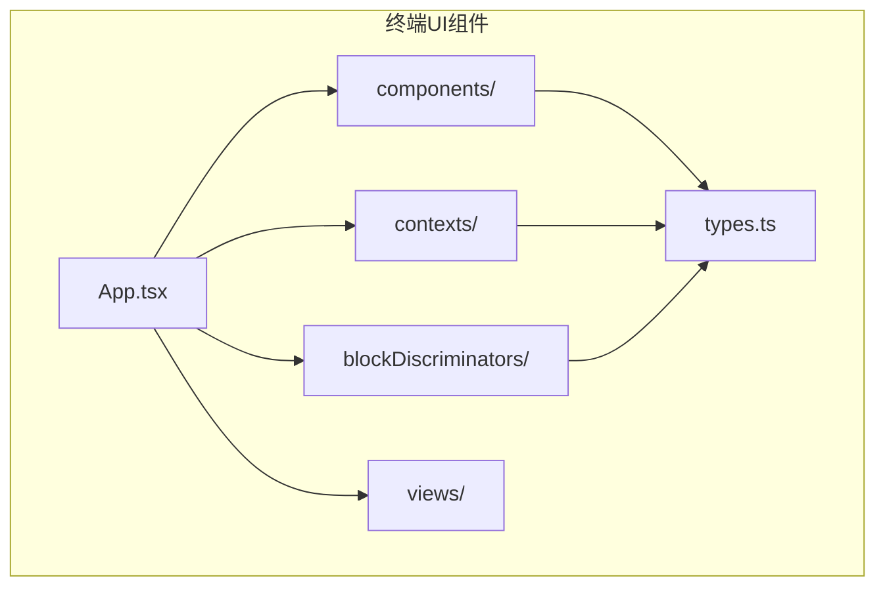
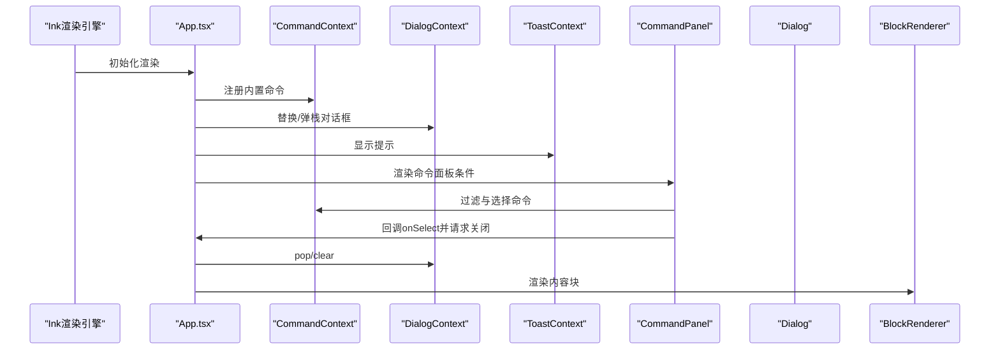
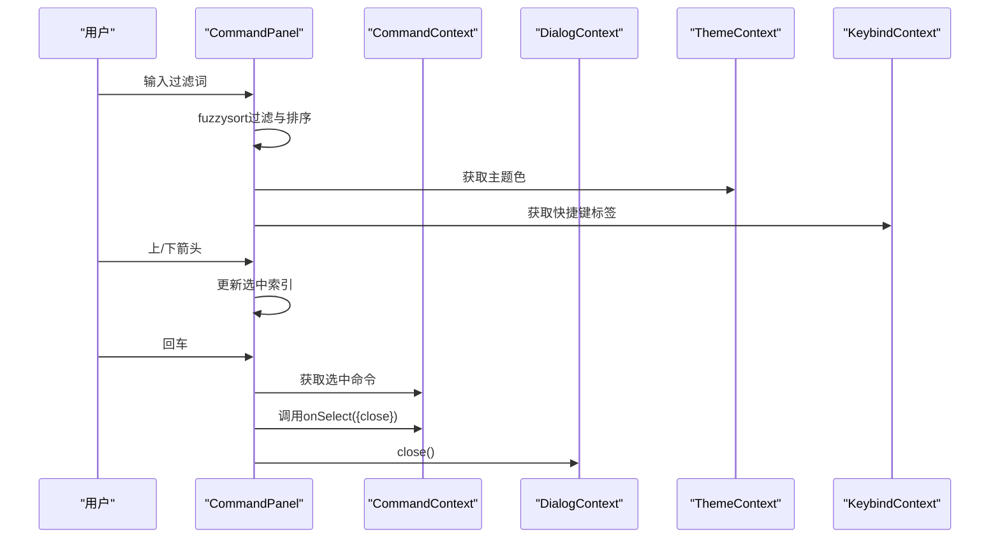
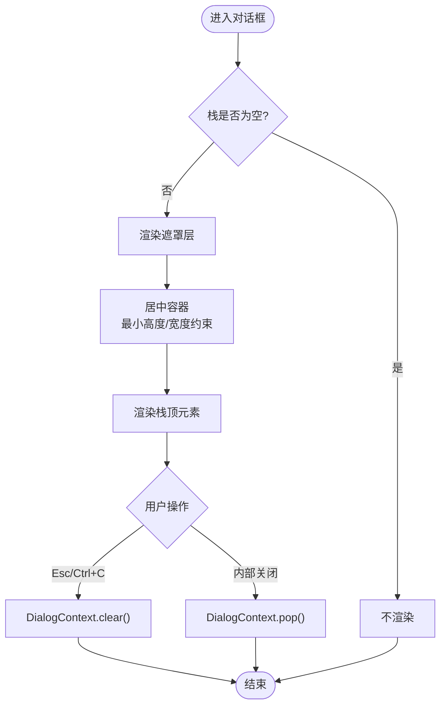
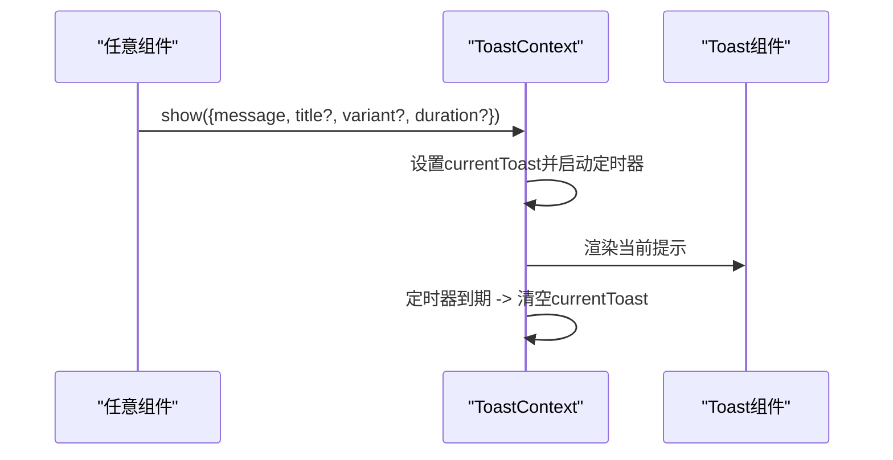
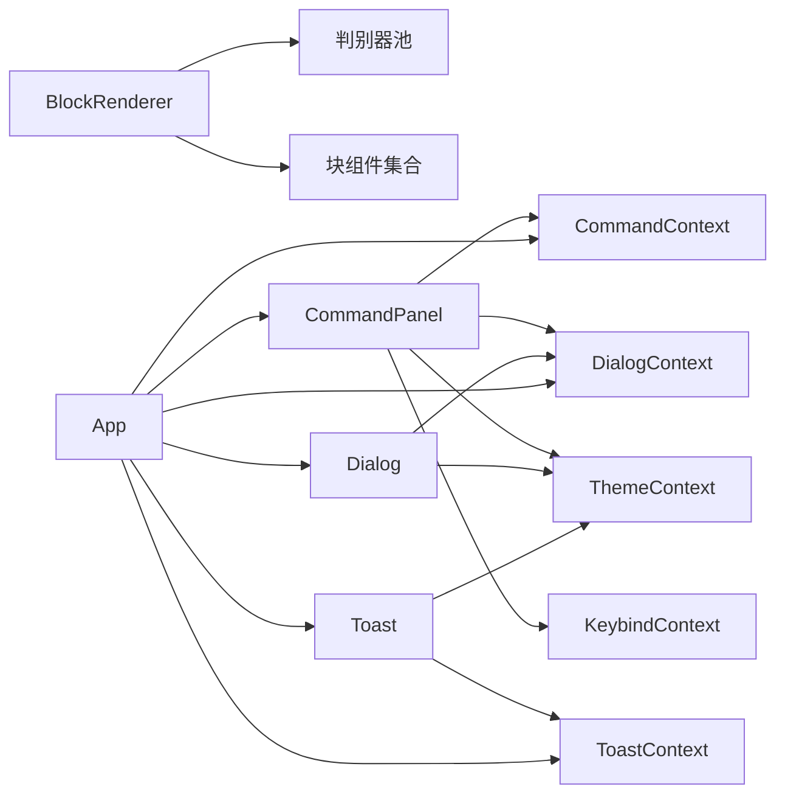

# 组件库

<cite>
**本文引用的文件**
- [terminal-ui/src/components/blocks/index.ts](file://terminal-ui/src/components/blocks/index.ts)
- [terminal-ui/src/components/blocks/BlockRenderer.tsx](file://terminal-ui/src/components/blocks/BlockRenderer.tsx)
- [terminal-ui/src/blockDiscriminators/index.ts](file://terminal-ui/src/blockDiscriminators/index.ts)
- [terminal-ui/src/types.ts](file://terminal-ui/src/types.ts)
- [terminal-ui/src/components/CommandPanel.tsx](file://terminal-ui/src/components/CommandPanel.tsx)
- [terminal-ui/src/contexts/CommandContext.tsx](file://terminal-ui/src/contexts/CommandContext.tsx)
- [terminal-ui/src/components/Dialog.tsx](file://terminal-ui/src/components/Dialog.tsx)
- [terminal-ui/src/contexts/DialogContext.tsx](file://terminal-ui/src/contexts/DialogContext.tsx)
- [terminal-ui/src/components/Toast.tsx](file://terminal-ui/src/components/Toast.tsx)
- [terminal-ui/src/contexts/ToastContext.tsx](file://terminal-ui/src/contexts/ToastContext.tsx)
- [terminal-ui/src/contexts/ThemeContext.tsx](file://terminal-ui/src/contexts/ThemeContext.tsx)
- [terminal-ui/src/App.tsx](file://terminal-ui/src/App.tsx)
- [terminal-ui/src/components/blocks/ApiBlock.tsx](file://terminal-ui/src/components/blocks/ApiBlock.tsx)
- [terminal-ui/src/components/blocks/CodeBlock.tsx](file://terminal-ui/src/components/blocks/CodeBlock.tsx)
- [terminal-ui/src/components/blocks/TableBlock.tsx](file://terminal-ui/src/components/blocks/TableBlock.tsx)
</cite>

## 目录
1. [简介](#简介)
2. [项目结构](#项目结构)
3. [核心组件](#核心组件)
4. [架构总览](#架构总览)
5. [详细组件分析](#详细组件分析)
6. [依赖关系分析](#依赖关系分析)
7. [性能考量](#性能考量)
8. [故障排查指南](#故障排查指南)
9. [结论](#结论)
10. [附录](#附录)

## 简介
本文件面向Secbot命令行界面组件库，系统性梳理基于Ink构建的UI组件体系，重点覆盖以下方面：
- 基础与复合块组件的设计理念与渲染机制
- blocks组件系统：类型判别、渲染分发与扩展方式
- CommandPanel命令面板：输入过滤、自动补全与执行流程
- Dialog对话框系统：模态、确认与配置对话框的通用模式
- Toast提示系统：状态与生命周期管理
- 组件属性接口、事件处理与样式定制
- 复用模式、性能优化与无障碍访问建议

## 项目结构
终端UI组件位于terminal-ui/src目录，采用按功能域划分的组织方式：
- components：可复用UI组件（含blocks子目录）
- contexts：全局上下文（命令、对话框、主题、键盘绑定等）
- blockDiscriminators：内容块类型判别器集合
- views：视图容器（HomeView、SessionView）
- 类型定义：types.ts
- 应用入口：App.tsx



图表来源
- [terminal-ui/src/App.tsx](file://terminal-ui/src/App.tsx#L1-L202)
- [terminal-ui/src/types.ts](file://terminal-ui/src/types.ts#L1-L75)

章节来源
- [terminal-ui/src/App.tsx](file://terminal-ui/src/App.tsx#L1-L202)
- [terminal-ui/src/types.ts](file://terminal-ui/src/types.ts#L1-L75)

## 核心组件
本节概述组件库的关键构件及其职责：
- 块渲染管线：BlockRenderer负责根据内容块类型分发到具体块组件
- 类型判别器：通过判别池（DiscriminatorPool）在运行时确定渲染类型
- 命令面板：CommandPanel提供命令筛选、高亮与执行
- 对话框系统：Dialog作为遮罩容器，配合DialogContext管理栈式弹窗
- 提示系统：Toast提供轻量反馈，结合ToastContext管理显示与消失
- 主题系统：ThemeContext提供赛博朋克风格的语义化颜色令牌

章节来源
- [terminal-ui/src/components/blocks/BlockRenderer.tsx](file://terminal-ui/src/components/blocks/BlockRenderer.tsx#L1-L150)
- [terminal-ui/src/blockDiscriminators/index.ts](file://terminal-ui/src/blockDiscriminators/index.ts#L1-L13)
- [terminal-ui/src/components/CommandPanel.tsx](file://terminal-ui/src/components/CommandPanel.tsx#L1-L92)
- [terminal-ui/src/components/Dialog.tsx](file://terminal-ui/src/components/Dialog.tsx#L1-L44)
- [terminal-ui/src/components/Toast.tsx](file://terminal-ui/src/components/Toast.tsx#L1-L24)
- [terminal-ui/src/contexts/ThemeContext.tsx](file://terminal-ui/src/contexts/ThemeContext.tsx#L1-L59)

## 架构总览
下图展示了应用启动后，输入事件、命令注册、对话框与块渲染的整体交互。



图表来源
- [terminal-ui/src/App.tsx](file://terminal-ui/src/App.tsx#L1-L202)
- [terminal-ui/src/contexts/CommandContext.tsx](file://terminal-ui/src/contexts/CommandContext.tsx#L1-L50)
- [terminal-ui/src/contexts/DialogContext.tsx](file://terminal-ui/src/contexts/DialogContext.tsx#L1-L63)
- [terminal-ui/src/contexts/ToastContext.tsx](file://terminal-ui/src/contexts/ToastContext.tsx#L1-L57)
- [terminal-ui/src/components/CommandPanel.tsx](file://terminal-ui/src/components/CommandPanel.tsx#L1-L92)
- [terminal-ui/src/components/Dialog.tsx](file://terminal-ui/src/components/Dialog.tsx#L1-L44)
- [terminal-ui/src/components/blocks/BlockRenderer.tsx](file://terminal-ui/src/components/blocks/BlockRenderer.tsx#L1-L150)

## 详细组件分析

### 块组件系统与渲染管线
- 设计理念
  - 将“内容块”抽象为统一的数据结构，通过类型判别器决定渲染组件
  - 支持Markdown正文渲染与占位文案识别，便于大文本折叠场景
- 类型判别与分发
  - 默认池：defaultPool.discriminate负责运行时判别
  - 分发器：BlockRenderer根据renderType映射到具体块组件
- 典型块组件
  - ApiBlock：REST/斜杠命令返回内容，带信息色标题栏
  - CodeBlock：代码片段，固定宽度字体与边框
  - TableBlock：表格渲染，基于Markdown解析

```mermaid
classDiagram
class BlockRenderer {
+props : BlockRendererProps
+render(block, noMargin)
}
class DiscriminatorPool {
+discriminate(block) BlockRenderType
}
class ApiBlock
class CodeBlock
class TableBlock
BlockRenderer --> DiscriminatorPool : "默认判别"
BlockRenderer --> ApiBlock : "渲染类型 : api"
BlockRenderer --> CodeBlock : "渲染类型 : code"
BlockRenderer --> TableBlock : "渲染类型 : table"
```

图表来源
- [terminal-ui/src/components/blocks/BlockRenderer.tsx](file://terminal-ui/src/components/blocks/BlockRenderer.tsx#L1-L150)
- [terminal-ui/src/blockDiscriminators/index.ts](file://terminal-ui/src/blockDiscriminators/index.ts#L1-L13)
- [terminal-ui/src/components/blocks/ApiBlock.tsx](file://terminal-ui/src/components/blocks/ApiBlock.tsx#L1-L28)
- [terminal-ui/src/components/blocks/CodeBlock.tsx](file://terminal-ui/src/components/blocks/CodeBlock.tsx#L1-L37)
- [terminal-ui/src/components/blocks/TableBlock.tsx](file://terminal-ui/src/components/blocks/TableBlock.tsx#L1-L25)

章节来源
- [terminal-ui/src/components/blocks/BlockRenderer.tsx](file://terminal-ui/src/components/blocks/BlockRenderer.tsx#L1-L150)
- [terminal-ui/src/components/blocks/index.ts](file://terminal-ui/src/components/blocks/index.ts#L1-L40)
- [terminal-ui/src/blockDiscriminators/index.ts](file://terminal-ui/src/blockDiscriminators/index.ts#L1-L13)
- [terminal-ui/src/types.ts](file://terminal-ui/src/types.ts#L47-L75)
- [terminal-ui/src/components/blocks/ApiBlock.tsx](file://terminal-ui/src/components/blocks/ApiBlock.tsx#L1-L28)
- [terminal-ui/src/components/blocks/CodeBlock.tsx](file://terminal-ui/src/components/blocks/CodeBlock.tsx#L1-L37)
- [terminal-ui/src/components/blocks/TableBlock.tsx](file://terminal-ui/src/components/blocks/TableBlock.tsx#L1-L25)

### CommandPanel命令面板
- 功能要点
  - 输入过滤：使用fuzzysort进行多字段模糊匹配（title/slash/category）
  - 导航与选择：上下箭头切换、回车执行
  - 分类展示：按类别分组显示，首屏限制条目数
  - 与上下文协作：读取命令列表、主题与键盘绑定，回调onSelect并请求关闭
- 交互流程



图表来源
- [terminal-ui/src/components/CommandPanel.tsx](file://terminal-ui/src/components/CommandPanel.tsx#L1-L92)
- [terminal-ui/src/contexts/CommandContext.tsx](file://terminal-ui/src/contexts/CommandContext.tsx#L1-L50)
- [terminal-ui/src/contexts/DialogContext.tsx](file://terminal-ui/src/contexts/DialogContext.tsx#L1-L63)
- [terminal-ui/src/contexts/ThemeContext.tsx](file://terminal-ui/src/contexts/ThemeContext.tsx#L1-L59)
- [terminal-ui/src/contexts/KeybindContext.tsx](file://terminal-ui/src/contexts/KeybindContext.tsx#L1-L50)

章节来源
- [terminal-ui/src/components/CommandPanel.tsx](file://terminal-ui/src/components/CommandPanel.tsx#L1-L92)
- [terminal-ui/src/contexts/CommandContext.tsx](file://terminal-ui/src/contexts/CommandContext.tsx#L1-L50)
- [terminal-ui/src/contexts/DialogContext.tsx](file://terminal-ui/src/contexts/DialogContext.tsx#L1-L63)
- [terminal-ui/src/contexts/ThemeContext.tsx](file://terminal-ui/src/contexts/ThemeContext.tsx#L1-L59)

### Dialog对话框系统
- 结构与行为
  - Dialog作为全屏遮罩容器，居中渲染栈顶元素
  - DialogContext维护栈：replace替换、pop弹栈、clear清空
  - Esc/Ctrl+C由App统一处理，避免与内部pop竞态
- 通用模式
  - 模态对话框：覆盖当前视图，阻断交互
  - 确认对话框：通过回调约定实现确认/取消
  - 配置对话框：承载复杂表单或设置面板



图表来源
- [terminal-ui/src/components/Dialog.tsx](file://terminal-ui/src/components/Dialog.tsx#L1-L44)
- [terminal-ui/src/contexts/DialogContext.tsx](file://terminal-ui/src/contexts/DialogContext.tsx#L1-L63)
- [terminal-ui/src/App.tsx](file://terminal-ui/src/App.tsx#L156-L175)

章节来源
- [terminal-ui/src/components/Dialog.tsx](file://terminal-ui/src/components/Dialog.tsx#L1-L44)
- [terminal-ui/src/contexts/DialogContext.tsx](file://terminal-ui/src/contexts/DialogContext.tsx#L1-L63)
- [terminal-ui/src/App.tsx](file://terminal-ui/src/App.tsx#L156-L175)

### Toast提示系统
- 设计原则
  - 轻量级反馈：背景面板 + 左侧/边框色彩区分变体
  - 生命周期：定时自动消失，错误/成功/警告/信息四种变体
- 使用方式
  - 通过ToastContext.show(options)触发
  - 错误统一转换为信息提示，便于一致性展示



图表来源
- [terminal-ui/src/components/Toast.tsx](file://terminal-ui/src/components/Toast.tsx#L1-L24)
- [terminal-ui/src/contexts/ToastContext.tsx](file://terminal-ui/src/contexts/ToastContext.tsx#L1-L57)

章节来源
- [terminal-ui/src/components/Toast.tsx](file://terminal-ui/src/components/Toast.tsx#L1-L24)
- [terminal-ui/src/contexts/ToastContext.tsx](file://terminal-ui/src/contexts/ToastContext.tsx#L1-L57)

### 主题与样式定制
- ThemeContext提供语义化颜色令牌，支持赛博朋克风格（主色绿+霓虹七彩）
- 组件通过useTheme读取颜色，实现主题一致的视觉表现
- 支持ThemeProvider传入部分主题覆盖，实现动态主题切换

章节来源
- [terminal-ui/src/contexts/ThemeContext.tsx](file://terminal-ui/src/contexts/ThemeContext.tsx#L1-L59)

## 依赖关系分析
- 组件间耦合
  - BlockRenderer依赖判别器池与块组件集合
  - CommandPanel依赖CommandContext、DialogContext、ThemeContext、KeybindContext
  - Dialog依赖DialogContext与ThemeContext
  - Toast依赖ToastContext与ThemeContext
  - App作为编排者，协调上下文与视图
- 外部依赖
  - Ink：终端UI渲染引擎
  - fuzzysort：命令面板的模糊匹配算法



图表来源
- [terminal-ui/src/components/blocks/BlockRenderer.tsx](file://terminal-ui/src/components/blocks/BlockRenderer.tsx#L1-L150)
- [terminal-ui/src/blockDiscriminators/index.ts](file://terminal-ui/src/blockDiscriminators/index.ts#L1-L13)
- [terminal-ui/src/components/CommandPanel.tsx](file://terminal-ui/src/components/CommandPanel.tsx#L1-L92)
- [terminal-ui/src/contexts/CommandContext.tsx](file://terminal-ui/src/contexts/CommandContext.tsx#L1-L50)
- [terminal-ui/src/contexts/DialogContext.tsx](file://terminal-ui/src/contexts/DialogContext.tsx#L1-L63)
- [terminal-ui/src/contexts/ToastContext.tsx](file://terminal-ui/src/contexts/ToastContext.tsx#L1-L57)
- [terminal-ui/src/contexts/ThemeContext.tsx](file://terminal-ui/src/contexts/ThemeContext.tsx#L1-L59)
- [terminal-ui/src/App.tsx](file://terminal-ui/src/App.tsx#L1-L202)

章节来源
- [terminal-ui/src/App.tsx](file://terminal-ui/src/App.tsx#L1-L202)
- [terminal-ui/src/components/blocks/BlockRenderer.tsx](file://terminal-ui/src/components/blocks/BlockRenderer.tsx#L1-L150)
- [terminal-ui/src/components/CommandPanel.tsx](file://terminal-ui/src/components/CommandPanel.tsx#L1-L92)
- [terminal-ui/src/components/Dialog.tsx](file://terminal-ui/src/components/Dialog.tsx#L1-L44)
- [terminal-ui/src/components/Toast.tsx](file://terminal-ui/src/components/Toast.tsx#L1-L24)

## 性能考量
- 命令面板
  - 使用useMemo缓存过滤结果与分组，避免重复计算
  - 限制首屏展示条目数，降低渲染压力
- 块渲染
  - 占位文案快速分支判断，减少不必要的Markdown解析
  - 判别器池集中管理，便于扩展与复用
- 对话框
  - 栈式管理避免深层嵌套渲染，仅渲染顶层元素
- 主题与样式
  - 通过ThemeContext集中管理颜色，减少重复计算与样式切换成本

章节来源
- [terminal-ui/src/components/CommandPanel.tsx](file://terminal-ui/src/components/CommandPanel.tsx#L21-L53)
- [terminal-ui/src/components/blocks/BlockRenderer.tsx](file://terminal-ui/src/components/blocks/BlockRenderer.tsx#L44-L46)
- [terminal-ui/src/components/Dialog.tsx](file://terminal-ui/src/components/Dialog.tsx#L18-L19)

## 故障排查指南
- 命令面板无响应
  - 检查CommandContext是否正确提供commands与register
  - 确认useInput事件未被其他组件拦截
- 对话框无法关闭
  - 确保Esc/Ctrl+C由App统一处理，避免内部pop与外部clear竞态
  - 检查DialogContext的pop/clear回调是否正确执行
- Toast不显示
  - 确认ToastProvider已包裹应用根节点
  - 检查show调用参数与默认时长
- 块渲染异常
  - 检查ContentBlock的resolvedType或判别器池是否正确
  - 确认Markdown渲染函数可用且输入合法

章节来源
- [terminal-ui/src/contexts/CommandContext.tsx](file://terminal-ui/src/contexts/CommandContext.tsx#L1-L50)
- [terminal-ui/src/contexts/DialogContext.tsx](file://terminal-ui/src/contexts/DialogContext.tsx#L1-L63)
- [terminal-ui/src/contexts/ToastContext.tsx](file://terminal-ui/src/contexts/ToastContext.tsx#L1-L57)
- [terminal-ui/src/components/blocks/BlockRenderer.tsx](file://terminal-ui/src/components/blocks/BlockRenderer.tsx#L1-L150)

## 结论
本组件库以Ink为基础，围绕内容块渲染、命令面板、对话框与提示系统构建了清晰的UI体系。通过判别器池与上下文解耦，实现了良好的可扩展性与可维护性。建议在后续迭代中进一步完善无障碍访问能力与单元测试覆盖，持续提升用户体验与稳定性。

## 附录
- 组件属性与事件接口概览
  - CommandPanel
    - 属性：无
    - 事件：通过CommandContext的onSelect回调触发
  - Dialog
    - 属性：width、height
    - 事件：由DialogContext控制栈顶元素渲染
  - Toast
    - 属性：无
    - 事件：由ToastContext控制显示与隐藏
  - 块组件（示例）
    - ApiBlock：title、body、noMargin
    - CodeBlock：title、body、noMargin、language
    - TableBlock：title、body、noMargin
- 样式定制
  - 通过ThemeProvider传入部分ThemeColors覆盖默认主题
  - 组件内部通过useTheme读取颜色令牌，保持视觉一致性

章节来源
- [terminal-ui/src/components/CommandPanel.tsx](file://terminal-ui/src/components/CommandPanel.tsx#L1-L92)
- [terminal-ui/src/components/Dialog.tsx](file://terminal-ui/src/components/Dialog.tsx#L1-L44)
- [terminal-ui/src/components/Toast.tsx](file://terminal-ui/src/components/Toast.tsx#L1-L24)
- [terminal-ui/src/components/blocks/ApiBlock.tsx](file://terminal-ui/src/components/blocks/ApiBlock.tsx#L1-L28)
- [terminal-ui/src/components/blocks/CodeBlock.tsx](file://terminal-ui/src/components/blocks/CodeBlock.tsx#L1-L37)
- [terminal-ui/src/components/blocks/TableBlock.tsx](file://terminal-ui/src/components/blocks/TableBlock.tsx#L1-L25)
- [terminal-ui/src/contexts/ThemeContext.tsx](file://terminal-ui/src/contexts/ThemeContext.tsx#L1-L59)