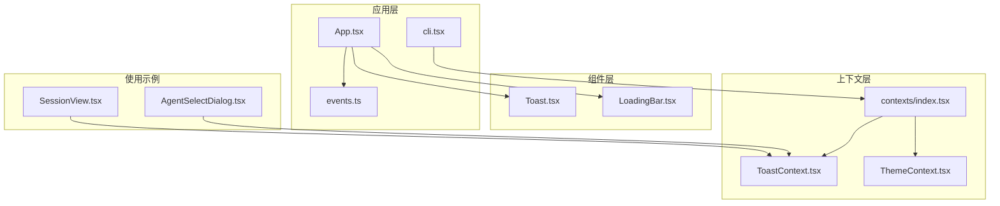
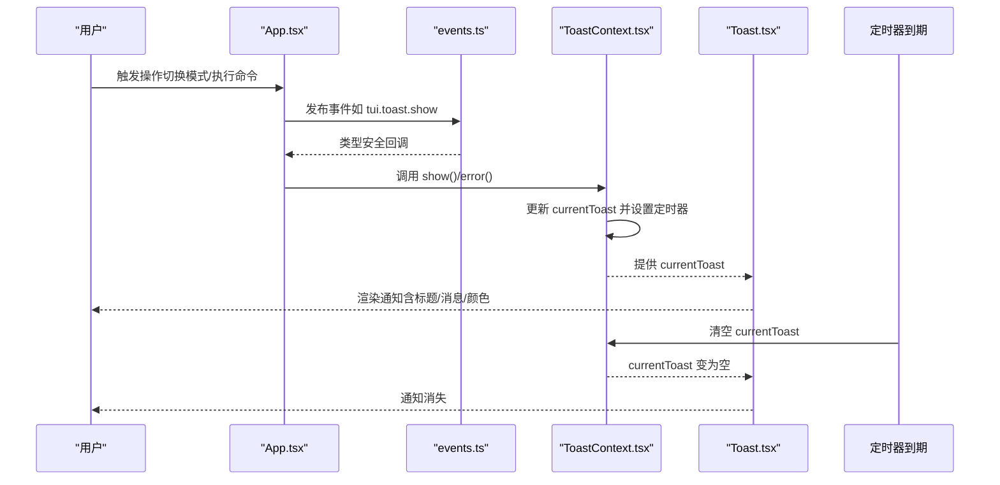
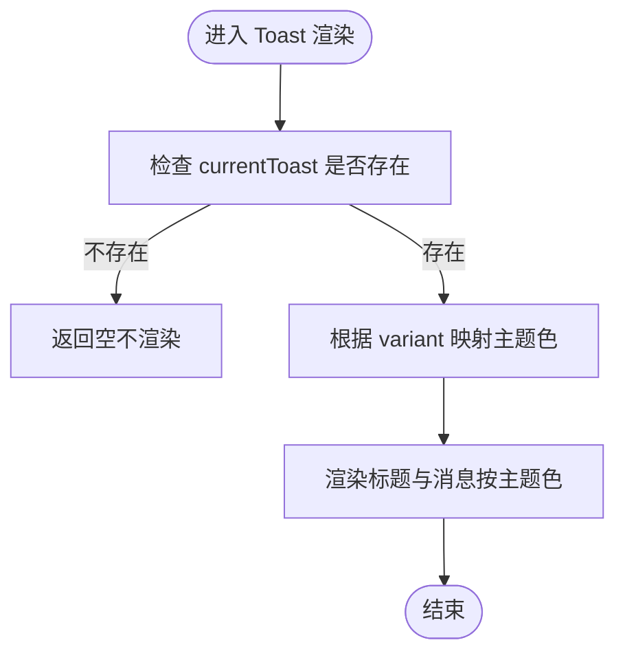
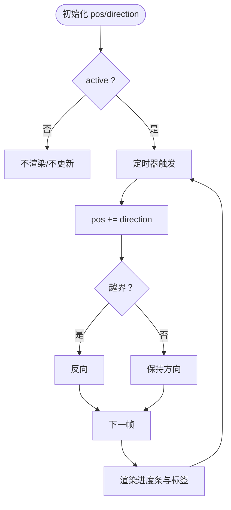
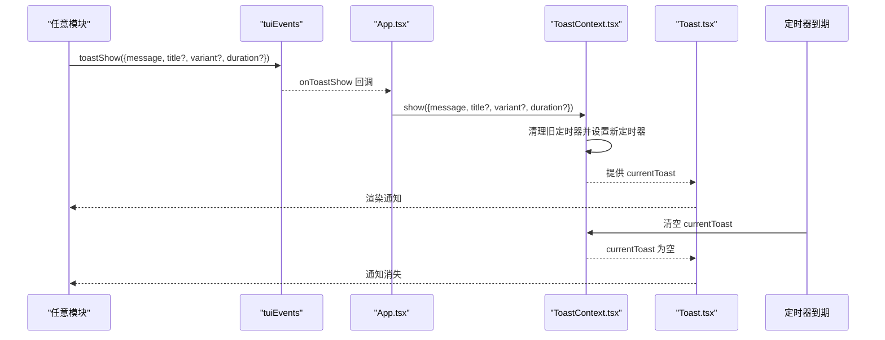
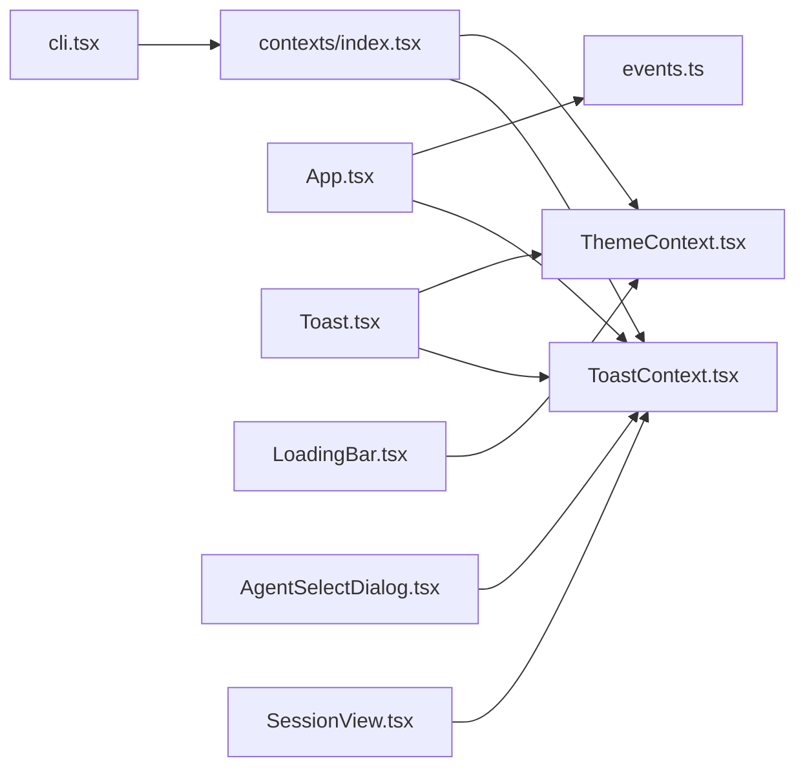

# 通知系统

<cite>
**本文引用的文件**
- [Toast.tsx](file://terminal-ui/src/components/Toast.tsx)
- [ToastContext.tsx](file://terminal-ui/src/contexts/ToastContext.tsx)
- [LoadingBar.tsx](file://terminal-ui/src/components/LoadingBar.tsx)
- [ThemeContext.tsx](file://terminal-ui/src/contexts/ThemeContext.tsx)
- [index.tsx](file://terminal-ui/src/contexts/index.tsx)
- [App.tsx](file://terminal-ui/src/App.tsx)
- [events.ts](file://terminal-ui/src/events.ts)
- [cli.tsx](file://terminal-ui/src/cli.tsx)
- [AgentSelectDialog.tsx](file://terminal-ui/src/components/AgentSelectDialog.tsx)
- [SessionView.tsx](file://terminal-ui/src/views/SessionView.tsx)
</cite>

## 目录
1. [简介](#简介)
2. [项目结构](#项目结构)
3. [核心组件](#核心组件)
4. [架构总览](#架构总览)
5. [组件详解](#组件详解)
6. [依赖关系分析](#依赖关系分析)
7. [性能考量](#性能考量)
8. [故障排查指南](#故障排查指南)
9. [结论](#结论)
10. [附录](#附录)

## 简介
本文件面向Secbot终端用户界面（TUI）的通知系统，围绕以下目标展开：  
- 全面解析Toast提示组件的设计与实现  
- 深入说明ToastContext上下文系统的作用与使用方式  
- 讲解LoadingBar加载条组件的功能与实现要点  
- 解释通知系统的消息队列管理、显示时机控制与自动消失机制  
- 提供通知类型定义与样式定制方案  
- 涵盖通知的动画效果、位置管理与用户交互处理  
- 总结最佳实践与性能优化建议  

## 项目结构
通知系统位于terminal-ui子项目中，采用React+Ink构建终端UI。关键文件分布如下：
- 组件层：Toast.tsx、LoadingBar.tsx
- 上下文层：ToastContext.tsx、ThemeContext.tsx、contexts/index.tsx
- 应用入口与事件：App.tsx、events.ts、cli.tsx
- 使用示例：AgentSelectDialog.tsx、SessionView.tsx



图表来源
- [ToastContext.tsx](file://terminal-ui/src/contexts/ToastContext.tsx#L22-L50)
- [ThemeContext.tsx](file://terminal-ui/src/contexts/ThemeContext.tsx#L41-L58)
- [index.tsx](file://terminal-ui/src/contexts/index.tsx#L17-L47)
- [Toast.tsx](file://terminal-ui/src/components/Toast.tsx#L7-L23)
- [LoadingBar.tsx](file://terminal-ui/src/components/LoadingBar.tsx#L30-L73)
- [App.tsx](file://terminal-ui/src/App.tsx#L26-L201)
- [events.ts](file://terminal-ui/src/events.ts#L82-L91)
- [cli.tsx](file://terminal-ui/src/cli.tsx#L102-L108)
- [AgentSelectDialog.tsx](file://terminal-ui/src/components/AgentSelectDialog.tsx#L35-L72)
- [SessionView.tsx](file://terminal-ui/src/views/SessionView.tsx#L330-L374)

章节来源
- [index.tsx](file://terminal-ui/src/contexts/index.tsx#L1-L63)
- [cli.tsx](file://terminal-ui/src/cli.tsx#L102-L108)

## 核心组件
- Toast提示组件：基于当前上下文显示单条通知，支持标题、消息、变体（成功/错误/警告/信息）与主题颜色映射。
- Toast上下文：提供show与error方法，内部维护currentToast与定时器，实现自动消失与并发覆盖。
- LoadingBar加载条：在任务执行期间显示带动画的进度指示，支持阶段标签与细节描述。
- 主题上下文：统一管理赛博朋克风格的语义化色彩令牌，为通知与加载条提供配色。

章节来源
- [Toast.tsx](file://terminal-ui/src/components/Toast.tsx#L1-L24)
- [ToastContext.tsx](file://terminal-ui/src/contexts/ToastContext.tsx#L1-L57)
- [LoadingBar.tsx](file://terminal-ui/src/components/LoadingBar.tsx#L1-L74)
- [ThemeContext.tsx](file://terminal-ui/src/contexts/ThemeContext.tsx#L1-L59)

## 架构总览
通知系统采用“上下文+组件”的分层设计：
- 上下文层负责状态与行为（显示/隐藏、定时清理）
- 组件层负责渲染（文本、颜色、布局）
- 应用层通过事件总线与命令系统触发通知
- 主题层提供统一配色



图表来源
- [App.tsx](file://terminal-ui/src/App.tsx#L57-L66)
- [events.ts](file://terminal-ui/src/events.ts#L82-L91)
- [ToastContext.tsx](file://terminal-ui/src/contexts/ToastContext.tsx#L22-L50)
- [Toast.tsx](file://terminal-ui/src/components/Toast.tsx#L7-L23)

## 组件详解

### Toast提示组件
- 设计要点
  - 读取当前上下文中的通知对象，若为空则不渲染
  - 根据变体映射主题颜色，标题加粗显示，正文按主题文本色
  - 外观采用内边距与右外边距，便于在终端右上角定位
- 数据流
  - 输入：ToastOptions（标题、消息、变体、持续时间）
  - 输出：渲染文本块（标题/消息），颜色由主题决定
- 动画与消失
  - 由上下文定时器控制，到期自动清空
- 位置管理
  - 组件本身不负责定位，通常在App布局中通过容器边距控制位置



图表来源
- [Toast.tsx](file://terminal-ui/src/components/Toast.tsx#L7-L23)

章节来源
- [Toast.tsx](file://terminal-ui/src/components/Toast.tsx#L1-L24)

### Toast上下文系统
- 类型与选项
  - 变体枚举：success/error/warning/info
  - 选项接口：标题、消息（必填）、变体、持续时间
- 核心能力
  - show(options)：合并默认值（变体默认info、默认持续时间），更新currentToast，并启动定时器
  - error(err)：将错误转为字符串消息，以error变体显示
  - currentToast：当前待显示的通知对象
- 自动消失机制
  - 每次show都会清除之前的定时器，确保同一时刻只有一个通知存在
  - 定时器到期后清空currentToast
- 使用约束
  - 必须在ToastProvider作用域内使用useToast，否则抛错

```mermaid
classDiagram
class ToastContextValue {
+currentToast : ToastOptions | null
+show(options : ToastOptions) void
+error(err : unknown) void
}
class ToastProvider {
+state currentToast
+ref timerRef
+show(options) void
+error(err) void
}
class ToastOptions {
+title? : string
+message : string
+variant? : ToastVariant
+duration? : number
}
class ToastVariant {
<<enumeration>>
"success"
"error"
"warning"
"info"
}
ToastProvider --> ToastContextValue : "提供"
ToastContextValue --> ToastOptions : "持有"
ToastOptions --> ToastVariant : "使用"
```

图表来源
- [ToastContext.tsx](file://terminal-ui/src/contexts/ToastContext.tsx#L3-L16)
- [ToastContext.tsx](file://terminal-ui/src/contexts/ToastContext.tsx#L22-L50)

章节来源
- [ToastContext.tsx](file://terminal-ui/src/contexts/ToastContext.tsx#L1-L57)

### LoadingBar加载条组件
- 功能概述
  - 在任务执行期间显示带动画的进度条，支持阶段标签与细节描述
- 实现要点
  - 使用固定宽度与方向控制实现“光标”移动动画
  - 支持active开关、phase映射与detail优先策略
  - 颜色来自主题上下文
- 动画与性能
  - 通过定时器周期性更新光标位置，帧间隔固定
  - active为false时清理定时器，避免资源浪费



图表来源
- [LoadingBar.tsx](file://terminal-ui/src/components/LoadingBar.tsx#L30-L73)

章节来源
- [LoadingBar.tsx](file://terminal-ui/src/components/LoadingBar.tsx#L1-L74)

### 主题上下文与样式定制
- 主题令牌
  - 包含primary/secondary/accent、error/warning/success/info、text/textMuted、background/backgroundPanel、border/borderActive以及cyberRainbow彩虹色板
- 定制方式
  - 通过ThemeProvider传入部分主题令牌进行覆盖
  - Toast与LoadingBar均从ThemeContext读取颜色
- 建议
  - 保持语义化命名，避免直接硬编码颜色
  - 在多处组件共享同一主题令牌，确保视觉一致性

章节来源
- [ThemeContext.tsx](file://terminal-ui/src/contexts/ThemeContext.tsx#L1-L59)

### 通知类型定义与样式定制方案
- 通知类型
  - 变体：success/error/warning/info
  - 选项：title、message（必填）、variant、duration
- 样式定制
  - 颜色：通过ThemeContext的语义令牌映射至具体颜色
  - 字体：标题加粗，正文按文本色渲染
  - 布局：组件内边距与右侧外边距，便于在终端右上角呈现
- 位置管理
  - 组件不负责绝对定位，通常由父容器（如App布局）通过边距控制位置
  - 可结合终端尺寸动态调整

章节来源
- [ToastContext.tsx](file://terminal-ui/src/contexts/ToastContext.tsx#L3-L10)
- [Toast.tsx](file://terminal-ui/src/components/Toast.tsx#L10-L21)
- [ThemeContext.tsx](file://terminal-ui/src/contexts/ThemeContext.tsx#L22-L37)

### 通知系统的消息队列管理、显示时机与自动消失
- 队列管理
  - 系统采用“单通知”模型：currentToast仅保存一条待显示通知
  - show调用会取消旧定时器并替换为新通知，实现“后入覆盖”
- 显示时机
  - 应用层通过事件总线发布通知请求，App监听后调用上下文show
  - 组件层在每次渲染时读取currentToast并渲染
- 自动消失
  - 默认持续时间为常量，可通过选项覆盖
  - 定时器到期后清空currentToast，组件随之消失



图表来源
- [events.ts](file://terminal-ui/src/events.ts#L82-L91)
- [App.tsx](file://terminal-ui/src/App.tsx#L57-L66)
- [ToastContext.tsx](file://terminal-ui/src/contexts/ToastContext.tsx#L26-L38)
- [Toast.tsx](file://terminal-ui/src/components/Toast.tsx#L7-L10)

章节来源
- [events.ts](file://terminal-ui/src/events.ts#L1-L92)
- [App.tsx](file://terminal-ui/src/App.tsx#L57-L66)
- [ToastContext.tsx](file://terminal-ui/src/contexts/ToastContext.tsx#L20-L38)

### 用户交互处理
- 错误处理
  - error方法接收任意异常，自动提取消息并以error变体显示
- 命令与模式切换
  - 应用层注册命令时，成功切换模式后通过Toast反馈
- 对话选择
  - AgentSelectDialog在确认切换后显示成功通知

章节来源
- [ToastContext.tsx](file://terminal-ui/src/contexts/ToastContext.tsx#L40-L43)
- [App.tsx](file://terminal-ui/src/App.tsx#L69-L72)
- [AgentSelectDialog.tsx](file://terminal-ui/src/components/AgentSelectDialog.tsx#L35-L44)

## 依赖关系分析
- Provider树顺序
  - Exit → Toast → Route → SDK → Sync → Theme → Local → Keybind → Dialog → Command → App
  - ToastProvider位于较上层，确保Toast组件可被全局访问
- 组件依赖
  - Toast依赖ToastContext与ThemeContext
  - LoadingBar依赖ThemeContext
  - App同时依赖Toast与事件总线
- 事件与上下文耦合
  - 事件总线提供类型安全的跨模块通信
  - 上下文提供状态与副作用（定时器）



图表来源
- [cli.tsx](file://terminal-ui/src/cli.tsx#L102-L108)
- [index.tsx](file://terminal-ui/src/contexts/index.tsx#L17-L47)
- [ToastContext.tsx](file://terminal-ui/src/contexts/ToastContext.tsx#L22-L50)
- [ThemeContext.tsx](file://terminal-ui/src/contexts/ThemeContext.tsx#L41-L58)
- [App.tsx](file://terminal-ui/src/App.tsx#L26-L201)
- [events.ts](file://terminal-ui/src/events.ts#L82-L91)
- [Toast.tsx](file://terminal-ui/src/components/Toast.tsx#L1-L24)
- [LoadingBar.tsx](file://terminal-ui/src/components/LoadingBar.tsx#L1-L74)
- [AgentSelectDialog.tsx](file://terminal-ui/src/components/AgentSelectDialog.tsx#L35-L72)
- [SessionView.tsx](file://terminal-ui/src/views/SessionView.tsx#L330-L374)

章节来源
- [index.tsx](file://terminal-ui/src/contexts/index.tsx#L1-L63)
- [cli.tsx](file://terminal-ui/src/cli.tsx#L102-L108)

## 性能考量
- 定时器管理
  - 每次show都会清理旧定时器，避免内存泄漏与重复定时器
- 渲染开销
  - Toast与LoadingBar均为轻量组件，渲染成本低
  - LoadingBar在非active状态下不渲染，减少无效计算
- 主题读取
  - ThemeContext为浅层提供/消费，读取开销极小
- 事件总线
  - 事件监听集合按类型分组，避免全局遍历

## 故障排查指南
- 未包裹在ToastProvider
  - 现象：调用useToast抛出错误
  - 排查：确认Provider树是否正确嵌套
- 通知不消失
  - 现象：通知停留在屏幕
  - 排查：检查duration参数与定时器是否被后续show重置
- 通知颜色异常
  - 现象：颜色不符合预期
  - 排查：检查ThemeContext提供的语义令牌是否被覆盖
- TTY/终端问题
  - 现象：无法进入TUI或渲染异常
  - 排查：参考启动脚本中的TTY检测与错误日志记录

章节来源
- [ToastContext.tsx](file://terminal-ui/src/contexts/ToastContext.tsx#L52-L56)
- [cli.tsx](file://terminal-ui/src/cli.tsx#L67-L126)

## 结论
Secbot通知系统以简洁高效的上下文+组件架构实现了终端场景下的通知与加载条功能。通过事件总线与Provider树，系统在保证类型安全的同时提供了良好的扩展性与可维护性。建议在实际使用中遵循语义化主题令牌、合理设置通知持续时间与位置管理策略，并注意定时器与渲染性能的平衡。

## 附录
- 使用示例路径
  - 模式切换通知：[App.tsx](file://terminal-ui/src/App.tsx#L69-L72)
  - 命令执行反馈：[SessionView.tsx](file://terminal-ui/src/views/SessionView.tsx#L337-L338)
  - 智能体切换反馈：[AgentSelectDialog.tsx](file://terminal-ui/src/components/AgentSelectDialog.tsx#L35-L44)
- 事件总线使用
  - 发布通知：[events.ts](file://terminal-ui/src/events.ts#L88-L88)
  - 订阅通知：[App.tsx](file://terminal-ui/src/App.tsx#L57-L60)