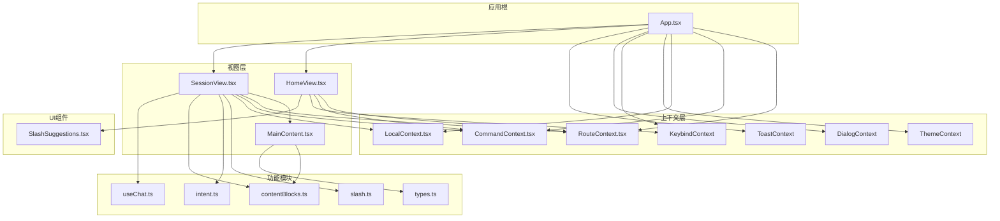
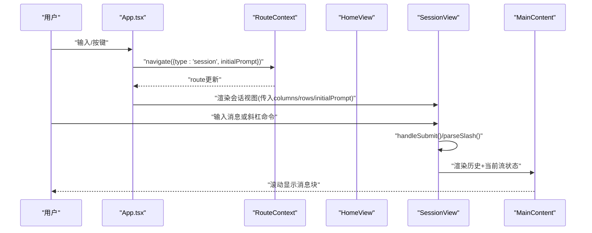
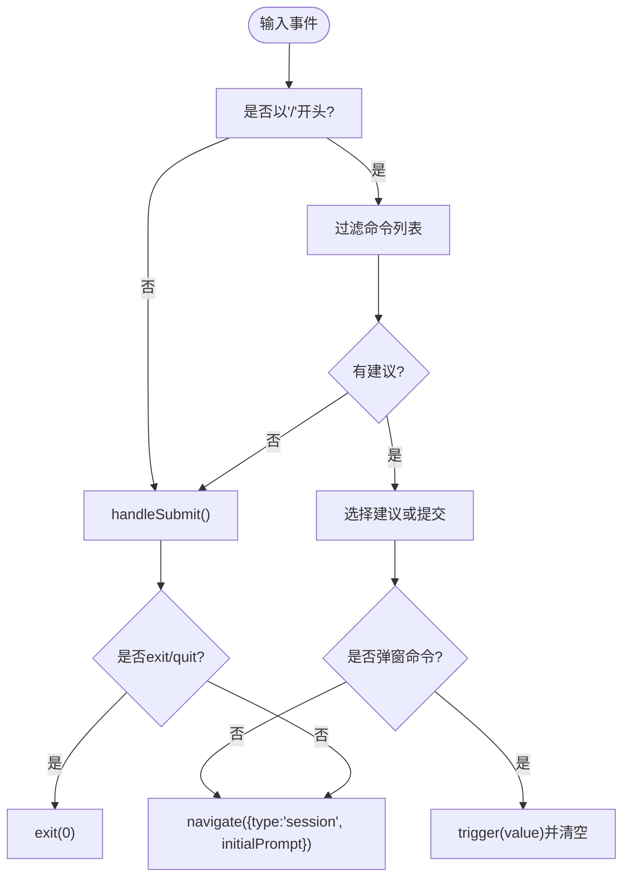
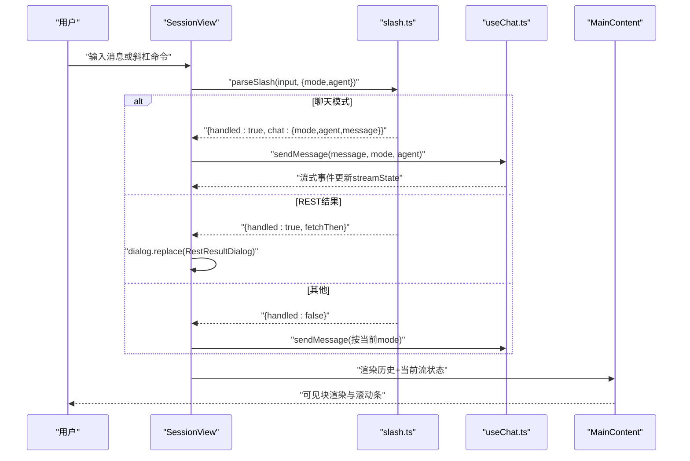
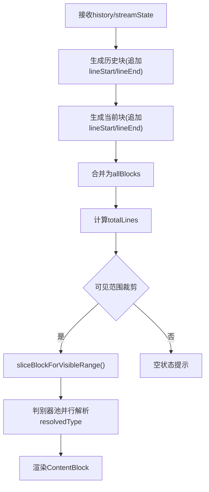
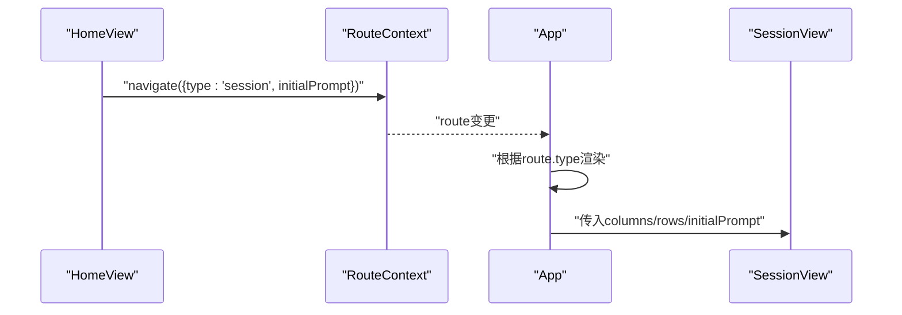
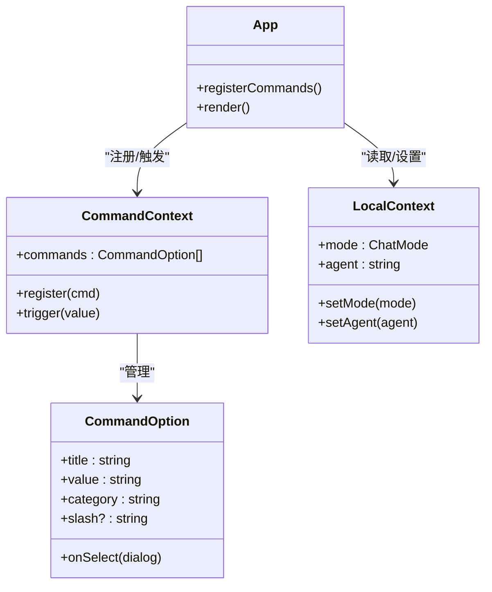
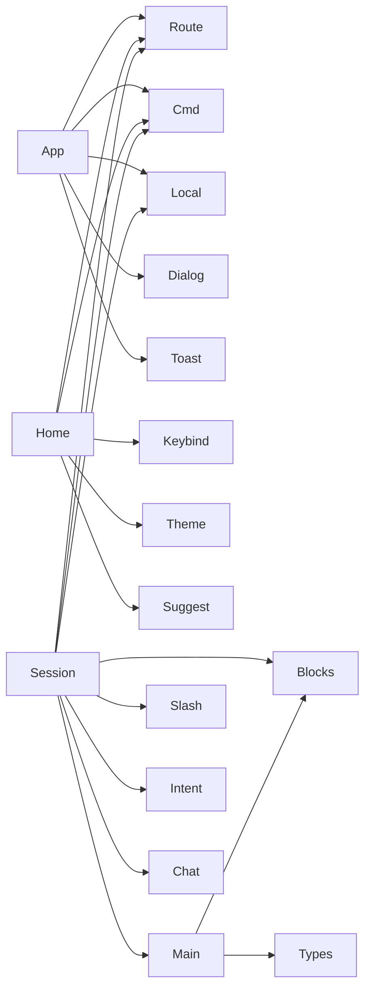

# 视图系统

<cite>
**本文引用的文件**
- [App.tsx](file://terminal-ui/src/App.tsx)
- [HomeView.tsx](file://terminal-ui/src/views/HomeView.tsx)
- [SessionView.tsx](file://terminal-ui/src/views/SessionView.tsx)
- [MainContent.tsx](file://terminal-ui/src/MainContent.tsx)
- [RouteContext.tsx](file://terminal-ui/src/contexts/RouteContext.tsx)
- [CommandContext.tsx](file://terminal-ui/src/contexts/CommandContext.tsx)
- [LocalContext.tsx](file://terminal-ui/src/contexts/LocalContext.tsx)
- [SlashSuggestions.tsx](file://terminal-ui/src/components/SlashSuggestions.tsx)
- [slash.ts](file://terminal-ui/src/slash.ts)
- [intent.ts](file://terminal-ui/src/intent.ts)
- [contentBlocks.ts](file://terminal-ui/src/contentBlocks.ts)
- [types.ts](file://terminal-ui/src/types.ts)
- [useChat.ts](file://terminal-ui/src/useChat.ts)
</cite>

## 目录
1. [引言](#引言)
2. [项目结构](#项目结构)
3. [核心组件](#核心组件)
4. [架构总览](#架构总览)
5. [组件详解](#组件详解)
6. [依赖关系分析](#依赖关系分析)
7. [性能考量](#性能考量)
8. [故障排查指南](#故障排查指南)
9. [结论](#结论)
10. [附录](#附录)

## 引言
本文件面向Secbot命令行界面（TUI）的视图系统，聚焦HomeView与SessionView两大核心视图组件，系统性阐述其设计架构、实现原理与交互机制。文档涵盖：
- 路由系统与视图切换机制
- 视图状态管理与生命周期
- 视图间通信与数据传递
- 渲染优化与性能策略
- 布局设计原则、响应式适配与用户体验优化
- 扩展指南与自定义视图开发模式

## 项目结构
终端UI采用React Ink构建，视图系统位于terminal-ui/src目录，核心文件如下：
- App.tsx：应用入口，负责尺寸监听、命令注册、路由渲染与全局事件桥接
- views/HomeView.tsx：首页视图，负责ASCII标题、输入与斜杠命令建议
- views/SessionView.tsx：会话视图，负责消息流渲染、滚动控制、命令处理与状态栏
- MainContent.tsx：消息主区域，负责块级内容渲染、滚动条与可见范围裁剪
- contexts/*：上下文提供者，包括路由、命令、本地状态、主题、键盘绑定、对话框等
- components/SlashSuggestions.tsx：斜杠命令建议面板
- slash.ts：斜杠命令解析与REST派发
- intent.ts：意图识别，决定是否以问答模式处理
- contentBlocks.ts：将流式状态转换为可渲染的内容块
- types.ts：SSE事件与流式状态类型定义
- useChat.ts：SSE连接与流式状态管理Hook

图表来源
- [App.tsx](file://terminal-ui/src/App.tsx#L26-L201)
- [HomeView.tsx](file://terminal-ui/src/views/HomeView.tsx#L30-L199)
- [SessionView.tsx](file://terminal-ui/src/views/SessionView.tsx#L30-L473)
- [MainContent.tsx](file://terminal-ui/src/MainContent.tsx#L52-L216)
- [RouteContext.tsx](file://terminal-ui/src/contexts/RouteContext.tsx#L1-L36)
- [CommandContext.tsx](file://terminal-ui/src/contexts/CommandContext.tsx#L1-L50)
- [LocalContext.tsx](file://terminal-ui/src/contexts/LocalContext.tsx#L1-L33)
- [SlashSuggestions.tsx](file://terminal-ui/src/components/SlashSuggestions.tsx#L19-L51)
- [slash.ts](file://terminal-ui/src/slash.ts#L42-L144)
- [intent.ts](file://terminal-ui/src/intent.ts#L29-L38)
- [contentBlocks.ts](file://terminal-ui/src/contentBlocks.ts#L43-L159)
- [types.ts](file://terminal-ui/src/types.ts#L19-L75)
- [useChat.ts](file://terminal-ui/src/useChat.ts#L31-L218)

章节来源
- [App.tsx](file://terminal-ui/src/App.tsx#L26-L201)

## 核心组件
- App.tsx：应用根组件，负责窗口尺寸监听、命令注册、路由渲染、全局事件桥接与对话框/吐司的顶层渲染。
- HomeView.tsx：首页视图，提供ASCII标题、输入框、斜杠命令建议、快捷键提示与底部状态栏。
- SessionView.tsx：会话视图，承载消息主区域、命令建议、输入行与底部状态栏，支持滚动控制、块展开与动态状态栏。
- MainContent.tsx：消息主区域，负责将流式状态切分为可见块、渲染滚动条、处理瞬时工具与可见范围裁剪。
- RouteContext.tsx：路由上下文，提供route与navigate，驱动App根据路由切换视图。
- CommandContext.tsx：命令上下文，集中注册/触发命令，支持斜杠命令与快捷操作。
- LocalContext.tsx：本地状态上下文，维护mode与agent等纯前端状态。
- SlashSuggestions.tsx：斜杠命令建议组件，两列展示命令与描述，高亮当前选择。
- slash.ts：斜杠命令解析与REST派发，区分聊天模式与REST结果展示。
- intent.ts：意图识别，判断问候或非任务输入，决定使用问答模式。
- contentBlocks.ts：将StreamState转换为ContentBlock，支持折叠、截断与占位。
- types.ts：SSE事件与流式状态类型定义。
- useChat.ts：SSE连接与流式状态管理，负责事件分发、历史记录与停止流。

章节来源
- [App.tsx](file://terminal-ui/src/App.tsx#L26-L201)
- [HomeView.tsx](file://terminal-ui/src/views/HomeView.tsx#L30-L199)
- [SessionView.tsx](file://terminal-ui/src/views/SessionView.tsx#L30-L473)
- [MainContent.tsx](file://terminal-ui/src/MainContent.tsx#L52-L216)
- [RouteContext.tsx](file://terminal-ui/src/contexts/RouteContext.tsx#L1-L36)
- [CommandContext.tsx](file://terminal-ui/src/contexts/CommandContext.tsx#L1-L50)
- [LocalContext.tsx](file://terminal-ui/src/contexts/LocalContext.tsx#L1-L33)
- [SlashSuggestions.tsx](file://terminal-ui/src/components/SlashSuggestions.tsx#L19-L51)
- [slash.ts](file://terminal-ui/src/slash.ts#L42-L144)
- [intent.ts](file://terminal-ui/src/intent.ts#L29-L38)
- [contentBlocks.ts](file://terminal-ui/src/contentBlocks.ts#L43-L159)
- [types.ts](file://terminal-ui/src/types.ts#L19-L75)
- [useChat.ts](file://terminal-ui/src/useChat.ts#L31-L218)

## 架构总览
视图系统采用“上下文提供者树 + 视图组件”的分层架构：
- 上下文层：Route、Command、Local、Theme、Keybind、Dialog、Toast等提供跨组件状态与能力。
- 视图层：App根据路由渲染HomeView或SessionView；SessionView内部组合MainContent与命令建议。
- 功能层：slash.ts解析斜杠命令，intent.ts识别输入意图，contentBlocks.ts将流式状态转为块，useChat.ts管理SSE流。
- 事件层：App统一监听全局输入与事件，触发命令、切换视图、弹窗与吐司。

图表来源
- [App.tsx](file://terminal-ui/src/App.tsx#L192-L196)
- [RouteContext.tsx](file://terminal-ui/src/contexts/RouteContext.tsx#L21-L29)
- [HomeView.tsx](file://terminal-ui/src/views/HomeView.tsx#L95-L96)
- [SessionView.tsx](file://terminal-ui/src/views/SessionView.tsx#L297-L373)
- [MainContent.tsx](file://terminal-ui/src/MainContent.tsx#L52-L216)

## 组件详解

### HomeView：首页视图
- 职责
  - 居中展示ASCII标题（多字体降级）
  - 主输入区与斜杠命令建议
  - 快捷键提示与底部状态栏
  - 通过路由导航至会话视图
- 关键实现要点
  - 输入处理：支持上下箭头选择建议、回车提交、ESC清空；斜杠命令优先处理
  - 建议筛选：基于输入前缀过滤命令，限制数量
  - 导航：当输入非斜杠或唯一匹配斜杠时，调用navigate进入会话
  - 退出：输入exit/quit触发退出
- 生命周期与渲染优化
  - 使用useEffect重置建议索引
  - useMemo缓存建议列表
  - useCallback封装提交逻辑，减少重渲染

图表来源
- [HomeView.tsx](file://terminal-ui/src/views/HomeView.tsx#L51-L99)
- [RouteContext.tsx](file://terminal-ui/src/contexts/RouteContext.tsx#L12-L15)

章节来源
- [HomeView.tsx](file://terminal-ui/src/views/HomeView.tsx#L30-L199)

### SessionView：会话视图
- 职责
  - 主消息区渲染与滚动控制
  - 斜杠命令建议与命令执行
  - 底部状态栏与快捷键提示
  - 彩虹动效与块展开/折叠
- 关键实现要点
  - 尺寸与滚动：根据rows计算内容高度，维护scrollOffset与totalLines，提供块级滚动与半页滚动
  - 命令处理：handleSubmit解析斜杠命令，区分聊天模式切换、REST结果展示与普通消息
  - 建议与输入：支持上下箭头选择、ESC清空；与HomeView一致的建议机制
  - 对话框：处理需要权限的请求（Root权限弹窗）、REST结果弹窗、模型配置弹窗
  - 初始提示：若路由携带initialPrompt，在首次渲染时自动发送
- 生命周期与渲染优化
  - useEffect注册滚动与快捷键命令
  - useMemo缓存块列表与建议列表
  - useCallback封装滚动与提交逻辑
  - useInput统一处理键盘事件

图表来源
- [SessionView.tsx](file://terminal-ui/src/views/SessionView.tsx#L297-L373)
- [slash.ts](file://terminal-ui/src/slash.ts#L42-L144)
- [useChat.ts](file://terminal-ui/src/useChat.ts#L62-L196)
- [MainContent.tsx](file://terminal-ui/src/MainContent.tsx#L52-L216)

章节来源
- [SessionView.tsx](file://terminal-ui/src/views/SessionView.tsx#L30-L473)

### MainContent：消息主区域
- 职责
  - 将历史与当前流状态转换为块列表
  - 可见范围裁剪与滚动条绘制
  - 块级渲染与瞬时工具处理
- 关键实现要点
  - 块生成：使用contentBlocks.ts将StreamState映射为ContentBlock，支持折叠与截断
  - 可见块：按scrollOffset与contentHeight裁剪，避免全量渲染
  - 滚动条：根据totalLines与scrollOffset绘制ASCII滚动条
  - 瞬时工具：完成即消失的工具（如system_info、network_analyze）在完成后短暂显示后移除
- 性能优化
  - 池化判别：将可见块分组交由判别器池并行处理，提升渲染效率
  - 惰性渲染：仅渲染可见块，减少节点数量
  - 行号计算：通过lineStart/lineEnd精确控制滚动与可见范围

图表来源
- [MainContent.tsx](file://terminal-ui/src/MainContent.tsx#L81-L148)
- [contentBlocks.ts](file://terminal-ui/src/contentBlocks.ts#L43-L159)
- [types.ts](file://terminal-ui/src/types.ts#L55-L75)

章节来源
- [MainContent.tsx](file://terminal-ui/src/MainContent.tsx#L52-L216)
- [contentBlocks.ts](file://terminal-ui/src/contentBlocks.ts#L43-L159)

### 路由系统与视图切换
- 路由上下文
  - RouteContext提供route与navigate，支持home与session两种类型
  - App根据route.type渲染HomeView或SessionView
- 切换流程
  - HomeView通过navigate进入会话，并可传入initialPrompt
  - App在渲染时根据route.type与对话框栈决定是否覆盖渲染
- 视图状态
  - SessionView接收columns/rows以适配终端尺寸
  - 初始提示通过route.initialPrompt传递

图表来源
- [RouteContext.tsx](file://terminal-ui/src/contexts/RouteContext.tsx#L12-L15)
- [App.tsx](file://terminal-ui/src/App.tsx#L192-L196)
- [HomeView.tsx](file://terminal-ui/src/views/HomeView.tsx#L95-L96)

章节来源
- [RouteContext.tsx](file://terminal-ui/src/contexts/RouteContext.tsx#L1-L36)
- [App.tsx](file://terminal-ui/src/App.tsx#L192-L196)

### 视图间通信与数据传递
- 命令系统
  - CommandContext集中注册命令，支持slash、category、keybind与onSelect回调
  - App在启动时注册常用命令（如/ask、/task、/agent、/help、/list-agents、/model、/tools）
  - 视图通过useCommand获取commands并触发trigger
- 本地状态
  - LocalContext维护mode与agent，影响消息发送与状态栏显示
- SSE与流式状态
  - useChat管理SSE连接，将事件分发到streamState，MainContent据此渲染
- 对话框与吐司
  - DialogContext与ToastContext在App顶层渲染，视图通过上下文触发

图表来源
- [CommandContext.tsx](file://terminal-ui/src/contexts/CommandContext.tsx#L12-L36)
- [LocalContext.tsx](file://terminal-ui/src/contexts/LocalContext.tsx#L8-L28)
- [App.tsx](file://terminal-ui/src/App.tsx#L69-L154)

章节来源
- [CommandContext.tsx](file://terminal-ui/src/contexts/CommandContext.tsx#L1-L50)
- [LocalContext.tsx](file://terminal-ui/src/contexts/LocalContext.tsx#L1-L33)
- [App.tsx](file://terminal-ui/src/App.tsx#L69-L154)

### 视图组件生命周期管理
- App
  - 监听终端resize，更新尺寸
  - 注册命令与全局事件
  - 渲染时根据路由与对话框栈决定渲染内容
- HomeView/SessionView
  - useInput处理键盘事件
  - useEffect注册快捷键命令与副作用
  - useMemo/callBack优化渲染
- MainContent
  - 计算可见块与滚动条，避免全量渲染
  - 处理瞬时工具的短暂显示与移除

章节来源
- [App.tsx](file://terminal-ui/src/App.tsx#L26-L201)
- [HomeView.tsx](file://terminal-ui/src/views/HomeView.tsx#L47-L74)
- [SessionView.tsx](file://terminal-ui/src/views/SessionView.tsx#L100-L118)
- [MainContent.tsx](file://terminal-ui/src/MainContent.tsx#L66-L132)

### 视图布局设计原则与响应式适配
- 布局原则
  - 采用Flex布局，主区域自适应，输入区与状态栏固定高度
  - 消息主区域支持垂直滚动与ASCII滚动条
  - 建议面板两列展示，高亮当前项
- 响应式适配
  - App监听终端尺寸变化，动态传入columns/rows
  - SessionView根据rows计算内容高度，确保滚动体验
  - MainContent按可见高度裁剪块，避免溢出

章节来源
- [App.tsx](file://terminal-ui/src/App.tsx#L28-L44)
- [SessionView.tsx](file://terminal-ui/src/views/SessionView.tsx#L63-L64)
- [MainContent.tsx](file://terminal-ui/src/MainContent.tsx#L150-L172)

### 用户体验优化
- 快捷键与提示
  - 底部状态栏显示当前mode与agent，支持快捷键提示
  - 彩虹动效增强视觉反馈
- 命令建议
  - 斜杠命令自动补全，支持上下选择与回车提交
- 滚动与定位
  - 支持首尾、半页、块级滚动与快速定位
- 状态反馈
  - 吐司提示与对话框展示REST结果与权限请求

章节来源
- [SessionView.tsx](file://terminal-ui/src/views/SessionView.tsx#L440-L470)
- [SlashSuggestions.tsx](file://terminal-ui/src/components/SlashSuggestions.tsx#L19-L51)
- [App.tsx](file://terminal-ui/src/App.tsx#L156-L175)

## 依赖关系分析
- 组件耦合
  - App对Route、Command、Local、Dialog、Toast强依赖，作为顶层协调者
  - HomeView/SessionView依赖Route、Command、Keybind、Theme、Dialog、Toast
  - SessionView依赖MainContent、slash.ts、intent.ts、contentBlocks.ts、useChat.ts
  - MainContent依赖contentBlocks.ts、types.ts、DiscriminatorPool
- 外部依赖
  - Ink（React Ink生态）
  - 自定义上下文与组件（Theme、Keybind、Dialog、Toast）
  - SSE事件流与REST API

图表来源
- [App.tsx](file://terminal-ui/src/App.tsx#L49-L54)
- [HomeView.tsx](file://terminal-ui/src/views/HomeView.tsx#L33-L35)
- [SessionView.tsx](file://terminal-ui/src/views/SessionView.tsx#L40-L61)
- [MainContent.tsx](file://terminal-ui/src/MainContent.tsx#L5-L7)

章节来源
- [App.tsx](file://terminal-ui/src/App.tsx#L49-L54)

## 性能考量
- 渲染优化
  - 惰性渲染：MainContent仅渲染可见块，避免全量渲染
  - 池化判别：将可见块分组交由判别器池并行处理
  - Memo化：useMemo缓存建议列表与块列表，减少重复计算
- 数据结构
  - ContentBlock携带lineStart/lineEnd，便于滚动与可见范围计算
  - StreamState按阶段聚合，便于增量渲染
- I/O与事件
  - useChat使用AbortController中断上一轮SSE，避免并发冲突
  - SSE事件按阶段更新，降低一次性渲染压力

章节来源
- [MainContent.tsx](file://terminal-ui/src/MainContent.tsx#L140-L148)
- [contentBlocks.ts](file://terminal-ui/src/contentBlocks.ts#L58-L70)
- [useChat.ts](file://terminal-ui/src/useChat.ts#L62-L196)

## 故障排查指南
- 无法进入会话
  - 检查HomeView的handleSubmit与navigate调用
  - 确认RouteContext的navigate可用
- 命令无效或未触发
  - 检查App的CommandProvider是否正确注册命令
  - 确认SessionView的handleSubmit对斜杠命令解析逻辑
- 消息不显示或滚动异常
  - 检查MainContent的visibleBlocks裁剪与scrollOffset计算
  - 确认useChat的streamState更新与toBottom逻辑
- 权限请求未弹窗
  - 检查useChat的root_required事件与DialogContext的replace逻辑

章节来源
- [HomeView.tsx](file://terminal-ui/src/views/HomeView.tsx#L76-L99)
- [App.tsx](file://terminal-ui/src/App.tsx#L69-L154)
- [SessionView.tsx](file://terminal-ui/src/views/SessionView.tsx#L297-L373)
- [MainContent.tsx](file://terminal-ui/src/MainContent.tsx#L134-L137)
- [useChat.ts](file://terminal-ui/src/useChat.ts#L168-L173)

## 结论
Secbot视图系统以清晰的上下文分层与视图职责划分，实现了从首页到会话的平滑切换与高效渲染。通过斜杠命令系统、意图识别与流式状态管理，系统在保证易用性的同时兼顾了性能与可扩展性。后续可在以下方面持续演进：
- 增加更多自定义视图的抽象接口与路由约定
- 丰富块渲染类型与判别器池能力
- 引入更细粒度的懒加载与缓存策略

## 附录
- 扩展指南与自定义视图开发模式
  - 新增视图：在views目录创建新组件，使用useRoute/useCommand/useLocal等上下文
  - 注册路由：在App中根据route.type渲染新视图
  - 命令扩展：通过CommandContext.register新增命令，支持slash、keybind与onSelect
  - 块渲染扩展：在contentBlocks.ts中增加新的块类型与渲染规则
  - 意图识别扩展：在intent.ts中添加新的问候或非任务模式识别规则
  - SSE事件扩展：在useChat.ts中新增事件分支与对应状态更新
- 布局与主题
  - 使用ThemeContext调整颜色与样式
  - 通过columns/rows参数适配不同终端尺寸
- 最佳实践
  - 使用useMemo/useCallback减少重渲染
  - 保持块结构的lineStart/lineEnd一致性
  - 对长文本进行截断与折叠，避免刷屏