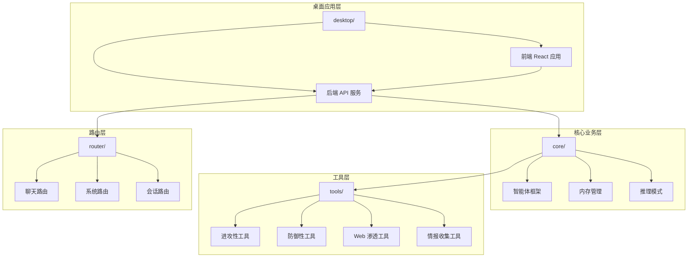
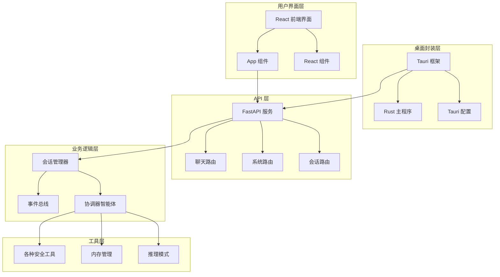
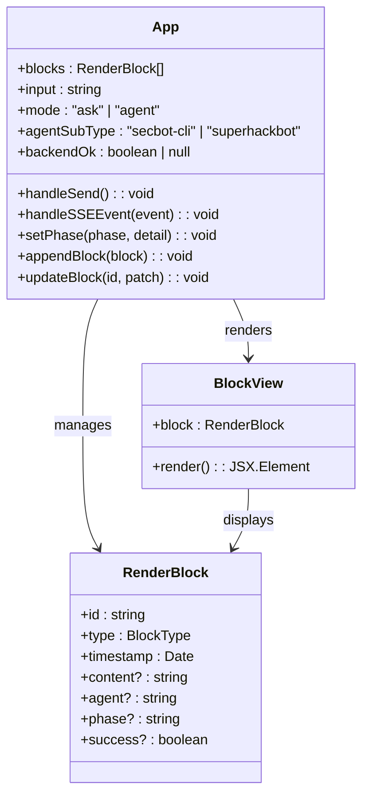
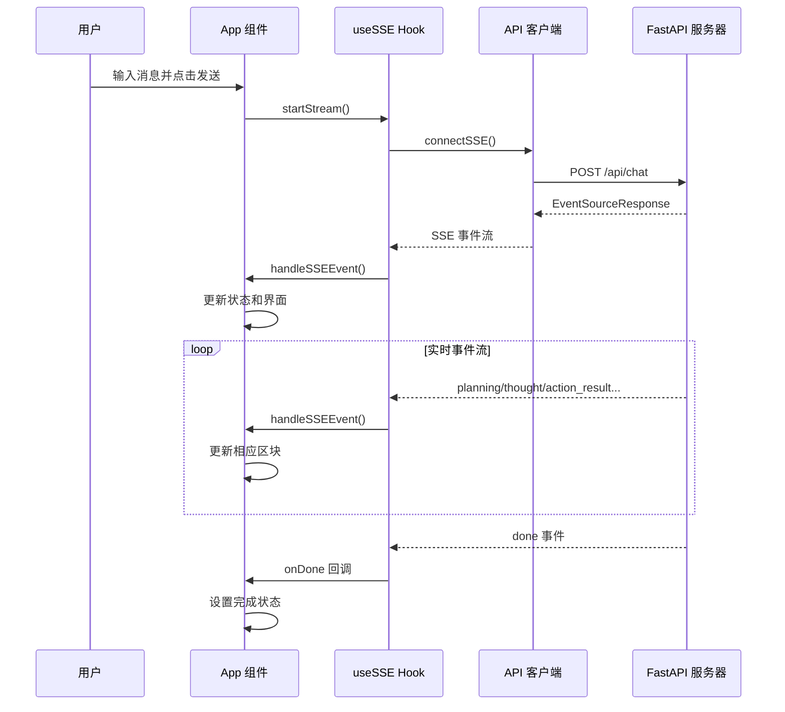
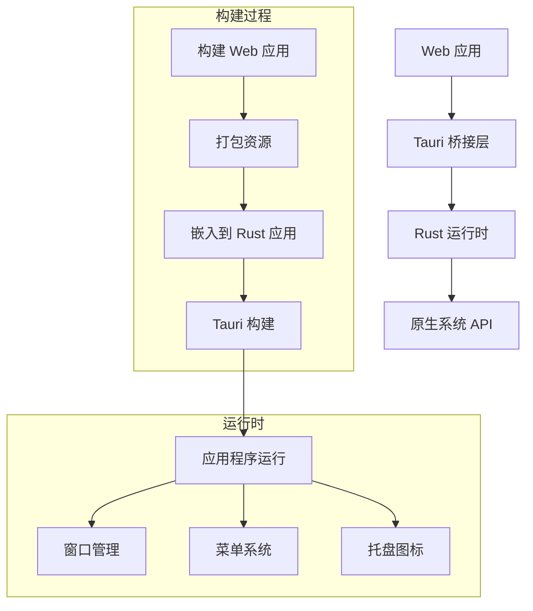
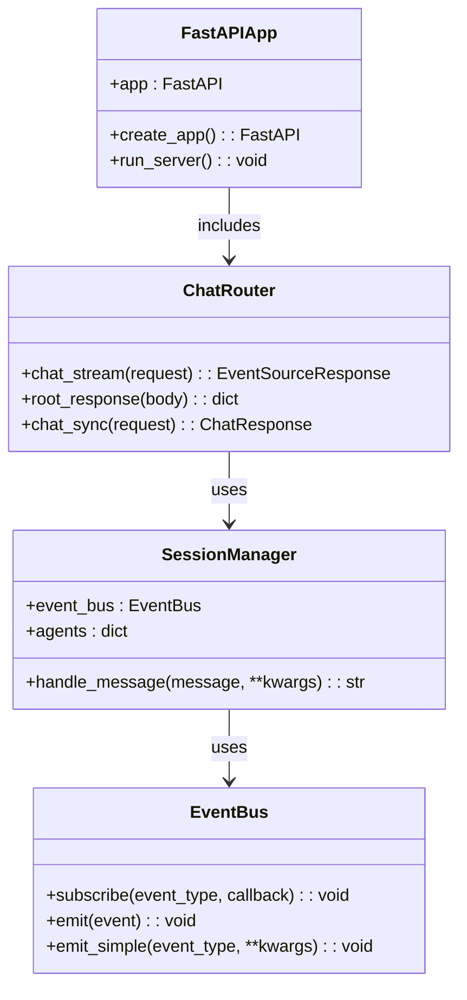
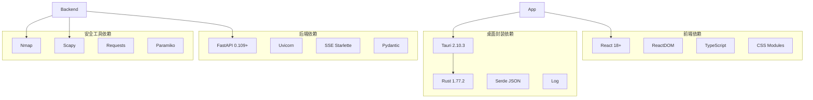

# 桌面应用程序

<cite>
**本文档引用的文件**
- [desktop/src/App.tsx](file://desktop/src/App.tsx)
- [desktop/src/main.tsx](file://desktop/src/main.tsx)
- [desktop/src/config.ts](file://desktop/src/config.ts)
- [desktop/src/types.ts](file://desktop/src/types.ts)
- [desktop/src/useSSE.ts](file://desktop/src/useSSE.ts)
- [desktop/src/api/sse.ts](file://desktop/src/api/sse.ts)
- [desktop/src/index.css](file://desktop/src/index.css)
- [desktop/src-tauri/src/main.rs](file://desktop/src-tauri/src/main.rs)
- [desktop/src-tauri/Cargo.toml](file://desktop/src-tauri/Cargo.toml)
- [desktop/src-tauri/tauri.conf.json](file://desktop/src-tauri/tauri.conf.json)
- [main.py](file://main.py)
- [router/main.py](file://router/main.py)
- [router/chat.py](file://router/chat.py)
- [core/agents/coordinator_agent.py](file://core/agents/coordinator_agent.py)
- [README.md](file://README.md)
</cite>

## 目录
1. [简介](#简介)
2. [项目结构](#项目结构)
3. [核心组件](#核心组件)
4. [架构概览](#架构概览)
5. [详细组件分析](#详细组件分析)
6. [依赖关系分析](#依赖关系分析)
7. [性能考虑](#性能考虑)
8. [故障排除指南](#故障排除指南)
9. [结论](#结论)

## 简介

Secbot 桌面应用程序是一个基于 Tauri 框架构建的跨平台安全测试工具，结合了 React 前端和 Rust 后端，提供了一个现代化的桌面应用界面。该应用程序的核心功能是提供一个可视化的安全测试平台，支持多种智能体模式和工具调用。

应用程序采用前后端分离的设计架构，前端使用 React 和 TypeScript 构建，后端使用 Python FastAPI 提供 REST API 和 SSE 流式接口。通过 Tauri 框架，前端界面被封装成原生桌面应用程序，同时保持与后端的高效通信。

## 项目结构

该项目采用了模块化的组织方式，主要分为以下几个核心部分：



**图表来源**
- [README.md:126-210](file://README.md#L126-L210)

**章节来源**
- [README.md:416-440](file://README.md#L416-L440)

## 核心组件

### 前端应用架构

桌面应用程序的前端基于 React 构建，采用了现代化的状态管理和组件设计模式：

- **App 组件**: 主应用容器，负责管理聊天界面、SSE 事件处理和用户交互
- **SSE Hook**: 自定义 Hook 用于处理服务器推送事件
- **类型定义**: TypeScript 类型定义确保类型安全
- **样式系统**: CSS 变量和主题系统支持深色模式

### 后端 API 服务

后端采用 FastAPI 框架，提供 REST API 和 SSE 流式接口：

- **路由系统**: 模块化的路由设计，支持聊天、系统、会话等功能
- **事件总线**: 基于 EventBus 的事件驱动架构
- **会话管理**: SessionManager 负责会话编排和任务执行

### 桌面应用封装

使用 Tauri 框架将 Web 应用封装为原生桌面应用程序：

- **Rust 主程序**: 跨平台应用程序入口点
- **配置文件**: tauri.conf.json 定义应用程序属性和构建配置
- **依赖管理**: Cargo.toml 管理 Rust 依赖

**章节来源**
- [desktop/src/App.tsx:89-533](file://desktop/src/App.tsx#L89-L533)
- [router/main.py:19-72](file://router/main.py#L19-L72)
- [desktop/src-tauri/Cargo.toml:1-27](file://desktop/src-tauri/Cargo.toml#L1-L27)

## 架构概览

应用程序采用分层架构设计，实现了清晰的关注点分离：



**图表来源**
- [README.md:126-210](file://README.md#L126-L210)
- [router/chat.py:27-132](file://router/chat.py#L27-L132)
- [core/agents/coordinator_agent.py:40-98](file://core/agents/coordinator_agent.py#L40-L98)

## 详细组件分析

### App 组件分析

App 组件是桌面应用程序的核心，负责管理整个聊天界面的状态和交互：



**图表来源**
- [desktop/src/App.tsx:89-533](file://desktop/src/App.tsx#L89-L533)
- [desktop/src/types.ts:18-33](file://desktop/src/types.ts#L18-L33)

App 组件的主要功能包括：

1. **状态管理**: 管理聊天消息、用户输入、应用模式等状态
2. **SSE 事件处理**: 处理来自后端的服务器推送事件
3. **用户交互**: 处理用户的消息发送和界面交互
4. **界面渲染**: 根据不同的消息类型渲染相应的 UI 组件

**章节来源**
- [desktop/src/App.tsx:89-533](file://desktop/src/App.tsx#L89-L533)

### SSE 事件处理流程

应用程序使用服务器推送事件(SSE)实现实时通信：



**图表来源**
- [desktop/src/useSSE.ts:9-36](file://desktop/src/useSSE.ts#L9-L36)
- [desktop/src/api/sse.ts:34-140](file://desktop/src/api/sse.ts#L34-L140)
- [router/chat.py:134-271](file://router/chat.py#L134-L271)

**章节来源**
- [desktop/src/useSSE.ts:1-45](file://desktop/src/useSSE.ts#L1-L45)
- [desktop/src/api/sse.ts:1-140](file://desktop/src/api/sse.ts#L1-L140)

### 桌面应用封装机制

Tauri 框架负责将 Web 应用封装为原生桌面应用程序：



**图表来源**
- [desktop/src-tauri/src/main.rs:4-6](file://desktop/src-tauri/src/main.rs#L4-L6)
- [desktop/src-tauri/tauri.conf.json:1-38](file://desktop/src-tauri/tauri.conf.json#L1-L38)

**章节来源**
- [desktop/src-tauri/src/main.rs:1-7](file://desktop/src-tauri/src/main.rs#L1-L7)
- [desktop/src-tauri/Cargo.toml:1-27](file://desktop/src-tauri/Cargo.toml#L1-L27)
- [desktop/src-tauri/tauri.conf.json:1-38](file://desktop/src-tauri/tauri.conf.json#L1-L38)

### 后端 API 服务架构

后端采用 FastAPI 框架提供 REST API 和 SSE 流式接口：



**图表来源**
- [router/main.py:19-72](file://router/main.py#L19-L72)
- [router/chat.py:27-132](file://router/chat.py#L27-L132)
- [router/chat.py:189-197](file://router/chat.py#L189-L197)

**章节来源**
- [router/main.py:74-118](file://router/main.py#L74-L118)
- [router/chat.py:134-271](file://router/chat.py#L134-L271)

## 依赖关系分析

应用程序的依赖关系体现了清晰的分层架构：



**图表来源**
- [desktop/src-tauri/Cargo.toml:20-27](file://desktop/src-tauri/Cargo.toml#L20-L27)
- [router/main.py:5-16](file://router/main.py#L5-L16)

**章节来源**
- [README.md:506-516](file://README.md#L506-L516)
- [desktop/src-tauri/Cargo.toml:1-27](file://desktop/src-tauri/Cargo.toml#L1-L27)

## 性能考虑

应用程序在设计时考虑了多个性能优化方面：

### 前端性能优化

1. **状态管理优化**: 使用 React Hooks 进行细粒度状态管理，避免不必要的重新渲染
2. **虚拟滚动**: 对长列表使用虚拟滚动技术减少 DOM 元素数量
3. **懒加载**: 组件和路由的懒加载策略
4. **CSS 优化**: 使用 CSS 变量和预编译优化样式性能

### 后端性能优化

1. **异步处理**: 使用 asyncio 和异步编程模型提高并发性能
2. **事件驱动**: 基于事件总线的解耦架构，支持高并发处理
3. **内存管理**: 智能的内存使用和垃圾回收策略
4. **数据库优化**: SQLite 数据库的优化查询和连接池管理

### 网络性能优化

1. **SSE 流式传输**: 实现高效的实时通信
2. **连接复用**: HTTP 连接的复用和管理
3. **缓存策略**: 智能的缓存机制减少重复计算

## 故障排除指南

### 常见问题及解决方案

#### 后端服务未启动

**症状**: 桌面应用显示"后端未就绪"

**诊断步骤**:
1. 检查端口占用情况
2. 验证 Python 环境配置
3. 查看后端日志输出

**解决方法**:
```bash
# 检查端口占用
netstat -ano | findstr :8000

# 启动后端服务
uv run secbot-cli-server
# 或
python -m router.main
```

#### SSE 连接超时

**症状**: 应用显示连接超时错误

**诊断步骤**:
1. 验证网络连接
2. 检查防火墙设置
3. 确认后端服务状态

**解决方法**:
1. 确保后端服务在 127.0.0.1:8000 启动
2. 检查防火墙是否阻止本地连接
3. 重启后端服务

#### 桌面应用无法启动

**症状**: Tauri 应用无法正常启动

**诊断步骤**:
1. 检查 Rust 工具链版本
2. 验证依赖项安装
3. 查看构建日志

**解决方法**:
```bash
# 更新依赖
cargo update

# 清理并重新构建
cargo clean
cargo build

# 运行调试版本
cargo run
```

**章节来源**
- [router/main.py:101-109](file://router/main.py#L101-L109)
- [desktop/src/api/sse.ts:85-91](file://desktop/src/api/sse.ts#L85-L91)

## 结论

Secbot 桌面应用程序展现了现代桌面应用开发的最佳实践，通过合理的架构设计和技术选型，实现了功能丰富、性能优异的安全测试工具。

### 主要优势

1. **跨平台兼容**: 基于 Tauri 的原生桌面应用，支持 Windows、Linux 和 macOS
2. **实时通信**: 采用 SSE 技术实现高效的实时消息传递
3. **模块化设计**: 清晰的分层架构便于维护和扩展
4. **类型安全**: TypeScript 和 Rust 的类型系统确保代码质量
5. **性能优化**: 多层次的性能优化策略保证流畅的用户体验

### 技术亮点

- **前后端分离**: 前端使用 React，后端使用 Python FastAPI，职责清晰
- **事件驱动**: 基于 EventBus 的事件驱动架构，支持高并发处理
- **智能体系统**: 多智能体协作架构，支持复杂的自动化任务
- **工具集成**: 丰富的安全工具集成，提供完整的安全测试能力

### 未来发展

应用程序具备良好的扩展基础，可以进一步：
- 增强 AI 智能体的能力
- 扩展更多的安全工具
- 优化用户界面和交互体验
- 加强安全性和合规性

通过持续的技术演进和功能完善，Secbot 桌面应用程序将成为一个功能强大、易于使用的安全测试平台。