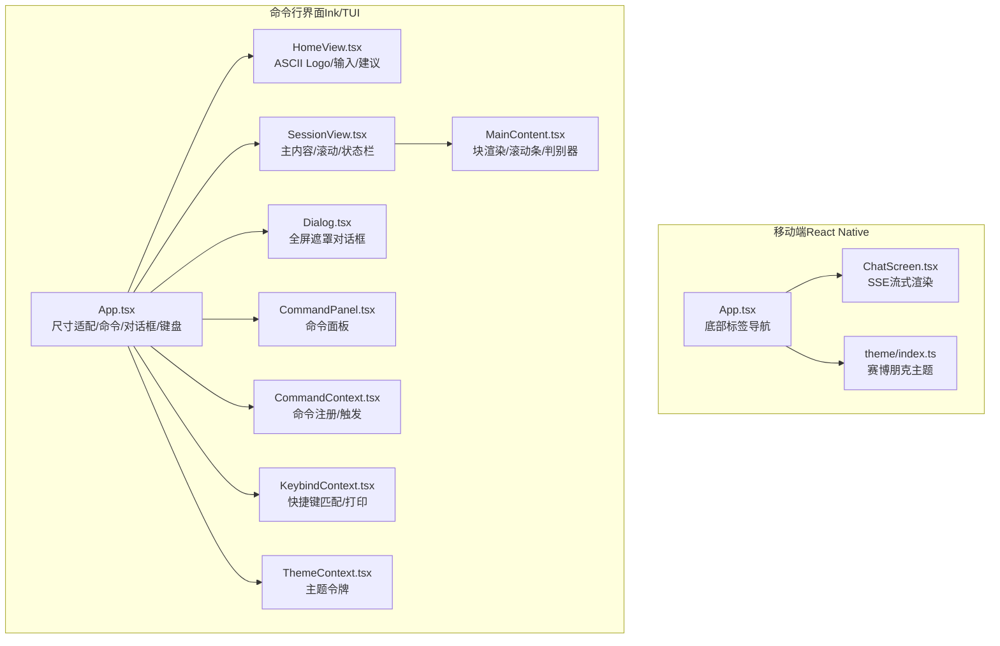
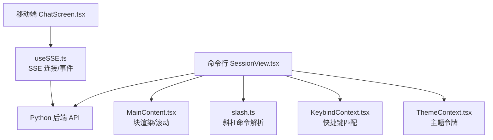
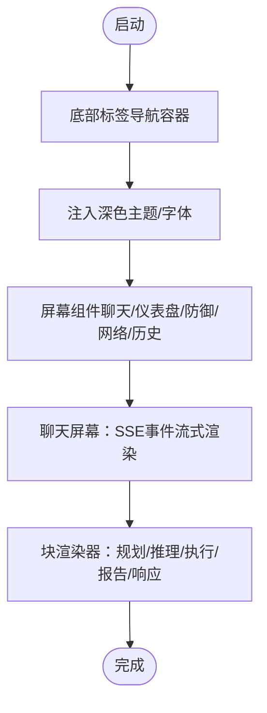
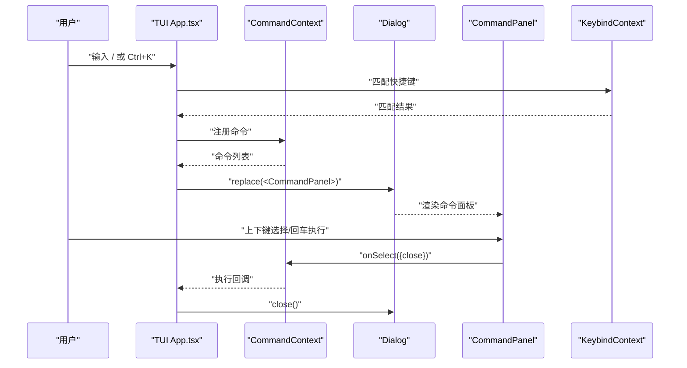
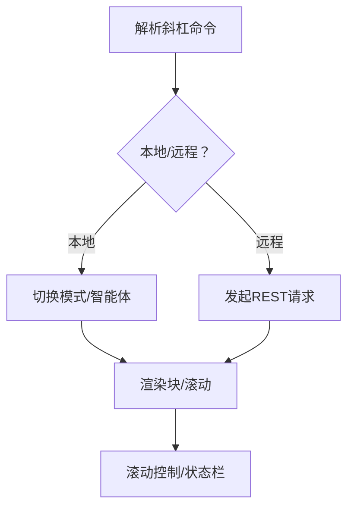
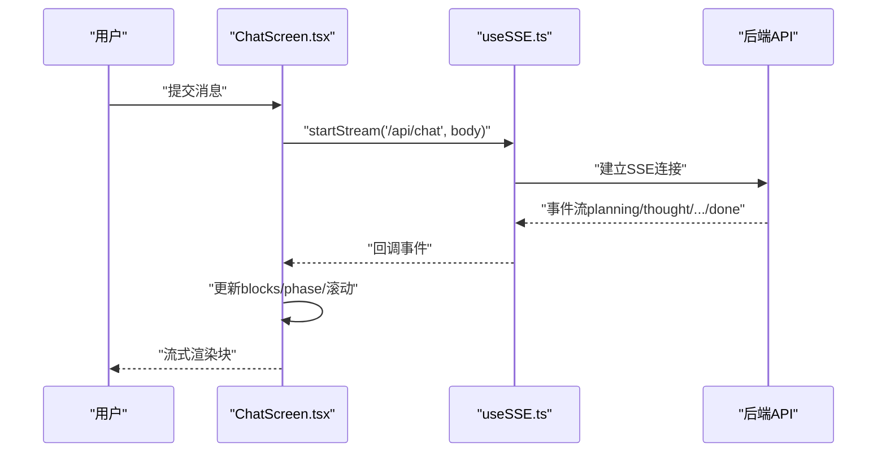
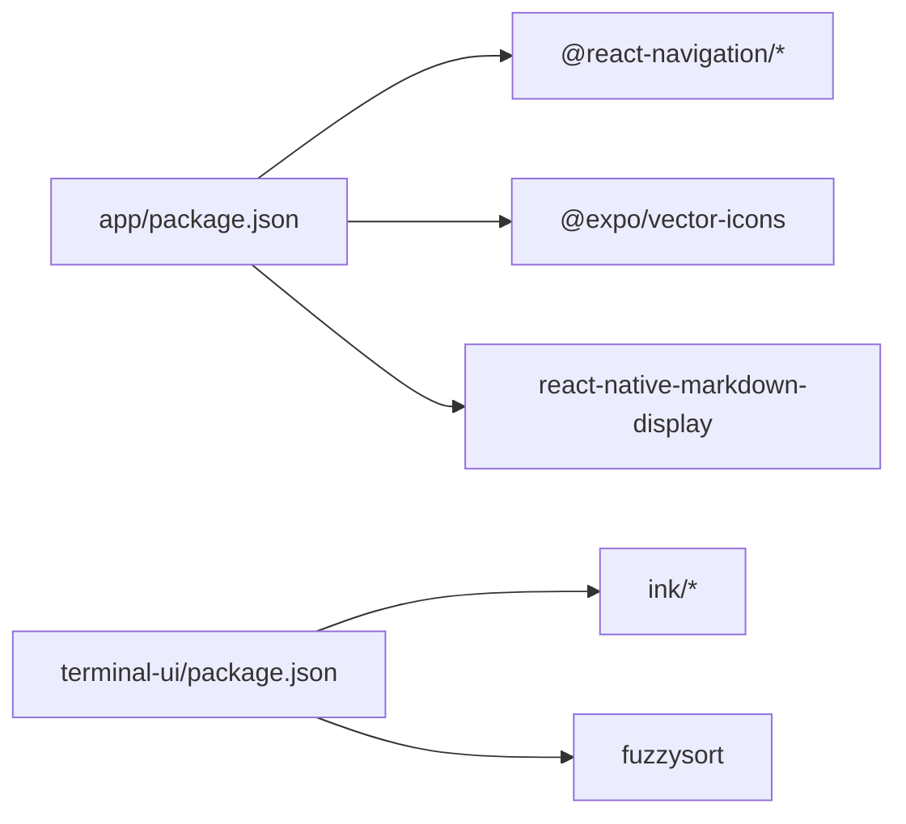

# 用户界面

<cite>
**本文引用的文件**
- [app/App.tsx](file://app/App.tsx)
- [app/package.json](file://app/package.json)
- [app/src/theme/index.ts](file://app/src/theme/index.ts)
- [app/src/screens/ChatScreen.tsx](file://app/src/screens/ChatScreen.tsx)
- [app/src/hooks/useSSE.ts](file://app/src/hooks/useSSE.ts)
- [terminal-ui/src/App.tsx](file://terminal-ui/src/App.tsx)
- [terminal-ui/package.json](file://terminal-ui/package.json)
- [terminal-ui/src/config.ts](file://terminal-ui/src/config.ts)
- [terminal-ui/src/views/HomeView.tsx](file://terminal-ui/src/views/HomeView.tsx)
- [terminal-ui/src/views/SessionView.tsx](file://terminal-ui/src/views/SessionView.tsx)
- [terminal-ui/src/components/CommandPanel.tsx](file://terminal-ui/src/components/CommandPanel.tsx)
- [terminal-ui/src/components/Dialog.tsx](file://terminal-ui/src/components/Dialog.tsx)
- [terminal-ui/src/contexts/CommandContext.tsx](file://terminal-ui/src/contexts/CommandContext.tsx)
- [terminal-ui/src/contexts/ThemeContext.tsx](file://terminal-ui/src/contexts/ThemeContext.tsx)
- [terminal-ui/src/contexts/KeybindContext.tsx](file://terminal-ui/src/contexts/KeybindContext.tsx)
- [terminal-ui/src/slash.ts](file://terminal-ui/src/slash.ts)
- [terminal-ui/src/MainContent.tsx](file://terminal-ui/src/MainContent.tsx)
</cite>

## 目录
1. [简介](#简介)
2. [项目结构](#项目结构)
3. [核心组件](#核心组件)
4. [架构总览](#架构总览)
5. [详细组件分析](#详细组件分析)
6. [依赖关系分析](#依赖关系分析)
7. [性能考量](#性能考量)
8. [故障排查指南](#故障排查指南)
9. [结论](#结论)
10. [附录](#附录)

## 简介
本文件面向Secbot用户界面系统，提供跨平台统一的界面设计与实现说明，涵盖移动端（React Native）、命令行界面（Ink/TUI）与Web界面（通过React Native Web）的整体架构、组件组织、数据流与交互设计。文档重点解释：
- 移动端界面的导航与路由、主题与样式系统、组件库架构
- 命令行界面的Ink组件体系、命令面板、对话框系统、键盘快捷键支持
- 多界面间统一的设计原则与用户体验一致性保障机制
- 界面定制与扩展方法（主题、组件、新界面）
- 交互最佳实践与性能优化建议

## 项目结构
Secbot的用户界面由三部分组成：
- 移动端（React Native）：入口文件负责底部标签导航与主题注入，屏幕组件承载聊天与仪表盘等页面
- 命令行界面（Ink/TUI）：入口应用负责尺寸适配、命令注册、对话框栈与键盘绑定，视图组件承载首页与会话视图
- Web界面：通过React Native Web在浏览器运行，复用移动端组件与主题

**图表来源**
- [app/App.tsx](file://app/App.tsx#L28-L108)
- [app/src/screens/ChatScreen.tsx](file://app/src/screens/ChatScreen.tsx#L61-L609)
- [app/src/theme/index.ts](file://app/src/theme/index.ts#L5-L64)
- [terminal-ui/src/App.tsx](file://terminal-ui/src/App.tsx#L26-L201)
- [terminal-ui/src/views/HomeView.tsx](file://terminal-ui/src/views/HomeView.tsx#L30-L199)
- [terminal-ui/src/views/SessionView.tsx](file://terminal-ui/src/views/SessionView.tsx#L30-L473)
- [terminal-ui/src/MainContent.tsx](file://terminal-ui/src/MainContent.tsx#L52-L216)
- [terminal-ui/src/components/Dialog.tsx](file://terminal-ui/src/components/Dialog.tsx#L12-L43)
- [terminal-ui/src/components/CommandPanel.tsx](file://terminal-ui/src/components/CommandPanel.tsx#L11-L91)
- [terminal-ui/src/contexts/CommandContext.tsx](file://terminal-ui/src/contexts/CommandContext.tsx#L20-L49)
- [terminal-ui/src/contexts/KeybindContext.tsx](file://terminal-ui/src/contexts/KeybindContext.tsx#L102-L136)
- [terminal-ui/src/contexts/ThemeContext.tsx](file://terminal-ui/src/contexts/ThemeContext.tsx#L41-L58)

**章节来源**
- [app/App.tsx](file://app/App.tsx#L28-L108)
- [terminal-ui/src/App.tsx](file://terminal-ui/src/App.tsx#L26-L201)

## 核心组件
- 移动端入口与导航
  - 底部标签导航容器与图标映射，统一注入深色主题与字体族
- 移动端聊天屏幕
  - SSE事件驱动的流式渲染，按阶段推进（规划/推理/执行/报告/响应），支持停止流、调试面板
- 命令行入口应用
  - 动态窗口尺寸监听、命令注册与触发、对话框栈、键盘绑定、Toast、路由与本地状态
- 命令行视图
  - 首页：ASCII Logo、输入、斜杠建议、快捷提示、底部状态栏
  - 会话视图：主内容区、滚动控制、斜杠命令解析、输入与状态栏
- 命令行组件
  - 对话框：全屏遮罩与居中内容区
  - 命令面板：模糊搜索过滤、分类展示、快捷键标注
- 上下文与主题
  - 命令上下文：命令注册/触发
  - 快捷键上下文：默认键位合并、匹配与打印
  - 主题上下文：赛博朋克风格主题令牌

**章节来源**
- [app/App.tsx](file://app/App.tsx#L28-L108)
- [app/src/screens/ChatScreen.tsx](file://app/src/screens/ChatScreen.tsx#L61-L609)
- [terminal-ui/src/App.tsx](file://terminal-ui/src/App.tsx#L26-L201)
- [terminal-ui/src/views/HomeView.tsx](file://terminal-ui/src/views/HomeView.tsx#L30-L199)
- [terminal-ui/src/views/SessionView.tsx](file://terminal-ui/src/views/SessionView.tsx#L30-L473)
- [terminal-ui/src/components/Dialog.tsx](file://terminal-ui/src/components/Dialog.tsx#L12-L43)
- [terminal-ui/src/components/CommandPanel.tsx](file://terminal-ui/src/components/CommandPanel.tsx#L11-L91)
- [terminal-ui/src/contexts/CommandContext.tsx](file://terminal-ui/src/contexts/CommandContext.tsx#L20-L49)
- [terminal-ui/src/contexts/KeybindContext.tsx](file://terminal-ui/src/contexts/KeybindContext.tsx#L102-L136)
- [terminal-ui/src/contexts/ThemeContext.tsx](file://terminal-ui/src/contexts/ThemeContext.tsx#L41-L58)

## 架构总览
移动端与命令行界面共享统一的后端接口与交互语义（SSE事件与斜杠命令），通过各自前端框架实现一致的用户体验。

**图表来源**
- [app/src/screens/ChatScreen.tsx](file://app/src/screens/ChatScreen.tsx#L131-L376)
- [app/src/hooks/useSSE.ts](file://app/src/hooks/useSSE.ts#L9-L50)
- [terminal-ui/src/views/SessionView.tsx](file://terminal-ui/src/views/SessionView.tsx#L297-L373)
- [terminal-ui/src/MainContent.tsx](file://terminal-ui/src/MainContent.tsx#L81-L115)
- [terminal-ui/src/slash.ts](file://terminal-ui/src/slash.ts#L42-L144)
- [terminal-ui/src/contexts/KeybindContext.tsx](file://terminal-ui/src/contexts/KeybindContext.tsx#L112-L124)
- [terminal-ui/src/contexts/ThemeContext.tsx](file://terminal-ui/src/contexts/ThemeContext.tsx#L41-L58)

## 详细组件分析

### 移动端界面（React Native）
- 导航与路由
  - 使用底部标签导航容器，集中注入深色主题与字体族，统一头部与标签样式
- 主题与样式系统
  - 定义主色、背景、文字、状态色、边框与圆角等语义令牌，供组件样式使用
- 组件库架构
  - 屏幕组件负责业务场景（聊天、仪表盘、防御、网络、历史）
  - 通用块渲染器与调试面板提升可维护性

**图表来源**
- [app/App.tsx](file://app/App.tsx#L28-L108)
- [app/src/theme/index.ts](file://app/src/theme/index.ts#L5-L64)
- [app/src/screens/ChatScreen.tsx](file://app/src/screens/ChatScreen.tsx#L61-L609)

**章节来源**
- [app/App.tsx](file://app/App.tsx#L28-L108)
- [app/src/theme/index.ts](file://app/src/theme/index.ts#L5-L64)
- [app/src/screens/ChatScreen.tsx](file://app/src/screens/ChatScreen.tsx#L61-L609)

### 命令行界面（Ink/TUI）
- Ink组件系统
  - 使用Box/Text/TextInput等Ink组件构建布局、文本与输入
- 命令面板设计
  - 支持模糊搜索过滤、分类展示、快捷键标注，Enter执行、Esc关闭
- 对话框系统
  - 全屏遮罩+居中内容区，Esc由顶层统一clear，避免内层pop竞态
- 键盘快捷键支持
  - 默认键位可从配置覆盖，提供匹配与打印能力
- 首页与会话视图
  - 首页：ASCII Logo、输入、斜杠建议、提示与状态栏
  - 会话视图：主内容区、滚动控制、斜杠命令解析、输入与状态栏

**图表来源**
- [terminal-ui/src/App.tsx](file://terminal-ui/src/App.tsx#L47-L154)
- [terminal-ui/src/components/CommandPanel.tsx](file://terminal-ui/src/components/CommandPanel.tsx#L11-L91)
- [terminal-ui/src/components/Dialog.tsx](file://terminal-ui/src/components/Dialog.tsx#L12-L43)
- [terminal-ui/src/contexts/CommandContext.tsx](file://terminal-ui/src/contexts/CommandContext.tsx#L20-L49)
- [terminal-ui/src/contexts/KeybindContext.tsx](file://terminal-ui/src/contexts/KeybindContext.tsx#L112-L124)

**章节来源**
- [terminal-ui/src/App.tsx](file://terminal-ui/src/App.tsx#L26-L201)
- [terminal-ui/src/components/CommandPanel.tsx](file://terminal-ui/src/components/CommandPanel.tsx#L11-L91)
- [terminal-ui/src/components/Dialog.tsx](file://terminal-ui/src/components/Dialog.tsx#L12-L43)
- [terminal-ui/src/contexts/CommandContext.tsx](file://terminal-ui/src/contexts/CommandContext.tsx#L20-L49)
- [terminal-ui/src/contexts/KeybindContext.tsx](file://terminal-ui/src/contexts/KeybindContext.tsx#L102-L136)

### 命令行视图与内容渲染
- 主内容区
  - 将历史与当前流状态转换为块，按可见范围裁剪与渲染，支持滚动条与展开/收起
- 斜杠命令解析
  - 解析本地模式切换与REST调用，支持静态帮助与动态工具列表
- 首页与会话视图
  - 首页：ASCII艺术字Logo、输入与建议、提示与状态栏
  - 会话视图：主内容、滚动控制、输入与状态栏

**图表来源**
- [terminal-ui/src/slash.ts](file://terminal-ui/src/slash.ts#L42-L144)
- [terminal-ui/src/views/SessionView.tsx](file://terminal-ui/src/views/SessionView.tsx#L297-L373)
- [terminal-ui/src/MainContent.tsx](file://terminal-ui/src/MainContent.tsx#L81-L115)

**章节来源**
- [terminal-ui/src/views/HomeView.tsx](file://terminal-ui/src/views/HomeView.tsx#L30-L199)
- [terminal-ui/src/views/SessionView.tsx](file://terminal-ui/src/views/SessionView.tsx#L30-L473)
- [terminal-ui/src/MainContent.tsx](file://terminal-ui/src/MainContent.tsx#L52-L216)
- [terminal-ui/src/slash.ts](file://terminal-ui/src/slash.ts#L42-L144)

### 移动端SSE流式渲染
- 事件驱动
  - 监听planning/thought_start/thought_chunk/thought/action_start/action_result/observation/report/response/error/done等事件
- 状态推进
  - 通过task_phase块与阶段标签反映当前状态，支持停止流
- 用户体验
  - 连接中即时反馈、滚动到底部、调试面板辅助定位问题

**图表来源**
- [app/src/screens/ChatScreen.tsx](file://app/src/screens/ChatScreen.tsx#L131-L376)
- [app/src/hooks/useSSE.ts](file://app/src/hooks/useSSE.ts#L9-L50)

**章节来源**
- [app/src/screens/ChatScreen.tsx](file://app/src/screens/ChatScreen.tsx#L61-L609)
- [app/src/hooks/useSSE.ts](file://app/src/hooks/useSSE.ts#L9-L50)

## 依赖关系分析
- 移动端
  - 依赖@react-navigation与@expo/vector-icons实现导航与图标
  - 依赖react-native-markdown-display渲染Markdown
- 命令行
  - 依赖ink、ink-markdown、ink-text-input等Ink生态组件
  - 依赖fuzzysort实现命令面板的模糊搜索

**图表来源**
- [app/package.json](file://app/package.json#L11-L24)
- [terminal-ui/package.json](file://terminal-ui/package.json#L17-L30)

**章节来源**
- [app/package.json](file://app/package.json#L11-L24)
- [terminal-ui/package.json](file://terminal-ui/package.json#L17-L30)

## 性能考量
- 移动端
  - 使用useMemo与useCallback减少渲染抖动，合理拆分块更新
  - 控制SSE事件日志长度，避免内存膨胀
- 命令行
  - 主内容区按可见范围裁剪块，避免全量渲染
  - 判别器池并行处理，提升块类型识别吞吐
  - 临时工具块在完成后短暂延迟后移除，降低滚动负担
- 通用
  - 保持前后端事件与命令语义一致，减少界面层的分支判断
  - 主题与样式集中管理，避免重复计算

[本节为通用性能建议，不直接分析具体文件]

## 故障排查指南
- 后端连通性检查
  - 命令行启动前检查后端可达性，超时控制与错误信息返回
- 命令行常见问题
  - 未知斜杠命令：输入/查看列表，确认命令拼写
  - 对话框ESC冲突：由顶层统一clear，避免内层pop竞态
  - 滚动异常：检查totalLines与scrollOffset边界，确保可见范围正确裁剪
- 移动端常见问题
  - SSE连接失败：查看错误块与调试面板，确认后端状态
  - 流中断：检查done事件清理逻辑与阶段重置

**章节来源**
- [terminal-ui/src/config.ts](file://terminal-ui/src/config.ts#L13-L27)
- [terminal-ui/src/App.tsx](file://terminal-ui/src/App.tsx#L57-L66)
- [terminal-ui/src/MainContent.tsx](file://terminal-ui/src/MainContent.tsx#L117-L132)
- [app/src/screens/ChatScreen.tsx](file://app/src/screens/ChatScreen.tsx#L418-L435)

## 结论
Secbot的用户界面通过移动端与命令行的统一事件语义与主题系统，在不同平台实现了高度一致的用户体验。移动端强调触控友好与流式渲染，命令行强调键盘效率与块化信息呈现。通过上下文与组件的清晰分层，界面具备良好的可扩展性与可维护性。

[本节为总结性内容，不直接分析具体文件]

## 附录
- 界面定制与扩展
  - 主题定制：修改主题令牌与间距/字号定义，影响全局样式
  - 组件扩展：新增块类型与渲染器，完善判别器池
  - 新界面开发：遵循上下文注册与事件语义，复用命令/快捷键/主题系统
- 交互最佳实践
  - 保持前后端事件与命令一致性
  - 提供明确的状态反馈与错误提示
  - 优化滚动与渲染性能，避免卡顿

[本节为通用指导，不直接分析具体文件]