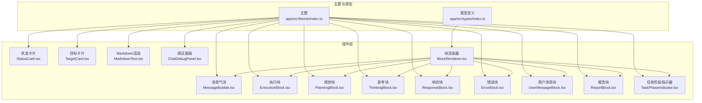
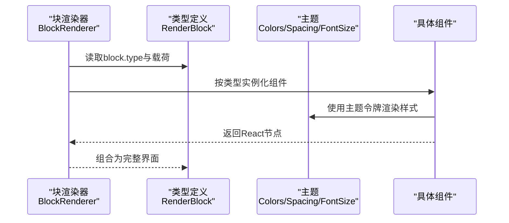
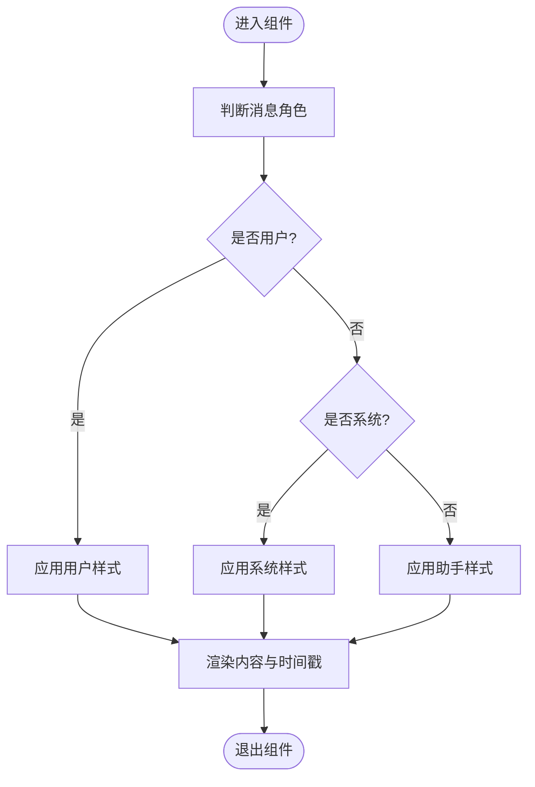
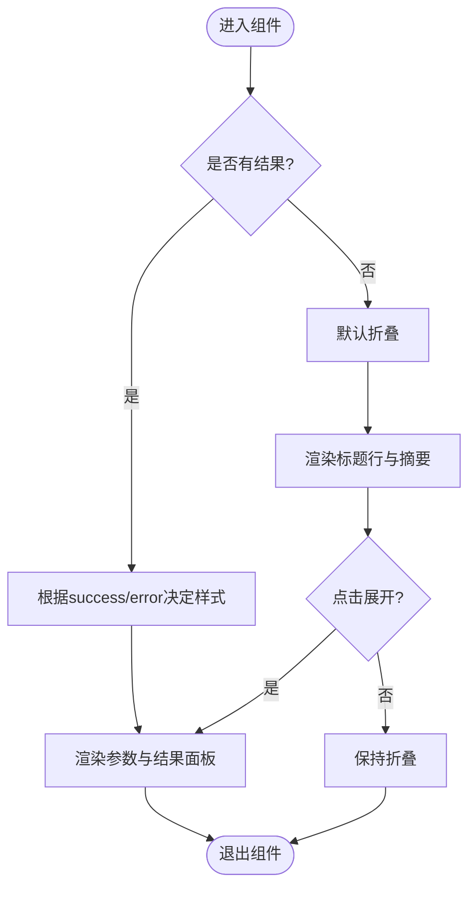
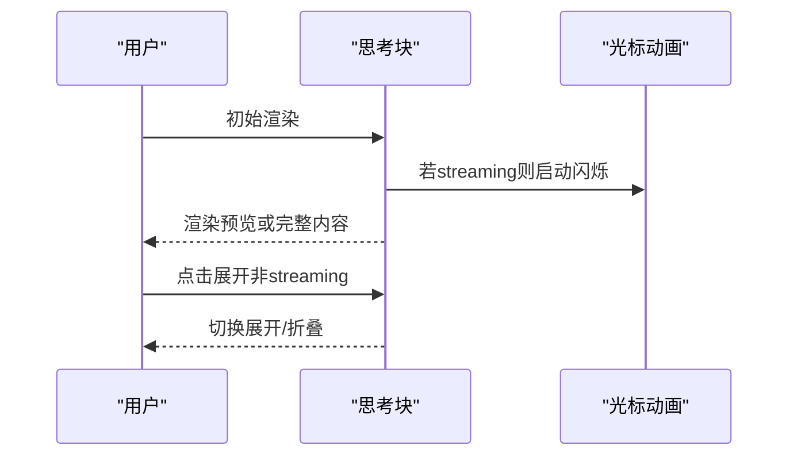
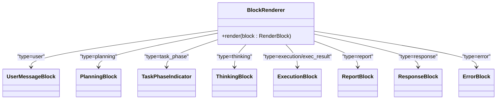
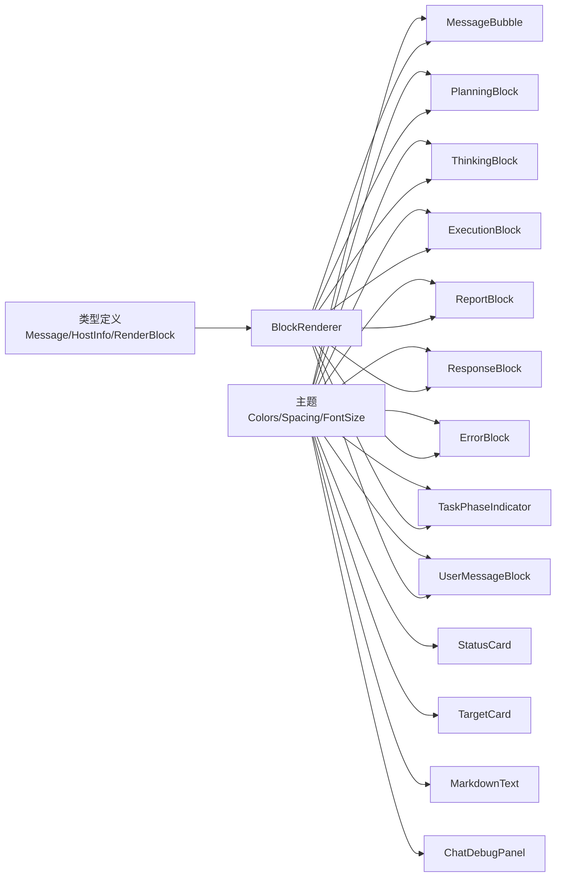

# UI组件库

<cite>
**本文引用的文件**
- [MessageBubble.tsx](file://app/src/components/MessageBubble.tsx)
- [StatusCard.tsx](file://app/src/components/StatusCard.tsx)
- [TargetCard.tsx](file://app/src/components/TargetCard.tsx)
- [ExecutionBlock.tsx](file://app/src/components/ExecutionBlock.tsx)
- [PlanningBlock.tsx](file://app/src/components/PlanningBlock.tsx)
- [ThinkingBlock.tsx](file://app/src/components/ThinkingBlock.tsx)
- [ResponseBlock.tsx](file://app/src/components/ResponseBlock.tsx)
- [ErrorBlock.tsx](file://app/src/components/ErrorBlock.tsx)
- [MarkdownText.tsx](file://app/src/components/MarkdownText.tsx)
- [UserMessageBlock.tsx](file://app/src/components/UserMessageBlock.tsx)
- [ReportBlock.tsx](file://app/src/components/ReportBlock.tsx)
- [TaskPhaseIndicator.tsx](file://app/src/components/TaskPhaseIndicator.tsx)
- [ChatDebugPanel.tsx](file://app/src/components/ChatDebugPanel.tsx)
- [BlockRenderer.tsx](file://app/src/components/BlockRenderer.tsx)
- [index.ts（主题）](file://app/src/theme/index.ts)
- [index.ts（类型）](file://app/src/types/index.ts)
</cite>

## 目录
1. [简介](#简介)
2. [项目结构](#项目结构)
3. [核心组件](#核心组件)
4. [架构总览](#架构总览)
5. [组件详解](#组件详解)
6. [依赖关系分析](#依赖关系分析)
7. [性能考量](#性能考量)
8. [故障排查指南](#故障排查指南)
9. [结论](#结论)
10. [附录](#附录)

## 简介
本文件为Secbot移动端UI组件库的详细技术文档，面向前端开发者与产品设计人员，系统性阐述组件库的设计理念、组件分类、命名规范、复用策略、属性接口设计、主题系统应用以及最佳实践与性能优化建议。组件库以暗色赛博朋克风格为主题基调，围绕“消息气泡、状态卡片、目标卡片、执行块、规划块、思考块、响应块、错误块”等核心UI元素构建，配合Markdown渲染与任务阶段指示器，形成统一的信息展示与交互体验。

## 项目结构
组件库位于移动端应用目录下，采用按功能域分层组织的方式：
- 组件层：各UI组件集中于 app/src/components，包含消息、块、卡片、指示器等。
- 主题层：app/src/theme 提供颜色、间距、字号、圆角等设计令牌。
- 类型层：app/src/types 定义消息、块渲染数据结构与Agent/Host等业务类型。
- 渲染器：BlockRenderer根据RenderBlock.type分发到具体组件，统一管理渲染流程。

图表来源
- [index.ts（主题）](file://app/src/theme/index.ts#L1-L64)
- [index.ts（类型）](file://app/src/types/index.ts#L1-L200)
- [BlockRenderer.tsx](file://app/src/components/BlockRenderer.tsx#L1-L97)
- [MessageBubble.tsx](file://app/src/components/MessageBubble.tsx#L1-L112)
- [StatusCard.tsx](file://app/src/components/StatusCard.tsx#L1-L59)
- [TargetCard.tsx](file://app/src/components/TargetCard.tsx#L1-L121)
- [ExecutionBlock.tsx](file://app/src/components/ExecutionBlock.tsx#L1-L300)
- [PlanningBlock.tsx](file://app/src/components/PlanningBlock.tsx#L1-L69)
- [ThinkingBlock.tsx](file://app/src/components/ThinkingBlock.tsx#L1-L210)
- [ResponseBlock.tsx](file://app/src/components/ResponseBlock.tsx#L1-L71)
- [ErrorBlock.tsx](file://app/src/components/ErrorBlock.tsx#L1-L52)
- [MarkdownText.tsx](file://app/src/components/MarkdownText.tsx#L1-L95)
- [UserMessageBlock.tsx](file://app/src/components/UserMessageBlock.tsx#L1-L62)
- [ReportBlock.tsx](file://app/src/components/ReportBlock.tsx#L1-L134)
- [TaskPhaseIndicator.tsx](file://app/src/components/TaskPhaseIndicator.tsx#L1-L120)
- [ChatDebugPanel.tsx](file://app/src/components/ChatDebugPanel.tsx#L1-L227)

章节来源
- [index.ts（主题）](file://app/src/theme/index.ts#L1-L64)
- [index.ts（类型）](file://app/src/types/index.ts#L1-L200)
- [BlockRenderer.tsx](file://app/src/components/BlockRenderer.tsx#L1-L97)

## 核心组件
本节概述组件库的核心组件及其职责与典型使用场景：
- 消息气泡：用于展示用户/系统/HACKBOT消息，支持时间戳与角色标签。
- 状态卡片：用于仪表盘统计信息展示，支持自定义颜色。
- 目标卡片：展示主机IP、主机名、开放端口与授权状态，支持点击回调。
- 执行块：展示工具调用、参数摘要与执行结果，支持展开/折叠与流式运行态。
- 规划块：展示规划阶段的Markdown内容，带主题边框与标题。
- 思考块：展示推理过程，支持流式闪烁光标与折叠预览。
- 响应块：展示最终响应内容，支持Agent标识。
- 错误块：展示错误信息，带红色主题边框与图标。
- 报告块：展示报告内容，流式时使用虚线边框与闪烁光标，完成后使用实线边框。
- 任务阶段指示器：展示任务阶段与旋转Spinner，不同阶段配色不同。
- Markdown渲染：统一样式化的Markdown渲染组件，适配主题。
- 用户消息块：独立的消息块组件，用于特定场景。
- 调试面板：展示当前模式、模型、状态、事件日志与refs，便于开发调试。

章节来源
- [MessageBubble.tsx](file://app/src/components/MessageBubble.tsx#L1-L112)
- [StatusCard.tsx](file://app/src/components/StatusCard.tsx#L1-L59)
- [TargetCard.tsx](file://app/src/components/TargetCard.tsx#L1-L121)
- [ExecutionBlock.tsx](file://app/src/components/ExecutionBlock.tsx#L1-L300)
- [PlanningBlock.tsx](file://app/src/components/PlanningBlock.tsx#L1-L69)
- [ThinkingBlock.tsx](file://app/src/components/ThinkingBlock.tsx#L1-L210)
- [ResponseBlock.tsx](file://app/src/components/ResponseBlock.tsx#L1-L71)
- [ErrorBlock.tsx](file://app/src/components/ErrorBlock.tsx#L1-L52)
- [MarkdownText.tsx](file://app/src/components/MarkdownText.tsx#L1-L95)
- [UserMessageBlock.tsx](file://app/src/components/UserMessageBlock.tsx#L1-L62)
- [ReportBlock.tsx](file://app/src/components/ReportBlock.tsx#L1-L134)
- [TaskPhaseIndicator.tsx](file://app/src/components/TaskPhaseIndicator.tsx#L1-L120)
- [ChatDebugPanel.tsx](file://app/src/components/ChatDebugPanel.tsx#L1-L227)

## 架构总览
组件库通过统一的渲染器BlockRenderer根据RenderBlock.type进行分发，确保渲染逻辑集中、扩展便捷。主题系统通过Colors、Spacing、FontSize、BorderRadius等设计令牌贯穿所有组件，保证视觉一致性与可维护性。

图表来源
- [BlockRenderer.tsx](file://app/src/components/BlockRenderer.tsx#L21-L96)
- [index.ts（类型）](file://app/src/types/index.ts#L37-L58)
- [index.ts（主题）](file://app/src/theme/index.ts#L5-L63)

## 组件详解

### 设计理念与命名规范
- 设计理念：以“信息层级清晰、状态可视化、交互轻量化”为核心，强调在移动端有限空间内提供高密度信息与良好可读性。
- 命名规范：组件名采用帕斯卡命名法；块类组件以“Block”结尾；卡片类组件以“Card”结尾；指示器以“Indicator”结尾；消息类组件以“Message”或“Block”结尾；主题令牌采用驼峰命名，如Colors.primary。
- 复用策略：通过统一的主题令牌与类型定义，组件间共享样式与行为；块渲染器集中分发，避免重复分支逻辑。

章节来源
- [BlockRenderer.tsx](file://app/src/components/BlockRenderer.tsx#L1-L97)
- [index.ts（主题）](file://app/src/theme/index.ts#L1-L64)
- [index.ts（类型）](file://app/src/types/index.ts#L25-L58)

### 消息气泡（MessageBubble）
- 功能：根据消息角色渲染用户/助手/系统消息，显示角色标签、内容与时间戳。
- 关键点：使用主题颜色与圆角控制气泡外观；用户消息右对齐，助手消息左对齐；系统消息使用特殊背景与边框。
- 属性接口：message（Message），包含role、content、timestamp。
- 默认值与类型：由类型定义约束，不设JSX默认值；时间格式化在组件内部处理。
- 主题应用：Colors.userBubble、Colors.assistantBubble、Colors.codeBackground、Colors.border、FontSize、Spacing、BorderRadius。

图表来源
- [MessageBubble.tsx](file://app/src/components/MessageBubble.tsx#L14-L55)

章节来源
- [MessageBubble.tsx](file://app/src/components/MessageBubble.tsx#L1-L112)
- [index.ts（类型）](file://app/src/types/index.ts#L193-L200)
- [index.ts（主题）](file://app/src/theme/index.ts#L5-L63)

### 状态卡片（StatusCard）
- 功能：展示标题、数值与副标题，支持自定义颜色。
- 关键点：卡片容器使用主题边框与背景；标题小写转大写并加粗；数值加粗显示；副标题较小字号。
- 属性接口：title、value、subtitle（可选）、color（可选，默认使用主题primary）。
- 默认值与类型：color默认值在组件内设置；类型由Props定义。
- 主题应用：Colors.card、Colors.border、Colors.text、Colors.textSecondary、Colors.textMuted、FontSize、Spacing、BorderRadius。

章节来源
- [StatusCard.tsx](file://app/src/components/StatusCard.tsx#L1-L59)
- [index.ts（主题）](file://app/src/theme/index.ts#L5-L63)

### 目标卡片（TargetCard）
- 功能：展示主机IP、主机名、开放端口列表与授权状态徽章，支持点击回调。
- 关键点：授权状态使用不同徽章颜色；端口过多时截断显示；IP与端口使用等宽字体提升可读性。
- 属性接口：host（HostInfo）、onPress（可选）。
- 默认值与类型：onPress可选；HostInfo字段来自类型定义。
- 主题应用：Colors.card、Colors.border、Colors.success、Colors.danger、Colors.text、Colors.textSecondary、Colors.info、FontSize、Spacing、BorderRadius。

章节来源
- [TargetCard.tsx](file://app/src/components/TargetCard.tsx#L1-L121)
- [index.ts（类型）](file://app/src/types/index.ts#L132-L147)
- [index.ts（主题）](file://app/src/theme/index.ts#L5-L63)

### 执行块（ExecutionBlock）
- 功能：展示工具名称、参数摘要与执行结果；支持展开/折叠；运行态显示“running”徽章与状态图标。
- 关键点：参数摘要最多展示两项并提示剩余数量；结果面板根据成功/失败切换颜色；标题行可点击切换展开状态。
- 属性接口：tool、params（可选）、success（可选）、result（可选）、error（可选）、running（可选）、agent（可选）。
- 默认值与类型：部分属性可选；运行态通过running推导展开行为。
- 主题应用：Colors.card、Colors.border、EXEC_COLOR、SUCCESS_COLOR、ERROR_COLOR、FontSize、Spacing、BorderRadius。

图表来源
- [ExecutionBlock.tsx](file://app/src/components/ExecutionBlock.tsx#L25-L173)

章节来源
- [ExecutionBlock.tsx](file://app/src/components/ExecutionBlock.tsx#L1-L300)
- [index.ts（主题）](file://app/src/theme/index.ts#L5-L63)

### 规划块（PlanningBlock）
- 功能：展示规划阶段的Markdown内容，带主题边框与标题。
- 关键点：使用MarkdownText组件渲染；标题使用magenta主题色；面板带左侧主题色边框。
- 属性接口：content（string）。
- 默认值与类型：无默认值；类型为string。
- 主题应用：PLANNING_COLOR、Colors.card、Colors.border、FontSize、Spacing、BorderRadius。

章节来源
- [PlanningBlock.tsx](file://app/src/components/PlanningBlock.tsx#L1-L69)
- [MarkdownText.tsx](file://app/src/components/MarkdownText.tsx#L1-L95)
- [index.ts（主题）](file://app/src/theme/index.ts#L5-L63)

### 思考块（ThinkingBlock）
- 功能：展示推理过程，支持流式闪烁光标与折叠预览；完成后默认折叠仅显示前N行。
- 关键点：流式时禁用点击展开；预览文本去除空行与markdown标记；长文本显示上下箭头指示。
- 属性接口：content（string）、iteration（可选）、streaming（可选）、agent（可选）。
- 默认值与类型：iteration默认undefined；streaming默认false。
- 主题应用：THINKING_COLOR、Colors.card、Colors.border、FontSize、Spacing、BorderRadius。

图表来源
- [ThinkingBlock.tsx](file://app/src/components/ThinkingBlock.tsx#L21-L129)

章节来源
- [ThinkingBlock.tsx](file://app/src/components/ThinkingBlock.tsx#L1-L210)
- [index.ts（主题）](file://app/src/theme/index.ts#L5-L63)

### 响应块（ResponseBlock）
- 功能：展示最终响应内容，带Agent标识。
- 关键点：使用MarkdownText渲染；标题使用绿色主题色；面板带左侧主题色边框。
- 属性接口：content（string）、agent（string）。
- 默认值与类型：agent可为空字符串；类型为string。
- 主题应用：RESPONSE_COLOR、Colors.card、Colors.border、FontSize、Spacing、BorderRadius。

章节来源
- [ResponseBlock.tsx](file://app/src/components/ResponseBlock.tsx#L1-L71)
- [MarkdownText.tsx](file://app/src/components/MarkdownText.tsx#L1-L95)
- [index.ts（主题）](file://app/src/theme/index.ts#L5-L63)

### 错误块（ErrorBlock）
- 功能：展示错误信息，带红色主题边框与图标。
- 关键点：错误面板使用半透明红色背景与左侧红色边框；文本使用错误色。
- 属性接口：error（string）。
- 默认值与类型：无默认值；类型为string。
- 主题应用：ERROR_COLOR、Colors.card、Colors.border、FontSize、Spacing、BorderRadius。

章节来源
- [ErrorBlock.tsx](file://app/src/components/ErrorBlock.tsx#L1-L52)
- [index.ts（主题）](file://app/src/theme/index.ts#L5-L63)

### 报告块（ReportBlock）
- 功能：展示报告内容，流式时使用虚线边框与闪烁光标，完成后使用实线边框。
- 关键点：流式时使用Animated闪烁光标；完成后使用MarkdownText渲染。
- 属性接口：content（string）、streaming（可选）。
- 默认值与类型：streaming默认false。
- 主题应用：REPORT_COLOR、Colors.card、Colors.border、FontSize、Spacing、BorderRadius。

章节来源
- [ReportBlock.tsx](file://app/src/components/ReportBlock.tsx#L1-L134)
- [MarkdownText.tsx](file://app/src/components/MarkdownText.tsx#L1-L95)
- [index.ts（主题）](file://app/src/theme/index.ts#L5-L63)

### 任务阶段指示器（TaskPhaseIndicator）
- 功能：展示任务阶段与旋转Spinner，不同阶段配色不同。
- 关键点：done阶段停止动画；其他阶段每80ms切换一个Spinner帧；emoji、tag、label与color按阶段配置。
- 属性接口：phase（'planning' | 'thinking' | 'exec' | 'report' | 'done'）、detail（可选）。
- 默认值与类型：phase必填；detail可选。
- 主题应用：Colors.text、Colors.textSecondary、FontSize、Spacing。

章节来源
- [TaskPhaseIndicator.tsx](file://app/src/components/TaskPhaseIndicator.tsx#L1-L120)
- [index.ts（主题）](file://app/src/theme/index.ts#L5-L63)

### Markdown渲染（MarkdownText）
- 功能：统一样式化的Markdown渲染，适配主题。
- 关键点：覆盖标题、段落、引用、代码块、表格等样式；链接点击打开外部URL。
- 属性接口：content（string）。
- 默认值与类型：无默认值；类型为string。
- 主题应用：Colors.text、Colors.primary、Colors.surfaceLight、Colors.codeBackground、Colors.border、FontSize。

章节来源
- [MarkdownText.tsx](file://app/src/components/MarkdownText.tsx#L1-L95)
- [index.ts（主题）](file://app/src/theme/index.ts#L5-L63)

### 用户消息块（UserMessageBlock）
- 功能：独立的用户消息块，用于特定场景。
- 关键点：右侧对齐，带柔和边框与时间戳。
- 属性接口：content（string）、timestamp（Date）。
- 默认值与类型：无默认值；类型为string与Date。
- 主题应用：USER_COLOR、Colors.text、Colors.textMuted、FontSize、Spacing、BorderRadius。

章节来源
- [UserMessageBlock.tsx](file://app/src/components/UserMessageBlock.tsx#L1-L62)
- [index.ts（主题）](file://app/src/theme/index.ts#L5-L63)

### 调试面板（ChatDebugPanel）
- 功能：展示当前模式、模型、状态、事件日志与refs，便于开发调试。
- 关键点：Modal弹窗，底部上滑；事件日志限制最大条数；支持关闭。
- 属性接口：visible（boolean）、onClose（函数）、state（DebugState）、eventLog（SSEEvent[]）。
- 默认值与类型：无默认值；类型来自类型定义。
- 主题应用：Colors.surface、Colors.card、Colors.border、Colors.primary、Colors.text、Colors.textMuted、FontSize、Spacing、BorderRadius。

章节来源
- [ChatDebugPanel.tsx](file://app/src/components/ChatDebugPanel.tsx#L1-L227)
- [index.ts（类型）](file://app/src/types/index.ts#L17-L20)
- [index.ts（主题）](file://app/src/theme/index.ts#L5-L63)

### 块渲染器（BlockRenderer）
- 功能：根据RenderBlock.type分派到对应组件，统一渲染入口。
- 关键点：覆盖user、planning、task_phase、thinking、execution、exec_result、observation、report、response、error等类型；对未识别类型返回null。
- 属性接口：block（RenderBlock）。
- 默认值与类型：无默认值；类型来自类型定义。
- 主题应用：通过被分派组件应用主题。

图表来源
- [BlockRenderer.tsx](file://app/src/components/BlockRenderer.tsx#L21-L96)

章节来源
- [BlockRenderer.tsx](file://app/src/components/BlockRenderer.tsx#L1-L97)
- [index.ts（类型）](file://app/src/types/index.ts#L37-L58)

## 依赖关系分析
- 组件与主题：所有组件均从主题模块导入颜色、间距、字号与圆角等设计令牌，确保视觉一致性。
- 组件与类型：组件通过类型定义约束props，如Message、HostInfo、RenderBlock等，保证数据结构正确性。
- 渲染器与组件：BlockRenderer集中管理分发，降低耦合度，便于新增/修改块类型。
- 渲染器与类型：BlockRenderer依赖RenderBlock类型定义，确保传入数据符合预期。

图表来源
- [index.ts（主题）](file://app/src/theme/index.ts#L5-L63)
- [index.ts（类型）](file://app/src/types/index.ts#L193-L200)
- [BlockRenderer.tsx](file://app/src/components/BlockRenderer.tsx#L21-L96)

章节来源
- [index.ts（主题）](file://app/src/theme/index.ts#L1-L64)
- [index.ts（类型）](file://app/src/types/index.ts#L1-L200)
- [BlockRenderer.tsx](file://app/src/components/BlockRenderer.tsx#L1-L97)

## 性能考量
- 渲染优化
  - 使用StyleSheet.create集中声明样式，减少运行时计算。
  - 对长列表与复杂Markdown内容，优先使用滚动容器与必要的numberOfLines截断，避免过度重排。
- 动画与交互
  - 流式组件使用useRef与Animated控制光标闪烁，注意在非流式状态下及时停止动画，释放资源。
  - 任务阶段指示器在done状态下清除定时器，防止内存泄漏。
- 数据处理
  - 执行块的参数摘要与结果序列化采用惰性处理，仅在需要时转换为字符串，避免不必要的JSON.stringify开销。
- 可访问性与可读性
  - 使用等宽字体展示IP、端口与代码片段，提升可读性。
  - 合理的对比度与字号，确保在暗色主题下文字清晰可辨。

## 故障排查指南
- 常见问题
  - Markdown渲染空白：检查content是否为空或仅含空白字符；确认MarkdownText组件未被包裹在不可见容器中。
  - 执行块结果不显示：确认success与result/error字段组合正确；检查结果字符串化逻辑。
  - 思考块无法展开：确认streaming为false且内容长度超过阈值；检查点击事件是否被禁用。
  - 任务阶段指示器无动画：确认phase非done；检查定时器是否被清理。
- 调试工具
  - 使用ChatDebugPanel查看当前模式、模型、状态、事件日志与refs，定位渲染异常。
  - 在BlockRenderer中增加默认分支的日志输出，帮助识别未覆盖的RenderBlock.type。

章节来源
- [ChatDebugPanel.tsx](file://app/src/components/ChatDebugPanel.tsx#L58-L128)
- [ThinkingBlock.tsx](file://app/src/components/ThinkingBlock.tsx#L63-L129)
- [ExecutionBlock.tsx](file://app/src/components/ExecutionBlock.tsx#L34-L173)
- [TaskPhaseIndicator.tsx](file://app/src/components/TaskPhaseIndicator.tsx#L57-L91)

## 结论
本组件库以统一的主题系统与类型定义为基础，围绕消息、块、卡片与指示器构建了完整的移动端UI体系。通过块渲染器实现集中分发，既保证了扩展性，也降低了维护成本。建议在后续迭代中持续完善类型约束与默认值策略，并引入更细粒度的性能监控与可访问性评估，进一步提升用户体验与工程质量。

## 附录
- 主题令牌说明
  - Colors：主色、背景、文字、状态、边框与特殊色。
  - Spacing：间距单位。
  - FontSize：字号等级。
  - BorderRadius：圆角半径。
- 类型定义概览
  - Message：用户/助手/系统消息。
  - HostInfo：主机信息。
  - RenderBlock：块渲染数据结构，包含类型、内容、Agent、迭代次数、流式状态、工具调用参数与结果等。

章节来源
- [index.ts（主题）](file://app/src/theme/index.ts#L5-L63)
- [index.ts（类型）](file://app/src/types/index.ts#L193-L200)
- [index.ts（类型）](file://app/src/types/index.ts#L132-L147)
- [index.ts（类型）](file://app/src/types/index.ts#L37-L58)