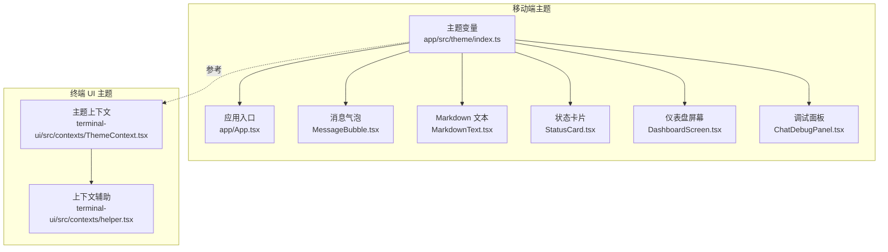
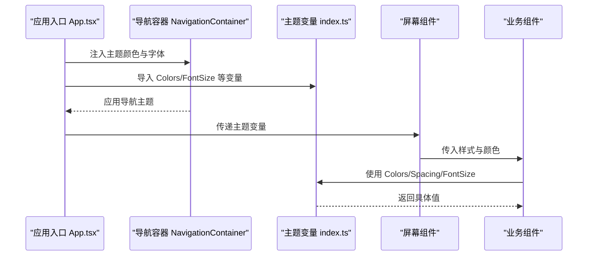
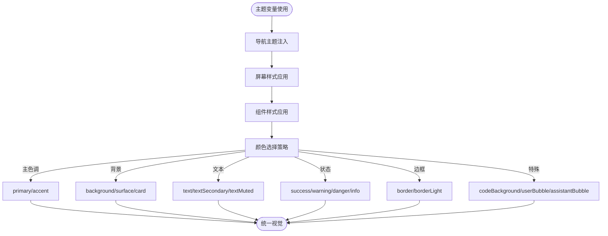
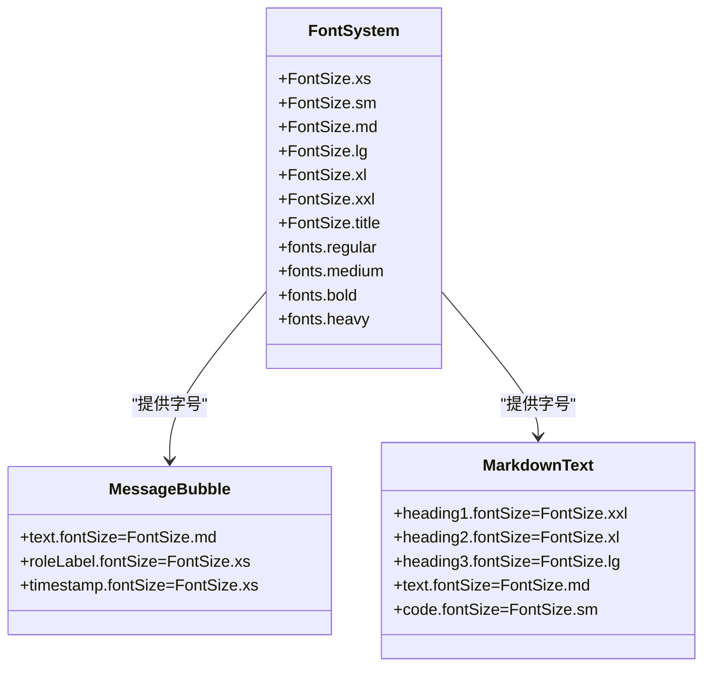
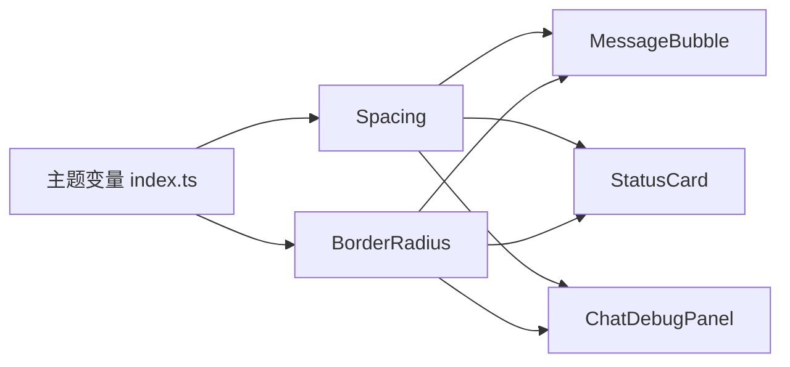
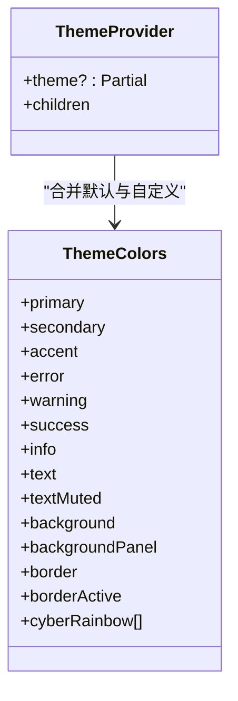
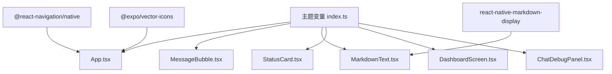

# 主题系统

<cite>
**本文引用的文件**
- [主题入口 index.ts](file://app/src/theme/index.ts)
- [应用入口 App.tsx](file://app/App.tsx)
- [聊天消息气泡 MessageBubble.tsx](file://app/src/components/MessageBubble.tsx)
- [Markdown 文本 MarkdownText.tsx](file://app/src/components/MarkdownText.tsx)
- [状态卡片 StatusCard.tsx](file://app/src/components/StatusCard.tsx)
- [聊天调试面板 ChatDebugPanel.tsx](file://app/src/components/ChatDebugPanel.tsx)
- [仪表盘屏幕 DashboardScreen.tsx](file://app/src/sreens/DashboardScreen.tsx)
- [聊天屏幕 ChatScreen.tsx](file://app/src/sreens/ChatScreen.tsx)
- [终端 UI 主题上下文 ThemeContext.tsx](file://terminal-ui/src/contexts/ThemeContext.tsx)
- [终端 UI 主题辅助 helper.tsx](file://terminal-ui/src/contexts/helper.tsx)
- [移动端包配置 package.json](file://app/package.json)
</cite>

## 目录
1. [简介](#简介)
2. [项目结构](#项目结构)
3. [核心组件](#核心组件)
4. [架构总览](#架构总览)
5. [详细组件分析](#详细组件分析)
6. [依赖关系分析](#依赖关系分析)
7. [性能考量](#性能考量)
8. [故障排查指南](#故障排查指南)
9. [结论](#结论)
10. [附录](#附录)

## 简介
本文件面向 Secbot 移动端的主题系统，聚焦于颜色方案、字体系统与样式变量的组织与使用。系统采用集中式主题变量管理，通过 React Native 导航主题与组件样式共同实现一致的视觉语言。文档同时提供主题定制与动态切换的实践建议。

## 项目结构
移动端主题系统主要由以下部分组成：
- 主题变量定义：位于 app/src/theme/index.ts，包含颜色、间距、字号与圆角等基础变量。
- 应用层主题集成：在 app/App.tsx 中将主题变量注入到导航容器与屏幕样式中。
- 组件级主题使用：各业务组件通过导入主题变量实现统一配色与排版。
- 终端 UI 主题上下文：terminal-ui/src/contexts/ThemeContext.tsx 提供一套语义化主题令牌，便于跨平台一致性。

图表来源
- [主题入口 index.ts](file://app/src/theme/index.ts#L1-L64)
- [应用入口 App.tsx](file://app/App.tsx#L1-L109)
- [聊天消息气泡 MessageBubble.tsx](file://app/src/components/MessageBubble.tsx#L1-L112)
- [Markdown 文本 MarkdownText.tsx](file://app/src/components/MarkdownText.tsx#L1-L95)
- [状态卡片 StatusCard.tsx](file://app/src/components/StatusCard.tsx#L1-L59)
- [仪表盘屏幕 DashboardScreen.tsx](file://app/src/sreens/DashboardScreen.tsx#L109-L232)
- [聊天调试面板 ChatDebugPanel.tsx](file://app/src/components/ChatDebugPanel.tsx#L176-L226)
- [终端 UI 主题上下文 ThemeContext.tsx](file://terminal-ui/src/contexts/ThemeContext.tsx#L1-L58)
- [终端 UI 主题辅助 helper.tsx](file://terminal-ui/src/contexts/helper.tsx#L1-L21)

章节来源
- [主题入口 index.ts](file://app/src/theme/index.ts#L1-L64)
- [应用入口 App.tsx](file://app/App.tsx#L1-L109)
- [终端 UI 主题上下文 ThemeContext.tsx](file://terminal-ui/src/contexts/ThemeContext.tsx#L1-L58)

## 核心组件
- 颜色体系（Colors）
  - 主色调：primary、primaryDark、accent
  - 背景色：background、surface、surfaceLight、card
  - 文本色：text、textSecondary、textMuted
  - 状态色：success、warning、danger、info
  - 边框色：border、borderLight
  - 特殊用途：codeBackground、userBubble、assistantBubble
- 尺寸体系（Spacing）
  - xs、sm、md、lg、xl、xxl
- 字号体系（FontSize）
  - xs、sm、md、lg、xl、xxl、title
- 圆角体系（BorderRadius）
  - sm、md、lg、xl、full

这些变量被广泛用于导航主题、屏幕容器、组件样式与文本渲染中，确保视觉一致性。

章节来源
- [主题入口 index.ts](file://app/src/theme/index.ts#L5-L63)

## 架构总览
移动端主题系统采用“集中变量 + 分发使用”的架构：
- 主题变量集中定义于 app/src/theme/index.ts
- 应用入口 app/App.tsx 将颜色与字体注入到 @react-navigation/native 的 NavigationContainer 主题中
- 各业务组件通过导入主题变量，直接应用于样式对象与组件属性
- 终端 UI 的 ThemeContext.tsx 提供语义化主题令牌，便于跨平台主题对齐

图表来源
- [应用入口 App.tsx](file://app/App.tsx#L30-L78)
- [主题入口 index.ts](file://app/src/theme/index.ts#L5-L63)

## 详细组件分析

### 颜色体系设计与使用
- 设计原则
  - 主色调：用于强调与高优先级操作，如导航激活色、通知色、重要按钮等
  - 背景色：区分页面背景与卡片/表面区域，保证内容层次清晰
  - 文本色：按信息层级与可读性分层，主文本、次级文本、弱化文本
  - 状态色：明确成功、警告、危险、信息等状态语义
  - 边框色：用于分割线、输入框焦点、卡片边框等
  - 特殊用途：代码块背景、用户/助手消息气泡等
- 使用场景示例
  - 导航容器：primary、background、card、text、border、notification
  - 屏幕容器：background、surface、card
  - 文本与标题：text、textSecondary、textMuted、title 级别字号
  - 状态指示：success、warning、danger、info
  - 边框与分割：border、borderLight
  - 特殊区域：codeBackground、userBubble、assistantBubble

图表来源
- [应用入口 App.tsx](file://app/App.tsx#L30-L78)
- [主题入口 index.ts](file://app/src/theme/index.ts#L5-L63)

章节来源
- [应用入口 App.tsx](file://app/App.tsx#L30-L78)
- [主题入口 index.ts](file://app/src/theme/index.ts#L5-L63)

### 字体系统与字号层级
- 字体族：导航主题使用系统字体族，确保跨平台一致性
- 字重配置：regular、medium、bold、heavy 四档字重
- 字号层级：xs、sm、md、lg、xl、xxl、title，覆盖从注释到标题的完整层级
- 组件应用：消息气泡文本、Markdown 渲染、状态卡片标题等均使用字号与字重变量

图表来源
- [主题入口 index.ts](file://app/src/theme/index.ts#L47-L55)
- [应用入口 App.tsx](file://app/App.tsx#L41-L46)
- [聊天消息气泡 MessageBubble.tsx](file://app/src/components/MessageBubble.tsx#L95-L110)
- [Markdown 文本 MarkdownText.tsx](file://app/src/components/MarkdownText.tsx#L21-L54)

章节来源
- [主题入口 index.ts](file://app/src/theme/index.ts#L47-L55)
- [应用入口 App.tsx](file://app/App.tsx#L41-L46)
- [聊天消息气泡 MessageBubble.tsx](file://app/src/components/MessageBubble.tsx#L95-L110)
- [Markdown 文本 MarkdownText.tsx](file://app/src/components/MarkdownText.tsx#L21-L54)

### 样式变量组织与复用
- 间距（Spacing）：xs、sm、md、lg、xl、xxl，用于内外边距、行高、列间距等
- 圆角（BorderRadius）：sm、md、lg、xl、full，用于卡片、输入框、按钮等元素
- 组件复用模式：各组件通过 StyleSheet.create 统一引用主题变量，减少硬编码

图表来源
- [主题入口 index.ts](file://app/src/theme/index.ts#L38-L63)
- [聊天消息气泡 MessageBubble.tsx](file://app/src/components/MessageBubble.tsx#L57-L82)
- [状态卡片 StatusCard.tsx](file://app/src/components/StatusCard.tsx#L31-L41)
- [聊天调试面板 ChatDebugPanel.tsx](file://app/src/components/ChatDebugPanel.tsx#L176-L188)

章节来源
- [主题入口 index.ts](file://app/src/theme/index.ts#L38-L63)
- [聊天消息气泡 MessageBubble.tsx](file://app/src/components/MessageBubble.tsx#L57-L82)
- [状态卡片 StatusCard.tsx](file://app/src/components/StatusCard.tsx#L31-L41)
- [聊天调试面板 ChatDebugPanel.tsx](file://app/src/components/ChatDebugPanel.tsx#L176-L188)

### 终端 UI 主题上下文（跨平台参考）
终端 UI 提供了语义化主题令牌 ThemeColors，包含 primary、secondary、accent、error、warning、success、info、text、textMuted、background、backgroundPanel、border、borderActive 以及 cyberRainbow 彩虹色板。该上下文可作为移动端主题扩展的参考，便于在不同平台间保持一致的视觉语义。

图表来源
- [终端 UI 主题上下文 ThemeContext.tsx](file://terminal-ui/src/contexts/ThemeContext.tsx#L4-L37)
- [终端 UI 主题辅助 helper.tsx](file://terminal-ui/src/contexts/helper.tsx#L6-L20)

章节来源
- [终端 UI 主题上下文 ThemeContext.tsx](file://terminal-ui/src/contexts/ThemeContext.tsx#L1-L58)
- [终端 UI 主题辅助 helper.tsx](file://terminal-ui/src/contexts/helper.tsx#L1-L21)

## 依赖关系分析
- 主题变量依赖
  - app/App.tsx 依赖 app/src/theme/index.ts 提供的颜色与字体变量
  - 各业务组件依赖 app/src/theme/index.ts 提供的颜色、间距、字号与圆角变量
- 第三方依赖
  - @react-navigation/native：用于将主题颜色注入导航容器
  - react-native-markdown-display：用于 Markdown 渲染，使用主题颜色与字号
  - @expo/vector-icons：用于图标颜色与大小控制

图表来源
- [主题入口 index.ts](file://app/src/theme/index.ts#L1-L64)
- [应用入口 App.tsx](file://app/App.tsx#L1-L109)
- [聊天消息气泡 MessageBubble.tsx](file://app/src/components/MessageBubble.tsx#L1-L112)
- [Markdown 文本 MarkdownText.tsx](file://app/src/components/MarkdownText.tsx#L1-L95)
- [状态卡片 StatusCard.tsx](file://app/src/components/StatusCard.tsx#L1-L59)
- [仪表盘屏幕 DashboardScreen.tsx](file://app/src/sreens/DashboardScreen.tsx#L109-L232)
- [聊天调试面板 ChatDebugPanel.tsx](file://app/src/components/ChatDebugPanel.tsx#L176-L226)
- [移动端包配置 package.json](file://app/package.json#L11-L23)

章节来源
- [移动端包配置 package.json](file://app/package.json#L11-L23)
- [应用入口 App.tsx](file://app/App.tsx#L1-L109)

## 性能考量
- 主题变量集中管理，避免在组件内重复计算或拼接颜色值，降低运行时开销
- 导航主题一次性注入，减少每次渲染的样式计算
- 建议在组件中使用 StyleSheet.create 缓存样式对象，提升渲染性能
- 字体与字号使用常量，避免运行时字符串拼接

## 故障排查指南
- 导航主题未生效
  - 检查 app/App.tsx 中 NavigationContainer 的 theme.colors 是否正确映射主题变量
  - 确认字体配置 fonts.regular/medium/bold/heavy 是否与系统字体兼容
- 文本颜色异常
  - 检查组件中是否正确导入并使用 Colors.text、textSecondary、textMuted
  - 确认 MarkdownText 的链接、标题、代码块颜色是否按层级设置
- 边框与分割线不显示
  - 检查 borderWidth 与 borderColor 是否同时设置
  - 确认 border 与 borderLight 的使用场景是否正确
- 动态主题切换（建议方案）
  - 在应用入口处引入主题状态（例如通过本地存储或设置页）
  - 将主题变量封装为可变对象，并在 NavigationContainer 与组件中响应状态变化
  - 使用 Context 或状态管理库（如 Redux/Recoil）在全局共享主题状态
  - 切换时重新渲染受影响的屏幕与组件，确保样式即时更新

章节来源
- [应用入口 App.tsx](file://app/App.tsx#L30-L78)
- [主题入口 index.ts](file://app/src/theme/index.ts#L5-L63)

## 结论
Secbot 移动端主题系统以集中式变量为核心，结合导航主题与组件样式，实现了统一且可维护的视觉体系。通过颜色、字号与尺寸的分层设计，配合语义化主题令牌参考，可在保证一致性的同时支持后续扩展与动态切换。

## 附录
- 主题定制建议
  - 新增颜色变量时，遵循现有命名规范（如 primary、background、text、status），并补充对应语义说明
  - 字号与圆角变量应与组件层级一一对应，避免过度细分导致维护困难
  - 在新增组件时，优先使用现有变量，减少硬编码
- 动态主题切换实现要点
  - 将主题变量抽象为可观察的状态源
  - 在导航容器与组件中订阅状态变化，触发局部重渲染
  - 保留暗色为主基调，提供明/暗双套主题以适配不同场景