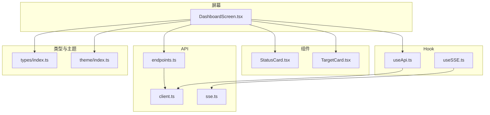
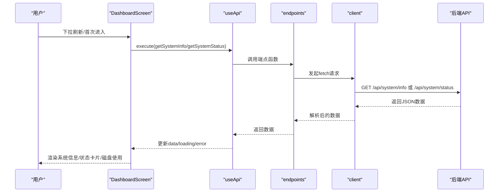
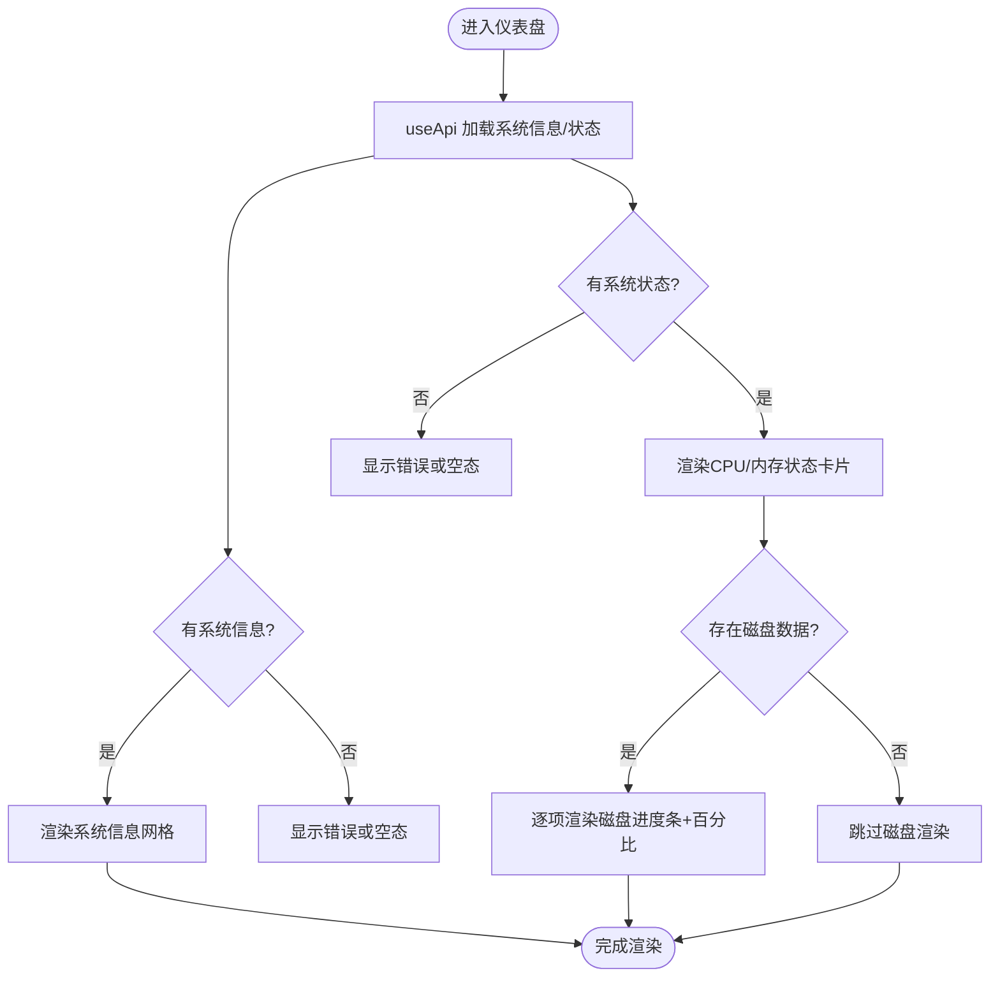
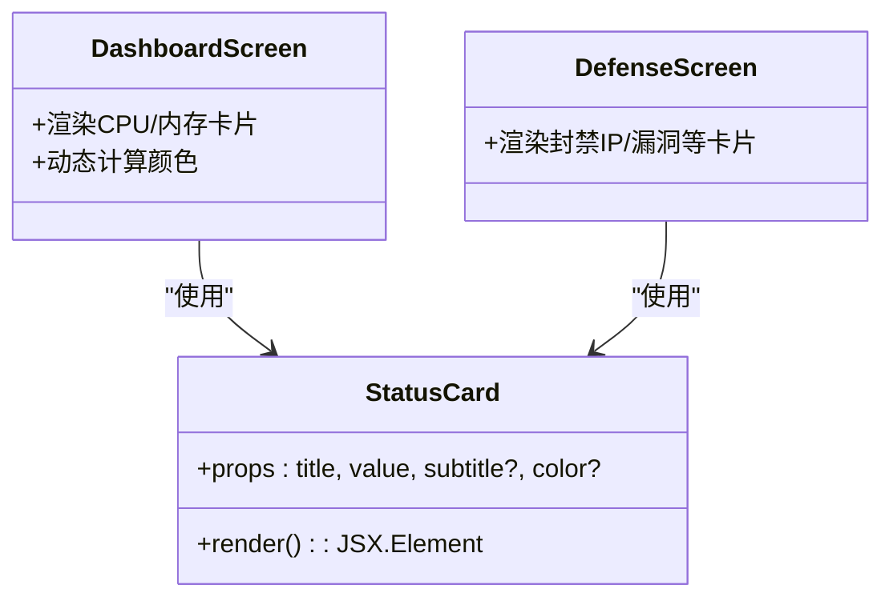
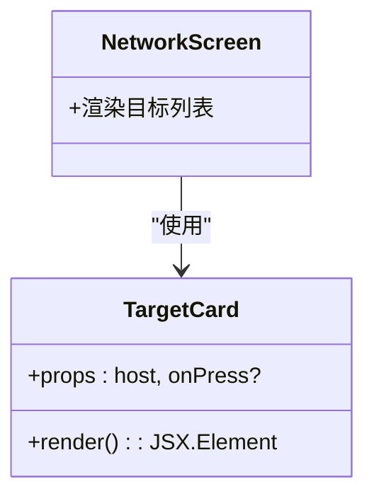
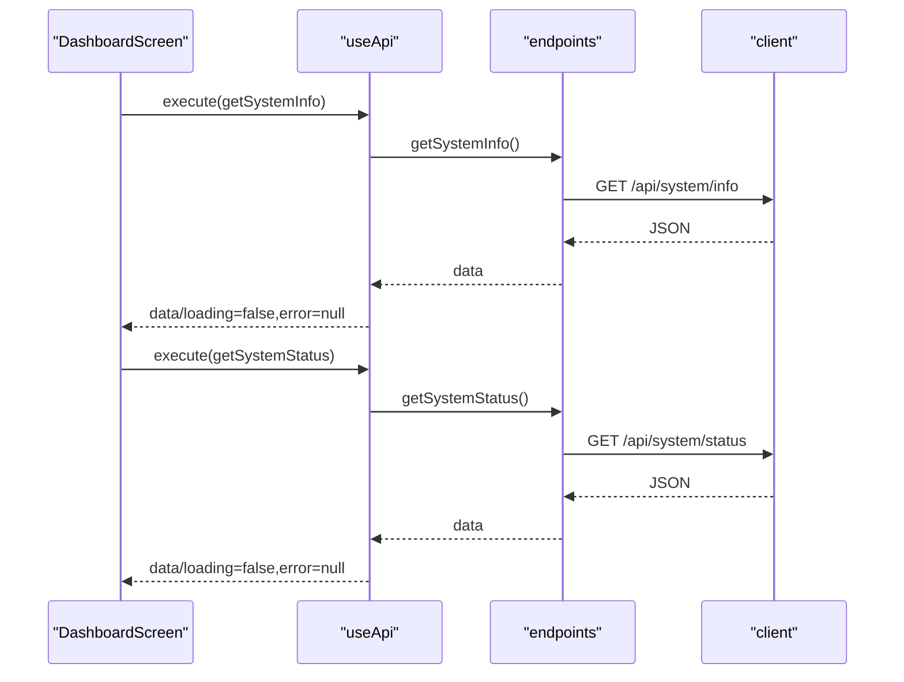
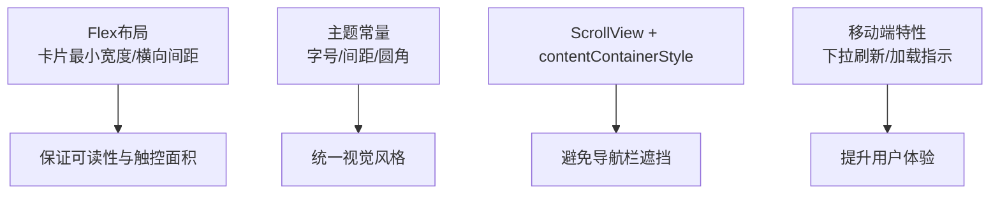
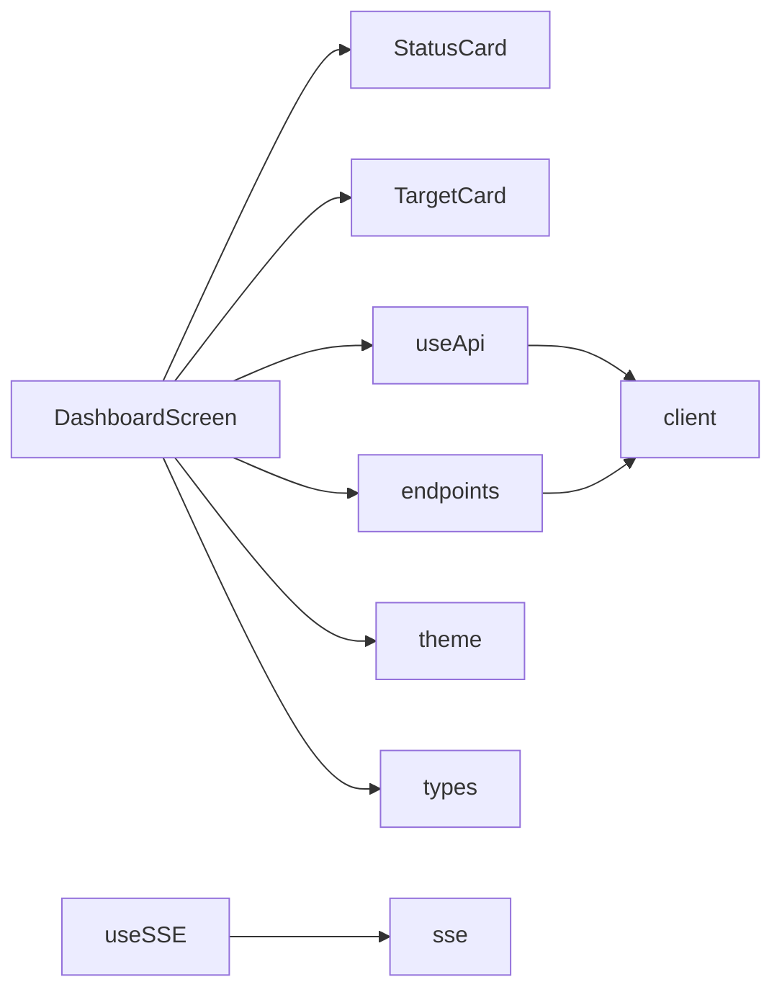

# 仪表盘界面

<cite>
**本文引用的文件**
- [DashboardScreen.tsx](file://app/src/screens/DashboardScreen.tsx)
- [StatusCard.tsx](file://app/src/components/StatusCard.tsx)
- [TargetCard.tsx](file://app/src/components/TargetCard.tsx)
- [useApi.ts](file://app/src/hooks/useApi.ts)
- [useSSE.ts](file://app/src/hooks/useSSE.ts)
- [endpoints.ts](file://app/src/api/endpoints.ts)
- [client.ts](file://app/src/api/client.ts)
- [sse.ts](file://app/src/api/sse.ts)
- [index.ts](file://app/src/types/index.ts)
- [index.ts](file://app/src/theme/index.ts)
- [App.tsx](file://app/App.tsx)
- [DefenseScreen.tsx](file://app/src/screens/DefenseScreen.tsx)
- [NetworkScreen.tsx](file://app/src/screens/NetworkScreen.tsx)
</cite>

## 目录
1. [简介](#简介)
2. [项目结构](#项目结构)
3. [核心组件](#核心组件)
4. [架构总览](#架构总览)
5. [详细组件分析](#详细组件分析)
6. [依赖关系分析](#依赖关系分析)
7. [性能考量](#性能考量)
8. [故障排查指南](#故障排查指南)
9. [结论](#结论)
10. [附录](#附录)

## 简介
本文件面向Secbot移动应用的仪表盘界面，系统性梳理了仪表盘屏幕的整体布局设计、状态卡片与目标卡片的实现细节、数据获取与更新机制（含定时刷新与手动刷新）、以及响应式与移动端适配策略。文档以代码为依据，结合可视化图示帮助读者快速理解从数据到UI的全链路。

## 项目结构
仪表盘位于React Native前端应用中，采用“屏幕 + 组件 + Hook + API”分层组织：
- 屏幕层：DashboardScreen负责页面布局与数据加载
- 组件层：StatusCard、TargetCard等复用性强的基础UI
- Hook层：useApi、useSSE封装请求与流式事件
- API层：endpoints.ts封装REST端点；client.ts统一fetch；sse.ts封装SSE连接
- 类型与主题：types/index.ts定义系统状态数据结构；theme/index.ts提供暗色主题与尺寸常量

图表来源
- [DashboardScreen.tsx](file://app/src/screens/DashboardScreen.tsx#L1-L233)
- [StatusCard.tsx](file://app/src/components/StatusCard.tsx#L1-L59)
- [TargetCard.tsx](file://app/src/components/TargetCard.tsx#L1-L121)
- [useApi.ts](file://app/src/hooks/useApi.ts#L1-L35)
- [useSSE.ts](file://app/src/hooks/useSSE.ts#L1-L51)
- [endpoints.ts](file://app/src/api/endpoints.ts#L1-L111)
- [client.ts](file://app/src/api/client.ts#L1-L49)
- [sse.ts](file://app/src/api/sse.ts#L1-L164)
- [index.ts](file://app/src/types/index.ts#L70-L109)
- [index.ts](file://app/src/theme/index.ts#L1-L64)

章节来源
- [DashboardScreen.tsx](file://app/src/screens/DashboardScreen.tsx#L1-L233)
- [App.tsx](file://app/App.tsx#L1-L108)

## 核心组件
- 仪表盘屏幕：负责系统信息与实时状态的展示，提供下拉刷新能力，使用useApi进行数据加载。
- 状态卡片：通用的指标卡片组件，支持标题、数值、副标题与颜色定制。
- 目标卡片：展示主机IP、主机名、开放端口与授权状态，支持点击交互。
- 数据钩子：useApi封装统一的loading/error/data状态；useSSE封装SSE流式事件。
- API端点：封装系统信息与系统状态的REST接口调用。

章节来源
- [DashboardScreen.tsx](file://app/src/screens/DashboardScreen.tsx#L20-L132)
- [StatusCard.tsx](file://app/src/components/StatusCard.tsx#L9-L29)
- [TargetCard.tsx](file://app/src/components/TargetCard.tsx#L11-L56)
- [useApi.ts](file://app/src/hooks/useApi.ts#L13-L34)
- [useSSE.ts](file://app/src/hooks/useSSE.ts#L9-L49)
- [endpoints.ts](file://app/src/api/endpoints.ts#L34-L39)

## 架构总览
仪表盘的数据流自上而下：屏幕组件触发数据加载，useApi执行REST请求，endpoints封装具体端点，client统一fetch，返回数据后渲染到页面。状态卡片与磁盘使用条形图直观展示指标。

图表来源
- [DashboardScreen.tsx](file://app/src/screens/DashboardScreen.tsx#L24-L31)
- [useApi.ts](file://app/src/hooks/useApi.ts#L20-L31)
- [endpoints.ts](file://app/src/api/endpoints.ts#L35-L39)
- [client.ts](file://app/src/api/client.ts#L10-L34)

## 详细组件分析

### 仪表盘屏幕布局与排布
- 页面容器：使用ScrollView包裹，设置RefreshControl实现下拉刷新；内容区padding统一，底部留白避免遮挡。
- 区块划分：
  - 系统信息区块：网格展示操作系统、架构、处理器、Python版本、主机名、用户名等。
  - 实时状态区块：CPU与内存双列状态卡片；磁盘使用按挂载点逐项展示，使用进度条与百分比标注。
- 响应式与间距：卡片采用flex布局，最小宽度与横向边距控制在小屏上仍保持良好可读性；字体与圆角由主题统一管理。

图表来源
- [DashboardScreen.tsx](file://app/src/screens/DashboardScreen.tsx#L48-L125)

章节来源
- [DashboardScreen.tsx](file://app/src/screens/DashboardScreen.tsx#L35-L132)
- [index.ts](file://app/src/theme/index.ts#L38-L63)

### 状态卡片组件实现
- 设计要点：卡片背景与边框来自主题；标题小写转大写并带字母间隔；数值使用大号加粗；副标题较小且柔和。
- 动态颜色：根据传入color属性动态着色，用于强调高危状态（如CPU/内存使用率过高）。
- 复用性：作为通用指标展示组件，被仪表盘与防御页广泛使用。

图表来源
- [StatusCard.tsx](file://app/src/components/StatusCard.tsx#L9-L29)
- [DashboardScreen.tsx](file://app/src/screens/DashboardScreen.tsx#L74-L95)
- [DefenseScreen.tsx](file://app/src/screens/DefenseScreen.tsx#L99-L122)

章节来源
- [StatusCard.tsx](file://app/src/components/StatusCard.tsx#L16-L29)
- [DashboardScreen.tsx](file://app/src/screens/DashboardScreen.tsx#L74-L95)

### 目标卡片组件设计
- 信息展示：IP地址（等宽字体）、主机名、开放端口列表（最多展示前8个并省略）。
- 状态标识：左侧图标根据授权状态切换颜色；右侧徽章显示“已授权/未授权”。
- 交互行为：卡片为可点击的TouchableOpacity，支持按下反馈与回调。

图表来源
- [TargetCard.tsx](file://app/src/components/TargetCard.tsx#L16-L56)
- [NetworkScreen.tsx](file://app/src/screens/NetworkScreen.tsx#L118-L124)

章节来源
- [TargetCard.tsx](file://app/src/components/TargetCard.tsx#L16-L56)
- [NetworkScreen.tsx](file://app/src/screens/NetworkScreen.tsx#L118-L124)

### 数据获取与更新机制
- 手动刷新：DashboardScreen通过RefreshControl触发loadData，同时调用系统信息与系统状态两个端点。
- 自动加载：组件挂载时立即执行一次数据加载。
- 状态同步：useApi维护data/loading/error三态，确保UI在请求期间显示加载指示，在错误时显示错误文本。
- 错误处理：统一捕获异常并设置error字段，便于在渲染阶段显示提示。

图表来源
- [DashboardScreen.tsx](file://app/src/screens/DashboardScreen.tsx#L24-L31)
- [useApi.ts](file://app/src/hooks/useApi.ts#L20-L31)
- [endpoints.ts](file://app/src/api/endpoints.ts#L35-L39)
- [client.ts](file://app/src/api/client.ts#L36-L46)

章节来源
- [DashboardScreen.tsx](file://app/src/screens/DashboardScreen.tsx#L20-L31)
- [useApi.ts](file://app/src/hooks/useApi.ts#L13-L34)
- [endpoints.ts](file://app/src/api/endpoints.ts#L34-L39)

### 响应式设计与移动端适配
- Flex布局：状态卡片与磁盘行采用flex-row，保证在不同屏幕宽度下自动换行与对齐。
- 字体与间距：所有字号、间距、圆角均来自主题常量，确保一致的视觉节奏与可读性。
- 滚动容器：ScrollView配合contentContainerStyle实现内边距与底部留白，避免导航栏遮挡。
- 小屏优化：卡片最小宽度与横向间距在小屏设备上仍保持良好的信息密度与可触摸区域。

图表来源
- [DashboardScreen.tsx](file://app/src/screens/DashboardScreen.tsx#L199-L231)
- [index.ts](file://app/src/theme/index.ts#L38-L63)
- [App.tsx](file://app/App.tsx#L28-L107)

章节来源
- [DashboardScreen.tsx](file://app/src/screens/DashboardScreen.tsx#L145-L232)
- [index.ts](file://app/src/theme/index.ts#L38-L63)
- [App.tsx](file://app/App.tsx#L28-L107)

## 依赖关系分析
- 屏幕依赖：DashboardScreen依赖StatusCard、Theme、useApi与endpoints；通过useApi驱动数据加载。
- 组件依赖：StatusCard、TargetCard为纯展示组件，依赖Theme与图标库。
- Hook依赖：useApi依赖React状态；useSSE依赖AbortController与SSE解析逻辑。
- API依赖：endpoints依赖client；client基于fetch；sse封装SSE连接与解析。

图表来源
- [DashboardScreen.tsx](file://app/src/screens/DashboardScreen.tsx#L15-L18)
- [StatusCard.tsx](file://app/src/components/StatusCard.tsx#L7)
- [TargetCard.tsx](file://app/src/components/TargetCard.tsx#L7)
- [useApi.ts](file://app/src/hooks/useApi.ts#L5)
- [useSSE.ts](file://app/src/hooks/useSSE.ts#L6)
- [endpoints.ts](file://app/src/api/endpoints.ts#L5)
- [client.ts](file://app/src/api/client.ts#L5)
- [sse.ts](file://app/src/api/sse.ts#L6)
- [index.ts](file://app/src/types/index.ts#L70-L109)
- [index.ts](file://app/src/theme/index.ts#L5-L36)

章节来源
- [DashboardScreen.tsx](file://app/src/screens/DashboardScreen.tsx#L15-L18)
- [endpoints.ts](file://app/src/api/endpoints.ts#L34-L39)
- [client.ts](file://app/src/api/client.ts#L36-L46)

## 性能考量
- 请求合并：当前仪表盘在loadData中并行触发两个端点请求，减少等待时间。
- 加载指示：使用ActivityIndicator与RefreshControl，避免空白屏带来的卡顿感。
- 渲染优化：磁盘进度条使用内联样式宽度，避免复杂动画；卡片最小宽度与flex布局减少重排。
- 错误短路：useApi在错误时直接返回错误字符串，避免无效渲染。

[本节为通用指导，不直接分析具体文件]

## 故障排查指南
- 网络错误：检查BASE_URL配置与后端连通性；SSE连接超时提示需确认后端已启动且网络可达。
- 数据为空：确认后端接口返回格式与类型定义一致；检查useApi的execute是否被正确调用。
- UI异常：核对主题颜色与字号是否被覆盖；检查ScrollView的contentContainerStyle是否导致滚动异常。

章节来源
- [client.ts](file://app/src/api/client.ts#L28-L31)
- [sse.ts](file://app/src/api/sse.ts#L115-L119)
- [useApi.ts](file://app/src/hooks/useApi.ts#L26-L30)

## 结论
仪表盘界面以清晰的分区与卡片化设计呈现系统信息与实时状态，结合useApi的统一数据流与主题化的视觉体系，实现了良好的可读性与一致性。通过下拉刷新与错误处理机制，提升了用户体验。未来可在以下方面持续优化：
- 引入定时轮询或SSE订阅，实现更及时的状态更新；
- 在目标卡片中增加操作按钮（如授权/撤销），并与NetworkScreen联动；
- 对磁盘使用条形图增加点击展开详情的能力。

[本节为总结性内容，不直接分析具体文件]

## 附录
- 类型定义：系统信息与系统状态的数据结构定义于types/index.ts，确保前后端契约一致。
- 主题常量：Colors、Spacing、FontSize、BorderRadius集中管理，便于全局调整与维护。

章节来源
- [index.ts](file://app/src/types/index.ts#L72-L109)
- [index.ts](file://app/src/theme/index.ts#L5-L63)