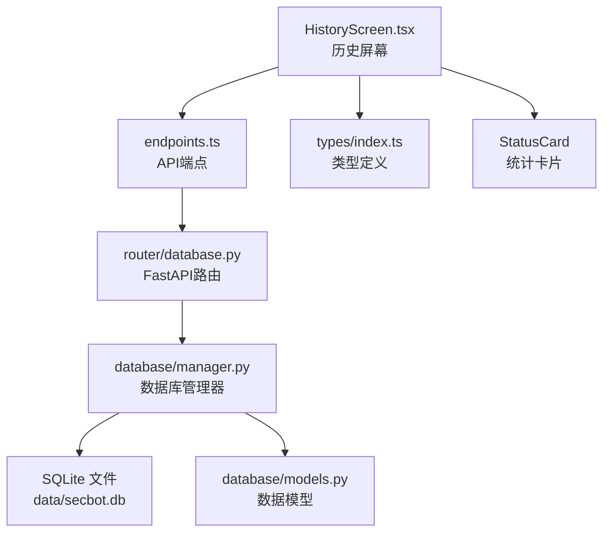
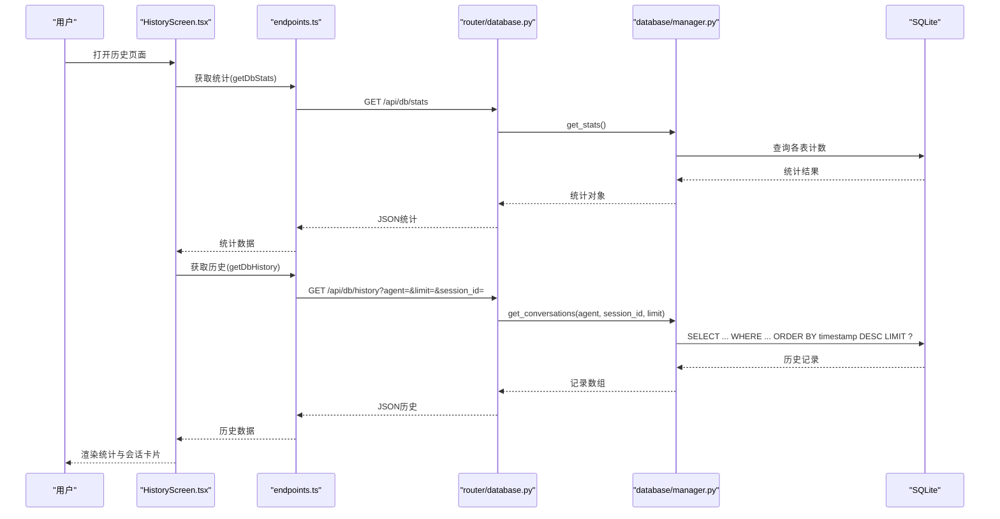
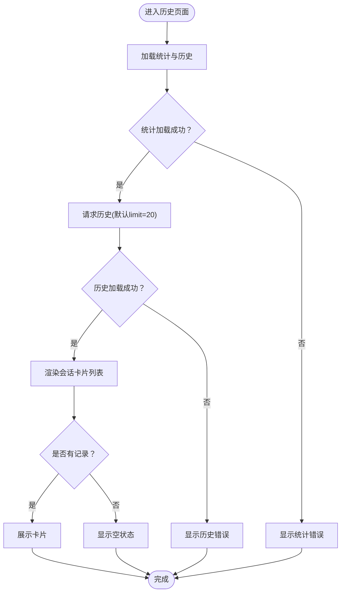
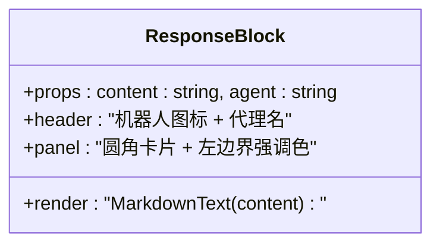
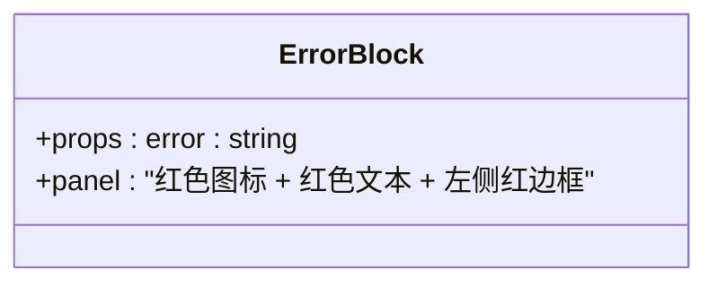
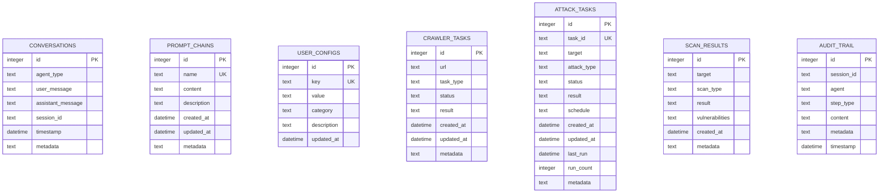
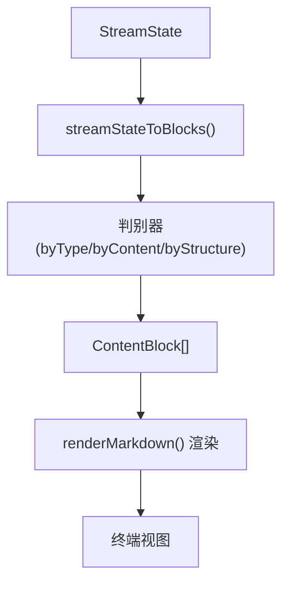
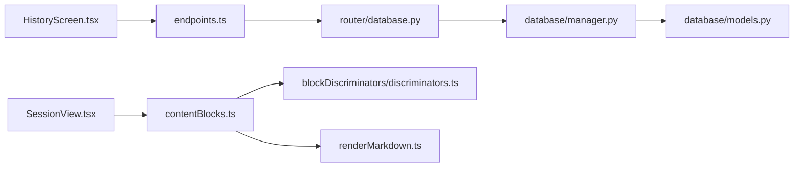

# 历史记录界面

<cite>
**本文引用的文件**
- [app/src/screens/HistoryScreen.tsx](file://app/src/screens/HistoryScreen.tsx)
- [app/src/components/ResponseBlock.tsx](file://app/src/components/ResponseBlock.tsx)
- [app/src/components/ErrorBlock.tsx](file://app/src/components/ErrorBlock.tsx)
- [app/src/types/index.ts](file://app/src/types/index.ts)
- [app/src/api/endpoints.ts](file://app/src/api/endpoints.ts)
- [router/database.py](file://router/database.py)
- [database/manager.py](file://database/manager.py)
- [database/models.py](file://database/models.py)
- [terminal-ui/src/views/SessionView.tsx](file://terminal-ui/src/views/SessionView.tsx)
- [terminal-ui/src/contentBlocks.ts](file://terminal-ui/src/contentBlocks.ts)
- [terminal-ui/src/blockDiscriminators/discriminators.ts](file://terminal-ui/src/blockDiscriminators/discriminators.ts)
- [terminal-ui/src/renderMarkdown.ts](file://terminal-ui/src/renderMarkdown.ts)
</cite>

## 目录
1. [简介](#简介)
2. [项目结构](#项目结构)
3. [核心组件](#核心组件)
4. [架构总览](#架构总览)
5. [详细组件分析](#详细组件分析)
6. [依赖关系分析](#依赖关系分析)
7. [性能考量](#性能考量)
8. [故障排查指南](#故障排查指南)
9. [结论](#结论)
10. [附录](#附录)

## 简介
本文件面向Secbot移动端应用的历史记录界面，系统性梳理界面设计、数据流、组件实现与后端存储机制。重点覆盖：
- 历史屏幕的界面布局与交互：会话列表展示、历史记录筛选与清空、统计卡片展示
- 响应块与错误块组件：消息格式化、错误信息展示与类型识别、快速访问能力
- 历史数据的存储与检索：SQLite持久化、后端接口参数与分页策略
- 性能优化与用户体验：加载控制、刷新机制、错误提示与可访问性

## 项目结构
移动端历史记录界面位于React Native应用中，采用自定义Hook封装API调用，配合主题样式与卡片组件实现统一视觉风格。

图表来源
- [app/src/screens/HistoryScreen.tsx](file://app/src/screens/HistoryScreen.tsx#L22-L138)
- [app/src/api/endpoints.ts](file://app/src/api/endpoints.ts#L84-L110)
- [router/database.py](file://router/database.py#L17-L91)
- [database/manager.py](file://database/manager.py#L26-L204)
- [database/models.py](file://database/models.py#L9-L51)

章节来源
- [app/src/screens/HistoryScreen.tsx](file://app/src/screens/HistoryScreen.tsx#L1-L138)
- [app/src/api/endpoints.ts](file://app/src/api/endpoints.ts#L1-L111)
- [router/database.py](file://router/database.py#L1-L91)
- [database/manager.py](file://database/manager.py#L1-L204)
- [database/models.py](file://database/models.py#L1-L90)

## 核心组件
- 历史屏幕（HistoryScreen）：负责加载数据库统计与历史会话列表，提供下拉刷新与一键清空功能。
- 响应块（ResponseBlock）：用于展示最终响应内容，包含代理标识与Markdown渲染。
- 错误块（ErrorBlock）：用于展示错误信息，包含图标与颜色标识。
- 类型定义（types/index.ts）：定义数据库统计、历史记录与清空响应的结构。
- API端点（endpoints.ts）：封装/get /api/db/stats、/api/db/history、/api/db/history（DELETE）等接口。
- 后端路由（router/database.py）：提供统计、历史查询与清空接口，参数支持agent与session_id过滤，limit限制返回数量。
- 数据库管理器（database/manager.py）：基于SQLite实现表初始化、索引、增删改查与统计聚合。
- 数据模型（database/models.py）：定义对话记录、提示词链、用户配置、爬虫任务等模型。

章节来源
- [app/src/screens/HistoryScreen.tsx](file://app/src/screens/HistoryScreen.tsx#L22-L138)
- [app/src/components/ResponseBlock.tsx](file://app/src/components/ResponseBlock.tsx#L1-L71)
- [app/src/components/ErrorBlock.tsx](file://app/src/components/ErrorBlock.tsx#L1-L52)
- [app/src/types/index.ts](file://app/src/types/index.ts#L161-L185)
- [app/src/api/endpoints.ts](file://app/src/api/endpoints.ts#L84-L110)
- [router/database.py](file://router/database.py#L20-L91)
- [database/manager.py](file://database/manager.py#L26-L307)
- [database/models.py](file://database/models.py#L9-L51)

## 架构总览
移动端通过API端点调用后端FastAPI路由，后端使用数据库管理器访问SQLite数据库，返回结构化数据给前端渲染。

图表来源
- [app/src/screens/HistoryScreen.tsx](file://app/src/screens/HistoryScreen.tsx#L26-L33)
- [app/src/api/endpoints.ts](file://app/src/api/endpoints.ts#L84-L99)
- [router/database.py](file://router/database.py#L38-L71)
- [database/manager.py](file://database/manager.py#L230-L278)

## 详细组件分析

### 历史屏幕（HistoryScreen）
- 加载策略：首次挂载即触发统计与历史加载；下拉刷新同步执行相同逻辑。
- 列表渲染：遍历历史记录数组，每个元素渲染为卡片，包含代理类型、时间戳、用户消息与助手消息摘要。
- 清空功能：弹出确认对话框，确认后调用清空接口并重新加载数据。
- 错误处理：当统计或历史请求出现错误时，以文本形式展示错误信息。

图表来源
- [app/src/screens/HistoryScreen.tsx](file://app/src/screens/HistoryScreen.tsx#L26-L138)

章节来源
- [app/src/screens/HistoryScreen.tsx](file://app/src/screens/HistoryScreen.tsx#L22-L138)

### 响应块组件（ResponseBlock）
- 用途：展示最终响应内容，包含代理标识与Markdown渲染区域。
- 设计要点：标题栏包含代理名与图标；内容面板使用圆角边框与左边界强调色；内容通过MarkdownText组件渲染。

图表来源
- [app/src/components/ResponseBlock.tsx](file://app/src/components/ResponseBlock.tsx#L11-L33)

章节来源
- [app/src/components/ResponseBlock.tsx](file://app/src/components/ResponseBlock.tsx#L1-L71)

### 错误块组件（ErrorBlock）
- 用途：展示错误信息，包含错误图标与颜色标识。
- 设计要点：容器使用浅红背景与左侧红色边框；文本颜色与边框颜色一致，确保可读性与一致性。

图表来源
- [app/src/components/ErrorBlock.tsx](file://app/src/components/ErrorBlock.tsx#L11-L25)

章节来源
- [app/src/components/ErrorBlock.tsx](file://app/src/components/ErrorBlock.tsx#L1-L52)

### 历史数据存储与检索
- 数据库模型：对话记录包含代理类型、用户消息、助手消息、会话ID、时间戳与元数据。
- 表与索引：初始化时创建conversations表并建立session_id与timestamp索引，提升查询效率。
- 查询接口：支持按agent_type与session_id过滤，按时间倒序返回，limit限制结果数量。
- 清空接口：支持按agent_type与session_id删除，返回删除数量与成功状态。

图表来源
- [database/models.py](file://database/models.py#L9-L89)
- [database/manager.py](file://database/manager.py#L75-L203)

章节来源
- [database/models.py](file://database/models.py#L9-L89)
- [database/manager.py](file://database/manager.py#L75-L307)
- [router/database.py](file://router/database.py#L38-L91)

### 历史记录筛选与详情查看
- 筛选参数：前端端点支持agent、limit、session_id；后端路由同样支持agent与session_id过滤。
- 详情查看：当前历史卡片仅展示摘要（用户消息与助手消息前若干行），如需完整详情，可在会话视图中查看流式渲染的完整块。

章节来源
- [app/src/api/endpoints.ts](file://app/src/api/endpoints.ts#L88-L99)
- [router/database.py](file://router/database.py#L39-L51)
- [terminal-ui/src/views/SessionView.tsx](file://terminal-ui/src/views/SessionView.tsx#L30-L381)

### 响应块组件实现（终端UI）
- 流式渲染：将StreamState转换为多个内容块，支持折叠/展开、截断与错误标准化。
- 错误类型识别：通过内容特征判别器识别错误、警告、JSON、表格、终端命令等块类型。
- Markdown渲染：终端环境下的Markdown渲染器确保标题、加粗等格式正确输出。

图表来源
- [terminal-ui/src/contentBlocks.ts](file://terminal-ui/src/contentBlocks.ts#L43-L159)
- [terminal-ui/src/blockDiscriminators/discriminators.ts](file://terminal-ui/src/blockDiscriminators/discriminators.ts#L7-L62)
- [terminal-ui/src/renderMarkdown.ts](file://terminal-ui/src/renderMarkdown.ts#L26-L31)

章节来源
- [terminal-ui/src/contentBlocks.ts](file://terminal-ui/src/contentBlocks.ts#L1-L160)
- [terminal-ui/src/blockDiscriminators/discriminators.ts](file://terminal-ui/src/blockDiscriminators/discriminators.ts#L1-L63)
- [terminal-ui/src/renderMarkdown.ts](file://terminal-ui/src/renderMarkdown.ts#L1-L31)

## 依赖关系分析
- 前端依赖：HistoryScreen依赖useApi Hook与主题样式；通过endpoints.ts调用后端接口；类型定义来自types/index.ts。
- 后端依赖：router/database.py依赖database/manager.py进行数据库操作；database/manager.py依赖SQLite与models定义。
- 终端UI：SessionView负责流式渲染与滚动控制，与历史记录界面互补。

图表来源
- [app/src/screens/HistoryScreen.tsx](file://app/src/screens/HistoryScreen.tsx#L17-L20)
- [app/src/api/endpoints.ts](file://app/src/api/endpoints.ts#L5-L21)
- [router/database.py](file://router/database.py#L9-L15)
- [database/manager.py](file://database/manager.py#L13-L21)
- [database/models.py](file://database/models.py#L1-L90)
- [terminal-ui/src/views/SessionView.tsx](file://terminal-ui/src/views/SessionView.tsx#L30-L80)
- [terminal-ui/src/contentBlocks.ts](file://terminal-ui/src/contentBlocks.ts#L43-L51)
- [terminal-ui/src/blockDiscriminators/discriminators.ts](file://terminal-ui/src/blockDiscriminators/discriminators.ts#L7-L18)
- [terminal-ui/src/renderMarkdown.ts](file://terminal-ui/src/renderMarkdown.ts#L26-L31)

章节来源
- [app/src/screens/HistoryScreen.tsx](file://app/src/screens/HistoryScreen.tsx#L1-L21)
- [app/src/api/endpoints.ts](file://app/src/api/endpoints.ts#L1-L21)
- [router/database.py](file://router/database.py#L1-L17)
- [database/manager.py](file://database/manager.py#L1-L26)
- [database/models.py](file://database/models.py#L1-L9)
- [terminal-ui/src/views/SessionView.tsx](file://terminal-ui/src/views/SessionView.tsx#L1-L30)

## 性能考量
- 分页与限制：后端接口支持limit参数，默认前端请求limit=20，避免一次性加载过多历史记录。
- 索引优化：conversations表对session_id与timestamp建立索引，提升按会话与时间排序查询性能。
- 数据截断：终端UI对长内容块进行截断与折叠，减少渲染压力与滚动卡顿。
- 错误标准化：对常见连接中断、超时、取消等错误进行统一提示，降低用户困惑。
- 刷新控制：下拉刷新与加载状态合并，避免重复请求与闪烁。

章节来源
- [app/src/api/endpoints.ts](file://app/src/api/endpoints.ts#L88-L99)
- [router/database.py](file://router/database.py#L40-L42)
- [database/manager.py](file://database/manager.py#L176-L201)
- [terminal-ui/src/contentBlocks.ts](file://terminal-ui/src/contentBlocks.ts#L22-L26)
- [terminal-ui/src/contentBlocks.ts](file://terminal-ui/src/contentBlocks.ts#L28-L41)

## 故障排查指南
- 无法加载历史或统计
  - 检查后端是否正常运行与SECBOT_API_URL配置
  - 查看HTTP状态码与异常信息，确认数据库连接与权限
- 清空历史失败
  - 确认请求参数agent与session_id是否正确
  - 查看后端异常日志与数据库事务状态
- 显示为空
  - 确认数据库中是否存在符合条件的记录
  - 检查过滤条件（agent、session_id）是否过于严格
- 错误信息不明确
  - 使用终端UI的错误块组件查看原始错误内容
  - 关注错误标准化提示（连接中断、超时、取消）

章节来源
- [router/database.py](file://router/database.py#L34-L36)
- [router/database.py](file://router/database.py#L70-L72)
- [router/database.py](file://router/database.py#L89-L91)
- [terminal-ui/src/contentBlocks.ts](file://terminal-ui/src/contentBlocks.ts#L28-L41)

## 结论
历史记录界面通过简洁的卡片布局与清晰的统计展示，实现了对历史会话的快速浏览与管理。结合后端的SQLite存储与索引优化、以及终端UI的流式渲染与错误识别，整体具备良好的可维护性与用户体验。建议后续可扩展为支持更多筛选维度与分页加载，进一步提升大数据量场景下的性能与可用性。

## 附录
- 快速访问建议
  - 在历史卡片中增加点击跳转至完整会话视图的能力（当前为摘要展示）
  - 增加搜索框与多维筛选（代理类型、时间范围、关键词）
  - 支持批量选择与多选清空，提升管理效率