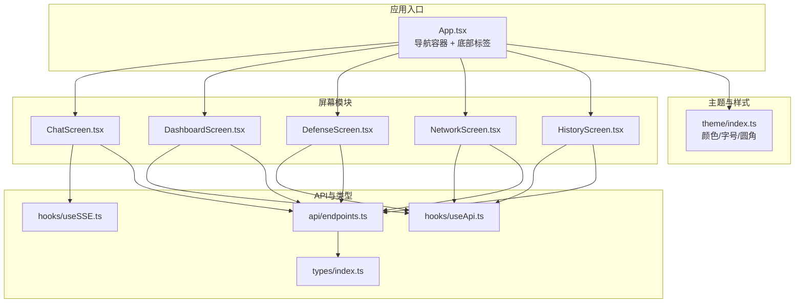
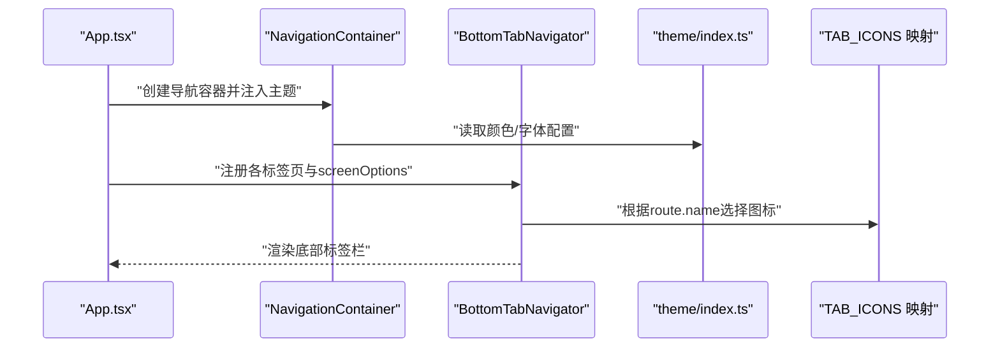
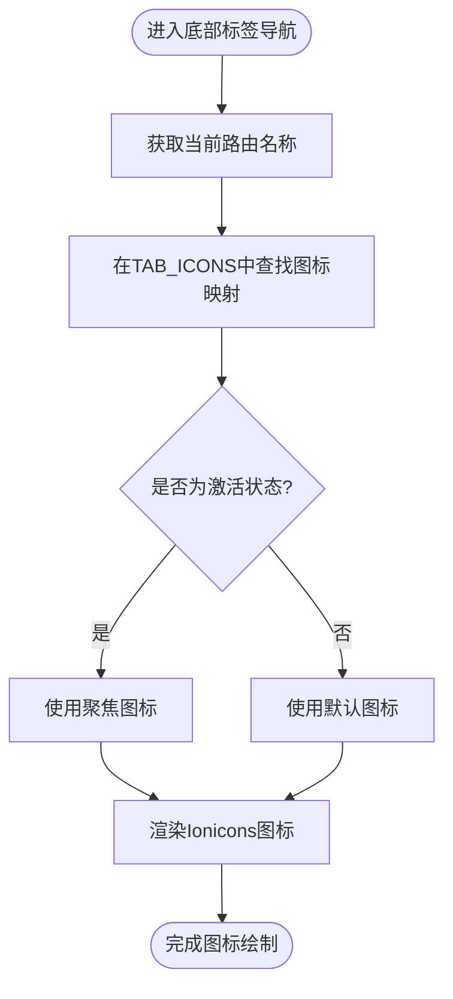
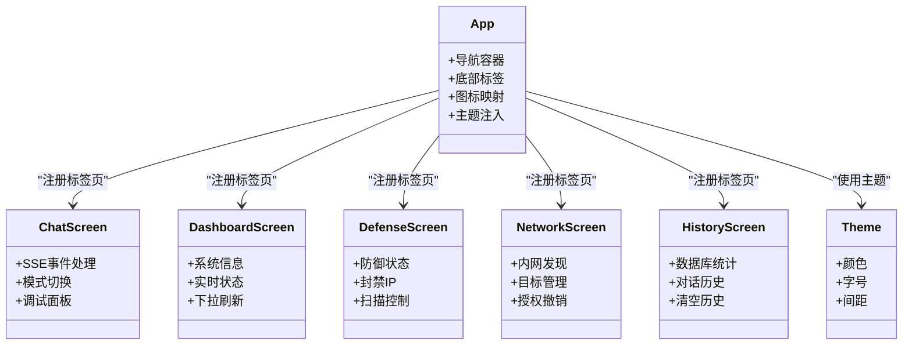
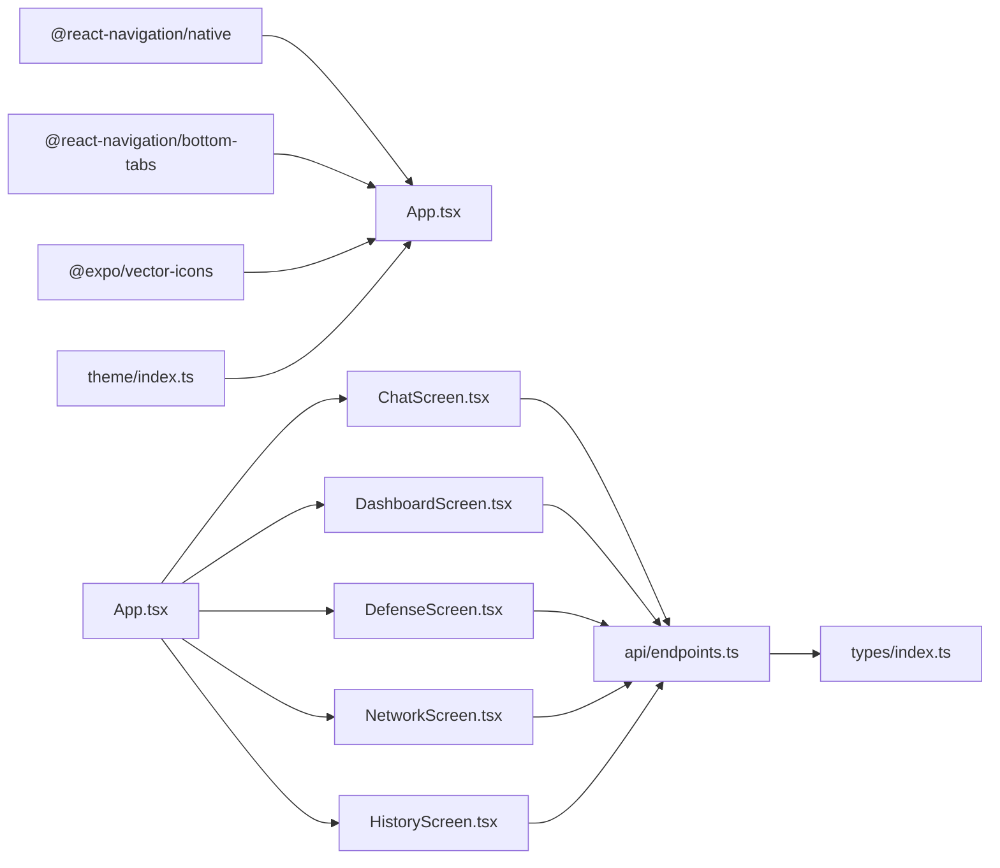

# 导航系统

<cite>
**本文引用的文件**
- [App.tsx](file://app/App.tsx)
- [index.ts](file://app/src/theme/index.ts)
- [ChatScreen.tsx](file://app/src/screens/ChatScreen.tsx)
- [DashboardScreen.tsx](file://app/src/screens/DashboardScreen.tsx)
- [DefenseScreen.tsx](file://app/src/screens/DefenseScreen.tsx)
- [NetworkScreen.tsx](file://app/src/screens/NetworkScreen.tsx)
- [HistoryScreen.tsx](file://app/src/screens/HistoryScreen.tsx)
- [endpoints.ts](file://app/src/api/endpoints.ts)
- [index.ts](file://app/src/types/index.ts)
- [useApi.ts](file://app/src/hooks/useApi.ts)
- [useSSE.ts](file://app/src/hooks/useSSE.ts)
- [package.json](file://app/package.json)
</cite>

## 目录
1. [简介](#简介)
2. [项目结构](#项目结构)
3. [核心组件](#核心组件)
4. [架构总览](#架构总览)
5. [详细组件分析](#详细组件分析)
6. [依赖关系分析](#依赖关系分析)
7. [性能考虑](#性能考虑)
8. [故障排查指南](#故障排查指南)
9. [结论](#结论)
10. [附录](#附录)

## 简介
本文件面向Secbot移动端（React Native + Expo）的导航系统，聚焦于基于React Navigation的底部标签导航实现。文档将从架构设计、组件关系、数据与处理逻辑、集成点、错误处理与性能优化等维度进行系统化说明，并结合代码级图示帮助读者快速理解与扩展。

## 项目结构
移动端入口位于应用根目录，导航容器与底部标签在应用入口文件中统一配置，各标签页作为独立屏幕模块组织，主题与样式通过集中主题文件管理，API访问与状态管理通过Hook封装。

图表来源
- [App.tsx](file://app/App.tsx#L28-L108)
- [index.ts](file://app/src/theme/index.ts#L5-L63)
- [ChatScreen.tsx](file://app/src/screens/ChatScreen.tsx#L15-L31)
- [DashboardScreen.tsx](file://app/src/screens/DashboardScreen.tsx#L5-L18)
- [DefenseScreen.tsx](file://app/src/screens/DefenseScreen.tsx#L5-L26)
- [NetworkScreen.tsx](file://app/src/screens/NetworkScreen.tsx#L5-L29)
- [HistoryScreen.tsx](file://app/src/screens/HistoryScreen.tsx#L5-L20)
- [endpoints.ts](file://app/src/api/endpoints.ts#L5-L21)
- [useApi.ts](file://app/src/hooks/useApi.ts#L13-L34)
- [useSSE.ts](file://app/src/hooks/useSSE.ts#L9-L50)

章节来源
- [App.tsx](file://app/App.tsx#L28-L108)
- [package.json](file://app/package.json#L11-L23)

## 核心组件
- 导航容器与底部标签
  - 使用NavigationContainer包裹，启用深色主题与自定义字体族。
  - 使用createBottomTabNavigator创建底部标签导航，集中screenOptions统一配置图标、标签样式、头部样式等。
  - 通过TAB_ICONS映射每个标签页的聚焦/非聚焦图标，按route.name动态选择。
- 主题与样式
  - Colors集中定义主色、背景、表面、文字、状态色与边框色。
  - FontSize与Spacing提供字号与间距规范，确保视觉一致性。
- 屏幕模块
  - ChatScreen：SSE流式渲染，支持模式切换与调试面板。
  - DashboardScreen：系统信息与实时状态展示，支持下拉刷新。
  - DefenseScreen：防御状态、封禁IP与扫描控制。
  - NetworkScreen：内网发现、目标管理与授权撤销。
  - HistoryScreen：数据库统计与对话历史，支持清空操作。
- API与状态管理
  - useApi：统一的异步请求Hook，返回data/loading/error与execute函数。
  - useSSE：SSE流式订阅Hook，支持启动/停止与回调处理。
  - endpoints：对后端接口的薄封装，便于屏幕模块调用。

章节来源
- [App.tsx](file://app/App.tsx#L28-L108)
- [index.ts](file://app/src/theme/index.ts#L5-L63)
- [ChatScreen.tsx](file://app/src/screens/ChatScreen.tsx#L61-L436)
- [DashboardScreen.tsx](file://app/src/screens/DashboardScreen.tsx#L20-L131)
- [DefenseScreen.tsx](file://app/src/screens/DefenseScreen.tsx#L28-L183)
- [NetworkScreen.tsx](file://app/src/screens/NetworkScreen.tsx#L31-L162)
- [HistoryScreen.tsx](file://app/src/screens/HistoryScreen.tsx#L22-L137)
- [endpoints.ts](file://app/src/api/endpoints.ts#L23-L110)
- [useApi.ts](file://app/src/hooks/useApi.ts#L13-L34)
- [useSSE.ts](file://app/src/hooks/useSSE.ts#L9-L50)

## 架构总览
以下序列图展示了应用启动到底部标签导航呈现的关键流程，以及图标映射与主题定制的参与点。

图表来源
- [App.tsx](file://app/App.tsx#L28-L108)
- [index.ts](file://app/src/theme/index.ts#L5-L63)

## 详细组件分析

### 底部标签导航配置与图标映射
- 导航容器
  - 启用深色主题，颜色方案来自主题文件，字体族统一使用系统字体并设置常规/中等/粗体/特粗权重。
- 标签页注册
  - 注册五个标签页：Chat、Dashboard、Defense、Network、History。
  - 每个标签页options提供标题与头部样式覆盖。
- 图标映射系统
  - TAB_ICONS以route.name为键，映射聚焦与非聚焦图标名称。
  - tabBarIcon根据focused状态在两个图标间切换。
- 样式定制
  - 活跃/非活跃文字颜色、标签栏背景、顶部边框、高度与内边距。
  - 头部背景、边框、文字颜色与标题字重。

图表来源
- [App.tsx](file://app/App.tsx#L20-L26)
- [App.tsx](file://app/App.tsx#L51-L56)

章节来源
- [App.tsx](file://app/App.tsx#L20-L26)
- [App.tsx](file://app/App.tsx#L51-L78)

### 主题定制与字体配置
- 颜色体系
  - 主色、强调色、背景、表面、卡片、文字、状态色（成功/警告/危险/信息）、边框与特殊用途色。
- 字号与间距
  - 提供xs/sm/md/lg/xl/xxl及标题字号，配合Spacing提供统一的布局间距。
- 导航主题注入
  - NavigationContainer的theme字段将Colors与FontSize映射到导航组件的颜色与字体。

章节来源
- [index.ts](file://app/src/theme/index.ts#L5-L63)
- [App.tsx](file://app/App.tsx#L31-L47)

### 各导航标签页配置参数
- Chat（聊天）
  - 标题：中文“聊天”，头部标题固定为“Hackbot”。
  - 功能：SSE流式渲染、模式切换（Ask/Agent）、子模式（自动/专家）、模型选择、调试面板。
- Dashboard（仪表盘）
  - 标题：中文“仪表盘”。
  - 功能：系统信息网格、实时状态卡片（CPU/内存/磁盘），支持下拉刷新。
- Defense（防御）
  - 标题：中文“防御”。
  - 功能：防御状态卡片、封禁IP列表、一键扫描、解封操作。
- Network（网络）
  - 标题：中文“网络”。
  - 功能：内网发现、目标主机列表、授权记录与撤销。
- History（历史）
  - 标题：中文“历史”。
  - 功能：数据库统计卡片、对话历史列表、清空历史。

章节来源
- [App.tsx](file://app/App.tsx#L80-L104)
- [ChatScreen.tsx](file://app/src/screens/ChatScreen.tsx#L61-L436)
- [DashboardScreen.tsx](file://app/src/screens/DashboardScreen.tsx#L20-L131)
- [DefenseScreen.tsx](file://app/src/screens/DefenseScreen.tsx#L28-L183)
- [NetworkScreen.tsx](file://app/src/screens/NetworkScreen.tsx#L31-L162)
- [HistoryScreen.tsx](file://app/src/screens/HistoryScreen.tsx#L22-L137)

### 导航状态管理与路由跳转
- 当前实现
  - 底部标签导航采用本地路由切换，不涉及显式的路由跳转API调用。
  - 各屏幕内部通过API Hook与SSE Hook管理数据与流式事件，不直接跨屏传递复杂状态。
- 状态与事件
  - useApi返回data/loading/error与execute，统一处理加载态与错误态。
  - useSSE提供streaming状态与startStream/stopStream，配合屏幕内的事件处理函数更新UI。
- 路由跳转建议
  - 若需在屏幕内触发跳转，可在屏幕组件中使用NavigationContainer上下文或@react-navigation/native的导航器方法（例如navigate/replace等）。
  - 建议在屏幕组件顶层通过useNavigation Hook获取导航器实例，避免在深层组件中重复注入。

章节来源
- [useApi.ts](file://app/src/hooks/useApi.ts#L13-L34)
- [useSSE.ts](file://app/src/hooks/useSSE.ts#L9-L50)
- [ChatScreen.tsx](file://app/src/screens/ChatScreen.tsx#L69-L70)

### 类关系与组件交互（代码级）

图表来源
- [App.tsx](file://app/App.tsx#L28-L108)
- [ChatScreen.tsx](file://app/src/screens/ChatScreen.tsx#L61-L436)
- [DashboardScreen.tsx](file://app/src/screens/DashboardScreen.tsx#L20-L131)
- [DefenseScreen.tsx](file://app/src/screens/DefenseScreen.tsx#L28-L183)
- [NetworkScreen.tsx](file://app/src/screens/NetworkScreen.tsx#L31-L162)
- [HistoryScreen.tsx](file://app/src/screens/HistoryScreen.tsx#L22-L137)
- [index.ts](file://app/src/theme/index.ts#L5-L63)

## 依赖关系分析
- 导航依赖
  - @react-navigation/native与@react-navigation/bottom-tabs提供导航容器与底部标签能力。
  - @expo/vector-icons提供图标库，用于标签图标与界面元素。
- 主题与样式
  - theme/index.ts集中管理颜色、字号与间距，被导航与各屏幕共享。
- 屏幕与API
  - 各屏幕通过endpoints封装的API方法与useApi/useSSE进行数据交互。
- 类型系统
  - types/index.ts提供统一的类型定义，确保API响应与渲染块类型一致。

图表来源
- [package.json](file://app/package.json#L11-L23)
- [App.tsx](file://app/App.tsx#L28-L108)
- [index.ts](file://app/src/theme/index.ts#L5-L63)
- [endpoints.ts](file://app/src/api/endpoints.ts#L5-L21)
- [index.ts](file://app/src/types/index.ts#L5-L200)

章节来源
- [package.json](file://app/package.json#L11-L23)

## 性能考虑
- 图标与渲染
  - 使用静态图标映射与受控的tabBarIcon渲染，避免在渲染周期内进行昂贵计算。
  - 控制标签栏高度与内边距，减少不必要的重绘区域。
- 数据加载
  - useApi在每次execute前重置状态，避免旧数据干扰。
  - 下拉刷新仅在必要时触发，避免频繁请求。
- 流式事件
  - useSSE在启动新流前主动abort上一个流，防止并发事件堆积。
  - 事件处理函数中尽量做轻量更新，避免大对象深拷贝。
- 主题与字体
  - 字体族统一使用系统字体，减少自定义字体加载开销。
  - 颜色与字号集中管理，降低样式计算成本。

## 故障排查指南
- 图标不显示或异常
  - 检查TAB_ICONS中是否存在对应route.name的映射。
  - 确认focused状态与图标名称匹配。
- 主题颜色不生效
  - 确认NavigationContainer的theme正确注入Colors与Fonts。
  - 检查主题文件中颜色值是否符合预期。
- 标签页无法切换
  - 确认Tab.Navigator内已注册对应name的标签页。
  - 检查options.title与headerTitle是否冲突。
- 数据加载失败
  - 查看useApi返回的error字符串，定位具体接口问题。
  - 检查endpoints封装的URL与参数拼接。
- SSE流中断
  - 确认startStream的body参数与后端期望一致。
  - 检查onError回调是否被触发，关注网络与服务端异常。

章节来源
- [App.tsx](file://app/App.tsx#L20-L26)
- [App.tsx](file://app/App.tsx#L31-L47)
- [useApi.ts](file://app/src/hooks/useApi.ts#L13-L34)
- [useSSE.ts](file://app/src/hooks/useSSE.ts#L9-L50)
- [endpoints.ts](file://app/src/api/endpoints.ts#L23-L110)

## 结论
本导航系统以React Navigation为基础，结合集中主题与图标映射，实现了简洁、一致且可扩展的移动端底部标签导航。通过Hook封装API与SSE，屏幕模块职责清晰、状态可控。建议在后续迭代中引入更细粒度的状态管理与路由跳转能力，以支撑更复杂的交互场景。

## 附录
- 最佳实践清单
  - 统一使用主题文件管理颜色与字号，避免硬编码。
  - 在屏幕组件中使用useApi/useSSE，保持加载与错误处理一致性。
  - 对SSE事件处理进行节流与去抖，避免频繁重渲染。
  - 为每个标签页提供明确的title与headerTitle，提升可读性。
  - 在需要时引入深度链接与路由跳转，增强导航灵活性。