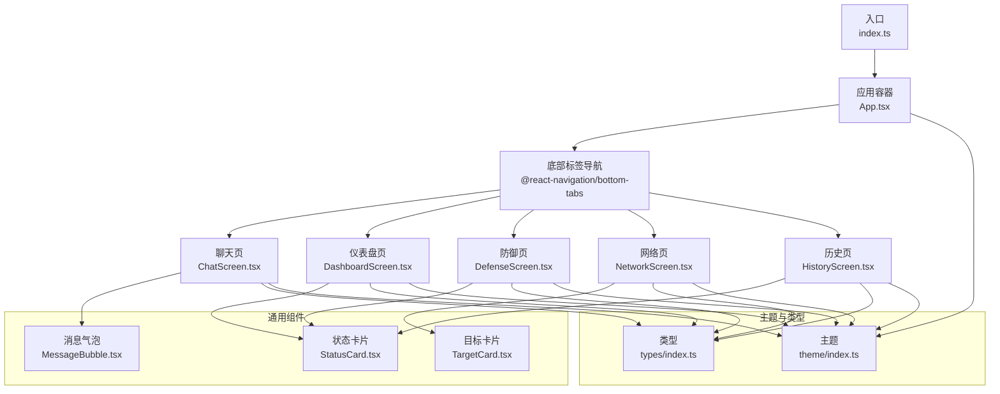
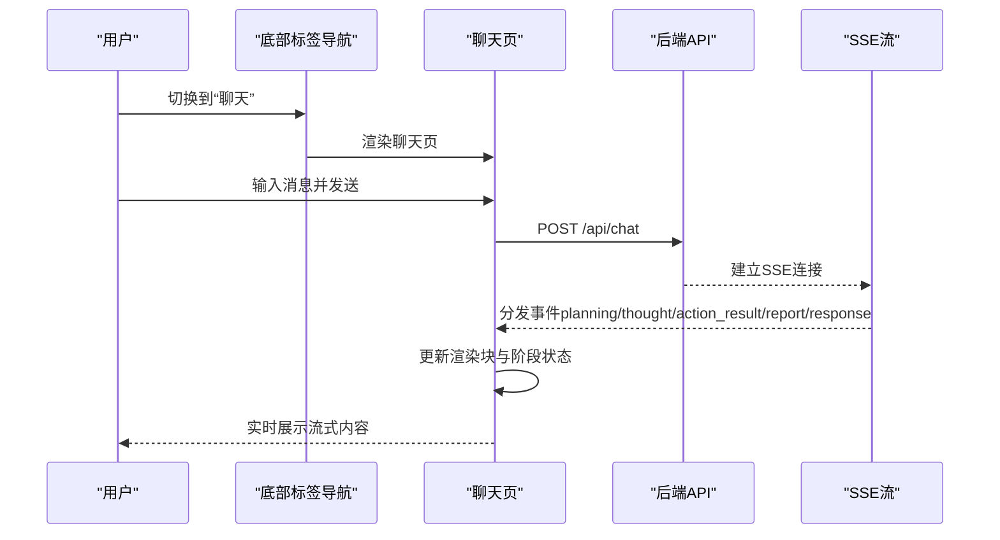
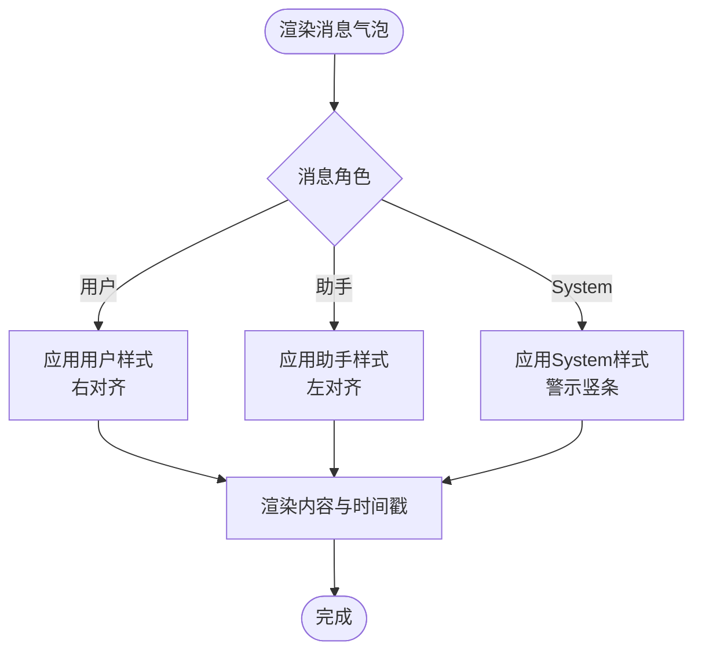
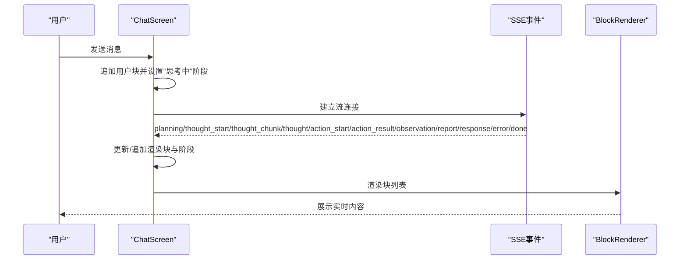
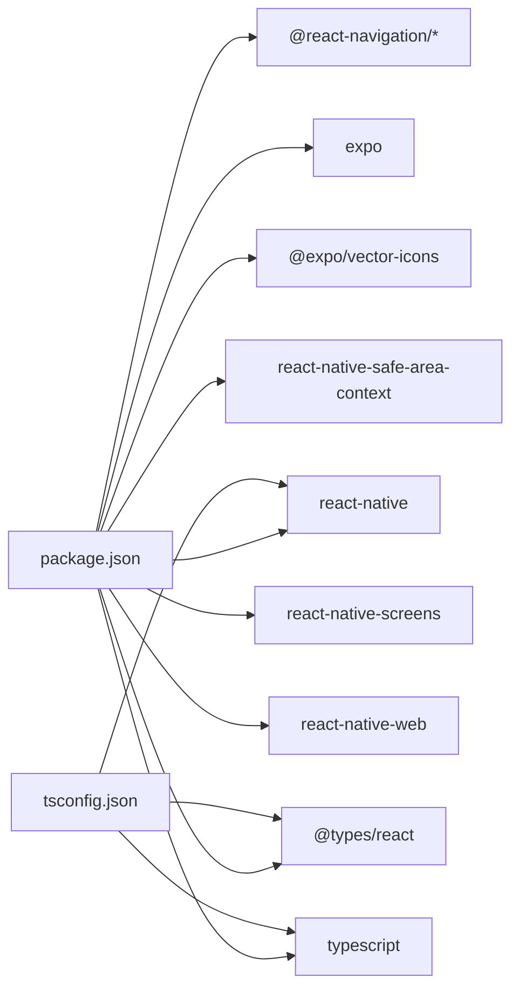

# 移动端界面（React Native）

<cite>
**本文引用的文件**
- [App.tsx](file://app/App.tsx)
- [index.ts](file://app/index.ts)
- [app.json](file://app/app.json)
- [package.json](file://app/package.json)
- [tsconfig.json](file://app/tsconfig.json)
- [theme/index.ts](file://app/src/theme/index.ts)
- [types/index.ts](file://app/src/types/index.ts)
- [components/MessageBubble.tsx](file://app/src/components/MessageBubble.tsx)
- [components/StatusCard.tsx](file://app/src/components/StatusCard.tsx)
- [components/TargetCard.tsx](file://app/src/components/TargetCard.tsx)
- [screens/ChatScreen.tsx](file://app/src/screens/ChatScreen.tsx)
- [screens/DashboardScreen.tsx](file://app/src/screens/DashboardScreen.tsx)
- [screens/DefenseScreen.tsx](file://app/src/screens/DefenseScreen.tsx)
- [screens/NetworkScreen.tsx](file://app/src/screens/NetworkScreen.tsx)
- [screens/HistoryScreen.tsx](file://app/src/screens/HistoryScreen.tsx)
</cite>

## 目录
1. [简介](#简介)
2. [项目结构](#项目结构)
3. [核心组件](#核心组件)
4. [架构总览](#架构总览)
5. [详细组件分析](#详细组件分析)
6. [依赖关系分析](#依赖关系分析)
7. [性能考量](#性能考量)
8. [故障排查指南](#故障排查指南)
9. [结论](#结论)
10. [附录](#附录)

## 简介
本文件面向Secbot移动端（React Native）界面，系统性梳理应用的整体架构、导航体系、主题系统与核心UI组件，并深入解析聊天、仪表盘、防御监控、网络扫描与历史记录五大功能页面的实现思路与交互设计。文档同时总结组件复用、状态管理与性能优化的最佳实践，帮助开发者快速理解与扩展移动端界面。

## 项目结构
移动端应用位于 app 目录，采用“入口 + 导航 + 屏幕 + 主题 + 类型 + 组件 + API/Hook”的分层组织方式。入口通过 Expo 注册根组件，使用 @react-navigation/bottom-tabs 构建底部标签导航；主题系统集中于 theme/index.ts；类型定义集中在 types/index.ts；屏幕组件位于 screens；通用UI组件位于 components；API调用与Hook封装在 api 与 hooks 下。

图表来源
- [index.ts](file://app/index.ts#L1-L9)
- [App.tsx](file://app/App.tsx#L28-L108)
- [ChatScreen.tsx](file://app/src/screens/ChatScreen.tsx#L61-L609)
- [DashboardScreen.tsx](file://app/src/screens/DashboardScreen.tsx#L20-L131)
- [DefenseScreen.tsx](file://app/src/screens/DefenseScreen.tsx#L28-L183)
- [NetworkScreen.tsx](file://app/src/screens/NetworkScreen.tsx#L31-L162)
- [HistoryScreen.tsx](file://app/src/screens/HistoryScreen.tsx#L22-L137)
- [theme/index.ts](file://app/src/theme/index.ts#L5-L63)
- [types/index.ts](file://app/src/types/index.ts#L5-L200)
- [MessageBubble.tsx](file://app/src/components/MessageBubble.tsx#L14-L55)
- [StatusCard.tsx](file://app/src/components/StatusCard.tsx#L16-L29)
- [TargetCard.tsx](file://app/src/components/TargetCard.tsx#L16-L56)

章节来源
- [index.ts](file://app/index.ts#L1-L9)
- [App.tsx](file://app/App.tsx#L28-L108)
- [app.json](file://app/app.json#L1-L30)
- [package.json](file://app/package.json#L1-L34)
- [tsconfig.json](file://app/tsconfig.json#L1-L19)

## 核心组件
- 底部标签导航：统一的主题、图标映射、标签样式与标题配置，支持深色模式与自定义字体族。
- 主题系统：集中定义主色、背景、文字、状态色、边框、圆角、间距与字号，供所有组件共享。
- 类型系统：涵盖聊天、ReAct渲染块、系统信息、防御、网络、数据库等接口数据模型。
- 通用UI组件：消息气泡、状态卡片、目标卡片，具备良好的可复用性与可定制性。

章节来源
- [App.tsx](file://app/App.tsx#L20-L78)
- [theme/index.ts](file://app/src/theme/index.ts#L5-L63)
- [types/index.ts](file://app/src/types/index.ts#L5-L200)
- [MessageBubble.tsx](file://app/src/components/MessageBubble.tsx#L14-L55)
- [StatusCard.tsx](file://app/src/components/StatusCard.tsx#L16-L29)
- [TargetCard.tsx](file://app/src/components/TargetCard.tsx#L16-L56)

## 架构总览
应用以 App.tsx 为根容器，通过 NavigationContainer 包裹 BottomTabNavigator，五个 Tab 页面分别承载不同业务域。每个页面通过自定义 Hook（如 useApi、useSSE）与后端API交互，使用主题常量与类型定义确保一致性与可维护性。

图表来源
- [App.tsx](file://app/App.tsx#L80-L104)
- [ChatScreen.tsx](file://app/src/screens/ChatScreen.tsx#L131-L376)
- [types/index.ts](file://app/src/types/index.ts#L17-L20)

## 详细组件分析

### 底部标签导航系统
- 图标与标题：基于路由名称映射 Ionicons 图标，聚焦与非聚焦态切换。
- 主题适配：导航与头部样式绑定主题色值，统一深色风格。
- 字体与尺寸：导航标签与头部标题采用主题字号与字重，保证一致性。

章节来源
- [App.tsx](file://app/App.tsx#L20-L78)

### 主题系统
- 颜色方案：主色、强调色、背景、表面、卡片、文字、状态色（成功/警告/危险/信息）、边框与代码背景等。
- 间距与字号：xs/sm/md/lg/xl/xxl及标题字号，配合圆角常量统一视觉节奏。
- 使用方式：各组件通过导入 Colors/FontSize/Spacing/BorderRadius 获取样式变量。

章节来源
- [theme/index.ts](file://app/src/theme/index.ts#L5-L63)

### 类型系统
- 聊天与SSE事件：请求体、响应体、事件载荷与渲染块类型。
- ReAct渲染块：规划、推理、执行、观察、报告、响应、错误等类型与字段。
- 系统/防御/网络/数据库：接口返回结构化数据模型，便于页面消费与校验。

章节来源
- [types/index.ts](file://app/src/types/index.ts#L5-L200)

### 消息气泡组件（MessageBubble）
- 功能：根据消息角色（用户/助手/System）渲染不同外观与对齐方式。
- 样式：用户气泡右下圆角，助手气泡左下圆角并带边框，System消息带警示色竖条。
- 可读性：文本可选中，时间戳右对齐，字号与行高按主题设置。

图表来源
- [MessageBubble.tsx](file://app/src/components/MessageBubble.tsx#L14-L55)

章节来源
- [MessageBubble.tsx](file://app/src/components/MessageBubble.tsx#L14-L55)

### 状态卡片组件（StatusCard）
- 功能：通用状态展示卡片，支持标题、数值、副标题与颜色定制。
- 样式：卡片背景与边框来自主题，字号与圆角统一。

章节来源
- [StatusCard.tsx](file://app/src/components/StatusCard.tsx#L16-L29)

### 目标卡片组件（TargetCard）
- 功能：展示主机IP、主机名、开放端口与授权状态，支持点击回调。
- 样式：授权状态徽章颜色区分，端口列表截断显示，Monospace字体突出IP与端口。

章节来源
- [TargetCard.tsx](file://app/src/components/TargetCard.tsx#L16-L56)

### 聊天界面（ChatScreen）
- 交互流程：用户消息进入后，立即显示“连接中”阶段，随后通过SSE接收多类事件（规划、推理流、执行、结果、观察、报告、最终响应、错误），并动态更新渲染块与阶段状态。
- 控制面板：模式选择（Ask/Agent）、子模式（自动/专家）、模型切换、状态指示与调试面板。
- 输入与滚动：键盘避让、最大长度限制、发送/停止控制、自动滚动至底部。
- 性能要点：块ID生成避免重复键；流式更新使用引用缓存；错误时清理流状态。

图表来源
- [ChatScreen.tsx](file://app/src/screens/ChatScreen.tsx#L131-L376)
- [ChatScreen.tsx](file://app/src/screens/ChatScreen.tsx#L381-L436)
- [ChatScreen.tsx](file://app/src/screens/ChatScreen.tsx#L544-L565)

章节来源
- [ChatScreen.tsx](file://app/src/screens/ChatScreen.tsx#L61-L609)

### 仪表盘界面（DashboardScreen）
- 数据加载：系统信息与系统状态双API并发加载，支持下拉刷新。
- 可视化：CPU/内存卡片按阈值着色；磁盘使用率以进度条展示。
- 体验：加载中显示指示器，错误时展示错误文本。

章节来源
- [DashboardScreen.tsx](file://app/src/screens/DashboardScreen.tsx#L20-L131)

### 防御监控界面（DefenseScreen）
- 功能：安全扫描触发、封禁IP列表展示与解封操作、防御状态卡片与开关状态展示。
- 交互：扫描过程禁用按钮并显示加载；解封弹窗确认；刷新联动加载。

章节来源
- [DefenseScreen.tsx](file://app/src/screens/DefenseScreen.tsx#L28-L183)

### 网络扫描界面（NetworkScreen）
- 功能：内网发现触发、目标主机列表（卡片形式）、授权记录列表与撤销授权。
- 交互：发现过程禁用按钮并显示加载；撤销授权弹窗确认；刷新联动加载。

章节来源
- [NetworkScreen.tsx](file://app/src/screens/NetworkScreen.tsx#L31-L162)

### 历史记录界面（HistoryScreen）
- 功能：数据库统计卡片、最近对话历史列表、清空历史操作。
- 交互：清空历史弹窗确认；刷新联动加载。

章节来源
- [HistoryScreen.tsx](file://app/src/screens/HistoryScreen.tsx#L22-L137)

## 依赖关系分析
- 运行时依赖：@react-navigation/*、@expo/vector-icons、expo、react-native、react-native-safe-area-context、react-native-screens 等。
- 开发依赖：TypeScript、类型声明。
- 配置：app.json 控制应用元信息、平台特性与启动参数；tsconfig.json 控制编译条件与模块解析。

图表来源
- [package.json](file://app/package.json#L11-L28)
- [tsconfig.json](file://app/tsconfig.json#L2-L16)

章节来源
- [package.json](file://app/package.json#L1-L34)
- [tsconfig.json](file://app/tsconfig.json#L1-L19)
- [app.json](file://app/app.json#L1-L30)

## 性能考量
- 列表渲染：使用 FlatList 并提供稳定的 key（含索引与块ID），减少重绘。
- 状态更新：事件驱动的增量更新，避免全量替换；流式块使用引用缓存内容。
- 主题与样式：集中主题常量，避免重复计算与样式对象创建。
- 网络与IO：下拉刷新与异步加载，避免阻塞主线程；SSE连接建立后及时清理流状态。
- 字体与布局：统一字号与间距，减少布局抖动；输入框多行与高度上限控制。

## 故障排查指南
- 导航主题不生效：检查 NavigationContainer 的 theme 配置是否绑定 Colors 与 FontSize。
- 聊天无响应：确认 /api/chat 是否可达；检查 SSE 事件分发与 handleSSEEvent 分支逻辑。
- 刷新无效：确认 useApi 的 execute 调用与 RefreshControl 的刷新状态绑定。
- 样式异常：核对主题常量是否存在拼写错误；确认 StyleSheet.create 的样式键名正确。
- 构建问题：检查 tsconfig 的 moduleResolution 与 customConditions；确保 Expo 与 React Native 版本兼容。

章节来源
- [App.tsx](file://app/App.tsx#L30-L47)
- [ChatScreen.tsx](file://app/src/screens/ChatScreen.tsx#L131-L376)
- [DashboardScreen.tsx](file://app/src/screens/DashboardScreen.tsx#L39-L45)
- [DefenseScreen.tsx](file://app/src/screens/DefenseScreen.tsx#L70-L76)
- [NetworkScreen.tsx](file://app/src/screens/NetworkScreen.tsx#L85-L91)
- [HistoryScreen.tsx](file://app/src/screens/HistoryScreen.tsx#L59-L65)

## 结论
该移动端界面以清晰的分层架构、统一的主题系统与可复用的UI组件为基础，结合底部标签导航与SSE流式交互，实现了从聊天到系统监控、网络扫描与历史管理的完整闭环。通过类型约束与Hook抽象，提升了开发效率与可维护性；通过合理的性能策略与交互设计，保障了移动端的流畅体验。

## 附录
- 移动端特性建议：iOS键盘避让、Android边缘到边缘、预测返回手势配置；深色模式一致性；可访问性（字体大小、对比度）。
- 组件复用：将主题常量与类型定义下沉至公共模块，避免重复导入；为常用布局（卡片、列表项）抽象基础样式。
- 状态管理：页面级状态集中于屏幕组件，跨页面共享通过全局Hook或上下文；避免深层嵌套与过度拆分。