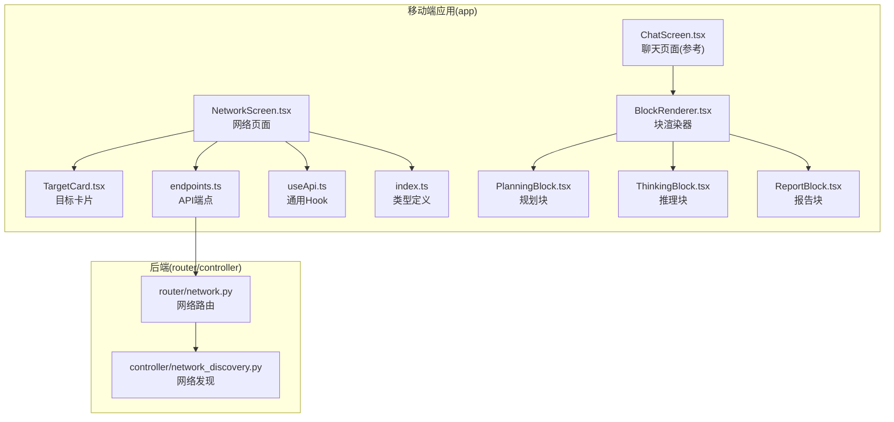
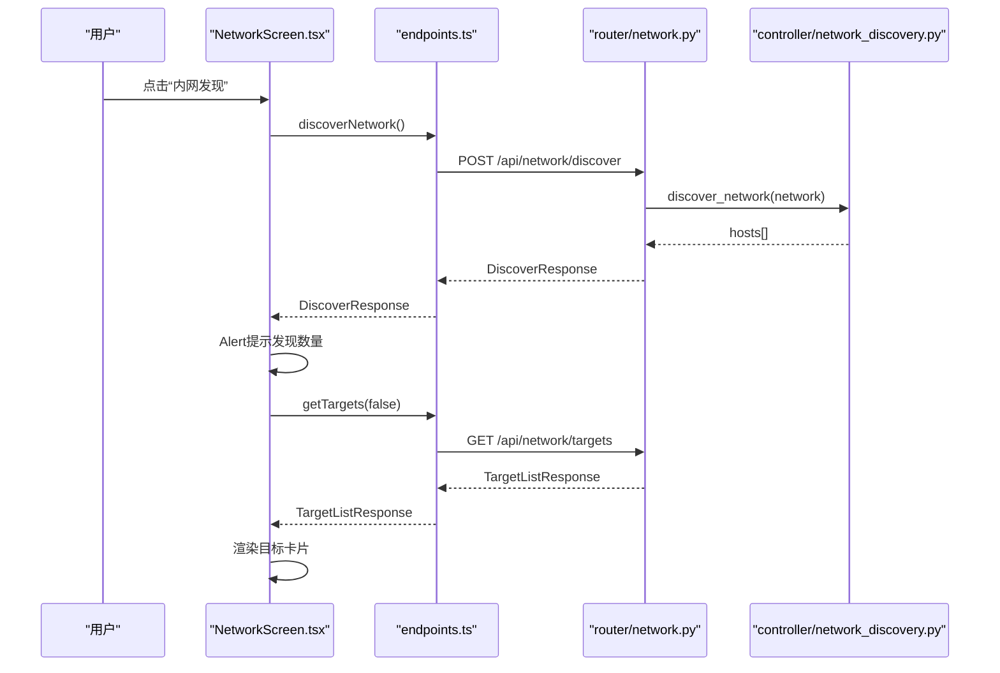
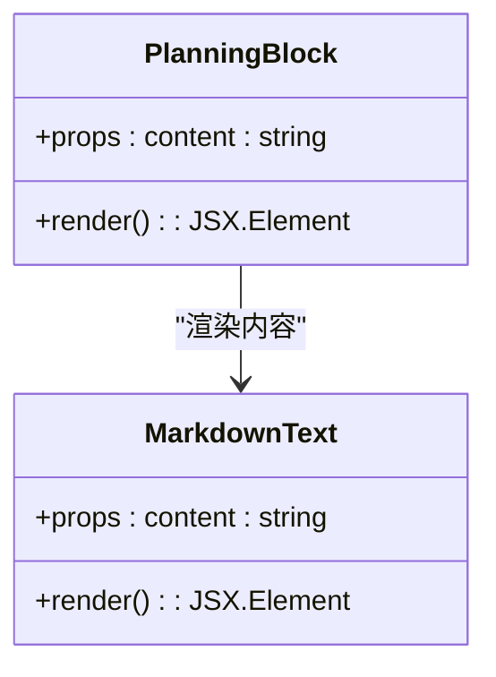
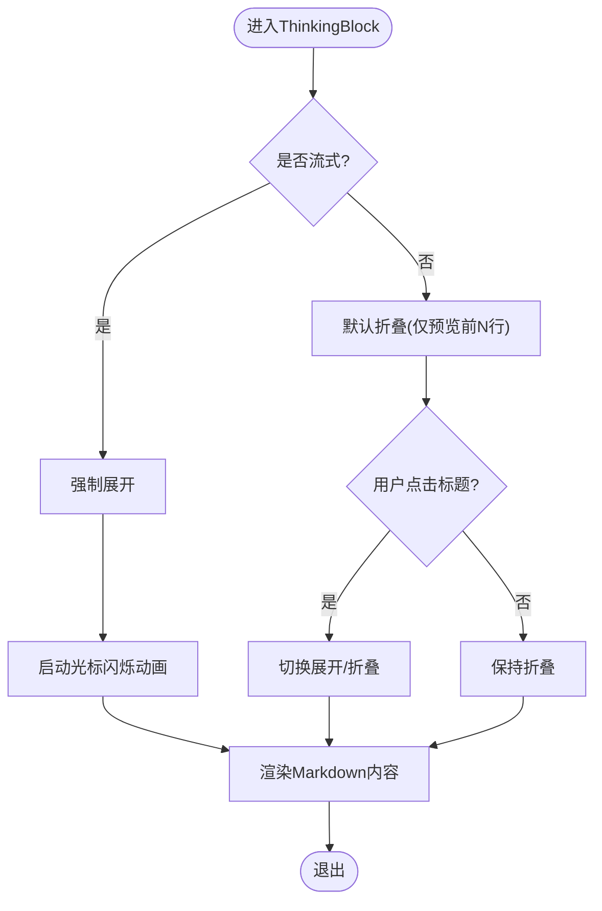
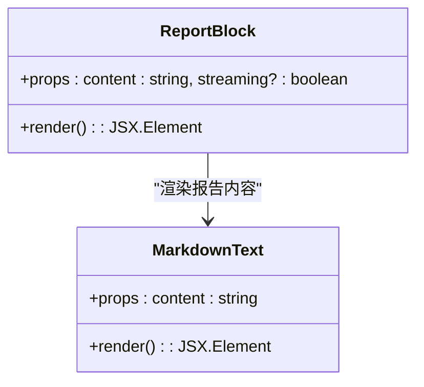
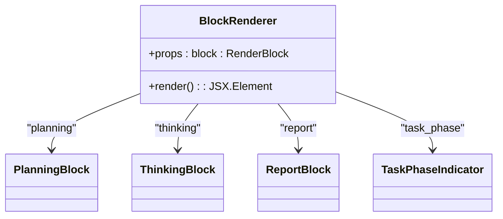
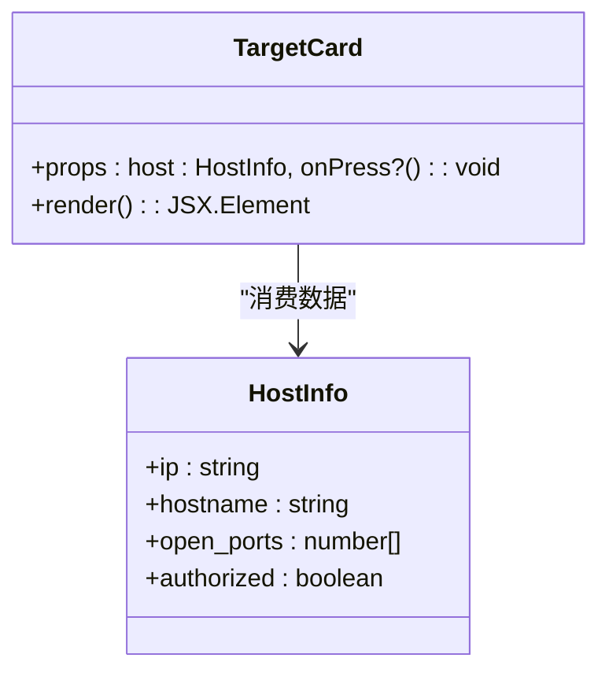
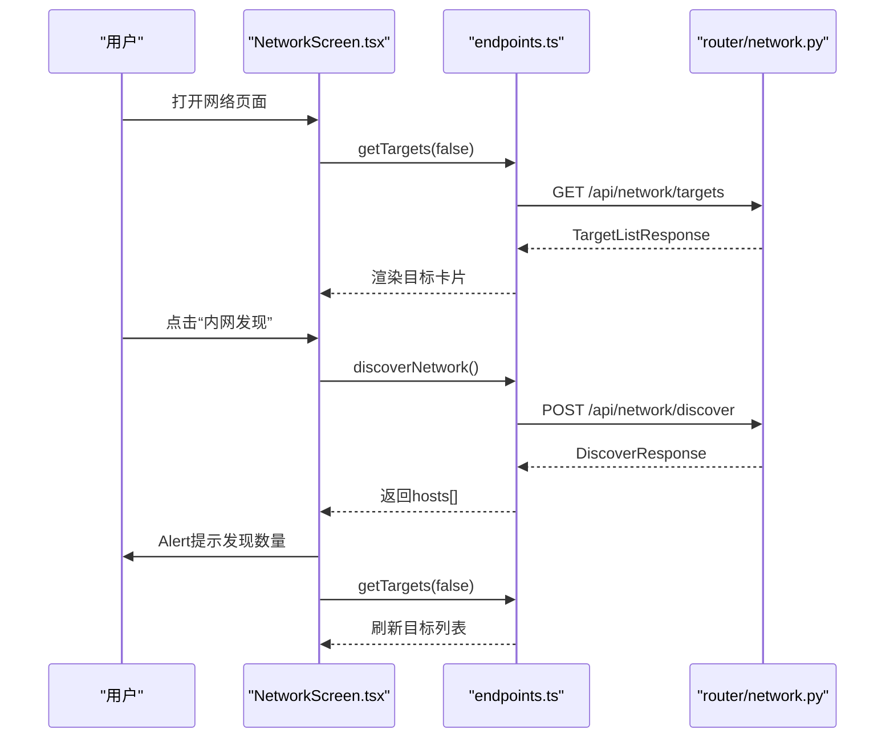
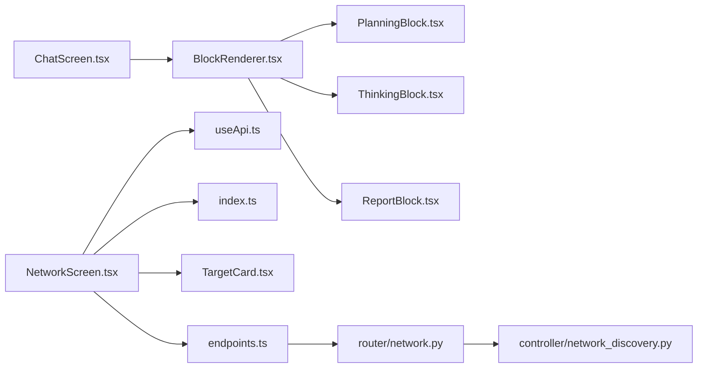

# 网络扫描界面

<cite>
**本文引用的文件**
- [NetworkScreen.tsx](file://app/src/screens/NetworkScreen.tsx)
- [TargetCard.tsx](file://app/src/components/TargetCard.tsx)
- [PlanningBlock.tsx](file://app/src/components/PlanningBlock.tsx)
- [ThinkingBlock.tsx](file://app/src/components/ThinkingBlock.tsx)
- [ReportBlock.tsx](file://app/src/components/ReportBlock.tsx)
- [BlockRenderer.tsx](file://app/src/components/BlockRenderer.tsx)
- [ChatScreen.tsx](file://app/src/screens/ChatScreen.tsx)
- [endpoints.ts](file://app/src/api/endpoints.ts)
- [useApi.ts](file://app/src/hooks/useApi.ts)
- [index.ts](file://app/src/types/index.ts)
- [network.py](file://router/network.py)
- [network_discovery.py](file://controller/network_discovery.py)
</cite>

## 目录
1. [简介](#简介)
2. [项目结构](#项目结构)
3. [核心组件](#核心组件)
4. [架构总览](#架构总览)
5. [组件详解](#组件详解)
6. [依赖关系分析](#依赖关系分析)
7. [性能考量](#性能考量)
8. [故障排查指南](#故障排查指南)
9. [结论](#结论)
10. [附录](#附录)

## 简介
本文件面向Secbot网络扫描界面，系统性梳理移动端“网络”页面的界面设计与数据流，重点覆盖：
- 扫描计划展示：基于规划块组件呈现任务规划内容
- 思考过程展示：基于推理块组件呈现智能体的流式/非流式推理过程
- 结果分析界面：基于报告块组件呈现扫描报告
- 规划块组件实现：扫描计划列表、任务状态显示与进度跟踪
- 思考块组件设计：智能体决策过程展示、推理步骤显示与中间结果呈现
- 数据处理：扫描结果格式化、图表展示与详细信息查看
- 信息架构与用户体验优化：布局、交互与反馈策略

该界面与后端FastAPI路由配合，通过统一的渲染块模型实现前后端一致的可视化体验。

## 项目结构
网络扫描界面位于React Native应用层，采用“屏幕 + 组件 + 类型 + API钩子”的分层组织方式；后端以FastAPI路由提供网络发现、目标列表与授权管理接口；核心扫描逻辑由控制器模块实现。

**图示来源**
- [NetworkScreen.tsx](file://app/src/screens/NetworkScreen.tsx#L1-L241)
- [TargetCard.tsx](file://app/src/components/TargetCard.tsx#L1-L121)
- [PlanningBlock.tsx](file://app/src/components/PlanningBlock.tsx#L1-L69)
- [ThinkingBlock.tsx](file://app/src/components/ThinkingBlock.tsx#L1-L210)
- [ReportBlock.tsx](file://app/src/components/ReportBlock.tsx#L1-L134)
- [BlockRenderer.tsx](file://app/src/components/BlockRenderer.tsx#L1-L97)
- [ChatScreen.tsx](file://app/src/screens/ChatScreen.tsx#L1-L200)
- [endpoints.ts](file://app/src/api/endpoints.ts#L1-L111)
- [useApi.ts](file://app/src/hooks/useApi.ts#L1-L35)
- [index.ts](file://app/src/types/index.ts#L1-L200)
- [network.py](file://router/network.py#L1-L149)
- [network_discovery.py](file://controller/network_discovery.py#L1-L233)

**章节来源**
- [NetworkScreen.tsx](file://app/src/screens/NetworkScreen.tsx#L1-L241)
- [endpoints.ts](file://app/src/api/endpoints.ts#L1-L111)
- [network.py](file://router/network.py#L1-L149)

## 核心组件
- 规划块组件：用于展示扫描任务的规划内容，支持Markdown渲染与带边框的主题样式
- 推理块组件：用于展示智能体的推理过程，支持流式渲染、光标闪烁、折叠/展开控制
- 报告块组件：用于展示扫描报告，支持流式与完成态的不同视觉风格
- 块渲染器：根据渲染块类型分派到对应组件，统一渲染入口
- 目标卡片组件：展示目标主机的IP、主机名、端口与授权状态
- 网络页面：聚合上述组件，提供内网发现、目标列表与授权记录的展示与操作

**章节来源**
- [PlanningBlock.tsx](file://app/src/components/PlanningBlock.tsx#L1-L69)
- [ThinkingBlock.tsx](file://app/src/components/ThinkingBlock.tsx#L1-L210)
- [ReportBlock.tsx](file://app/src/components/ReportBlock.tsx#L1-L134)
- [BlockRenderer.tsx](file://app/src/components/BlockRenderer.tsx#L1-L97)
- [TargetCard.tsx](file://app/src/components/TargetCard.tsx#L1-L121)
- [NetworkScreen.tsx](file://app/src/screens/NetworkScreen.tsx#L1-L241)

## 架构总览
网络扫描界面遵循“屏幕负责编排、组件负责渲染、类型定义契约、API封装调用、后端路由对接”的分层架构。前端通过API端点触发后端网络发现与目标管理，返回的数据在移动端以渲染块的形式展示。

**图示来源**
- [NetworkScreen.tsx](file://app/src/screens/NetworkScreen.tsx#L45-L59)
- [endpoints.ts](file://app/src/api/endpoints.ts#L58-L67)
- [network.py](file://router/network.py#L25-L47)
- [network_discovery.py](file://controller/network_discovery.py#L121-L156)

## 组件详解

### 规划块组件（PlanningBlock）
- 功能定位：展示扫描任务的规划内容，采用带主题边框与标题的面板样式
- 关键特性
  - 标题栏包含图标与“Planning”标签
  - 内容区使用MarkdownText进行渲染
  - 支持统一的颜色与间距主题
- 适用场景：在网络扫描任务启动前，向用户展示整体规划思路与策略

**图示来源**
- [PlanningBlock.tsx](file://app/src/components/PlanningBlock.tsx#L17-L32)

**章节来源**
- [PlanningBlock.tsx](file://app/src/components/PlanningBlock.tsx#L1-L69)

### 推理块组件（ThinkingBlock）
- 功能定位：展示智能体的推理过程，支持流式渲染与完成态
- 关键特性
  - 流式时强制展开，完成时默认折叠（仅显示前两行预览）
  - 提供闪烁光标动画，增强“正在思考”的感知
  - 可点击标题切换展开/折叠状态（非流式）
  - 支持迭代编号与智能体标识显示
- 适用场景：在网络扫描过程中，实时展示智能体的分析与决策步骤

**图示来源**
- [ThinkingBlock.tsx](file://app/src/components/ThinkingBlock.tsx#L21-L129)

**章节来源**
- [ThinkingBlock.tsx](file://app/src/components/ThinkingBlock.tsx#L1-L210)

### 报告块组件（ReportBlock）
- 功能定位：展示扫描报告，支持流式与完成态
- 关键特性
  - 流式时使用虚线边框与闪烁光标
  - 完成时使用双线边框突出完整性
  - 标题栏包含“Report”与状态徽章
- 适用场景：在网络扫描完成后，向用户呈现完整报告

**图示来源**
- [ReportBlock.tsx](file://app/src/components/ReportBlock.tsx#L19-L72)

**章节来源**
- [ReportBlock.tsx](file://app/src/components/ReportBlock.tsx#L1-L134)

### 块渲染器（BlockRenderer）
- 功能定位：根据渲染块类型分派到对应组件，统一渲染入口
- 关键特性
  - 支持多种块类型：planning、thinking、execution、report、response、error、task_phase等
  - 与聊天页面的渲染流程保持一致，便于复用
- 适用场景：在聊天/扫描界面中，按类型动态渲染不同块

**图示来源**
- [BlockRenderer.tsx](file://app/src/components/BlockRenderer.tsx#L21-L96)

**章节来源**
- [BlockRenderer.tsx](file://app/src/components/BlockRenderer.tsx#L1-L97)

### 目标卡片组件（TargetCard）
- 功能定位：展示单个目标主机的关键信息
- 关键特性
  - 展示IP、主机名、开放端口与授权状态
  - 授权状态以徽章形式区分颜色
  - 支持点击回调（可扩展至导航/详情页）
- 适用场景：在网络发现完成后，以卡片形式展示目标主机列表

**图示来源**
- [TargetCard.tsx](file://app/src/components/TargetCard.tsx#L16-L56)
- [index.ts](file://app/src/types/index.ts#L132-L138)

**章节来源**
- [TargetCard.tsx](file://app/src/components/TargetCard.tsx#L1-L121)
- [index.ts](file://app/src/types/index.ts#L132-L138)

### 网络页面（NetworkScreen）
- 功能定位：聚合网络扫描相关UI，提供内网发现、目标列表与授权记录的展示与操作
- 关键特性
  - 内网发现按钮：触发后端发现接口，弹窗提示发现结果
  - 目标列表：展示主机IP、主机名、端口与授权状态
  - 授权记录：展示授权IP、认证类型、用户名与创建时间，并支持撤销
  - 下拉刷新：统一loading与error状态
- 适用场景：作为网络扫描的主入口，集中展示与管理扫描结果与授权

**图示来源**
- [NetworkScreen.tsx](file://app/src/screens/NetworkScreen.tsx#L31-L162)
- [endpoints.ts](file://app/src/api/endpoints.ts#L58-L67)
- [network.py](file://router/network.py#L25-L47)

**章节来源**
- [NetworkScreen.tsx](file://app/src/screens/NetworkScreen.tsx#L1-L241)

## 依赖关系分析
- 前端依赖
  - 网络页面依赖API端点与通用Hook，实现数据加载与状态管理
  - 组件依赖主题与类型定义，确保样式与数据契约一致
  - 块渲染器依赖多种块组件，形成统一渲染体系
- 后端依赖
  - 网络路由依赖控制器模块执行网络发现与授权管理
  - 控制器模块依赖系统工具与第三方库实现并发扫描与信息提取

**图示来源**
- [NetworkScreen.tsx](file://app/src/screens/NetworkScreen.tsx#L1-L241)
- [endpoints.ts](file://app/src/api/endpoints.ts#L1-L111)
- [useApi.ts](file://app/src/hooks/useApi.ts#L1-L35)
- [index.ts](file://app/src/types/index.ts#L1-L200)
- [TargetCard.tsx](file://app/src/components/TargetCard.tsx#L1-L121)
- [ChatScreen.tsx](file://app/src/screens/ChatScreen.tsx#L1-L200)
- [BlockRenderer.tsx](file://app/src/components/BlockRenderer.tsx#L1-L97)
- [PlanningBlock.tsx](file://app/src/components/PlanningBlock.tsx#L1-L69)
- [ThinkingBlock.tsx](file://app/src/components/ThinkingBlock.tsx#L1-L210)
- [ReportBlock.tsx](file://app/src/components/ReportBlock.tsx#L1-L134)
- [network.py](file://router/network.py#L1-L149)
- [network_discovery.py](file://controller/network_discovery.py#L1-L233)

**章节来源**
- [NetworkScreen.tsx](file://app/src/screens/NetworkScreen.tsx#L1-L241)
- [ChatScreen.tsx](file://app/src/screens/ChatScreen.tsx#L1-L200)
- [BlockRenderer.tsx](file://app/src/components/BlockRenderer.tsx#L1-L97)
- [network.py](file://router/network.py#L1-L149)
- [network_discovery.py](file://controller/network_discovery.py#L1-L233)

## 性能考量
- 并发扫描与限速
  - 后端网络发现采用异步并发扫描，通过线程池限制最大并发度，避免资源争用
  - 建议在移动端对目标列表进行分页或懒加载，减少一次性渲染压力
- 网络抖动与重试
  - API请求封装统一错误处理，建议在前端增加重试与缓存策略
- 渲染性能
  - 推理块在流式时强制展开，完成态默认折叠，有助于控制DOM节点数量
  - 建议对长列表使用虚拟化或分段渲染

[本节为通用性能建议，不直接分析具体文件]

## 故障排查指南
- 内网发现失败
  - 检查网络权限与防火墙设置，确认后端路由可访问
  - 查看Alert错误提示与前端错误状态，必要时重试
- 目标列表为空
  - 确认网络发现是否成功，检查后端返回的hosts数组
  - 若授权筛选开启，确认authorized_only参数与授权状态
- 授权撤销失败
  - 检查目标IP是否有效，后端路由返回的撤销状态
  - 前端Alert会提示具体错误信息，便于定位问题

**章节来源**
- [NetworkScreen.tsx](file://app/src/screens/NetworkScreen.tsx#L54-L76)
- [endpoints.ts](file://app/src/api/endpoints.ts#L81-L82)
- [network.py](file://router/network.py#L135-L148)

## 结论
网络扫描界面通过统一的渲染块模型与清晰的组件职责划分，实现了从“规划—推理—执行—报告”的完整可视化闭环。前端以网络页面为核心，结合规划块、推理块与报告块，为用户提供直观的任务进展与结果展示；后端通过路由与控制器模块提供稳定的网络发现与授权管理能力。整体架构具备良好的可扩展性与可维护性，适合进一步引入图表展示与详细信息查看等高级功能。

[本节为总结性内容，不直接分析具体文件]

## 附录

### 数据模型与类型
- 渲染块类型：涵盖用户消息、规划、任务阶段、推理、执行、执行结果、观察、报告、最终响应与错误
- 网络相关类型：主机信息、发现响应、目标列表、授权信息与授权列表

**章节来源**
- [index.ts](file://app/src/types/index.ts#L25-L58)
- [index.ts](file://app/src/types/index.ts#L132-L159)

### 与聊天界面的渲染一致性
- 聊天页面采用相同的渲染块类型与事件桥接机制，保证跨页面的一致体验
- 任务阶段指示器与块渲染器在两种场景下复用

**章节来源**
- [ChatScreen.tsx](file://app/src/screens/ChatScreen.tsx#L131-L200)
- [BlockRenderer.tsx](file://app/src/components/BlockRenderer.tsx#L21-L96)