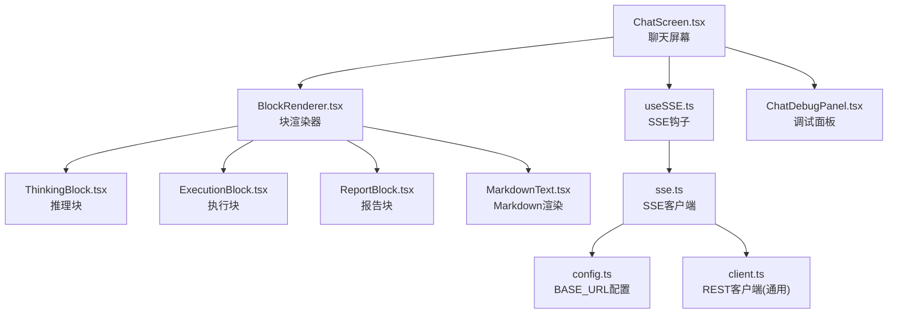
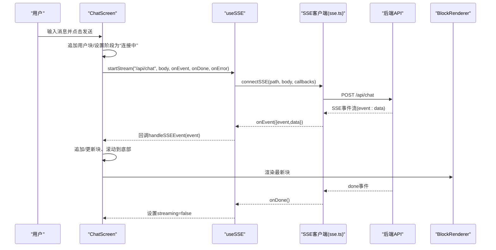
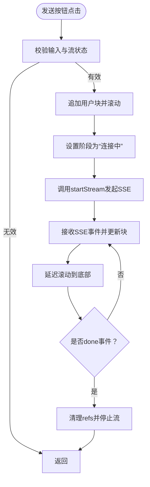
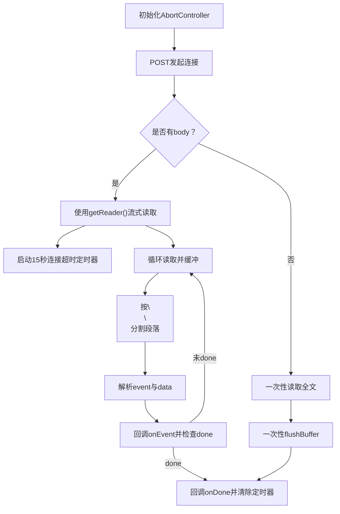
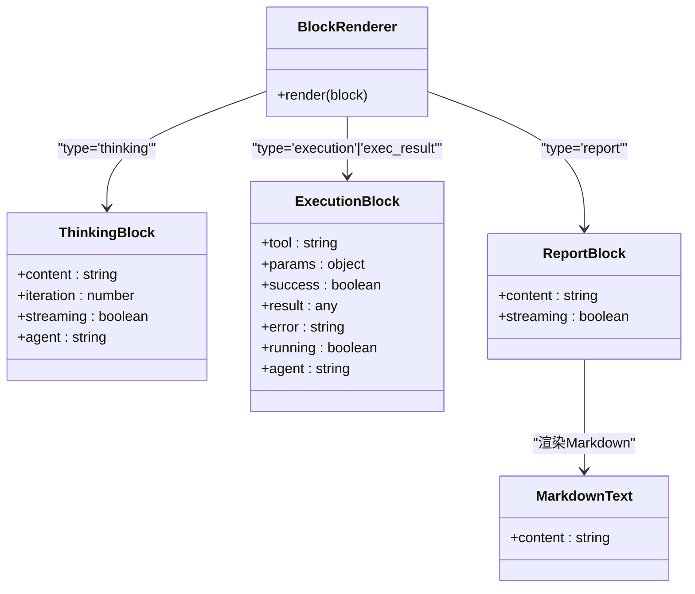
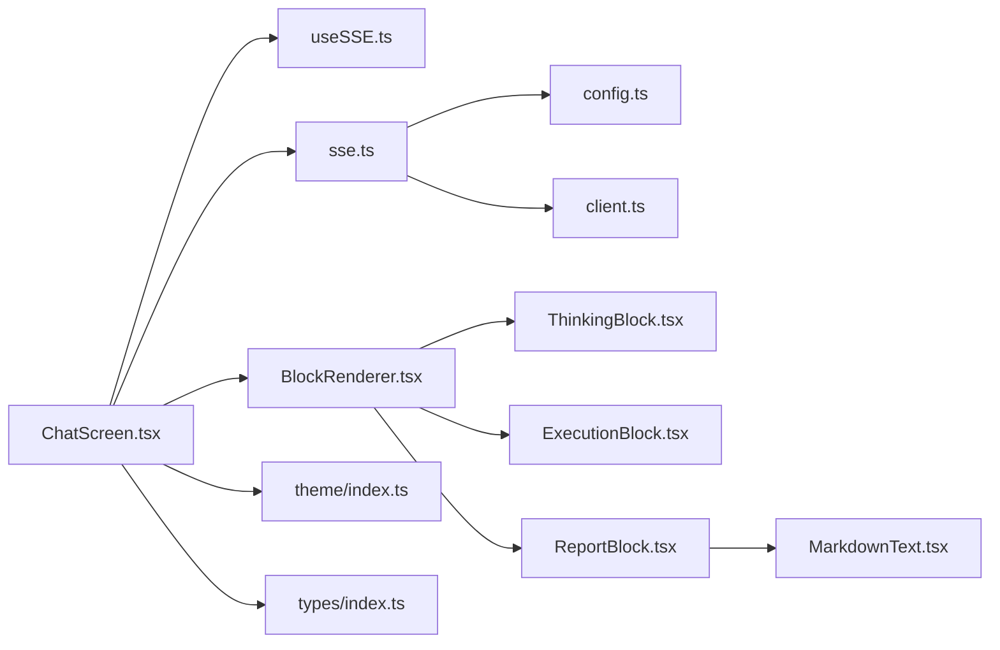

# 聊天界面

<cite>
**本文引用的文件**
- [ChatScreen.tsx](file://app/src/screens/ChatScreen.tsx)
- [useSSE.ts](file://app/src/hooks/useSSE.ts)
- [sse.ts](file://app/src/api/sse.ts)
- [client.ts](file://app/src/api/client.ts)
- [config.ts](file://app/src/api/config.ts)
- [BlockRenderer.tsx](file://app/src/components/BlockRenderer.tsx)
- [ThinkingBlock.tsx](file://app/src/components/ThinkingBlock.tsx)
- [ExecutionBlock.tsx](file://app/src/components/ExecutionBlock.tsx)
- [ReportBlock.tsx](file://app/src/components/ReportBlock.tsx)
- [MarkdownText.tsx](file://app/src/components/MarkdownText.tsx)
- [ChatDebugPanel.tsx](file://app/src/components/ChatDebugPanel.tsx)
- [index.ts](file://app/src/theme/index.ts)
- [index.ts](file://app/src/types/index.ts)
</cite>

## 目录
1. [简介](#简介)
2. [项目结构](#项目结构)
3. [核心组件](#核心组件)
4. [架构总览](#架构总览)
5. [详细组件分析](#详细组件分析)
6. [依赖关系分析](#依赖关系分析)
7. [性能考量](#性能考量)
8. [故障排查指南](#故障排查指南)
9. [结论](#结论)
10. [附录](#附录)

## 简介
本文件面向Secbot聊天界面的技术实现，围绕React Native应用中的聊天屏幕展开，系统性说明消息显示区域、输入组件与发送按钮的设计；深入解析消息气泡与渲染块体系；阐述流式SSE消息处理机制（实时接收、消息拼接与滚动控制）；解释API客户端集成（聊天请求发送、响应处理与错误处理）；并提供交互设计与用户体验优化建议。

## 项目结构
聊天界面位于应用前端模块中，采用“屏幕-组件-钩子-API-类型-主题”分层组织：
- 屏幕层：ChatScreen负责整体布局、状态管理、SSE事件处理与滚动控制
- 组件层：BlockRenderer根据块类型分发到具体块组件（如ThinkingBlock、ExecutionBlock、ReportBlock等）
- 钩子层：useSSE封装SSE连接生命周期与AbortController管理
- API层：sse.ts实现SSE客户端，client.ts提供REST通用封装，config.ts提供BASE_URL配置
- 类型层：types/index.ts定义SSE事件、渲染块与消息类型
- 主题层：theme/index.ts提供暗色赛博朋克风格的主题变量

图表来源
- [ChatScreen.tsx](file://app/src/screens/ChatScreen.tsx#L61-L609)
- [BlockRenderer.tsx](file://app/src/components/BlockRenderer.tsx#L21-L96)
- [ThinkingBlock.tsx](file://app/src/components/ThinkingBlock.tsx#L21-L129)
- [ExecutionBlock.tsx](file://app/src/components/ExecutionBlock.tsx#L25-L173)
- [ReportBlock.tsx](file://app/src/components/ReportBlock.tsx#L19-L73)
- [MarkdownText.tsx](file://app/src/components/MarkdownText.tsx#L77-L94)
- [useSSE.ts](file://app/src/hooks/useSSE.ts#L9-L50)
- [sse.ts](file://app/src/api/sse.ts#L50-L163)
- [config.ts](file://app/src/api/config.ts#L13-L16)
- [client.ts](file://app/src/api/client.ts#L10-L46)

章节来源
- [ChatScreen.tsx](file://app/src/screens/ChatScreen.tsx#L61-L609)
- [BlockRenderer.tsx](file://app/src/components/BlockRenderer.tsx#L21-L96)
- [useSSE.ts](file://app/src/hooks/useSSE.ts#L9-L50)
- [sse.ts](file://app/src/api/sse.ts#L50-L163)
- [config.ts](file://app/src/api/config.ts#L13-L16)
- [client.ts](file://app/src/api/client.ts#L10-L46)

## 核心组件
- 聊天屏幕（ChatScreen）
  - 管理消息块数组、输入文本、模式（ask/agent）、子模式（hackbot/superhackbot）、模型选择、调试面板可见性
  - 维护多个ref用于跟踪当前流式块（推理、报告、执行）与阶段块ID
  - 提供滚动至底部、追加/更新块、设置阶段等辅助函数
  - 通过useSSE发起SSE流，接收事件并驱动UI更新
- SSE钩子（useSSE）
  - 封装startStream/stopStream，内部使用AbortController取消上一次流
  - 返回streaming状态，便于UI禁用输入与切换发送按钮
- SSE客户端（sse.ts）
  - 通过POST建立SSE连接，解析event/data段，支持CRLF归一化与分块缓冲
  - 超时检测（默认15秒），连接成功后触发connected事件，done事件后回调onDone
  - JSON解析失败时回退为raw数据对象
- 块渲染器（BlockRenderer）
  - 根据RenderBlock.type分派到具体块组件，实现“块”级可视化
- 块组件
  - ThinkingBlock：推理块，支持流式闪烁光标、折叠/展开、预览
  - ExecutionBlock：执行块，支持运行中、成功/失败状态、参数摘要与详情
  - ReportBlock：报告块，支持流式闪烁光标与完成后的Markdown渲染
  - MarkdownText：Markdown渲染组件，适配主题与链接点击
- 调试面板（ChatDebugPanel）
  - 展示当前模式、模型、状态、块数量、refs与最近事件日志

章节来源
- [ChatScreen.tsx](file://app/src/screens/ChatScreen.tsx#L61-L609)
- [useSSE.ts](file://app/src/hooks/useSSE.ts#L9-L50)
- [sse.ts](file://app/src/api/sse.ts#L50-L163)
- [BlockRenderer.tsx](file://app/src/components/BlockRenderer.tsx#L21-L96)
- [ThinkingBlock.tsx](file://app/src/components/ThinkingBlock.tsx#L21-L129)
- [ExecutionBlock.tsx](file://app/src/components/ExecutionBlock.tsx#L25-L173)
- [ReportBlock.tsx](file://app/src/components/ReportBlock.tsx#L19-L73)
- [MarkdownText.tsx](file://app/src/components/MarkdownText.tsx#L77-L94)
- [ChatDebugPanel.tsx](file://app/src/components/ChatDebugPanel.tsx#L58-L127)

## 架构总览
下图展示从用户输入到SSE事件处理、块渲染与滚动控制的端到端流程。

图表来源
- [ChatScreen.tsx](file://app/src/screens/ChatScreen.tsx#L381-L436)
- [useSSE.ts](file://app/src/hooks/useSSE.ts#L13-L42)
- [sse.ts](file://app/src/api/sse.ts#L50-L163)
- [BlockRenderer.tsx](file://app/src/components/BlockRenderer.tsx#L21-L96)

## 详细组件分析

### 聊天屏幕（ChatScreen）
- 状态与行为
  - 维护blocks数组与输入文本，提供追加/更新块与设置阶段的方法
  - 通过useSSE控制流式状态，发送消息时立即显示“连接中”阶段
  - 事件处理覆盖规划、推理（含流式片段与完整内容）、执行、观察/内容、报告、最终响应、错误、阶段状态与连接确认
  - 流结束后清理refs并停止滚动条抖动
- 输入与发送
  - 多行输入框，最大长度限制，禁用状态下不可编辑
  - 发送按钮在streaming时变为停止按钮，非streaming且有内容时可用
- 渲染
  - 使用FlatList渲染块列表，空状态提示
  - 顶部工具栏包含模式切换、子模式切换、模型选择、状态徽章与调试入口

图表来源
- [ChatScreen.tsx](file://app/src/screens/ChatScreen.tsx#L381-L436)
- [ChatScreen.tsx](file://app/src/screens/ChatScreen.tsx#L131-L376)
- [ChatScreen.tsx](file://app/src/screens/ChatScreen.tsx#L85-L87)

章节来源
- [ChatScreen.tsx](file://app/src/screens/ChatScreen.tsx#L61-L609)

### SSE钩子（useSSE）
- 设计要点
  - 每次startStream都会取消上一个流，避免并发冲突
  - 返回streaming状态，供UI禁用输入与切换按钮
  - 提供stopStream主动中断
- 适用场景
  - 聊天流、历史拉取、长任务监控等

章节来源
- [useSSE.ts](file://app/src/hooks/useSSE.ts#L9-L50)

### SSE客户端（sse.ts）
- 解析与缓冲
  - 归一化CRLF为LF，按“\n\n”切分段落，提取event与data
  - 支持多行data拼接，JSON解析失败时回退为raw对象
- 生命周期
  - 超时检测：15秒内无事件则Abort并触发错误回调
  - done事件后触发onDone；若无done事件，在流结束时也会触发一次onDone
- 兼容性
  - 优先使用ReadableStream流式读取；在无response.body的环境中一次性读取全文再解析

图表来源
- [sse.ts](file://app/src/api/sse.ts#L50-L163)

章节来源
- [sse.ts](file://app/src/api/sse.ts#L50-L163)

### 块渲染器与块组件
- BlockRenderer
  - 根据RenderBlock.type分派到具体块组件，确保每种块类型都有对应的UI呈现
- ThinkingBlock
  - 流式时显示闪烁光标，完成后默认折叠，支持展开查看完整内容
  - 预览逻辑：取前N行并去除空行与markdown标记
- ExecutionBlock
  - 默认折叠，运行中展开参数，结果到达后显示成功/失败与结果详情
  - 参数摘要：最多展示两项键值对，其余用“+n”表示
- ReportBlock
  - 流式时显示闪烁光标，完成后渲染Markdown并使用双线边框强调完成态
- MarkdownText
  - 使用react-native-markdown-display渲染，主题与聊天块一致，支持链接点击打开

图表来源
- [BlockRenderer.tsx](file://app/src/components/BlockRenderer.tsx#L21-L96)
- [ThinkingBlock.tsx](file://app/src/components/ThinkingBlock.tsx#L21-L129)
- [ExecutionBlock.tsx](file://app/src/components/ExecutionBlock.tsx#L25-L173)
- [ReportBlock.tsx](file://app/src/components/ReportBlock.tsx#L19-L73)
- [MarkdownText.tsx](file://app/src/components/MarkdownText.tsx#L77-L94)

章节来源
- [BlockRenderer.tsx](file://app/src/components/BlockRenderer.tsx#L21-L96)
- [ThinkingBlock.tsx](file://app/src/components/ThinkingBlock.tsx#L21-L129)
- [ExecutionBlock.tsx](file://app/src/components/ExecutionBlock.tsx#L25-L173)
- [ReportBlock.tsx](file://app/src/components/ReportBlock.tsx#L19-L73)
- [MarkdownText.tsx](file://app/src/components/MarkdownText.tsx#L77-L94)

### 消息气泡组件（概念说明）
- 用户消息与AI回复的样式差异
  - 用户消息：右对齐气泡，圆角底部右侧更明显
  - AI回复：左对齐气泡，带边框与轻微边距
- 时间戳与状态指示
  - 时间戳显示在气泡右下角，采用本地化格式
  - 状态指示可通过阶段块与颜色标识体现（例如推理/执行/报告/完成）
- Markdown渲染
  - 支持标题、列表、代码块、表格、链接等，增强可读性

章节来源
- [index.ts](file://app/src/theme/index.ts#L5-L36)
- [MarkdownText.tsx](file://app/src/components/MarkdownText.tsx#L77-L94)

### API客户端集成
- REST封装（client.ts）
  - 统一请求方法request，自动拼接BASE_URL与Content-Type
  - 错误处理：非OK状态抛出包含detail或HTTP状态的错误
- SSE集成
  - sse.ts基于fetch POST建立SSE连接，解析事件并回调
  - config.ts提供BASE_URL，支持iOS模拟器/Web使用localhost，Android模拟器使用10.0.2.2，真机使用本机局域网IP

章节来源
- [client.ts](file://app/src/api/client.ts#L10-L46)
- [config.ts](file://app/src/api/config.ts#L13-L16)
- [sse.ts](file://app/src/api/sse.ts#L50-L163)

## 依赖关系分析
- 组件耦合
  - ChatScreen高度依赖useSSE与BlockRenderer，事件处理集中在ChatScreen中，保持了良好的关注点分离
  - 块组件职责单一，通过BlockRenderer进行组合，便于扩展与维护
- 外部依赖
  - sse.ts依赖fetch与ReadableStream；在不支持的环境中回退为一次性读取
  - MarkdownText依赖react-native-markdown-display，主题通过theme/index.ts统一管理
- 循环依赖
  - 未发现循环导入；各模块单向依赖清晰

图表来源
- [ChatScreen.tsx](file://app/src/screens/ChatScreen.tsx#L61-L609)
- [useSSE.ts](file://app/src/hooks/useSSE.ts#L9-L50)
- [BlockRenderer.tsx](file://app/src/components/BlockRenderer.tsx#L21-L96)
- [ThinkingBlock.tsx](file://app/src/components/ThinkingBlock.tsx#L21-L129)
- [ExecutionBlock.tsx](file://app/src/components/ExecutionBlock.tsx#L25-L173)
- [ReportBlock.tsx](file://app/src/components/ReportBlock.tsx#L19-L73)
- [MarkdownText.tsx](file://app/src/components/MarkdownText.tsx#L77-L94)
- [sse.ts](file://app/src/api/sse.ts#L50-L163)
- [config.ts](file://app/src/api/config.ts#L13-L16)
- [client.ts](file://app/src/api/client.ts#L10-L46)
- [index.ts](file://app/src/theme/index.ts#L5-L36)
- [index.ts](file://app/src/types/index.ts#L17-L58)

章节来源
- [ChatScreen.tsx](file://app/src/screens/ChatScreen.tsx#L61-L609)
- [BlockRenderer.tsx](file://app/src/components/BlockRenderer.tsx#L21-L96)
- [useSSE.ts](file://app/src/hooks/useSSE.ts#L9-L50)
- [sse.ts](file://app/src/api/sse.ts#L50-L163)
- [config.ts](file://app/src/api/config.ts#L13-L16)
- [client.ts](file://app/src/api/client.ts#L10-L46)
- [index.ts](file://app/src/theme/index.ts#L5-L36)
- [index.ts](file://app/src/types/index.ts#L17-L58)

## 性能考量
- 渲染性能
  - 使用FlatList渲染块列表，配合keyExtractor与contentContainerStyle提升滚动性能
  - 块组件内部仅在需要时展开（如推理块的预览与展开），减少不必要的重绘
- 流式处理
  - SSE客户端采用缓冲与分段解析，避免大块一次性解析带来的卡顿
  - 流式闪烁光标使用原生驱动动画，降低JS层负担
- 内存与状态
  - 事件日志限制在固定数量，防止内存膨胀
  - refs用于追踪当前流式块，避免重复创建与状态错乱

## 故障排查指南
- 连接超时
  - 现象：长时间无事件，触发超时错误
  - 排查：确认后端已以可被设备访问的方式启动，BASE_URL配置正确（真机需局域网IP）
- JSON解析失败
  - 现象：事件data无法解析为JSON，回退为raw对象
  - 排查：检查后端SSE输出格式，确保event与data字段规范
- 并发流冲突
  - 现象：多次发送导致事件交错
  - 排查：确保每次startStream前已有上一流被正确取消（useSSE已内置AbortController）
- UI冻结或滚动异常
  - 现象：事件频繁更新导致滚动抖动
  - 排查：确认滚动逻辑仅在事件处理末尾执行一次，并使用延时避免与setState竞争

章节来源
- [sse.ts](file://app/src/api/sse.ts#L115-L119)
- [useSSE.ts](file://app/src/hooks/useSSE.ts#L21-L38)
- [ChatScreen.tsx](file://app/src/screens/ChatScreen.tsx#L85-L87)

## 结论
本聊天界面通过“屏幕-块渲染-钩子-API-类型-主题”的清晰分层，实现了从用户输入到SSE流式事件的完整闭环。块组件体系提供了良好的可扩展性与可维护性；SSE客户端具备超时与错误处理能力；主题系统统一了视觉风格。结合调试面板与滚动控制，整体用户体验流畅、可观测、易维护。

## 附录
- 数据模型（简化）
  - SSEEvent：包含event与data字段
  - RenderBlock：描述块类型、时间戳、内容、智能体、流式状态等
  - Message（兼容旧类型）：描述用户/系统/助手消息

章节来源
- [index.ts](file://app/src/types/index.ts#L17-L58)
- [index.ts](file://app/src/types/index.ts#L193-L200)