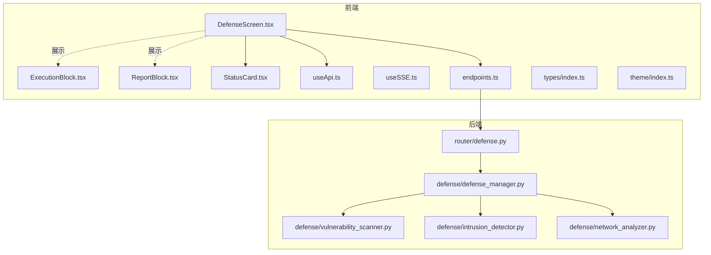
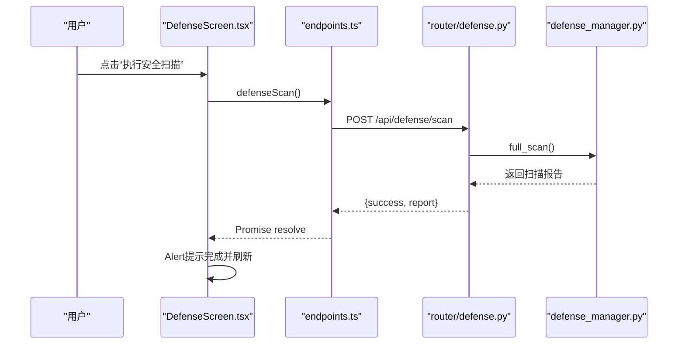
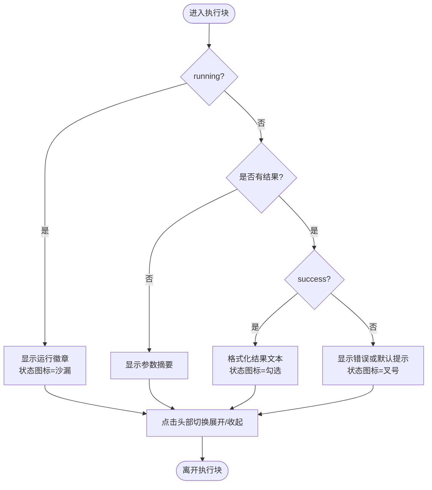
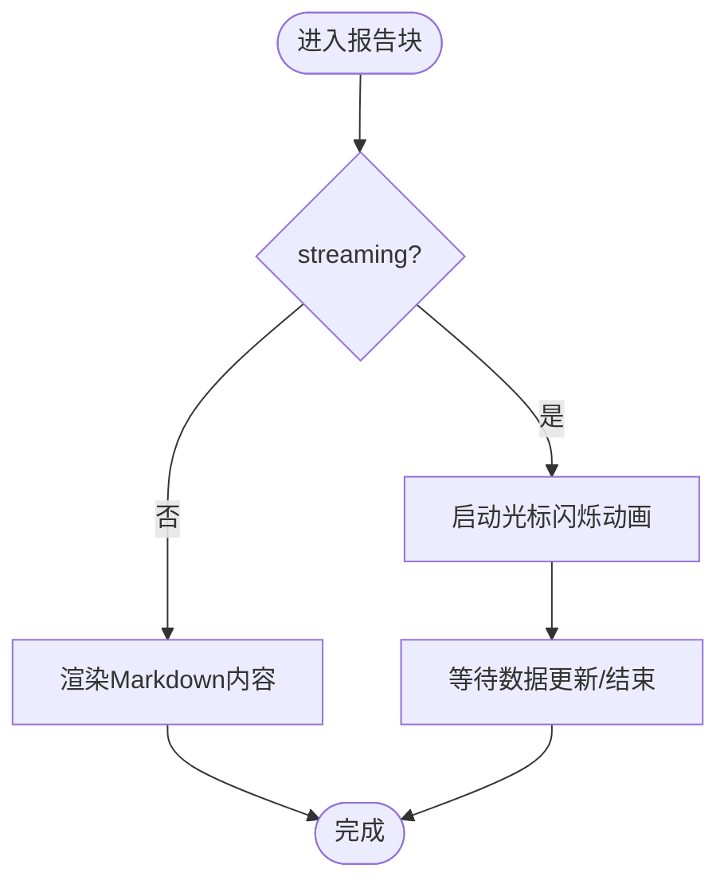
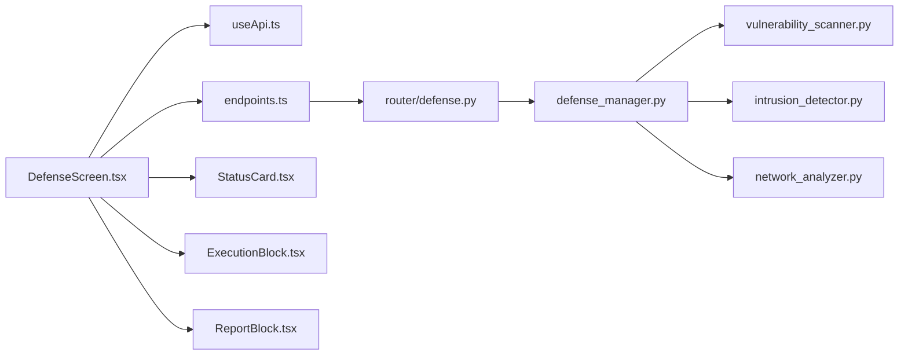

# 防御监控界面

<cite>
**本文引用的文件**
- [DefenseScreen.tsx](file://app/src/screens/DefenseScreen.tsx)
- [ExecutionBlock.tsx](file://app/src/components/ExecutionBlock.tsx)
- [ReportBlock.tsx](file://app/src/components/ReportBlock.tsx)
- [StatusCard.tsx](file://app/src/components/StatusCard.tsx)
- [useApi.ts](file://app/src/hooks/useApi.ts)
- [useSSE.ts](file://app/src/hooks/useSSE.ts)
- [endpoints.ts](file://app/src/api/endpoints.ts)
- [index.ts](file://app/src/types/index.ts)
- [index.ts](file://app/src/theme/index.ts)
- [defense.py](file://router/defense.py)
- [defense_manager.py](file://defense/defense_manager.py)
- [vulnerability_scanner.py](file://defense/vulnerability_scanner.py)
- [intrusion_detector.py](file://defense/intrusion_detector.py)
- [network_analyzer.py](file://defense/network_analyzer.py)
</cite>

## 目录
1. [简介](#简介)
2. [项目结构](#项目结构)
3. [核心组件](#核心组件)
4. [架构总览](#架构总览)
5. [组件详解](#组件详解)
6. [依赖关系分析](#依赖关系分析)
7. [性能考量](#性能考量)
8. [故障排查指南](#故障排查指南)
9. [结论](#结论)

## 简介
本文件面向Secbot防御监控界面，系统性阐述防御扫描结果展示、执行状态监控与报告生成的前端实现；深入解析执行块与报告块组件的交互与可视化设计；梳理从任务提交、状态轮询到结果渲染的完整数据流；并给出可扩展的交互与信息可视化方案。

## 项目结构
防御监控界面位于React Native前端应用中，采用“屏幕 + 组件 + Hook + API封装 + 类型定义”的分层组织方式。后端通过FastAPI路由提供防御相关接口，核心逻辑由Python防御模块承担。

图表来源
- [DefenseScreen.tsx](file://app/src/screens/DefenseScreen.tsx#L28-L184)
- [ExecutionBlock.tsx](file://app/src/components/ExecutionBlock.tsx#L25-L173)
- [ReportBlock.tsx](file://app/src/components/ReportBlock.tsx#L19-L73)
- [StatusCard.tsx](file://app/src/components/StatusCard.tsx#L16-L29)
- [useApi.ts](file://app/src/hooks/useApi.ts#L13-L34)
- [useSSE.ts](file://app/src/hooks/useSSE.ts#L9-L49)
- [endpoints.ts](file://app/src/api/endpoints.ts#L42-L55)
- [index.ts](file://app/src/types/index.ts#L111-L129)
- [defense.py](file://router/defense.py#L19-L95)
- [defense_manager.py](file://defense/defense_manager.py#L17-L160)
- [vulnerability_scanner.py](file://defense/vulnerability_scanner.py#L12-L314)
- [intrusion_detector.py](file://defense/intrusion_detector.py#L11-L235)
- [network_analyzer.py](file://defense/network_analyzer.py#L12-L226)

章节来源
- [DefenseScreen.tsx](file://app/src/screens/DefenseScreen.tsx#L28-L184)
- [defense.py](file://router/defense.py#L19-L95)

## 核心组件
- 防御屏幕（DefenseScreen）
  - 负责加载防御状态、封禁IP列表，触发扫描任务，支持下拉刷新与解封操作。
- 执行块（ExecutionBlock）
  - 展示工具执行过程：默认折叠参数摘要，展开后显示参数明细与执行结果；根据运行态/成功/失败切换状态图标与颜色。
- 报告块（ReportBlock）
  - 展示报告内容：流式模式下显示闪烁光标，完成后切换为完成态样式并渲染Markdown。
- 状态卡片（StatusCard）
  - 通用仪表盘卡片，用于展示数值型指标（如封禁IP数、漏洞数等），支持自定义颜色。
- API钩子（useApi/useSSE）
  - useApi：统一封装异步请求状态（loading/data/error），简化调用方逻辑。
  - useSSE：封装SSE流式事件订阅，支持取消上一次流、回调事件、结束与错误处理。
- 类型与主题
  - types/index.ts：定义防御相关响应类型（状态、封禁IP、扫描结果等）。
  - theme/index.ts：提供暗色赛博朋克风格的主题色板与排版尺寸。

章节来源
- [DefenseScreen.tsx](file://app/src/screens/DefenseScreen.tsx#L28-L184)
- [ExecutionBlock.tsx](file://app/src/components/ExecutionBlock.tsx#L25-L173)
- [ReportBlock.tsx](file://app/src/components/ReportBlock.tsx#L19-L73)
- [StatusCard.tsx](file://app/src/components/StatusCard.tsx#L16-L29)
- [useApi.ts](file://app/src/hooks/useApi.ts#L13-L34)
- [useSSE.ts](file://app/src/hooks/useSSE.ts#L9-L49)
- [index.ts](file://app/src/types/index.ts#L111-L129)
- [index.ts](file://app/src/theme/index.ts#L5-L63)

## 架构总览
防御监控界面采用前后端分离架构：
- 前端负责UI渲染与用户交互，通过endpoints.ts封装的HTTP接口与后端通信。
- 后端路由router/defense.py提供扫描、状态、封禁IP、解封与报告生成接口。
- Python防御模块defense/defense_manager.py协调各子模块（漏洞扫描、入侵检测、网络分析、报告生成、反制措施）完成具体业务。

图表来源
- [DefenseScreen.tsx](file://app/src/screens/DefenseScreen.tsx#L42-L53)
- [endpoints.ts](file://app/src/api/endpoints.ts#L42-L43)
- [defense.py](file://router/defense.py#L22-L30)
- [defense_manager.py](file://defense/defense_manager.py#L34-L61)

## 组件详解

### 防御屏幕（DefenseScreen）
- 功能要点
  - 初始化加载：同时拉取防御状态与封禁IP列表。
  - 扫描控制：点击“执行安全扫描”触发后端扫描，期间禁用按钮并显示加载指示。
  - 解封操作：逐条封禁IP提供“解封”按钮，调用后端接口并刷新列表。
  - 下拉刷新：统一loading状态，避免并发请求。
- 数据绑定
  - 使用useApi封装状态，分别维护status与blocked两路数据。
  - 类型来自types/index.ts中的DefenseStatusResponse与BlockedIpsResponse。
- 视觉呈现
  - 状态卡片展示封禁IP、漏洞、检测攻击、恶意IP数量及监控/自动响应开关。
  - 封禁IP列表支持逐条解封，空状态友好提示。

章节来源
- [DefenseScreen.tsx](file://app/src/screens/DefenseScreen.tsx#L28-L184)
- [endpoints.ts](file://app/src/api/endpoints.ts#L42-L55)
- [index.ts](file://app/src/types/index.ts#L111-L129)
- [StatusCard.tsx](file://app/src/components/StatusCard.tsx#L16-L29)

### 执行块（ExecutionBlock）
- 设计目标
  - 默认折叠参数摘要，运行中显示“running”徽章，结果到达后展开详情。
  - 成功/失败分别以不同颜色与图标提示，便于快速识别。
- 关键逻辑
  - 参数摘要：最多展示两项参数，超出部分以“+N”表示。
  - 结果格式化：对象类型自动JSON序列化，字符串原样显示。
  - 状态图标：运行中为沙漏，成功为勾选，失败为叉号，未开始为点。
- 交互细节
  - 折叠/展开：点击头部区域切换。
  - 代理标识：可选agent字段用于标注来源智能体。

图表来源
- [ExecutionBlock.tsx](file://app/src/components/ExecutionBlock.tsx#L25-L173)

章节来源
- [ExecutionBlock.tsx](file://app/src/components/ExecutionBlock.tsx#L25-L173)

### 报告块（ReportBlock）
- 设计目标
  - 流式模式：显示闪烁光标，模拟“正在生成”体验。
  - 完成模式：切换为完成态样式，使用MarkdownText渲染报告正文。
- 关键逻辑
  - 流式闪烁：通过Animated.loop实现光标闪烁动画。
  - 完成态样式：边框样式从虚线切换为粗边左线，突出完成状态。
- 交互细节
  - 不可选择文本（流式）以避免干扰滚动与复制；完成态可选择文本便于复制。

图表来源
- [ReportBlock.tsx](file://app/src/components/ReportBlock.tsx#L19-L73)

章节来源
- [ReportBlock.tsx](file://app/src/components/ReportBlock.tsx#L19-L73)

### 状态卡片（StatusCard）
- 设计目标
  - 通用仪表盘卡片，用于展示数值型指标与副标题。
  - 支持自定义颜色，适配不同状态（成功/警告/危险）。
- 适用场景
  - 防御状态中的各类计数指标，如封禁IP、漏洞、检测攻击、恶意IP等。

章节来源
- [StatusCard.tsx](file://app/src/components/StatusCard.tsx#L16-L29)

### API与类型体系
- API端点
  - 扫描：POST /api/defense/scan
  - 状态：GET /api/defense/status
  - 封禁列表：GET /api/defense/blocked
  - 解封：POST /api/defense/unblock
  - 报告：GET /api/defense/report?type={full,vulnerability,attack}
- 类型定义
  - DefenseStatusResponse：监控状态、自动响应、各类计数与统计。
  - BlockedIpsResponse：封禁IP数组。
  - DefenseScanResponse：扫描结果（包含报告摘要）。

章节来源
- [endpoints.ts](file://app/src/api/endpoints.ts#L42-L55)
- [index.ts](file://app/src/types/index.ts#L111-L129)

## 依赖关系分析
- 前端依赖
  - DefenseScreen依赖useApi进行数据拉取，依赖StatusCard与基础UI组件。
  - ExecutionBlock与ReportBlock作为通用展示组件，独立于屏幕逻辑，便于复用。
  - useSSE用于流式事件订阅（如思考/执行/报告的增量输出），与ExecutionBlock/ReportBlock配合可实现更丰富的实时反馈。
- 后端依赖
  - router/defense.py依赖defense_manager.py。
  - defense_manager.py聚合漏洞扫描、入侵检测、网络分析、报告生成与反制模块，形成完整的防御闭环。

图表来源
- [DefenseScreen.tsx](file://app/src/screens/DefenseScreen.tsx#L28-L184)
- [useApi.ts](file://app/src/hooks/useApi.ts#L13-L34)
- [endpoints.ts](file://app/src/api/endpoints.ts#L42-L55)
- [StatusCard.tsx](file://app/src/components/StatusCard.tsx#L16-L29)
- [ExecutionBlock.tsx](file://app/src/components/ExecutionBlock.tsx#L25-L173)
- [ReportBlock.tsx](file://app/src/components/ReportBlock.tsx#L19-L73)
- [defense.py](file://router/defense.py#L19-L95)
- [defense_manager.py](file://defense/defense_manager.py#L17-L160)
- [vulnerability_scanner.py](file://defense/vulnerability_scanner.py#L12-L314)
- [intrusion_detector.py](file://defense/intrusion_detector.py#L11-L235)
- [network_analyzer.py](file://defense/network_analyzer.py#L12-L226)

章节来源
- [defense.py](file://router/defense.py#L19-L95)
- [defense_manager.py](file://defense/defense_manager.py#L17-L160)

## 性能考量
- 前端
  - 使用useApi统一管理loading/data/error，避免重复请求与竞态。
  - 执行块与报告块均采用轻量级样式与可折叠设计，减少首屏渲染压力。
  - 流式报告使用Animated实现光标闪烁，避免频繁重绘。
- 后端
  - 扫描流程分阶段执行（信息收集→漏洞扫描→网络分析→入侵检测→报告生成），便于监控与限流。
  - 监控循环支持可配置间隔，避免高频轮询造成资源消耗。

## 故障排查指南
- 常见问题
  - 扫描失败：前端弹窗提示错误信息；检查后端日志定位异常。
  - 状态/封禁列表为空：确认后端是否正确返回数据；检查网络连通性。
  - 解封失败：确认IP是否在封禁列表中；检查后端unblock接口返回。
- 建议
  - 在useApi中捕获错误并上报；在屏幕层面提供“重试”按钮。
  - 对SSE流增加超时与断线重连机制，提升鲁棒性。

章节来源
- [DefenseScreen.tsx](file://app/src/screens/DefenseScreen.tsx#L42-L62)
- [useApi.ts](file://app/src/hooks/useApi.ts#L20-L31)

## 结论
防御监控界面通过清晰的屏幕布局、可复用的执行块与报告块组件，以及完善的API与类型体系，实现了从扫描任务提交、状态轮询到结果渲染的完整闭环。结合后端防御管理器的多模块协同，界面具备良好的可扩展性与可维护性。后续可在SSE流式渲染、报告下载与更多可视化图表方面进一步增强用户体验。