# 知识库系统

<cite>
**本文档引用的文件**
- [README.md](file://README.md)
- [main.py](file://main.py)
- [router/main.py](file://router/main.py)
- [router/chat.py](file://router/chat.py)
- [core/session.py](file://core/session.py)
- [core/agents/planner_agent.py](file://core/agents/planner_agent.py)
- [core/executor.py](file://core/executor.py)
- [core/memory/manager.py](file://core/memory/manager.py)
- [core/attack_chain/attack_chain.py](file://core/attack_chain/attack_chain.py)
- [database/models.py](file://database/models.py)
- [utils/event_bus.py](file://utils/event_bus.py)
- [hackbot_config/__init__.py](file://hackbot_config/__init__.py)
- [app/App.tsx](file://app/App.tsx)
- [terminal-ui/src/App.tsx](file://terminal-ui/src/App.tsx)
- [tools/base.py](file://tools/base.py)
</cite>

## 目录
1. [简介](#简介)
2. [项目结构](#项目结构)
3. [核心组件](#核心组件)
4. [架构总览](#架构总览)
5. [详细组件分析](#详细组件分析)
6. [依赖关系分析](#依赖关系分析)
7. [性能考虑](#性能考虑)
8. [故障排除指南](#故障排除指南)
9. [结论](#结论)

## 简介

Secbot 是一个基于 AI 驱动的自动化渗透测试智能体系统，集成了多种先进的安全测试能力和智能体技术。该系统支持多种智能体模式，包括 ReAct、Plan-Execute、多智能体协作、工具调用和记忆增强等核心能力。

### 主要特性

- **多种智能体模式**：支持 ReAct、Plan-Execute、多智能体协作、工具调用、记忆增强
- **AI Web 研究子智能体**：独立的 WebResearchAgent，基于 ReAct 自动完成联网搜索、网页提取、多页爬取和 API 调用
- **本地控制界面**：简单直观的命令行入口与配置工具
- **持久化终端会话**：智能体专用终端，支持会话内多步命令执行与系统信息收集
- **AI 网络爬虫**：实时网络信息捕获和监控
- **操作系统控制**：文件操作、进程管理、系统信息获取

### 渗透测试能力

- **信息收集**：自动化侦察（主机名、IP、端口、服务指纹）
- **漏洞扫描**：端口扫描、服务检测、漏洞识别
- **漏洞利用引擎**：自动化执行 SQL 注入、XSS、命令注入、文件上传、路径遍历、SSRF 等
- **自动化攻击链**：完整渗透测试工作流 — 信息收集 → 漏洞扫描 → 漏洞利用 → 后渗透
- **Payload 生成器**：按需生成各类攻击 payload
- **后渗透利用**：权限提升、持久化、横向移动、数据外传
- **网络攻击**：暴力破解、DoS 测试（仅限授权测试）

## 项目结构

该项目采用模块化架构设计，主要分为以下几个核心层次：

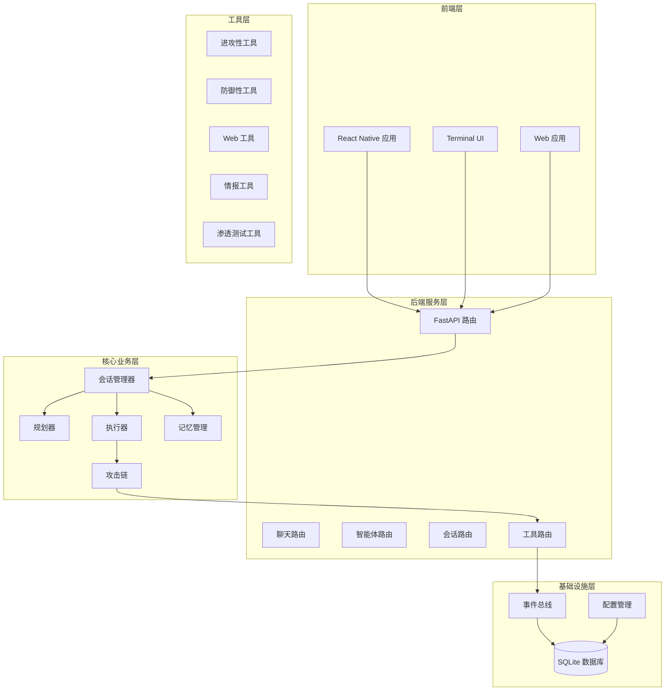

**图表来源**
- [README.md:86-170](file://README.md#L86-L170)
- [router/main.py:19-71](file://router/main.py#L19-L71)

**章节来源**
- [README.md:353-376](file://README.md#L353-L376)
- [router/main.py:19-71](file://router/main.py#L19-L71)

## 核心组件

### 会话管理器 (SessionManager)

会话管理器是整个系统的核心编排组件，负责管理用户会话生命周期和智能体交互流程。

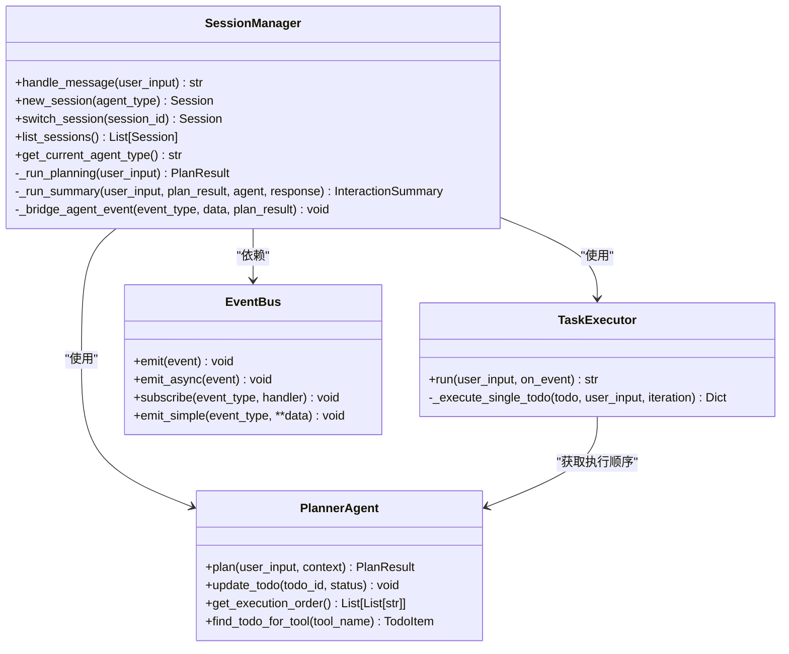

**图表来源**
- [core/session.py:32-433](file://core/session.py#L32-L433)
- [core/agents/planner_agent.py:20-130](file://core/agents/planner_agent.py#L20-L130)
- [core/executor.py:17-197](file://core/executor.py#L17-L197)
- [utils/event_bus.py:68-182](file://utils/event_bus.py#L68-L182)

### 规划器 (PlannerAgent)

规划器负责将用户请求分类并生成结构化的任务计划，支持复杂的依赖关系和资源管理。

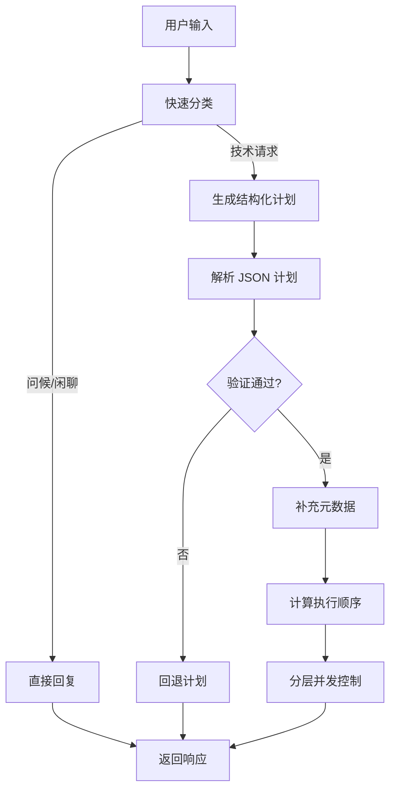

**图表来源**
- [core/agents/planner_agent.py:88-130](file://core/agents/planner_agent.py#L88-L130)
- [core/agents/planner_agent.py:462-521](file://core/agents/planner_agent.py#L462-L521)

### 执行器 (TaskExecutor)

执行器负责按照规划器生成的执行顺序，协调多智能体的并发执行。

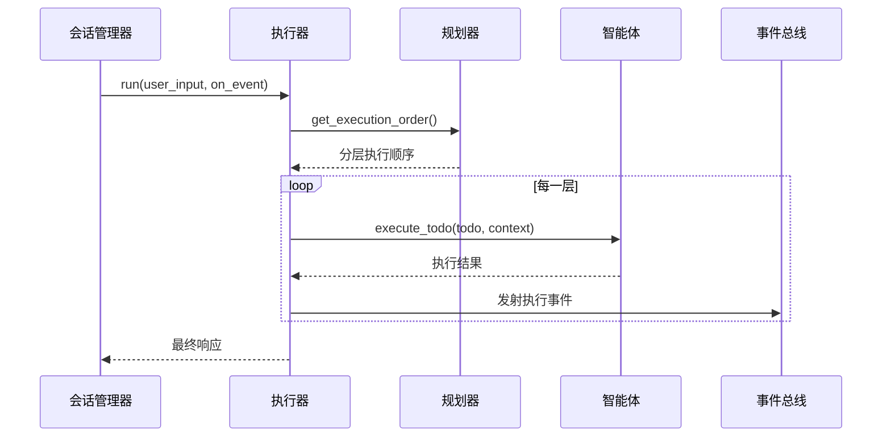

**图表来源**
- [core/executor.py:46-151](file://core/executor.py#L46-L151)
- [core/session.py:374-407](file://core/session.py#L374-L407)

**章节来源**
- [core/session.py:32-433](file://core/session.py#L32-L433)
- [core/agents/planner_agent.py:20-865](file://core/agents/planner_agent.py#L20-L865)
- [core/executor.py:17-197](file://core/executor.py#L17-L197)

## 架构总览

系统采用分层架构设计，实现了前后端分离和事件驱动的解耦架构。

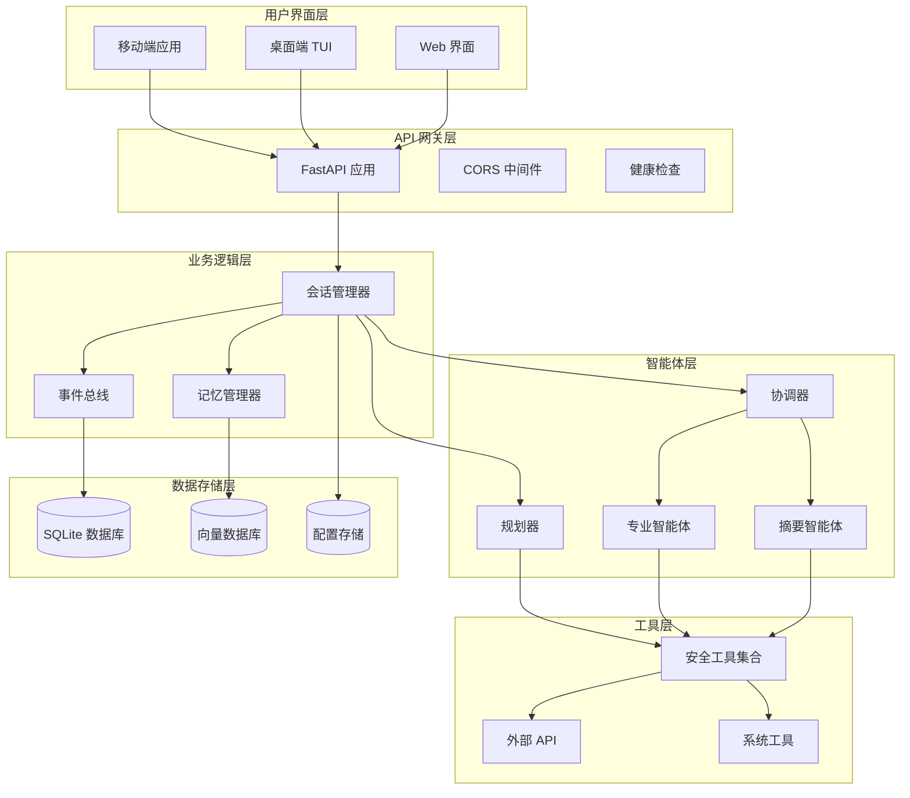

**图表来源**
- [README.md:86-170](file://README.md#L86-L170)
- [router/main.py:19-71](file://router/main.py#L19-L71)
- [core/session.py:32-433](file://core/session.py#L32-L433)

### 架构特点

1. **事件驱动架构**：通过 EventBus 实现智能体与 UI 的解耦
2. **多智能体协作**：支持规划、执行、摘要等不同职能的智能体协同工作
3. **可扩展工具系统**：标准化的工具接口支持第三方工具集成
4. **持久化存储**：SQLite 支持对话历史和配置信息的持久化
5. **跨平台支持**：同时支持移动端、桌面端和 Web 界面

**章节来源**
- [README.md:86-170](file://README.md#L86-L170)
- [router/main.py:19-71](file://router/main.py#L19-L71)

## 详细组件分析

### 前端架构

系统提供多种前端界面支持，包括 React Native 移动端应用和 Terminal UI 桌面应用。

#### React Native 移动端

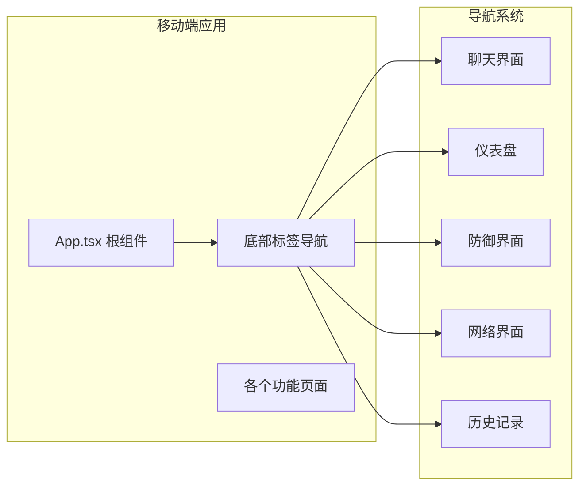

**图表来源**
- [app/App.tsx:28-108](file://app/App.tsx#L28-L108)

#### Terminal UI 桌面应用

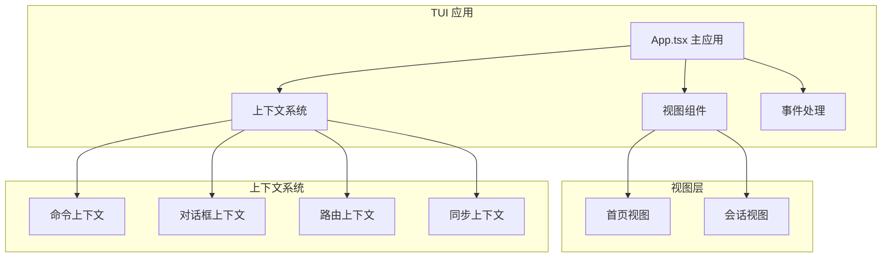

**图表来源**
- [terminal-ui/src/App.tsx:26-211](file://terminal-ui/src/App.tsx#L26-L211)

**章节来源**
- [app/App.tsx:1-109](file://app/App.tsx#L1-L109)
- [terminal-ui/src/App.tsx:1-212](file://terminal-ui/src/App.tsx#L1-L212)

### 后端 API 架构

#### FastAPI 应用入口

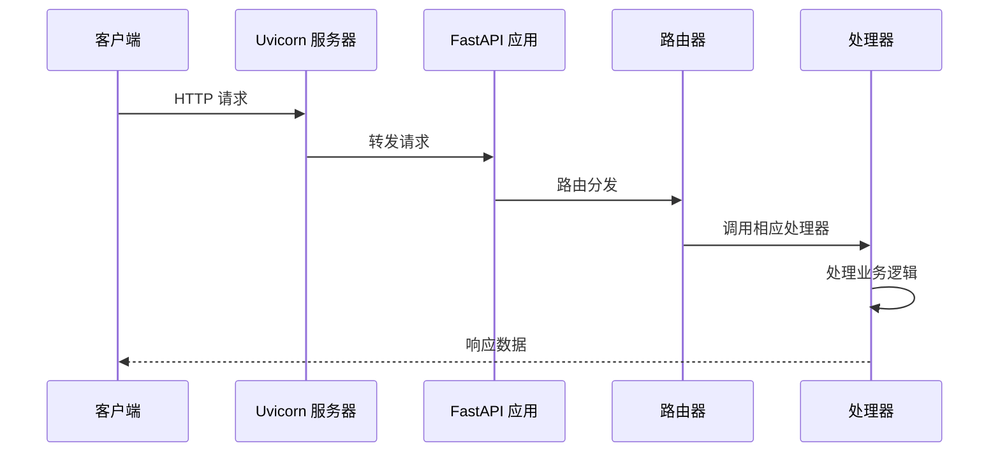

**图表来源**
- [router/main.py:74-101](file://router/main.py#L74-L101)

#### 聊天路由实现

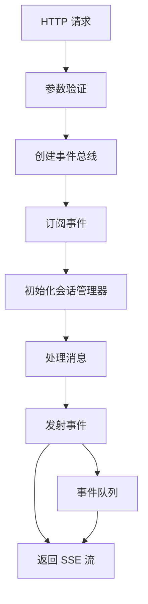

**图表来源**
- [router/chat.py:134-263](file://router/chat.py#L134-L263)

**章节来源**
- [router/main.py:19-101](file://router/main.py#L19-L101)
- [router/chat.py:1-329](file://router/chat.py#L1-L329)

### 记忆管理系统

系统实现了三层记忆架构，参考了 OpenAI Agents SDK 和 CrewAI 的设计理念。

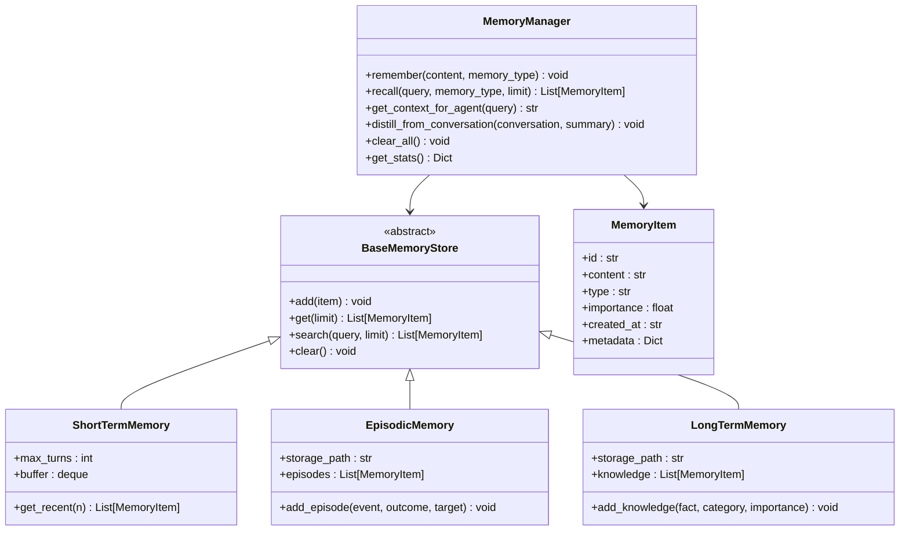

**图表来源**
- [core/memory/manager.py:223-325](file://core/memory/manager.py#L223-L325)

**章节来源**
- [core/memory/manager.py:1-325](file://core/memory/manager.py#L1-L325)

### 攻击链系统

系统实现了完整的自动化攻击链，整合了漏洞库检索和 LangGraph 图推理。

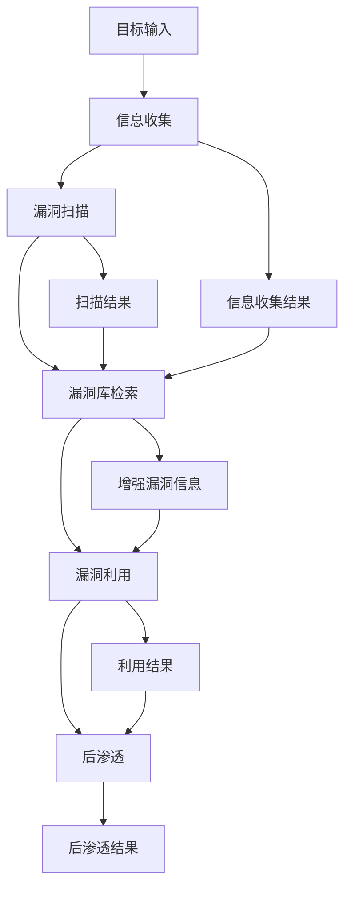

**图表来源**
- [core/attack_chain/attack_chain.py:18-61](file://core/attack_chain/attack_chain.py#L18-L61)

**章节来源**
- [core/attack_chain/attack_chain.py:1-213](file://core/attack_chain/attack_chain.py#L1-L213)

### 工具系统

系统提供了标准化的工具接口，支持各种安全测试工具的集成。

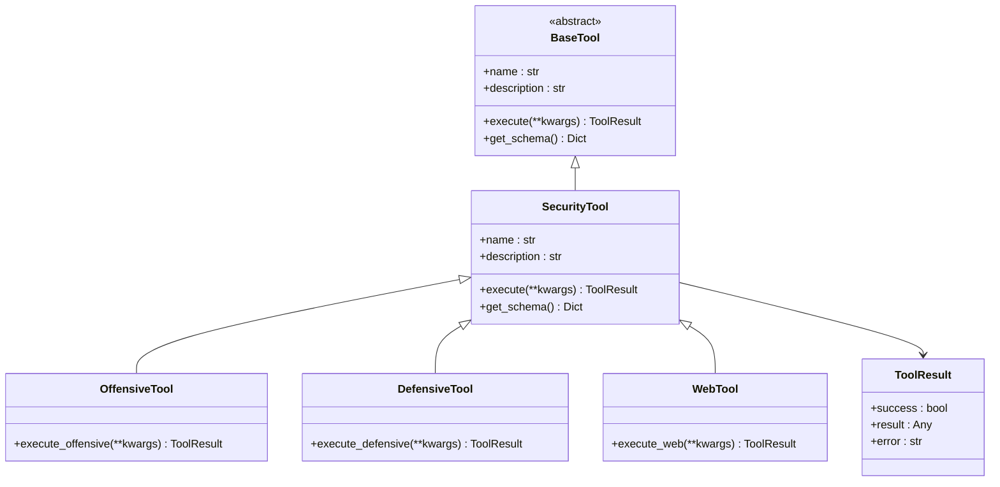

**图表来源**
- [tools/base.py:16-36](file://tools/base.py#L16-L36)

**章节来源**
- [tools/base.py:1-36](file://tools/base.py#L1-L36)

## 依赖关系分析

系统采用了清晰的依赖关系设计，实现了良好的模块解耦。

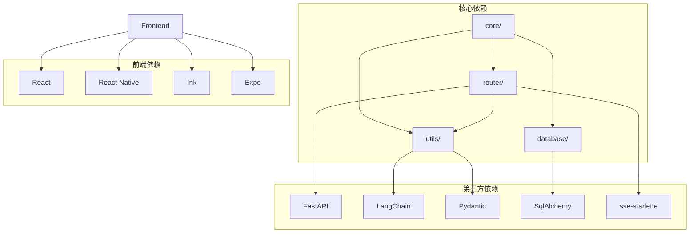

**图表来源**
- [README.md:444-452](file://README.md#L444-L452)

### 关键依赖关系

1. **会话管理器依赖**：SessionManager 依赖 PlannerAgent、TaskExecutor 和 EventBus
2. **规划器依赖**：PlannerAgent 依赖 LangChain 和配置管理
3. **执行器依赖**：TaskExecutor 依赖规划器和智能体接口
4. **事件总线依赖**：所有组件通过 EventBus 进行通信
5. **数据库依赖**：使用 SQLite 进行数据持久化

**章节来源**
- [README.md:444-452](file://README.md#L444-L452)
- [core/session.py:14-29](file://core/session.py#L14-L29)

## 性能考虑

### 并发执行策略

系统采用了分层并发执行策略，优化了资源利用率和执行效率：

1. **拓扑排序**：基于依赖关系的拓扑分层，确保任务执行顺序正确
2. **资源隔离**：同一资源上的高风险任务强制串行执行
3. **并发限制**：每层最多执行固定数量的任务，避免资源竞争
4. **异步处理**：使用 asyncio.gather 实现并行执行

### 内存管理

1. **短期记忆**：限制会话轮数，避免内存无限增长
2. **长期记忆**：采用文件存储，支持持久化
3. **事件流**：使用队列机制，避免事件堆积

### 网络优化

1. **SSE 流式传输**：实时事件推送，减少延迟
2. **批量处理**：并行执行多个任务，提高吞吐量
3. **缓存机制**：工具结果缓存，避免重复执行

## 故障排除指南

### 常见问题及解决方案

#### 1. 启动问题

**问题**：应用无法启动
**可能原因**：
- 端口被占用
- 依赖包缺失
- 配置文件错误

**解决方案**：
1. 检查端口占用情况
2. 重新安装依赖包
3. 验证 .env 配置文件

#### 2. 智能体执行问题

**问题**：智能体无法执行任务
**可能原因**：
- LLM API Key 未配置
- 工具权限不足
- 网络连接问题

**解决方案**：
1. 配置正确的 API Key
2. 检查系统权限
3. 验证网络连接

#### 3. 数据库问题

**问题**：数据库连接失败
**可能原因**：
- 数据库文件损坏
- 权限不足
- 路径配置错误

**解决方案**：
1. 检查数据库文件完整性
2. 验证文件权限
3. 重新配置数据库路径

**章节来源**
- [router/main.py:83-97](file://router/main.py#L83-L97)
- [hackbot_config/__init__.py:183-275](file://hackbot_config/__init__.py#L183-L275)

## 结论

Secbot 知识库系统是一个功能完整、架构清晰的 AI 驱动安全测试平台。系统通过模块化设计实现了高度的可扩展性和可维护性，支持多种前端界面和后端服务。

### 主要优势

1. **架构设计优秀**：分层架构和事件驱动设计实现了良好的解耦
2. **功能丰富**：涵盖了从信息收集到漏洞利用的完整安全测试流程
3. **用户体验佳**：支持多种前端界面，提供流畅的交互体验
4. **扩展性强**：标准化的工具接口和配置管理支持第三方集成
5. **可靠性高**：完善的错误处理和故障恢复机制

### 发展方向

1. **性能优化**：进一步优化并发执行策略和内存使用
2. **功能扩展**：增加更多安全测试场景和工具支持
3. **用户体验**：改进界面设计和交互流程
4. **安全性增强**：加强访问控制和审计功能

该系统为安全研究人员和渗透测试人员提供了一个强大而易用的工具平台，有助于提高安全测试的效率和质量。