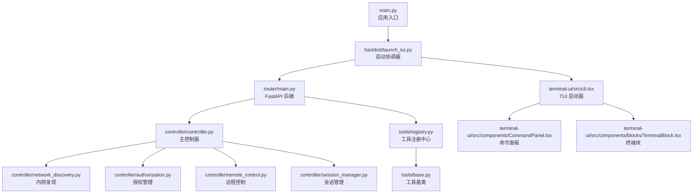
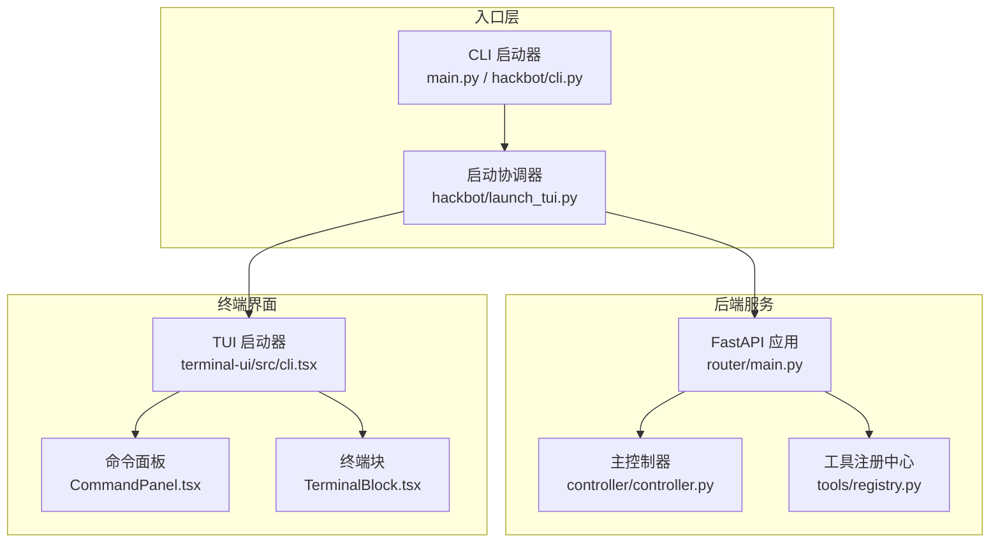
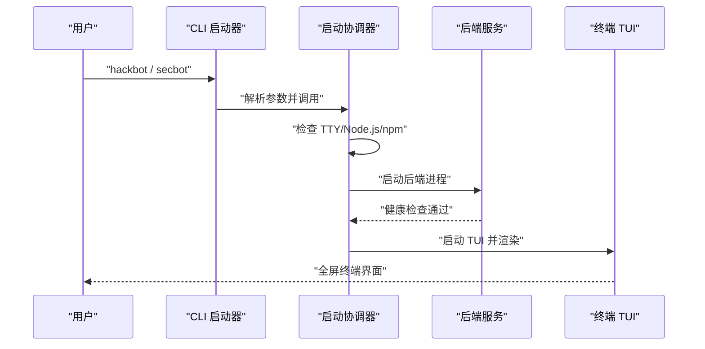
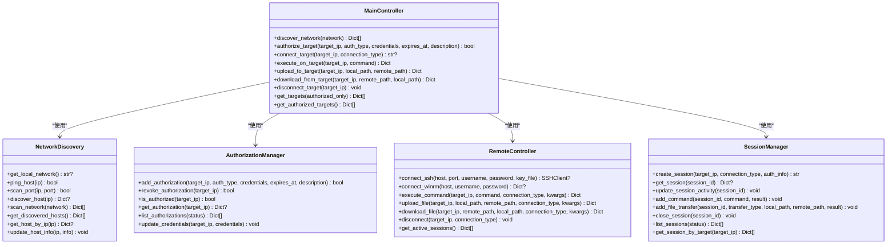
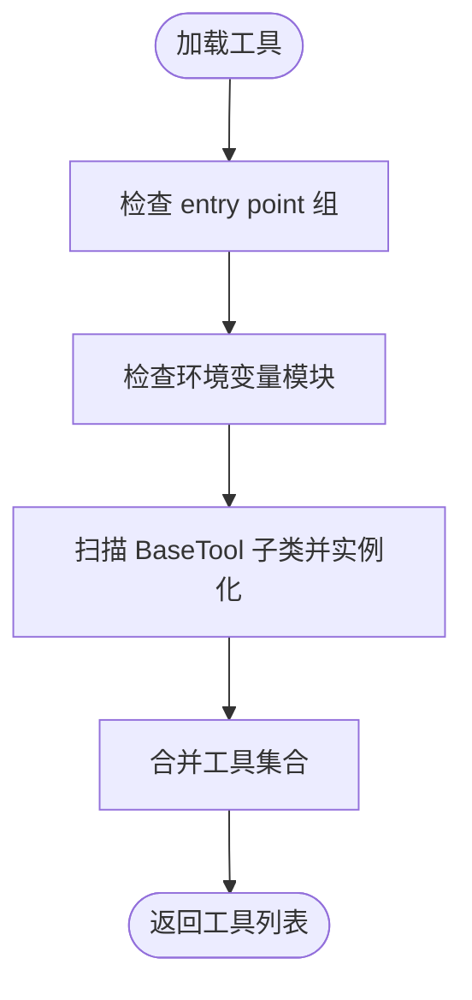
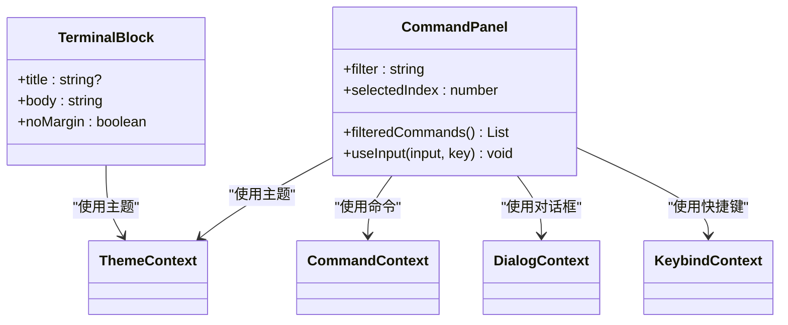
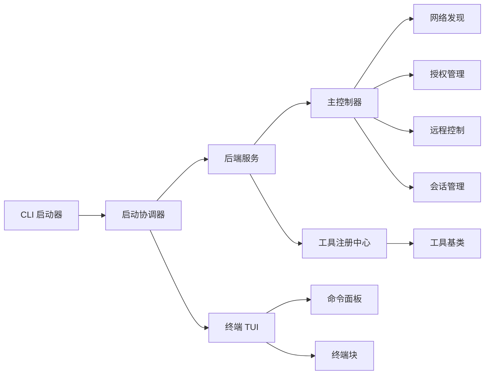

# 终端工具系统

<cite>
**本文档引用的文件**
- [main.py](file://main.py)
- [hackbot/cli.py](file://hackbot/cli.py)
- [hackbot/launch_tui.py](file://hackbot/launch_tui.py)
- [router/main.py](file://router/main.py)
- [terminal-ui/src/cli.tsx](file://terminal-ui/src/cli.tsx)
- [controller/controller.py](file://controller/controller.py)
- [controller/network_discovery.py](file://controller/network_discovery.py)
- [controller/remote_control.py](file://controller/remote_control.py)
- [controller/session_manager.py](file://controller/session_manager.py)
- [controller/authorization.py](file://controller/authorization.py)
- [tools/base.py](file://tools/base.py)
- [tools/registry.py](file://tools/registry.py)
- [skills/base/terminal-session/SKILL.md](file://skills/base/terminal-session/SKILL.md)
- [terminal-ui/src/components/blocks/TerminalBlock.tsx](file://terminal-ui/src/components/blocks/TerminalBlock.tsx)
- [terminal-ui/src/components/CommandPanel.tsx](file://terminal-ui/src/components/CommandPanel.tsx)
</cite>

## 目录
1. [简介](#简介)
2. [项目结构](#项目结构)
3. [核心组件](#核心组件)
4. [架构总览](#架构总览)
5. [详细组件分析](#详细组件分析)
6. [依赖关系分析](#依赖关系分析)
7. [性能考虑](#性能考虑)
8. [故障排除指南](#故障排除指南)
9. [结论](#结论)

## 简介
本项目是一个集成了后端 API 服务与终端 TUI 的安全测试工具系统。其核心目标是提供一个一体化的开发与运维体验：通过一条命令即可启动后端服务与终端界面，并在终端中进行安全测试、工具调用与会话管理。系统采用 Python 后端（FastAPI）与 TypeScript/React 终端界面（Ink）的组合，支持多平台部署与扩展。

系统支持以下关键能力：
- 后端服务：REST + SSE 接口，提供聊天、工具列表、智能体、会话、系统与网络等功能。
- 终端 TUI：全屏 Ink 界面，支持命令面板、终端块渲染、主题与键盘绑定。
- 控制器层：统一管理内网发现、授权与远程控制，支持 SSH/WinRM 连接与会话管理。
- 工具体系：通过注册中心动态加载工具，支持基础工具与高级工具两类。
- 技能系统：提供持久化终端会话技能，支持多步骤安全测试流程。

## 项目结构
项目采用前后端分离与模块化组织：
- 后端入口与路由：router/main.py 提供 FastAPI 应用与路由注册。
- 前端入口：terminal-ui/src/cli.tsx 负责 TUI 启动、TTY 检测与后端连通性检查。
- 控制器：controller/* 提供网络发现、授权、远程控制与会话管理。
- 工具系统：tools/* 提供工具基类与注册中心，支持扩展与发现。
- 技能：skills/* 提供面向安全测试的技能文档与使用指南。
- 终端 UI 组件：terminal-ui/src/components/* 提供命令面板、终端块等组件。

**图表来源**
- [main.py:1-62](file://main.py#L1-L62)
- [hackbot/launch_tui.py:1-343](file://hackbot/launch_tui.py#L1-L343)
- [router/main.py:1-101](file://router/main.py#L1-L101)
- [terminal-ui/src/cli.tsx:1-143](file://terminal-ui/src/cli.tsx#L1-L143)
- [controller/controller.py:1-245](file://controller/controller.py#L1-L245)
- [controller/network_discovery.py:1-233](file://controller/network_discovery.py#L1-L233)
- [controller/authorization.py:1-120](file://controller/authorization.py#L1-L120)
- [controller/remote_control.py:1-252](file://controller/remote_control.py#L1-L252)
- [controller/session_manager.py:1-91](file://controller/session_manager.py#L1-L91)
- [tools/registry.py:1-142](file://tools/registry.py#L1-L142)
- [tools/base.py:1-36](file://tools/base.py#L1-L36)
- [terminal-ui/src/components/CommandPanel.tsx:1-92](file://terminal-ui/src/components/CommandPanel.tsx#L1-L92)
- [terminal-ui/src/components/blocks/TerminalBlock.tsx:1-28](file://terminal-ui/src/components/blocks/TerminalBlock.tsx#L1-L28)

**章节来源**
- [main.py:1-62](file://main.py#L1-L62)
- [router/main.py:1-101](file://router/main.py#L1-L101)
- [terminal-ui/src/cli.tsx:1-143](file://terminal-ui/src/cli.tsx#L1-L143)

## 核心组件
- 应用入口与 CLI：main.py 与 hackbot/cli.py 提供统一入口与参数解析，支持后端、TUI 单独启动与模型选择。
- 启动协调器：hackbot/launch_tui.py 负责后端与 TUI 的启动顺序、端口占用检测、TTY 检测与错误处理。
- FastAPI 后端：router/main.py 组装路由、CORS、健康检查与数据库初始化。
- 终端 TUI：terminal-ui/src/cli.tsx 负责 TTY/alternate screen 管理、后端可达性检查与渲染。
- 控制器层：controller/controller.py 统一编排网络发现、授权、远程控制与会话管理。
- 工具系统：tools/base.py 定义工具基类，tools/registry.py 支持多种发现机制加载工具。
- 技能系统：skills/base/terminal-session/SKILL.md 提供持久化终端会话的使用指南。
- UI 组件：CommandPanel.tsx 与 TerminalBlock.tsx 提供命令面板与终端输出渲染。

**章节来源**
- [hackbot/cli.py:1-100](file://hackbot/cli.py#L1-L100)
- [hackbot/launch_tui.py:1-343](file://hackbot/launch_tui.py#L1-L343)
- [router/main.py:1-101](file://router/main.py#L1-L101)
- [terminal-ui/src/cli.tsx:1-143](file://terminal-ui/src/cli.tsx#L1-L143)
- [controller/controller.py:1-245](file://controller/controller.py#L1-L245)
- [tools/base.py:1-36](file://tools/base.py#L1-L36)
- [tools/registry.py:1-142](file://tools/registry.py#L1-L142)
- [skills/base/terminal-session/SKILL.md:1-229](file://skills/base/terminal-session/SKILL.md#L1-L229)
- [terminal-ui/src/components/CommandPanel.tsx:1-92](file://terminal-ui/src/components/CommandPanel.tsx#L1-L92)
- [terminal-ui/src/components/blocks/TerminalBlock.tsx:1-28](file://terminal-ui/src/components/blocks/TerminalBlock.tsx#L1-L28)

## 架构总览
系统采用“CLI 启动器 → 后端服务 → 终端 TUI → 控制器/工具/技能”的分层架构。CLI 启动器负责协调后端与 TUI 的生命周期，后端提供 REST+SSE 接口，TUI 通过 Ink 渲染全屏界面并与后端通信。

**图表来源**
- [main.py:1-62](file://main.py#L1-L62)
- [hackbot/cli.py:1-100](file://hackbot/cli.py#L1-L100)
- [hackbot/launch_tui.py:1-343](file://hackbot/launch_tui.py#L1-L343)
- [router/main.py:1-101](file://router/main.py#L1-L101)
- [controller/controller.py:1-245](file://controller/controller.py#L1-L245)
- [tools/registry.py:1-142](file://tools/registry.py#L1-L142)
- [terminal-ui/src/cli.tsx:1-143](file://terminal-ui/src/cli.tsx#L1-L143)
- [terminal-ui/src/components/CommandPanel.tsx:1-92](file://terminal-ui/src/components/CommandPanel.tsx#L1-L92)
- [terminal-ui/src/components/blocks/TerminalBlock.tsx:1-28](file://terminal-ui/src/components/blocks/TerminalBlock.tsx#L1-L28)

## 详细组件分析

### 启动与入口组件
- CLI 启动器：支持帮助信息、后端/TUI 单独启动与模型选择，异常捕获与日志记录。
- 启动协调器：检测 TTY/Node.js/npm 等前置条件，管理后端进程生命周期，处理端口占用与优雅终止。
- TUI 启动器：TTY 检测、alternate screen 管理、后端可达性检查与渲染错误处理。

**图表来源**
- [hackbot/cli.py:34-100](file://hackbot/cli.py#L34-L100)
- [hackbot/launch_tui.py:291-343](file://hackbot/launch_tui.py#L291-L343)
- [terminal-ui/src/cli.tsx:67-126](file://terminal-ui/src/cli.tsx#L67-L126)

**章节来源**
- [hackbot/cli.py:1-100](file://hackbot/cli.py#L1-L100)
- [hackbot/launch_tui.py:1-343](file://hackbot/launch_tui.py#L1-L343)
- [terminal-ui/src/cli.tsx:1-143](file://terminal-ui/src/cli.tsx#L1-L143)

### 控制器与网络发现
- 主控制器：统一编排网络发现、授权、远程控制与会话管理，提供授权检查、连接建立与命令执行。
- 网络发现：异步扫描网络段，Ping 检测、端口扫描、服务识别与主机信息聚合。
- 远程控制：支持 SSH/WinRM 连接、命令执行、文件上传/下载与会话维护。
- 会话管理：创建/关闭会话、记录命令与文件传输历史、查询活动会话。
- 授权管理：凭据存储、授权状态检查、过期处理与凭据更新。

**图表来源**
- [controller/controller.py:14-245](file://controller/controller.py#L14-L245)
- [controller/network_discovery.py:15-233](file://controller/network_discovery.py#L15-L233)
- [controller/remote_control.py:12-252](file://controller/remote_control.py#L12-L252)
- [controller/session_manager.py:9-91](file://controller/session_manager.py#L9-L91)
- [controller/authorization.py:11-120](file://controller/authorization.py#L11-L120)

**章节来源**
- [controller/controller.py:1-245](file://controller/controller.py#L1-L245)
- [controller/network_discovery.py:1-233](file://controller/network_discovery.py#L1-L233)
- [controller/remote_control.py:1-252](file://controller/remote_control.py#L1-L252)
- [controller/session_manager.py:1-91](file://controller/session_manager.py#L1-L91)
- [controller/authorization.py:1-120](file://controller/authorization.py#L1-L120)

### 工具系统与技能
- 工具基类：定义统一的工具接口与结果结构，支持异步执行与模式描述。
- 工具注册中心：支持 entry point 与环境变量两种发现机制，自动加载工具集合。
- 技能文档：提供持久化终端会话的使用指南，包括打开/执行/读取/关闭会话与常用安全测试序列。

**图表来源**
- [tools/registry.py:28-142](file://tools/registry.py#L28-L142)
- [tools/base.py:16-36](file://tools/base.py#L16-L36)

**章节来源**
- [tools/base.py:1-36](file://tools/base.py#L1-L36)
- [tools/registry.py:1-142](file://tools/registry.py#L1-L142)
- [skills/base/terminal-session/SKILL.md:1-229](file://skills/base/terminal-session/SKILL.md#L1-L229)

### 终端 UI 组件
- 命令面板：支持模糊搜索、分类展示与键盘导航，提供快捷键提示与执行回调。
- 终端块：渲染等宽字体的终端输出，支持标题与边框样式。

**图表来源**
- [terminal-ui/src/components/CommandPanel.tsx:11-92](file://terminal-ui/src/components/CommandPanel.tsx#L11-L92)
- [terminal-ui/src/components/blocks/TerminalBlock.tsx:8-28](file://terminal-ui/src/components/blocks/TerminalBlock.tsx#L8-L28)

**章节来源**
- [terminal-ui/src/components/CommandPanel.tsx:1-92](file://terminal-ui/src/components/CommandPanel.tsx#L1-L92)
- [terminal-ui/src/components/blocks/TerminalBlock.tsx:1-28](file://terminal-ui/src/components/blocks/TerminalBlock.tsx#L1-L28)

## 依赖关系分析
- 启动层依赖：CLI 启动器依赖启动协调器；启动协调器依赖后端与 TUI 的前置条件检查。
- 后端依赖：FastAPI 应用依赖各路由模块与数据库管理器；主控制器依赖网络发现、授权、远程控制与会话管理。
- 工具依赖：工具注册中心依赖工具基类与外部模块；技能依赖控制器提供的会话能力。
- UI 依赖：TUI 组件依赖上下文（主题、命令、对话框、键盘绑定）与后端 API。

**图表来源**
- [hackbot/launch_tui.py:143-343](file://hackbot/launch_tui.py#L143-L343)
- [router/main.py:19-71](file://router/main.py#L19-L71)
- [controller/controller.py:14-245](file://controller/controller.py#L14-L245)
- [tools/registry.py:28-142](file://tools/registry.py#L28-L142)
- [terminal-ui/src/cli.tsx:67-126](file://terminal-ui/src/cli.tsx#L67-L126)

**章节来源**
- [hackbot/launch_tui.py:1-343](file://hackbot/launch_tui.py#L1-L343)
- [router/main.py:1-101](file://router/main.py#L1-L101)
- [controller/controller.py:1-245](file://controller/controller.py#L1-L245)
- [tools/registry.py:1-142](file://tools/registry.py#L1-L142)
- [terminal-ui/src/cli.tsx:1-143](file://terminal-ui/src/cli.tsx#L1-L143)

## 性能考虑
- 异步并发：网络发现使用异步与线程池并发扫描，提升大规模网络扫描效率。
- 进程管理：启动协调器对后端进程进行优雅终止与端口占用处理，避免资源泄漏。
- UI 渲染：TUI 使用 Ink 渲染，建议在真实终端（TTY）中运行以获得最佳性能与兼容性。
- 工具加载：工具注册中心支持延迟加载与缓存策略，减少启动时的模块导入开销。

## 故障排除指南
- TTY/alternate screen 问题：TUI 启动器会在非 TTY 环境下尝试在新控制台窗口启动，或提示在系统自带终端运行。
- 后端不可达：TUI 启动器会检查后端健康状态，若失败则输出错误日志与地址信息。
- 端口占用：启动协调器会检测端口占用并尝试终止相关进程，必要时提示手动清理。
- 模型选择：CLI 提供模型选择功能，切换后写入 SQLite 配置，重启后生效。
- 日志定位：CLI 与 TUI 启动器均提供错误日志写入，便于排查启动与运行问题。

**章节来源**
- [terminal-ui/src/cli.tsx:48-126](file://terminal-ui/src/cli.tsx#L48-L126)
- [hackbot/launch_tui.py:101-141](file://hackbot/launch_tui.py#L101-L141)
- [hackbot/cli.py:14-32](file://hackbot/cli.py#L14-L32)

## 结论
本终端工具系统通过清晰的分层架构与模块化设计，实现了从启动、后端服务到终端 UI 的完整闭环。控制器层提供了强大的内网发现、授权与远程控制能力，工具系统支持灵活扩展，技能系统为复杂安全测试流程提供了持久化会话支持。结合 CLI 启动器与 TUI 的良好用户体验，系统能够高效支撑安全测试与运维场景。