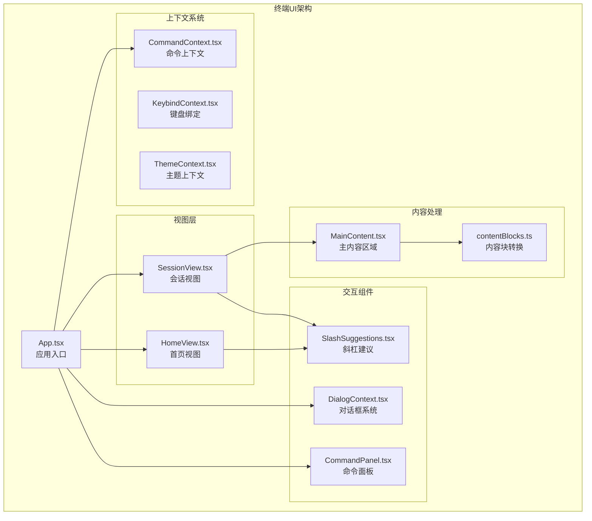
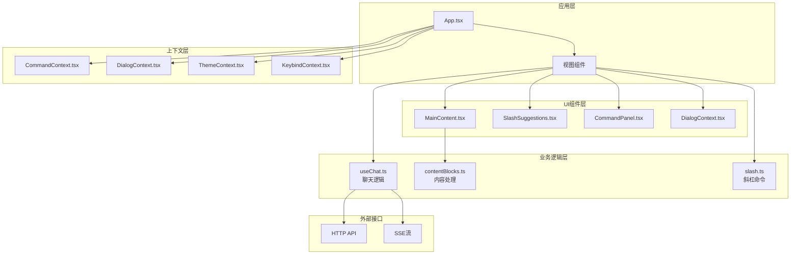
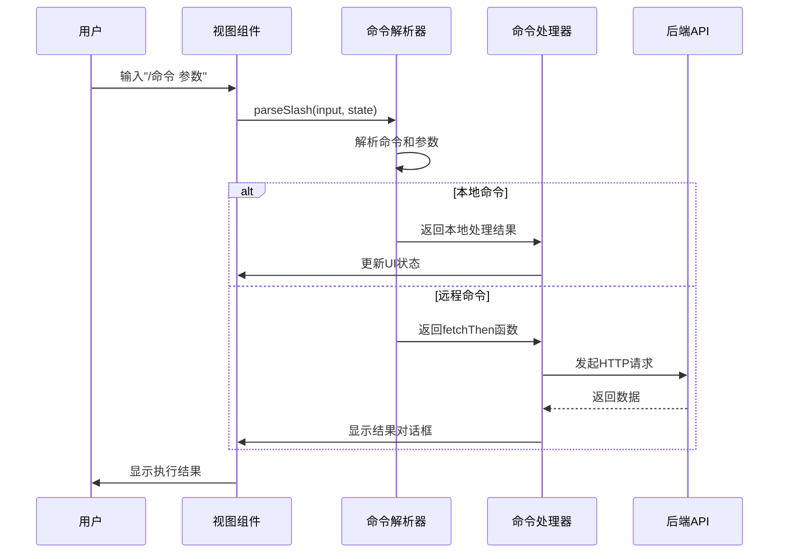
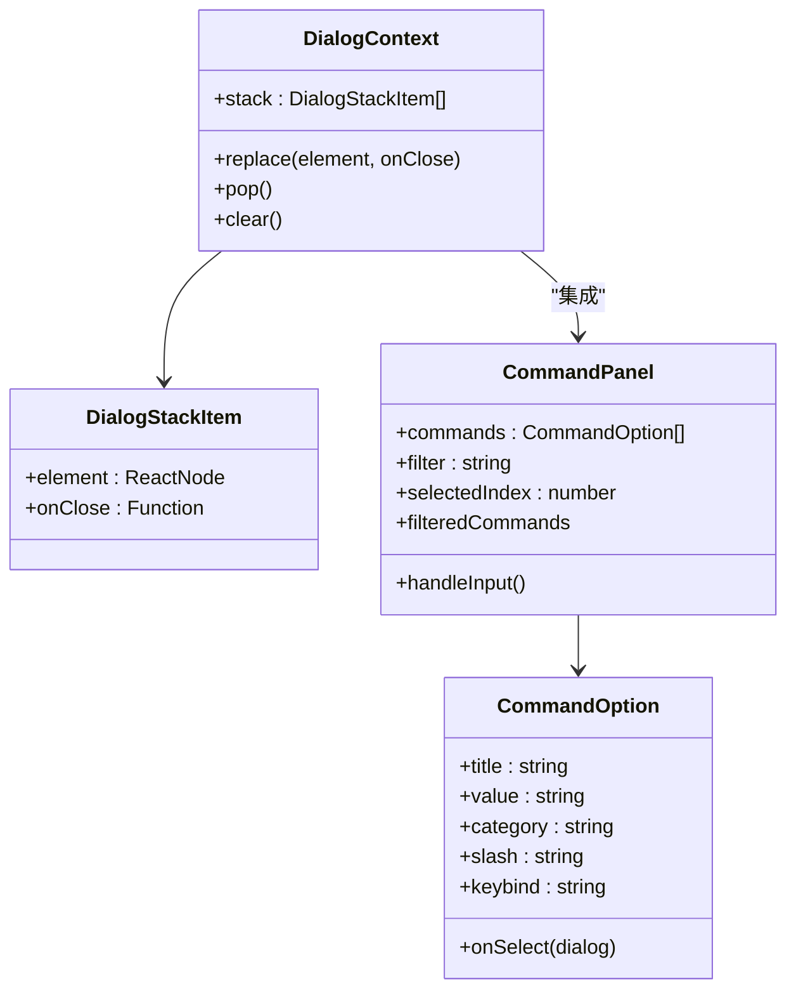
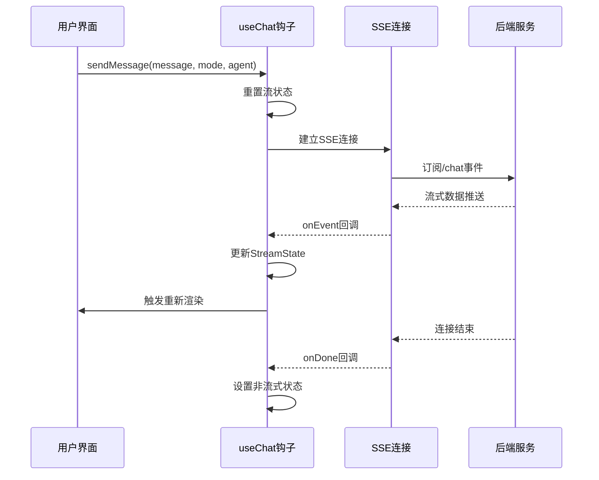

# 终端用户界面增强功能

<cite>
**本文档引用的文件**
- [App.tsx](file://terminal-ui/src/App.tsx)
- [MainContent.tsx](file://terminal-ui/src/MainContent.tsx)
- [HomeView.tsx](file://terminal-ui/src/views/HomeView.tsx)
- [SessionView.tsx](file://terminal-ui/src/views/SessionView.tsx)
- [contentBlocks.ts](file://terminal-ui/src/contentBlocks.ts)
- [slash.ts](file://terminal-ui/src/slash.ts)
- [CommandContext.tsx](file://terminal-ui/src/contexts/CommandContext.tsx)
- [DialogContext.tsx](file://terminal-ui/src/contexts/DialogContext.tsx)
- [CommandPanel.tsx](file://terminal-ui/src/components/CommandPanel.tsx)
- [SlashSuggestions.tsx](file://terminal-ui/src/components/SlashSuggestions.tsx)
- [useChat.ts](file://terminal-ui/src/useChat.ts)
- [index.tsx](file://terminal-ui/src/contexts/index.tsx)
- [package.json](file://terminal-ui/package.json)
</cite>

## 目录
1. [简介](#简介)
2. [项目结构](#项目结构)
3. [核心组件](#核心组件)
4. [架构概览](#架构概览)
5. [详细组件分析](#详细组件分析)
6. [依赖关系分析](#依赖关系分析)
7. [性能考虑](#性能考虑)
8. [故障排除指南](#故障排除指南)
9. [结论](#结论)

## 简介

终端用户界面增强功能是Secbot项目中一个重要的前端组件，基于React和Ink框架构建，为安全测试和渗透测试提供了一个现代化的终端用户界面。该界面通过HTTP和SSE与Python后端进行通信，支持实时流式响应和丰富的交互功能。

该项目的核心目标是提供一个高效、直观的终端界面，让用户能够通过自然语言与AI驱动的安全工具进行交互，同时保持对底层复杂性的屏蔽。界面设计遵循了现代终端应用的最佳实践，包括响应式布局、键盘快捷键支持、对话框系统和命令面板等功能。

## 项目结构

终端用户界面位于`terminal-ui`目录中，采用模块化的设计原则，主要包含以下核心层次：



**图表来源**
- [App.tsx:1-212](file://terminal-ui/src/App.tsx#L1-L212)
- [HomeView.tsx:1-200](file://terminal-ui/src/views/HomeView.tsx#L1-L200)
- [SessionView.tsx:1-478](file://terminal-ui/src/views/SessionView.tsx#L1-L478)

**章节来源**
- [package.json:1-35](file://terminal-ui/package.json#L1-L35)
- [index.tsx:1-63](file://terminal-ui/src/contexts/index.tsx#L1-L63)

## 核心组件

### 应用入口组件

App.tsx作为整个终端UI的应用入口，负责协调各个子组件的生命周期和状态管理。该组件实现了响应式布局，能够根据终端窗口大小动态调整界面元素。

关键特性包括：
- 动态窗口尺寸检测和响应
- 全局事件监听和处理
- 对话框系统的集成
- 命令注册和执行机制

### 主内容渲染器

MainContent.tsx负责将流式数据转换为用户友好的块状内容，实现了复杂的虚拟滚动和性能优化策略。

主要功能：
- 实时流式内容渲染
- 虚拟滚动和可见区域裁剪
- 内容块的智能折叠和展开
- 性能优化的批处理判别器

### 视图系统

HomeView和SessionView分别处理不同的用户场景：
- **首页视图**：提供欢迎界面、ASCII艺术标题、输入框和快捷建议
- **会话视图**：完整的聊天界面，包含消息历史、实时流式响应和交互控制

**章节来源**
- [App.tsx:26-212](file://terminal-ui/src/App.tsx#L26-L212)
- [MainContent.tsx:53-232](file://terminal-ui/src/MainContent.tsx#L53-L232)
- [HomeView.tsx:30-200](file://terminal-ui/src/views/HomeView.tsx#L30-L200)
- [SessionView.tsx:59-478](file://terminal-ui/src/views/SessionView.tsx#L59-L478)

## 架构概览

终端UI采用分层架构设计，通过上下文系统实现组件间的解耦和通信：



**图表来源**
- [useChat.ts:36-224](file://terminal-ui/src/useChat.ts#L36-L224)
- [contentBlocks.ts:43-177](file://terminal-ui/src/contentBlocks.ts#L43-L177)
- [slash.ts:42-165](file://terminal-ui/src/slash.ts#L42-L165)

## 详细组件分析

### 内容块渲染系统

contentBlocks.ts实现了将流式状态转换为可渲染块的复杂逻辑，支持多种内容类型的智能识别和格式化。

```mermaid
flowchart TD
Start[接收StreamState] --> CheckAPI{是否有API输出?}
CheckAPI --> |是| AddAPI[添加API块]
CheckAPI --> |否| CheckPhase{是否有阶段信息?}
AddAPI --> CheckPhase
CheckPhase --> |是| AddPhase[添加阶段块]
CheckPhase --> |否| CheckError{是否有错误?}
AddPhase --> CheckError
CheckError --> |是| AddError[添加错误块]
CheckError --> |否| CheckPlanning{是否有规划?}
AddError --> CheckPlanning
CheckPlanning --> |是| AddPlanning[添加规划块]
CheckPlanning --> |否| CheckThought{是否有思考?}
AddPlanning --> CheckThought
CheckThought --> |是| AddThought[添加思考块]
CheckThought --> |否| CheckActions{是否有动作?}
AddThought --> CheckActions
CheckActions --> |是| FilterActions[过滤瞬时工具]
CheckActions --> |否| CheckContent{是否有内容?}
FilterActions --> AddActions[添加执行块]
AddActions --> CheckContent
CheckContent --> |是| AddContent[添加内容块]
CheckContent --> |否| CheckResponse{是否有回复?}
AddContent --> CheckResponse
CheckResponse --> |是| AddResponse[添加回复块]
CheckResponse --> |否| End[渲染完成]
AddResponse --> End
```



**图表来源**
- [contentBlocks.ts:43-177](file://terminal-ui/src/contentBlocks.ts#L43-L177)

该系统的关键特性包括：
- **智能折叠机制**：超过阈值的长内容自动折叠，支持用户展开查看
- **瞬时工具处理**：自动识别并处理不需要持续显示的工具结果
- **性能优化**：使用批处理判别器池提高渲染效率
- **内容截断**：防止过多输出导致界面卡顿

**章节来源**
- [contentBlocks.ts:14-177](file://terminal-ui/src/contentBlocks.ts#L14-L177)

### 斜杠命令系统

slash.ts提供了完整的斜杠命令解析和执行机制，支持本地模式切换和远程API调用。



**图表来源**
- [slash.ts:42-165](file://terminal-ui/src/slash.ts#L42-L165)
- [SessionView.tsx:318-394](file://terminal-ui/src/views/SessionView.tsx#L318-L394)

支持的命令类型：
- **模式切换命令**：/ask（问答模式）、/task（任务模式）
- **智能体切换**：/agent（切换AI助手）
- **信息查询命令**：/help（帮助信息）、/list-agents（智能体列表）、/tools（工具列表）
- **配置查看**：/model（模型配置）

**章节来源**
- [slash.ts:74-165](file://terminal-ui/src/slash.ts#L74-L165)
- [SessionView.tsx:329-386](file://terminal-ui/src/views/SessionView.tsx#L329-L386)

### 对话框和命令面板系统

DialogContext.tsx和CommandPanel.tsx共同构成了强大的交互式对话框系统。



**图表来源**
- [DialogContext.tsx:3-63](file://terminal-ui/src/contexts/DialogContext.tsx#L3-L63)
- [CommandPanel.tsx:11-92](file://terminal-ui/src/components/CommandPanel.tsx#L11-L92)

**章节来源**
- [DialogContext.tsx:19-63](file://terminal-ui/src/contexts/DialogContext.tsx#L19-L63)
- [CommandPanel.tsx:21-92](file://terminal-ui/src/components/CommandPanel.tsx#L21-L92)

### 聊天和流式处理

useChat.ts实现了完整的聊天功能，包括SSE连接管理和流式数据处理。



**图表来源**
- [useChat.ts:67-201](file://terminal-ui/src/useChat.ts#L67-L201)

**章节来源**
- [useChat.ts:36-224](file://terminal-ui/src/useChat.ts#L36-L224)

## 依赖关系分析

终端UI的依赖关系体现了清晰的模块化设计：

```mermaid
graph TB
subgraph "核心依赖"
React[React 18.2.0]
Ink[Ink 4.4.1]
Fuzzy[fuzzysort 3.0.0]
end
subgraph "开发依赖"
Typescript[TypeScript 5.3.0]
TSX[TSX 4.7.0]
NodeTypes[@types/node 20.10.0]
ReactTypes[@types/react 18.2.0]
end
subgraph "应用特定"
Figlet[figlet 1.10.0]
Markdown[ink-markdown 1.0.4]
TextInput[ink-text-input 5.0.1]
end
App --> React
App --> Ink
CommandPanel --> Fuzzy
HomeView --> Figlet
MainContent --> Markdown
SessionView --> TextInput
```

**图表来源**
- [package.json:17-34](file://terminal-ui/package.json#L17-L34)

**章节来源**
- [package.json:1-35](file://terminal-ui/package.json#L1-L35)

## 性能考虑

终端UI在设计时充分考虑了性能优化，特别是在处理大量流式数据时的效率问题：

### 虚拟滚动优化
- **可见区域裁剪**：只渲染当前可见的块，避免不必要的DOM操作
- **行偏移计算**：精确计算每个块的行位置，确保滚动精度
- **滚动条算法**：使用单字符ASCII实现高效的滚动条渲染

### 渲染性能优化
- **批处理判别器**：使用3个判别器池并行处理内容块，提高渲染速度
- **记忆化计算**：使用useMemo避免重复的昂贵计算
- **条件渲染**：根据内容状态决定是否渲染特定组件

### 内存管理
- **流状态重置**：每次新消息开始前重置流状态，防止内存泄漏
- **引用优化**：使用ref存储关键状态，减少不必要的重新渲染

## 故障排除指南

### 常见问题和解决方案

**连接问题**
- **症状**：无法连接到后端服务
- **原因**：SECBOT_API_URL配置错误或服务未启动
- **解决**：检查环境变量配置，确认后端服务正常运行

**渲染异常**
- **症状**：界面显示混乱或内容重叠
- **原因**：终端窗口尺寸变化或内容块计算错误
- **解决**：调整终端窗口大小，检查内容块的行计数计算

**命令执行失败**
- **症状**：斜杠命令无响应或报错
- **原因**：命令未正确注册或参数解析错误
- **解决**：检查命令注册流程，验证命令参数格式

**章节来源**
- [contentBlocks.ts:28-41](file://terminal-ui/src/contentBlocks.ts#L28-L41)
- [MainContent.tsx:168-185](file://terminal-ui/src/MainContent.tsx#L168-L185)

## 结论

终端用户界面增强功能展现了现代终端应用开发的最佳实践，通过精心设计的架构和优化的性能策略，为用户提供了一个高效、直观的交互体验。

该系统的主要优势包括：
- **模块化设计**：清晰的组件分离和职责划分
- **性能优化**：虚拟滚动、批处理和记忆化等多重优化策略
- **用户体验**：丰富的交互功能和直观的操作流程
- **扩展性**：灵活的上下文系统和插件化的命令机制

未来可以进一步改进的方向包括：
- 增强错误处理和恢复机制
- 添加更多的自定义配置选项
- 优化移动端兼容性
- 扩展主题系统和视觉定制能力