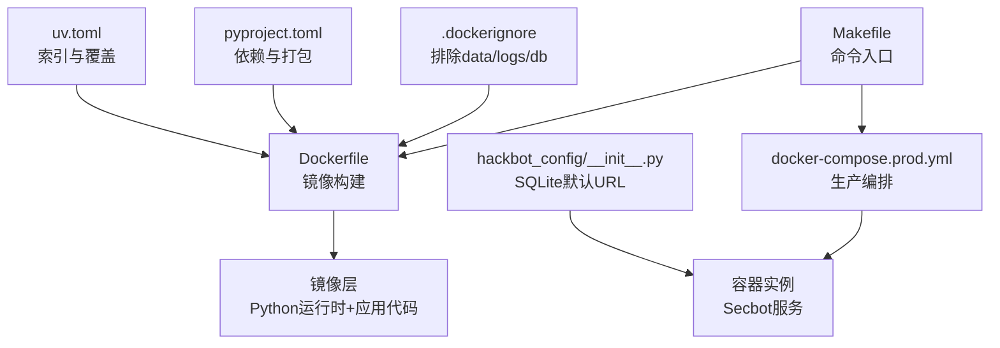
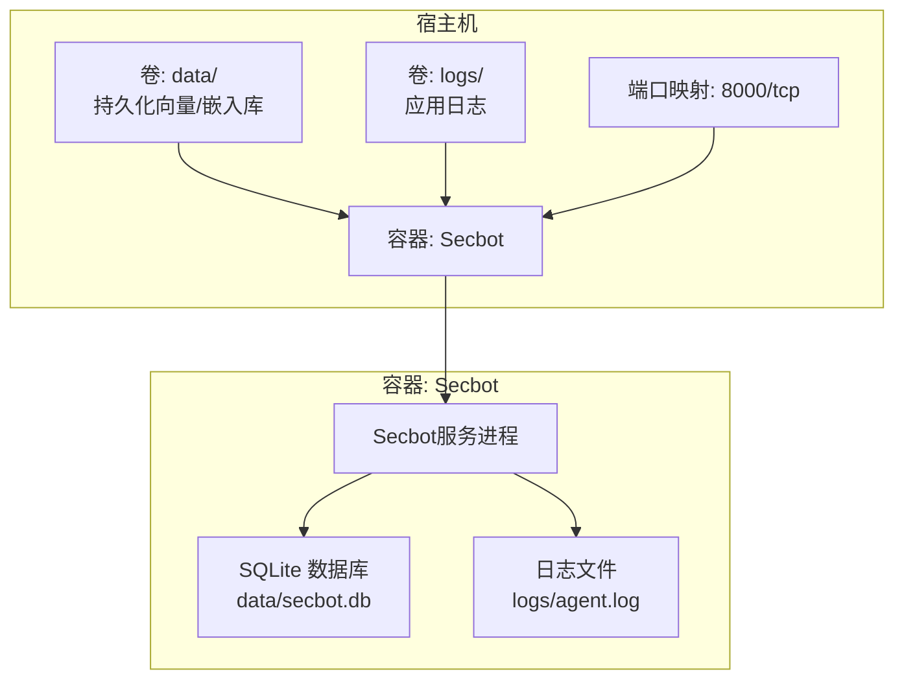
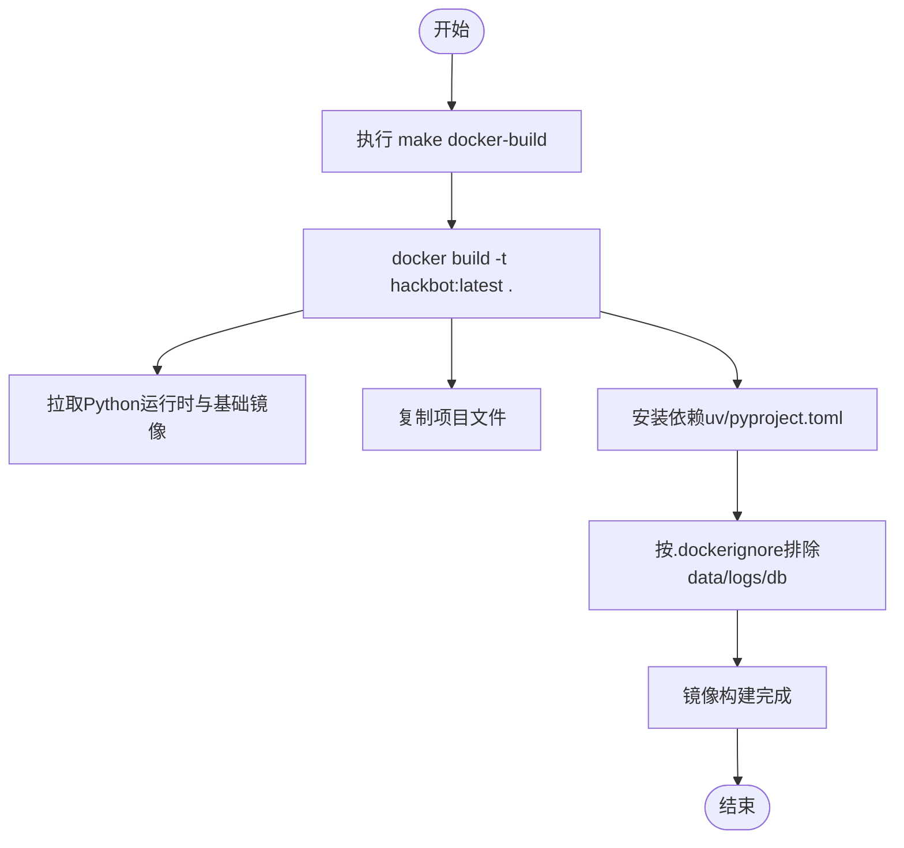
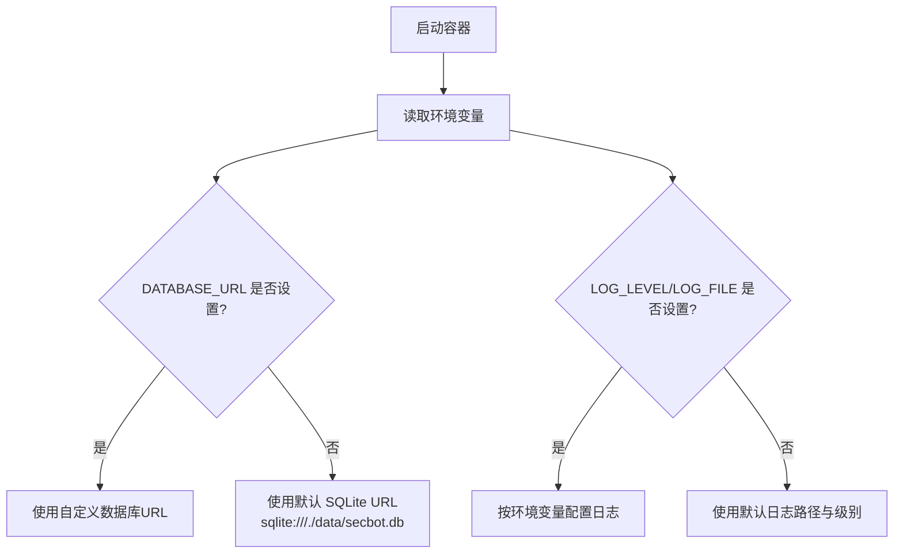
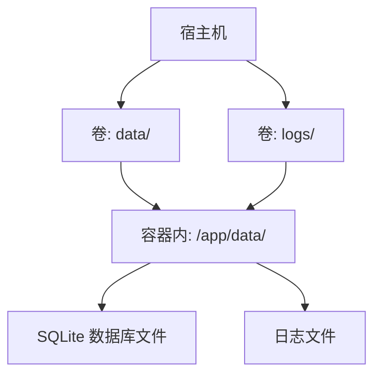
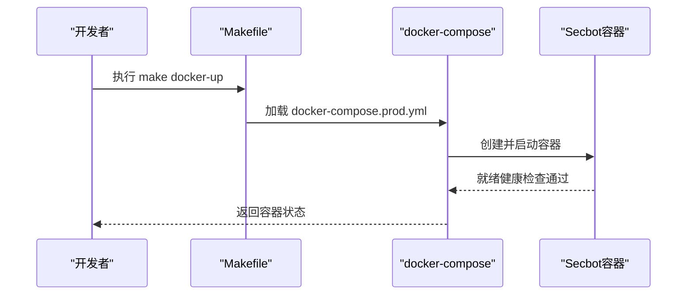
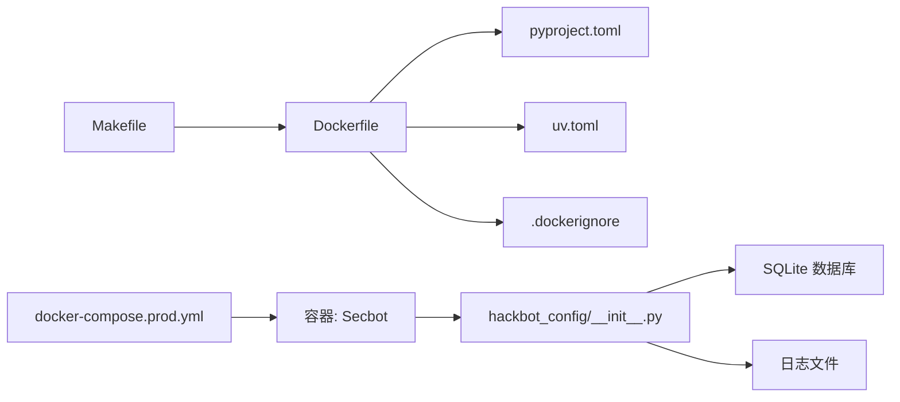

# Docker容器化部署

<cite>
**本文引用的文件**
- [.dockerignore](file://.dockerignore)
- [Makefile](file://Makefile)
- [pyproject.toml](file://pyproject.toml)
- [uv.toml](file://uv.toml)
- [docs/DOCKER_SETUP.md](file://docs/DOCKER_SETUP.md)
- [hackbot_config/__init__.py](file://hackbot_config/__init__.py)
- [.github/workflows/release.yml](file://.github/workflows/release.yml)
- [.gitignore](file://.gitignore)
- [tools/cloud/container_info_tool.py](file://tools/cloud/container_info_tool.py)
</cite>

## 目录
1. [简介](#简介)
2. [项目结构](#项目结构)
3. [核心组件](#核心组件)
4. [架构总览](#架构总览)
5. [详细组件分析](#详细组件分析)
6. [依赖关系分析](#依赖关系分析)
7. [性能考虑](#性能考虑)
8. [故障排除指南](#故障排除指南)
9. [结论](#结论)
10. [附录](#附录)

## 简介
本文件面向Secbot项目的Docker容器化部署，系统性阐述容器化策略、架构决策与实施细节。重点说明为何采用SQLite而非外部数据库服务，如何通过Dockerfile与docker-compose实现镜像构建与编排，以及环境变量、数据卷挂载与持久化存储方案。同时提供容器启动、网络与端口映射、健康检查、容器间通信与服务发现、监控与日志、故障排除与生产最佳实践。

## 项目结构
围绕Docker部署的关键文件与目录如下：
- 构建与编排
  - Makefile：提供docker-build、docker-up、docker-down等常用命令
  - docker-compose.prod.yml：生产环境编排（由make docker-up引用）
- 镜像与打包
  - Dockerfile：镜像构建定义（由make docker-build调用）
  - pyproject.toml：项目元数据、依赖与打包配置
  - uv.toml：依赖索引与覆盖项
- 运行时与持久化
  - .dockerignore：排除规则，确保data/、logs/与数据库文件不被打包进镜像
  - .gitignore：补充忽略规则（含data/、logs/）
  - hackbot_config/__init__.py：数据库URL默认值为SQLite，日志路径与环境变量读取
- 文档与策略
  - docs/DOCKER_SETUP.md：明确“仅使用SQLite”的部署策略与compose历史保留说明

图表来源
- [Makefile](file://Makefile#L1-L43)
- [pyproject.toml](file://pyproject.toml#L1-L165)
- [uv.toml](file://uv.toml#L1-L7)
- [.dockerignore](file://.dockerignore#L1-L94)
- [hackbot_config/__init__.py](file://hackbot_config/__init__.py#L223-L226)

章节来源
- [Makefile](file://Makefile#L1-L43)
- [pyproject.toml](file://pyproject.toml#L1-L165)
- [uv.toml](file://uv.toml#L1-L7)
- [.dockerignore](file://.dockerignore#L1-L94)
- [.gitignore](file://.gitignore#L58-L60)
- [hackbot_config/__init__.py](file://hackbot_config/__init__.py#L223-L226)
- [docs/DOCKER_SETUP.md](file://docs/DOCKER_SETUP.md#L1-L14)

## 核心组件
- 镜像构建与打包
  - 使用Makefile统一入口，docker build生成镜像；pyproject.toml定义依赖与打包行为；uv.toml控制索引与依赖覆盖
- 生产编排
  - docker-compose.prod.yml负责容器启动、网络、端口映射与卷挂载
- 运行时配置
  - hackbot_config/__init__.py从环境变量读取数据库URL、日志路径等，SQLite默认路径位于data/secbot.db
- 持久化与忽略
  - .dockerignore与.gitignore共同确保data/、logs/与数据库文件不被打包进镜像，避免污染镜像层

章节来源
- [Makefile](file://Makefile#L30-L37)
- [pyproject.toml](file://pyproject.toml#L29-L69)
- [uv.toml](file://uv.toml#L1-L7)
- [hackbot_config/__init__.py](file://hackbot_config/__init__.py#L223-L229)
- [.dockerignore](file://.dockerignore#L44-L56)
- [.gitignore](file://.gitignore#L58-L60)

## 架构总览
Secbot容器化采用单容器部署策略，核心服务运行在单一容器内，数据库使用SQLite，避免外部依赖。数据与日志通过卷挂载持久化至宿主机，便于备份与跨版本升级。

图表来源
- [hackbot_config/__init__.py](file://hackbot_config/__init__.py#L223-L229)
- [.dockerignore](file://.dockerignore#L44-L56)

## 详细组件分析

### 容器构建流程
- 构建入口
  - make docker-build调用docker build -t hackbot:latest .
- 依赖与打包
  - pyproject.toml声明依赖与打包后端；uv.toml设置索引与覆盖项
- 镜像层优化
  - .dockerignore排除data/、logs/与数据库文件，减少镜像体积与构建时间

图表来源
- [Makefile](file://Makefile#L30-L31)
- [pyproject.toml](file://pyproject.toml#L1-L165)
- [uv.toml](file://uv.toml#L1-L7)
- [.dockerignore](file://.dockerignore#L44-L56)

章节来源
- [Makefile](file://Makefile#L30-L31)
- [pyproject.toml](file://pyproject.toml#L1-L165)
- [uv.toml](file://uv.toml#L1-L7)
- [.dockerignore](file://.dockerignore#L44-L56)

### 环境变量与配置
- 数据库URL
  - 默认值为sqlite:///./data/secbot.db，可通过环境变量覆盖
- 日志配置
  - 日志级别与日志文件路径均可通过环境变量配置
- 其他外部API密钥
  - 支持从环境变量或系统密钥环读取（如Shodan、VirusTotal）

图表来源
- [hackbot_config/__init__.py](file://hackbot_config/__init__.py#L223-L229)

章节来源
- [hackbot_config/__init__.py](file://hackbot_config/__init__.py#L223-L229)

### 数据卷挂载与持久化
- data/目录
  - 存放SQLite数据库文件与向量/嵌入库等数据，需挂载为持久卷
- logs/目录
  - 存放应用日志，建议挂载为持久卷以便审计与排障
- .dockerignore与.gitignore
  - 明确排除data/、logs/与数据库文件，避免打包进镜像

图表来源
- [.dockerignore](file://.dockerignore#L44-L56)
- [.gitignore](file://.gitignore#L58-L60)
- [hackbot_config/__init__.py](file://hackbot_config/__init__.py#L223-L229)

章节来源
- [.dockerignore](file://.dockerignore#L44-L56)
- [.gitignore](file://.gitignore#L58-L60)
- [hackbot_config/__init__.py](file://hackbot_config/__init__.py#L223-L229)

### 容器启动与编排
- 启动命令
  - make docker-up使用docker-compose -f docker-compose.prod.yml up -d
- 停止命令
  - make docker-down使用docker-compose -f docker-compose.prod.yml down
- 端口映射
  - 通过compose文件暴露服务端口（如8000/tcp），具体映射以实际compose为准
- 健康检查
  - 建议在compose中添加健康检查探针，探测服务就绪状态

图表来源
- [Makefile](file://Makefile#L33-L37)

章节来源
- [Makefile](file://Makefile#L33-L37)

### 为什么选择SQLite而非外部数据库服务
- 简化部署
  - 无需额外启动Redis、ChromaDB或其他外部服务，降低运维复杂度
- 单文件数据库
  - SQLite文件便于备份、迁移与版本管理
- 适合Secbot场景
  - 项目文档明确“仅使用SQLite作为数据库”，日常部署无需额外服务

章节来源
- [docs/DOCKER_SETUP.md](file://docs/DOCKER_SETUP.md#L3-L6)

### 容器间通信、服务发现与负载均衡
- 单容器架构
  - Secbot服务与数据库在同一容器内，无跨容器通信需求
- 服务发现
  - 由于无外部服务依赖，无需Kubernetes服务或DNS服务发现
- 负载均衡
  - 无外部服务与多实例场景，无需LB策略

章节来源
- [docs/DOCKER_SETUP.md](file://docs/DOCKER_SETUP.md#L3-L6)

### 监控、日志收集与故障排除
- 日志
  - 日志文件位于logs/目录，建议挂载为持久卷；日志级别与文件路径可通过环境变量调整
- 容器安全扫描
  - 可使用工具检测容器是否挂载Docker socket、是否以特权模式运行、是否挂载宿主机根目录等风险
- 常见问题
  - 权限不足：确认data/与logs/目录权限与用户映射正确
  - 端口冲突：检查宿主机端口占用情况
  - 数据库文件损坏：通过备份恢复或重建SQLite文件

章节来源
- [hackbot_config/__init__.py](file://hackbot_config/__init__.py#L228-L229)
- [tools/cloud/container_info_tool.py](file://tools/cloud/container_info_tool.py#L184-L221)

## 依赖关系分析
- 构建链路
  - Makefile → Dockerfile → pyproject.toml/uv.toml → 依赖安装 → 镜像构建
- 运行链路
  - docker-compose → 容器启动 → 读取环境变量 → 初始化SQLite与日志 → 启动服务

图表来源
- [Makefile](file://Makefile#L30-L37)
- [pyproject.toml](file://pyproject.toml#L1-L165)
- [uv.toml](file://uv.toml#L1-L7)
- [.dockerignore](file://.dockerignore#L44-L56)
- [hackbot_config/__init__.py](file://hackbot_config/__init__.py#L223-L229)

章节来源
- [Makefile](file://Makefile#L30-L37)
- [pyproject.toml](file://pyproject.toml#L1-L165)
- [uv.toml](file://uv.toml#L1-L7)
- [.dockerignore](file://.dockerignore#L44-L56)
- [hackbot_config/__init__.py](file://hackbot_config/__init__.py#L223-L229)

## 性能考虑
- 镜像大小与构建速度
  - 通过.dockerignore排除不必要的文件，减少镜像体积与构建时间
- I/O性能
  - 将data/与logs/挂载为高性能持久卷，避免容器内临时文件影响I/O
- 运行时资源
  - 合理设置容器CPU与内存限制，避免与其他服务争抢资源

## 故障排除指南
- 容器无法启动
  - 检查日志卷挂载与权限；确认端口未被占用
- 数据库异常
  - 检查data/secbot.db是否存在与可写；必要时重建数据库文件
- 环境变量未生效
  - 确认.env文件与环境变量名一致；重启容器使变更生效
- 容器安全风险
  - 使用容器检测工具检查是否挂载Docker socket、是否以特权模式运行、是否挂载宿主机根目录等

章节来源
- [tools/cloud/container_info_tool.py](file://tools/cloud/container_info_tool.py#L184-L221)

## 结论
Secbot采用“单容器+SQLite”策略，简化了部署与运维复杂度，适合中小规模与开发测试场景。通过合理的数据卷挂载、环境变量配置与安全加固，可在生产环境中稳定运行。未来如需扩展，可评估引入外部缓存或数据库，但需同步调整compose与配置。

## 附录
- 多平台构建参考
  - 项目提供GitHub Actions工作流，展示多平台可执行程序构建与发布流程，可作为容器镜像CI/CD的参考模板

章节来源
- [.github/workflows/release.yml](file://.github/workflows/release.yml#L17-L29)