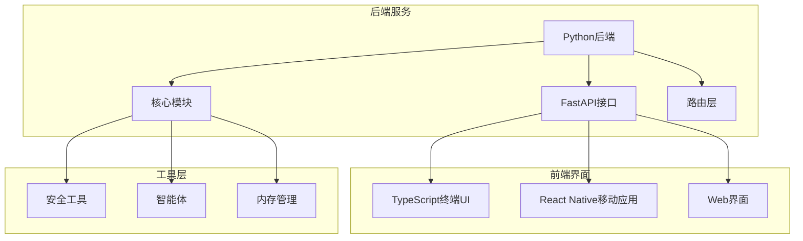
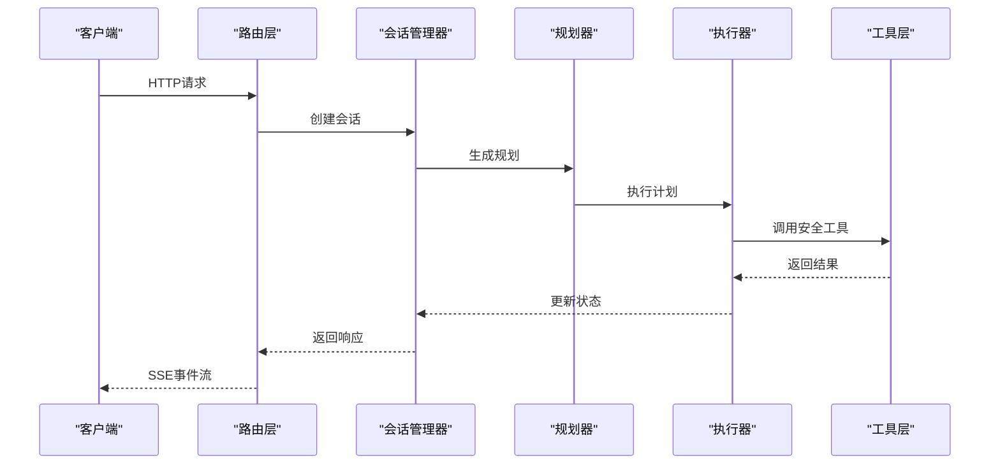

# 开发环境配置

<cite>
**本文档引用的文件**
- [README_EN.md](file://README_EN.md)
- [README_CN.md](file://README_CN.md)
- [pyproject.toml](file://pyproject.toml)
- [uv.toml](file://uv.toml)
- [uv.lock](file://uv.lock)
- [Makefile](file://Makefile)
- [app/package.json](file://app/package.json)
- [terminal-ui/package.json](file://terminal-ui/package.json)
- [docs/VIRTUAL_TEST_ENVIRONMENT.md](file://docs/VIRTUAL_TEST_ENVIRONMENT.md)
- [docs/NODE_SETUP.md](file://docs/NODE_SETUP.md)
- [docs/OLLAMA_SETUP.md](file://docs/OLLAMA_SETUP.md)
- [docs/SQLITE_SETUP.md](file://docs/SQLITE_SETUP.md)
- [scripts/start-ts-tui.ps1](file://scripts/start-ts-tui.ps1)
- [scripts/start-ts-tui.sh](file://scripts/start-ts-tui.sh)
- [scripts/build_release.sh](file://scripts/build_release.sh)
- [scripts/build_release.bat](file://scripts/build_release.bat)
</cite>

## 目录
1. [简介](#简介)
2. [项目结构](#项目结构)
3. [核心组件](#核心组件)
4. [架构概览](#架构概览)
5. [详细组件分析](#详细组件分析)
6. [依赖分析](#依赖分析)
7. [性能考虑](#性能考虑)
8. [故障排除指南](#故障排除指南)
9. [结论](#结论)
10. [附录](#附录)

## 简介

Secbot是一个基于AI的自动化渗透测试机器人项目，采用Python后端配合TypeScript前端的技术栈。本文档提供了完整的开发环境配置指南，涵盖Python虚拟环境配置、Node.js环境设置、依赖管理工具（uv）的使用、虚拟测试环境配置、开发工具链配置以及环境变量管理。

该项目支持多种运行模式：
- 传统Python交互模式
- TypeScript终端界面（推荐）
- 移动应用界面
- Docker容器化部署

## 项目结构

项目采用模块化的双栈架构设计：



**图表来源**
- [README_EN.md](file://README_EN.md#L75-L152)
- [pyproject.toml](file://pyproject.toml#L105-L147)

**章节来源**
- [README_EN.md](file://README_EN.md#L1-L379)
- [pyproject.toml](file://pyproject.toml#L1-L165)

## 核心组件

### Python后端核心组件

项目的核心Python组件包括：

1. **智能体系统**：多代理协作架构，支持ReAct、Plan-Execute等多种模式
2. **路由系统**：FastAPI路由处理HTTP请求和SSE事件流
3. **工具层**：集成多种安全工具，包括网络扫描、漏洞检测、渗透测试等
4. **内存管理**：基于SQLite的持久化存储系统
5. **会话管理**：支持多轮对话和状态保持

### 前端界面组件

1. **TypeScript终端UI**：基于Ink和React的终端界面
2. **React Native移动应用**：跨平台移动客户端
3. **Web界面**：基于React的Web客户端

**章节来源**
- [README_EN.md](file://README_EN.md#L67-L152)
- [terminal-ui/package.json](file://terminal-ui/package.json#L1-L35)

## 架构概览



**图表来源**
- [README_EN.md](file://README_EN.md#L155-L196)

## 详细组件分析

### Python虚拟环境配置

#### uv依赖管理工具

项目使用uv作为主要的Python包管理工具，具有以下优势：
- 超快的依赖解析和安装速度
- 支持lock文件锁定精确版本
- 多平台兼容性
- 与pip兼容的安装方式

**安装步骤**：
```bash
# 安装uv
curl -LsSf https://astral.sh/uv/install.sh | sh

# 同步依赖
uv sync

# 安装开发依赖
uv pip install -e ".[dev]"
```

**章节来源**
- [README_EN.md](file://README_EN.md#L219-L241)
- [pyproject.toml](file://pyproject.toml#L71-L78)
- [uv.toml](file://uv.toml#L1-L7)

#### Python版本要求

项目要求Python 3.10+，支持多个Python版本：
- Python 3.10
- Python 3.11  
- Python 3.12

**章节来源**
- [pyproject.toml](file://pyproject.toml#L10-L27)

### Node.js环境设置

#### TypeScript终端UI配置

TypeScript终端UI使用以下关键技术栈：
- Ink：React的终端UI渲染库
- React：用户界面组件
- Fuzzysort：模糊搜索算法
- Figlet：ASCII艺术字体

**Node.js版本要求**：>= 18

**安装步骤**：
```bash
# 进入terminal-ui目录
cd terminal-ui

# 安装依赖
npm install

# 启动开发服务器
npm run dev
```

**章节来源**
- [terminal-ui/package.json](file://terminal-ui/package.json#L1-L35)
- [docs/NODE_SETUP.md](file://docs/NODE_SETUP.md#L1-L46)

#### React Native移动应用配置

移动应用使用Expo框架：
- Expo：跨平台移动开发框架
- React Navigation：导航系统
- React Native：原生组件

**章节来源**
- [app/package.json](file://app/package.json#L1-L34)

### 虚拟测试环境配置

#### VMware虚拟机设置

推荐使用VMware进行安全测试环境搭建：

**网络配置选项**：
- **NAT模式**：虚拟机通过宿主机共享网络
- **仅主机模式**：虚拟机与宿主机组成独立网段
- **桥接模式**：虚拟机与物理网络同网段

**目标机配置**：
- Ubuntu 22.04 LTS
- SSH服务：`sudo apt install openssh-server`
- Web服务（可选）：Nginx或Apache

**章节来源**
- [docs/VIRTUAL_TEST_ENVIRONMENT.md](file://docs/VIRTUAL_TEST_ENVIRONMENT.md#L1-L218)

### 开发工具链配置

#### IDE设置

**PyCharm配置建议**：
- Python解释器：使用uv创建的虚拟环境
- TypeScript支持：启用TypeScript插件
- Node.js解释器：配置最新LTS版本（24.x）

**章节来源**
- [docs/NODE_SETUP.md](file://docs/NODE_SETUP.md#L8-L46)

#### 调试配置

**Python调试**：
- 使用PyCharm内置调试器
- 支持断点调试和变量监视
- 集成pytest测试运行器

**TypeScript调试**：
- VS Code或WebStorm
- tsx开发服务器
- Source Map支持

### 环境变量配置

#### Ollama模型服务配置

```env
OLLAMA_BASE_URL=http://localhost:11434
OLLAMA_MODEL=gemma3:1b
OLLAMA_EMBEDDING_MODEL=nomic-embed-text
```

#### 数据库配置

```env
DATABASE_URL=sqlite:///./data/m_bot.db
```

**章节来源**
- [docs/OLLAMA_SETUP.md](file://docs/OLLAMA_SETUP.md#L51-L68)
- [docs/SQLITE_SETUP.md](file://docs/SQLITE_SETUP.md#L17-L28)

### 热重载机制

#### TypeScript开发服务器

项目提供一键启动脚本，支持热重载：

**Windows启动脚本**：
```powershell
# 启动后端和前端
.\scripts\start-ts-tui.ps1
```

**Linux/Mac启动脚本**：
```bash
# 启动后端和前端
./scripts/start-ts-tui.sh
```

**章节来源**
- [scripts/start-ts-tui.ps1](file://scripts/start-ts-tui.ps1#L1-L10)
- [scripts/start-ts-tui.sh](file://scripts/start-ts-tui.sh#L1-L13)

## 依赖分析

### Python依赖管理

项目使用pyproject.toml进行依赖管理，包含以下类别：

**核心依赖**：
- LangChain生态系统：AI模型集成
- FastAPI：Web框架
- SQLAlchemy：数据库ORM
- Pydantic：数据验证

**开发依赖**：
- pytest：测试框架
- black：代码格式化
- flake8：代码检查
- mypy：类型检查

**章节来源**
- [pyproject.toml](file://pyproject.toml#L29-L69)
- [uv.lock](file://uv.lock#L1-L485)

### Node.js依赖管理

#### TypeScript终端UI依赖

```json
{
  "dependencies": {
    "ink": "^4.4.1",
    "react": "^18.2.0",
    "fuzzysort": "^3.0.0"
  }
}
```

#### React Native应用依赖

```json
{
  "dependencies": {
    "expo": "~54.0.33",
    "react-native": "0.81.5",
    "react-navigation": "^7.128"
  }
}
```

**章节来源**
- [terminal-ui/package.json](file://terminal-ui/package.json#L17-L24)
- [app/package.json](file://app/package.json#L11-L23)

## 性能考虑

### 依赖解析优化

uv提供以下性能优势：
- 并行依赖解析
- 缓存机制减少重复下载
- 精确版本锁定避免冲突

### 模型服务优化

**Ollama配置建议**：
- 使用GPU加速（如果可用）
- 调整上下文窗口大小
- 合理的内存分配

### 数据库性能

SQLite配置优化：
- 合理的索引设计
- 连接池管理
- 定期维护和清理

## 故障排除指南

### 常见问题解决

**Python依赖问题**：
```bash
# 清理缓存并重新安装
uv cache clean
uv sync --refresh
```

**Node.js依赖问题**：
```bash
# 清理node_modules并重新安装
rm -rf node_modules
npm install
```

**Ollama连接问题**：
```bash
# 检查服务状态
ollama serve

# 验证模型可用性
ollama list
```

**章节来源**
- [docs/OLLAMA_SETUP.md](file://docs/OLLAMA_SETUP.md#L69-L96)

### 开发流程最佳实践

1. **代码格式化**：使用Black进行Python代码格式化
2. **静态分析**：集成Flake8和Mypy进行代码质量检查
3. **测试驱动**：编写单元测试和集成测试
4. **版本控制**：遵循Git提交规范

### 代码审查流程

1. **Pull Request模板**：标准化PR描述
2. **代码审查清单**：功能正确性、安全性、性能
3. **自动化检查**：CI/CD流水线集成
4. **文档更新**：随代码变更更新文档

### 团队协作规范

1. **分支策略**：Git Flow工作流
2. **沟通渠道**：Slack/Teams即时通讯
3. **知识分享**：定期技术分享会
4. **文档维护**：持续更新开发文档

## 结论

Secbot项目提供了完整的开发环境配置方案，涵盖了现代软件开发所需的各个方面。通过使用uv进行Python依赖管理、TypeScript进行前端开发、以及完善的测试环境配置，开发者可以高效地进行Secbot的二次开发和功能扩展。

关键优势包括：
- 现代化的开发工具链
- 完善的测试环境
- 灵活的部署选项
- 丰富的安全工具集成

建议开发者根据项目需求选择合适的开发模式，并遵循文档中的最佳实践进行开发。

## 附录

### 快速开始命令

**Python环境**：
```bash
# 安装uv
curl -LsSf https://astral.sh/uv/install.sh | sh

# 同步依赖
uv sync

# 安装开发依赖
uv pip install -e ".[dev]"
```

**TypeScript开发**：
```bash
# 启动开发服务器
cd terminal-ui
npm run dev
```

**构建发布版本**：
```bash
# 构建可执行文件
./scripts/build_release.sh
```