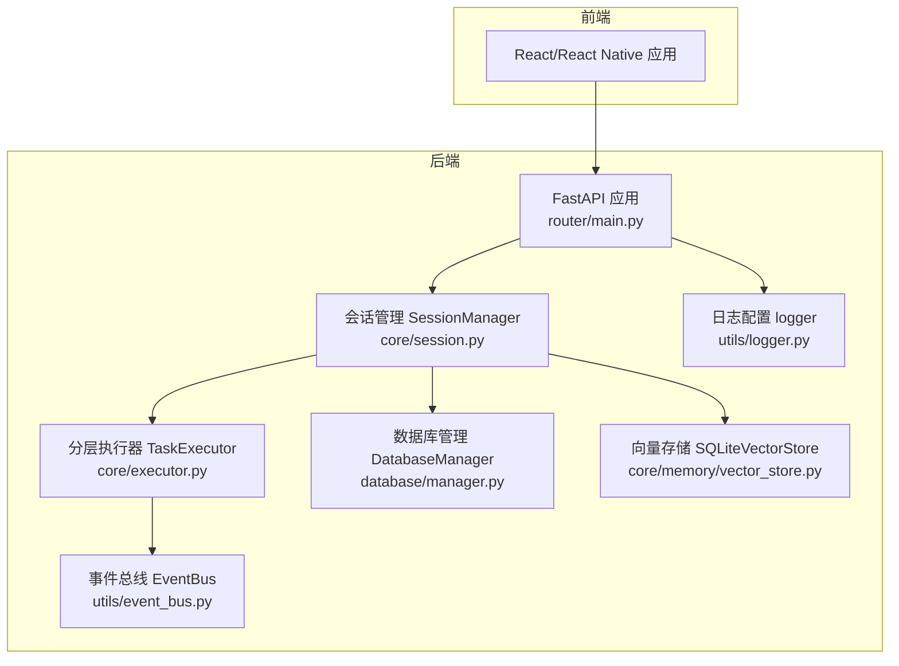
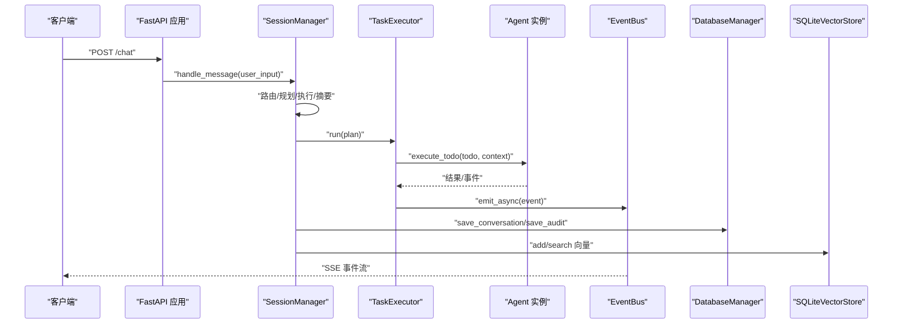
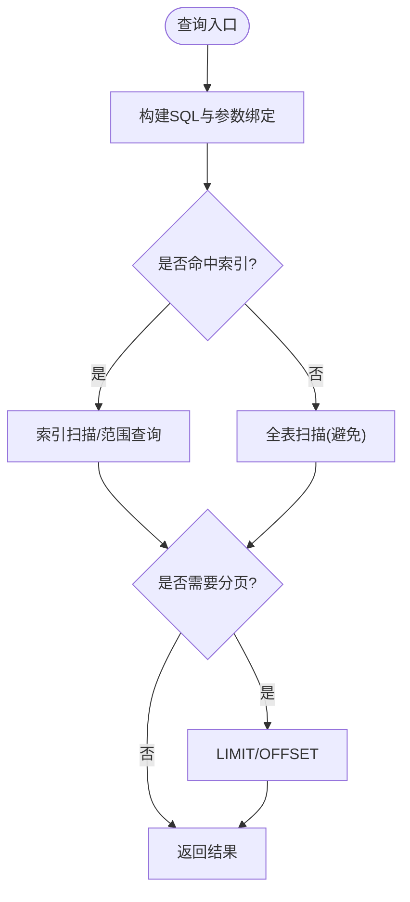
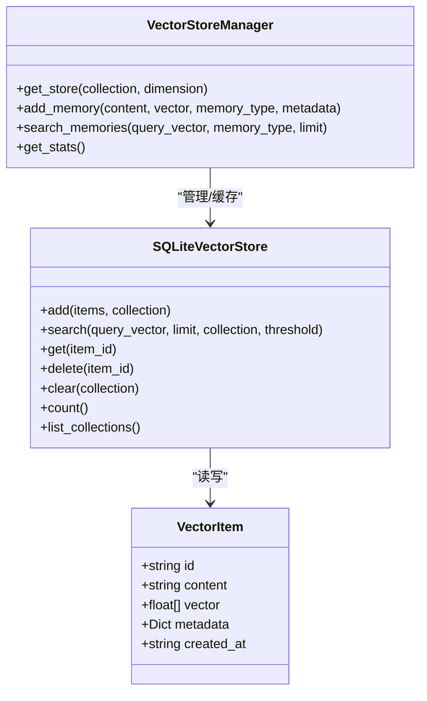
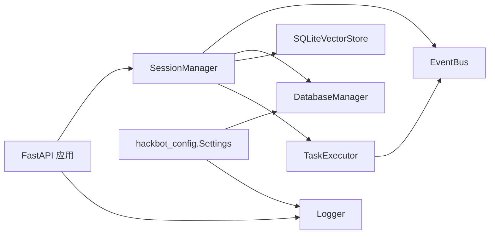

# 性能优化与监控

<cite>
**本文引用的文件**
- [core/memory/vector_store.py](file://core/memory/vector_store.py)
- [core/memory/database_memory.py](file://core/memory/database_memory.py)
- [database/manager.py](file://database/manager.py)
- [core/session.py](file://core/session.py)
- [utils/logger.py](file://utils/logger.py)
- [core/executor.py](file://core/executor.py)
- [utils/event_bus.py](file://utils/event_bus.py)
- [router/main.py](file://router/main.py)
- [hackbot_config/__init__.py](file://hackbot_config/__init__.py)
- [docs/DATABASE_GUIDE.md](file://docs/DATABASE_GUIDE.md)
- [tools/base.py](file://tools/base.py)
- [defense/defense_manager.py](file://defense/defense_manager.py)
- [hackbot/launch_tui.py](file://hackbot/launch_tui.py)
</cite>

## 目录
1. [简介](#简介)
2. [项目结构](#项目结构)
3. [核心组件](#核心组件)
4. [架构总览](#架构总览)
5. [详细组件分析](#详细组件分析)
6. [依赖分析](#依赖分析)
7. [性能考量](#性能考量)
8. [故障排查指南](#故障排查指南)
9. [结论](#结论)
10. [附录](#附录)

## 简介
本文件面向Secbot系统的性能优化与监控，聚焦以下方面：
- 数据库查询优化、索引设计与缓存策略
- 内存管理优化（向量存储、会话内存与垃圾回收）
- 并发控制与线程池配置（异步任务、队列与资源竞争规避）
- 系统监控指标与方案（性能采集、告警与可视化）
- 日志分析与性能分析工具（慢查询、内存泄漏、CPU优化）
- 负载测试与容量规划
- 生产环境最佳实践与故障排除

## 项目结构
Secbot采用前后端分离与模块化设计：后端基于FastAPI提供REST+SSE接口，前端为React/React Native应用；核心业务逻辑集中在Python后端，包含会话编排、Agent执行、数据库与向量存储等模块。



图示来源
- [router/main.py](file://router/main.py#L19-L71)
- [utils/event_bus.py](file://utils/event_bus.py#L68-L187)
- [core/session.py](file://core/session.py#L32-L122)
- [core/executor.py](file://core/executor.py#L17-L179)
- [database/manager.py](file://database/manager.py#L26-L203)
- [core/memory/vector_store.py](file://core/memory/vector_store.py#L30-L237)
- [utils/logger.py](file://utils/logger.py#L10-L31)

章节来源
- [router/main.py](file://router/main.py#L19-L71)
- [utils/event_bus.py](file://utils/event_bus.py#L68-L187)
- [core/session.py](file://core/session.py#L32-L122)
- [core/executor.py](file://core/executor.py#L17-L179)
- [database/manager.py](file://database/manager.py#L26-L203)
- [core/memory/vector_store.py](file://core/memory/vector_store.py#L30-L237)
- [utils/logger.py](file://utils/logger.py#L10-L31)

## 核心组件
- 会话编排与事件总线：负责消息路由、规划、执行与摘要，通过事件总线解耦UI与Agent。
- 数据库管理：集中管理SQLite表结构、索引与常用CRUD操作。
- 向量存储：基于sqlite-vec/sqlite-vss的轻量向量检索，支持ANN与纯量计算降级。
- 日志系统：统一控制台与文件日志，支持初始化阶段静默与运行期恢复。
- 并发执行：TaskExecutor按层并行/串行执行，结合异步gather与事件推送。
- 配置中心：hackbot_config集中管理数据库URL、日志级别、模型参数等。

章节来源
- [core/session.py](file://core/session.py#L139-L422)
- [utils/event_bus.py](file://utils/event_bus.py#L68-L187)
- [database/manager.py](file://database/manager.py#L26-L203)
- [core/memory/vector_store.py](file://core/memory/vector_store.py#L30-L237)
- [utils/logger.py](file://utils/logger.py#L10-L51)
- [core/executor.py](file://core/executor.py#L17-L179)
- [hackbot_config/__init__.py](file://hackbot_config/__init__.py#L223-L246)

## 架构总览
后端通过FastAPI提供REST接口与SSE事件流，SessionManager协调Agent执行链路，TaskExecutor负责分层并发执行，EventBus在各组件间传递事件，DatabaseManager与SQLiteVectorStore分别承载结构化数据与向量检索。



图示来源
- [router/main.py](file://router/main.py#L19-L71)
- [core/session.py](file://core/session.py#L139-L422)
- [core/executor.py](file://core/executor.py#L46-L133)
- [utils/event_bus.py](file://utils/event_bus.py#L144-L181)
- [database/manager.py](file://database/manager.py#L207-L228)
- [core/memory/vector_store.py](file://core/memory/vector_store.py#L98-L175)

## 详细组件分析

### 数据库查询优化与索引设计
- 表与索引
  - conversations：按session_id与timestamp建立索引，支持会话查询与时间排序。
  - crawler_tasks：按status建立索引，支持任务状态筛选。
  - user_configs：按key建立索引，支持快速配置读取。
  - scan_results、audit_trail：按target与session_id等字段建立索引，支撑审计与扫描结果查询。
- 查询建议
  - 使用LIMIT与OFFSET进行分页，避免一次性拉取大量数据。
  - 对高频过滤条件（agent_type、session_id、status、timestamp）尽量使用索引字段。
  - 批量写入使用上下文管理器事务，减少提交次数。
- 清理策略
  - 定期清理旧对话与任务，降低表膨胀影响查询性能。



图示来源
- [database/manager.py](file://database/manager.py#L176-L201)
- [database/manager.py](file://database/manager.py#L230-L278)
- [docs/DATABASE_GUIDE.md](file://docs/DATABASE_GUIDE.md#L200-L212)

章节来源
- [database/manager.py](file://database/manager.py#L75-L203)
- [docs/DATABASE_GUIDE.md](file://docs/DATABASE_GUIDE.md#L200-L212)

### 向量存储优化与缓存策略
- 存储与检索
  - 使用sqlite-vec/sqlite-vss的ANN索引加速相似度检索；若未安装，则回退到纯量计算（逐条cosine相似度）。
  - 向量以BLOB形式存储，使用float32节省空间；提供add/search/get/delete/clear/count/list_collections等操作。
- 集合与维度
  - VectorStoreManager按集合与维度缓存SQLiteVectorStore实例，避免重复初始化。
- 缓存策略
  - 建议在应用层对热点查询结果进行LRU缓存（例如最近N条相似结果），减少重复ANN查询。
  - 对频繁使用的集合（如“短期记忆”）可常驻内存实例，降低连接与初始化成本。



图示来源
- [core/memory/vector_store.py](file://core/memory/vector_store.py#L15-L237)
- [core/memory/vector_store.py](file://core/memory/vector_store.py#L239-L297)

章节来源
- [core/memory/vector_store.py](file://core/memory/vector_store.py#L30-L237)
- [core/memory/vector_store.py](file://core/memory/vector_store.py#L239-L297)

### 内存管理优化（会话与向量）
- 会话内存
  - SessionManager维护sessions字典与current_session，消息历史在Session对象内累积；建议对长会话启用周期性快照与清理。
  - 通过事件总线推送逐步渲染，避免一次性拼接大文本导致峰值内存升高。
- 向量内存
  - 向量以float32 BLOB存储，建议在embedding生成后及时写入数据库/向量库，避免在内存中堆积。
  - 对高频相似查询结果进行短期缓存，降低重复ANN查询与向量解码开销。
- 垃圾回收
  - Python默认GC在后台运行；对大规模向量数组与临时中间结果，建议显式del与手动触发gc.collect()（谨慎使用）。

章节来源
- [core/session.py](file://core/session.py#L63-L76)
- [core/session.py](file://core/session.py#L139-L422)
- [core/memory/vector_store.py](file://core/memory/vector_store.py#L90-L96)

### 并发控制与线程池配置
- 事件循环与异步
  - EventBus支持同步与异步事件发射，异步处理器在当前事件循环中调度或等待完成。
  - TaskExecutor使用asyncio.gather并发执行同一层多个todo，完成后按原顺序推送事件，保障UI线性渲染。
- 并发锁与串行化
  - SessionManager在Agent实例定义了并发锁时，使用异步上下文确保同一Agent的多次请求串行化，避免资源竞争。
- 线程池与阻塞调用
  - 工具执行可能涉及阻塞调用，建议在独立线程池中执行（如ThreadPoolExecutor），避免阻塞事件循环。
- 资源竞争规避
  - 对共享资源（如网络扫描、文件写入）加锁或队列化，防止竞态条件。
  - 对LLM调用与外部API请求设置超时与重试，避免长时间占用协程。

```mermaid
sequenceDiagram
participant Exec as "TaskExecutor"
participant Loop as "事件循环"
participant Agent as "Agent.execute_todo"
participant Pool as "线程池"
participant Bus as "EventBus"
Exec->>Loop : "asyncio.gather(tasks)"
Loop-->>Exec : "并发结果"
Exec->>Agent : "emit_events=false(收集)"
Agent-->>Exec : "结果"
Exec->>Bus : "emit_async(action_start/action_result)"
Bus-->>Loop : "异步处理"
note over Exec,P : "同一层并行，跨层串行"
```

图示来源
- [core/executor.py](file://core/executor.py#L80-L133)
- [utils/event_bus.py](file://utils/event_bus.py#L144-L181)
- [core/session.py](file://core/session.py#L351-L396)

章节来源
- [utils/event_bus.py](file://utils/event_bus.py#L68-L187)
- [core/executor.py](file://core/executor.py#L17-L179)
- [core/session.py](file://core/session.py#L351-L396)

### 日志分析与性能分析
- 日志配置
  - 初始化阶段控制台仅输出警告及以上，运行后可通过恢复函数提升级别，文件日志始终开启并按大小轮转与压缩。
- 性能分析
  - 使用SSE事件流观察阶段耗时（规划、思考、执行、报告），结合事件迭代号定位瓶颈。
  - 对工具执行结果进行采样记录，统计成功率与平均耗时，识别慢工具。
- 慢查询与内存泄漏
  - 数据库侧：对高频查询添加LIMIT与索引；使用EXPLAIN QUERY PLAN分析执行计划。
  - 向量检索：在未安装sqlite-vec时回退纯量计算，注意相似度遍历成本。
  - 内存：关注向量数组与会话历史累积，必要时启用清理策略。

章节来源
- [utils/logger.py](file://utils/logger.py#L10-L51)
- [utils/event_bus.py](file://utils/event_bus.py#L161-L181)
- [core/memory/vector_store.py](file://core/memory/vector_store.py#L135-L175)

### 监控指标与方案
- 指标定义
  - 吞吐：QPS（每秒请求数）、并发会话数
  - 响应：P50/P95/P99延迟、错误率
  - 资源：CPU使用率、内存占用、磁盘I/O、向量库查询耗时
  - 业务：规划/执行/摘要阶段耗时、工具成功率、任务状态分布
- 告警配置
  - 延迟阈值告警、错误率突增、内存占用过高、数据库锁等待超时
- 可视化
  - 使用Prometheus+Grafana或APM平台（如New Relic/DataDog）采集SSE事件与后端指标，绘制仪表盘。

[本节为概念性内容，不直接分析具体文件]

### 负载测试与容量规划
- 方法
  - 使用Locust/JMeter模拟并发用户，覆盖聊天、规划、扫描、报告等场景。
  - 逐步增加并发与数据规模，观察延迟、错误率与资源使用。
- 关键场景
  - 大量会话并发：验证SessionManager与EventBus的扩展性
  - 高频向量检索：评估sqlite-vec ANN与纯量计算的性能差异
  - 大数据量数据库查询：验证索引与LIMIT策略效果
- 容量规划
  - 基于P95延迟与资源上限确定最大并发；为峰值预留缓冲；对热点数据引入缓存与CDN（如适用）

[本节为概念性内容，不直接分析具体文件]

## 依赖分析
- 组件耦合
  - SessionManager依赖EventBus进行事件分发，依赖DatabaseManager与VectorStoreManager进行数据持久化与检索。
  - TaskExecutor依赖Agent接口与EventBus，实现分层并发执行。
  - FastAPI应用依赖路由注册与数据库初始化。
- 外部依赖
  - uvicorn（ASGI服务器，支持uvloop可选加速）
  - sqlite-vec/sqlite-vss（可选，向量ANN加速）
  - keyring（敏感配置存储）



图示来源
- [core/session.py](file://core/session.py#L54-L61)
- [utils/event_bus.py](file://utils/event_bus.py#L68-L81)
- [database/manager.py](file://database/manager.py#L29-L58)
- [core/memory/vector_store.py](file://core/memory/vector_store.py#L33-L37)
- [router/main.py](file://router/main.py#L19-L71)
- [utils/logger.py](file://utils/logger.py#L10-L31)
- [hackbot_config/__init__.py](file://hackbot_config/__init__.py#L223-L246)

章节来源
- [router/main.py](file://router/main.py#L19-L71)
- [hackbot_config/__init__.py](file://hackbot_config/__init__.py#L223-L246)

## 性能考量
- 数据库
  - 索引命中优先，避免SELECT *；对高频过滤字段建立索引；分页查询限制结果集。
  - 批量写入使用上下文事务，减少提交开销。
- 向量检索
  - 优先启用sqlite-vec/sqlite-vss；对热点集合使用LRU缓存；合理设置阈值与limit。
- 并发与事件
  - 同一层内并行，跨层串行；对共享资源加锁；异步事件处理避免阻塞。
- 日志与可观测性
  - 控制台静默初始化，运行后恢复日志级别；SSE事件用于实时观测阶段耗时。
- 配置与部署
  - 通过环境变量调整数据库URL、日志级别与模型参数；生产环境限制CORS与启用鉴权。

[本节为通用指导，不直接分析具体文件]

## 故障排查指南
- 启动与端口占用
  - 后端默认监听8000端口，若被占用则启动失败；TUI启动器会尝试终止占用进程并等待端口释放。
- 数据库问题
  - 首次请求前初始化数据库表与索引；若出现锁或写入冲突，检查并发写入策略与事务边界。
- 向量检索异常
  - 若sqlite-vec未安装，ANN查询将回退到纯量计算，性能下降明显；建议安装扩展或优化查询策略。
- 事件丢失或乱序
  - 确认EventBus异步处理器正确await；TaskExecutor按原顺序推送事件，避免UI渲染错位。
- 日志级别
  - 初始化阶段仅WARNING及以上输出，交互开始后恢复配置的日志级别。

章节来源
- [hackbot/launch_tui.py](file://hackbot/launch_tui.py#L126-L174)
- [database/manager.py](file://database/manager.py#L75-L203)
- [core/memory/vector_store.py](file://core/memory/vector_store.py#L61-L88)
- [utils/event_bus.py](file://utils/event_bus.py#L144-L181)
- [utils/logger.py](file://utils/logger.py#L34-L47)

## 结论
通过对数据库索引、向量检索、并发执行与事件总线的系统性优化，结合日志与SSE事件流的可观测性建设，Secbot可在保证功能完整性的同时显著提升性能与稳定性。建议在生产环境中启用uvloop、sqlite-vec、合理的缓存与限流策略，并持续进行负载测试与容量规划。

[本节为总结性内容，不直接分析具体文件]

## 附录
- 工具接口规范
  - 工具统一返回ToolResult(success, result, error)，便于上层聚合与错误处理。
- 防御扫描与报告
  - DefenseManager提供系统化扫描与报告生成流程，建议在低峰时段执行全量扫描，避免影响在线服务。

章节来源
- [tools/base.py](file://tools/base.py#L9-L35)
- [defense/defense_manager.py](file://defense/defense_manager.py#L17-L37)