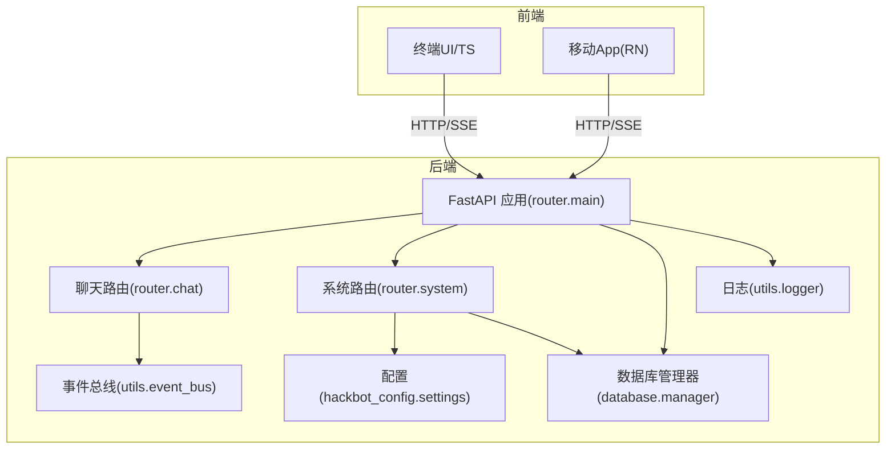
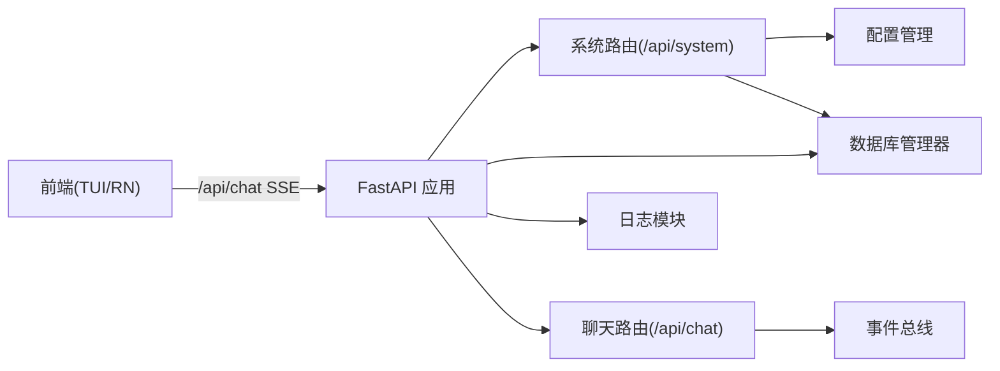
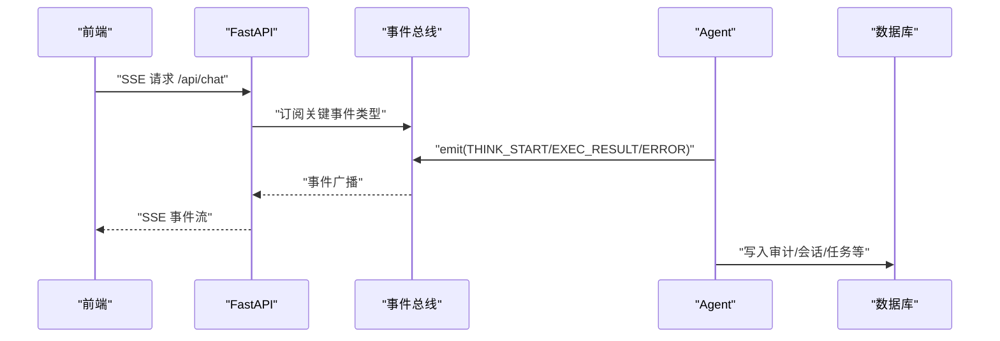
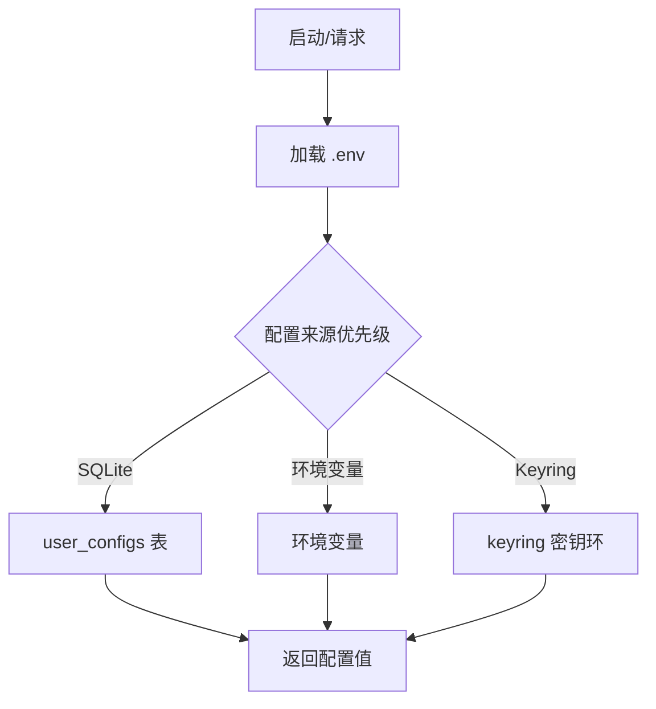
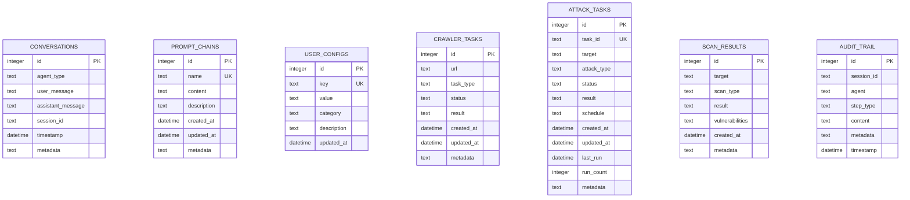
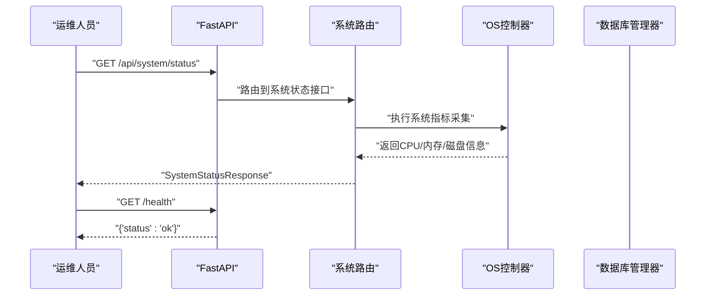
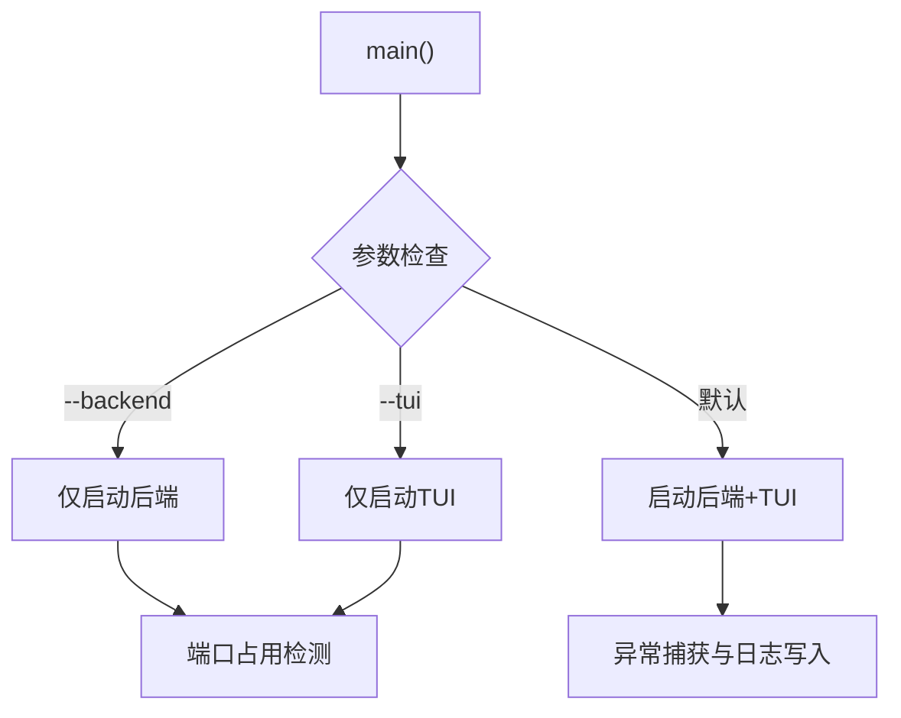
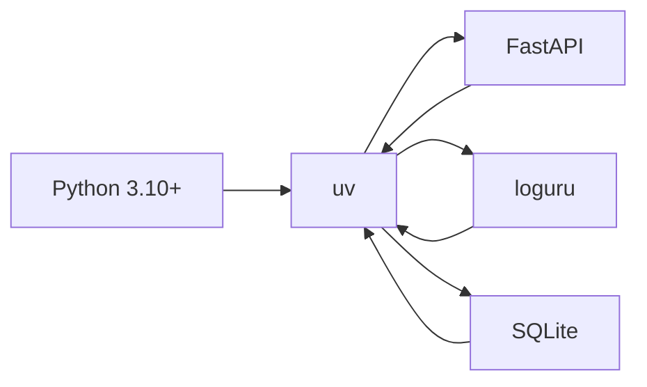

# 运维维护与故障排除

<cite>
**本文引用的文件**
- [README_CN.md](file://README_CN.md)
- [README_EN.md](file://README_EN.md)
- [main.py](file://main.py)
- [pyproject.toml](file://pyproject.toml)
- [Makefile](file://Makefile)
- [utils/logger.py](file://utils/logger.py)
- [utils/event_bus.py](file://utils/event_bus.py)
- [router/main.py](file://router/main.py)
- [router/system.py](file://router/system.py)
- [hackbot_config/__init__.py](file://hackbot_config/__init__.py)
- [database/manager.py](file://database/manager.py)
- [utils/config_storage.py](file://utils/config_storage.py)
- [docs/DOCKER_SETUP.md](file://docs/DOCKER_SETUP.md)
- [docs/DATABASE_GUIDE.md](file://docs/DATABASE_GUIDE.md)
- [scripts/build_release.sh](file://scripts/build_release.sh)
</cite>

## 目录
1. [简介](#简介)
2. [项目结构](#项目结构)
3. [核心组件](#核心组件)
4. [架构总览](#架构总览)
5. [详细组件分析](#详细组件分析)
6. [依赖分析](#依赖分析)
7. [性能考量](#性能考量)
8. [故障排除指南](#故障排除指南)
9. [结论](#结论)
10. [附录](#附录)

## 简介
本文件面向Secbot运维团队，提供一套实用的运维维护与故障排除技术文档。内容覆盖系统巡检、数据备份、日志轮转与安全更新，涵盖故障诊断与根因分析、监控与告警机制、常见问题与应急响应、版本升级与回滚策略、运维自动化与脚本使用，以及团队协作与知识传承机制。文档以仓库现有实现为依据，结合架构图与流程图帮助读者快速定位问题、制定预案并高效处置。

## 项目结构
Secbot采用前后端分离与事件驱动架构：前端通过HTTP/SSE与后端FastAPI交互；后端以会话编排为核心，通过事件总线解耦多智能体与UI；数据库采用SQLite，配合配置管理与日志模块支撑运维可观测性与可追溯性。

图表来源
- [router/main.py](file://router/main.py#L19-L71)
- [router/system.py](file://router/system.py#L25-L243)
- [utils/event_bus.py](file://utils/event_bus.py#L68-L187)
- [utils/logger.py](file://utils/logger.py#L1-L51)
- [hackbot_config/__init__.py](file://hackbot_config/__init__.py#L162-L246)
- [database/manager.py](file://database/manager.py#L26-L203)

章节来源
- [README_CN.md](file://README_CN.md#L75-L152)
- [README_EN.md](file://README_EN.md#L75-L152)
- [router/main.py](file://router/main.py#L19-L71)

## 核心组件
- 后端服务入口与健康检查：FastAPI应用工厂、CORS中间件、路由注册、启动时数据库初始化、/health健康检查。
- 事件总线：统一事件类型与发布订阅，支持同步/异步处理器，保障Agent与UI解耦。
- 日志模块：控制台与文件双通道输出，支持初始化阶段静默与运行期恢复，文件日志轮转与压缩。
- 配置管理：多厂商LLM后端配置、API Key安全存储、数据库路径解析、日志级别与文件路径。
- 数据库管理：SQLite表初始化、对话/提示词链/任务/审计等表、索引与统计接口。
- 系统路由：系统信息、状态、模型列表、API Key配置等系统运维接口。
- 启动入口：统一入口脚本，错误捕获与冻结模式暂停，便于排障。

章节来源
- [router/main.py](file://router/main.py#L19-L101)
- [utils/event_bus.py](file://utils/event_bus.py#L15-L187)
- [utils/logger.py](file://utils/logger.py#L1-L51)
- [hackbot_config/__init__.py](file://hackbot_config/__init__.py#L162-L250)
- [database/manager.py](file://database/manager.py#L26-L203)
- [router/system.py](file://router/system.py#L25-L243)
- [main.py](file://main.py#L44-L62)

## 架构总览
后端通过FastAPI提供REST+SSE接口，系统路由负责对外运维能力，事件总线承载Agent与UI之间的事件流，数据库与配置模块提供持久化与可配置能力。

图表来源
- [router/main.py](file://router/main.py#L19-L71)
- [router/system.py](file://router/system.py#L25-L243)
- [utils/event_bus.py](file://utils/event_bus.py#L68-L187)
- [utils/logger.py](file://utils/logger.py#L1-L51)
- [hackbot_config/__init__.py](file://hackbot_config/__init__.py#L162-L250)
- [database/manager.py](file://database/manager.py#L26-L203)

## 详细组件分析

### 日志与事件总线
- 日志：初始化阶段控制台仅输出警告及以上，运行期可恢复日志级别；文件日志按10MB轮转、7天保留、zip压缩。
- 事件总线：定义事件类型枚举，支持同步/异步发射与处理器异常保护，保障UI与Agent解耦。

图表来源
- [utils/event_bus.py](file://utils/event_bus.py#L15-L187)
- [router/main.py](file://router/main.py#L19-L71)

章节来源
- [utils/logger.py](file://utils/logger.py#L1-L51)
- [utils/event_bus.py](file://utils/event_bus.py#L68-L187)

### 配置与密钥管理
- 配置来源：.env优先于打包目录下的.env；SQLite user_configs表持久化厂商API Key与Base URL；keyring安全存储敏感信息。
- API Key设置：支持设置/删除API Key，同时可更新Base URL；提供交互式配置与状态展示。

图表来源
- [hackbot_config/__init__.py](file://hackbot_config/__init__.py#L16-L149)
- [utils/config_storage.py](file://utils/config_storage.py#L12-L61)

章节来源
- [hackbot_config/__init__.py](file://hackbot_config/__init__.py#L162-L250)
- [utils/config_storage.py](file://utils/config_storage.py#L1-L61)

### 数据库与审计
- 表结构：conversations、prompt_chains、user_configs、crawler_tasks、attack_tasks、scan_results、audit_trail。
- 初始化：启动时创建表与索引；提供统计接口与审计留痕。
- 备份与清理：SQLite单文件备份与恢复；支持按日期/会话清理。

图表来源
- [database/manager.py](file://database/manager.py#L80-L203)

章节来源
- [database/manager.py](file://database/manager.py#L26-L719)
- [docs/DATABASE_GUIDE.md](file://docs/DATABASE_GUIDE.md#L1-L213)

### 系统状态与健康检查
- 健康检查：/health返回服务状态。
- 系统信息：OS、架构、Python版本、主机名、用户名等。
- 系统状态：CPU、内存、磁盘实时指标。
- 模型管理：列出/拉取Ollama模型，检查服务可达性。
- 配置管理：列出需Key的厂商、设置/删除API Key、更新Base URL。

图表来源
- [router/system.py](file://router/system.py#L195-L243)
- [router/main.py](file://router/main.py#L63-L65)

章节来源
- [router/system.py](file://router/system.py#L25-L243)
- [router/main.py](file://router/main.py#L63-L65)

### 启动入口与错误处理
- 统一入口：支持--backend/--tui参数分别启动后端/TUI；默认全量启动。
- 错误捕获：异常写入hackbot_error.log，冻结模式暂停等待查看。
- 端口占用检测：启动前检查端口占用并提示解决方法。

图表来源
- [main.py](file://main.py#L44-L62)
- [router/main.py](file://router/main.py#L74-L98)

章节来源
- [main.py](file://main.py#L1-L62)
- [router/main.py](file://router/main.py#L74-L98)

## 依赖分析
- 语言与运行时：Python 3.10+，uv包管理器。
- 后端框架：FastAPI、Uvicorn、sse-starlette。
- 数据库：SQLite（内置向量扩展在非Windows平台可用）。
- 日志：loguru。
- 测试：pytest。
- 构建：setuptools、wheel；可选PyInstaller打包。

图表来源
- [pyproject.toml](file://pyproject.toml#L1-L165)

章节来源
- [pyproject.toml](file://pyproject.toml#L1-L165)

## 性能考量
- 日志轮转：文件大小10MB、保留7天、zip压缩，降低I/O与磁盘占用。
- 数据库索引：自动创建必要索引，减少查询延迟。
- 事件总线：异步处理器在事件循环存在时自动调度，避免阻塞。
- 启动时数据库初始化：首次请求前确保表与索引就绪，减少运行期抖动。
- Docker策略：仅使用SQLite，避免外部依赖，简化部署与运维。

章节来源
- [utils/logger.py](file://utils/logger.py#L23-L31)
- [database/manager.py](file://database/manager.py#L176-L201)
- [router/main.py](file://router/main.py#L56-L59)
- [docs/DOCKER_SETUP.md](file://docs/DOCKER_SETUP.md#L1-L14)

## 故障排除指南

### 常见问题与应急响应
- 后端无法启动/端口占用
  - 现象：启动报端口占用。
  - 处理：停止占用进程或更换端口；使用提供的Windows命令定位PID并结束进程。
  - 参考：[router/main.py](file://router/main.py#L84-L91)
- 健康检查失败
  - 现象：/health返回异常。
  - 处理：检查服务进程、依赖（如Ollama）与数据库连接；查看日志定位错误。
  - 参考：[router/main.py](file://router/main.py#L63-L65)
- 日志缺失/过少
  - 现象：初始化阶段无日志或日志不完整。
  - 处理：确认verbose_init配置；在交互开始后调用恢复控制台日志级别。
  - 参考：[utils/logger.py](file://utils/logger.py#L14-L47)
- API Key配置错误
  - 现象：模型/外部API调用失败。
  - 处理：通过系统路由设置/删除API Key；检查keyring与SQLite存储状态。
  - 参考：[router/system.py](file://router/system.py#L155-L192)，[utils/config_storage.py](file://utils/config_storage.py#L12-L61)
- 数据库异常
  - 现象：会话/任务/审计数据异常。
  - 处理：备份数据库文件；检查表结构与索引；必要时清理旧数据或重建表。
  - 参考：[database/manager.py](file://database/manager.py#L75-L203)，[docs/DATABASE_GUIDE.md](file://docs/DATABASE_GUIDE.md#L163-L213)

### 日志分析技巧与根因分析
- 使用文件日志定位错误：关注时间戳、级别、模块与函数，结合异常堆栈。
- 事件流追踪：通过事件类型（THINK/EXEC/REPORT/ERROR）串联Agent行为与UI渲染。
- 控制台级别：初始化阶段仅WARNING及以上，运行期恢复至设定级别以便排障。

章节来源
- [utils/logger.py](file://utils/logger.py#L1-L51)
- [utils/event_bus.py](file://utils/event_bus.py#L15-L187)

### 监控与告警机制
- 健康检查：/health作为基础探针，可用于K8s/负载均衡探活。
- 系统状态：CPU/内存/磁盘指标可用于容量与异常预警。
- 日志轮转：自动压缩与保留策略降低运维成本。
- 建议：结合外部监控系统（如Prometheus/Grafana）采集/展示系统状态与日志指标。

章节来源
- [router/main.py](file://router/main.py#L63-L65)
- [router/system.py](file://router/system.py#L195-L243)
- [utils/logger.py](file://utils/logger.py#L23-L31)

### 版本升级与回滚策略
- 构建与发布
  - 使用uv构建包；Makefile提供install/build/clean/test/docker命令。
  - 可选PyInstaller打包：脚本安装依赖并生成单文件可执行程序。
- 回滚策略
  - 保留上一版本可执行文件或容器镜像；回退时恢复配置与数据目录。
  - 通过构建产物路径与版本号管理发布包，确保可追溯。
- 兼容性检查
  - Python版本与uv环境；第三方依赖版本范围；SQLite迁移脚本（如有）。

章节来源
- [Makefile](file://Makefile#L1-L43)
- [pyproject.toml](file://pyproject.toml#L1-L165)
- [scripts/build_release.sh](file://scripts/build_release.sh#L1-L21)

### 运维自动化与脚本
- 构建与测试
  - make install：使用uv同步依赖。
  - make build：使用uv构建包。
  - make test：运行pytest测试。
- Docker
  - make docker-build：构建镜像。
  - make docker-up/down：启动/停止服务。
- 启动与排障
  - main.py支持--backend/--tui参数；异常自动写入错误日志并暂停（冻结模式）。

章节来源
- [Makefile](file://Makefile#L16-L42)
- [main.py](file://main.py#L44-L62)

### 团队协作与知识传承
- 文档与规范
  - 依赖与环境：pyproject.toml与README中的安装/构建说明。
  - 配置与密钥：hackbot_config与utils/config_storage的配置与安全存储约定。
  - 数据库：docs/DATABASE_GUIDE.md提供表结构、CLI与编程接口。
- 最佳实践
  - 使用/health与系统状态接口进行例行巡检。
  - 通过事件总线与日志定位问题，保留错误日志与审计记录。
  - 严格遵循备份与回滚流程，确保数据安全。

章节来源
- [pyproject.toml](file://pyproject.toml#L1-L165)
- [docs/DATABASE_GUIDE.md](file://docs/DATABASE_GUIDE.md#L1-L213)
- [hackbot_config/__init__.py](file://hackbot_config/__init__.py#L162-L250)
- [utils/config_storage.py](file://utils/config_storage.py#L1-L61)

## 结论
本运维文档基于Secbot现有实现，围绕日志、事件、配置、数据库与系统路由等关键模块，给出了巡检、备份、监控、故障诊断与应急响应的实操指引，并补充了版本升级与回滚、自动化脚本与团队协作建议。建议在生产环境中结合外部监控体系完善告警与容量管理，持续优化日志轮转与数据库清理策略，确保系统稳定与可追溯。

## 附录
- 快速命令
  - 启动后端：python -m router.main 或 hackbot-server
  - 启动TUI：./scripts/start-ts-tui.sh 或 Windows脚本
  - 构建：make build 或 ./build.sh
  - 测试：make test 或 uv run pytest tests/
  - Docker：make docker-build / docker-up / docker-down
- 常用接口
  - GET /health 健康检查
  - GET /api/system/info 系统信息
  - GET /api/system/status 系统状态
  - GET/POST /api/system/config/providers API Key厂商状态与设置