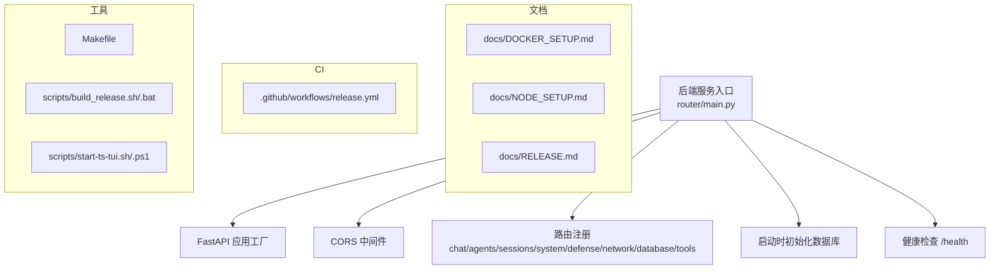
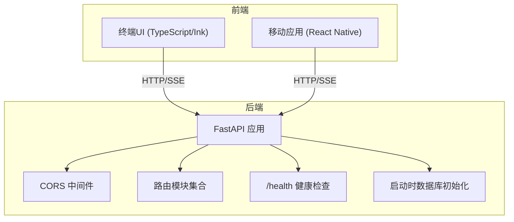
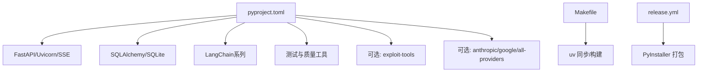

# 部署与运维

<cite>
**本文引用的文件**
- [README_CN.md](file://README_CN.md)
- [README_EN.md](file://README_EN.md)
- [docs/DOCKER_SETUP.md](file://docs/DOCKER_SETUP.md)
- [docs/NODE_SETUP.md](file://docs/NODE_SETUP.md)
- [docs/RELEASE.md](file://docs/RELEASE.md)
- [pyproject.toml](file://pyproject.toml)
- [uv.toml](file://uv.toml)
- [Makefile](file://Makefile)
- [.github/workflows/release.yml](file://.github/workflows/release.yml)
- [scripts/build_release.sh](file://scripts/build_release.sh)
- [scripts/build_release.bat](file://scripts/build_release.bat)
- [scripts/start-ts-tui.sh](file://scripts/start-ts-tui.sh)
- [scripts/start-ts-tui.ps1](file://scripts/start-ts-tui.ps1)
- [router/main.py](file://router/main.py)
</cite>

## 目录
1. [简介](#简介)
2. [项目结构](#项目结构)
3. [核心组件](#核心组件)
4. [架构总览](#架构总览)
5. [详细组件分析](#详细组件分析)
6. [依赖分析](#依赖分析)
7. [性能考虑](#性能考虑)
8. [故障排除指南](#故障排除指南)
9. [结论](#结论)
10. [附录](#附录)

## 简介
本文件面向Secbot（原名hackbot）的部署与运维，覆盖容器化部署、开发环境配置、性能优化、监控与故障排除、版本管理与发布流程，以及生产环境的部署建议、备份与灾备策略。文档基于仓库内的安装说明、Docker与Node环境说明、发布与CI流程、后端服务入口与依赖清单等资料整理而成，帮助读者在不同环境中稳定、高效地运行Secbot。

## 项目结构
- 后端服务入口位于router/main.py，提供FastAPI应用工厂、CORS配置、路由注册与健康检查接口。
- 文档目录docs包含Docker设置、Node环境、发布说明等运维相关指南。
- 顶层Makefile提供安装、构建、测试、Docker镜像构建与部署流程的便捷命令。
- .github/workflows/release.yml定义了多平台构建与发布到GitHub Releases的CI流程。
- scripts目录包含构建可执行文件与启动TS TUI的脚本。

**图表来源**
- [router/main.py](file://router/main.py#L1-L101)
- [docs/DOCKER_SETUP.md](file://docs/DOCKER_SETUP.md#L1-L14)
- [docs/NODE_SETUP.md](file://docs/NODE_SETUP.md#L1-L46)
- [docs/RELEASE.md](file://docs/RELEASE.md#L1-L86)
- [.github/workflows/release.yml](file://.github/workflows/release.yml#L1-L116)
- [Makefile](file://Makefile#L1-L43)
- [scripts/build_release.sh](file://scripts/build_release.sh#L1-L21)
- [scripts/build_release.bat](file://scripts/build_release.bat#L1-L17)
- [scripts/start-ts-tui.sh](file://scripts/start-ts-tui.sh#L1-L13)
- [scripts/start-ts-tui.ps1](file://scripts/start-ts-tui.ps1#L1-L10)

**章节来源**
- [router/main.py](file://router/main.py#L1-L101)
- [docs/DOCKER_SETUP.md](file://docs/DOCKER_SETUP.md#L1-L14)
- [docs/NODE_SETUP.md](file://docs/NODE_SETUP.md#L1-L46)
- [docs/RELEASE.md](file://docs/RELEASE.md#L1-L86)
- [.github/workflows/release.yml](file://.github/workflows/release.yml#L1-L116)
- [Makefile](file://Makefile#L1-L43)
- [scripts/build_release.sh](file://scripts/build_release.sh#L1-L21)
- [scripts/build_release.bat](file://scripts/build_release.bat#L1-L17)
- [scripts/start-ts-tui.sh](file://scripts/start-ts-tui.sh#L1-L13)
- [scripts/start-ts-tui.ps1](file://scripts/start-ts-tui.ps1#L1-L10)

## 核心组件
- 后端服务（FastAPI + Uvicorn）
  - 应用工厂创建FastAPI实例，注册多路由模块，启用CORS中间件，提供健康检查。
  - 启动时初始化数据库，确保首次请求前数据库可用。
  - 提供脚本入口以启动服务器，默认监听0.0.0.0:8000，支持reload。
- 文档与指南
  - Docker设置：强调仅使用SQLite，无需外部数据库容器。
  - Node环境：说明依赖审计与切换Node版本的方法。
  - 发布说明：介绍GitHub Releases打包、API Key配置与运行方式。
- 构建与发布
  - Makefile提供install、build、test、docker-build、docker-up、docker-down、deploy等命令。
  - release.yml实现多平台PyInstaller打包与Release发布。
  - scripts目录提供构建可执行文件与启动TS TUI的脚本。

**章节来源**
- [router/main.py](file://router/main.py#L1-L101)
- [docs/DOCKER_SETUP.md](file://docs/DOCKER_SETUP.md#L1-L14)
- [docs/NODE_SETUP.md](file://docs/NODE_SETUP.md#L1-L46)
- [docs/RELEASE.md](file://docs/RELEASE.md#L1-L86)
- [Makefile](file://Makefile#L1-L43)
- [.github/workflows/release.yml](file://.github/workflows/release.yml#L1-L116)
- [scripts/build_release.sh](file://scripts/build_release.sh#L1-L21)
- [scripts/build_release.bat](file://scripts/build_release.bat#L1-L17)

## 架构总览
后端服务通过FastAPI提供REST与SSE接口，前端（终端UI/移动应用）通过HTTP/SSE与后端通信。开发与运维关注点包括：后端路由与中间件、数据库初始化、健康检查、CORS策略、以及CI/CD与发布流程。

**图表来源**
- [router/main.py](file://router/main.py#L1-L101)

**章节来源**
- [router/main.py](file://router/main.py#L1-L101)

## 详细组件分析

### Docker容器化部署
- 当前策略
  - 仅使用SQLite作为数据库，无需启动ChromaDB、Redis或其他外部数据库服务。
  - 仓库中可能存在历史保留的docker-compose配置，日常部署Secbot无需依赖这些服务。
- 部署建议
  - 构建镜像：使用Makefile提供的docker-build或直接docker build。
  - 启停服务：使用Makefile提供的docker-up/docker-down或docker-compose。
  - 数据持久化：挂载应用可写目录（如data/、logs/）与SQLite数据库文件，确保重启后数据不丢失。
  - 环境变量：通过容器环境变量或.env文件配置API Key、模型参数等。
- 最佳实践
  - 限制CORS范围（生产环境）。
  - 使用健康检查与日志采集。
  - 为后端端口（默认8000）配置防火墙规则。

**章节来源**
- [docs/DOCKER_SETUP.md](file://docs/DOCKER_SETUP.md#L1-L14)
- [Makefile](file://Makefile#L30-L37)

### 开发环境配置
- Python与包管理
  - 使用uv进行依赖同步与构建，支持多Python版本。
  - 依赖与可选依赖在pyproject.toml中集中管理。
- Node与前端
  - 通过PyCharm设置Node解释器，切换至最新LTS版本。
  - 使用overrides修复markdown-it安全漏洞，确保npm audit为0。
- 启动与调试
  - 后端：通过脚本入口启动（默认监听0.0.0.0:8000，支持reload）。
  - 前端：终端UI通过HTTP/SSE连接后端，提供交互式体验。
  - 启动脚本：Windows与Linux/macOS分别提供一键启动脚本。

**章节来源**
- [README_CN.md](file://README_CN.md#L319-L386)
- [README_EN.md](file://README_EN.md#L231-L293)
- [docs/NODE_SETUP.md](file://docs/NODE_SETUP.md#L1-L46)
- [router/main.py](file://router/main.py#L74-L98)
- [scripts/start-ts-tui.sh](file://scripts/start-ts-tui.sh#L1-L13)
- [scripts/start-ts-tui.ps1](file://scripts/start-ts-tui.ps1#L1-L10)

### 性能优化策略
- 数据库优化
  - 使用SQLite作为单一数据库，减少外部依赖带来的网络延迟与一致性问题。
  - 启动时初始化数据库，降低首次请求的准备时间。
- 内存管理与并发控制
  - 后端使用异步框架（FastAPI/Uvicorn），支持高并发请求。
  - 建议在生产环境限制并发连接数与请求大小，结合负载均衡。
- 系统资源调优
  - 合理配置容器CPU/内存限额，避免资源争用。
  - 通过健康检查与日志监控资源使用情况。

**章节来源**
- [docs/DOCKER_SETUP.md](file://docs/DOCKER_SETUP.md#L1-L14)
- [router/main.py](file://router/main.py#L56-L66)

### 运维监控与故障排除
- 日志与健康检查
  - 后端提供/health接口，便于Kubernetes/负载均衡器探活。
  - 建议接入统一日志收集（stdout/stderr），并保留日志轮转。
- 错误诊断
  - 端口占用：启动前检查8000端口是否被占用，必要时终止占用进程。
  - CORS问题：开发阶段允许全部来源，生产环境应限制来源。
- 系统维护
  - 定期清理临时文件与缓存，确保磁盘空间充足。
  - 通过Makefile的clean命令清理构建产物。

**章节来源**
- [router/main.py](file://router/main.py#L63-L66)
- [router/main.py](file://router/main.py#L84-L91)
- [Makefile](file://Makefile#L22-L26)

### 版本管理与发布流程
- 版本与标签
  - 在pyproject.toml与包初始化文件中更新版本号。
  - 推送vX.Y.Z标签触发CI构建与发布。
- CI/CD流程
  - GitHub Actions在多个Runner上并行构建，使用uv与PyInstaller生成可执行文件。
  - 将产物打包为zip并上传到GitHub Releases。
- 用户侧发布使用
  - 下载对应平台zip，解压后在hackbot目录配置API Key，运行可执行文件进入交互界面。
  - 可选配置：在同目录.env中设置模型与提供商参数。

**章节来源**
- [docs/RELEASE.md](file://docs/RELEASE.md#L1-L86)
- [.github/workflows/release.yml](file://.github/workflows/release.yml#L1-L116)
- [pyproject.toml](file://pyproject.toml#L7-L8)

### 生产环境部署建议、备份与灾备
- 部署建议
  - 使用Docker容器化部署，挂载数据卷与日志目录，确保可恢复性。
  - 限制CORS来源，仅允许受信域名。
  - 配置反向代理（Nginx/Caddy）与TLS证书，启用WAF与DDoS防护。
- 备份策略
  - 定期备份SQLite数据库文件与日志目录。
  - 使用快照或对象存储进行异地备份。
- 灾难恢复
  - 准备最小化恢复流程：拉取镜像、挂载数据卷、启动容器、验证/health。
  - 预先演练恢复步骤，确保RTO/RPO达标。

**章节来源**
- [docs/DOCKER_SETUP.md](file://docs/DOCKER_SETUP.md#L1-L14)
- [router/main.py](file://router/main.py#L33-L39)

## 依赖分析
- 后端依赖
  - FastAPI、Uvicorn、sse-starlette提供Web服务与SSE。
  - SQLAlchemy、sqlite-vec/sqlite-vss（非Windows）提供向量检索能力。
  - LangChain系列、OpenAI/Anthropic/Google GenAI适配器提供多模型支持。
  - pytest、pytest-asyncio用于测试。
- 可选依赖
  - exploit-tools：Metasploit相关工具。
  - anthropic/google/all-providers：多提供商适配。
- 构建与打包
  - 使用uv进行依赖同步与构建，Makefile提供一键命令。
  - PyInstaller用于生成多平台可执行文件，GitHub Actions自动化打包。

**图表来源**
- [pyproject.toml](file://pyproject.toml#L29-L69)
- [Makefile](file://Makefile#L16-L21)
- [.github/workflows/release.yml](file://.github/workflows/release.yml#L50-L57)

**章节来源**
- [pyproject.toml](file://pyproject.toml#L1-L165)
- [Makefile](file://Makefile#L1-L43)
- [.github/workflows/release.yml](file://.github/workflows/release.yml#L1-L116)

## 性能考虑
- I/O与并发
  - 使用异步框架处理高并发请求，避免阻塞I/O影响响应时间。
- 数据库
  - SQLite适合中小规模数据，避免跨节点一致性带来的复杂性。
- 模型推理
  - 通过环境变量或前端设置选择合适的推理服务与模型，平衡速度与准确性。
- 资源限制
  - 在容器中设置CPU/内存限额，防止突发流量导致系统不稳定。

[本节为通用性能建议，无需特定文件分析]

## 故障排除指南
- 端口冲突
  - 启动失败提示端口8000被占用时，先查找并终止占用进程，再重启服务。
- CORS问题
  - 开发阶段允许全部来源，生产环境需限制来源，避免跨域访问异常。
- 健康检查失败
  - 检查/health接口返回状态，确认数据库初始化与服务启动状态。
- 前端无法连接
  - 确认后端地址与端口，检查SSE连接是否正常。

**章节来源**
- [router/main.py](file://router/main.py#L84-L91)
- [router/main.py](file://router/main.py#L33-L39)
- [router/main.py](file://router/main.py#L63-L66)

## 结论
本文基于仓库现有文档与代码，给出了Secbot在容器化、开发环境、性能优化、运维监控、版本管理与发布、以及生产部署与灾备方面的实践建议。建议在生产环境中遵循最小权限、最小依赖的原则，结合健康检查与日志监控，确保系统的稳定性与可维护性。

[本节为总结性内容，无需特定文件分析]

## 附录
- 快速命令
  - 安装依赖：make install
  - 构建包：make build
  - 运行测试：make test
  - 构建Docker镜像：make docker-build
  - 启动Docker服务：make docker-up
  - 停止Docker服务：make docker-down
  - 清理构建：make clean
- 发布流程
  - 更新版本号与变更说明，推送vX.Y.Z标签，触发GitHub Actions自动打包并发布到Release。

**章节来源**
- [Makefile](file://Makefile#L1-L43)
- [docs/RELEASE.md](file://docs/RELEASE.md#L7-L16)
- [.github/workflows/release.yml](file://.github/workflows/release.yml#L84-L91)