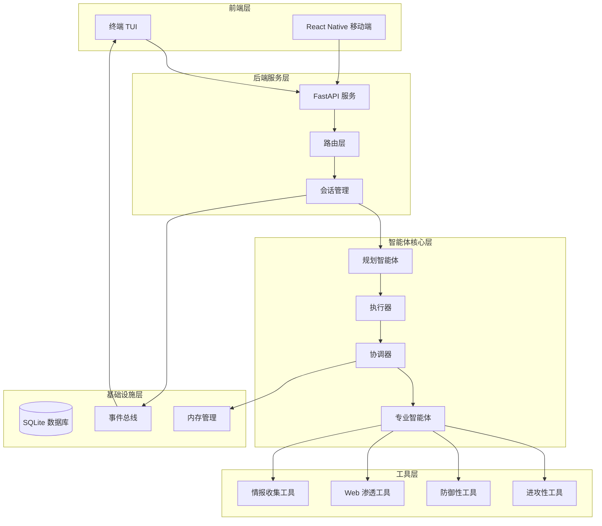
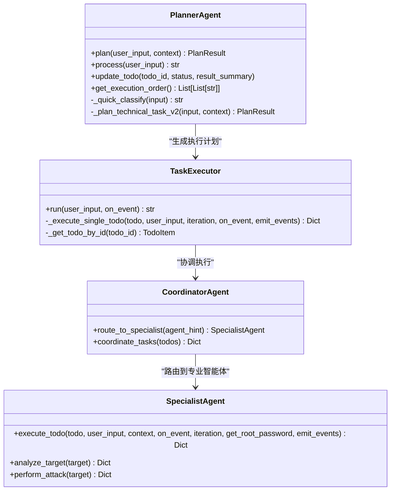
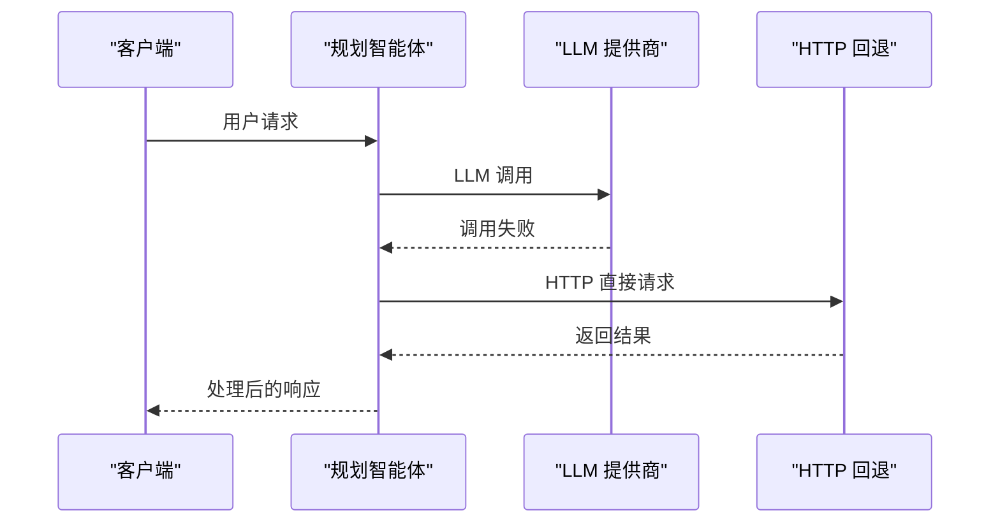
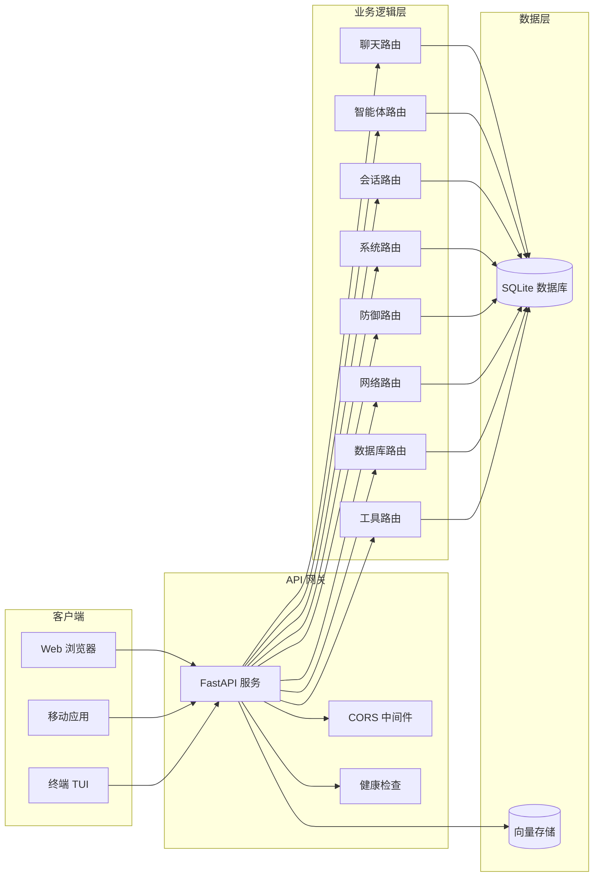
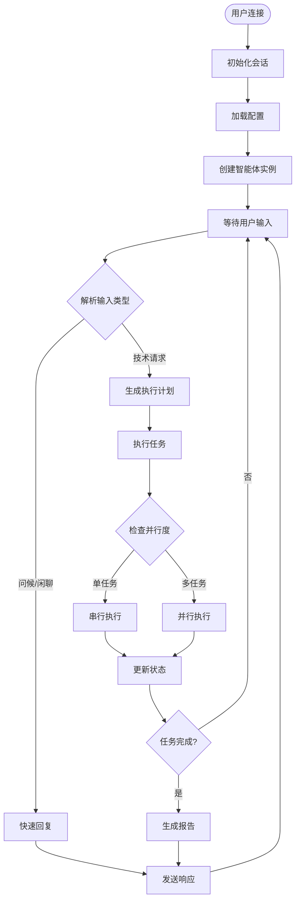
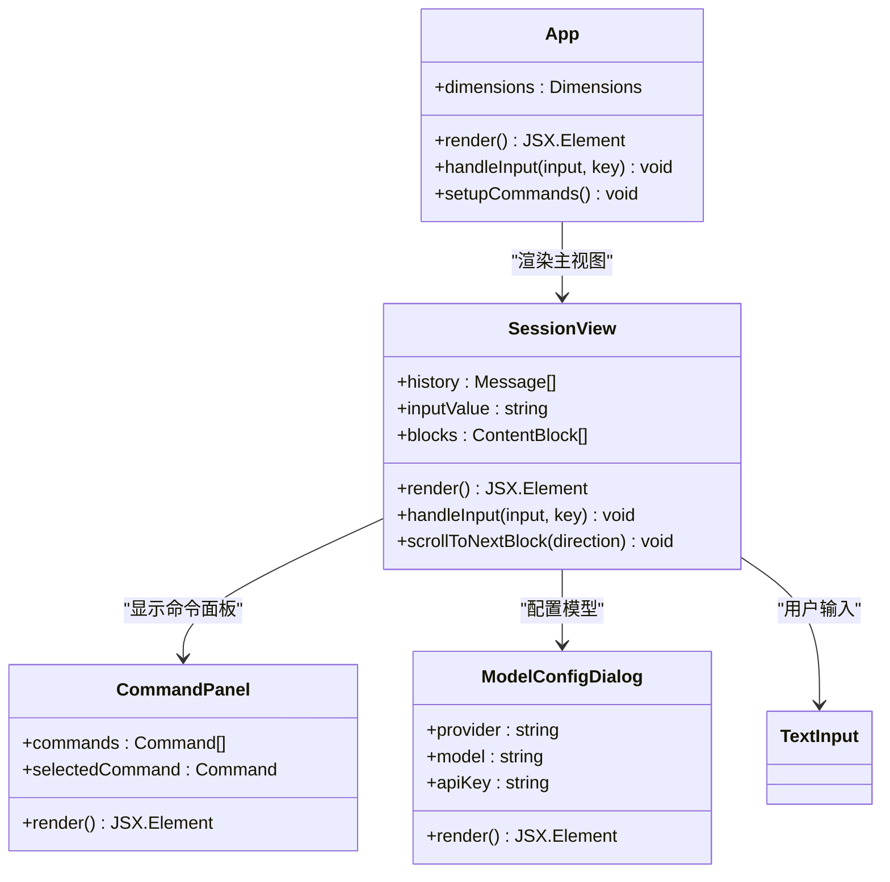
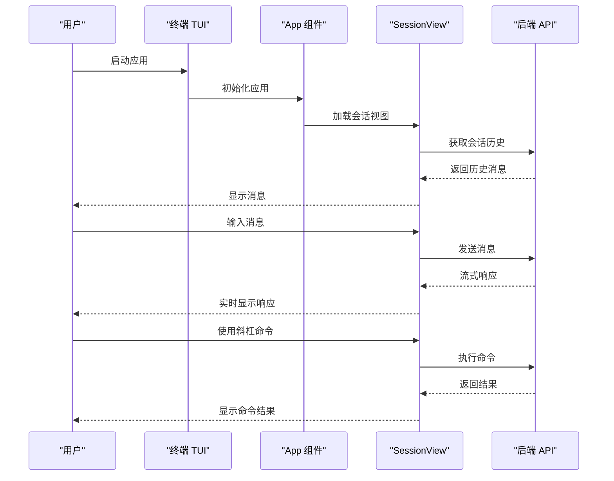
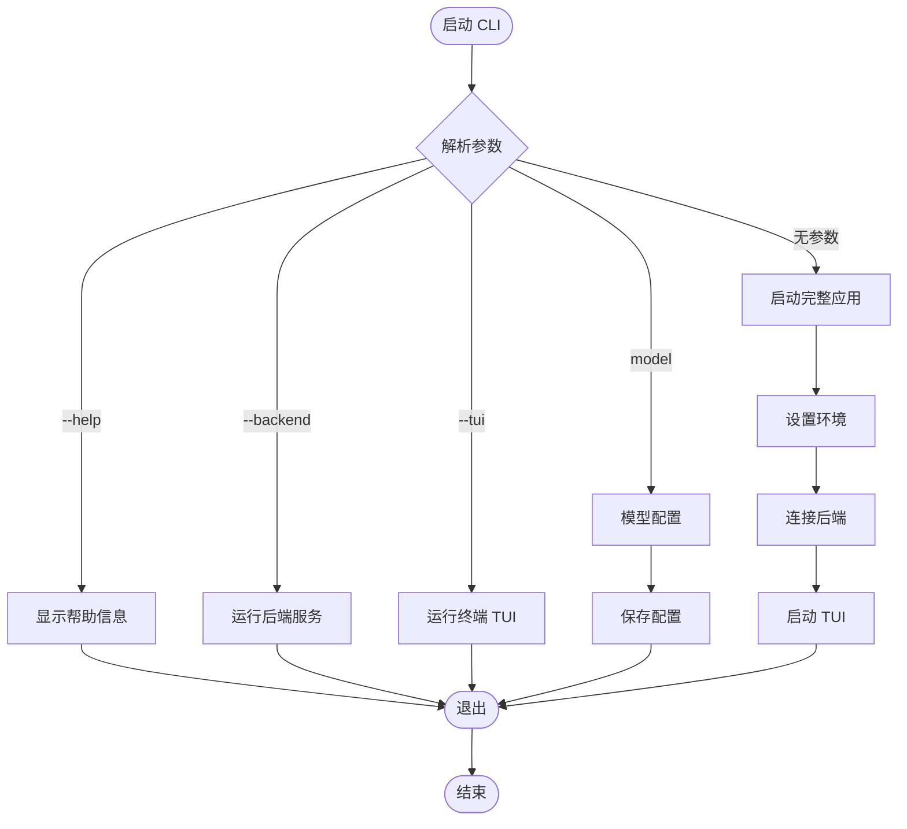
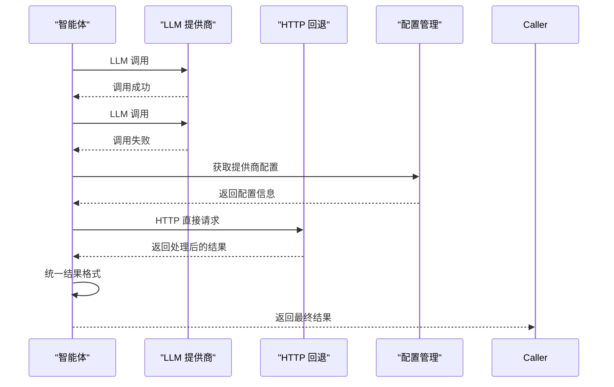
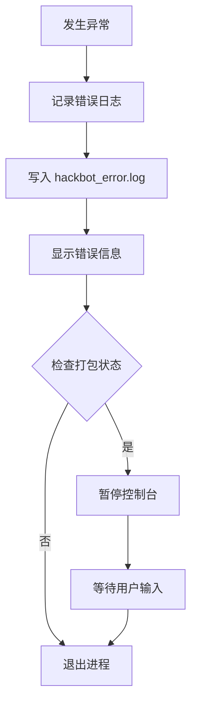

# Secbot v1.0.1 发布说明

<cite>
**本文档引用的文件**
- [README.md](file://README.md)
- [docs/RELEASE_v1.0.1.md](file://docs/RELEASE_v1.0.1.md)
- [pyproject.toml](file://pyproject.toml)
- [main.py](file://main.py)
- [router/main.py](file://router/main.py)
- [hackbot/cli.py](file://hackbot/cli.py)
- [utils/llm_http_fallback.py](file://utils/llm_http_fallback.py)
- [terminal-ui/src/App.tsx](file://terminal-ui/src/App.tsx)
- [terminal-ui/package.json](file://terminal-ui/package.json)
- [terminal-ui/src/views/SessionView.tsx](file://terminal-ui/src/views/SessionView.tsx)
- [core/agents/planner_agent.py](file://core/agents/planner_agent.py)
- [core/executor.py](file://core/executor.py)
- [docs/LLM_PROVIDERS.md](file://docs/LLM_PROVIDERS.md)
</cite>

## 目录
1. [简介](#简介)
2. [项目结构](#项目结构)
3. [核心组件](#核心组件)
4. [架构概览](#架构概览)
5. [详细组件分析](#详细组件分析)
6. [依赖分析](#依赖分析)
7. [性能考虑](#性能考虑)
8. [故障排除指南](#故障排除指南)
9. [结论](#结论)
10. [附录](#附录)

## 简介

Secbot v1.0.1 是一个基于 AI 的自动化渗透测试智能体平台，专为授权的安全测试而设计。该版本在 v1.0.0 的基础上进行了多项重要改进，重点提升了智能体与终端 TUI 的用户体验，增强了 LLM 多提供商支持与 HTTP 回退能力，并完善了文档和终端控制工具。

**安全提醒**：本工具仅用于您拥有或已获得明确书面授权的系统。未经授权的使用可能违法，请遵守当地法律法规。

## 项目结构

Secbot 采用模块化的分层架构设计，主要包含以下核心组件：



**图表来源**
- [README.md:86-170](file://README.md#L86-L170)
- [router/main.py:19-71](file://router/main.py#L19-L71)

**章节来源**
- [README.md:353-376](file://README.md#L353-L376)
- [pyproject.toml:124-162](file://pyproject.toml#L124-L162)

## 核心组件

### 智能体架构

Secbot 的智能体系统采用多层协作架构，包含规划、执行和协调三个核心层次：



**图表来源**
- [core/agents/planner_agent.py:20-200](file://core/agents/planner_agent.py#L20-L200)
- [core/executor.py:17-197](file://core/executor.py#L17-L197)

### LLM 多提供商支持

v1.0.1 版本显著增强了 LLM 多提供商支持能力，新增了 HTTP 回退机制以提高系统可用性：



**图表来源**
- [utils/llm_http_fallback.py:11-82](file://utils/llm_http_fallback.py#L11-L82)

**章节来源**
- [docs/RELEASE_v1.0.1.md:31-37](file://docs/RELEASE_v1.0.1.md#L31-L37)
- [docs/LLM_PROVIDERS.md:1-55](file://docs/LLM_PROVIDERS.md#L1-L55)

## 架构概览

### 系统架构

Secbot 采用前后端分离的微服务架构，通过 FastAPI 提供 REST API 和 SSE 事件流：



**图表来源**
- [router/main.py:5-16](file://router/main.py#L5-L16)
- [router/main.py:19-71](file://router/main.py#L19-L71)

### 会话管理流程



**图表来源**
- [core/agents/planner_agent.py:88-130](file://core/agents/planner_agent.py#L88-L130)
- [core/executor.py:46-151](file://core/executor.py#L46-L151)

## 详细组件分析

### 终端 TUI 组件

v1.0.1 版本对终端 TUI 进行了重大改进，增强了用户交互体验：



**图表来源**
- [terminal-ui/src/App.tsx:26-212](file://terminal-ui/src/App.tsx#L26-L212)
- [terminal-ui/src/views/SessionView.tsx:59-200](file://terminal-ui/src/views/SessionView.tsx#L59-L200)

#### 用户交互流程



**图表来源**
- [terminal-ui/src/App.tsx:166-185](file://terminal-ui/src/App.tsx#L166-L185)
- [terminal-ui/src/views/SessionView.tsx:174-200](file://terminal-ui/src/views/SessionView.tsx#L174-L200)

**章节来源**
- [docs/RELEASE_v1.0.1.md:24-29](file://docs/RELEASE_v1.0.1.md#L24-L29)
- [terminal-ui/src/App.tsx:1-212](file://terminal-ui/src/App.tsx#L1-L212)

### CLI 入口组件

v1.0.1 版本对 CLI 入口进行了优化，提供了更清晰的用户指导：



**图表来源**
- [hackbot/cli.py:34-95](file://hackbot/cli.py#L34-L95)
- [main.py:44-52](file://main.py#L44-L52)

**章节来源**
- [hackbot/cli.py:1-100](file://hackbot/cli.py#L1-L100)
- [main.py:1-62](file://main.py#L1-L62)

### LLM HTTP 回退机制

v1.0.1 版本新增了 LLM HTTP 回退机制，提高了系统在不同 LLM 提供商下的稳定性：



**图表来源**
- [utils/llm_http_fallback.py:22-82](file://utils/llm_http_fallback.py#L22-L82)

**章节来源**
- [docs/RELEASE_v1.0.1.md:33-37](file://docs/RELEASE_v1.0.1.md#L33-L37)
- [utils/llm_http_fallback.py:1-108](file://utils/llm_http_fallback.py#L1-L108)

## 依赖分析

### Python 依赖关系

Secbot v1.0.1 的 Python 依赖关系体现了其模块化设计：

```mermaid
graph TB
subgraph "核心依赖"
LangChain[langchain>=0.1.0]
FastAPI[fastapi>=0.109.0]
Uvicorn[uvicorn[standard]>=0.27.0]
SSE[sse-starlette>=1.8.0]
LangGraph[langgraph>=0.2.0]
end
subgraph "工具依赖"
Requests[requests>=2.31.0]
SQLAlchemy[sqlalchemy>=2.0.25]
Pydantic[pydantic>=2.5.3]
Rich[rich>=13.7.0]
Typer[typer>=0.9.0]
end
subgraph "安全依赖"
Paramiko[paramiko>=3.0.0]
Selenium[selenium>=4.17.0]
Playwright[playwright>=1.41.0]
end
subgraph "开发依赖"
PyTest[pytest>=8.0.0]
Black[black>=23.0.0]
Flake8[flake8>=6.0.0]
MyPy[mypy>=1.0.0]
end
LangChain --> FastAPI
FastAPI --> SSE
LangGraph --> LangChain
Requests --> SQLAlchemy
Paramiko --> Security
```

**图表来源**
- [pyproject.toml:29-69](file://pyproject.toml#L29-L69)

### TypeScript 依赖关系

终端 TUI 的 TypeScript 依赖关系相对简洁：

```mermaid
graph LR
subgraph "核心依赖"
Ink[ink^4.4.1]
React[react^18.2.0]
InkMarkdown[ink-markdown^1.0.4]
InkTextInput[ink-text-input^5.0.1]
end
subgraph "开发依赖"
TypesNode[@types/node^20.10.0]
TypesReact[@types/react^18.2.0]
TSX[tsx^4.7.0]
TypeScript[typescript^5.3.0]
end
Ink --> React
InkMarkdown --> Ink
InkTextInput --> Ink
```

**图表来源**
- [terminal-ui/package.json:17-30](file://terminal-ui/package.json#L17-L30)

**章节来源**
- [pyproject.toml:1-184](file://pyproject.toml#L1-L184)
- [terminal-ui/package.json:1-35](file://terminal-ui/package.json#L1-L35)

## 性能考虑

### 并行执行优化

v1.0.1 版本在任务执行层面实现了更高效的并行处理：

- **分层执行**：根据任务依赖关系进行拓扑分层，确保依赖满足后再执行
- **并发控制**：每层最多 3 个并行任务，避免资源竞争
- **异步处理**：使用 asyncio.gather 实现真正的并行执行
- **状态追踪**：实时更新任务状态，支持断点续传

### 内存管理

- **向量存储**：使用 sqlite-vec 和 sqlite-vss 进行高效向量检索
- **会话缓存**：智能体状态和历史消息的内存缓存
- **数据库连接池**：优化 SQLite 连接管理

### 网络优化

- **HTTP 回退**：在主要 LLM 调用失败时自动降级到 HTTP 直连
- **CORS 配置**：开发环境允许跨域访问，生产环境严格限制
- **SSE 事件流**：高效的实时通信机制

## 故障排除指南

### 常见问题诊断

#### LLM 配置问题

**症状**：智能体无法正常响应或报错

**解决方案**：
1. 检查 `.env` 文件中的 API Key 配置
2. 使用 `hackbot model` 命令重新配置提供商
3. 验证网络连接和防火墙设置

#### 端口冲突

**症状**：后端服务启动失败

**解决方案**：
1. 检查端口 8000 是否被占用
2. 使用 `netstat -ano | findstr :8000` 查找占用进程
3. 结束占用进程或修改端口配置

#### TUI 启动问题

**症状**：终端 TUI 无法正常显示

**解决方案**：
1. 确保 Node.js 版本 >= 18
2. 检查终端兼容性
3. 重新安装依赖包

**章节来源**
- [router/main.py:83-97](file://router/main.py#L83-L97)
- [hackbot/cli.py:14-31](file://hackbot/cli.py#L14-L31)

### 日志分析

v1.0.1 版本增强了错误处理和日志记录：



**图表来源**
- [main.py:19-32](file://main.py#L19-L32)
- [hackbot/cli.py:14-31](file://hackbot/cli.py#L14-L31)

## 结论

Secbot v1.0.1 是一个功能强大且稳定的 AI 驱动安全测试平台。该版本在智能体协作、终端 TUI 体验、LLM 多提供商支持等方面都有显著改进，为用户提供了一个更加可靠和易用的安全测试工具。

**主要改进**：
- 智能体协作稳定性提升
- 终端 TUI 用户体验优化
- LLM 多提供商支持增强
- HTTP 回退机制提高系统可用性
- 文档和配置管理完善

**适用场景**：
- 授权的安全测试
- 系统安全评估
- 漏洞发现和验证
- 安全报告生成

## 附录

### 安装和配置

#### 从源码安装

```bash
git clone https://github.com/iammm0/secbot.git
cd secbot
git checkout v1.0.1
uv sync
```

#### 配置环境变量

创建 `.env` 文件并配置必要的 API Key：

```bash
DEEPSEEK_API_KEY=sk-your-api-key-here
OLLAMA_MODEL=gemma3:1b
OLLAMA_EMBEDDING_MODEL=nomic-embed-text
```

### 快速开始

#### 启动完整应用

```bash
# 方法1：使用 uv
uv run hackbot

# 方法2：直接运行
python main.py
```

#### 启动后端服务

```bash
# 方法1：使用 uv
uv run hackbot-server

# 方法2：直接运行
python -m router.main
```

#### 启动终端 TUI

```bash
cd terminal-ui
npm install
npm run tui
```

**章节来源**
- [README.md:182-291](file://README.md#L182-L291)
- [docs/RELEASE_v1.0.1.md:50-83](file://docs/RELEASE_v1.0.1.md#L50-L83)