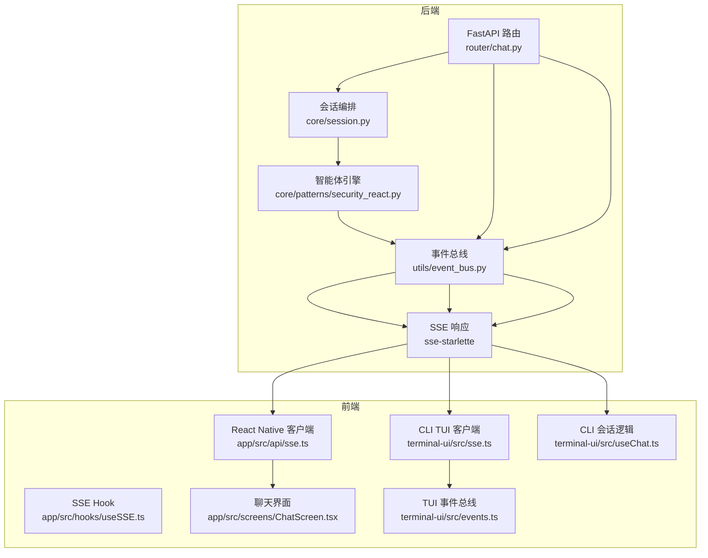
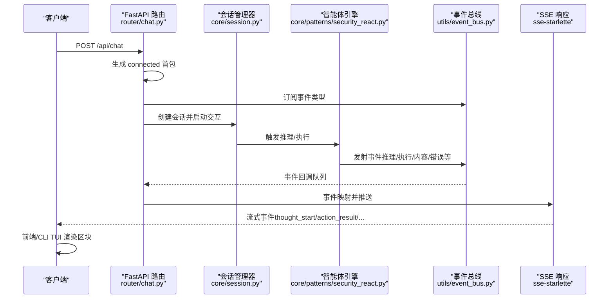
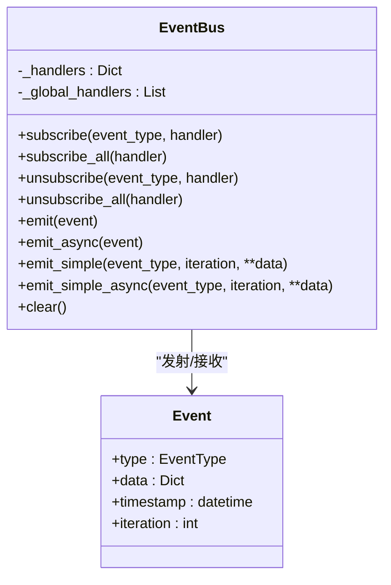
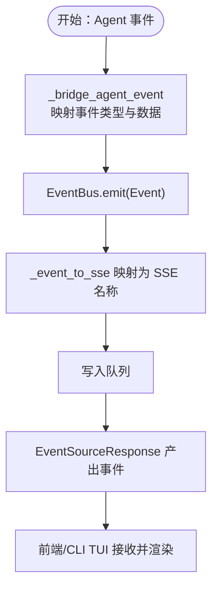
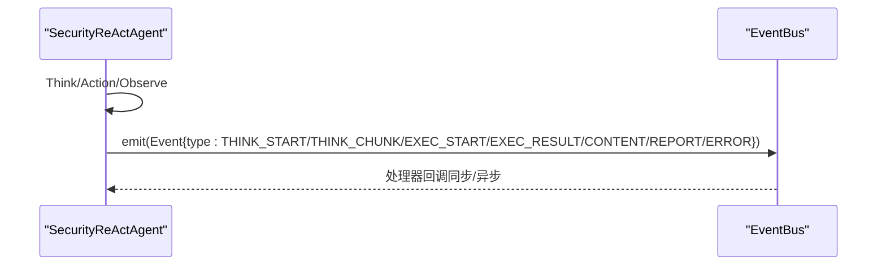
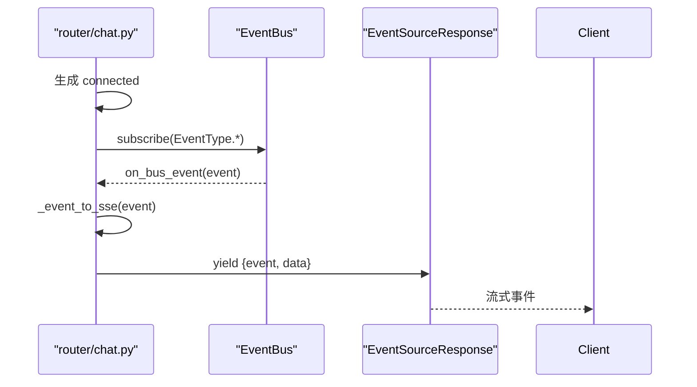
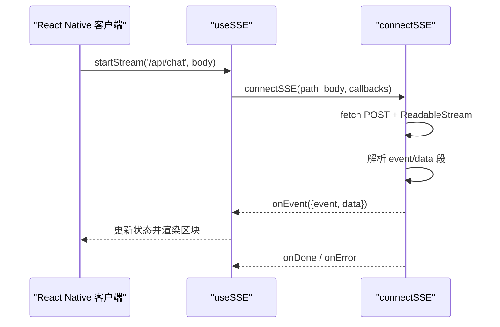
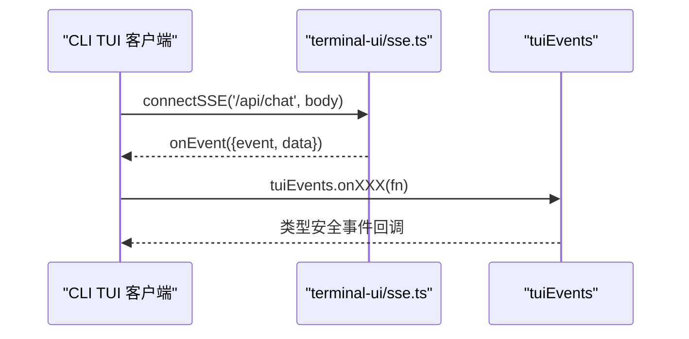
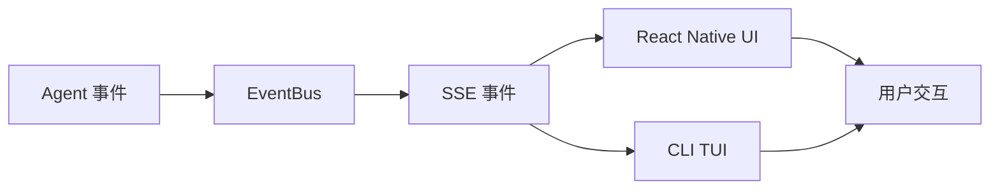
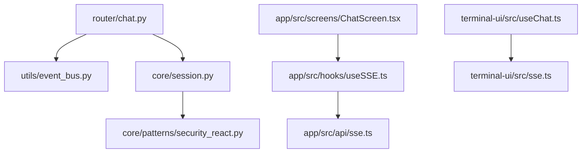

# 事件驱动架构

<cite>
**本文档引用的文件**
- [utils/event_bus.py](file://utils/event_bus.py)
- [router/chat.py](file://router/chat.py)
- [core/session.py](file://core/session.py)
- [core/patterns/security_react.py](file://core/patterns/security_react.py)
- [app/src/api/sse.ts](file://app/src/api/sse.ts)
- [app/src/hooks/useSSE.ts](file://app/src/hooks/useSSE.ts)
- [app/src/screens/ChatScreen.tsx](file://app/src/screens/ChatScreen.tsx)
- [terminal-ui/src/sse.ts](file://terminal-ui/src/sse.ts)
- [terminal-ui/src/useChat.ts](file://terminal-ui/src/useChat.ts)
- [terminal-ui/src/events.ts](file://terminal-ui/src/events.ts)
- [router/schemas.py](file://router/schemas.py)
- [terminal-ui/scripts/check-connection.mts](file://terminal-ui/scripts/check-connection.mts)
</cite>

## 目录
1. [简介](#简介)
2. [项目结构](#项目结构)
3. [核心组件](#核心组件)
4. [架构总览](#架构总览)
5. [详细组件分析](#详细组件分析)
6. [依赖分析](#依赖分析)
7. [性能考虑](#性能考虑)
8. [故障排查指南](#故障排查指南)
9. [结论](#结论)
10. [附录](#附录)

## 简介
本文件系统性阐述 Secbot 的事件驱动架构，围绕以下主题展开：
- EventBus 事件总线的设计与实现：事件类型定义、订阅/发布机制、同步与异步处理。
- SSE（Server-Sent Events）流式通信：事件流建立、事件格式、客户端连接管理与超时处理。
- 异步事件处理与事件传播路径：从 Agent 到 EventBus，再到 SSE 事件映射与前端渲染。
- 扩展指南：如何新增事件类型与处理器。

该架构通过 EventBus 解耦 Agent 层与 UI 层，借助 SSE 将后端推理与执行过程实时推送到前端，形成清晰的事件驱动闭环。

## 项目结构
Secbot 的事件驱动架构横跨后端 Python 与前端 TypeScript/React Native 两部分：
- 后端：FastAPI 路由负责接收请求，SessionManager 编排交互，SecurityReActAgent 产生事件，EventBus 负责事件分发，最终通过 SSE 输出到前端。
- 前端：React Native 侧使用 useSSE Hook 与 SSE 客户端连接后端，ChatScreen 根据事件类型渲染不同区块；CLI TUI 侧使用 terminal-ui 的 SSE 客户端与事件总线。

图表来源
- [router/chat.py](file://router/chat.py#L134-L271)
- [core/session.py](file://core/session.py#L139-L422)
- [core/patterns/security_react.py](file://core/patterns/security_react.py#L227-L278)
- [utils/event_bus.py](file://utils/event_bus.py#L68-L186)
- [app/src/api/sse.ts](file://app/src/api/sse.ts#L50-L163)
- [app/src/hooks/useSSE.ts](file://app/src/hooks/useSSE.ts#L9-L50)
- [app/src/screens/ChatScreen.tsx](file://app/src/screens/ChatScreen.tsx#L131-L376)
- [terminal-ui/src/sse.ts](file://terminal-ui/src/sse.ts#L33-L133)
- [terminal-ui/src/useChat.ts](file://terminal-ui/src/useChat.ts#L31-L218)
- [terminal-ui/src/events.ts](file://terminal-ui/src/events.ts#L18-L92)

章节来源
- [router/chat.py](file://router/chat.py#L1-L329)
- [core/session.py](file://core/session.py#L1-L866)
- [core/patterns/security_react.py](file://core/patterns/security_react.py#L1-L800)
- [utils/event_bus.py](file://utils/event_bus.py#L1-L187)
- [app/src/api/sse.ts](file://app/src/api/sse.ts#L1-L164)
- [app/src/hooks/useSSE.ts](file://app/src/hooks/useSSE.ts#L1-L50)
- [app/src/screens/ChatScreen.tsx](file://app/src/screens/ChatScreen.tsx#L1-L753)
- [terminal-ui/src/sse.ts](file://terminal-ui/src/sse.ts#L1-L134)
- [terminal-ui/src/useChat.ts](file://terminal-ui/src/useChat.ts#L1-L219)
- [terminal-ui/src/events.ts](file://terminal-ui/src/events.ts#L1-L92)

## 核心组件
- 事件总线（EventBus）：Python 实现的轻量级发布-订阅系统，支持同步与异步事件处理，提供便捷的 emit/emit_async 方法。
- 事件类型（EventType）：统一定义事件类别，涵盖规划、推理、执行、内容、报告、任务状态、交互控制、UI 反馈等。
- 会话管理器（SessionManager）：编排交互流程，将 Agent 的事件桥接到 EventBus，并驱动 SSE 输出。
- 智能体引擎（SecurityReActAgent）：ReAct 推理循环，通过 _emit_event 将事件映射到 EventBus。
- SSE 客户端与 Hook：前端通过 connectSSE 与 useSSE 接收后端事件流，ChatScreen/CLI TUI 根据事件类型渲染 UI。
- 事件映射：后端将 EventBus 事件映射为 SSE 事件名（如 thought_start、action_result 等），前端据此更新状态与区块。

章节来源
- [utils/event_bus.py](file://utils/event_bus.py#L15-L62)
- [router/chat.py](file://router/chat.py#L33-L131)
- [core/session.py](file://core/session.py#L532-L682)
- [core/patterns/security_react.py](file://core/patterns/security_react.py#L227-L278)
- [app/src/api/sse.ts](file://app/src/api/sse.ts#L19-L94)
- [app/src/hooks/useSSE.ts](file://app/src/hooks/useSSE.ts#L9-L50)
- [app/src/screens/ChatScreen.tsx](file://app/src/screens/ChatScreen.tsx#L131-L376)
- [terminal-ui/src/sse.ts](file://terminal-ui/src/sse.ts#L14-L109)

## 架构总览
事件驱动架构的关键流程如下：
1. 客户端发起 /api/chat 请求，后端创建 EventBus 并启动事件生成器。
2. SessionManager 调用 Agent 执行推理与工具调用，期间通过 EventBus 发布事件。
3. 后端将 EventBus 事件映射为 SSE 事件，推送至客户端。
4. 前端使用 SSE 客户端解析事件，更新 UI 状态与渲染区块。
5. CLI TUI 使用独立的 SSE 客户端与事件总线，实现与 Web 端一致的事件驱动体验。

图表来源
- [router/chat.py](file://router/chat.py#L134-L271)
- [core/session.py](file://core/session.py#L139-L422)
- [core/patterns/security_react.py](file://core/patterns/security_react.py#L227-L278)
- [utils/event_bus.py](file://utils/event_bus.py#L121-L155)
- [app/src/screens/ChatScreen.tsx](file://app/src/screens/ChatScreen.tsx#L131-L376)

## 详细组件分析

### 事件总线（EventBus）
- 设计理念：轻量、解耦、支持同步与异步处理器，便于在 Agent 与 UI 之间传递状态与中间结果。
- 事件类型：通过枚举定义，覆盖规划、推理、执行、内容、报告、任务状态、交互控制、UI 反馈等。
- 订阅/取消订阅：支持按事件类型订阅与全局订阅，支持取消订阅。
- 发射机制：
  - 同步发射：遍历全局处理器与目标事件处理器，捕获异常并记录日志。
  - 异步发射：支持协程处理器，逐个 await。
- 便捷方法：emit_simple/emit_simple_async，简化常用事件发射。

图表来源
- [utils/event_bus.py](file://utils/event_bus.py#L68-L186)

章节来源
- [utils/event_bus.py](file://utils/event_bus.py#L15-L186)

### 事件类型与事件对象
- 事件类型（EventType）：集中定义，便于前后端对齐与扩展。
- 事件对象（Event）：包含类型、数据、时间戳与迭代号，用于携带上下文信息。

章节来源
- [utils/event_bus.py](file://utils/event_bus.py#L15-L62)

### 会话管理器（SessionManager）与事件桥接
- 职责：管理会话生命周期、路由请求、编排规划/执行/摘要流程、桥接 Agent 事件到 EventBus。
- 事件桥接：将 Agent 的 on_event 回调转换为 EventBus 事件，自动更新计划 TODO 状态，驱动 UI 状态指示器。
- 与前端对齐：通过 _bridge_agent_event 与 _event_to_sse 保证事件语义一致。

图表来源
- [core/session.py](file://core/session.py#L532-L682)
- [router/chat.py](file://router/chat.py#L33-L131)

章节来源
- [core/session.py](file://core/session.py#L532-L682)
- [router/chat.py](file://router/chat.py#L33-L131)

### 智能体引擎（SecurityReActAgent）与事件发射
- ReAct 循环：Think -> Action -> Observation，期间通过 _emit_event 发射 thought_start/thought_chunk/thought/action_start/action_result/content/report/error 等事件。
- 事件映射：将事件类型映射到 EventBus 的 EventType，统一由 SessionManager 桥接。
- 并发控制：每个 Agent 可拥有并发锁，保证同一 Agent 的任务串行执行。

图表来源
- [core/patterns/security_react.py](file://core/patterns/security_react.py#L227-L278)
- [utils/event_bus.py](file://utils/event_bus.py#L121-L155)

章节来源
- [core/patterns/security_react.py](file://core/patterns/security_react.py#L227-L278)

### SSE 流式通信（后端）
- 事件生成器：先发送 connected 首包，随后订阅 EventBus 事件，将事件映射为 SSE 事件并写入队列，最终由 EventSourceResponse 产出。
- 事件映射：PLAN_START/THINK_START/THINK_CHUNK/THINK_END/EXEC_START/EXEC_RESULT/CONTENT/REPORT_END/TASK_PHASE/ROOT_REQUIRED/ERROR 等映射为 planning/thought_start/thought_chunk/thought/action_start/action_result/content/report/phase/root_required/error 等。
- 错误处理：异常通过 error 事件推送，done 事件用于结束流。

图表来源
- [router/chat.py](file://router/chat.py#L134-L271)

章节来源
- [router/chat.py](file://router/chat.py#L134-L271)

### SSE 流式通信（前端：React Native）
- 客户端：connectSSE 通过 POST + ReadableStream 建立 SSE 连接，解析 event/data 段，支持分块与多行 data。
- 超时控制：15 秒连接超时，未收到事件则 abort 并触发 onError。
- Hook：useSSE 封装连接生命周期，暴露 startStream/stopStream，回调 onEvent/onDone/onError。
- UI 渲染：ChatScreen 根据事件类型渲染 planning/thinking/execution/exec_result/observation/report/response/error/phase 等区块。

图表来源
- [app/src/api/sse.ts](file://app/src/api/sse.ts#L50-L163)
- [app/src/hooks/useSSE.ts](file://app/src/hooks/useSSE.ts#L9-L50)
- [app/src/screens/ChatScreen.tsx](file://app/src/screens/ChatScreen.tsx#L131-L376)

章节来源
- [app/src/api/sse.ts](file://app/src/api/sse.ts#L1-L164)
- [app/src/hooks/useSSE.ts](file://app/src/hooks/useSSE.ts#L1-L50)
- [app/src/screens/ChatScreen.tsx](file://app/src/screens/ChatScreen.tsx#L1-L753)

### SSE 流式通信（前端：CLI TUI）
- 客户端：terminal-ui/src/sse.ts 与 app/src/api/sse.ts 契约一致，适配 Node 环境。
- 事件总线：terminal-ui/src/events.ts 提供类型安全的事件定义与订阅/发布。
- 会话逻辑：terminal-ui/src/useChat.ts 管理流状态、事件处理与根权限请求。

图表来源
- [terminal-ui/src/sse.ts](file://terminal-ui/src/sse.ts#L33-L133)
- [terminal-ui/src/events.ts](file://terminal-ui/src/events.ts#L18-L92)
- [terminal-ui/src/useChat.ts](file://terminal-ui/src/useChat.ts#L31-L218)

章节来源
- [terminal-ui/src/sse.ts](file://terminal-ui/src/sse.ts#L1-L134)
- [terminal-ui/src/events.ts](file://terminal-ui/src/events.ts#L1-L92)
- [terminal-ui/src/useChat.ts](file://terminal-ui/src/useChat.ts#L1-L219)

### 事件传播路径与处理流程
- 后端：Agent -> EventBus -> SSE -> 客户端。
- 前端：SSE 事件 -> UI 渲染区块 -> 用户交互（如 root 权限确认）。
- CLI TUI：SSE 事件 -> tuiEvents -> 控制台渲染。

图表来源
- [core/patterns/security_react.py](file://core/patterns/security_react.py#L227-L278)
- [utils/event_bus.py](file://utils/event_bus.py#L121-L155)
- [router/chat.py](file://router/chat.py#L134-L271)
- [app/src/screens/ChatScreen.tsx](file://app/src/screens/ChatScreen.tsx#L131-L376)
- [terminal-ui/src/sse.ts](file://terminal-ui/src/sse.ts#L33-L133)
- [terminal-ui/src/events.ts](file://terminal-ui/src/events.ts#L18-L92)

章节来源
- [core/patterns/security_react.py](file://core/patterns/security_react.py#L227-L278)
- [router/chat.py](file://router/chat.py#L134-L271)
- [app/src/screens/ChatScreen.tsx](file://app/src/screens/ChatScreen.tsx#L131-L376)
- [terminal-ui/src/sse.ts](file://terminal-ui/src/sse.ts#L33-L133)
- [terminal-ui/src/events.ts](file://terminal-ui/src/events.ts#L18-L92)

## 依赖分析
- 后端依赖关系：
  - router/chat.py 依赖 utils/event_bus.py、core/session.py、router/schemas.py。
  - core/session.py 依赖 utils/event_bus.py、core/patterns/security_react.py。
  - core/patterns/security_react.py 依赖 utils/event_bus.py。
- 前端依赖关系：
  - app/src/screens/ChatScreen.tsx 依赖 app/src/hooks/useSSE.ts。
  - app/src/hooks/useSSE.ts 依赖 app/src/api/sse.ts。
  - terminal-ui/src/useChat.ts 依赖 terminal-ui/src/sse.ts。
  - terminal-ui/src/sse.ts 依赖 terminal-ui/src/types.ts 与 terminal-ui/src/config.ts。

图表来源
- [router/chat.py](file://router/chat.py#L24-L25)
- [core/session.py](file://core/session.py#L28)
- [core/patterns/security_react.py](file://core/patterns/security_react.py#L14-L16)
- [app/src/hooks/useSSE.ts](file://app/src/hooks/useSSE.ts#L6)
- [app/src/api/sse.ts](file://app/src/api/sse.ts#L6)
- [app/src/screens/ChatScreen.tsx](file://app/src/screens/ChatScreen.tsx#L28)
- [terminal-ui/src/useChat.ts](file://terminal-ui/src/useChat.ts#L2)
- [terminal-ui/src/sse.ts](file://terminal-ui/src/sse.ts#L5)

章节来源
- [router/chat.py](file://router/chat.py#L1-L329)
- [core/session.py](file://core/session.py#L1-L866)
- [core/patterns/security_react.py](file://core/patterns/security_react.py#L1-L800)
- [app/src/hooks/useSSE.ts](file://app/src/hooks/useSSE.ts#L1-L50)
- [app/src/api/sse.ts](file://app/src/api/sse.ts#L1-L164)
- [app/src/screens/ChatScreen.tsx](file://app/src/screens/ChatScreen.tsx#L1-L753)
- [terminal-ui/src/useChat.ts](file://terminal-ui/src/useChat.ts#L1-L219)
- [terminal-ui/src/sse.ts](file://terminal-ui/src/sse.ts#L1-L134)

## 性能考虑
- 异步事件处理：EventBus 支持异步处理器，避免阻塞主线程；在 emit_async 中逐个 await，确保顺序与一致性。
- 流式读取：前端 SSE 客户端采用 ReadableStream 分块读取，降低内存压力，提升首包体验。
- 连接超时：前端设置 15 秒连接超时，及时中断无响应连接，释放资源。
- 事件映射：后端将复杂事件映射为简洁的 SSE 名称，减少传输开销。
- 并发控制：Agent 的并发锁避免同一 Agent 的任务并发执行，减少资源竞争与冲突。

## 故障排查指南
- 连接超时：
  - 前端：CONNECTION_TIMEOUT_MS 为 15 秒，未收到事件会触发 onError；检查后端是否正常启动、BASE_URL/SECBOT_API_URL 是否正确。
  - CLI：terminal-ui/scripts/check-connection.mts 用于验证 SSE 连接，收到 connected/done/error 事件即视为连通。
- 事件未到达：
  - 检查后端是否订阅了相应 EventType；确认 _event_to_sse 映射是否正确。
  - 检查前端是否正确解析 event/data 段，注意 normalizeSSEText 对 CRLF 的处理。
- 错误事件：
  - 后端异常通过 error 事件推送，前端捕获并渲染错误区块；检查后端日志与异常栈。
- 根权限请求：
  - 当事件为 root_required 时，前端弹窗并等待用户选择；通过 /api/chat/root-response 回传 action 与密码。

章节来源
- [app/src/api/sse.ts](file://app/src/api/sse.ts#L42-L43)
- [app/src/api/sse.ts](file://app/src/api/sse.ts#L115-L119)
- [terminal-ui/src/sse.ts](file://terminal-ui/src/sse.ts#L84-L88)
- [router/chat.py](file://router/chat.py#L274-L294)
- [terminal-ui/scripts/check-connection.mts](file://terminal-ui/scripts/check-connection.mts#L37-L60)

## 结论
Secbot 的事件驱动架构通过 EventBus 实现 Agent 与 UI 的解耦，结合 SSE 将推理与执行过程实时推送到前端，形成一致的交互体验。该架构具备良好的扩展性：新增事件类型只需在 EventType 中定义并在映射处对齐，即可在后端与前端协同工作。建议在扩展时遵循“事件命名约定、数据载荷规范化、错误事件统一处理”的最佳实践，确保系统的稳定性与可维护性。

## 附录
- 新增事件类型的扩展步骤
  1. 在 EventType 中添加新事件常量。
  2. 在后端 SessionManager 的 _event_to_sse 中添加映射规则。
  3. 在前端 ChatScreen/CLI TUI 中添加对应的事件处理分支与 UI 渲染。
  4. 如需异步处理，使用 EventBus.emit_async 并在处理器中 await。
  5. 编写测试用例验证事件传播路径与 UI 行为。

章节来源
- [utils/event_bus.py](file://utils/event_bus.py#L15-L62)
- [router/chat.py](file://router/chat.py#L33-L131)
- [app/src/screens/ChatScreen.tsx](file://app/src/screens/ChatScreen.tsx#L131-L376)
- [terminal-ui/src/useChat.ts](file://terminal-ui/src/useChat.ts#L74-L196)