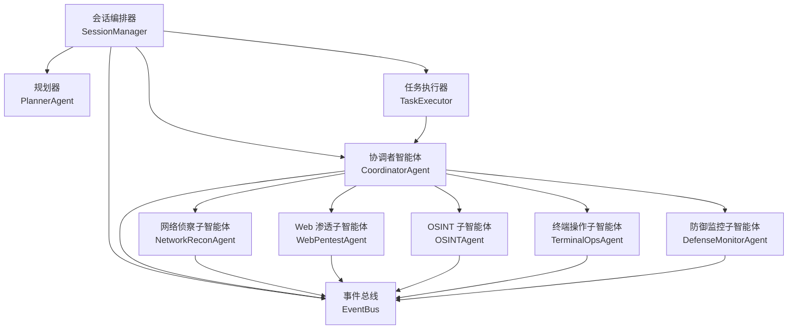
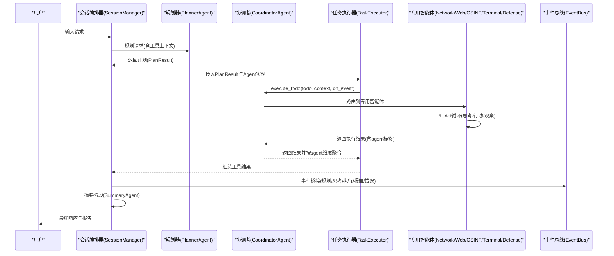
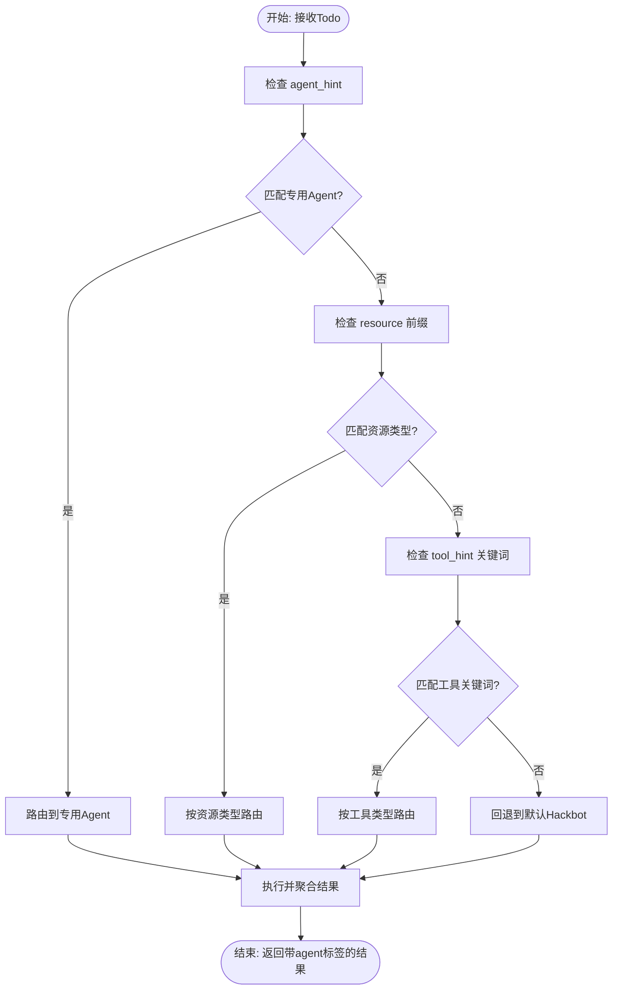
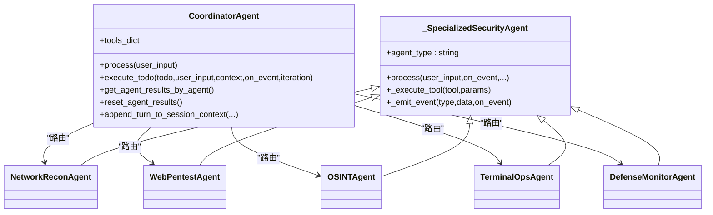
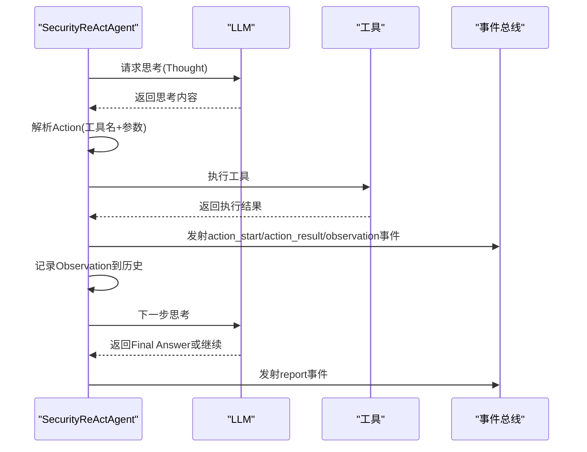
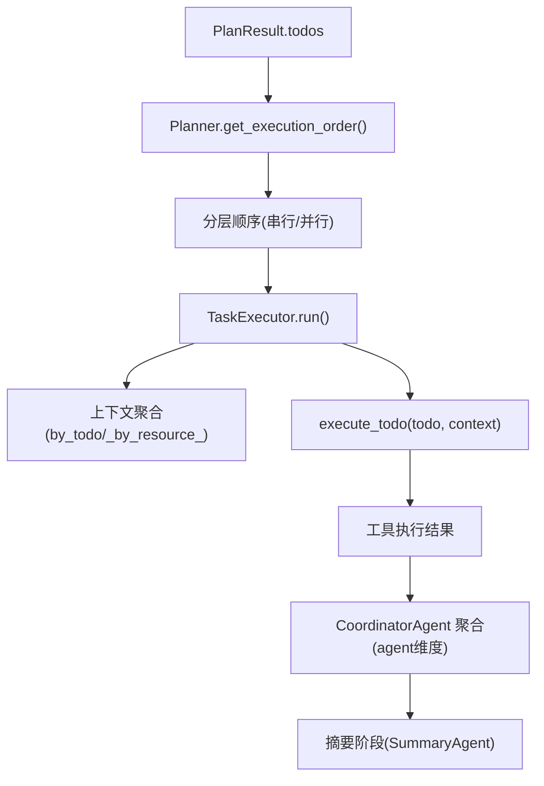
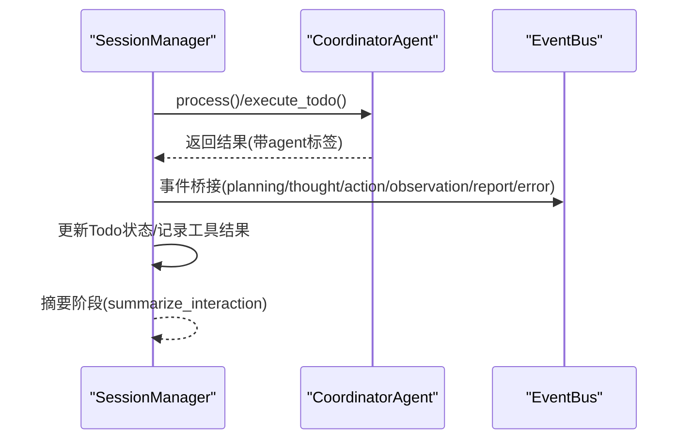
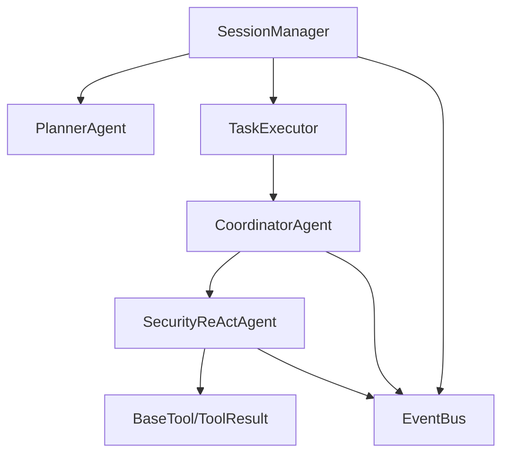

# 多智能体协作模式

<cite>
**本文引用的文件**
- [core/agents/coordinator_agent.py](file://core/agents/coordinator_agent.py)
- [core/agents/specialist_agents.py](file://core/agents/specialist_agents.py)
- [core/patterns/security_react.py](file://core/patterns/security_react.py)
- [core/session.py](file://core/session.py)
- [core/executor.py](file://core/executor.py)
- [core/models.py](file://core/models.py)
- [utils/event_bus.py](file://utils/event_bus.py)
- [router/dependencies.py](file://router/dependencies.py)
- [router/agents.py](file://router/agents.py)
- [terminal-ui/src/slash.ts](file://terminal-ui/src/slash.ts)
</cite>

## 目录
1. [简介](#简介)
2. [项目结构](#项目结构)
3. [核心组件](#核心组件)
4. [架构总览](#架构总览)
5. [详细组件分析](#详细组件分析)
6. [依赖分析](#依赖分析)
7. [性能考虑](#性能考虑)
8. [故障排查指南](#故障排查指南)
9. [结论](#结论)
10. [附录](#附录)

## 简介
本文件系统化阐述 Secbot 的多智能体协作模式，重点围绕协调者智能体（CoordinatorAgent）的路由策略、专用智能体（NetworkReconAgent、WebPentestAgent、OSINTAgent、TerminalOpsAgent、DefenseMonitorAgent）的职责分工，以及智能体间的通信机制、任务分配策略与结果聚合方式。文档同时解释 ReAct 模式在智能体中的应用，包括思考-行动-观察循环的实现，并提供协作流程图与新增智能体类型的扩展指引。

## 项目结构
Secbot 的多智能体协作以“会话编排器（SessionManager）—规划器（PlannerAgent）—核心智能体（SecurityReActAgent）—任务执行器（TaskExecutor）—事件总线（EventBus）”为主线，协调者智能体（CoordinatorAgent）作为 hackbot 的多子 Agent 协调入口，负责将单步 Todo 路由到合适的专用智能体，并聚合各 Agent 的工具执行结果供摘要阶段使用。

图表来源
- [core/session.py](file://core/session.py#L139-L422)
- [core/agents/coordinator_agent.py](file://core/agents/coordinator_agent.py#L40-L98)
- [core/agents/specialist_agents.py](file://core/agents/specialist_agents.py#L32-L245)
- [core/executor.py](file://core/executor.py#L17-L179)
- [utils/event_bus.py](file://utils/event_bus.py#L68-L187)

章节来源
- [core/session.py](file://core/session.py#L139-L422)
- [core/agents/coordinator_agent.py](file://core/agents/coordinator_agent.py#L40-L98)
- [core/agents/specialist_agents.py](file://core/agents/specialist_agents.py#L32-L245)
- [core/executor.py](file://core/executor.py#L17-L179)
- [utils/event_bus.py](file://utils/event_bus.py#L68-L187)

## 核心组件
- 协调者智能体（CoordinatorAgent）
  - 职责：对外作为 hackbot 智能体被会话编排器调用；在分层执行模式下，依据 Todo 的 agent_hint/resource/tool_hint 将单步执行委托给对应的专用子智能体；按 agent 维度聚合工具执行结果，供摘要阶段汇总。
  - 关键接口：process（兼容旧有 hackbot 行为）、execute_todo（分层执行入口）、tools_dict（工具聚合）、get_agent_results_by_agent/reset_agent_results（结果聚合与清理）、append_turn_to_session_context（会话摘要上下文注入）。
- 专用智能体（NetworkReconAgent/WebPentestAgent/OSINTAgent/TerminalOpsAgent/DefenseMonitorAgent）
  - 统一继承 SecurityReActAgent，复用 ReAct 能力，各自挂载专属工具集，并通过 agent_type 标记事件来源，便于前端按 Agent 维度渲染。
- 会话编排器（SessionManager）
  - 负责路由（问候/QA/技术）、规划（PlannerAgent）、核心 Agent 执行（SecurityReActAgent/Hackbot/SuperHackbot）、摘要（SummaryAgent）与事件桥接（EventBus）。
- 任务执行器（TaskExecutor）
  - 按 PlannerAgent 的依赖关系与资源/风险约束进行分层并行/串行执行，聚合上下文并触发事件。
- 事件总线（EventBus）
  - 解耦 Agent 层与 UI 层，统一发射/订阅事件，支撑前端流式渲染与状态反馈。

章节来源
- [core/agents/coordinator_agent.py](file://core/agents/coordinator_agent.py#L40-L213)
- [core/agents/specialist_agents.py](file://core/agents/specialist_agents.py#L32-L245)
- [core/session.py](file://core/session.py#L139-L422)
- [core/executor.py](file://core/executor.py#L17-L179)
- [utils/event_bus.py](file://utils/event_bus.py#L68-L187)

## 架构总览
多智能体协作的端到端流程如下：

图表来源
- [core/session.py](file://core/session.py#L139-L422)
- [core/executor.py](file://core/executor.py#L46-L133)
- [core/agents/coordinator_agent.py](file://core/agents/coordinator_agent.py#L130-L181)
- [core/patterns/security_react.py](file://core/patterns/security_react.py#L393-L628)
- [utils/event_bus.py](file://utils/event_bus.py#L121-L181)

章节来源
- [core/session.py](file://core/session.py#L139-L422)
- [core/executor.py](file://core/executor.py#L46-L133)
- [core/agents/coordinator_agent.py](file://core/agents/coordinator_agent.py#L130-L181)
- [core/patterns/security_react.py](file://core/patterns/security_react.py#L393-L628)
- [utils/event_bus.py](file://utils/event_bus.py#L121-L181)

## 详细组件分析

### 协调者智能体（CoordinatorAgent）与路由策略
- 路由决策三要素：agent_hint > resource 前缀 > tool_hint 关键词
  - agent_hint 优先：如 "network_recon"、"web_pentest"、"osint"、"terminal_ops"、"defense_monitor"。
  - resource 前缀兜底：host:/subnet:/ip: → 网络；web: → Web；domain:/osint: → OSINT。
  - tool_hint 关键词兜底：根据关键词集合匹配到对应专用智能体。
- 回退机制：若无法匹配，回退到默认 Hackbot（兼容旧有行为）。
- 结果聚合：为每个结果打上 agent 标签，并按 agent 维度累积，供摘要阶段使用。
- 会话上下文：支持将本轮摘要式上下文注入到所有子智能体，提升连续任务的上下文一致性。

图表来源
- [core/agents/coordinator_agent.py](file://core/agents/coordinator_agent.py#L242-L330)

章节来源
- [core/agents/coordinator_agent.py](file://core/agents/coordinator_agent.py#L130-L181)
- [core/agents/coordinator_agent.py](file://core/agents/coordinator_agent.py#L242-L330)

### 专用智能体职责分工与工具集
- NetworkReconAgent：网络资产枚举与基础探测，工具集包含核心安全工具与网络专用工具。
- WebPentestAgent：Web 站点与 API 的基础安全测试，工具集包含 Web 专用工具。
- OSINTAgent：外部情报与资产信息收集，工具集包含 OSINT 与 WebResearch 工具。
- TerminalOpsAgent：授权主机上的终端会话与命令执行，工具集为终端会话工具。
- DefenseMonitorAgent：本机/网络防御与巡检，工具集为防御类工具。

图表来源
- [core/agents/coordinator_agent.py](file://core/agents/coordinator_agent.py#L40-L98)
- [core/agents/specialist_agents.py](file://core/agents/specialist_agents.py#L32-L245)

章节来源
- [core/agents/specialist_agents.py](file://core/agents/specialist_agents.py#L66-L236)

### ReAct 模式在智能体中的应用
- 思考（Think）：调用 LLM 生成下一步推理与计划。
- 行动（Action）：解析 LLM 输出的工具调用，执行工具并记录结果。
- 观察（Observation）：格式化工具执行结果，写入 ReAct 历史。
- 报告（Report）：在任务完成或达到最大迭代次数时，由摘要智能体生成结构化报告。
- 事件发射：在每个阶段通过事件总线发射事件，前端可流式渲染。

图表来源
- [core/patterns/security_react.py](file://core/patterns/security_react.py#L393-L628)
- [utils/event_bus.py](file://utils/event_bus.py#L121-L181)

章节来源
- [core/patterns/security_react.py](file://core/patterns/security_react.py#L142-L190)
- [core/patterns/security_react.py](file://core/patterns/security_react.py#L393-L628)
- [utils/event_bus.py](file://utils/event_bus.py#L121-L181)

### 任务分配策略与结果聚合
- 任务分配：TaskExecutor 根据 PlannerAgent 的依赖关系与资源/风险约束，生成分层执行顺序（串行层与并行层），并在每层内并发执行。
- 上下文聚合：TaskExecutor 将已完成的 Todo 结果按 todo_id 与 resource 聚合，供后续步骤引用。
- 结果聚合：CoordinatorAgent 将各专用智能体的执行结果按 agent 维度累积，供摘要阶段统一呈现。

图表来源
- [core/executor.py](file://core/executor.py#L46-L133)
- [core/executor.py](file://core/executor.py#L135-L179)
- [core/agents/coordinator_agent.py](file://core/agents/coordinator_agent.py#L177-L181)

章节来源
- [core/executor.py](file://core/executor.py#L46-L133)
- [core/executor.py](file://core/executor.py#L135-L179)
- [core/agents/coordinator_agent.py](file://core/agents/coordinator_agent.py#L177-L181)

### 会话编排与事件桥接
- SessionManager 负责路由（问候/QA/技术）、规划、执行、摘要与事件桥接。
- 事件桥接：将智能体的 on_event 回调转发到 EventBus，同时自动更新 Todo 状态与脚本格式化。
- 并发控制：若 Agent 实例存在并发锁，则在锁内串行执行整个任务，避免并发冲突。

图表来源
- [core/session.py](file://core/session.py#L324-L422)
- [utils/event_bus.py](file://utils/event_bus.py#L121-L181)

章节来源
- [core/session.py](file://core/session.py#L324-L422)
- [utils/event_bus.py](file://utils/event_bus.py#L121-L181)

### 智能体路由与会话管理
- 智能体路由：后端通过依赖注入创建 CoordinatorAgent 与 SuperHackbotAgent，并为智能体注入数据库记忆。
- 会话管理：支持切换/新建会话，记录消息历史，按 agent 类型选择实例。
- 前端交互：终端 UI 通过斜杠命令切换 agent 模式（/agent hackbot|superhackbot）与模式（/ask|/task）。

章节来源
- [router/dependencies.py](file://router/dependencies.py#L70-L90)
- [core/session.py](file://core/session.py#L81-L133)
- [terminal-ui/src/slash.ts](file://terminal-ui/src/slash.ts#L146-L164)

## 依赖分析
- 组件耦合与内聚
  - CoordinatorAgent 与专用智能体通过 SecurityReActAgent 统一协议（execute_todo/process）耦合，内聚于 ReAct 循环与事件发射。
  - SessionManager 与 TaskExecutor 通过 PlanResult 与 TodoItem 解耦，依赖 PlannerAgent 的执行顺序与资源/风险约束。
  - EventBus 作为解耦层，被 SessionManager、CoordinatorAgent、专用智能体广泛使用。
- 外部依赖与集成点
  - LLM 推理后端（Ollama/OpenAI/Anthropic/Google 等）通过 _create_llm 统一创建。
  - 工具系统通过 BaseTool 与 ToolResult 标准化，支持 LangChain 包装与工具绑定。
- 潜在循环依赖
  - 未见直接循环依赖；CoordinatorAgent 与专用智能体通过继承与组合关系松耦合。

图表来源
- [core/agents/coordinator_agent.py](file://core/agents/coordinator_agent.py#L40-L98)
- [core/patterns/security_react.py](file://core/patterns/security_react.py#L142-L190)
- [core/session.py](file://core/session.py#L32-L76)
- [core/executor.py](file://core/executor.py#L17-L37)
- [utils/event_bus.py](file://utils/event_bus.py#L68-L187)

章节来源
- [core/agents/coordinator_agent.py](file://core/agents/coordinator_agent.py#L40-L98)
- [core/patterns/security_react.py](file://core/patterns/security_react.py#L142-L190)
- [core/session.py](file://core/session.py#L32-L76)
- [core/executor.py](file://core/executor.py#L17-L37)
- [utils/event_bus.py](file://utils/event_bus.py#L68-L187)

## 性能考虑
- 并发与串行
  - TaskExecutor 在每层内使用 asyncio.gather 并发执行，串行层顺序执行，兼顾吞吐与安全性。
  - CoordinatorAgent 与专用智能体均内置并发锁，确保同一 Agent 的任务串行执行，避免资源竞争。
- 事件流式渲染
  - 通过 EventBus 的事件桥接，前端可线性渲染规划、思考、执行与报告，降低首屏延迟。
- LLM 调用
  - 统一的 _create_llm 与超时控制，避免阻塞；对不支持工具绑定的模型自动降级为提示词方式。
- 上下文压缩
  - 会话摘要上下文按字符长度限制滚动裁剪，防止上下文溢出。

## 故障排查指南
- 事件发射异常
  - EventBus 在事件处理器抛错时记录日志，不影响整体流程；检查处理器实现与事件类型映射。
- LLM 调用失败
  - _create_llm 对不同后端进行异常捕获与提示，检查推理后端配置与网络连通性。
- 工具执行失败
  - SecurityReActAgent 在工具执行失败时记录 error 并触发 observation 事件；检查工具参数与敏感度标记。
- 会话上下文异常
  - append_turn_to_session_context 采用防御性 try-except，避免单个 Agent 出错影响整体；检查摘要内容拼接逻辑。
- 智能体路由失败
  - CoordinatorAgent 在无法匹配时回退到默认 Hackbot；检查 Todo 的 agent_hint/resource/tool_hint 是否合理。

章节来源
- [utils/event_bus.py](file://utils/event_bus.py#L121-L181)
- [core/patterns/security_react.py](file://core/patterns/security_react.py#L319-L390)
- [core/agents/coordinator_agent.py](file://core/agents/coordinator_agent.py#L234-L236)
- [core/session.py](file://core/session.py#L404-L412)

## 结论
Secbot 的多智能体协作模式通过“规划—路由—执行—聚合—摘要”的闭环，实现了复杂安全任务的自动化与可视化。CoordinatorAgent 作为 hackbot 的多子 Agent 协调入口，结合专用智能体的职责分工与 ReAct 循环，既能保障执行效率，又能提供可解释的思考过程与可追溯的工具调用结果。事件总线与会话编排器进一步解耦了前后端与各组件，为扩展与维护提供了清晰的边界。

## 附录

### 新增智能体类型扩展指引
- 步骤
  - 定义专用智能体：继承 _SpecializedSecurityAgent，设置 agent_type 与专属 system_prompt、tools 列表。
  - 注册到 CoordinatorAgent：在 _select_sub_agent 中增加路由规则，支持 agent_hint/resource/tool_hint 匹配。
  - 注入到会话管理：在依赖注入处将新智能体加入 agents 映射，确保 SessionManager 可解析与缓存。
  - 前端适配：如需在 UI 中区分新智能体，可在事件桥接与 UI 组件中补充 agent 标签渲染逻辑。
- 示例路径
  - 专用智能体模板与工具集挂载：[core/agents/specialist_agents.py](file://core/agents/specialist_agents.py#L32-L95)
  - 协调者路由扩展：[core/agents/coordinator_agent.py](file://core/agents/coordinator_agent.py#L242-L330)
  - 依赖注入注册：[router/dependencies.py](file://router/dependencies.py#L70-L90)
  - 智能体列表 API：[router/agents.py](file://router/agents.py#L18-L31)

章节来源
- [core/agents/specialist_agents.py](file://core/agents/specialist_agents.py#L32-L95)
- [core/agents/coordinator_agent.py](file://core/agents/coordinator_agent.py#L242-L330)
- [router/dependencies.py](file://router/dependencies.py#L70-L90)
- [router/agents.py](file://router/agents.py#L18-L31)