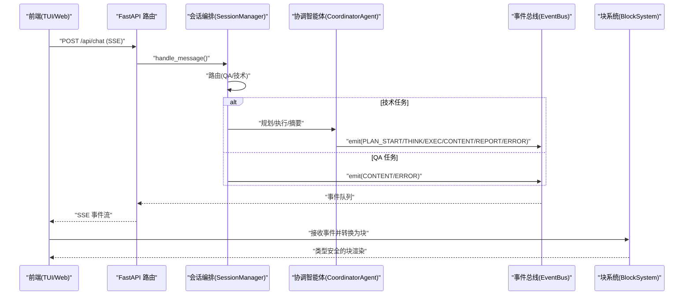
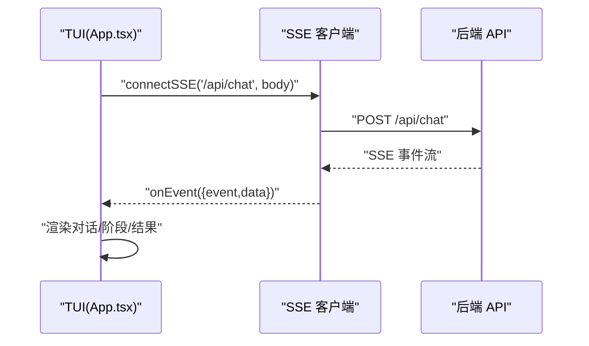
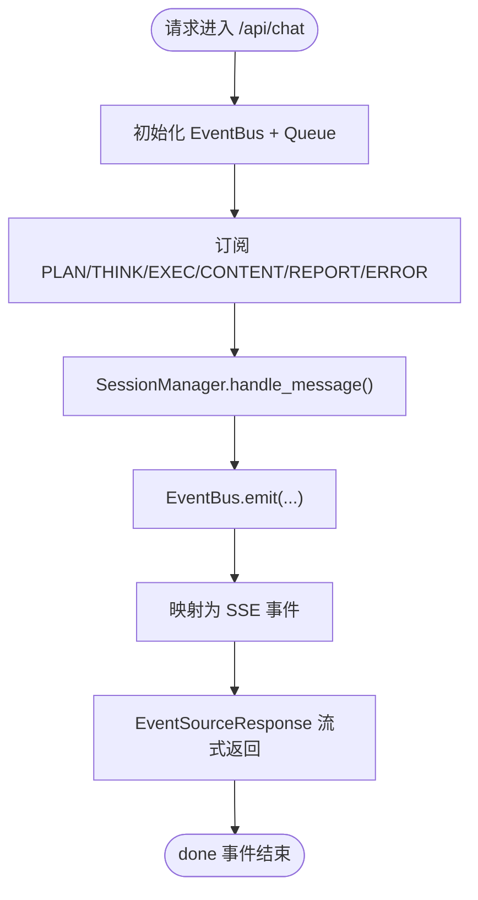
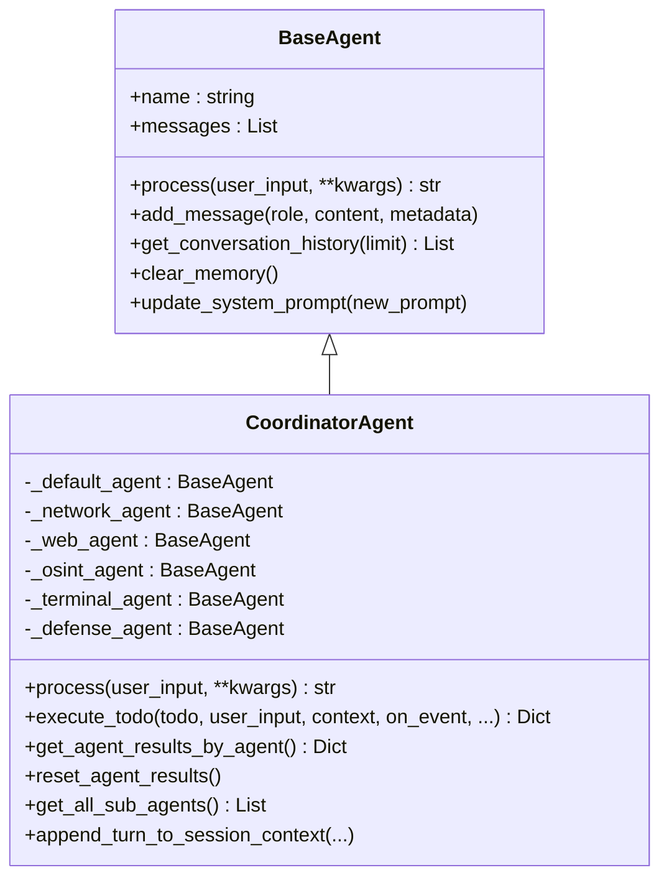
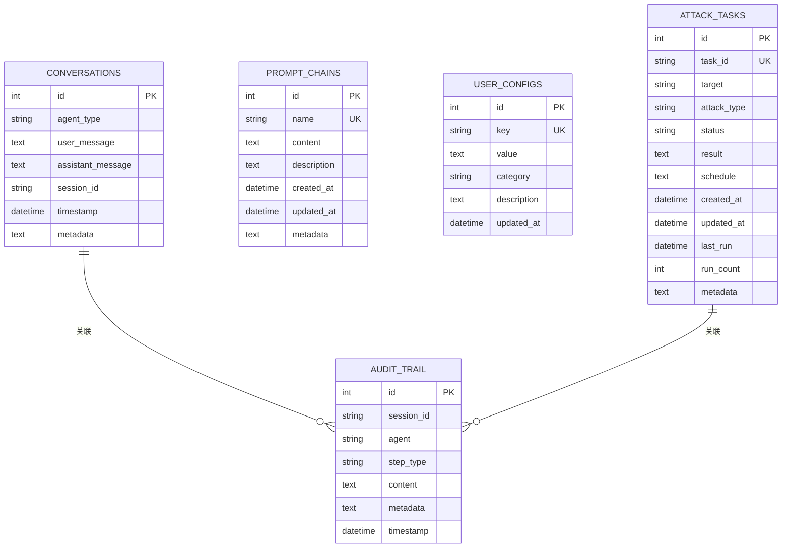
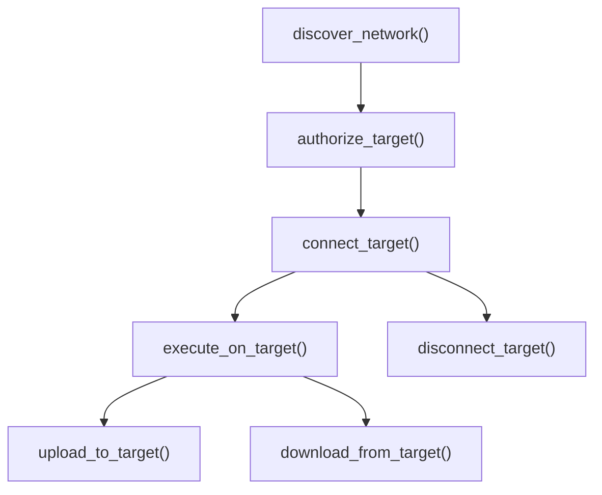
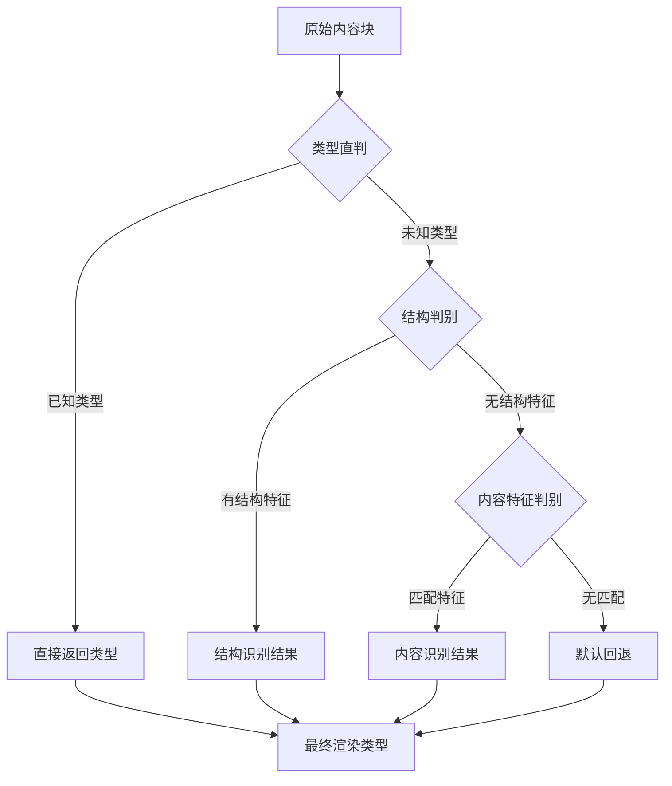
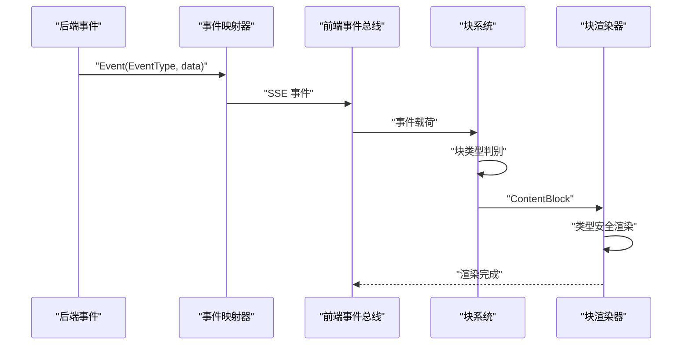
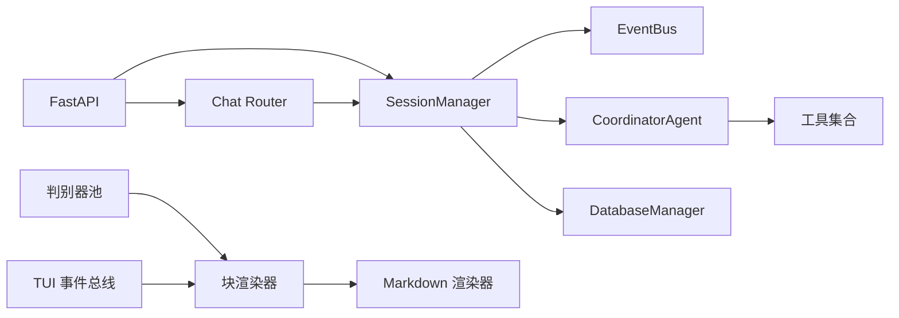

# 技术架构概览

<cite>
**本文引用的文件**
- [main.py](file://main.py)
- [router/main.py](file://router/main.py)
- [router/chat.py](file://router/chat.py)
- [terminal-ui/src/App.tsx](file://terminal-ui/src/App.tsx)
- [app/src/api/sse.ts](file://app/src/api/sse.ts)
- [terminal-ui/src/sse.ts](file://terminal-ui/src/sse.ts)
- [core/session.py](file://core/session.py)
- [utils/event_bus.py](file://utils/event_bus.py)
- [core/agents/coordinator_agent.py](file://core/agents/coordinator_agent.py)
- [core/agents/base.py](file://core/agents/base.py)
- [database/manager.py](file://database/manager.py)
- [controller/controller.py](file://controller/controller.py)
- [hackbot/launch_tui.py](file://hackbot/launch_tui.py)
- [docs/design-paradigms/session-and-events.md](file://docs/design-paradigms/session-and-events.md)
- [terminal-ui/src/blockDiscriminators/types.ts](file://terminal-ui/src/blockDiscriminators/types.ts)
- [terminal-ui/src/blockDiscriminators/discriminators.ts](file://terminal-ui/src/blockDiscriminators/discriminators.ts)
- [terminal-ui/src/blockDiscriminators/pool.ts](file://terminal-ui/src/blockDiscriminators/pool.ts)
- [terminal-ui/src/types.ts](file://terminal-ui/src/types.ts)
- [terminal-ui/src/events.ts](file://terminal-ui/src/events.ts)
- [terminal-ui/src/components/blocks/BlockRenderer.tsx](file://terminal-ui/src/components/blocks/BlockRenderer.tsx)
- [terminal-ui/src/components/ContentBlock.tsx](file://terminal-ui/src/components/ContentBlock.tsx)
- [terminal-ui/src/renderMarkdown.ts](file://terminal-ui/src/renderMarkdown.ts)
</cite>

## 更新摘要
**所做更改**
- 新增块类型系统与消息块判别机制章节
- 更新事件流机制与类型元数据支持章节
- 增强前端渲染架构与组件交互关系说明
- 完善类型安全的事件总线与块渲染系统

## 目录
1. [简介](#简介)
2. [项目结构](#项目结构)
3. [核心组件](#核心组件)
4. [架构总览](#架构总览)
5. [详细组件分析](#详细组件分析)
6. [块类型系统与消息块判别](#块类型系统与消息块判别)
7. [事件流机制与类型元数据](#事件流机制与类型元数据)
8. [依赖关系分析](#依赖关系分析)
9. [性能考量](#性能考量)
10. [故障排查指南](#故障排查指南)
11. [结论](#结论)
12. [附录](#附录)

## 简介
本文件为 Secbot 的技术架构概览，围绕事件驱动与多智能体协作展开，系统性阐述从前端入口层、后端路由层、多智能体协调层、工具层、存储层到控制层的整体设计与实现。重点说明前后端分离、SSE 流式通信、会话管理与事件总线解耦等关键技术决策，并给出架构图与组件交互关系说明，同时讨论扩展性与性能优化策略及架构演进方向。

**更新** 本次更新重点反映了新增的块类型系统、事件流机制和类型元数据支持等架构改进，增强了前端渲染的类型安全性和可扩展性。

## 项目结构
Secbot 采用前后端分离架构：
- 后端：FastAPI 服务，提供 REST + SSE 接口，负责会话编排、事件驱动与多智能体协作。
- 前端：Terminal UI（Node Ink/TUI）与 Web App（React/React Native）双入口，通过 SSE 与后端实时通信。
- 控制层：内网发现、授权与远程控制，统一由主控制器协调。
- 存储层：SQLite 数据库存储会话、提示词链、用户配置、审计轨迹等。

```mermaid
graph TB
subgraph "前端"
TUI["Terminal UI<br/>App.tsx"]
Web["Web App<br/>React/TS"]
BlockSystem["块类型系统<br/>BlockDiscriminators"]
BlockRenderer["块渲染器<br/>BlockRenderer"]
Markdown["Markdown 渲染<br/>renderMarkdown"]
end
subgraph "后端"
API["FastAPI 应用<br/>router/main.py"]
Chat["聊天路由<br/>router/chat.py"]
SM["会话编排<br/>core/session.py"]
EB["事件总线<br/>utils/event_bus.py"]
CA["协调智能体<br/>core/agents/coordinator_agent.py"]
DB["数据库管理<br/>database/manager.py"]
end
subgraph "控制层"
MC["主控制器<br/>controller/controller.py"]
end
TUI --> |"SSE"/"REST"| API
Web --> |"SSE"/"REST"| API
API --> Chat
Chat --> SM
SM --> EB
SM --> CA
CA --> |"工具调用/执行"| EB
SM --> DB
MC -.->|"内网发现/授权/控制"| SM
BlockSystem --> BlockRenderer
BlockRenderer --> Markdown
```

**图表来源**
- [router/main.py:19-71](file://router/main.py#L19-L71)
- [router/chat.py:27-329](file://router/chat.py#L27-L329)
- [core/session.py:32-122](file://core/session.py#L32-L122)
- [utils/event_bus.py:68-187](file://utils/event_bus.py#L68-L187)
- [core/agents/coordinator_agent.py:40-98](file://core/agents/coordinator_agent.py#L40-L98)
- [database/manager.py:26-74](file://database/manager.py#L26-L74)
- [controller/controller.py:14-24](file://controller/controller.py#L14-L24)
- [terminal-ui/src/blockDiscriminators/types.ts:1-10](file://terminal-ui/src/blockDiscriminators/types.ts#L1-L10)
- [terminal-ui/src/components/blocks/BlockRenderer.tsx:1-250](file://terminal-ui/src/components/blocks/BlockRenderer.tsx#L1-L250)

**章节来源**
- [router/main.py:19-71](file://router/main.py#L19-L71)
- [hackbot/launch_tui.py:291-343](file://hackbot/launch_tui.py#L291-L343)

## 核心组件
- 前端入口层
  - Terminal UI：基于 Ink 的 TUI，负责命令面板、对话视图与事件订阅。
  - Web App：React/TS 应用，提供浏览器端交互与 SSE 客户端。
- 后端路由层
  - FastAPI 应用工厂，注册路由、CORS、健康检查与数据库初始化。
  - 聊天路由：封装交互编排，将 EventBus 事件映射为 SSE 事件流。
- 多智能体协调层
  - 协调智能体：根据 Todo/资源/工具提示选择专用子智能体，聚合结果供摘要。
  - 基础智能体：统一的消息历史、系统提示词与抽象接口。
- 工具层
  - 丰富的安全工具集合，按类别组织，支持注册与动态加载。
- 存储层
  - SQLite 管理器：会话、提示词链、用户配置、审计轨迹等表结构与 CRUD。
- 控制层
  - 主控制器：内网发现、授权管理、远程控制与会话管理。
- **新增** 块类型系统
  - 消息块类型判别器：支持按类型、内容特征和结构特征的多策略判别。
  - 块渲染器：统一的块渲染组件系统，支持 20+ 种渲染类型。
  - 类型安全的事件总线：前端应用内事件的类型安全实现。

**章节来源**
- [terminal-ui/src/App.tsx:26-202](file://terminal-ui/src/App.tsx#L26-L202)
- [app/src/api/sse.ts:50-164](file://app/src/api/sse.ts#L50-L164)
- [terminal-ui/src/sse.ts:33-134](file://terminal-ui/src/sse.ts#L33-L134)
- [router/main.py:19-71](file://router/main.py#L19-L71)
- [router/chat.py:27-329](file://router/chat.py#L27-L329)
- [core/agents/coordinator_agent.py:40-98](file://core/agents/coordinator_agent.py#L40-L98)
- [core/agents/base.py:17-125](file://core/agents/base.py#L17-L125)
- [database/manager.py:26-203](file://database/manager.py#L26-L203)
- [controller/controller.py:14-245](file://controller/controller.py#L14-L245)
- [terminal-ui/src/blockDiscriminators/types.ts:1-10](file://terminal-ui/src/blockDiscriminators/types.ts#L1-L10)
- [terminal-ui/src/blockDiscriminators/discriminators.ts:1-63](file://terminal-ui/src/blockDiscriminators/discriminators.ts#L1-L63)
- [terminal-ui/src/blockDiscriminators/pool.ts:1-50](file://terminal-ui/src/blockDiscriminators/pool.ts#L1-L50)
- [terminal-ui/src/components/blocks/BlockRenderer.tsx:1-250](file://terminal-ui/src/components/blocks/BlockRenderer.tsx#L1-L250)

## 架构总览
Secbot 采用"事件驱动 + 会话编排"的核心范式：
- 事件驱动：通过 EventBus 解耦核心智能体与 UI，统一事件类型与事件体结构，支持同步/异步处理器。
- 会话编排：SessionManager 负责路由（QA/技术任务）、规划、执行与摘要，全程通过 EventBus 推送 UI 事件。
- 多智能体协作：CoordinatorAgent 将任务路由到专用子 Agent（网络侦察、Web 渗透、OSINT、终端运维、防御监控），并聚合结果。
- 前后端分离：前端通过 SSE 订阅后端事件，实现流式体验；REST 接口用于同步调用与工具/代理查询。
- 存储与控制：SQLite 存储会话与审计，控制层负责内网发现与远程控制。
- **新增** 块类型系统：前端通过多策略判别器将原始内容块转换为 20+ 种渲染类型，支持类型安全的块渲染。



**图表来源**
- [router/chat.py:134-271](file://router/chat.py#L134-L271)
- [core/session.py:139-422](file://core/session.py#L139-L422)
- [utils/event_bus.py:68-187](file://utils/event_bus.py#L68-L187)
- [core/agents/coordinator_agent.py:130-182](file://core/agents/coordinator_agent.py#L130-L182)
- [terminal-ui/src/blockDiscriminators/discriminators.ts:1-63](file://terminal-ui/src/blockDiscriminators/discriminators.ts#L1-L63)

**章节来源**
- [docs/design-paradigms/session-and-events.md:1-36](file://docs/design-paradigms/session-and-events.md#L1-L36)
- [router/chat.py:27-329](file://router/chat.py#L27-L329)
- [core/session.py:32-122](file://core/session.py#L32-L122)

## 详细组件分析

### 前端入口层
- Terminal UI（App.tsx）
  - 负责命令面板、对话视图、弹窗与上下文管理；通过事件总线与 TUI 事件系统联动。
  - 与后端通过 SSE 客户端建立长连接，解析事件并渲染 UI。
- Web App（React/TS）
  - 提供浏览器端交互，同样通过 SSE 客户端订阅后端事件流。
- SSE 客户端
  - 统一解析 SSE 文本协议，支持 ReadableStream 与 RN 环境降级；带连接超时与错误处理。



**图表来源**
- [terminal-ui/src/App.tsx:26-202](file://terminal-ui/src/App.tsx#L26-L202)
- [terminal-ui/src/sse.ts:33-134](file://terminal-ui/src/sse.ts#L33-L134)
- [app/src/api/sse.ts:50-164](file://app/src/api/sse.ts#L50-L164)

**章节来源**
- [terminal-ui/src/App.tsx:26-202](file://terminal-ui/src/App.tsx#L26-L202)
- [app/src/api/sse.ts:50-164](file://app/src/api/sse.ts#L50-L164)
- [terminal-ui/src/sse.ts:33-134](file://terminal-ui/src/sse.ts#L33-L134)

### 后端路由层
- FastAPI 应用工厂
  - 注册路由模块（聊天、代理、会话、系统、防御、网络、数据库、工具）。
  - 启动时初始化数据库，健康检查接口。
- 聊天路由（SSE）
  - 将 EventBus 事件映射为 SSE 事件名，先发"connected"再异步推送后续事件。
  - 支持"需 root 权限"场景的交互式确认与密码回传。



**图表来源**
- [router/main.py:19-71](file://router/main.py#L19-L71)
- [router/chat.py:134-271](file://router/chat.py#L134-L271)

**章节来源**
- [router/main.py:19-71](file://router/main.py#L19-L71)
- [router/chat.py:27-329](file://router/chat.py#L27-L329)

### 多智能体协调层
- 协调智能体（CoordinatorAgent）
  - 对外以"hackbot"身份暴露，内部持有默认智能体与专用子智能体。
  - 根据 Todo.agent_hint/resource.tool_hint 选择子 Agent，回退到默认智能体。
  - 聚合各子 Agent 的工具执行结果，供摘要阶段使用。
- 基础智能体（BaseAgent）
  - 统一的消息历史、系统提示词与抽象 process 接口，支持清空记忆与更新提示词。



**图表来源**
- [core/agents/base.py:17-125](file://core/agents/base.py#L17-L125)
- [core/agents/coordinator_agent.py:40-98](file://core/agents/coordinator_agent.py#L40-L98)

**章节来源**
- [core/agents/coordinator_agent.py:40-335](file://core/agents/coordinator_agent.py#L40-L335)
- [core/agents/base.py:17-125](file://core/agents/base.py#L17-L125)

### 工具层
- 工具注册与加载
  - 工具按类别组织，支持动态注册与加载，供 Planner 生成更精准的工具提示与资源定位。
- 工具调用与结果
  - SessionManager 在事件桥接中自动更新 Todo 状态，记录工具执行结果，供摘要阶段汇总。

**章节来源**
- [core/session.py:428-527](file://core/session.py#L428-L527)

### 存储层
- SQLite 管理器
  - 初始化表结构（会话、提示词链、用户配置、爬虫任务、攻击任务、扫描结果、审计轨迹）。
  - 提供增删改查与索引，支持会话历史、审计留痕与统计数据。



**图表来源**
- [database/manager.py:75-203](file://database/manager.py#L75-L203)

**章节来源**
- [database/manager.py:26-719](file://database/manager.py#L26-L719)

### 控制层
- 主控制器
  - 统一管理内网发现、授权与远程控制，维护会话并记录命令与文件传输。
  - 提供授权目标、连接目标、执行命令、文件上传/下载与断开连接等能力。



**图表来源**
- [controller/controller.py:25-243](file://controller/controller.py#L25-L243)

**章节来源**
- [controller/controller.py:14-245](file://controller/controller.py#L14-L245)

## 块类型系统与消息块判别

### 块类型系统概述
Secbot 引入了完整的块类型系统，用于将后端事件转换为前端可渲染的内容块。该系统支持 20+ 种渲染类型，包括代码块、JSON 块、表格块、终端输出等专业安全内容格式。

### 多策略判别器
块系统采用多策略判别器组合，确保内容能够被准确识别和渲染：

- **类型直判器**：直接识别已知的块类型，如 api、phase、error、planning 等
- **内容特征判别器**：基于内容特征识别，如代码块、错误、警告、JSON、Diff 等
- **结构判别器**：根据数据结构特征识别，如待办列表、工具动作等
- **默认回退判别器**：作为最后保障，确保所有内容都能被渲染



**图表来源**
- [terminal-ui/src/blockDiscriminators/discriminators.ts:1-63](file://terminal-ui/src/blockDiscriminators/discriminators.ts#L1-L63)
- [terminal-ui/src/blockDiscriminators/pool.ts:1-50](file://terminal-ui/src/blockDiscriminators/pool.ts#L1-L50)

### 块渲染器架构
块渲染器采用统一的渲染组件系统，每个块类型都有专门的渲染组件：

- **基础块组件**：ApiBlock、PhaseBlock、ErrorBlock、ContentBlock 等
- **专业内容块**：CodeBlock、JsonBlock、TableBlock、TerminalBlock 等
- **交互式块**：PlanningBlock、ActionsBlock、ResponseBlock 等
- **状态指示块**：WarningBlock、SuccessBlock、InfoBlock、ExceptionBlock 等

### 类型安全的块定义
前端定义了完整的块类型系统，确保类型安全：

- **BlockRenderType**：定义了所有支持的块渲染类型
- **ContentBlock**：统一的内容块接口，包含元数据字段
- **TodoItemData**：规划待办项的数据结构
- **ActionItemData**：工具执行项的数据结构

**章节来源**
- [terminal-ui/src/blockDiscriminators/types.ts:1-10](file://terminal-ui/src/blockDiscriminators/types.ts#L1-L10)
- [terminal-ui/src/blockDiscriminators/discriminators.ts:1-63](file://terminal-ui/src/blockDiscriminators/discriminators.ts#L1-L63)
- [terminal-ui/src/blockDiscriminators/pool.ts:1-50](file://terminal-ui/src/blockDiscriminators/pool.ts#L1-L50)
- [terminal-ui/src/types.ts:56-124](file://terminal-ui/src/types.ts#L56-L124)
- [terminal-ui/src/components/blocks/BlockRenderer.tsx:1-250](file://terminal-ui/src/components/blocks/BlockRenderer.tsx#L1-L250)

## 事件流机制与类型元数据

### 前端事件总线
前端实现了类型安全的应用内事件总线，支持 Toast 和命令执行等事件：

- **ToastShow**：用于显示系统通知，支持不同类型的通知样式
- **CommandExecute**：用于执行系统命令，支持命令参数传递
- **类型安全验证**：通过运行时验证确保事件载荷的正确性

### 事件映射与转换
后端事件通过严格的映射规则转换为前端可识别的事件：

- **规划事件**：PLAN_START → planning，包含待办列表
- **思考事件**：THINK_START/THINK_CHUNK/THINK_END → thought_start/thought_chunk/thought
- **执行事件**：EXEC_START/EXEC_RESULT → action_start/action_result
- **内容事件**：CONTENT → content，REPORT_END → report
- **状态事件**：TASK_PHASE → phase，ROOT_REQUIRED → root_required，ERROR → error

### 类型元数据支持
内容块支持丰富的元数据字段，用于增强用户体验：

- **时间戳元数据**：sentAt（发送时间）、completedAt（完成时间）、durationMs（耗时）
- **布局元数据**：lineStart、lineEnd（行号范围）、resolvedType（解析后的类型）
- **内容元数据**：title（标题）、fullBody（完整内容）

### Markdown 渲染优化
前端实现了专门的 Markdown 渲染器，确保代码块和其他格式的正确显示：

- **终端友好渲染**：使用 marked-terminal 确保在终端环境中的正确显示
- **格式化支持**：支持标题、强调、代码块等各种 Markdown 格式
- **性能优化**：懒加载渲染器，避免重复初始化



**图表来源**
- [router/chat.py:33-132](file://router/chat.py#L33-L132)
- [terminal-ui/src/events.ts:1-92](file://terminal-ui/src/events.ts#L1-L92)
- [terminal-ui/src/renderMarkdown.ts:1-32](file://terminal-ui/src/renderMarkdown.ts#L1-L32)

**章节来源**
- [router/chat.py:33-132](file://router/chat.py#L33-L132)
- [terminal-ui/src/events.ts:1-92](file://terminal-ui/src/events.ts#L1-L92)
- [terminal-ui/src/types.ts:97-124](file://terminal-ui/src/types.ts#L97-L124)
- [terminal-ui/src/renderMarkdown.ts:1-32](file://terminal-ui/src/renderMarkdown.ts#L1-L32)

## 依赖关系分析
- 组件耦合与内聚
  - SessionManager 与 EventBus 高内聚，通过事件桥接将 Agent 的 on_event 转发为 UI 事件，降低核心与 UI 的耦合。
  - CoordinatorAgent 与各子 Agent 通过统一接口协作，便于替换与扩展。
  - **新增** 块系统通过判别器池实现松耦合，支持灵活的块类型扩展。
- 外部依赖
  - FastAPI、sse-starlette、uvicorn、sqlite3、rich.Console。
  - **新增** marked、marked-terminal 用于 Markdown 渲染。
- 潜在循环依赖
  - 通过事件总线与会话编排器解耦，避免直接相互引用。
  - **新增** 块系统通过接口定义避免循环依赖。



**图表来源**
- [core/session.py:32-122](file://core/session.py#L32-L122)
- [utils/event_bus.py:68-187](file://utils/event_bus.py#L68-L187)
- [core/agents/coordinator_agent.py:40-98](file://core/agents/coordinator_agent.py#L40-L98)
- [router/chat.py:189-245](file://router/chat.py#L189-L245)
- [router/main.py:19-71](file://router/main.py#L19-L71)
- [terminal-ui/src/blockDiscriminators/pool.ts:20-46](file://terminal-ui/src/blockDiscriminators/pool.ts#L20-L46)
- [terminal-ui/src/components/blocks/BlockRenderer.tsx:49-52](file://terminal-ui/src/components/blocks/BlockRenderer.tsx#L49-L52)
- [terminal-ui/src/events.ts:54-92](file://terminal-ui/src/events.ts#L54-L92)

**章节来源**
- [docs/design-paradigms/session-and-events.md:1-36](file://docs/design-paradigms/session-and-events.md#L1-L36)

## 性能考量
- 事件驱动与流式通信
  - SSE 事件流减少轮询开销，前端即时渲染；事件映射与队列机制降低 UI 堵塞风险。
- 会话与并发控制
  - SessionManager 在 Agent 层面使用并发锁，避免同一 Agent 的并发任务竞争。
- 数据库与索引
  - SQLite 表与索引设计覆盖高频查询字段，减少慢查询。
- 前端渲染
  - TUI 基于 Ink，适合终端场景；Web 端通过增量事件更新 UI，避免全量刷新。
  - **新增** 块系统采用判别器池支持并行处理，提高批量块渲染性能。
- **新增** Markdown 渲染优化
  - 渲染器懒加载避免重复初始化开销。
  - 内容块缓存机制减少重复渲染。

## 故障排查指南
- 后端启动与端口占用
  - 启动前检测端口占用并尝试终止占用进程；若 uv 运行失败，回退到标准模块运行。
- SSE 连接超时
  - 前端 SSE 客户端设置连接超时并提供错误回调；检查后端是否就绪与 BASE_URL 配置。
- 事件总线异常
  - EventBus 在处理器异常时记录日志，不影响主流程；检查订阅与事件类型一致性。
- 会话与摘要
  - 若 Agent 未找到或计划为空，SessionManager 会发出错误事件；检查 agents 注入与 Planner 工具列表。
- **新增** 块渲染问题
  - 若块类型无法识别，检查判别器链配置；确认 ContentBlock 的 resolvedType 字段。
  - 若 Markdown 渲染异常，检查渲染器初始化状态和内容格式。

**章节来源**
- [hackbot/launch_tui.py:241-343](file://hackbot/launch_tui.py#L241-L343)
- [app/src/api/sse.ts:50-164](file://app/src/api/sse.ts#L50-L164)
- [utils/event_bus.py:137-156](file://utils/event_bus.py#L137-L156)
- [core/session.py:308-315](file://core/session.py#L308-L315)
- [terminal-ui/src/blockDiscriminators/discriminators.ts:28-48](file://terminal-ui/src/blockDiscriminators/discriminators.ts#L28-L48)

## 结论
Secbot 的架构以事件驱动与会话编排为核心，结合多智能体协作与前后端分离设计，实现了高内聚、低耦合与良好的可观测性。SSE 流式通信与统一事件总线提升了用户体验与开发效率；SQLite 存储与控制层扩展了系统的实用性与安全性。

**更新** 新增的块类型系统显著增强了前端渲染能力，通过多策略判别器和类型安全的块定义，实现了专业安全内容的精确渲染。事件流机制与类型元数据支持进一步提升了系统的可扩展性和用户体验。未来可进一步引入分布式执行、缓存与可观测性增强，持续优化性能与可扩展性。

## 附录
- 架构演进与未来方向
  - 从单一 Agent 向多 Agent 分层演进，增强专业化与可扩展性。
  - 引入任务队列与异步执行，支持大规模并发与批处理。
  - 加强可观测性（指标、日志、追踪）与告警机制。
  - 前端多端适配与插件化 UI 组件，提升交互体验。
  - **新增** 块系统的模块化扩展，支持更多专业内容类型的渲染。
  - **新增** 类型安全的事件系统，提升前端开发体验和代码质量。