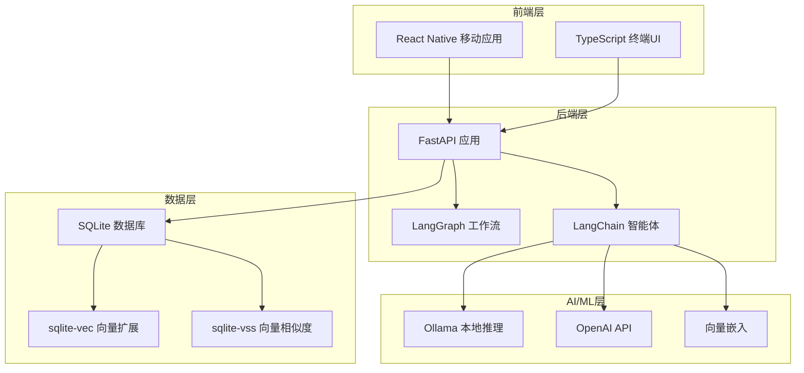
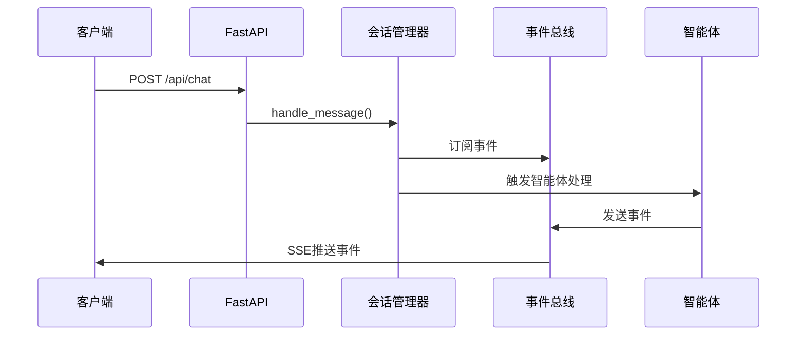
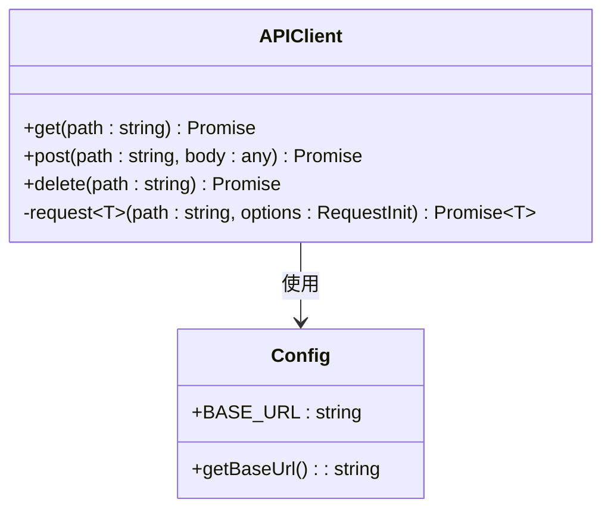
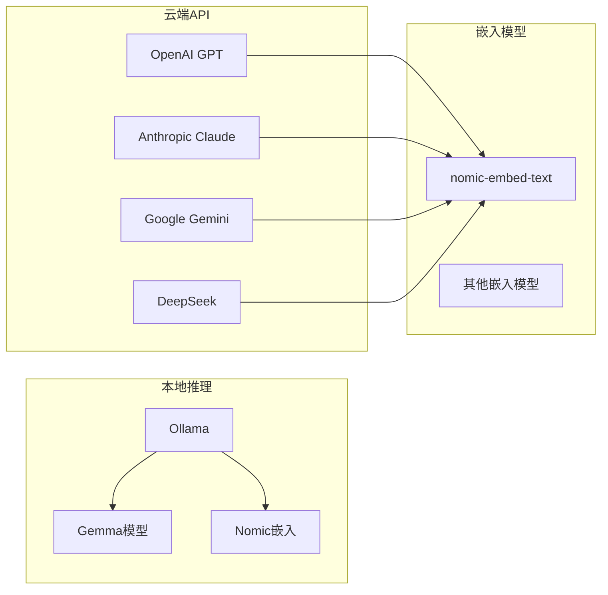
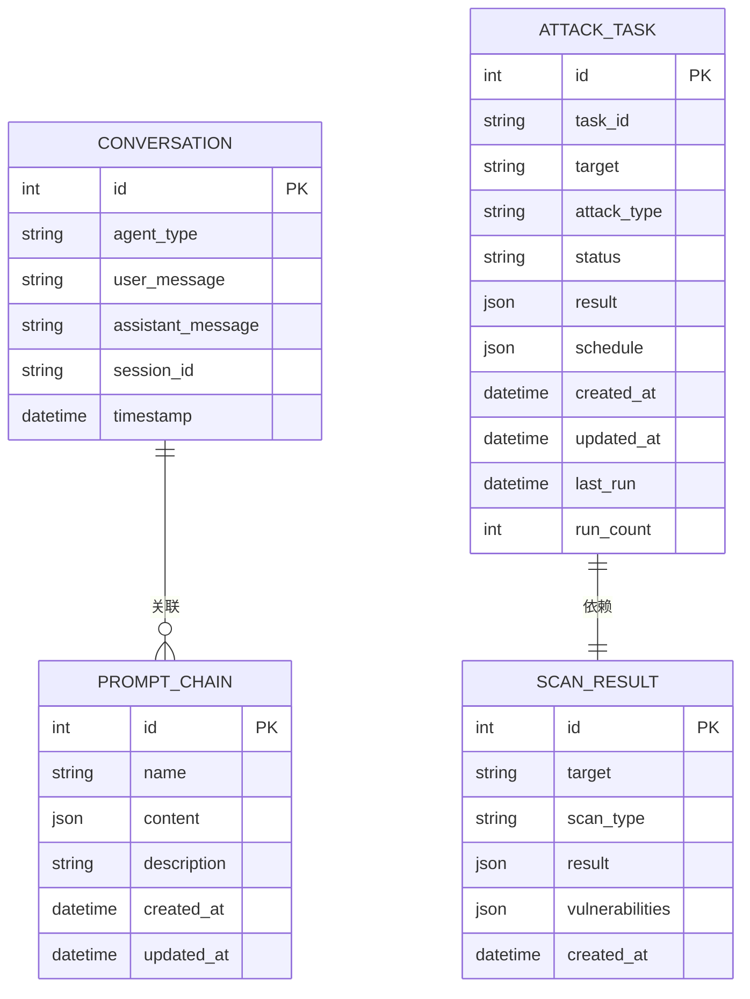
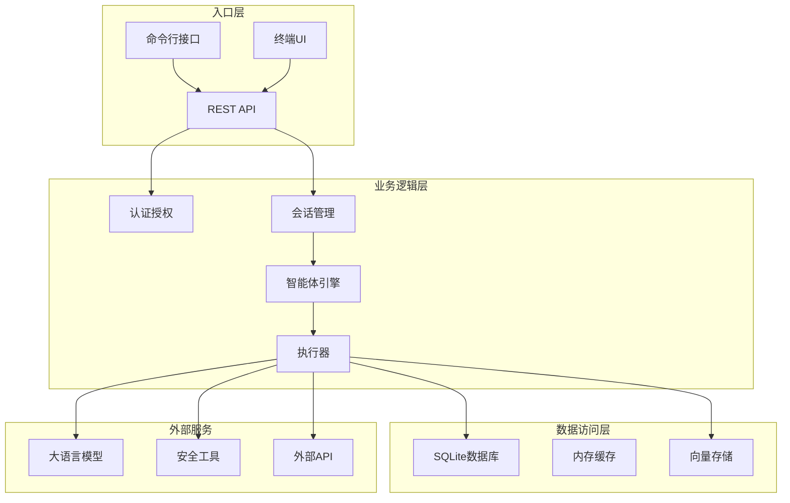
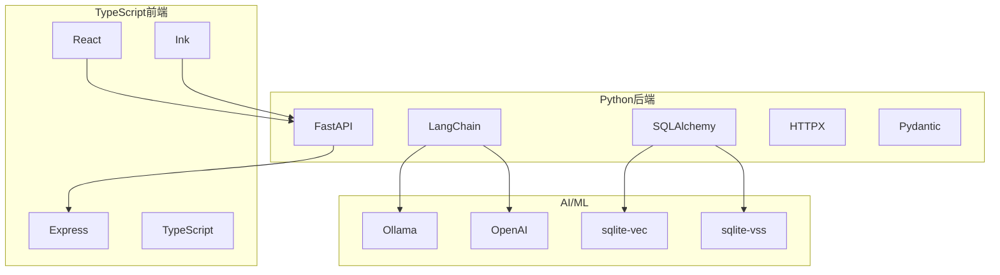
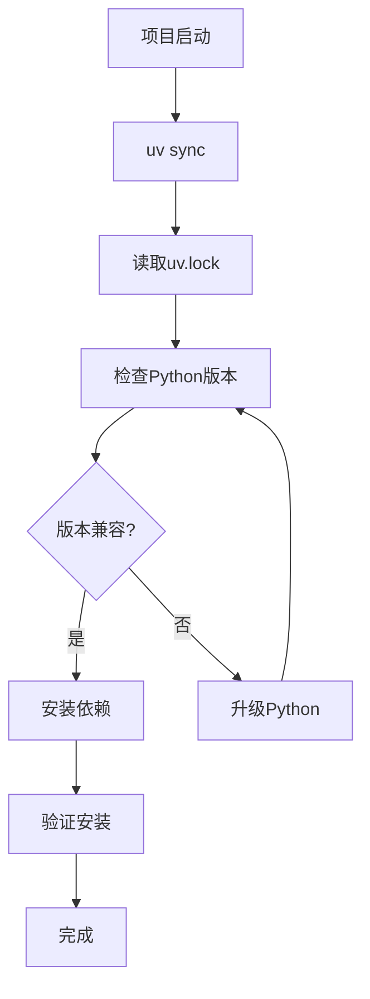
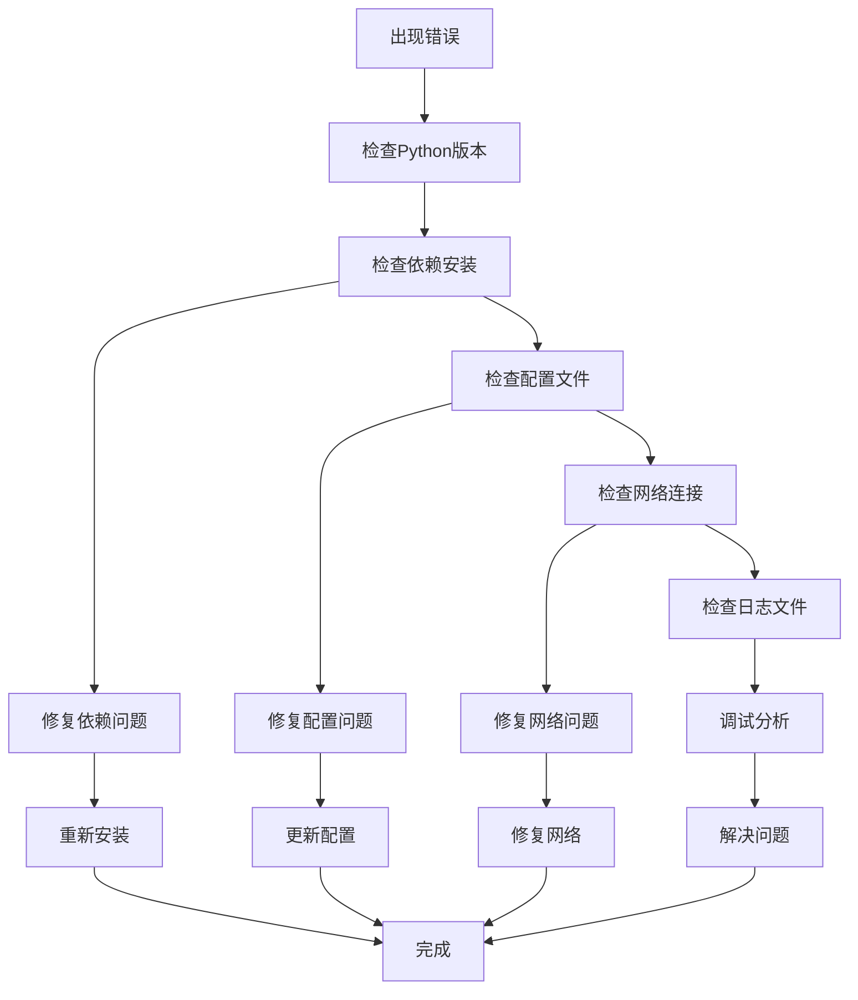

# 技术栈说明

<cite>
**本文档引用的文件**
- [pyproject.toml](file://pyproject.toml)
- [README_CN.md](file://README_CN.md)
- [README_EN.md](file://README_EN.md)
- [router/main.py](file://router/main.py)
- [hackbot/cli.py](file://hackbot/cli.py)
- [main.py](file://main.py)
- [core/agents/base.py](file://core/agents/base.py)
- [utils/embeddings.py](file://utils/embeddings.py)
- [database/models.py](file://database/models.py)
- [terminal-ui/src/api.ts](file://terminal-ui/src/api.ts)
- [app/src/api/client.ts](file://app/src/api/client.ts)
- [app/package.json](file://app/package.json)
- [terminal-ui/package.json](file://terminal-ui/package.json)
- [uv.toml](file://uv.toml)
- [uv.lock](file://uv.lock)
</cite>

## 目录
1. [简介](#简介)
2. [项目结构概览](#项目结构概览)
3. [后端技术栈](#后端技术栈)
4. [前端技术栈](#前端技术栈)
5. [AI/ML技术栈](#aiml技术栈)
6. [数据库技术栈](#数据库技术栈)
7. [工具库技术栈](#工具库技术栈)
8. [技术选型与架构设计](#技术选型与架构设计)
9. [依赖关系图](#依赖关系图)
10. [版本兼容性与依赖管理](#版本兼容性与依赖管理)
11. [性能考量与优化建议](#性能考量与优化建议)
12. [故障排除指南](#故障排除指南)
13. [结论](#结论)

## 简介

Secbot（原名Hackbot）是一个智能化的自动化渗透测试机器人，具备AI驱动的安全测试能力。该项目采用现代化的技术栈，结合Python后端、TypeScript前端和AI/ML技术，为用户提供完整的安全测试解决方案。

## 项目结构概览

项目采用模块化架构设计，主要分为以下几个层次：

**图表来源**
- [README_CN.md](file://README_CN.md#L77-L152)
- [router/main.py](file://router/main.py#L19-L67)

## 后端技术栈

### FastAPI 核心框架

FastAPI作为主要的Web框架，提供了高性能的REST API和SSE（Server-Sent Events）支持：

- **高性能异步处理**：基于Starlette，支持async/await模式
- **自动API文档**：内置Swagger和ReDoc文档生成
- **类型安全**：基于Pydantic的自动数据验证和序列化
- **CORS支持**：灵活的跨域资源共享配置

### LangGraph 工作流编排

LangGraph提供了强大的工作流编排能力：

- **多智能体协调**：支持复杂的多智能体协作模式
- **状态管理**：内置的状态转换和持久化机制
- **错误处理**：完善的异常处理和恢复机制
- **并行执行**：支持任务的并行和串行组合

### 会话管理与事件总线

项目实现了完整的会话管理和事件驱动架构：

**图表来源**
- [router/main.py](file://router/main.py#L19-L67)
- [core/agents/base.py](file://core/agents/base.py#L17-L89)

**章节来源**
- [router/main.py](file://router/main.py#L1-L101)
- [core/agents/base.py](file://core/agents/base.py#L1-L125)

## 前端技术栈

### React Native 移动应用

移动应用采用React Native + Expo技术栈：

- **跨平台开发**：一套代码支持iOS和Android
- **原生性能**：接近原生应用的性能表现
- **热重载**：开发时支持实时代码更新
- **丰富生态**：完整的UI组件和导航解决方案

### TypeScript 终端UI

终端UI采用Ink + React技术栈：

- **Ink框架**：基于React的终端UI渲染库
- **TypeScript支持**：完整的类型安全保障
- **SSE连接**：实时接收后端事件流
- **命令行交互**：丰富的终端交互体验

### API客户端封装

前后端都实现了统一的API客户端：

**图表来源**
- [app/src/api/client.ts](file://app/src/api/client.ts#L9-L48)
- [terminal-ui/src/api.ts](file://terminal-ui/src/api.ts#L6-L23)

**章节来源**
- [app/package.json](file://app/package.json#L1-L34)
- [terminal-ui/package.json](file://terminal-ui/package.json#L1-L35)
- [app/src/api/client.ts](file://app/src/api/client.ts#L1-L49)
- [terminal-ui/src/api.ts](file://terminal-ui/src/api.ts#L1-L24)

## AI/ML技术栈

### LangChain 生态系统

LangChain提供了完整的AI应用开发框架：

- **智能体框架**：支持多种智能体模式（ReAct、Plan-Execute等）
- **工具集成**：丰富的工具库和API集成能力
- **内存管理**：支持上下文记忆和长期记忆
- **提示词工程**：灵活的提示词管理和优化

### 多模型支持

项目支持多种AI模型提供商：

**图表来源**
- [README_CN.md](file://README_CN.md#L452-L457)
- [utils/embeddings.py](file://utils/embeddings.py#L11-L80)

### 向量数据库扩展

SQLite数据库通过扩展支持向量搜索：

- **sqlite-vec**：向量数据类型和查询支持
- **sqlite-vss**：向量相似度计算和搜索
- **嵌入管理**：自动化的文本向量化和索引

**章节来源**
- [utils/embeddings.py](file://utils/embeddings.py#L1-L80)
- [README_EN.md](file://README_EN.md#L359-L366)

## 数据库技术栈

### SQLite 核心存储

SQLite作为主要的数据存储解决方案：

- **轻量级**：零配置部署，适合开发和生产环境
- **ACID事务**：完整的事务支持和数据一致性
- **跨平台**：支持多种操作系统和架构
- **JSON支持**：内置JSON数据类型和查询功能

### 数据模型设计

项目实现了完整的数据模型体系：

**图表来源**
- [database/models.py](file://database/models.py#L9-L89)

**章节来源**
- [database/models.py](file://database/models.py#L1-L90)

## 工具库技术栈

### 网络爬虫与数据采集

项目集成了多种网络爬虫和数据采集工具：

- **requests**：HTTP客户端库，支持异步和同步模式
- **beautifulsoup4**：HTML/XML解析库，支持复杂的选择器
- **selenium**：浏览器自动化测试工具
- **playwright**：现代浏览器自动化框架

### 安全测试工具

集成了丰富的安全测试工具：

- **端口扫描**：nmap集成和自定义实现
- **漏洞扫描**：Nessus、OpenVAS等工具集成
- **Web渗透**：Burp Suite、SQLMap等工具集成
- **OSINT**：开源情报收集工具

### 系统工具

- **系统信息**：psutil系统信息收集
- **文件操作**：pathlib路径处理
- **加密解密**：cryptography加密库
- **日志管理**：loguru结构化日志

**章节来源**
- [pyproject.toml](file://pyproject.toml#L29-L68)

## 技术选型与架构设计

### 微服务架构

项目采用微服务架构设计，将功能模块化：

**图表来源**
- [README_CN.md](file://README_CN.md#L67-L152)

### 异步处理架构

项目广泛采用异步编程模式：

- **异步I/O**：使用async/await处理网络请求
- **并发执行**：支持多个任务的并行执行
- **事件驱动**：基于事件总线的消息传递
- **流式处理**：SSE实现实时数据推送

### 缓存策略

- **内存缓存**：高频访问数据的内存缓存
- **向量缓存**：嵌入向量的索引和查询缓存
- **会话缓存**：用户会话状态的临时存储

## 依赖关系图

### 核心依赖关系

**图表来源**
- [pyproject.toml](file://pyproject.toml#L29-L68)
- [app/package.json](file://app/package.json#L11-L28)
- [terminal-ui/package.json](file://terminal-ui/package.json#L17-L29)

### 开发工具链

- **包管理**：uv作为快速Python包管理器
- **构建工具**：setuptools和wheel
- **代码质量**：black格式化、flake8检查、mypy类型检查
- **测试框架**：pytest和pytest-asyncio

**章节来源**
- [pyproject.toml](file://pyproject.toml#L71-L88)
- [uv.toml](file://uv.toml#L1-L7)

## 版本兼容性与依赖管理

### Python版本要求

- **Python 3.10+**：项目要求Python 3.10及以上版本
- **uv包管理器**：使用uv作为主要的包管理工具
- **锁定文件**：使用uv.lock确保依赖版本一致性

### 依赖版本策略

**图表来源**
- [uv.lock](file://uv.lock#L1-L13)

### 兼容性矩阵

| 组件 | 最低版本 | 推荐版本 | 最高版本 |
|------|----------|----------|----------|
| Python | 3.10 | 3.12 | 3.14 |
| FastAPI | 0.109.0 | 0.109.0 | - |
| LangChain | 0.1.0 | 0.1.x | - |
| SQLAlchemy | 2.0.25 | 2.0.x | - |
| React Native | 0.81.5 | 0.81.x | - |
| Ink | 4.4.1 | 4.4.x | - |

**章节来源**
- [uv.lock](file://uv.lock#L1-L13)
- [README_CN.md](file://README_CN.md#L279-L284)

## 性能考量与优化建议

### 异步优化

- **并发连接池**：使用HTTPX的连接池减少连接开销
- **批量处理**：向量嵌入支持批量处理提高效率
- **缓存策略**：合理使用内存缓存减少重复计算

### 内存管理

- **垃圾回收**：Python自动垃圾回收配合手动清理
- **向量数据**：及时释放不需要的向量数据
- **会话清理**：定期清理过期的会话数据

### 数据库优化

- **索引策略**：为常用查询字段建立索引
- **查询优化**：使用ORM的查询优化功能
- **连接池**：配置合适的数据库连接池大小

## 故障排除指南

### 常见问题诊断

### 日志分析

- **后端日志**：使用loguru记录详细的执行日志
- **前端日志**：TypeScript应用的错误堆栈跟踪
- **系统日志**：操作系统的应用日志

**章节来源**
- [hackbot/cli.py](file://hackbot/cli.py#L12-L29)
- [main.py](file://main.py#L19-L32)

## 结论

Secbot项目采用了现代化、模块化的技术栈设计，成功地将Python后端的强大功能与TypeScript前端的用户体验相结合。通过LangChain和Ollama等AI技术的集成，项目实现了智能化的安全测试能力。

### 技术优势

1. **技术栈成熟稳定**：所有核心技术都是经过验证的成熟框架
2. **开发效率高**：TypeScript提供类型安全，Python提供快速开发
3. **可扩展性强**：模块化设计支持功能的灵活扩展
4. **性能优异**：异步处理和缓存策略确保了良好的性能表现

### 未来发展方向

1. **容器化部署**：考虑使用Docker和Kubernetes进行容器化
2. **云原生架构**：探索微服务和无服务器架构
3. **AI能力增强**：集成更多先进的AI模型和算法
4. **安全加固**：加强系统的安全防护能力

通过持续的技术演进和优化，Secbot项目将继续为用户提供强大而可靠的安全测试解决方案。