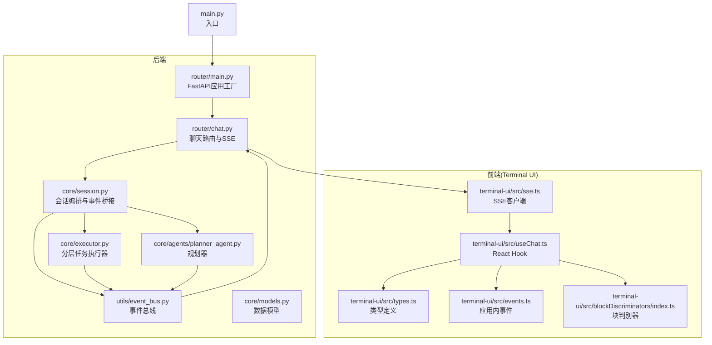
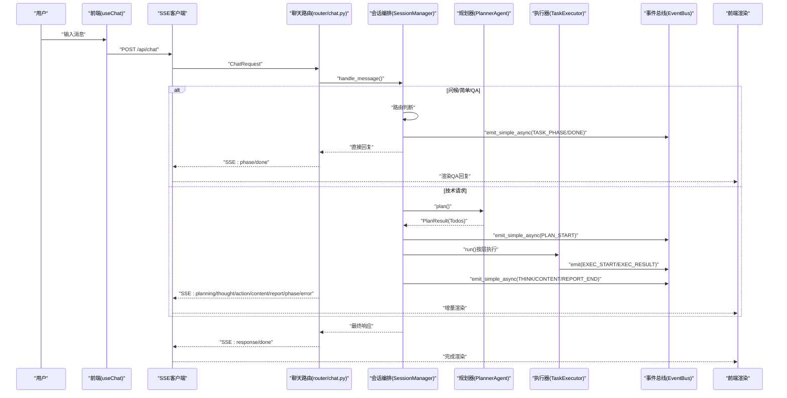
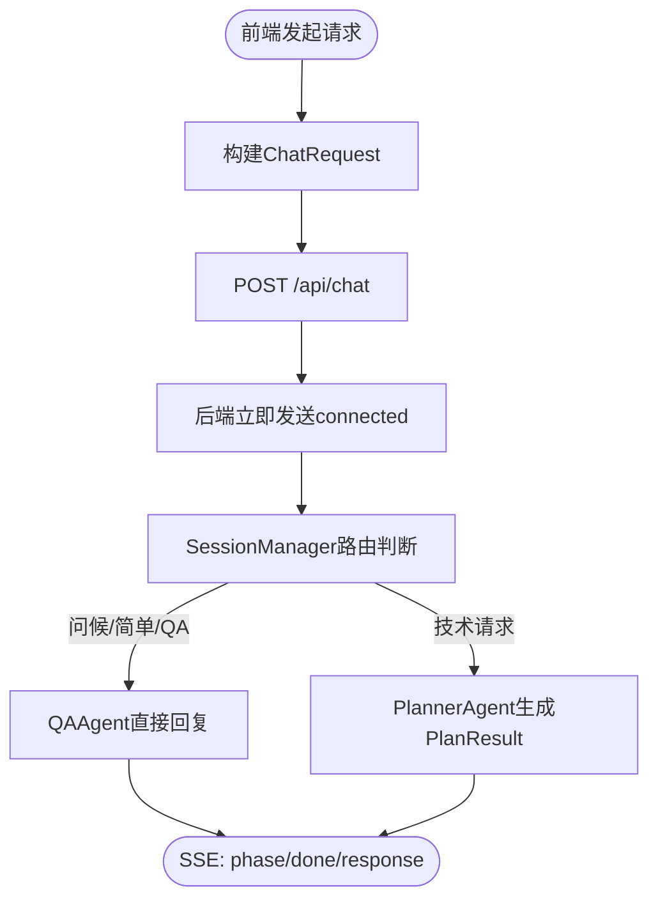
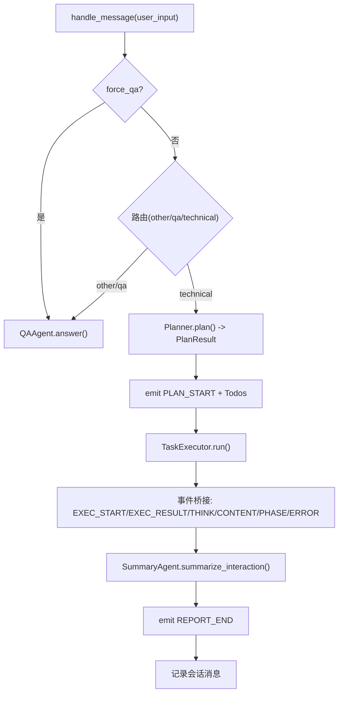
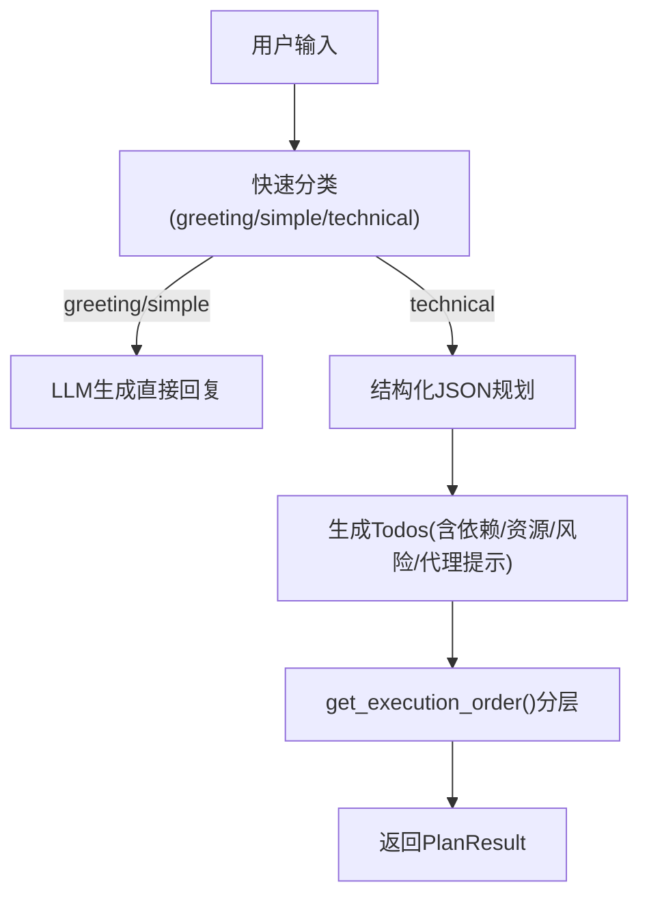
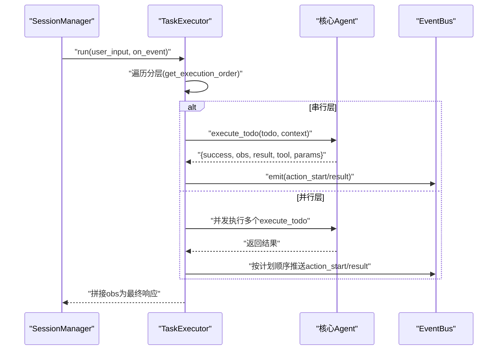
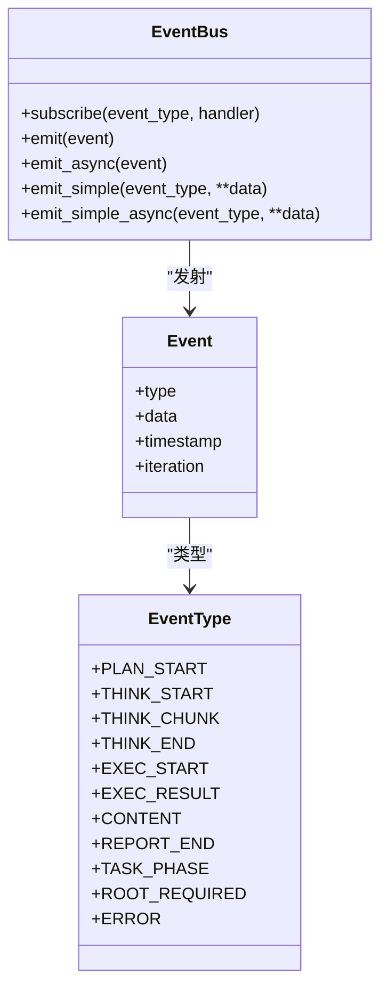
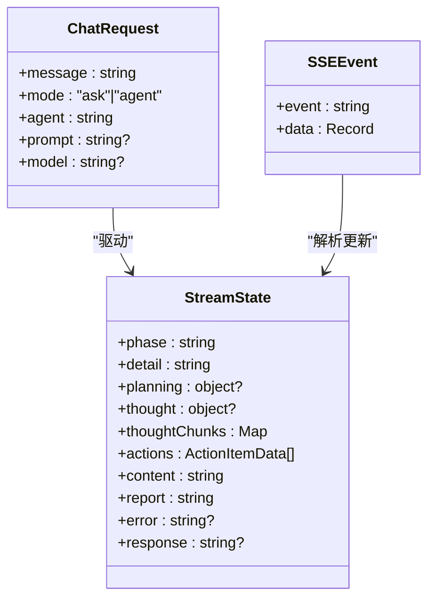
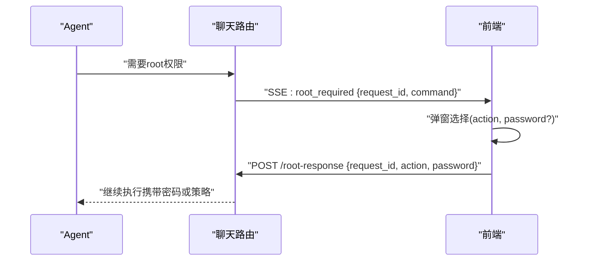
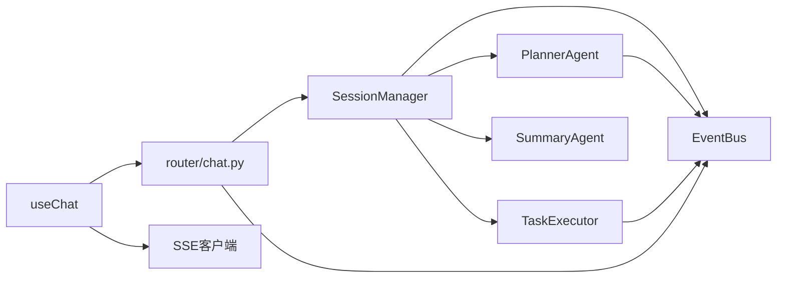

# 数据流设计

<cite>
**本文引用的文件**
- [main.py](file://main.py)
- [router/main.py](file://router/main.py)
- [router/chat.py](file://router/chat.py)
- [router/schemas.py](file://router/schemas.py)
- [core/session.py](file://core/session.py)
- [core/models.py](file://core/models.py)
- [core/executor.py](file://core/executor.py)
- [core/agents/planner_agent.py](file://core/agents/planner_agent.py)
- [utils/event_bus.py](file://utils/event_bus.py)
- [terminal-ui/src/types.ts](file://terminal-ui/src/types.ts)
- [terminal-ui/src/sse.ts](file://terminal-ui/src/sse.ts)
- [terminal-ui/src/useChat.ts](file://terminal-ui/src/useChat.ts)
- [terminal-ui/src/events.ts](file://terminal-ui/src/events.ts)
- [terminal-ui/src/blockDiscriminators/index.ts](file://terminal-ui/src/blockDiscriminators/index.ts)
- [core/memory/manager.py](file://core/memory/manager.py)
- [utils/tool_caller.py](file://utils/tool_caller.py)
</cite>

## 目录
1. [引言](#引言)
2. [项目结构](#项目结构)
3. [核心组件](#核心组件)
4. [架构总览](#架构总览)
5. [详细组件分析](#详细组件分析)
6. [依赖分析](#依赖分析)
7. [性能考虑](#性能考虑)
8. [故障排除指南](#故障排除指南)
9. [结论](#结论)
10. [附录](#附录)

## 引言
本文件面向Secbot系统的数据流设计，围绕“用户输入—会话管理—规划生成—任务执行—结果聚合—事件推送—前端渲染”的完整闭环，系统化阐述数据在各层之间的流转、转换与格式变化，以及事件驱动的SSE推送机制、缓存与一致性保障策略、错误处理与根权限控制等关键环节。

## 项目结构
Secbot采用前后端分离的模块化组织方式：
- 后端：FastAPI服务入口、路由模块、核心会话编排、事件总线、模型与执行器、工具与记忆系统等。
- 前端（TUI）：SSE客户端、React Hook、类型定义、事件总线与块渲染判别器。
- 顶层入口：主程序负责启动后端与TUI。

图表来源
- [router/main.py](file://router/main.py#L19-L71)
- [router/chat.py](file://router/chat.py#L134-L263)
- [core/session.py](file://core/session.py#L32-L136)
- [core/executor.py](file://core/executor.py#L17-L50)
- [core/agents/planner_agent.py](file://core/agents/planner_agent.py#L20-L80)
- [utils/event_bus.py](file://utils/event_bus.py#L68-L182)
- [terminal-ui/src/sse.ts](file://terminal-ui/src/sse.ts#L33-L133)
- [terminal-ui/src/useChat.ts](file://terminal-ui/src/useChat.ts#L31-L219)
- [terminal-ui/src/types.ts](file://terminal-ui/src/types.ts#L1-L75)
- [terminal-ui/src/events.ts](file://terminal-ui/src/events.ts#L1-L92)
- [terminal-ui/src/blockDiscriminators/index.ts](file://terminal-ui/src/blockDiscriminators/index.ts#L1-L13)
- [main.py](file://main.py#L44-L62)

章节来源
- [router/main.py](file://router/main.py#L19-L71)
- [router/chat.py](file://router/chat.py#L134-L263)
- [core/session.py](file://core/session.py#L32-L136)
- [terminal-ui/src/sse.ts](file://terminal-ui/src/sse.ts#L33-L133)
- [terminal-ui/src/useChat.ts](file://terminal-ui/src/useChat.ts#L31-L219)
- [main.py](file://main.py#L44-L62)

## 核心组件
- 会话编排器（SessionManager）：统一处理用户输入、路由（问候/QA/技术）、规划、执行、摘要与事件分发。
- 规划器（PlannerAgent）：将技术请求转化为结构化Todo列表，支持依赖与资源/风险标注。
- 任务执行器（TaskExecutor）：按拓扑分层并行/串行执行，聚合结果并触发事件。
- 事件总线（EventBus）：解耦Agent与UI，提供同步/异步事件分发。
- 聊天路由（router/chat.py）：SSE流式接口，将事件映射为SSE事件名，驱动前端渲染。
- 前端SSE客户端与Hook：解析SSE事件，维护流式状态，处理根权限请求。
- 数据模型（core/models.py）：定义Todo、Plan、交互摘要、消息与会话等核心数据结构。
- 记忆系统（core/memory/manager.py）：短期/情节/长期三层记忆，支持检索与蒸馏。
- 工具描述生成（utils/tool_caller.py）：为Agent生成工具描述，辅助规划与提示词。

章节来源
- [core/session.py](file://core/session.py#L32-L136)
- [core/agents/planner_agent.py](file://core/agents/planner_agent.py#L20-L80)
- [core/executor.py](file://core/executor.py#L17-L50)
- [utils/event_bus.py](file://utils/event_bus.py#L68-L182)
- [router/chat.py](file://router/chat.py#L33-L131)
- [terminal-ui/src/sse.ts](file://terminal-ui/src/sse.ts#L33-L133)
- [terminal-ui/src/useChat.ts](file://terminal-ui/src/useChat.ts#L31-L219)
- [core/models.py](file://core/models.py#L23-L136)
- [core/memory/manager.py](file://core/memory/manager.py#L223-L325)
- [utils/tool_caller.py](file://utils/tool_caller.py#L10-L119)

## 架构总览
整体数据流遵循“请求—编排—事件—渲染”的模式：
- 用户通过前端发起聊天请求（SSE POST），后端路由将其封装为ChatRequest并交由SessionManager。
- SessionManager根据请求类型决定走QA或规划—执行—摘要链路。
- 执行期间，Agent通过EventBus发出各类事件（规划、思考、执行、内容、阶段、报告、错误等）。
- 路由将事件映射为SSE事件名并推送，前端Hook解析事件，更新流式状态并渲染。
- 根权限场景下，后端发出root_required事件，前端弹窗等待用户选择，随后通过/root-response回传。

图表来源
- [router/chat.py](file://router/chat.py#L134-L263)
- [core/session.py](file://core/session.py#L139-L422)
- [core/agents/planner_agent.py](file://core/agents/planner_agent.py#L86-L128)
- [core/executor.py](file://core/executor.py#L46-L133)
- [utils/event_bus.py](file://utils/event_bus.py#L118-L182)

章节来源
- [router/chat.py](file://router/chat.py#L134-L263)
- [core/session.py](file://core/session.py#L139-L422)
- [core/executor.py](file://core/executor.py#L46-L133)

## 详细组件分析

### 1) 用户输入接收与路由
- 前端通过useChat封装SSE连接，发送ChatRequest（消息、模式、智能体类型、提示词、模型偏好）。
- 后端路由将请求映射为内部事件类型，先发送connected，再启动会话编排，避免前端长时间“连接中”。

图表来源
- [terminal-ui/src/useChat.ts](file://terminal-ui/src/useChat.ts#L62-L196)
- [router/chat.py](file://router/chat.py#L134-L171)
- [router/schemas.py](file://router/schemas.py#L18-L39)

章节来源
- [terminal-ui/src/useChat.ts](file://terminal-ui/src/useChat.ts#L62-L196)
- [router/chat.py](file://router/chat.py#L134-L171)
- [router/schemas.py](file://router/schemas.py#L18-L39)

### 2) 会话管理与事件桥接
- SessionManager负责：
  - 会话创建/切换/列表
  - 路由判断（问候/简单/QA/技术）
  - 规划阶段（发射PLAN_START与Todos）
  - 执行阶段（桥接Agent事件，自动更新Todo状态）
  - 摘要阶段（生成交互摘要并发射REPORT_END）
  - 记录助手消息到会话历史
- 事件桥接将Agent事件映射为UI可见的事件（思考、行动、内容、阶段、报告、错误等），并自动更新Todo状态。

图表来源
- [core/session.py](file://core/session.py#L139-L422)
- [core/agents/planner_agent.py](file://core/agents/planner_agent.py#L86-L128)
- [core/executor.py](file://core/executor.py#L46-L133)
- [utils/event_bus.py](file://utils/event_bus.py#L118-L182)

章节来源
- [core/session.py](file://core/session.py#L139-L422)

### 3) 规划生成与依赖编排
- PlannerAgent根据请求类型生成PlanResult，包含：
  - request_type（问候/简单/技术）
  - todos（带id、content、tool_hint、depends_on、resource、risk_level、agent_hint）
  - plan_summary
- 支持拓扑分层与资源/风险级别的并发控制，确保高风险在同一资源上串行。

图表来源
- [core/agents/planner_agent.py](file://core/agents/planner_agent.py#L86-L128)
- [core/agents/planner_agent.py](file://core/agents/planner_agent.py#L180-L248)

章节来源
- [core/agents/planner_agent.py](file://core/agents/planner_agent.py#L86-L128)
- [core/agents/planner_agent.py](file://core/agents/planner_agent.py#L180-L248)

### 4) 任务执行与结果聚合
- TaskExecutor按分层顺序执行：
  - 单Todo层：串行执行并推送事件
  - 多Todo层：并发gather，完成后按原顺序推送事件
- 执行上下文聚合：按todo_id与按资源维度聚合结果，便于后续步骤引用。

图表来源
- [core/executor.py](file://core/executor.py#L46-L133)

章节来源
- [core/executor.py](file://core/executor.py#L46-L133)

### 5) 事件格式与SSE映射
- 后端事件类型（EventType）与SSE事件名映射如下：
  - PLAN_START → "planning"
  - THINK_START/THINK_CHUNK/THINK_END → "thought_start"/"thought_chunk"/"thought"
  - EXEC_START/EXEC_RESULT → "action_start"/"action_result"
  - CONTENT → "content"
  - REPORT_END → "report"
  - TASK_PHASE → "phase"
  - ROOT_REQUIRED → "root_required"
  - ERROR → "error"
- 前端useChat根据事件名更新流式状态（phase/detail、planning/todos、thought、actions、content、report、error、response）。

图表来源
- [utils/event_bus.py](file://utils/event_bus.py#L68-L182)
- [router/chat.py](file://router/chat.py#L33-L131)

章节来源
- [utils/event_bus.py](file://utils/event_bus.py#L68-L182)
- [router/chat.py](file://router/chat.py#L33-L131)

### 6) 前端数据模型与渲染
- 前端类型定义（terminal-ui/src/types.ts）：
  - ChatRequest：消息、模式、智能体、提示词、模型偏好
  - StreamState：用于UI展示的流式状态（phase/detail、planning/todos、thought、actions、content、report、error、response）
  - SSEEvent：SSE事件（event、data）
- 前端Hook（useChat）：
  - 建立SSE连接，解析事件，更新流式状态
  - 支持停止流、设置REST输出、处理root_required
- 块判别器（blockDiscriminators）：统一消息块类型判别，交由对应渲染组件。

图表来源
- [terminal-ui/src/types.ts](file://terminal-ui/src/types.ts#L11-L74)
- [terminal-ui/src/useChat.ts](file://terminal-ui/src/useChat.ts#L5-L42)

章节来源
- [terminal-ui/src/types.ts](file://terminal-ui/src/types.ts#L11-L74)
- [terminal-ui/src/useChat.ts](file://terminal-ui/src/useChat.ts#L5-L42)
- [terminal-ui/src/blockDiscriminators/index.ts](file://terminal-ui/src/blockDiscriminators/index.ts#L1-L13)

### 7) 数据一致性与缓存策略
- 会话一致性：
  - SessionManager维护当前会话与消息历史，每次交互追加消息，保证上下文连贯。
  - 摘要阶段将摘要写入会话上下文，供后续连续任务参考。
- 规划与执行一致性：
  - Planner维护当前PlanResult，Todo状态随执行实时更新，确保报告统计准确。
  - TaskExecutor按层执行，结果按计划顺序回推事件，保证UI线性渲染。
- 事件总线一致性：
  - EventBus支持同步/异步事件，确保事件处理不阻塞主流程。
- 缓存与持久化：
  - 记忆系统：短期（会话上下文）、情节（跨会话经验）、长期（知识库），支持检索与蒸馏。
  - 工具描述：ToolDescriptionGenerator缓存工具清单，减少重复生成成本。
- 数据模型一致性：
  - TodoItem/TodoStatus/PlanResult/InteractionSummary等强类型定义，约束数据结构与状态转换。

章节来源
- [core/session.py](file://core/session.py#L465-L526)
- [core/agents/planner_agent.py](file://core/agents/planner_agent.py#L158-L178)
- [core/executor.py](file://core/executor.py#L135-L179)
- [utils/event_bus.py](file://utils/event_bus.py#L118-L182)
- [core/memory/manager.py](file://core/memory/manager.py#L223-L325)
- [utils/tool_caller.py](file://utils/tool_caller.py#L10-L119)
- [core/models.py](file://core/models.py#L23-L136)

### 8) 错误处理与根权限控制
- 错误处理：
  - 后端在SSE事件生成器中捕获异常并发送error事件，前端useChat监听并展示。
  - 事件总线处理器异常会被记录但不中断事件流。
- 根权限控制：
  - 当Agent需要root权限时，后端发出ROOT_REQUIRED事件，携带request_id与command。
  - 前端弹窗等待用户选择（执行一次/总是允许/拒绝），必要时输入密码。
  - 通过POST /api/chat/root-response回传，后端解析并继续执行。

图表来源
- [router/chat.py](file://router/chat.py#L172-L294)

章节来源
- [router/chat.py](file://router/chat.py#L172-L294)

## 依赖分析
- 组件耦合与内聚：
  - SessionManager与PlannerAgent、TaskExecutor、SummaryAgent松耦合，通过事件总线与回调桥接。
  - 路由层仅负责请求封装与事件映射，不参与业务逻辑，内聚性高。
  - 前端Hook与SSE客户端与后端契约一致，便于替换与扩展。
- 外部依赖：
  - LLM提供方（DeepSeek/Ollama等）通过配置注入，支持热切换。
  - 工具系统通过工具描述生成器统一注入提示词，降低Agent与工具耦合。

图表来源
- [core/session.py](file://core/session.py#L32-L136)
- [core/agents/planner_agent.py](file://core/agents/planner_agent.py#L20-L80)
- [core/executor.py](file://core/executor.py#L17-L50)
- [router/chat.py](file://router/chat.py#L134-L263)
- [terminal-ui/src/useChat.ts](file://terminal-ui/src/useChat.ts#L31-L219)

章节来源
- [core/session.py](file://core/session.py#L32-L136)
- [router/chat.py](file://router/chat.py#L134-L263)

## 性能考虑
- 并发与分层执行：TaskExecutor按拓扑分层并发执行，提高吞吐；高风险在同一资源上强制串行，避免冲突。
- 事件驱动渲染：前端按事件增量渲染，避免全量刷新。
- 缓存与检索：短期记忆与工具描述缓存减少重复计算；长期记忆支持知识复用。
- I/O与超时：SSE连接超时保护，异常快速反馈；LLM调用设置超时与回退策略。

## 故障排除指南
- SSE连接失败：
  - 检查后端是否启动、端口占用情况；前端连接超时提示包含端口与PID排查指引。
- 事件解析异常：
  - 前端SSE客户端对raw数据兜底解析，若JSON解析失败，事件data将包含raw字段，便于定位。
- 根权限拒绝：
  - 确认/root-response回传的request_id有效且未过期；检查action与密码组合是否符合要求。
- 会话状态异常：
  - 检查SessionManager当前会话与消息历史是否正确更新；关注Todo状态变更是否与工具执行一致。

章节来源
- [router/main.py](file://router/main.py#L74-L98)
- [terminal-ui/src/sse.ts](file://terminal-ui/src/sse.ts#L104-L133)
- [router/chat.py](file://router/chat.py#L274-L294)
- [core/session.py](file://core/session.py#L465-L526)

## 结论
Secbot通过事件驱动的SSE流式架构，实现了从用户输入到最终报告的完整数据闭环。SessionManager作为编排中枢，结合PlannerAgent的结构化规划与TaskExecutor的分层执行，确保复杂任务的可控与可观测。前端通过类型安全的事件与状态管理，提供流畅的增量渲染体验。配套的记忆系统与工具描述生成器进一步提升了系统的可扩展性与可维护性。

## 附录
- 关键数据节点：
  - ChatRequest/ChatResponse：请求/响应载体
  - PlanResult/TodoItem：规划与执行单元
  - InteractionSummary：交互摘要
  - Event/EventType：事件与事件类型
- 数据缓存策略：
  - 短期记忆：会话上下文
  - 情节记忆：跨会话经验
  - 长期记忆：知识库
  - 工具描述缓存：减少重复生成