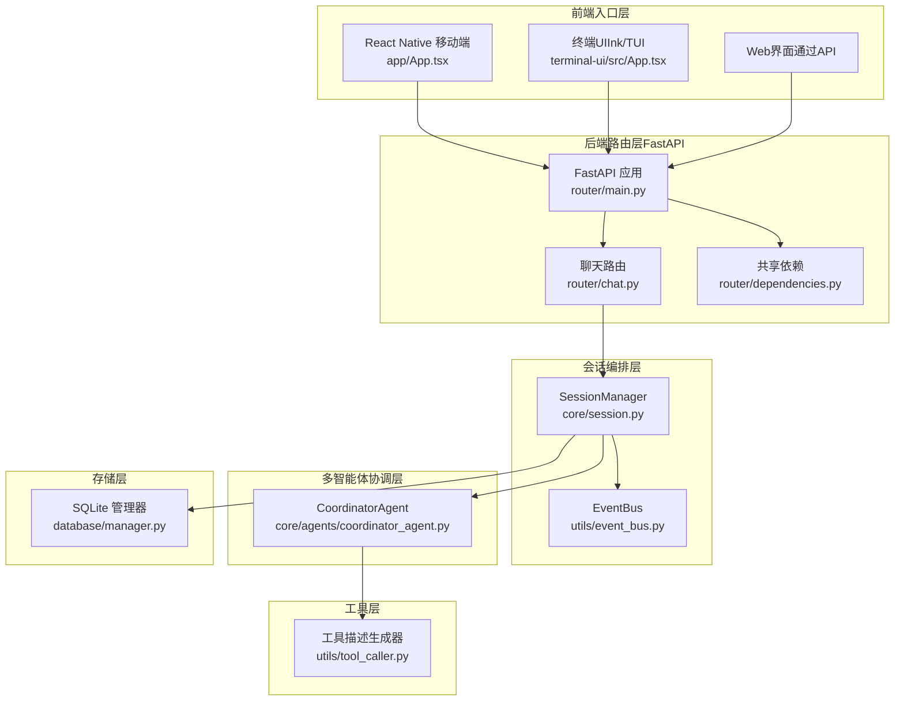
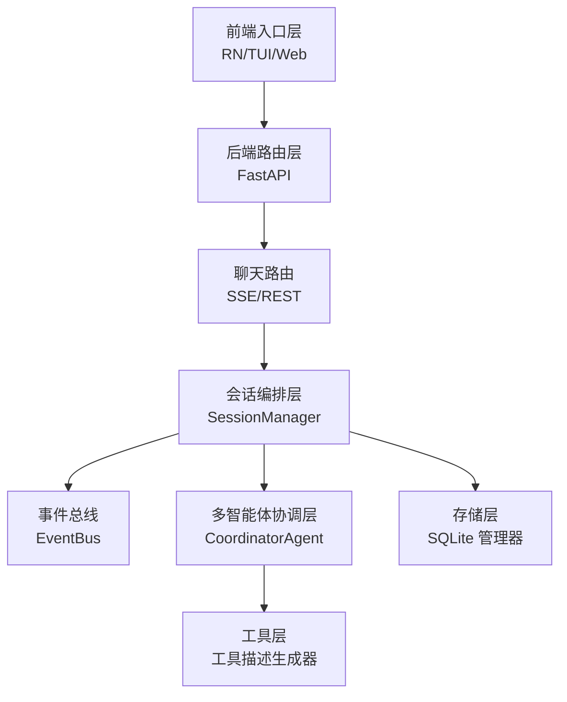
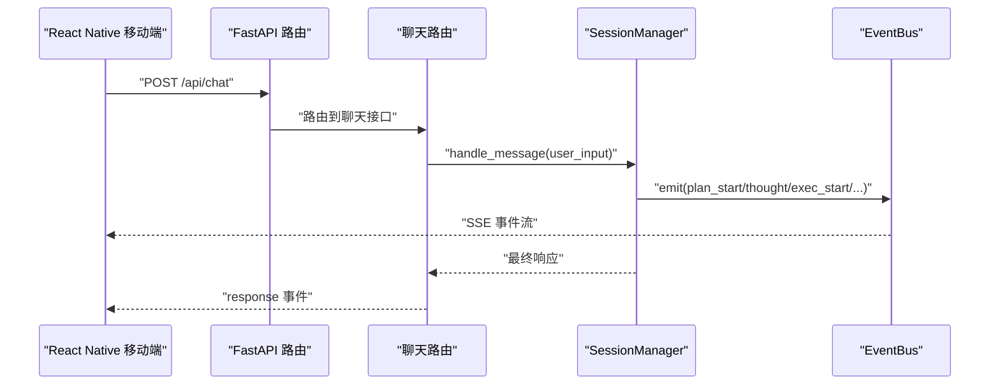
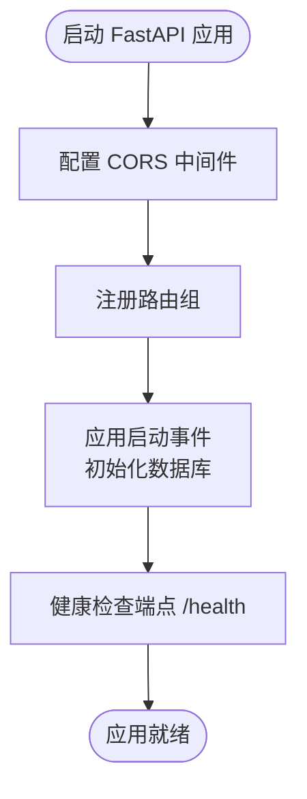
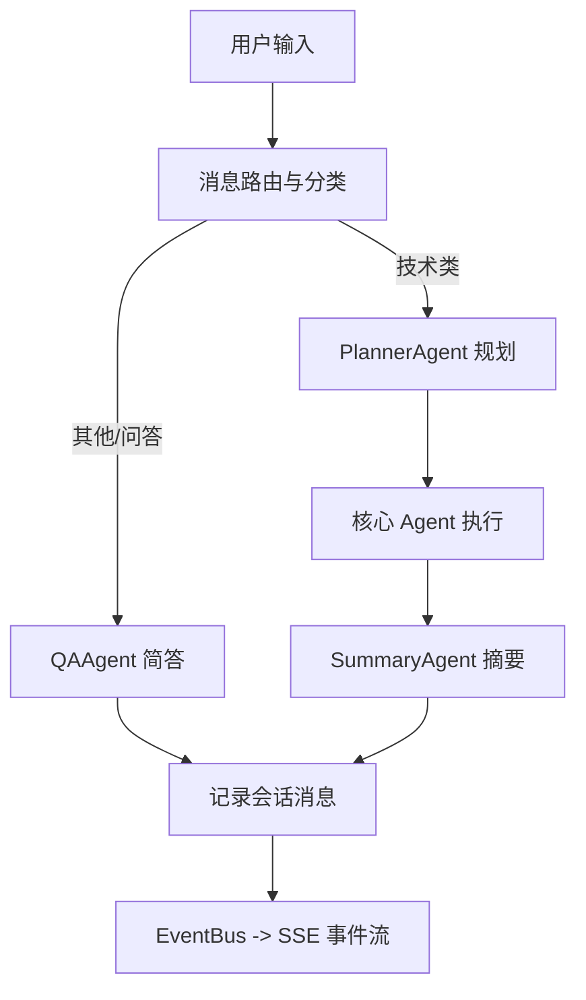
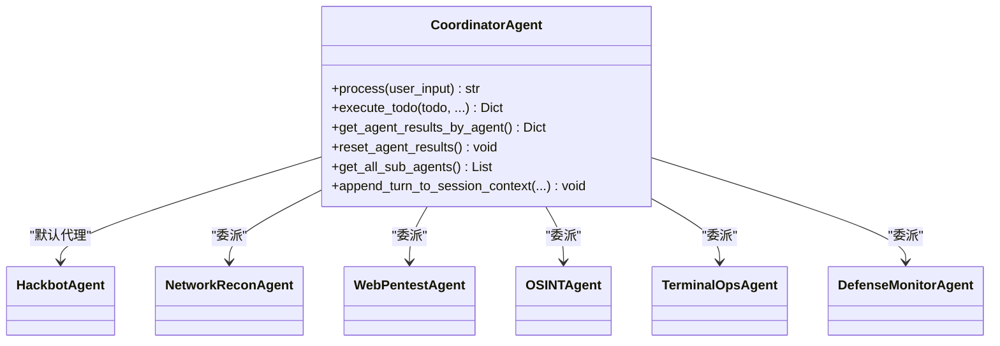
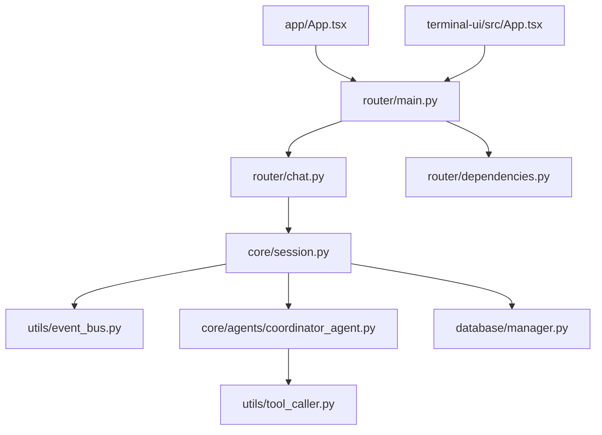

# 整体架构设计

<cite>
**本文档引用的文件**
- [main.py](file://main.py)
- [router/main.py](file://router/main.py)
- [router/chat.py](file://router/chat.py)
- [router/dependencies.py](file://router/dependencies.py)
- [app/App.tsx](file://app/App.tsx)
- [app/src/api/client.ts](file://app/src/api/client.ts)
- [terminal-ui/src/App.tsx](file://terminal-ui/src/App.tsx)
- [hackbot/launch_tui.py](file://hackbot/launch_tui.py)
- [core/session.py](file://core/session.py)
- [core/models.py](file://core/models.py)
- [core/agents/coordinator_agent.py](file://core/agents/coordinator_agent.py)
- [utils/event_bus.py](file://utils/event_bus.py)
- [utils/tool_caller.py](file://utils/tool_caller.py)
- [database/manager.py](file://database/manager.py)
- [controller/controller.py](file://controller/controller.py)
</cite>

## 目录
1. [简介](#简介)
2. [项目结构](#项目结构)
3. [核心组件](#核心组件)
4. [架构总览](#架构总览)
5. [详细组件分析](#详细组件分析)
6. [依赖关系分析](#依赖关系分析)
7. [性能考量](#性能考量)
8. [故障排查指南](#故障排查指南)
9. [结论](#结论)

## 简介
本文件面向Secbot项目的整体架构设计，围绕前后端分离的分层架构展开，涵盖前端入口层（React Native移动端、终端UI、Web界面）、后端路由层（FastAPI）、会话编排层、多智能体协调层、工具层、存储层等主要架构组件。文档解释各层职责与交互关系，给出数据流与控制流图示，并提供扩展性与性能优化建议。

## 项目结构
Secbot采用前后端分离架构：
- 前端入口层：React Native移动端应用、终端UI（Ink/TUI）、Web界面（通过API对接）
- 后端路由层：FastAPI服务，提供REST + SSE接口
- 会话编排层：SessionManager负责路由、规划、执行、摘要的完整交互编排
- 多智能体协调层：CoordinatorAgent作为主协调者，按资源/工具提示将任务委派给专用子Agent
- 工具层：统一的工具注册与描述生成，支撑Agent的ReAct工具调用
- 存储层：SQLite数据库，持久化会话、提示词链、审计留痕等

**图表来源**
- [router/main.py](file://router/main.py#L19-L71)
- [router/chat.py](file://router/chat.py#L27-L271)
- [router/dependencies.py](file://router/dependencies.py#L34-L193)
- [core/session.py](file://core/session.py#L32-L122)
- [core/agents/coordinator_agent.py](file://core/agents/coordinator_agent.py#L40-L97)
- [utils/event_bus.py](file://utils/event_bus.py#L68-L186)
- [utils/tool_caller.py](file://utils/tool_caller.py#L10-L118)
- [database/manager.py](file://database/manager.py#L26-L718)

**章节来源**
- [router/main.py](file://router/main.py#L19-L71)
- [router/chat.py](file://router/chat.py#L27-L271)
- [router/dependencies.py](file://router/dependencies.py#L34-L193)
- [core/session.py](file://core/session.py#L32-L122)
- [core/agents/coordinator_agent.py](file://core/agents/coordinator_agent.py#L40-L97)
- [utils/event_bus.py](file://utils/event_bus.py#L68-L186)
- [utils/tool_caller.py](file://utils/tool_caller.py#L10-L118)
- [database/manager.py](file://database/manager.py#L26-L718)

## 核心组件
- 启动入口与进程编排
  - 入口脚本负责后端与TUI的启动、端口占用检测与优雅终止，确保开发体验与可维护性
- FastAPI路由与CORS
  - 统一注册路由，启用CORS，健康检查，数据库初始化
- 会话编排与事件总线
  - SessionManager负责交互编排，EventBus解耦Agent与UI，支持SSE事件流
- 多智能体协调
  - CoordinatorAgent按资源/工具提示将任务委派给专用子Agent，聚合执行结果
- 工具描述与提示词
  - 工具描述生成器为Agent提供结构化工具清单，提升工具调用准确性
- 数据持久化
  - SQLite管理器负责表结构初始化、CRUD与索引，支撑会话、提示词链、审计留痕等

**章节来源**
- [main.py](file://main.py#L44-L61)
- [hackbot/launch_tui.py](file://hackbot/launch_tui.py#L291-L342)
- [router/main.py](file://router/main.py#L19-L71)
- [router/chat.py](file://router/chat.py#L27-L271)
- [core/session.py](file://core/session.py#L32-L122)
- [utils/event_bus.py](file://utils/event_bus.py#L68-L186)
- [core/agents/coordinator_agent.py](file://core/agents/coordinator_agent.py#L40-L97)
- [utils/tool_caller.py](file://utils/tool_caller.py#L10-L118)
- [database/manager.py](file://database/manager.py#L26-L203)

## 架构总览
Secbot采用前后端分离的分层架构：
- 前端入口层：React Native移动端、终端UI、Web界面均通过REST与SSE与后端通信
- 后端路由层：FastAPI提供统一入口，集中注册路由、CORS与健康检查
- 会话编排层：SessionManager统一编排交互流程，驱动EventBus事件流
- 多智能体协调层：CoordinatorAgent作为A2A入口，按资源/工具提示委派任务
- 工具层：统一工具注册与描述，支撑Agent的ReAct工具调用
- 存储层：SQLite持久化，支持会话、提示词链、审计留痕等

**图表来源**
- [router/main.py](file://router/main.py#L19-L71)
- [router/chat.py](file://router/chat.py#L27-L271)
- [core/session.py](file://core/session.py#L32-L122)
- [utils/event_bus.py](file://utils/event_bus.py#L68-L186)
- [core/agents/coordinator_agent.py](file://core/agents/coordinator_agent.py#L40-L97)
- [utils/tool_caller.py](file://utils/tool_caller.py#L10-L118)
- [database/manager.py](file://database/manager.py#L26-L718)

## 详细组件分析

### 前端入口层
- React Native移动端
  - 通过底部导航组织页面，统一使用API客户端进行REST调用
- 终端UI（Ink/TUI）
  - 基于Ink的全屏终端界面，通过API与后端交互，支持命令面板、对话框、模型配置等
- Web界面
  - 通过REST与SSE与后端通信，实现流式事件展示与交互

**图表来源**
- [router/chat.py](file://router/chat.py#L134-L271)
- [core/session.py](file://core/session.py#L139-L422)
- [utils/event_bus.py](file://utils/event_bus.py#L118-L181)

**章节来源**
- [app/App.tsx](file://app/App.tsx#L28-L108)
- [app/src/api/client.ts](file://app/src/api/client.ts#L10-L48)
- [terminal-ui/src/App.tsx](file://terminal-ui/src/App.tsx#L26-L201)

### 后端路由层（FastAPI）
- 应用工厂与CORS
  - 统一创建FastAPI应用，注册CORS中间件，允许跨域访问
- 路由注册
  - 注册聊天、智能体、会话、系统、防御、网络、数据库、工具等路由
- 健康检查与启动初始化
  - 提供健康检查端点，应用启动时初始化数据库

**图表来源**
- [router/main.py](file://router/main.py#L19-L71)

**章节来源**
- [router/main.py](file://router/main.py#L19-L71)

### 会话编排层（SessionManager）
- 职责
  - 管理会话生命周期、消息路由、规划、执行、摘要
  - 通过EventBus将事件流式推送至UI，支持SSE
- 编排流程
  - 路由分类（问候/闲聊走QA，技术类走规划+执行+摘要）
  - 支持强制QA模式与强制Agent流程
  - 事件桥接：自动更新Todo状态、格式化执行脚本、汇总工具结果

**图表来源**
- [core/session.py](file://core/session.py#L139-L422)
- [utils/event_bus.py](file://utils/event_bus.py#L118-L181)

**章节来源**
- [core/session.py](file://core/session.py#L32-L122)
- [core/models.py](file://core/models.py#L23-L136)

### 多智能体协调层（CoordinatorAgent）
- 职责
  - 作为hackbot对外入口，协调网络侦察、Web渗透、OSINT、终端运维、防御监控等子Agent
  - 在分层执行模式下按agent_hint/resource将Todo委派给子Agent
  - 聚合各Agent的工具执行结果，供摘要阶段使用
- 选择策略
  - 优先agent_hint，其次resource前缀，最后依据tool_hint关键词匹配

**图表来源**
- [core/agents/coordinator_agent.py](file://core/agents/coordinator_agent.py#L40-L335)

**章节来源**
- [core/agents/coordinator_agent.py](file://core/agents/coordinator_agent.py#L40-L335)

### 工具层（工具描述生成器）
- 职责
  - 为Agent生成工具描述，支持文本与Markdown格式
  - 提供工具摘要与用于提示词的优化格式
- 作用
  - 为Planner与Agent提供工具清单，提升规划与工具调用准确性

**章节来源**
- [utils/tool_caller.py](file://utils/tool_caller.py#L10-L118)

### 存储层（SQLite管理器）
- 职责
  - 初始化数据库与表结构，提供会话、提示词链、用户配置、爬虫任务、攻击任务、扫描结果、审计留痕等CRUD
  - 提供索引与统计查询，保障查询效率
- 设计
  - 使用上下文管理器确保事务一致性，异常自动回滚

**章节来源**
- [database/manager.py](file://database/manager.py#L26-L203)
- [database/manager.py](file://database/manager.py#L205-L718)

### 控制器层（MainController）
- 职责
  - 统一管理内网发现、授权、远程控制与会话管理
  - 提供目标主机发现、授权、连接、命令执行、文件传输、断开等能力
- 设计
  - 通过组合模式聚合NetworkDiscovery、AuthorizationManager、RemoteController、SessionManager

**章节来源**
- [controller/controller.py](file://controller/controller.py#L14-L244)

## 依赖关系分析
- 组件耦合
  - SessionManager与EventBus松耦合，通过事件桥接实现UI与Agent解耦
  - 路由层通过依赖注入获取共享实例，避免重复初始化
- 外部依赖
  - FastAPI、sse-starlette、uvicorn提供后端服务与SSE
  - SQLite提供本地持久化
  - Node.js与npm用于终端UI构建与运行

**图表来源**
- [router/chat.py](file://router/chat.py#L27-L271)
- [core/session.py](file://core/session.py#L32-L122)
- [utils/event_bus.py](file://utils/event_bus.py#L68-L186)
- [core/agents/coordinator_agent.py](file://core/agents/coordinator_agent.py#L40-L97)
- [utils/tool_caller.py](file://utils/tool_caller.py#L10-L118)
- [database/manager.py](file://database/manager.py#L26-L718)
- [router/main.py](file://router/main.py#L19-L71)
- [router/dependencies.py](file://router/dependencies.py#L34-L193)
- [app/App.tsx](file://app/App.tsx#L28-L108)
- [terminal-ui/src/App.tsx](file://terminal-ui/src/App.tsx#L26-L201)

**章节来源**
- [router/dependencies.py](file://router/dependencies.py#L34-L193)
- [router/chat.py](file://router/chat.py#L27-L271)
- [core/session.py](file://core/session.py#L32-L122)

## 性能考量
- 事件驱动与流式输出
  - 使用SSE与EventBus实现事件流式推送，降低前端轮询成本，提升交互体验
- 并发控制
  - 智能体支持并发锁，避免同一Agent的并发任务互相干扰
- 数据库优化
  - 针对高频查询建立索引，减少查询时间
- 启动与热更新
  - 后端禁用字节码缓存，确保每次启动使用最新源码；TUI通过tsx直接运行，便于开发调试

[本节为通用指导，无需列出章节来源]

## 故障排查指南
- 后端端口占用
  - 启动前检测端口占用，必要时终止占用进程并等待端口释放
- TUI启动条件
  - 检查terminal-ui目录、package.json、node_modules与Node.js版本
- SSE连接问题
  - 确认后端健康检查端点可访问，前端SSE事件流正常
- 数据库初始化
  - 应用启动时自动初始化数据库表，若异常需检查权限与路径

**章节来源**
- [hackbot/launch_tui.py](file://hackbot/launch_tui.py#L47-L140)
- [router/main.py](file://router/main.py#L74-L97)
- [database/manager.py](file://database/manager.py#L75-L203)

## 结论
Secbot的整体架构清晰地划分了前后端边界，后端通过FastAPI提供REST与SSE接口，前端通过统一API客户端接入。会话编排层与事件总线解耦了UI与Agent，多智能体协调层实现了任务的精细化委派与结果聚合。工具层与存储层分别支撑了Agent的工具调用与数据持久化。该架构具备良好的扩展性与可维护性，适合持续演进与性能优化。