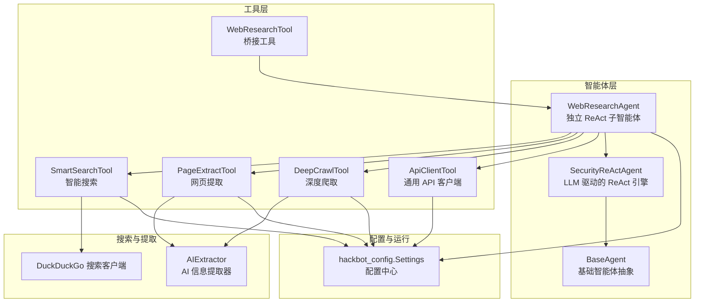
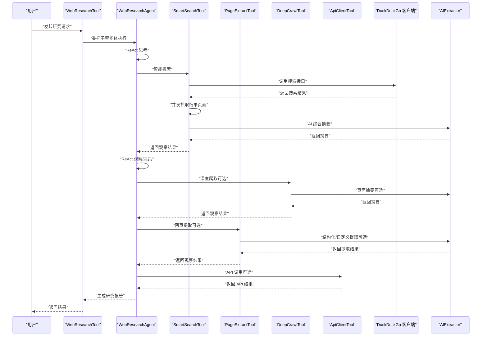
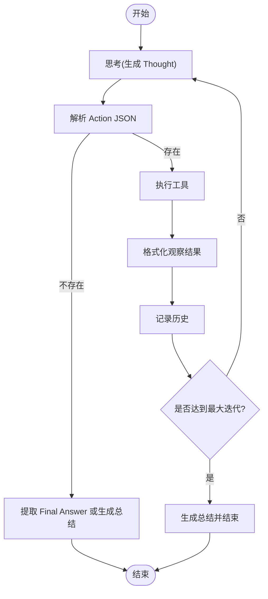
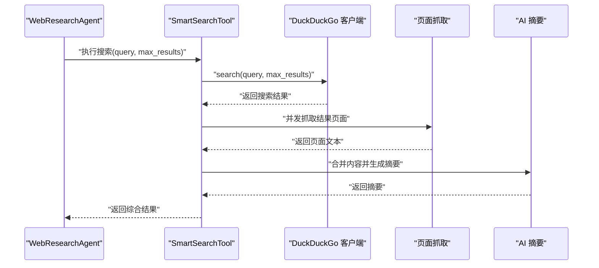
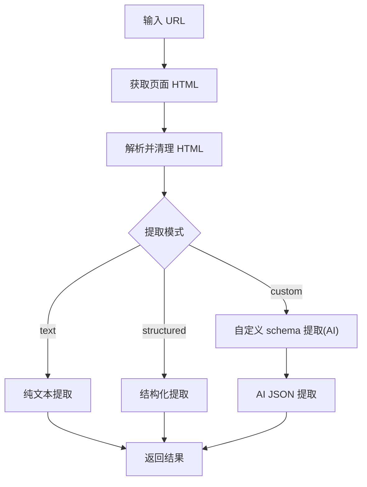
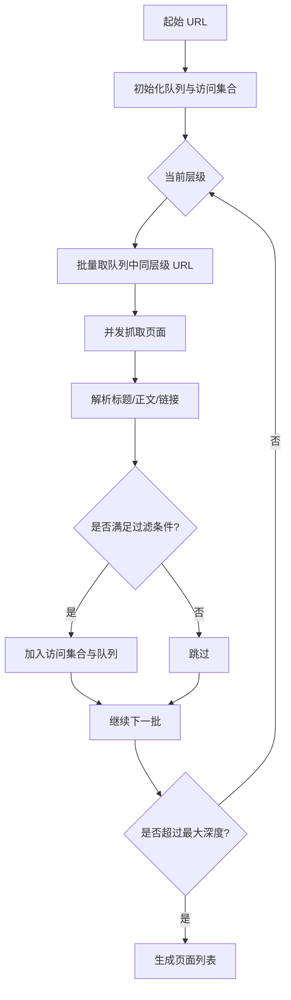
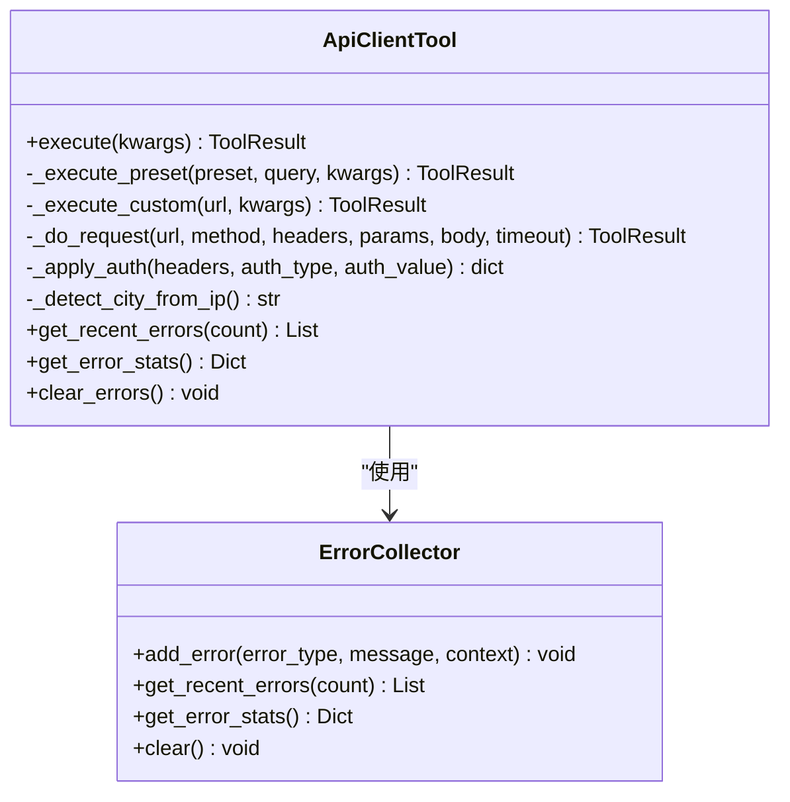
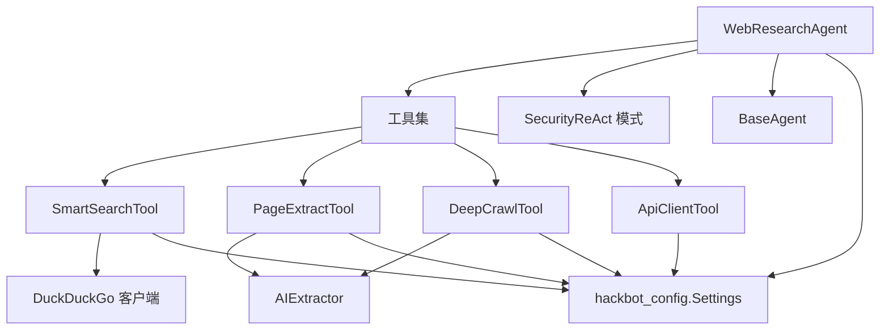

# AI网络研究能力

<cite>
**本文引用的文件**
- [WebResearchAgent](file://core/agents/web_research_agent.py)
- [SecurityReAct 模式](file://core/patterns/security_react.py)
- [ReAct 模式（旧版）](file://core/patterns/react.py)
- [智能搜索工具](file://tools/web_research/smart_search_tool.py)
- [网页提取工具](file://tools/web_research/page_extract_tool.py)
- [深度爬取工具](file://tools/web_research/deep_crawl_tool.py)
- [API 客户端工具](file://tools/web_research/api_client_tool.py)
- [WebResearch 桥接工具](file://tools/web_research/web_research_tool.py)
- [DuckDuckGo 搜索客户端](file://tools/web_search_ddgs.py)
- [AI 信息提取器](file://crawler/extractor.py)
- [基础智能体](file://core/agents/base.py)
- [基础工具类](file://tools/base.py)
- [配置管理](file://hackbot_config/__init__.py)
- [README（项目总览）](file://README_CN.md)
</cite>

## 目录
1. [简介](#简介)
2. [项目结构](#项目结构)
3. [核心组件](#核心组件)
4. [架构总览](#架构总览)
5. [详细组件分析](#详细组件分析)
6. [依赖关系分析](#依赖关系分析)
7. [性能考量](#性能考量)
8. [故障排查指南](#故障排查指南)
9. [结论](#结论)
10. [附录](#附录)

## 简介
本章节概述 Secbot 的 AI 网络研究能力，重点阐述 WebResearchAgent 的独立 ReAct 自动研究模式，以及围绕智能搜索、网页提取、深度爬取、API 客户端等核心能力的实现原理与使用方法。文档还提供基于 DuckDuckGo 的智能搜索算法、网页内容提取的 AI 模式识别、多页爬取的 BFS 策略与 API 调用的通用客户端设计，并给出实际应用场景、配置策略、优化建议与大规模数据处理技巧。

## 项目结构
Secbot 的网络研究能力由“子智能体 + 专用工具 + 搜索与提取引擎 + 配置中心”构成，整体围绕 ReAct 推理循环组织，支持主智能体直接调用或委托 WebResearchAgent 自主完成全流程。

图表来源
- [WebResearchAgent](file://core/agents/web_research_agent.py#L52-L190)
- [SecurityReAct 模式](file://core/patterns/security_react.py#L142-L628)
- [基础智能体](file://core/agents/base.py#L17-L125)
- [智能搜索工具](file://tools/web_research/smart_search_tool.py#L12-L221)
- [网页提取工具](file://tools/web_research/page_extract_tool.py#L11-L349)
- [深度爬取工具](file://tools/web_research/deep_crawl_tool.py#L13-L300)
- [API 客户端工具](file://tools/web_research/api_client_tool.py#L132-L610)
- [WebResearch 桥接工具](file://tools/web_research/web_research_tool.py#L23-L255)
- [DuckDuckGo 搜索客户端](file://tools/web_search_ddgs.py#L71-L112)
- [AI 信息提取器](file://crawler/extractor.py#L12-L183)
- [配置管理](file://hackbot_config/__init__.py#L162-L246)

章节来源
- [README（项目总览）](file://README_CN.md#L52-L59)
- [WebResearchAgent](file://core/agents/web_research_agent.py#L52-L190)
- [SecurityReAct 模式](file://core/patterns/security_react.py#L142-L628)

## 核心组件
- WebResearchAgent：独立 ReAct 子智能体，拥有专属工具集（智能搜索、网页提取、深度爬取、API 客户端），可由主智能体委托执行互联网信息收集任务。
- SecurityReActAgent：LLM 驱动的 ReAct 引擎，提供统一的推理-行动-观察循环、事件发射、会话摘要与多模型后端支持。
- 智能搜索工具：基于 DuckDuckGo 的搜索、结果页面并发抓取与 AI 综合摘要。
- 网页提取工具：支持纯文本、结构化（表格/列表/标题）与自定义 schema 的 AI 提取。
- 深度爬取工具：BFS 多页爬取，支持深度/数量控制、URL 过滤、同域限制与可选 AI 摘要。
- API 客户端工具：通用 REST 客户端，内置常用模板（天气、IP、GitHub、汇率等），支持认证与重试。
- WebResearch 桥接工具：将研究任务委托给 WebResearchAgent，或直接按模式调用对应工具。
- 搜索与提取引擎：DuckDuckGo 搜索客户端与 AIExtractor，分别承担检索与结构化提取。
- 配置中心：hackbot_config.Settings 提供多厂商 LLM 后端、模型与温度等统一配置。

章节来源
- [WebResearchAgent](file://core/agents/web_research_agent.py#L52-L190)
- [SecurityReAct 模式](file://core/patterns/security_react.py#L142-L628)
- [智能搜索工具](file://tools/web_research/smart_search_tool.py#L12-L221)
- [网页提取工具](file://tools/web_research/page_extract_tool.py#L11-L349)
- [深度爬取工具](file://tools/web_research/deep_crawl_tool.py#L13-L300)
- [API 客户端工具](file://tools/web_research/api_client_tool.py#L132-L610)
- [WebResearch 桥接工具](file://tools/web_research/web_research_tool.py#L23-L255)
- [DuckDuckGo 搜索客户端](file://tools/web_search_ddgs.py#L71-L112)
- [AI 信息提取器](file://crawler/extractor.py#L12-L183)
- [配置管理](file://hackbot_config/__init__.py#L162-L246)

## 架构总览
WebResearchAgent 在独立 ReAct 循环中，通过 WebResearchTool 桥接主智能体与专用工具。工具层依赖配置中心提供的 LLM 后端与模型参数，搜索与提取环节分别由 DuckDuckGo 客户端与 AIExtractor 支撑。

图表来源
- [WebResearch 桥接工具](file://tools/web_research/web_research_tool.py#L81-L97)
- [WebResearchAgent](file://core/agents/web_research_agent.py#L126-L190)
- [智能搜索工具](file://tools/web_research/smart_search_tool.py#L28-L80)
- [深度爬取工具](file://tools/web_research/deep_crawl_tool.py#L29-L66)
- [网页提取工具](file://tools/web_research/page_extract_tool.py#L27-L80)
- [API 客户端工具](file://tools/web_research/api_client_tool.py#L154-L181)
- [DuckDuckGo 搜索客户端](file://tools/web_search_ddgs.py#L71-L112)
- [AI 信息提取器](file://crawler/extractor.py#L19-L86)

## 详细组件分析

### WebResearchAgent：独立 ReAct 自动研究
- 独立 ReAct 循环：拥有专属工具集与系统提示词，支持最大迭代次数控制与历史记录截断，避免 token 爆炸。
- 推理与行动：通过 LLM 生成 Thought，解析 Action JSON，执行工具并格式化观察结果。
- 最终答案与总结：若未显式 Final Answer，则根据已收集观察生成结构化总结。
- LLM 调用：统一超时控制与错误处理，支持多厂商后端。

图表来源
- [WebResearchAgent](file://core/agents/web_research_agent.py#L126-L190)
- [WebResearchAgent](file://core/agents/web_research_agent.py#L196-L250)
- [WebResearchAgent](file://core/agents/web_research_agent.py#L255-L294)
- [WebResearchAgent](file://core/agents/web_research_agent.py#L300-L341)
- [WebResearchAgent](file://core/agents/web_research_agent.py#L343-L371)

章节来源
- [WebResearchAgent](file://core/agents/web_research_agent.py#L52-L190)
- [WebResearchAgent](file://core/agents/web_research_agent.py#L196-L250)
- [WebResearchAgent](file://core/agents/web_research_agent.py#L255-L294)
- [WebResearchAgent](file://core/agents/web_research_agent.py#L300-L341)
- [WebResearchAgent](file://core/agents/web_research_agent.py#L343-L371)

### SecurityReAct 模式：LLM 驱动的 ReAct 引擎
- 多模型后端：统一创建 LLM 实例，支持 Ollama、DeepSeek、OpenAI、Anthropic、Google 等。
- 事件发射：将思考、执行、观察、报告、错误等事件映射为标准化 SSE 事件，便于前端渲染。
- 会话摘要：维护短期上下文摘要，跨轮次复用，提升连贯性。
- 确认机制：高敏感操作需用户确认，支持 /accept /reject 流程。

章节来源
- [SecurityReAct 模式](file://core/patterns/security_react.py#L49-L139)
- [SecurityReAct 模式](file://core/patterns/security_react.py#L227-L277)
- [SecurityReAct 模式](file://core/patterns/security_react.py#L393-L628)
- [SecurityReAct 模式](file://core/patterns/security_react.py#L630-L779)

### 智能搜索：基于 DuckDuckGo 的检索与 AI 摘要
- 搜索引擎：优先使用 ddgs，回退 duckduckgo-search，最后使用 DuckDuckGo Lite HTML 抓取。
- 结果处理：统一为 {title, url, snippet} 格式，支持并发抓取 top-N 结果页面。
- AI 摘要：合并多来源内容，生成 300 字以内综合摘要，支持 DeepSeek/Ollama。

图表来源
- [智能搜索工具](file://tools/web_research/smart_search_tool.py#L28-L80)
- [DuckDuckGo 搜索客户端](file://tools/web_search_ddgs.py#L71-L112)
- [智能搜索工具](file://tools/web_research/smart_search_tool.py#L95-L128)
- [智能搜索工具](file://tools/web_research/smart_search_tool.py#L129-L208)

章节来源
- [智能搜索工具](file://tools/web_research/smart_search_tool.py#L12-L221)
- [DuckDuckGo 搜索客户端](file://tools/web_search_ddgs.py#L14-L112)

### 网页提取：纯文本/结构化/自定义 schema
- 纯文本模式：移除噪音标签，提取链接与图片，限制输出长度。
- 结构化模式：提取标题层级、表格、列表、元数据等结构化信息。
- 自定义 schema：通过 AI 按用户定义字段提取 JSON，具备 JSON 片段提取与容错。

图表来源
- [网页提取工具](file://tools/web_research/page_extract_tool.py#L27-L80)
- [网页提取工具](file://tools/web_research/page_extract_tool.py#L114-L151)
- [网页提取工具](file://tools/web_research/page_extract_tool.py#L157-L209)
- [网页提取工具](file://tools/web_research/page_extract_tool.py#L215-L259)
- [AI 信息提取器](file://crawler/extractor.py#L19-L86)

章节来源
- [网页提取工具](file://tools/web_research/page_extract_tool.py#L11-L349)
- [AI 信息提取器](file://crawler/extractor.py#L12-L183)

### 深度爬取：BFS 多页发现与 AI 摘要
- BFS 策略：按层级并发抓取，支持最大深度、最大页面数、URL 正则过滤与同域限制。
- 并发控制：信号量限制并发，避免对目标站点造成过大压力。
- 可选 AI 摘要：对每页内容生成简要摘要，便于快速筛选与汇总。

图表来源
- [深度爬取工具](file://tools/web_research/deep_crawl_tool.py#L72-L148)
- [深度爬取工具](file://tools/web_research/deep_crawl_tool.py#L150-L218)

章节来源
- [深度爬取工具](file://tools/web_research/deep_crawl_tool.py#L13-L300)

### API 客户端：通用 REST 客户端与内置模板
- 内置模板：天气、IP、GitHub、汇率、DNS、URL 展开等常用 API。
- 认证与重试：支持 bearer/api_key 认证，指数退避重试，错误收集与统计。
- 自动定位：天气模板可自动通过公网 IP 推断城市。

图表来源
- [API 客户端工具](file://tools/web_research/api_client_tool.py#L132-L610)
- [API 客户端工具](file://tools/web_research/api_client_tool.py#L14-L41)

章节来源
- [API 客户端工具](file://tools/web_research/api_client_tool.py#L132-L610)

### WebResearch 桥接工具：委托与直连模式
- 自动研究模式：创建 WebResearchAgent 子智能体，执行自主研究并返回报告。
- 直接模式：按 search/extract/crawl/api 跳过子智能体，直接调用对应工具。
- 参数校验与错误处理：对缺失参数进行提示，统一返回 ToolResult。

章节来源
- [WebResearch 桥接工具](file://tools/web_research/web_research_tool.py#L23-L255)

### 配置中心：多厂商 LLM 后端与模型参数
- 多后端支持：Ollama、DeepSeek、OpenAI、Anthropic、Google 等。
- 模型与温度：统一管理推理模型、嵌入模型与温度参数。
- SQLite 存储：敏感配置可安全存储于 SQLite 与 keyring。

章节来源
- [配置管理](file://hackbot_config/__init__.py#L162-L246)

## 依赖关系分析
- 组件耦合：WebResearchAgent 依赖 SecurityReAct 模式提供的 LLM 创建与事件发射能力；工具层依赖配置中心与 httpx/bs4 等第三方库。
- 工具接口：所有工具继承 BaseTool，统一返回 ToolResult，便于上层统一处理。
- 搜索与提取：智能搜索工具依赖 DuckDuckGo 客户端；网页提取工具与深度爬取工具可选依赖 AIExtractor。

图表来源
- [WebResearchAgent](file://core/agents/web_research_agent.py#L52-L190)
- [SecurityReAct 模式](file://core/patterns/security_react.py#L142-L628)
- [基础智能体](file://core/agents/base.py#L17-L125)
- [智能搜索工具](file://tools/web_research/smart_search_tool.py#L12-L221)
- [网页提取工具](file://tools/web_research/page_extract_tool.py#L11-L349)
- [深度爬取工具](file://tools/web_research/deep_crawl_tool.py#L13-L300)
- [API 客户端工具](file://tools/web_research/api_client_tool.py#L132-L610)
- [DuckDuckGo 搜索客户端](file://tools/web_search_ddgs.py#L71-L112)
- [AI 信息提取器](file://crawler/extractor.py#L12-L183)
- [配置管理](file://hackbot_config/__init__.py#L162-L246)

章节来源
- [基础工具类](file://tools/base.py#L9-L36)

## 性能考量
- 并发与限流：智能搜索与深度爬取均采用并发抓取与信号量控制，避免对目标站点造成过大压力；建议根据网络与目标站点情况调整并发度。
- Token 控制：ReAct 历史记录截断与输出长度限制，避免 LLM 输入膨胀。
- 模型选择：根据任务复杂度选择合适模型与温度；对大规模数据提取建议使用支持工具调用的模型。
- 重试与超时：API 客户端提供指数退避重试与超时控制，提高稳定性。

## 故障排查指南
- LLM 调用失败：检查配置中心的 LLM 后端与 API Key，确认网络可达与模型可用。
- 搜索失败：确认 DuckDuckGo 客户端依赖安装与网络可用，必要时回退到 HTML 抓取。
- 页面抓取失败：检查 URL 可达性、User-Agent 与 SSL 配置，关注异常日志。
- API 调用错误：查看错误收集器中的最近错误与统计，确认认证、超时与重试配置。
- 工具参数错误：核对 WebResearchTool 与各工具的参数 schema，确保必填参数齐全。

章节来源
- [WebResearchAgent](file://core/agents/web_research_agent.py#L98-L108)
- [智能搜索工具](file://tools/web_research/smart_search_tool.py#L78-L80)
- [深度爬取工具](file://tools/web_research/deep_crawl_tool.py#L116-L118)
- [API 客户端工具](file://tools/web_research/api_client_tool.py#L386-L467)
- [WebResearch 桥接工具](file://tools/web_research/web_research_tool.py#L45-L75)

## 结论
Secbot 的 AI 网络研究能力以 WebResearchAgent 为核心，结合 SecurityReAct 模式与专用工具，实现了从智能搜索、网页提取、深度爬取到 API 调用的完整自动化研究闭环。通过多厂商 LLM 后端与统一配置中心，系统在灵活性与稳定性之间取得平衡；通过并发控制、重试与错误收集等机制，保障大规模数据处理的可靠性。实际使用中，建议根据场景合理配置搜索策略、提取模式与并发参数，以获得更优的性能与结果质量。

## 附录
- 实际应用场景
  - 智能搜索：快速获取与主题相关的权威页面摘要，减少人工筛选成本。
  - 网页提取：针对特定页面聚焦提取结构化数据或自定义字段，支撑情报分析。
  - 深度爬取：从起始页面出发，广度优先发现相关页面，构建知识图谱或数据集。
  - API 调用：统一接入天气、IP、GitHub、汇率等常用数据源，快速获取结构化信息。
- 使用技巧
  - 搜索策略：使用精确关键词，合理设置 max_results；必要时开启 AI 摘要以提升信息密度。
  - 提取优化：优先使用结构化模式，必要时通过 CSS 选择器聚焦内容；自定义 schema 时提供清晰字段定义。
  - 爬取控制：限制最大深度与页面数，启用同域限制与 URL 过滤，避免无关页面干扰。
  - API 调用：优先使用内置模板，必要时通过 preset+query 快速调用；注意认证与超时配置。
  - 大规模数据：分批执行、合理并发、定期检查错误统计，确保稳定与可追踪性。