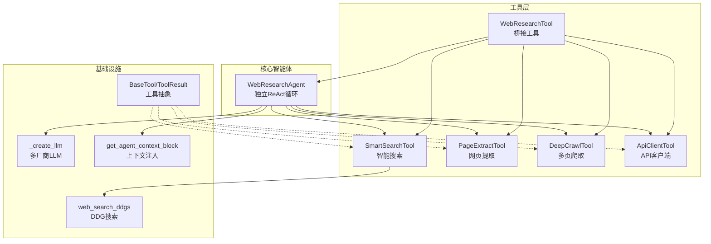
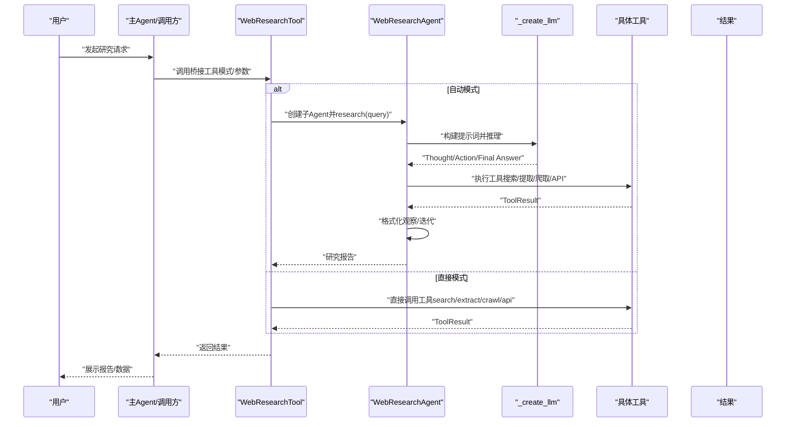
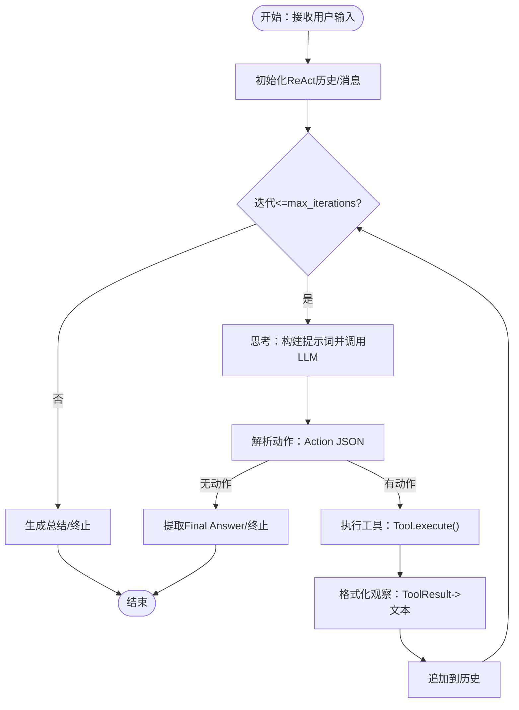
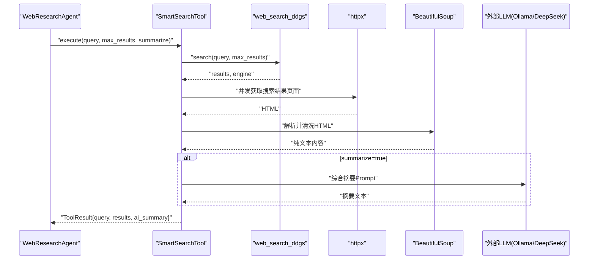
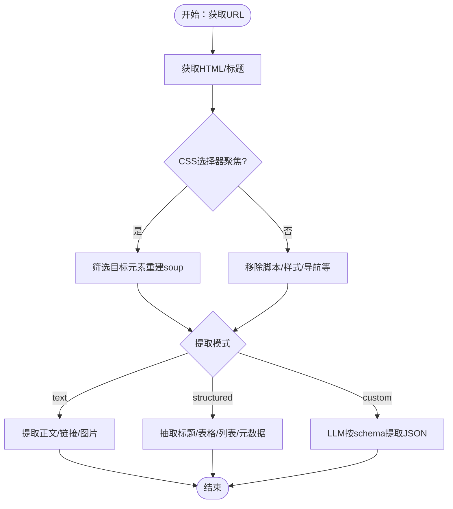
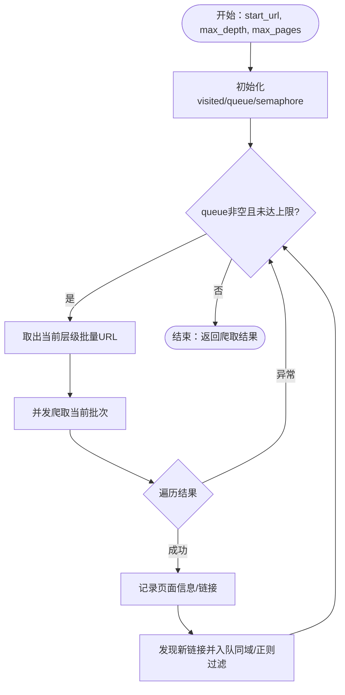
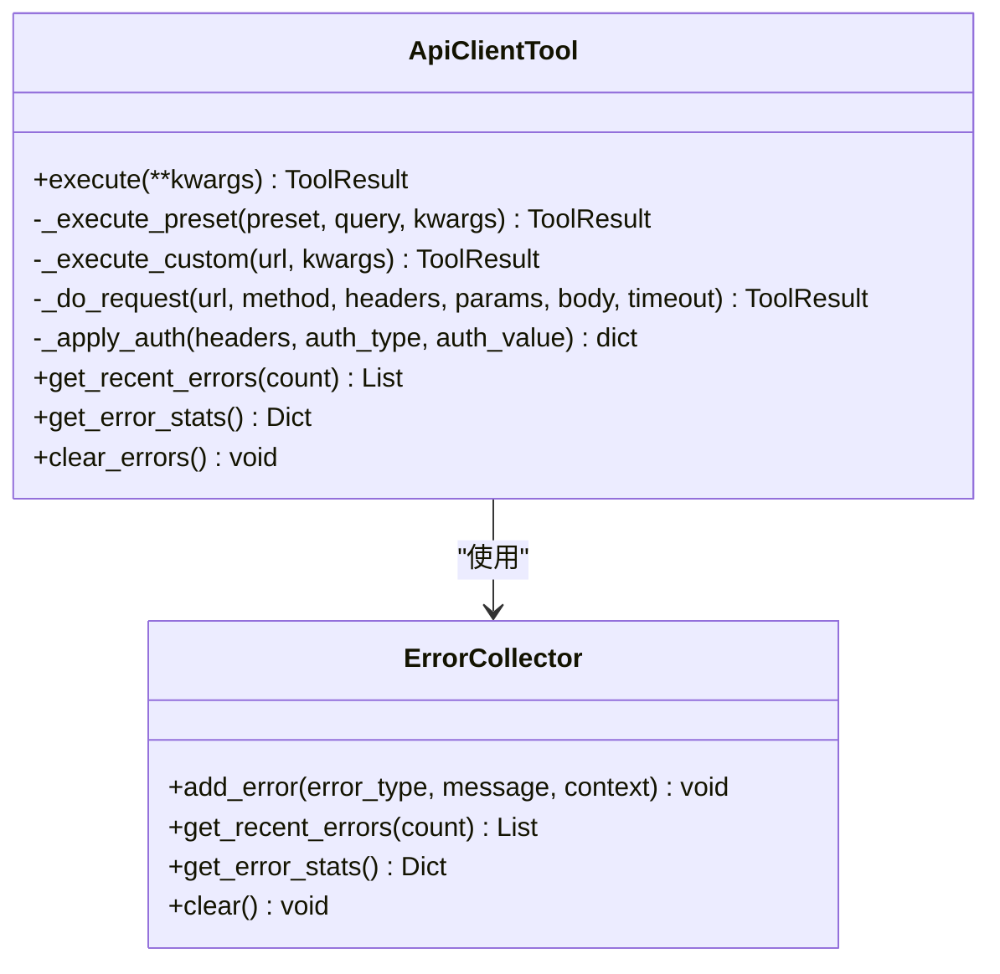
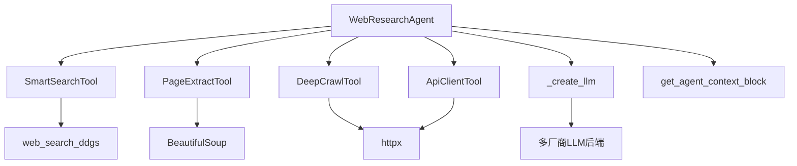

# AI驱动的Web研究

<cite>
**本文引用的文件**
- [web_research_agent.py](file://core/agents/web_research_agent.py)
- [react.py](file://core/patterns/react.py)
- [security_react.py](file://core/patterns/security_react.py)
- [smart_search_tool.py](file://tools/web_research/smart_search_tool.py)
- [page_extract_tool.py](file://tools/web_research/page_extract_tool.py)
- [deep_crawl_tool.py](file://tools/web_research/deep_crawl_tool.py)
- [api_client_tool.py](file://tools/web_research/api_client_tool.py)
- [web_research_tool.py](file://tools/web_research/web_research_tool.py)
- [web_search_ddgs.py](file://tools/web_search_ddgs.py)
- [base.py](file://tools/base.py)
- [context_info.py](file://utils/context_info.py)
- [README_CN.md](file://README_CN.md)
</cite>

## 目录
1. [简介](#简介)
2. [项目结构](#项目结构)
3. [核心组件](#核心组件)
4. [架构总览](#架构总览)
5. [详细组件分析](#详细组件分析)
6. [依赖关系分析](#依赖关系分析)
7. [性能考量](#性能考量)
8. [故障排查指南](#故障排查指南)
9. [结论](#结论)
10. [附录](#附录)

## 简介
本文件面向Secbot的AI驱动Web研究能力，系统性阐述WebResearchAgent的ReAct模式实现，覆盖智能搜索、网页内容提取、多页爬取与API调用的全流程。重点包括：
- ReAct循环与提示词工程：如何通过系统提示词与上下文注入，引导LLM在“思考-行动-观察-再思考”的循环中高效完成研究任务。
- 智能搜索算法：基于DuckDuckGo的搜索策略、结果页面抓取与AI摘要生成。
- 网页内容提取：纯文本、结构化数据与自定义模式的提取方法及AI辅助解析。
- 多页爬取：广度优先搜索（BFS）、URL过滤、并发控制与可选AI摘要。
- API调用：通用REST客户端与内置模板，支持认证、重试与错误统计。
- 实战应用：搜索策略优化、提取规则定制与数据导出建议。

## 项目结构
Web研究相关代码位于core/agents与tools/web_research两大模块，配合工具层的搜索与上下文注入工具，构成完整的研究闭环。

图表来源
- [web_research_agent.py](file://core/agents/web_research_agent.py#L52-L190)
- [smart_search_tool.py](file://tools/web_research/smart_search_tool.py#L12-L80)
- [page_extract_tool.py](file://tools/web_research/page_extract_tool.py#L11-L80)
- [deep_crawl_tool.py](file://tools/web_research/deep_crawl_tool.py#L13-L66)
- [api_client_tool.py](file://tools/web_research/api_client_tool.py#L132-L181)
- [web_research_tool.py](file://tools/web_research/web_research_tool.py#L23-L97)
- [web_search_ddgs.py](file://tools/web_search_ddgs.py#L71-L112)
- [base.py](file://tools/base.py#L9-L35)
- [context_info.py](file://utils/context_info.py#L82-L110)

章节来源
- [README_CN.md](file://README_CN.md#L52-L59)

## 核心组件
- WebResearchAgent：独立ReAct循环的Web研究子Agent，负责思考、解析动作、执行工具与汇总结果。
- 智能搜索工具：基于DuckDuckGo的搜索、结果页面并发抓取与AI摘要。
- 网页提取工具：纯文本、结构化数据与自定义schema的AI辅助提取。
- 多页爬取工具：BFS广度优先、URL过滤、并发与可选AI摘要。
- API客户端工具：通用REST调用、内置模板、认证与错误统计。
- 桥接工具：将主Agent的请求委派给子Agent，或直接按模式调用工具。

章节来源
- [web_research_agent.py](file://core/agents/web_research_agent.py#L52-L190)
- [smart_search_tool.py](file://tools/web_research/smart_search_tool.py#L12-L80)
- [page_extract_tool.py](file://tools/web_research/page_extract_tool.py#L11-L80)
- [deep_crawl_tool.py](file://tools/web_research/deep_crawl_tool.py#L13-L66)
- [api_client_tool.py](file://tools/web_research/api_client_tool.py#L132-L181)
- [web_research_tool.py](file://tools/web_research/web_research_tool.py#L23-L97)

## 架构总览
Web研究的端到端流程如下：主Agent通过WebResearchTool发起请求，可选择自动模式（子Agent自主研究）或直接模式（直连具体工具）。子Agent在ReAct循环中解析LLM输出的动作指令，调用相应工具，格式化观察结果，直至生成最终报告。

图表来源
- [web_research_tool.py](file://tools/web_research/web_research_tool.py#L45-L97)
- [web_research_agent.py](file://core/agents/web_research_agent.py#L114-L190)
- [security_react.py](file://core/patterns/security_react.py#L49-L140)

## 详细组件分析

### WebResearchAgent：ReAct循环与提示词工程
- ReAct循环：包含思考（_think）、动作解析（_parse_action）、工具执行（_execute_tool）、观察格式化（_format_observation）与最终汇总（_generate_summary）。
- 提示词与上下文：系统提示词强调“最少工具调用获取最多信息”“先搜索后提取”“标注来源”等原则；通过上下文注入函数注入当前时间、运行环境等真实世界信息，避免模型依赖过期知识。
- LLM创建：统一通过_create_llm工厂创建，支持Ollama、DeepSeek、OpenAI等多厂商后端，具备超时与错误提示机制。

图表来源
- [web_research_agent.py](file://core/agents/web_research_agent.py#L126-L190)
- [context_info.py](file://utils/context_info.py#L82-L110)
- [security_react.py](file://core/patterns/security_react.py#L49-L140)

章节来源
- [web_research_agent.py](file://core/agents/web_research_agent.py#L52-L190)
- [context_info.py](file://utils/context_info.py#L82-L110)
- [security_react.py](file://core/patterns/security_react.py#L49-L140)

### 智能搜索：DuckDuckGo策略与AI摘要
- 搜索引擎选择：优先使用ddgs库，失败时回退duckduckgo-search，最终回退HTML抓取（DuckDuckGo Lite）。
- 结果页面抓取：并发访问top-N搜索结果页面，使用BeautifulSoup清理脚本/样式/导航等噪声标签，提取纯文本。
- AI摘要：将多个页面内容合并，调用外部LLM（Ollama或DeepSeek）生成300字以内综合摘要，支持错误降级与超时控制。

图表来源
- [smart_search_tool.py](file://tools/web_research/smart_search_tool.py#L28-L80)
- [web_search_ddgs.py](file://tools/web_search_ddgs.py#L71-L112)
- [smart_search_tool.py](file://tools/web_research/smart_search_tool.py#L95-L128)
- [smart_search_tool.py](file://tools/web_research/smart_search_tool.py#L129-L209)

章节来源
- [smart_search_tool.py](file://tools/web_research/smart_search_tool.py#L12-L221)
- [web_search_ddgs.py](file://tools/web_search_ddgs.py#L14-L112)

### 网页内容提取：文本/结构化/自定义模式
- 纯文本模式：移除脚本/样式/导航等标签，保留正文与标题，提取链接与图片清单。
- 结构化模式：抽取标题层级、表格、列表、元数据等结构化信息，限制数量与长度。
- 自定义模式：将页面纯文本喂给LLM，按用户提供的schema生成JSON结构化输出，具备JSON片段提取与降级处理。

图表来源
- [page_extract_tool.py](file://tools/web_research/page_extract_tool.py#L27-L80)
- [page_extract_tool.py](file://tools/web_research/page_extract_tool.py#L86-L151)
- [page_extract_tool.py](file://tools/web_research/page_extract_tool.py#L157-L209)
- [page_extract_tool.py](file://tools/web_research/page_extract_tool.py#L215-L259)

章节来源
- [page_extract_tool.py](file://tools/web_research/page_extract_tool.py#L11-L349)

### 多页爬取：BFS、过滤与并发
- BFS策略：以队列按层级扩展，支持最大深度与最大页面数限制，避免无限爬取。
- URL过滤：支持正则过滤与同域限制，减少无关链接。
- 并发控制：信号量限制并发，提升吞吐。
- 可选AI摘要：对每页内容生成简要摘要，便于快速浏览。

图表来源
- [deep_crawl_tool.py](file://tools/web_research/deep_crawl_tool.py#L72-L148)
- [deep_crawl_tool.py](file://tools/web_research/deep_crawl_tool.py#L150-L218)

章节来源
- [deep_crawl_tool.py](file://tools/web_research/deep_crawl_tool.py#L13-L300)

### API客户端：模板与通用调用
- 内置模板：天气、IP信息、GitHub用户/仓库、汇率、DNS解析、URL展开等常用API。
- 通用调用：支持自定义URL、方法、请求头、查询参数、请求体、认证类型与超时。
- 错误处理：重试机制、详细异常分类与错误收集器，支持获取最近错误与统计信息。

图表来源
- [api_client_tool.py](file://tools/web_research/api_client_tool.py#L132-L181)
- [api_client_tool.py](file://tools/web_research/api_client_tool.py#L41-L41)

章节来源
- [api_client_tool.py](file://tools/web_research/api_client_tool.py#L132-L610)

### 桥接工具：自动/直接模式
- 自动模式：创建WebResearchAgent子Agent，交由其自主完成搜索→爬取→总结。
- 直接模式：根据模式直接调用SmartSearchTool/PageExtractTool/DeepCrawlTool/ApiClientTool，适合已知目标的快速执行。

章节来源
- [web_research_tool.py](file://tools/web_research/web_research_tool.py#L45-L180)

## 依赖关系分析
- 组件耦合：WebResearchAgent依赖工具层四大工具与LLM工厂；工具层彼此独立，通过BaseTool抽象统一接口。
- 外部依赖：httpx、BeautifulSoup、ddgs/duckduckgo-search、外部LLM服务（Ollama/DeepSeek/OpenAI等）。
- 循环依赖规避：WebResearchAgent延迟导入工具类，避免循环依赖。

图表来源
- [web_research_agent.py](file://core/agents/web_research_agent.py#L63-L79)
- [smart_search_tool.py](file://tools/web_research/smart_search_tool.py#L8-L10)
- [page_extract_tool.py](file://tools/web_research/page_extract_tool.py#L4-L8)
- [deep_crawl_tool.py](file://tools/web_research/deep_crawl_tool.py#L6-L10)
- [api_client_tool.py](file://tools/web_research/api_client_tool.py#L4-L10)
- [security_react.py](file://core/patterns/security_react.py#L49-L140)

章节来源
- [base.py](file://tools/base.py#L9-L35)
- [web_research_agent.py](file://core/agents/web_research_agent.py#L63-L79)

## 性能考量
- 并发抓取：搜索与爬取均采用并发策略，显著缩短整体耗时，需结合信号量与超时控制避免资源争用。
- 结果裁剪：对长文本与大JSON进行截断与摘要，降低LLM输入成本与Token消耗。
- LLM调用：统一超时与错误提示，避免阻塞；在AI摘要失败时提供降级提示。
- URL归一化与去重：爬取前对URL进行规范化与去重，减少重复请求与无效链接。

## 故障排查指南
- LLM连接失败：检查提供商配置与API Key/Base URL；查看连接提示与日志。
- 搜索失败：确认ddgs/duckduckgo-search安装与网络可达；回退到HTML抓取模式。
- 页面抓取异常：检查URL有效性、网络超时与内容类型；关注异常日志。
- API调用错误：查看错误统计与最近错误列表，确认认证、超时与重试策略。
- 提示词无效：核对系统提示词与上下文注入，确保包含当前时间与运行环境信息。

章节来源
- [security_react.py](file://core/patterns/security_react.py#L319-L338)
- [web_search_ddgs.py](file://tools/web_search_ddgs.py#L82-L111)
- [api_client_tool.py](file://tools/web_research/api_client_tool.py#L386-L467)

## 结论
Secbot的Web研究能力以WebResearchAgent为核心，结合ReAct模式与四大工具，实现了从智能搜索、网页提取、多页爬取到API调用的完整链路。通过上下文注入与多厂商LLM后端，系统在准确性与稳定性之间取得平衡；通过并发与裁剪策略，兼顾效率与成本。对于实际部署，建议优化搜索关键词、定制提取schema、合理设置并发与超时，并建立完善的错误统计与日志体系。

## 附录

### 实际应用场景与配置建议
- 智能搜索：针对复杂主题拆分关键词，控制max_results与summarize开关，结合AI摘要快速形成初稿。
- 网页提取：优先使用text模式快速概览，再用structured定位关键结构，最后用custom模式聚焦特定字段。
- 多页爬取：设定合理max_depth与max_pages，使用URL正则过滤无关页面，必要时开启extract_info生成摘要。
- API调用：优先使用内置模板，必要时自定义请求头与认证；配置超时与重试，记录错误统计。
- 数据导出：将ToolResult中的结构化数据（如results、pages、data）转换为Markdown/JSON，便于二次加工与报告生成。

章节来源
- [smart_search_tool.py](file://tools/web_research/smart_search_tool.py#L210-L221)
- [page_extract_tool.py](file://tools/web_research/page_extract_tool.py#L325-L349)
- [deep_crawl_tool.py](file://tools/web_research/deep_crawl_tool.py#L286-L300)
- [api_client_tool.py](file://tools/web_research/api_client_tool.py#L592-L610)
- [web_research_tool.py](file://tools/web_research/web_research_tool.py#L182-L255)