# Web研究智能体

<cite>
**本文档引用的文件**
- [core/agents/web_research_agent.py](file://core/agents/web_research_agent.py)
- [tools/web_research/web_research_tool.py](file://tools/web_research/web_research_tool.py)
- [tools/web_research/smart_search_tool.py](file://tools/web_research/smart_search_tool.py)
- [tools/web_research/deep_crawl_tool.py](file://tools/web_research/deep_crawl_tool.py)
- [tools/web_research/page_extract_tool.py](file://tools/web_research/page_extract_tool.py)
- [tools/web_research/api_client_tool.py](file://tools/web_research/api_client_tool.py)
- [tools/web_search.py](file://tools/web_search.py)
- [tools/web_search_ddgs.py](file://tools/web_search_ddgs.py)
- [core/patterns/security_react.py](file://core/patterns/security_react.py)
- [core/agents/base.py](file://core/agents/base.py)
- [hackbot_config/__init__.py](file://hackbot_config/__init__.py)
- [README_CN.md](file://README_CN.md)
</cite>

## 目录
1. [简介](#简介)
2. [项目结构](#项目结构)
3. [核心组件](#核心组件)
4. [架构概览](#架构概览)
5. [详细组件分析](#详细组件分析)
6. [依赖关系分析](#依赖关系分析)
7. [性能考虑](#性能考虑)
8. [故障排除指南](#故障排除指南)
9. [结论](#结论)

## 简介

Web研究智能体是Secbot系统中的一个专门化智能体，负责执行复杂的Web信息收集和研究任务。该智能体采用ReAct（推理-行动-观察）模式，能够自主完成互联网搜索、网页内容提取、多页面爬取和API数据获取等复杂任务。

Web研究智能体的核心价值在于：
- **自动化信息收集**：通过智能搜索、网页提取、深度爬取等方式自动收集相关信息
- **多模态数据处理**：支持纯文本、结构化数据和自定义模式的数据提取
- **智能分析整合**：将收集到的信息进行去重、交叉验证和结构化呈现
- **灵活的任务执行**：支持独立研究模式和直接调用模式，适应不同的使用场景

## 项目结构

Secbot项目采用模块化架构，Web研究智能体位于核心的agents模块中，相关的工具集位于tools/web_research目录下。

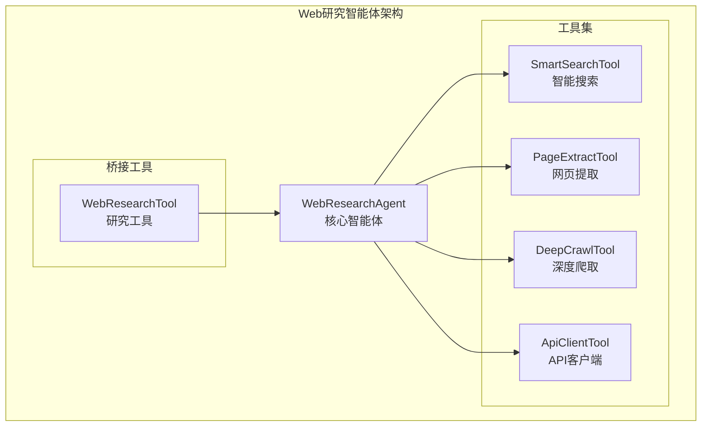

**图表来源**
- [core/agents/web_research_agent.py](file://core/agents/web_research_agent.py#L52-L76)
- [tools/web_research/web_research_tool.py](file://tools/web_research/web_research_tool.py#L23-L43)

**章节来源**
- [core/agents/web_research_agent.py](file://core/agents/web_research_agent.py#L1-L50)
- [tools/web_research/web_research_tool.py](file://tools/web_research/web_research_tool.py#L1-L30)

## 核心组件

Web研究智能体系统由四个核心组件构成，每个组件都有特定的功能和职责：

### WebResearchAgent（核心智能体）
- **职责**：独立的ReAct循环，负责协调和执行Web研究任务
- **能力**：智能搜索、网页提取、深度爬取、API交互
- **特点**：拥有独立的工具集合，可自主决策和执行

### WebResearchTool（桥接工具）
- **职责**：作为WebResearchAgent的桥接层，提供统一的调用接口
- **模式支持**：auto（自动研究）、search（智能搜索）、extract（网页提取）、crawl（深度爬取）、api（API调用）
- **灵活性**：既可委托子Agent执行，也可直接调用对应工具

### 智能搜索工具集
- **SmartSearchTool**：基于DuckDuckGo的智能搜索，自动访问结果页面并生成AI摘要
- **WebSearchTool**：基础网络搜索工具
- **WebSearchDDGS**：DuckDuckGo搜索客户端，支持多种搜索引擎回退机制

### 数据提取工具集
- **PageExtractTool**：支持纯文本、结构化和自定义模式的网页内容提取
- **DeepCrawlTool**：广度优先的多页面爬取工具
- **ApiClientTool**：通用REST API客户端，内置多种常用API模板

**章节来源**
- [core/agents/web_research_agent.py](file://core/agents/web_research_agent.py#L52-L83)
- [tools/web_research/web_research_tool.py](file://tools/web_research/web_research_tool.py#L23-L97)

## 架构概览

Web研究智能体在整个Secbot系统中扮演着重要的信息收集角色，与系统的其他组件协同工作。

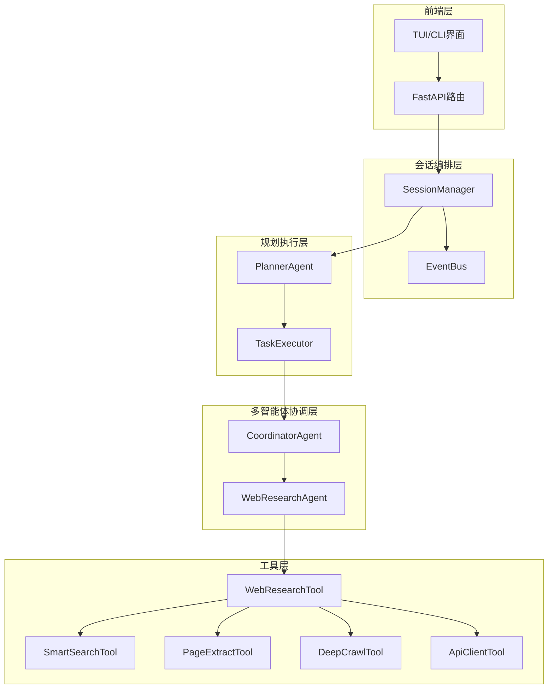

**图表来源**
- [README_CN.md](file://README_CN.md#L154-L200)
- [core/agents/web_research_agent.py](file://core/agents/web_research_agent.py#L52-L76)
- [tools/web_research/web_research_tool.py](file://tools/web_research/web_research_tool.py#L23-L43)

## 详细组件分析

### WebResearchAgent详细分析

WebResearchAgent是整个Web研究系统的核心，采用了先进的ReAct模式来实现智能的信息收集和处理。

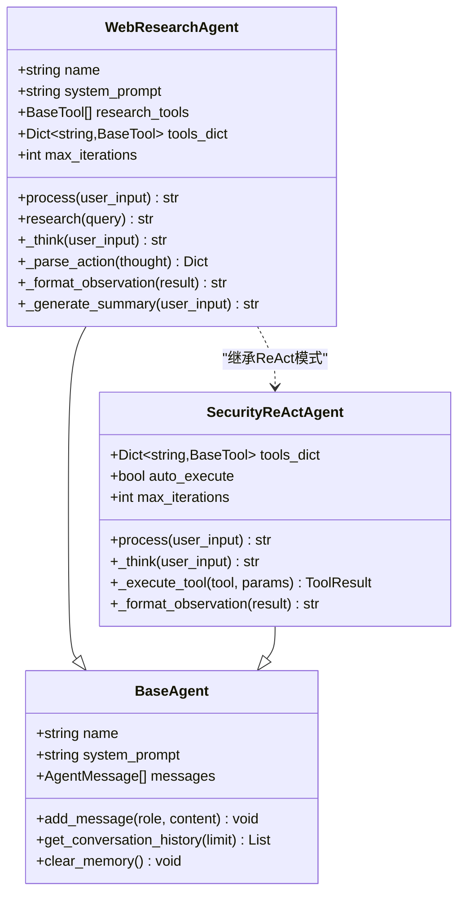

**图表来源**
- [core/agents/web_research_agent.py](file://core/agents/web_research_agent.py#L52-L83)
- [core/agents/base.py](file://core/agents/base.py#L17-L34)
- [core/patterns/security_react.py](file://core/patterns/security_react.py#L142-L190)

#### ReAct循环工作流程

WebResearchAgent的ReAct循环包含四个关键步骤：

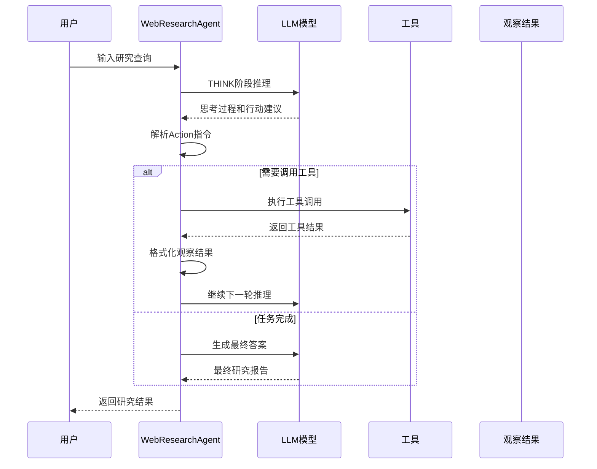

**图表来源**
- [core/agents/web_research_agent.py](file://core/agents/web_research_agent.py#L126-L190)
- [core/agents/web_research_agent.py](file://core/agents/web_research_agent.py#L196-L250)

#### 工具选择和执行机制

WebResearchAgent内置了四种专门的工具，每种工具都有特定的用途和优势：

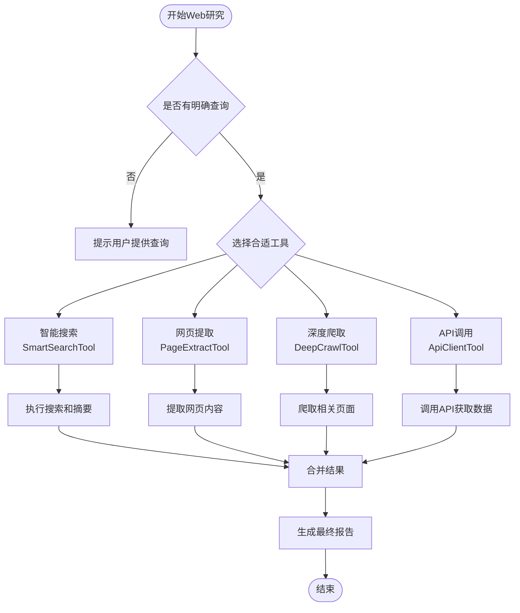

**图表来源**
- [core/agents/web_research_agent.py](file://core/agents/web_research_agent.py#L88-L93)
- [tools/web_research/smart_search_tool.py](file://tools/web_research/smart_search_tool.py#L12-L26)
- [tools/web_research/page_extract_tool.py](file://tools/web_research/page_extract_tool.py#L11-L25)
- [tools/web_research/deep_crawl_tool.py](file://tools/web_research/deep_crawl_tool.py#L13-L27)
- [tools/web_research/api_client_tool.py](file://tools/web_research/api_client_tool.py#L132-L152)

**章节来源**
- [core/agents/web_research_agent.py](file://core/agents/web_research_agent.py#L114-L190)
- [core/agents/web_research_agent.py](file://core/agents/web_research_agent.py#L196-L250)

### WebResearchTool详细分析

WebResearchTool作为桥接工具，提供了灵活的调用接口，支持两种不同的执行模式。

#### 模式对比分析

| 模式 | 描述 | 适用场景 | 优点 | 缺点 |
|------|------|----------|------|------|
| auto模式 | 委托WebResearchAgent子Agent自主完成研究 | 复杂研究任务，需要智能决策 | 自动化程度高，适合复杂场景 | 响应时间较长 |
| direct模式 | 直接调用对应工具，跳过子Agent | 简单明确的任务，需要快速响应 | 响应速度快，开销小 | 缺乏智能决策能力 |

#### 参数配置详解

WebResearchTool支持丰富的参数配置，以适应不同的使用需求：

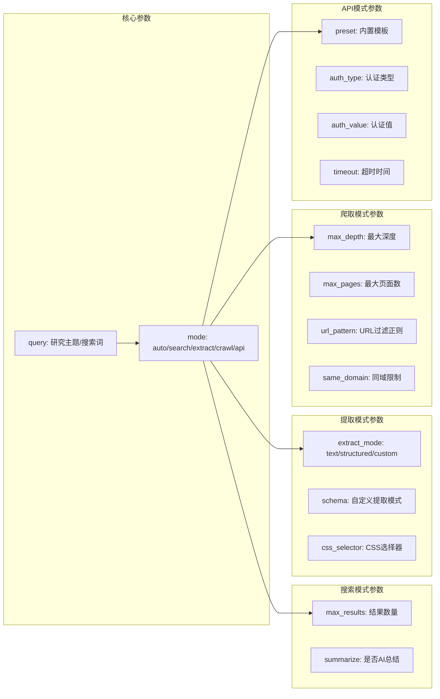

**图表来源**
- [tools/web_research/web_research_tool.py](file://tools/web_research/web_research_tool.py#L182-L254)

**章节来源**
- [tools/web_research/web_research_tool.py](file://tools/web_research/web_research_tool.py#L45-L97)
- [tools/web_research/web_research_tool.py](file://tools/web_research/web_research_tool.py#L103-L180)

### 智能搜索工具分析

SmartSearchTool是Web研究智能体的核心能力之一，实现了从搜索到摘要的完整流程。

#### 搜索流程架构

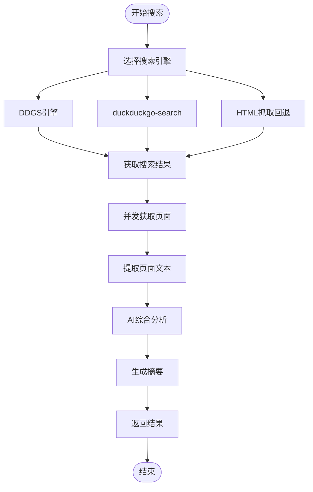

**图表来源**
- [tools/web_research/smart_search_tool.py](file://tools/web_research/smart_search_tool.py#L86-L94)
- [tools/web_search_ddgs.py](file://tools/web_search_ddgs.py#L71-L112)

#### 搜索引擎回退机制

SmartSearchTool实现了多层次的搜索引擎回退机制，确保搜索的可靠性：

1. **首选引擎**：ddgs库（推荐）
2. **兼容引擎**：duckduckgo-search库
3. **HTML回退**：DuckDuckGo Lite HTML抓取

这种设计确保了即使在某些环境下首选引擎不可用时，系统仍能正常工作。

**章节来源**
- [tools/web_research/smart_search_tool.py](file://tools/web_research/smart_search_tool.py#L28-L80)
- [tools/web_search_ddgs.py](file://tools/web_search_ddgs.py#L71-L112)

### 网页提取工具分析

PageExtractTool提供了三种不同的网页内容提取模式，满足不同场景的需求。

#### 提取模式对比

| 模式 | 描述 | 适用场景 | 技术特点 |
|------|------|----------|----------|
| text模式 | 提取纯文本内容，移除脚本、样式等噪声 | 一般信息阅读 | 使用BeautifulSoup清理HTML标签 |
| structured模式 | 提取结构化数据（表格、列表、标题等） | 数据分析和结构化处理 | 自动识别HTML结构元素 |
| custom模式 | 使用自定义schema进行AI驱动的提取 | 特定领域数据提取 | 结合LLM进行语义理解 |

#### AI辅助提取机制

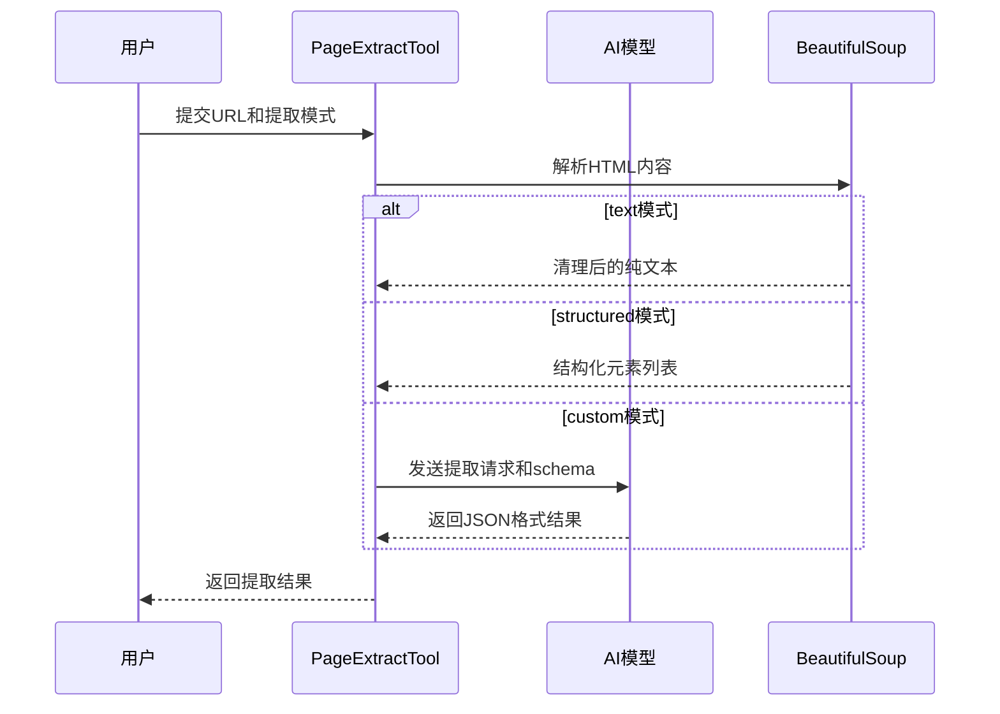

**图表来源**
- [tools/web_research/page_extract_tool.py](file://tools/web_research/page_extract_tool.py#L27-L80)
- [tools/web_research/page_extract_tool.py](file://tools/web_research/page_extract_tool.py#L215-L259)

**章节来源**
- [tools/web_research/page_extract_tool.py](file://tools/web_research/page_extract_tool.py#L11-L80)
- [tools/web_research/page_extract_tool.py](file://tools/web_research/page_extract_tool.py#L114-L210)

### 深度爬取工具分析

DeepCrawlTool实现了广度优先的多页面爬取功能，支持深度控制、URL过滤和并发限制。

#### BFS爬取算法

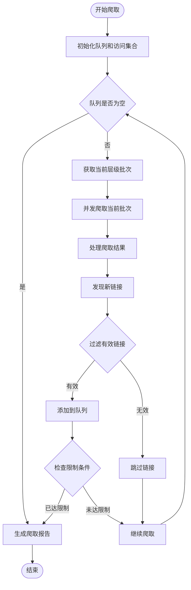

**图表来源**
- [tools/web_research/deep_crawl_tool.py](file://tools/web_research/deep_crawl_tool.py#L72-L148)

#### 并发控制和限制机制

DeepCrawlTool采用了多层限制机制来确保爬取的效率和安全性：

1. **深度限制**：防止无限深度爬取
2. **页面数量限制**：控制爬取的页面总数
3. **同域限制**：默认只爬取相同域名的页面
4. **URL过滤**：支持正则表达式过滤特定URL模式
5. **并发限制**：使用信号量控制同时进行的爬取任务数量

**章节来源**
- [tools/web_research/deep_crawl_tool.py](file://tools/web_research/deep_crawl_tool.py#L29-L66)
- [tools/web_research/deep_crawl_tool.py](file://tools/web_research/deep_crawl_tool.py#L72-L148)

### API客户端工具分析

ApiClientTool提供了通用的REST API调用能力，内置了多种常用的API模板。

#### 内置API模板

| 模板名称 | 功能描述 | 示例查询 | 使用场景 |
|----------|----------|----------|----------|
| weather | 天气查询 | 城市名称（如"北京"） | 天气信息获取 |
| ip_info | IP地址信息 | IP地址 | 地理位置查询 |
| github_user | GitHub用户信息 | 用户名 | 开发者信息查询 |
| github_repo | GitHub仓库信息 | owner/repo | 项目信息查询 |
| exchange_rate | 汇率查询 | 货币代码 | 金融信息获取 |
| country_info | 国家信息 | 国家名称 | 地理政治信息 |

#### 错误处理和重试机制

ApiClientTool实现了完善的错误处理和重试机制：

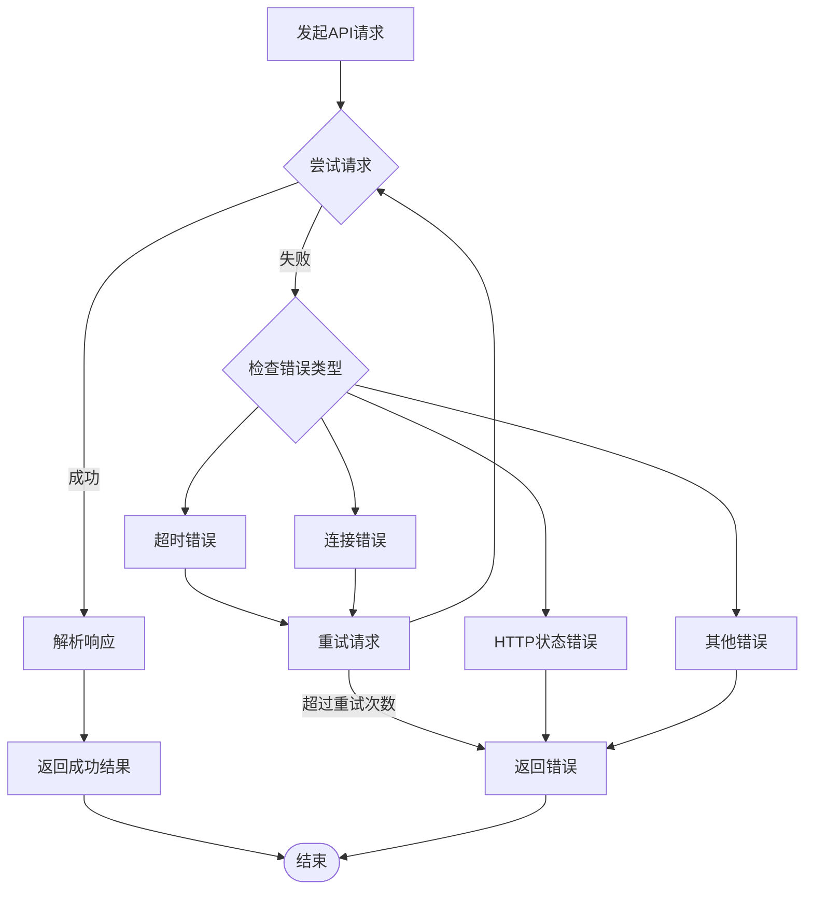

**图表来源**
- [tools/web_research/api_client_tool.py](file://tools/web_research/api_client_tool.py#L387-L467)

**章节来源**
- [tools/web_research/api_client_tool.py](file://tools/web_research/api_client_tool.py#L58-L129)
- [tools/web_research/api_client_tool.py](file://tools/web_research/api_client_tool.py#L154-L181)

## 依赖关系分析

Web研究智能体系统具有清晰的依赖层次结构，从底层的工具实现到上层的智能体协调。

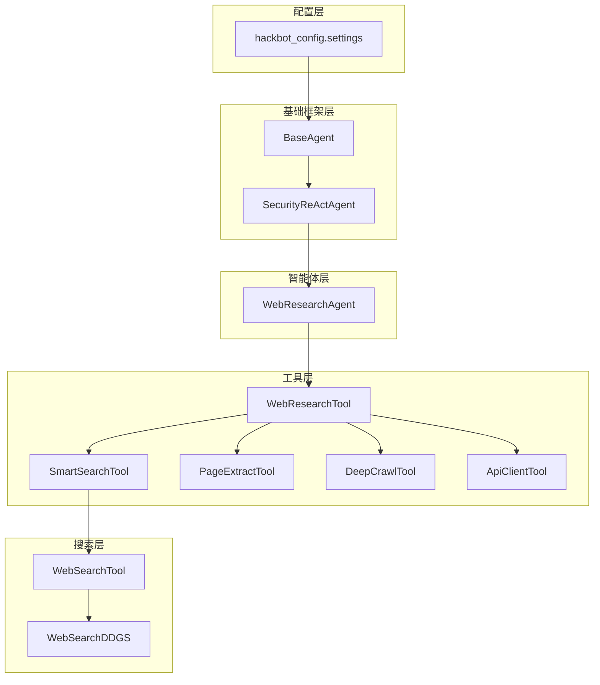

**图表来源**
- [hackbot_config/__init__.py](file://hackbot_config/__init__.py#L162-L246)
- [core/agents/base.py](file://core/agents/base.py#L17-L34)
- [core/patterns/security_react.py](file://core/patterns/security_react.py#L142-L190)
- [core/agents/web_research_agent.py](file://core/agents/web_research_agent.py#L52-L83)

### 依赖关系特点

1. **低耦合设计**：各个组件之间通过接口和协议进行通信，减少了直接依赖
2. **可扩展性**：新的工具可以轻松添加到工具集中
3. **配置驱动**：通过配置文件控制模型提供商和参数
4. **错误隔离**：每个组件都有独立的错误处理机制

**章节来源**
- [hackbot_config/__init__.py](file://hackbot_config/__init__.py#L162-L246)
- [core/agents/web_research_agent.py](file://core/agents/web_research_agent.py#L63-L76)

## 性能考虑

Web研究智能体在设计时充分考虑了性能优化，采用了多种技术和策略来提高系统的响应速度和处理能力。

### 并发处理策略

1. **异步I/O操作**：所有网络请求都采用异步方式，避免阻塞主线程
2. **并发限制**：使用信号量控制同时进行的爬取任务数量
3. **批量处理**：对同一层级的页面进行批量爬取和处理

### 缓存和优化机制

1. **URL归一化**：防止重复爬取相同的URL
2. **结果截断**：限制单个观察结果的长度，避免token爆炸
3. **智能重试**：对临时性错误进行指数退避重试

### 资源管理

1. **内存控制**：限制历史记录和观察结果的存储量
2. **超时控制**：为所有网络请求设置合理的超时时间
3. **连接池**：复用HTTP连接，减少连接开销

## 故障排除指南

### 常见问题和解决方案

#### 搜索功能问题

**问题**：智能搜索无法获取结果
**可能原因**：
- 网络连接问题
- 搜索引擎API限制
- 防火墙或代理阻止

**解决方法**：
1. 检查网络连接状态
2. 验证代理设置
3. 尝试使用不同的搜索模式

#### 爬取功能问题

**问题**：深度爬取无法正常工作
**可能原因**：
- URL过滤规则过于严格
- 并发限制导致性能问题
- 目标网站反爬虫机制

**解决方法**：
1. 调整URL过滤正则表达式
2. 增加并发限制
3. 添加适当的延迟和User-Agent

#### API调用问题

**问题**：API客户端返回错误
**可能原因**：
- 认证信息错误
- 请求参数格式不正确
- 目标API服务不可用

**解决方法**：
1. 验证API密钥和认证信息
2. 检查请求参数的JSON格式
3. 查看错误收集器中的详细错误信息

### 错误监控和诊断

ApiClientTool提供了完整的错误监控机制：

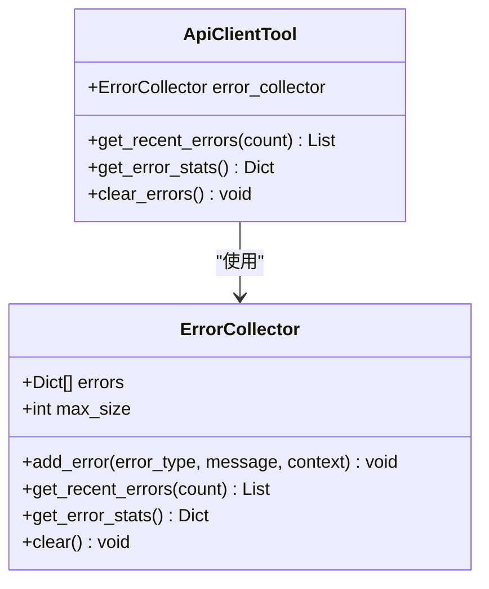

**图表来源**
- [tools/web_research/api_client_tool.py](file://tools/web_research/api_client_tool.py#L14-L41)
- [tools/web_research/api_client_tool.py](file://tools/web_research/api_client_tool.py#L563-L591)

**章节来源**
- [tools/web_research/api_client_tool.py](file://tools/web_research/api_client_tool.py#L14-L41)
- [tools/web_research/api_client_tool.py](file://tools/web_research/api_client_tool.py#L496-L557)

## 结论

Web研究智能体是Secbot系统中一个强大而灵活的信息收集组件，它通过以下关键特性为整个渗透测试流程提供了重要价值：

### 核心优势

1. **多模态信息处理**：支持从纯文本到结构化数据的全方位信息提取
2. **智能决策能力**：采用ReAct模式，能够自主选择最合适的工具和策略
3. **高度可扩展性**：模块化设计使得新工具可以轻松集成
4. **强大的错误处理**：完善的错误监控和恢复机制确保系统稳定性

### 在整体流程中的价值

Web研究智能体在整个渗透测试流程中发挥着信息收集的前置作用：

1. **情报收集阶段**：通过智能搜索和网页提取获取初始信息
2. **目标分析阶段**：使用深度爬取和API调用深入分析目标
3. **威胁建模阶段**：整合多源信息生成全面的威胁情报
4. **攻击准备阶段**：为后续的漏洞扫描和渗透测试提供数据支撑

### 技术创新点

1. **ReAct模式的应用**：将推理-行动-观察的智能模式应用于Web研究
2. **多引擎搜索回退机制**：确保搜索功能的高可用性
3. **智能提取算法**：结合AI技术实现高质量的信息提取
4. **并发控制策略**：平衡性能和资源使用的最佳实践

Web研究智能体不仅提升了Secbot系统的自动化水平，更为安全研究人员提供了一个强大而易用的信息收集工具，显著提高了渗透测试的效率和质量。