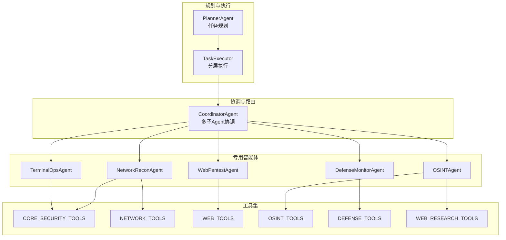
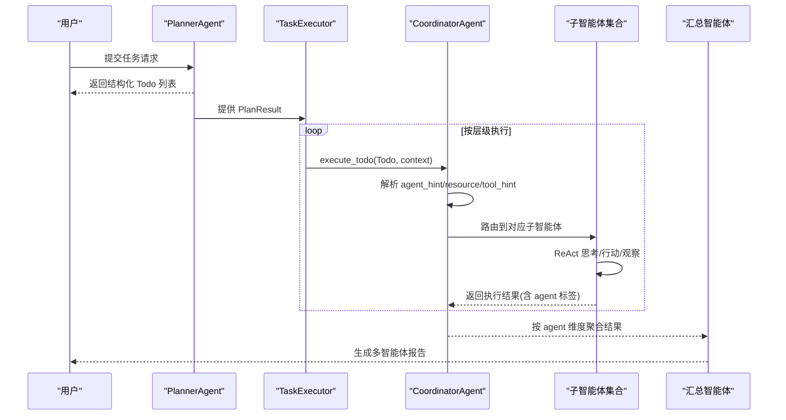
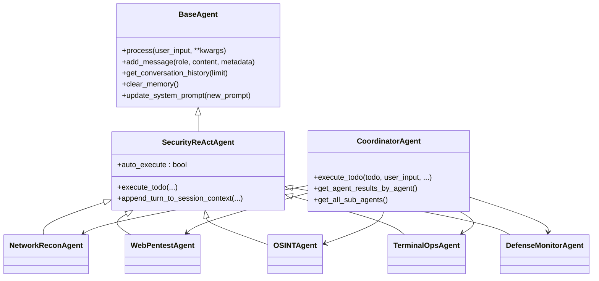

# 专用智能体

<cite>
**本文引用的文件**
- [specialist_agents.py](file://core/agents/specialist_agents.py)
- [coordinator_agent.py](file://core/agents/coordinator_agent.py)
- [base.py](file://core/agents/base.py)
- [security_react.py](file://core/patterns/security_react.py)
- [planner_agent.py](file://core/agents/planner_agent.py)
- [models.py](file://core/models.py)
- [executor.py](file://core/executor.py)
- [web_research_agent.py](file://core/agents/web_research_agent.py)
- [security/__init__.py](file://tools/pentest/security/__init__.py)
- [network/__init__.py](file://tools/pentest/network/__init__.py)
- [web/__init__.py](file://tools/web/__init__.py)
- [osint/__init__.py](file://tools/osint/__init__.py)
- [defense/__init__.py](file://tools/defense/__init__.py)
- [web_research/__init__.py](file://tools/web_research/__init__.py)
- [README_CN.md](file://README_CN.md)
</cite>

## 目录
1. [简介](#简介)
2. [项目结构](#项目结构)
3. [核心组件](#核心组件)
4. [架构总览](#架构总览)
5. [详细组件分析](#详细组件分析)
6. [依赖关系分析](#依赖关系分析)
7. [性能考量](#性能考量)
8. [故障排查指南](#故障排查指南)
9. [结论](#结论)
10. [附录](#附录)

## 简介
本文件围绕 Secbot 的“专用智能体”体系，系统阐述五类专职智能体的职责边界、专业能力与应用场景，并解释它们在任务规划、分层执行与事件流中的协作机制与信息共享方式。五类专用智能体分别为：
- 网络侦察智能体：负责网络资产枚举与基础探测，产出网络攻击面清单与风险评估
- Web 渗透智能体：专注 Web 站点与 API 的基础安全测试
- OSINT 智能体：负责外部情报与资产信息收集
- 终端操作智能体：在授权主机上执行命令与采集日志
- 防御监控智能体：负责本机/网络侧的安全防御与巡检

这些智能体统一复用 ReAct 引擎，通过专属工具集与 agent 类型标记，在任务执行期间实现“窄而深”的专业能力与跨智能体协同。

## 项目结构
围绕专用智能体的相关模块与文件分布如下：
- 智能体定义与路由：core/agents/specialist_agents.py、core/agents/coordinator_agent.py
- 基类与 ReAct 引擎：core/agents/base.py、core/patterns/security_react.py
- 任务规划与执行：core/agents/planner_agent.py、core/executor.py
- 数据模型：core/models.py
- 工具集聚合：tools/pentest/security/__init__.py、tools/pentest/network/__init__.py、tools/web/__init__.py、tools/osint/__init__.py、tools/defense/__init__.py、tools/web_research/__init__.py
- 独立研究子智能体：core/agents/web_research_agent.py
- 顶层说明与流程：README_CN.md

图表来源
- [coordinator_agent.py](file://core/agents/coordinator_agent.py#L28-L92)
- [specialist_agents.py](file://core/agents/specialist_agents.py#L80-L236)
- [security/__init__.py](file://tools/pentest/security/__init__.py#L33-L72)
- [network/__init__.py](file://tools/pentest/network/__init__.py#L15-L25)
- [web/__init__.py](file://tools/web/__init__.py#L14-L23)
- [osint/__init__.py](file://tools/osint/__init__.py#L9-L14)
- [defense/__init__.py](file://tools/defense/__init__.py#L10-L16)
- [web_research/__init__.py](file://tools/web_research/__init__.py#L13-L19)

章节来源
- [README_CN.md](file://README_CN.md#L187-L271)

## 核心组件
- 专用智能体基类与五大子智能体：统一继承 ReAct 引擎，各自绑定专属工具集与 agent 类型标记，确保在事件流中可按来源维度渲染与聚合。
- 协调器：根据 Todo 的 agent_hint/resource/tool_hint 选择对应子智能体执行，并聚合各智能体的工具执行结果，供汇总智能体生成多智能体报告。
- 任务规划器：将用户请求转化为结构化 Todo 列表，推断 resource/risk_level/agent_hint，形成可并行/串行的执行层级。
- 任务执行器：按层级顺序执行 Todo，支持并发与事件流推送，同时在上下文中聚合按资产维度的结果，便于后续步骤复用。
- 数据模型：TodoItem/PlanResult/Session 等模型贯穿规划、执行与会话摘要，支撑跨轮记忆与结果组织。

章节来源
- [specialist_agents.py](file://core/agents/specialist_agents.py#L32-L245)
- [coordinator_agent.py](file://core/agents/coordinator_agent.py#L40-L331)
- [planner_agent.py](file://core/agents/planner_agent.py#L20-L837)
- [executor.py](file://core/executor.py#L17-L179)
- [models.py](file://core/models.py#L23-L137)

## 架构总览
专用智能体的协作流程如下：
- 用户输入经任务规划器生成结构化 Todo 列表，并推断资源、风险与智能体建议
- 任务执行器按层级顺序驱动协调器执行
- 协调器依据 Todo 的 agent_hint/resource/tool_hint 选择对应子智能体
- 子智能体在 ReAct 循环中使用专属工具集执行任务，事件流携带 agent 标签
- 协调器聚合各子智能体结果，交由汇总智能体生成多智能体报告

图表来源
- [planner_agent.py](file://core/agents/planner_agent.py#L86-L128)
- [executor.py](file://core/executor.py#L46-L133)
- [coordinator_agent.py](file://core/agents/coordinator_agent.py#L130-L181)
- [specialist_agents.py](file://core/agents/specialist_agents.py#L80-L236)

章节来源
- [README_CN.md](file://README_CN.md#L187-L271)

## 详细组件分析

### 网络侦察智能体（NetworkReconAgent）
- 职责与能力
  - 基于授权目标执行端口扫描、服务识别、主机/子网发现等
  - 汇总网络攻击面：开放端口、关键服务、可疑暴露面
  - 为后续 Web 渗透与防御巡检提供“网络侧”情报基础
- 专属工具集
  - 核心安全工具 + 网络工具集（DNS 查询、WHOIS、SSL 分析、HTTP 请求、Ping 扫描、Traceroute、子域名枚举、Banner 抓取、ARP 扫描等）
- 应用场景
  - 内网/外网资产测绘
  - 识别高价值服务与异常暴露
  - 为 Web 渗透提供目标与协议层面的前置信息
- 事件与渲染
  - 在事件流中以 network_recon 标识来源，前端渲染时可见标签

章节来源
- [specialist_agents.py](file://core/agents/specialist_agents.py#L66-L95)
- [network/__init__.py](file://tools/pentest/network/__init__.py#L15-L25)
- [security/__init__.py](file://tools/pentest/security/__init__.py#L33-L38)

### Web 渗透智能体（WebPentestAgent）
- 职责与能力
  - 针对授权的 Web 资产执行目录枚举、指纹识别、基础安全检查
  - 关注常见弱点：目录暴露、弱证书、危险 HTTP 头、CORS 配置等
  - 为更深入的人工渗透或高危测试提供前置信息
- 专属工具集
  - Web 安全工具集（目录爆破、WAF 检测、技术栈识别、Header 分析、参数 Fuzzer、SSRF 检测、JWT 分析等）
- 应用场景
  - Web 站点与 API 的基础安全评估
  - 发现路径穿越、越权与配置缺陷
  - 为人工渗透提供可利用的线索与证据
- 事件与渲染
  - 在事件流中以 web_pentest 标识来源，前端渲染时可见标签

章节来源
- [specialist_agents.py](file://core/agents/specialist_agents.py#L102-L130)
- [web/__init__.py](file://tools/web/__init__.py#L14-L23)
- [security/__init__.py](file://tools/pentest/security/__init__.py#L44-L55)

### OSINT 智能体（OSINTAgent）
- 职责与能力
  - 结合 OSINT 与 WebResearch 工具，对域名、IP、组织名等进行公开情报查询
  - 关注暴露资产、历史泄露、恶意情报等
  - 为网络侦察与 Web 渗透提供“外部视角”的补充信息
- 专属工具集
  - OSINT 工具集（Shodan 查询、VirusTotal 检测、证书透明度查询、凭据泄露检查）
  - Web 研究工具集（智能搜索、网页提取、深度爬取、API 交互）
- 应用场景
  - 域名与组织关联信息收集
  - 历史泄露与威胁情报关联
  - 为网络与 Web 测试提供旁路信息与背景资料
- 事件与渲染
  - 在事件流中以 osint 标识来源，前端渲染时可见标签

章节来源
- [specialist_agents.py](file://core/agents/specialist_agents.py#L137-L166)
- [osint/__init__.py](file://tools/osint/__init__.py#L9-L14)
- [web_research/__init__.py](file://tools/web_research/__init__.py#L13-L19)
- [web_research_agent.py](file://core/agents/web_research_agent.py#L52-L372)

### 终端操作智能体（TerminalOpsAgent）
- 职责与能力
  - 打开/维护/关闭终端会话
  - 在授权目录内执行命令、收集日志、运行小脚本
  - 严格遵循“只在授权范围内执行，避免破坏性动作”的原则
- 专属工具集
  - 持久化终端会话工具（open/exec/read/close/list）
- 应用场景
  - 授权主机上的信息采集与验证
  - 小规模脚本执行与日志收集
  - 与网络/Web/防御智能体配合，形成闭环验证
- 事件与渲染
  - 在事件流中以 terminal_ops 标识来源，前端渲染时可见标签

章节来源
- [specialist_agents.py](file://core/agents/specialist_agents.py#L173-L201)
- [security/__init__.py](file://tools/pentest/security/__init__.py#L24-L24)

### 防御监控智能体（DefenseMonitorAgent）
- 职责与能力
  - 调用防御类工具检查系统安全状态（自检漏洞、入侵检测、网络流量分析等）
  - 汇总当前防御面的薄弱点与告警信息
  - 提出清晰、可执行的加固建议
- 专属工具集
  - 防御工具集（防御扫描、自检扫描、入侵检测、网络分析、系统信息收集）
- 应用场景
  - 本机/网络侧安全巡检
  - 威胁检测与脆弱性评估
  - 生成可落地的加固建议与修复清单
- 事件与渲染
  - 在事件流中以 defense_monitor 标识来源，前端渲染时可见标签

章节来源
- [specialist_agents.py](file://core/agents/specialist_agents.py#L208-L236)
- [defense/__init__.py](file://tools/defense/__init__.py#L10-L16)

### 协调器与路由机制
- 路由决策
  - 优先使用 Planner 预填的 agent_hint
  - 其次根据 resource 前缀（host:/subnet:/ip:/web:/domain:/osint:）回退
  - 最后根据 tool_hint 关键词再做兜底
- 结果聚合
  - 每次执行后为结果打上 agent 标签，并按 agent 维度聚合，供汇总智能体使用
- 会话上下文
  - 每轮结束后将摘要式上下文同步到所有子智能体，增强跨轮记忆与一致性

章节来源
- [coordinator_agent.py](file://core/agents/coordinator_agent.py#L242-L330)
- [coordinator_agent.py](file://core/agents/coordinator_agent.py#L187-L237)

### ReAct 引擎与事件流
- ReAct 循环
  - Think -> Action -> Observation -> ... -> Final Answer，自动/手动两种执行模式
- 事件流
  - 所有事件自动附加 agent 字段（优先 agent_type，其次 name）
  - 前端按 agent 标签区分渲染，明确来源

章节来源
- [security_react.py](file://core/patterns/security_react.py#L142-L200)
- [README_CN.md](file://README_CN.md#L234-L248)

## 依赖关系分析
- 专用智能体依赖关系
  - NetworkReconAgent：CORE_SECURITY_TOOLS + NETWORK_TOOLS
  - WebPentestAgent：WEB_TOOLS
  - OSINTAgent：OSINT_TOOLS + WEB_RESEARCH_TOOLS
  - TerminalOpsAgent：TerminalSessionTool
  - DefenseMonitorAgent：DEFENSE_TOOLS
- 协调器与子智能体
  - 协调器持有五个子智能体实例，统一注入审计与事件总线
- 任务规划与执行
  - Planner 生成 Todo，Executor 按层级执行，Coordinator 路由到子智能体

图表来源
- [base.py](file://core/agents/base.py#L17-L125)
- [security_react.py](file://core/patterns/security_react.py#L142-L200)
- [coordinator_agent.py](file://core/agents/coordinator_agent.py#L40-L92)
- [specialist_agents.py](file://core/agents/specialist_agents.py#L80-L236)

章节来源
- [specialist_agents.py](file://core/agents/specialist_agents.py#L13-L29)
- [coordinator_agent.py](file://core/agents/coordinator_agent.py#L72-L92)

## 性能考量
- 并发与串行
  - 任务执行器按层级顺序执行，单 Todo 层串行，多 Todo 层并发，兼顾安全性与效率
- 资源与风险控制
  - 同一资源上的高危步骤强制串行，避免对同一资产产生叠加风险
- ReAct 迭代限制
  - 各子智能体设置合理的 max_iterations，防止长尾任务占用资源
- 事件流与前端渲染
  - 事件按计划顺序推送，保证前端线性渲染与用户体验

章节来源
- [executor.py](file://core/executor.py#L64-L133)
- [planner_agent.py](file://core/agents/planner_agent.py#L180-L248)
- [specialist_agents.py](file://core/agents/specialist_agents.py#L86-L95)
- [specialist_agents.py](file://core/agents/specialist_agents.py#L121-L130)
- [specialist_agents.py](file://core/agents/specialist_agents.py#L192-L201)
- [specialist_agents.py](file://core/agents/specialist_agents.py#L227-L236)

## 故障排查指南
- 任务规划失败
  - 检查 Planner 的请求类型判定与 JSON 输出是否符合预期
  - 关注 fallback_plan 的触发条件与 resource/risk_level 推断
- 执行路由错误
  - 确认 Todo 的 agent_hint/resource/tool_hint 是否正确
  - 若均未命中，协调器将回退到默认智能体
- 工具执行异常
  - 查看事件流中的错误事件与工具返回结果
  - 检查工具敏感度与用户确认流程（自动/手动模式）
- 事件流渲染异常
  - 确认事件是否带有 agent 字段
  - 检查前端是否按 agent 标签进行差异化渲染

章节来源
- [planner_agent.py](file://core/agents/planner_agent.py#L444-L538)
- [coordinator_agent.py](file://core/agents/coordinator_agent.py#L154-L181)
- [security_react.py](file://core/patterns/security_react.py#L142-L200)
- [README_CN.md](file://README_CN.md#L234-L248)

## 结论
专用智能体体系通过“窄而深”的职责划分与 ReAct 引擎，实现了网络、Web、OSINT、终端与防御五大领域的专业化执行。协调器负责路由与聚合，任务规划器与执行器保障任务的结构化与安全并发，事件流与前端渲染确保用户可感知每一步来源与进展。该体系既满足自动化安全测试的效率诉求，也兼顾授权范围内的合规与安全。

## 附录
- 实际应用示例与使用场景
  - 网络侦察：对目标子网进行端口扫描与服务识别，输出开放端口与高危服务清单
  - Web 渗透：针对授权域名执行目录枚举与指纹识别，定位潜在越权与配置缺陷
  - OSINT：查询域名与 IP 的历史泄露与威胁情报，补充网络与 Web 测试背景
  - 终端操作：在授权主机上执行命令采集系统信息，验证前置发现
  - 防御监控：对本机进行漏洞扫描与入侵检测，输出加固建议与修复清单
- 信息共享方式
  - 通过 Todo 的 resource 与 risk_level 实现资产维度与风险维度的上下文传递
  - 协调器按 agent 维度聚合结果，汇总智能体据此生成多智能体报告
  - 每轮任务结束后同步摘要式上下文，增强跨轮一致性

章节来源
- [README_CN.md](file://README_CN.md#L187-L271)
- [models.py](file://core/models.py#L23-L60)
- [coordinator_agent.py](file://core/agents/coordinator_agent.py#L187-L237)