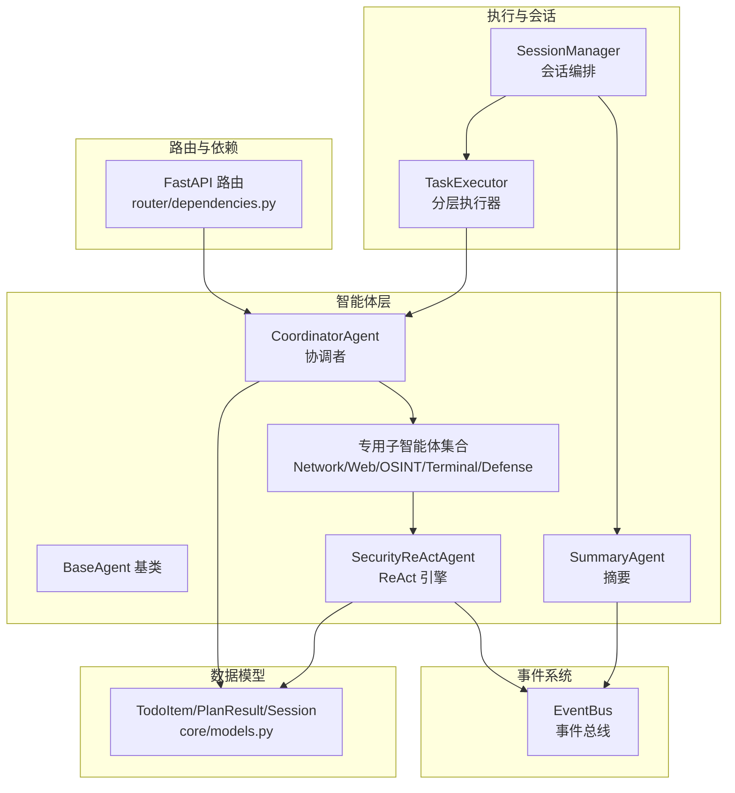
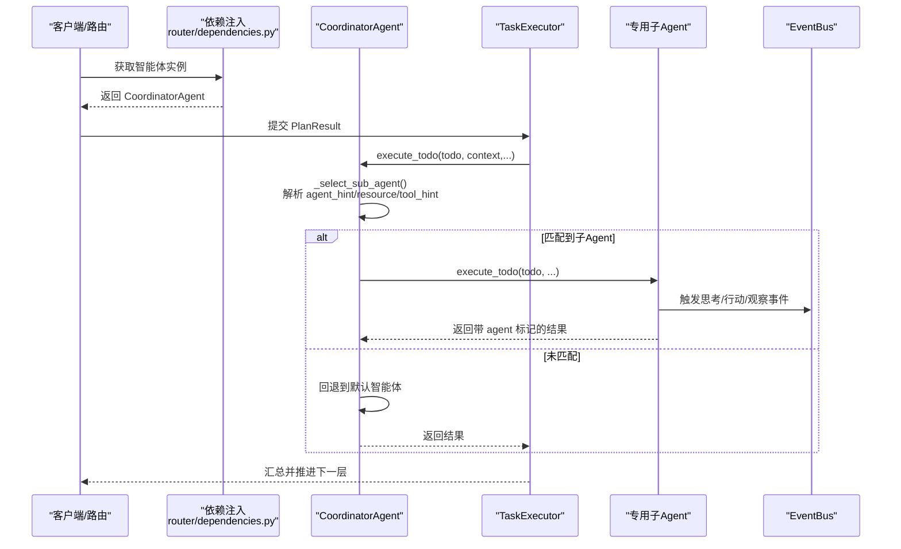
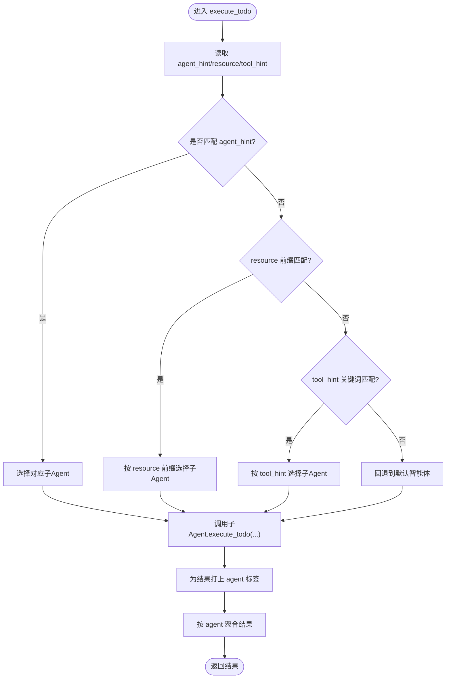
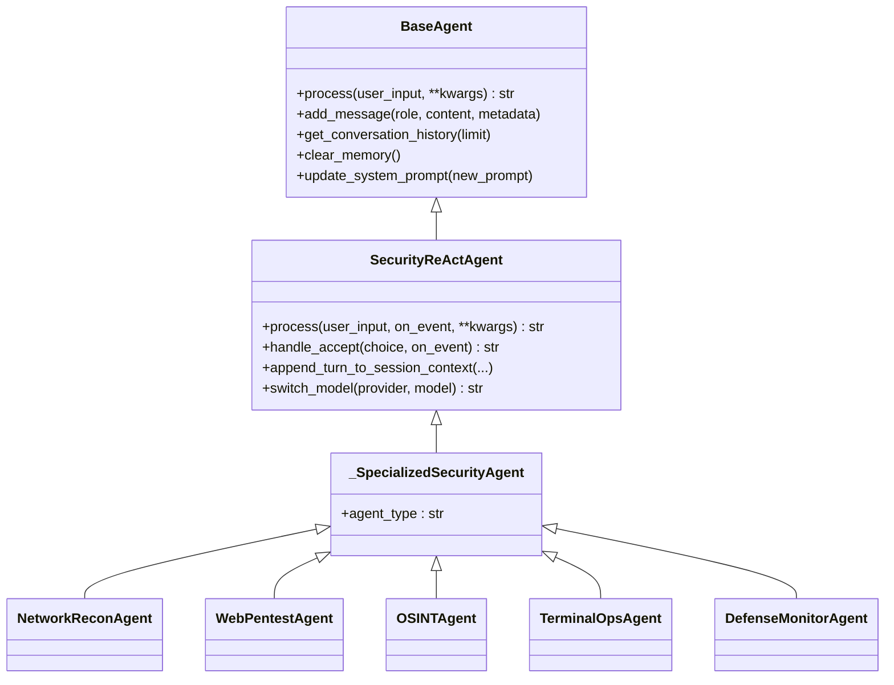
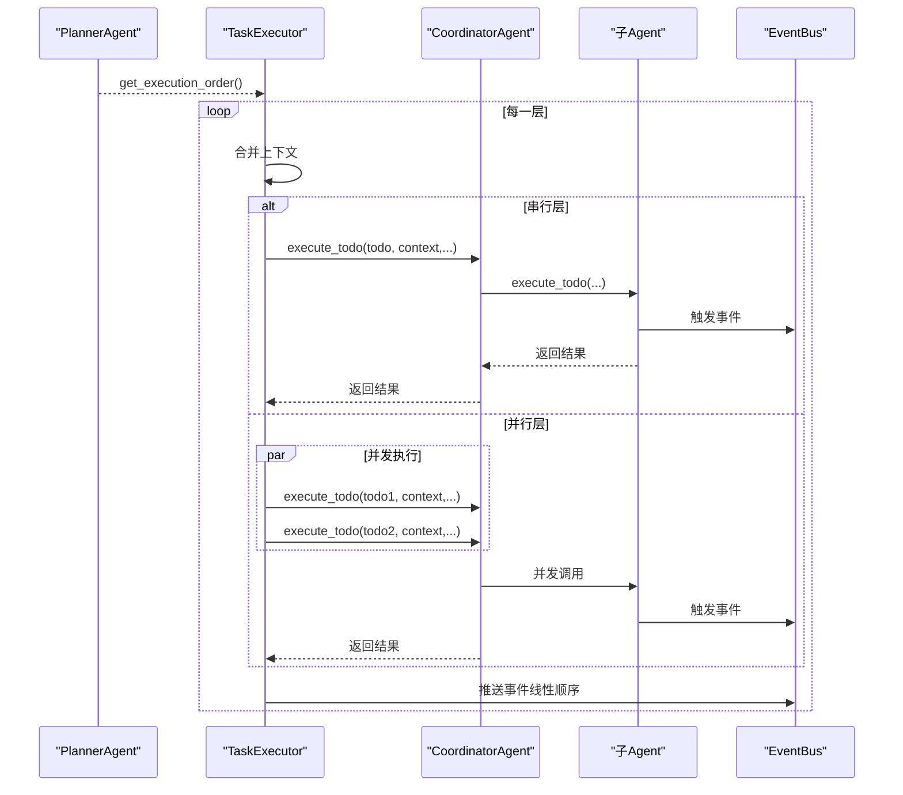
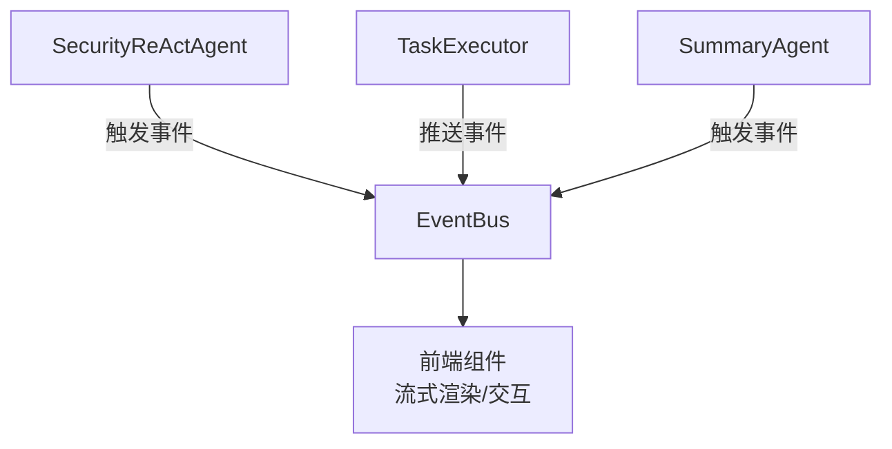
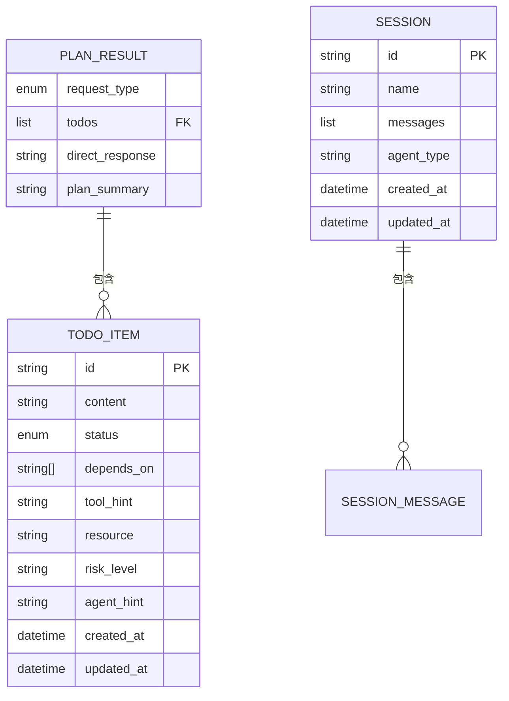
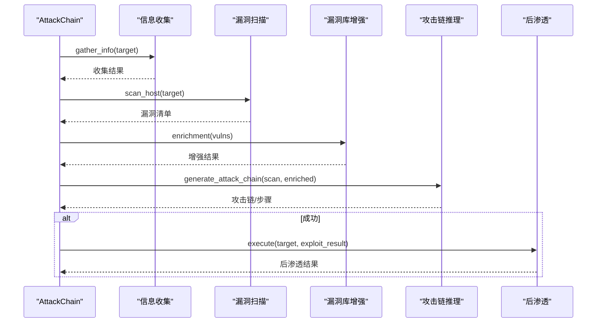
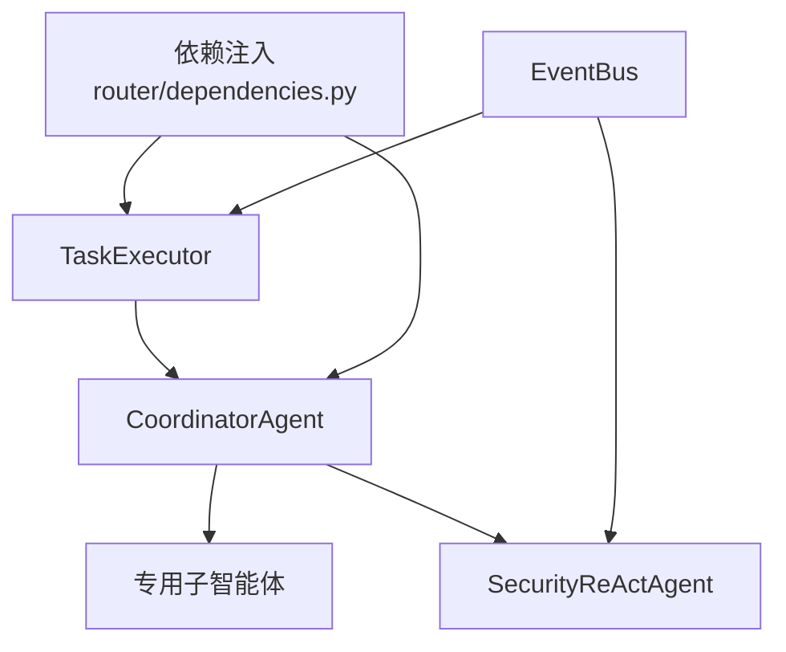

# 协调者智能体

<cite>
**本文引用的文件**
- [core/agents/coordinator_agent.py](file://core/agents/coordinator_agent.py)
- [core/agents/specialist_agents.py](file://core/agents/specialist_agents.py)
- [core/agents/base.py](file://core/agents/base.py)
- [core/patterns/security_react.py](file://core/patterns/security_react.py)
- [core/models.py](file://core/models.py)
- [core/executor.py](file://core/executor.py)
- [router/dependencies.py](file://router/dependencies.py)
- [utils/event_bus.py](file://utils/event_bus.py)
- [core/session.py](file://core/session.py)
- [router/agents.py](file://router/agents.py)
- [core/attack_chain/attack_chain.py](file://core/attack_chain/attack_chain.py)
</cite>

## 目录
1. [简介](#简介)
2. [项目结构](#项目结构)
3. [核心组件](#核心组件)
4. [架构总览](#架构总览)
5. [详细组件分析](#详细组件分析)
6. [依赖分析](#依赖分析)
7. [性能考虑](#性能考虑)
8. [故障排查指南](#故障排查指南)
9. [结论](#结论)
10. [附录](#附录)

## 简介
协调者智能体（CoordinatorAgent）是 Secbot A2A（Agent-to-Agent）架构的入口与中枢，负责在分层执行模式下将单步任务（Todo）路由到五个专用智能体之一，或在普通对话/同步模式下回退到默认智能体。其核心职责包括：
- 作为对外统一入口，兼容历史 hackbot 行为；
- 基于 Todo 的 agent_hint/resource/tool_hint，将任务精确路由到 NetworkRecon、WebPentest、OSINT、TerminalOps、DefenseMonitor；
- 聚合各子 Agent 的工具执行结果，供 SummaryAgent 做多 Agent 汇总；
- 通过事件总线与 UI 解耦，支持流式渲染与交互反馈。

## 项目结构
围绕协调者智能体的相关模块分布如下：
- 智能体层：协调者、专用子智能体、基础智能体、ReAct 引擎、摘要智能体
- 执行层：任务执行器（TaskExecutor）与会话编排（SessionManager）
- 路由与依赖：FastAPI 路由、依赖注入（单例容器）
- 事件系统：EventBus 事件总线
- 数据模型：Todo/TodoItem、PlanResult、Session 等

**图表来源**
- [router/dependencies.py](file://router/dependencies.py#L70-L89)
- [core/agents/coordinator_agent.py](file://core/agents/coordinator_agent.py#L40-L98)
- [core/agents/specialist_agents.py](file://core/agents/specialist_agents.py#L32-L247)
- [core/patterns/security_react.py](file://core/patterns/security_react.py#L142-L190)
- [core/executor.py](file://core/executor.py#L17-L38)
- [utils/event_bus.py](file://utils/event_bus.py#L68-L81)
- [core/models.py](file://core/models.py#L23-L60)

**章节来源**
- [router/dependencies.py](file://router/dependencies.py#L70-L89)
- [core/agents/coordinator_agent.py](file://core/agents/coordinator_agent.py#L40-L98)
- [core/agents/specialist_agents.py](file://core/agents/specialist_agents.py#L32-L247)
- [core/patterns/security_react.py](file://core/patterns/security_react.py#L142-L190)
- [core/executor.py](file://core/executor.py#L17-L38)
- [utils/event_bus.py](file://utils/event_bus.py#L68-L81)
- [core/models.py](file://core/models.py#L23-L60)

## 核心组件
- 协调者智能体（CoordinatorAgent）
  - 对外作为 hackbot 暴露，普通对话/同步模式委托给默认智能体；
  - 分层执行模式下根据 Todo 的 agent_hint/resource/tool_hint 路由到专用子 Agent；
  - 聚合各子 Agent 的工具执行结果，供摘要智能体汇总。
- 专用子智能体（NetworkRecon、WebPentest、OSINT、TerminalOps、DefenseMonitor）
  - 统一继承 SecurityReActAgent，具备 ReAct 能力与事件标记；
  - 挂载专属工具集，按 agent_type 标识来源。
- ReAct 引擎（SecurityReActAgent）
  - 实现 Think -> Action -> Observation -> Final Answer 的循环；
  - 支持自动执行与用户确认两种模式，事件驱动与流式输出。
- 任务执行器（TaskExecutor）
  - 按 Planner 的分层执行顺序（拓扑+资源/风险并发控制）串行或并行执行；
  - 将每个 Todo 的上下文合并后调用协调者 execute_todo。
- 事件总线（EventBus）
  - 统一事件类型与结构，支持同步/异步订阅与发射，解耦 UI 与核心层。
- 数据模型（TodoItem、PlanResult、Session）
  - TodoItem 描述单步任务（包含 agent_hint/resource/tool_hint/risk_level 等）；
  - PlanResult 描述规划结果与 Todos；
  - Session 管理会话消息与元数据。

**章节来源**
- [core/agents/coordinator_agent.py](file://core/agents/coordinator_agent.py#L40-L98)
- [core/agents/specialist_agents.py](file://core/agents/specialist_agents.py#L32-L247)
- [core/patterns/security_react.py](file://core/patterns/security_react.py#L142-L190)
- [core/executor.py](file://core/executor.py#L17-L38)
- [utils/event_bus.py](file://utils/event_bus.py#L15-L49)
- [core/models.py](file://core/models.py#L23-L60)

## 架构总览
协调者智能体在 A2A 架构中的位置与交互如下：

**图表来源**
- [router/dependencies.py](file://router/dependencies.py#L70-L89)
- [core/agents/coordinator_agent.py](file://core/agents/coordinator_agent.py#L130-L181)
- [core/executor.py](file://core/executor.py#L82-L104)
- [utils/event_bus.py](file://utils/event_bus.py#L15-L49)

**章节来源**
- [router/dependencies.py](file://router/dependencies.py#L70-L89)
- [core/agents/coordinator_agent.py](file://core/agents/coordinator_agent.py#L130-L181)
- [core/executor.py](file://core/executor.py#L82-L104)
- [utils/event_bus.py](file://utils/event_bus.py#L15-L49)

## 详细组件分析

### 协调者智能体（CoordinatorAgent）
- 外部接口
  - process(user_input): 兼容历史 hackbot 行为，委托给默认智能体；
  - execute_todo(...): 分层执行入口，接收 Todo、上下文、事件回调等。
- 路由策略
  - 优先使用 Todo.agent_hint；
  - 其次根据 Todo.resource 前缀匹配；
  - 最后根据 Todo.tool_hint 关键词匹配；
  - 无法匹配时回退到默认智能体。
- 结果聚合
  - 为每个子 Agent 的执行结果打上 agent 标签；
  - 按 agent 类型维护列表，供摘要智能体使用。
- 会话上下文
  - 将本轮摘要式上下文追加到所有子 Agent，提升跨 Agent 的一致性与协同效果。

**图表来源**
- [core/agents/coordinator_agent.py](file://core/agents/coordinator_agent.py#L242-L330)

**章节来源**
- [core/agents/coordinator_agent.py](file://core/agents/coordinator_agent.py#L118-L181)
- [core/agents/coordinator_agent.py](file://core/agents/coordinator_agent.py#L242-L330)

### 专用子智能体（Network/Web/OSINT/Terminal/Defense）
- 统一基类：_SpecializedSecurityAgent 继承 SecurityReActAgent，具备 ReAct 能力与 agent_type 标记；
- 工具集定制：按职责挂载专用工具集合；
- 输出风格：围绕职责范围输出，强调风险与建议。

**图表来源**
- [core/agents/base.py](file://core/agents/base.py#L17-L125)
- [core/patterns/security_react.py](file://core/patterns/security_react.py#L142-L190)
- [core/agents/specialist_agents.py](file://core/agents/specialist_agents.py#L32-L247)

**章节来源**
- [core/agents/specialist_agents.py](file://core/agents/specialist_agents.py#L32-L247)
- [core/patterns/security_react.py](file://core/patterns/security_react.py#L142-L190)
- [core/agents/base.py](file://core/agents/base.py#L17-L125)

### 任务执行器（TaskExecutor）与会话编排
- 分层执行：根据 Planner 的拓扑分层与资源/风险并发策略，逐层串行或并行执行；
- 上下文合并：将同一层 Todos 的上下文合并为统一 context 传递；
- 事件推进：每完成一个 Todo，向 EventBus 推送事件，支持线性流式渲染；
- 与协调者协作：调用协调者的 execute_todo，获得带 agent 标记的结果。

**图表来源**
- [core/executor.py](file://core/executor.py#L17-L38)
- [core/executor.py](file://core/executor.py#L82-L104)
- [core/agents/coordinator_agent.py](file://core/agents/coordinator_agent.py#L130-L181)
- [utils/event_bus.py](file://utils/event_bus.py#L15-L49)

**章节来源**
- [core/executor.py](file://core/executor.py#L17-L38)
- [core/executor.py](file://core/executor.py#L82-L104)
- [core/agents/coordinator_agent.py](file://core/agents/coordinator_agent.py#L130-L181)
- [utils/event_bus.py](file://utils/event_bus.py#L15-L49)

### 事件总线（EventBus）与 UI 解耦
- 事件类型：规划、推理、执行、内容、报告、任务阶段、确认、错误、Toast 等；
- 发射方式：同步/异步，支持全局处理器与按类型订阅；
- 与 ReAct 集成：ReAct 引擎在思考、行动、观察、报告等阶段触发事件；
- UI 集成：前端订阅事件，实现流式渲染与交互反馈。

**图表来源**
- [utils/event_bus.py](file://utils/event_bus.py#L15-L49)
- [core/patterns/security_react.py](file://core/patterns/security_react.py#L227-L278)
- [core/session.py](file://core/session.py#L474-L519)

**章节来源**
- [utils/event_bus.py](file://utils/event_bus.py#L68-L81)
- [core/patterns/security_react.py](file://core/patterns/security_react.py#L227-L278)
- [core/session.py](file://core/session.py#L474-L519)

### 数据模型与规划
- TodoItem：描述单步任务，包含 id/content/status/depends_on/tool_hint/resource/risk_level/agent_hint 等；
- PlanResult：描述规划结果，包含 request_type/todos/plan_summary 等；
- Session：管理会话消息与元数据，支持添加消息与更新时间戳。

**图表来源**
- [core/models.py](file://core/models.py#L23-L60)
- [core/models.py](file://core/models.py#L72-L80)
- [core/models.py](file://core/models.py#L123-L137)

**章节来源**
- [core/models.py](file://core/models.py#L23-L60)
- [core/models.py](file://core/models.py#L72-L80)
- [core/models.py](file://core/models.py#L123-L137)

### 渗透测试任务分解与复杂场景
- 攻击链整合：AttackChain 将信息收集、漏洞扫描、漏洞库增强、攻击链推理与后渗透整合为完整流程；
- LangGraph 推理：在可用时生成攻击链，否则回退到传统模式；
- 协调者参与：在分层执行阶段，协调者负责将具体工具调用任务路由到相应子 Agent，确保复杂任务的有序分解与协作。

**图表来源**
- [core/attack_chain/attack_chain.py](file://core/attack_chain/attack_chain.py#L18-L61)
- [core/attack_chain/attack_chain.py](file://core/attack_chain/attack_chain.py#L140-L182)

**章节来源**
- [core/attack_chain/attack_chain.py](file://core/attack_chain/attack_chain.py#L18-L61)
- [core/attack_chain/attack_chain.py](file://core/attack_chain/attack_chain.py#L140-L182)

## 依赖分析
- 协调者智能体依赖专用子智能体与默认智能体，通过统一的 execute_todo 接口与事件总线进行交互；
- 任务执行器依赖 Planner 的分层执行顺序，按层串行或并行调用协调者；
- 依赖注入模块提供单例化的智能体实例，确保 API 与 CLI 行为一致；
- 事件总线作为核心层与 UI 的解耦点，统一事件类型与结构。

**图表来源**
- [router/dependencies.py](file://router/dependencies.py#L70-L89)
- [core/agents/coordinator_agent.py](file://core/agents/coordinator_agent.py#L40-L98)
- [core/executor.py](file://core/executor.py#L17-L38)
- [utils/event_bus.py](file://utils/event_bus.py#L68-L81)

**章节来源**
- [router/dependencies.py](file://router/dependencies.py#L70-L89)
- [core/agents/coordinator_agent.py](file://core/agents/coordinator_agent.py#L40-L98)
- [core/executor.py](file://core/executor.py#L17-L38)
- [utils/event_bus.py](file://utils/event_bus.py#L68-L81)

## 性能考虑
- 并发控制：协调者与子智能体均使用 asyncio.Lock 保持串行语义，避免竞态；TaskExecutor 在层内并发执行时使用 asyncio.gather，提高吞吐；
- 事件驱动：通过 EventBus 流式推送事件，前端可边执行边渲染，降低感知延迟；
- 结果聚合：按 agent 维度聚合工具执行结果，减少后续汇总成本；
- 模型切换：ReAct 引擎支持动态切换推理模型，按需选择性能与质量平衡的模型。

[本节为通用指导，无需列出具体文件来源]

## 故障排查指南
- 事件回调错误：ReAct 引擎在触发事件回调或 EventBus 发射时捕获异常并记录日志，避免中断执行；
- 子智能体更新会话摘要失败：协调者在为子智能体追加摘要时采用防御性 try-except，单个失败不影响整体；
- 未知智能体类型：路由层在获取智能体时进行类型校验，非法类型抛出异常，便于快速定位问题；
- LLM 调用失败：ReAct 引擎在 LLM 调用超时或连接失败时返回提示信息并发出错误事件；
- 任务执行异常：TaskExecutor 在并发执行时捕获异常，记录错误并继续推进其他任务。

**章节来源**
- [core/patterns/security_react.py](file://core/patterns/security_react.py#L227-L278)
- [core/agents/coordinator_agent.py](file://core/agents/coordinator_agent.py#L225-L236)
- [router/agents.py](file://router/agents.py#L39-L44)
- [core/patterns/security_react.py](file://core/patterns/security_react.py#L324-L338)
- [core/executor.py](file://core/executor.py#L92-L103)

## 结论
协调者智能体作为 A2A 架构入口，通过明确的路由策略、任务分配机制与结果聚合方式，实现了复杂渗透测试任务的有序分解与高效协作。其与 ReAct 引擎、事件总线、任务执行器与会话编排的深度集成，既保证了执行的可控性与可观测性，又为 UI 提供了良好的流式渲染体验。在实际使用中，建议充分利用 agent_hint/resource/tool_hint 的优先级策略，结合 Planner 的分层并发控制，最大化任务执行效率与安全性。

[本节为总结性内容，无需列出具体文件来源]

## 附录
- 最佳实践
  - 在规划阶段明确设置 Todo 的 agent_hint/resource/tool_hint，减少运行时匹配成本；
  - 使用 TaskExecutor 的分层并发策略，合理控制每层并发度；
  - 通过 EventBus 订阅关键事件（思考、行动、观察、报告），实现前端流式渲染；
  - 在复杂任务中启用协调者的结果聚合，便于后续摘要与报告生成。

[本节为通用建议，无需列出具体文件来源]