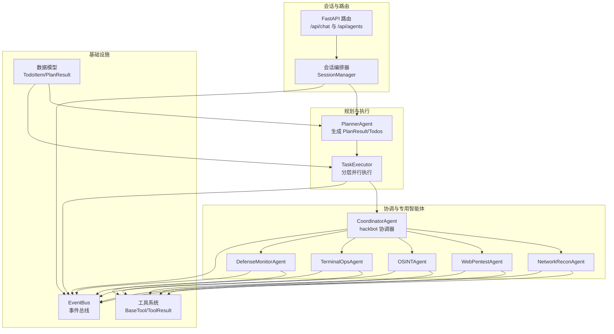
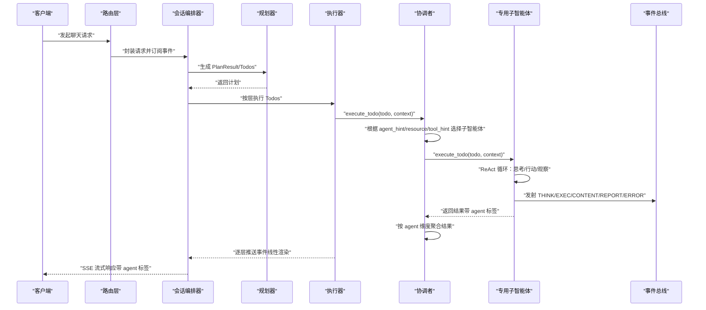
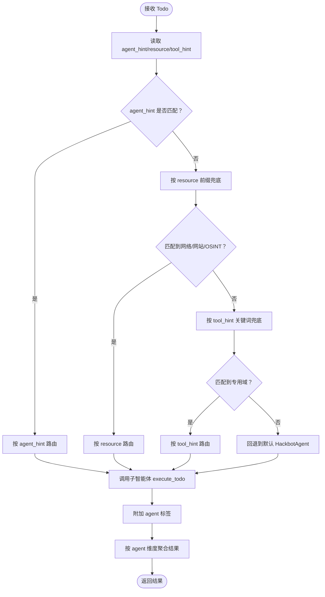
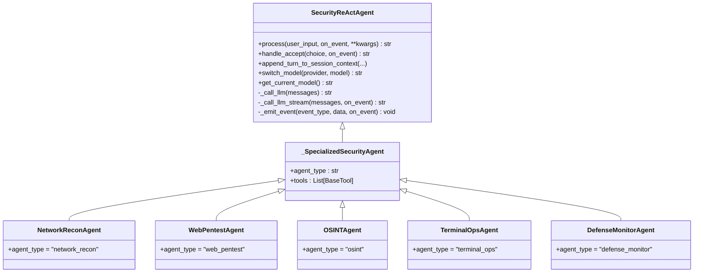
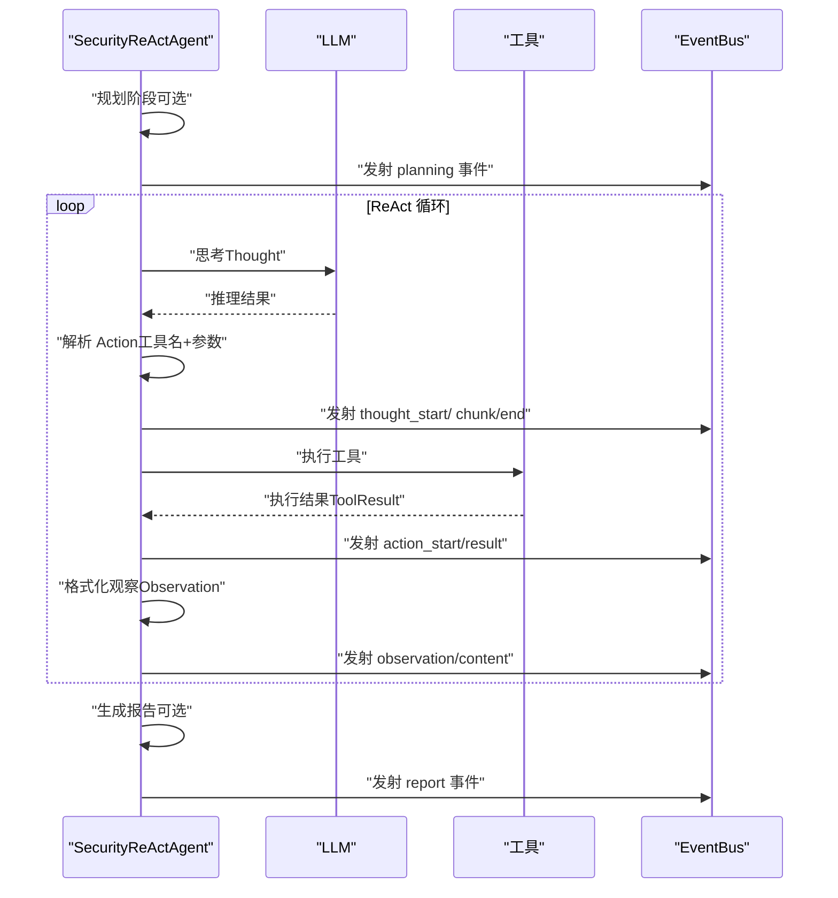
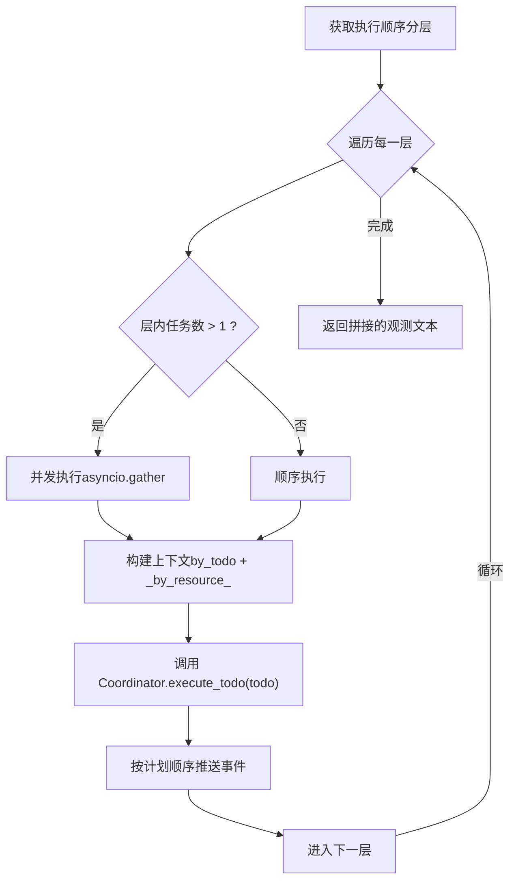
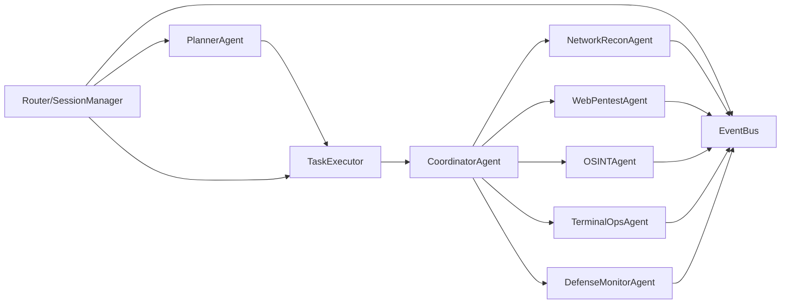

# 多智能体协作系统

<cite>
**本文引用的文件**
- [core/agents/coordinator_agent.py](file://core/agents/coordinator_agent.py)
- [core/agents/specialist_agents.py](file://core/agents/specialist_agents.py)
- [core/patterns/security_react.py](file://core/patterns/security_react.py)
- [core/patterns/react.py](file://core/patterns/react.py)
- [core/agents/base.py](file://core/agents/base.py)
- [core/models.py](file://core/models.py)
- [core/executor.py](file://core/executor.py)
- [tools/base.py](file://tools/base.py)
- [utils/event_bus.py](file://utils/event_bus.py)
- [router/agents.py](file://router/agents.py)
- [README_EN.md](file://README_EN.md)
</cite>

## 目录
1. [简介](#简介)
2. [项目结构](#项目结构)
3. [核心组件](#核心组件)
4. [架构总览](#架构总览)
5. [详细组件分析](#详细组件分析)
6. [依赖分析](#依赖分析)
7. [性能考虑](#性能考虑)
8. [故障排查指南](#故障排查指南)
9. [结论](#结论)
10. [附录](#附录)

## 简介
本文件系统化阐述 Secbot 的多智能体协作体系，重点围绕协调者智能体（CoordinatorAgent）如何在分层执行模式下，将单步任务路由至五类专用智能体（网络侦察、Web 渗透、OSINT、终端操作、防御监控），并基于 ReAct 思考-行动-观察循环实现闭环执行。文档还涵盖任务分配策略、结果聚合方式、事件总线通信机制、以及复杂渗透测试任务的分解与执行最佳实践。

## 项目结构
Secbot 的多智能体协作采用“协调者 + 专用子智能体”的 A2A（Agent-to-Agent）架构入口，结合 Planner 的结构化计划与 TaskExecutor 的分层并行执行器，形成“规划-路由-执行-汇总”的流水线。

图表来源
- [router/agents.py](file://router/agents.py#L1-L57)
- [README_EN.md](file://README_EN.md#L154-L195)
- [core/executor.py](file://core/executor.py#L1-L179)
- [core/agents/coordinator_agent.py](file://core/agents/coordinator_agent.py#L1-L335)
- [core/agents/specialist_agents.py](file://core/agents/specialist_agents.py#L1-L247)
- [utils/event_bus.py](file://utils/event_bus.py#L1-L51)

章节来源
- [README_EN.md](file://README_EN.md#L154-L195)
- [router/agents.py](file://router/agents.py#L1-L57)

## 核心组件
- 协调者智能体（CoordinatorAgent）
  - 作为对外“hackbot”入口，负责在分层执行模式下将 Todo 路由到专用子智能体，并聚合各子智能体的工具执行结果供汇总。
  - 在普通对话/同步模式下，直接委托给内部的 HackbotAgent，保持向后兼容。
- 专用子智能体（NetworkReconAgent、WebPentestAgent、OSINTAgent、TerminalOpsAgent、DefenseMonitorAgent）
  - 统一继承 SecurityReActAgent，具备 ReAct 能力，各自挂载领域专属工具集，通过 agent_type 标记事件来源。
- ReAct 引擎（SecurityReActAgent）
  - 支持自动执行（hackbot）与用户确认（superhackbot）两种模式；提供事件发射、工具解析与执行、会话摘要、最大迭代限制等能力。
- 任务执行器（TaskExecutor）
  - 根据 Planner 的执行顺序分层并行执行 Todos，构建 per-todo 与 resource 维度的上下文，向 EventBus 推送线性事件流。
- 数据模型（TodoItem、PlanResult、Session）
  - 定义任务项、计划结果与会话消息结构，承载依赖关系、资源标记、风险等级与代理提示等关键字段。
- 工具系统（BaseTool、ToolResult）
  - 统一工具接口与结果封装，支持参数模式、敏感度标记与异步执行。
- 事件总线（EventBus）
  - 以枚举化的事件类型解耦核心逻辑与 UI，支持同步/异步订阅与发射，承载规划、思考、执行、报告、错误等事件。

章节来源
- [core/agents/coordinator_agent.py](file://core/agents/coordinator_agent.py#L40-L213)
- [core/agents/specialist_agents.py](file://core/agents/specialist_agents.py#L32-L247)
- [core/patterns/security_react.py](file://core/patterns/security_react.py#L142-L305)
- [core/executor.py](file://core/executor.py#L17-L179)
- [core/models.py](file://core/models.py#L24-L137)
- [tools/base.py](file://tools/base.py#L9-L36)
- [utils/event_bus.py](file://utils/event_bus.py#L15-L51)

## 架构总览
多智能体协作的总体流程如下：

图表来源
- [README_EN.md](file://README_EN.md#L154-L195)
- [core/executor.py](file://core/executor.py#L46-L133)
- [core/agents/coordinator_agent.py](file://core/agents/coordinator_agent.py#L130-L181)
- [core/patterns/security_react.py](file://core/patterns/security_react.py#L393-L628)
- [utils/event_bus.py](file://utils/event_bus.py#L15-L51)

章节来源
- [README_EN.md](file://README_EN.md#L154-L195)

## 详细组件分析

### 协调者智能体（CoordinatorAgent）
- 路由策略
  - 优先依据 Todo 的 agent_hint；其次依据 resource 前缀；最后依据 tool_hint 关键词匹配，兜底到对应子智能体。
  - 若均无法匹配，回退到默认 HackbotAgent，确保向后兼容。
- 结果聚合
  - 在每次 execute_todo 后，为结果打上 agent 标签，并按 agent 维度累积，供 SummaryAgent 做多智能体汇总。
- 会话摘要
  - 提供 append_turn_to_session_context，将本轮摘要式上下文写入所有子智能体，增强跨轮次的知识复用。
- 工具聚合
  - tools_dict 聚合默认与各子智能体工具，保障 Planner 的上下文注入。

图表来源
- [core/agents/coordinator_agent.py](file://core/agents/coordinator_agent.py#L242-L330)

章节来源
- [core/agents/coordinator_agent.py](file://core/agents/coordinator_agent.py#L118-L237)

### 专用子智能体（NetworkReconAgent / WebPentestAgent / OSINTAgent / TerminalOpsAgent / DefenseMonitorAgent）
- 统一基类
  - 继承 _SpecializedSecurityAgent，后者继承 SecurityReActAgent，保留完整的 ReAct 能力与事件发射。
- 领域提示词与工具集
  - 每个子智能体拥有针对自身领域的系统提示词与专属工具集合，最大化任务相关性与执行效率。
- agent_type 标记
  - 通过 agent_type 标识事件来源，便于前端按智能体维度渲染与过滤。

图表来源
- [core/patterns/security_react.py](file://core/patterns/security_react.py#L142-L305)
- [core/agents/specialist_agents.py](file://core/agents/specialist_agents.py#L32-L247)

章节来源
- [core/agents/specialist_agents.py](file://core/agents/specialist_agents.py#L32-L247)

### ReAct 模式与事件流
- 思考-行动-观察循环
  - SecurityReActAgent 的 process 流程包含规划、多轮 ReAct 循环（思考/行动/观察），并在必要时生成总结报告。
  - 对于需要用户确认的高敏感操作，采用 propose + handle_accept 的交互模式。
- 事件发射
  - 在每个阶段（规划、思考、行动、观察、报告、错误）发射标准化事件，携带 agent 标签与迭代信息，前端据此渲染。
- 会话摘要
  - 每轮结束时，将用户输入、计划摘要与总结摘要写入子智能体的会话上下文，提升跨轮次一致性。

图表来源
- [core/patterns/security_react.py](file://core/patterns/security_react.py#L393-L628)
- [utils/event_bus.py](file://utils/event_bus.py#L15-L51)

章节来源
- [core/patterns/security_react.py](file://core/patterns/security_react.py#L142-L305)

### 任务执行器（TaskExecutor）与任务分配
- 分层并行
  - 基于 Planner 的执行顺序，将 Todos 按拓扑层划分：层内可并行，层间严格遵循依赖关系。
- 上下文构建
  - 为每个 Todo 构建两类上下文：
    - by_todo：以 todo_id 为键的结果映射（向后兼容）
    - _by_resource_：按资源维度的结果列表，便于后续步骤在同一资产上复用先前发现
- 事件推送
  - 并行完成后，按计划顺序向 EventBus 推送 action_start/action_result 事件，保证前端线性渲染体验。

图表来源
- [core/executor.py](file://core/executor.py#L46-L133)
- [core/executor.py](file://core/executor.py#L135-L179)

章节来源
- [core/executor.py](file://core/executor.py#L17-L179)

### 任务模型与规划
- TodoItem
  - 包含 id、content、status、depends_on、tool_hint、resource、risk_level、agent_hint、result_summary 等字段，支撑 Planner 的依赖与资源感知。
- PlanResult
  - 包含 request_type、todos、direct_response、plan_summary，作为执行器的输入。
- 会话模型
  - Session/SessionMessage 提供会话消息结构，支持元数据与时间戳。

章节来源
- [core/models.py](file://core/models.py#L24-L137)

### 工具系统与结果封装
- BaseTool/ToolResult
  - 统一工具接口与结果封装，支持参数模式、敏感度标记与异步执行，为 ReAct 的工具解析与执行提供基础。

章节来源
- [tools/base.py](file://tools/base.py#L9-L36)

## 依赖分析
- 组件耦合与内聚
  - CoordinatorAgent 与各子智能体之间为松耦合的“路由-执行”关系；子智能体共享 SecurityReActAgent 的 ReAct 能力，内聚于各自领域。
  - TaskExecutor 与 CoordinatorAgent 通过 execute_todo 接口交互，职责清晰：前者负责分层并行与上下文构建，后者负责路由与聚合。
- 外部依赖与集成点
  - EventBus 作为核心解耦点，贯穿规划、思考、执行、报告与错误事件；前端通过 SSE 订阅事件，实现线性渲染与 agent 标签展示。
  - Router 与会话编排器负责请求接入与事件桥接，确保 agent 事件可被前端消费。
- 潜在循环依赖
  - 代码层面未见直接循环导入；协调器聚合结果供汇总使用，但汇总在上层会话编排器中触发，避免循环调用。

图表来源
- [core/agents/coordinator_agent.py](file://core/agents/coordinator_agent.py#L202-L213)
- [core/executor.py](file://core/executor.py#L17-L38)
- [utils/event_bus.py](file://utils/event_bus.py#L15-L51)
- [router/agents.py](file://router/agents.py#L1-L57)

章节来源
- [core/agents/coordinator_agent.py](file://core/agents/coordinator_agent.py#L202-L213)
- [core/executor.py](file://core/executor.py#L17-L38)
- [utils/event_bus.py](file://utils/event_bus.py#L15-L51)
- [router/agents.py](file://router/agents.py#L1-L57)

## 性能考虑
- 并发与串行控制
  - TaskExecutor 在层内并发执行，层间严格串行，兼顾吞吐与安全性；CoordinatorAgent 通过全局并发锁维持与历史行为一致的串行语义。
- ReAct 迭代限制
  - SecurityReActAgent 的 max_iterations 限制防止无限循环，结合工具执行超时与最大迭代，提升稳定性。
- 事件流与 UI 渲染
  - 通过 EventBus 的线性推送与前端 SSE 订阅，避免阻塞主流程，提升用户体验。

## 故障排查指南
- LLM 调用失败
  - SecurityReActAgent 在 _call_llm/_call_llm_stream 中捕获异常并返回连接提示，可通过日志定位提供商配置问题。
- 工具不存在或参数错误
  - ReAct 循环中若工具名不在 tools_dict，将返回可用工具列表；建议检查工具注册与命名一致性。
- 高敏感操作未确认
  - SuperHackbot 模式下，高敏感工具需用户确认；若出现等待确认状态，检查 /accept 或 /reject 输入。
- 事件未到达前端
  - 确认 EventBus 订阅与 SSE 路由正确，检查事件类型映射与 agent 字段是否缺失。

章节来源
- [core/patterns/security_react.py](file://core/patterns/security_react.py#L319-L390)
- [core/patterns/security_react.py](file://core/patterns/security_react.py#L480-L508)
- [core/patterns/security_react.py](file://core/patterns/security_react.py#L630-L778)
- [utils/event_bus.py](file://utils/event_bus.py#L15-L51)

## 结论
Secbot 的多智能体协作系统以 CoordinatorAgent 为枢纽，结合 Planner 的结构化计划与 TaskExecutor 的分层并行执行，实现了“领域专用 + ReAct 循环 + 事件驱动”的高效协同。通过 agent_hint/resource/tool_hint 的多级路由策略与按 agent 维度的结果聚合，系统能够稳健地分解并执行复杂的渗透测试任务，同时保持与前端的强解耦与良好的可观测性。

## 附录

### ReAct 模式在智能体中的应用
- 旧版骨架实现（ReActAgent）
  - 提供基础的思考-行动-观察循环框架，适合教学与演示。
- 新版 LLM 驱动引擎（SecurityReActAgent）
  - 支持自动执行与用户确认两种模式；内置工具解析、事件发射、会话摘要与最大迭代限制，适配真实渗透测试场景。

章节来源
- [core/patterns/react.py](file://core/patterns/react.py#L11-L85)
- [core/patterns/security_react.py](file://core/patterns/security_react.py#L142-L305)

### 智能体协作示例与最佳实践
- 示例：复杂渗透测试任务分解
  - 网络侦察：端口扫描、服务识别、子网发现 → 生成网络攻击面清单
  - Web 渗透：目录枚举、指纹识别、WAF 检测 → 识别 Web 风险点
  - OSINT：Shodan/VirusTotal 查询 → 获取外部情报与历史泄露
  - 终端操作：授权主机命令执行 → 收集系统日志与配置
  - 防御监控：自检扫描、入侵检测、网络分析 → 评估防御薄弱点
- 最佳实践
  - 明确 agent_hint/resource/tool_hint，减少路由歧义
  - 利用 _by_resource_ 上下文，避免重复扫描与冲突操作
  - 合理设置 risk_level，确保高风险步骤在同一资源上串行
  - 使用会话摘要与事件流，提升跨轮次一致性与可观测性

章节来源
- [README_EN.md](file://README_EN.md#L154-L195)
- [core/executor.py](file://core/executor.py#L152-L167)
- [core/agents/coordinator_agent.py](file://core/agents/coordinator_agent.py#L242-L330)