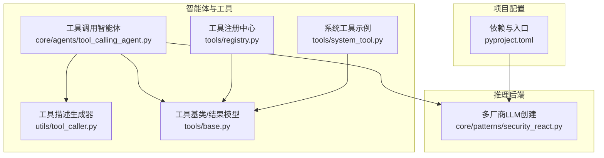
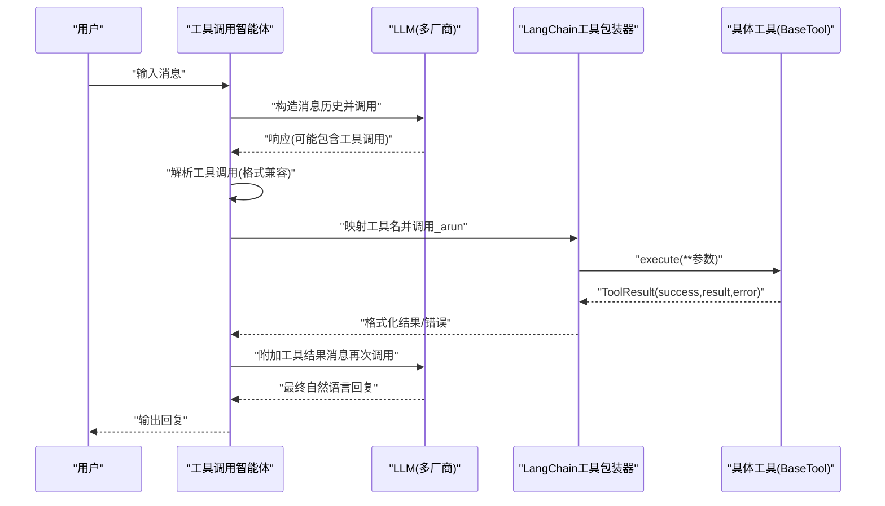
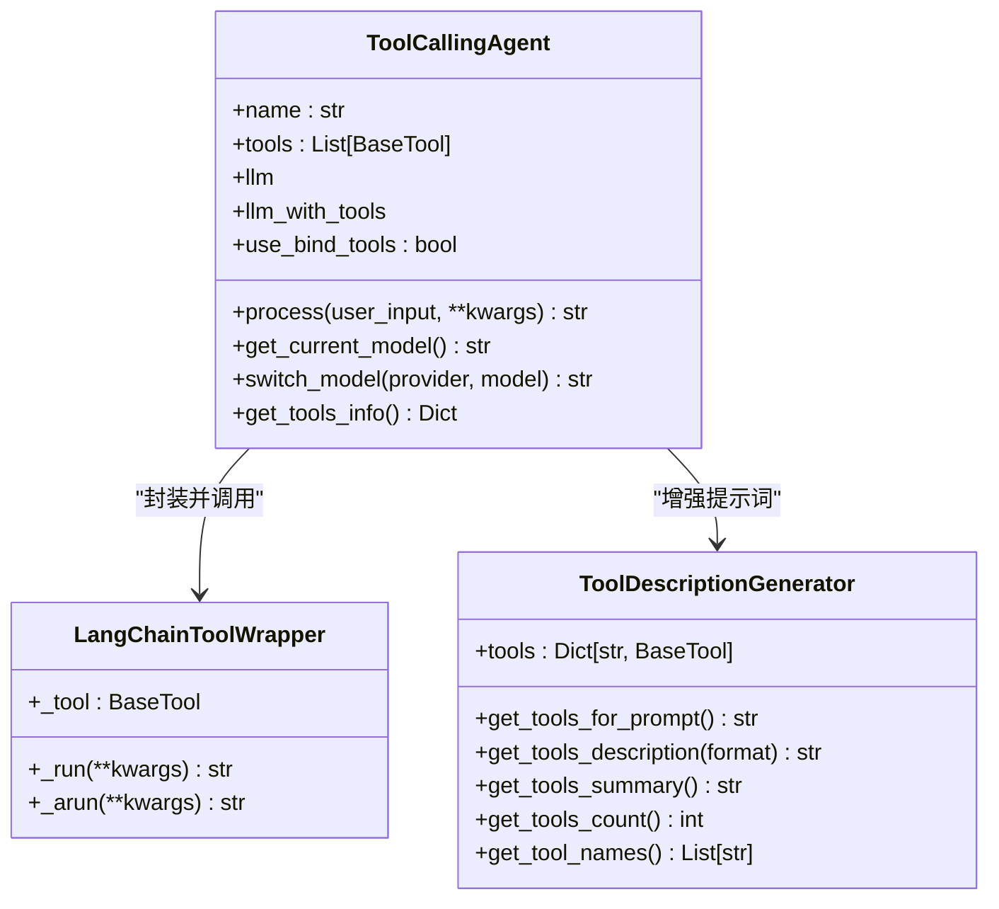
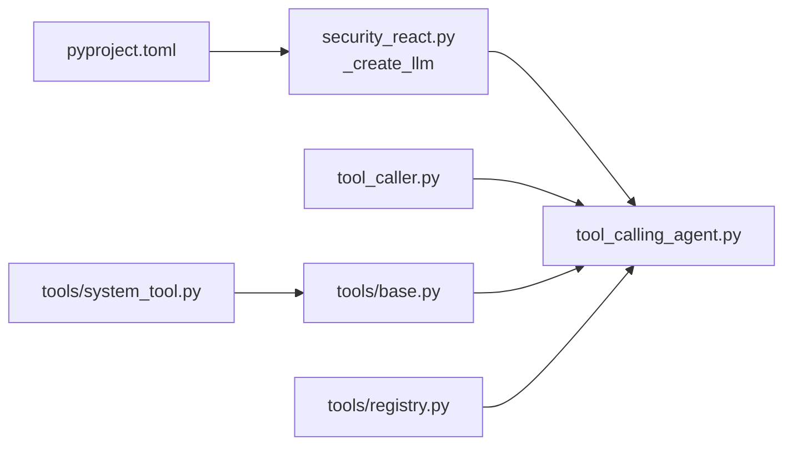
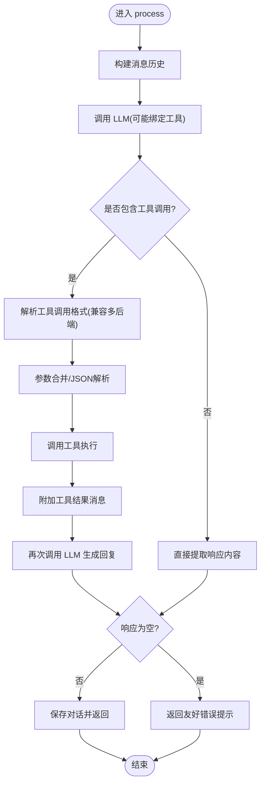

# 工具调用智能体

<cite>
**本文引用的文件**
- [core/agents/tool_calling_agent.py](file://core/agents/tool_calling_agent.py)
- [utils/tool_caller.py](file://utils/tool_caller.py)
- [tools/base.py](file://tools/base.py)
- [tools/registry.py](file://tools/registry.py)
- [tools/system_tool.py](file://tools/system_tool.py)
- [core/patterns/security_react.py](file://core/patterns/security_react.py)
- [pyproject.toml](file://pyproject.toml)
</cite>

## 目录
1. [简介](#简介)
2. [项目结构](#项目结构)
3. [核心组件](#核心组件)
4. [架构总览](#架构总览)
5. [组件详解](#组件详解)
6. [依赖关系分析](#依赖关系分析)
7. [性能考量](#性能考量)
8. [故障排查指南](#故障排查指南)
9. [结论](#结论)
10. [附录](#附录)

## 简介
本文件围绕 Secbot 的“工具调用智能体”展开，系统阐述其如何将大模型的决策转化为实际的安全工具调用，包括参数验证与处理、结果解析与格式化、与工具注册系统的集成方式，以及异常处理策略。文档还提供了具体调用示例与最佳实践，帮助开发者与使用者高效、安全地扩展与使用工具链。

## 项目结构
工具调用智能体位于后端核心目录，围绕 LangChain 与自研工具体系构建，具备以下关键位置：
- 智能体主体：core/agents/tool_calling_agent.py
- 工具描述生成器：utils/tool_caller.py
- 工具基类与结果模型：tools/base.py
- 工具注册与发现：tools/registry.py
- 示例工具：tools/system_tool.py
- LLM 创建与多厂商适配：core/patterns/security_react.py
- 项目依赖与入口：pyproject.toml

图表来源
- [core/agents/tool_calling_agent.py](file://core/agents/tool_calling_agent.py#L75-L141)
- [utils/tool_caller.py](file://utils/tool_caller.py#L10-L22)
- [tools/base.py](file://tools/base.py#L9-L36)
- [tools/registry.py](file://tools/registry.py#L106-L134)
- [tools/system_tool.py](file://tools/system_tool.py#L9-L75)
- [core/patterns/security_react.py](file://core/patterns/security_react.py#L49-L140)
- [pyproject.toml](file://pyproject.toml#L29-L69)

章节来源
- [core/agents/tool_calling_agent.py](file://core/agents/tool_calling_agent.py#L1-L506)
- [utils/tool_caller.py](file://utils/tool_caller.py#L1-L119)
- [tools/base.py](file://tools/base.py#L1-L36)
- [tools/registry.py](file://tools/registry.py#L1-L142)
- [tools/system_tool.py](file://tools/system_tool.py#L1-L75)
- [core/patterns/security_react.py](file://core/patterns/security_react.py#L1-L800)
- [pyproject.toml](file://pyproject.toml#L1-L165)

## 核心组件
- 工具调用智能体（ToolCallingAgent）
  - 基于 LangChain 的工具绑定与调用，支持多厂商推理后端
  - 动态增强系统提示词，注入工具描述
  - 支持 bind_tools 与提示词解析两种工具调用路径，并自动回退
  - 统一结果提取与异常处理
- 工具描述生成器（ToolDescriptionGenerator）
  - 生成面向 LLM 的工具描述，支持文本与 Markdown
  - 输出参数清单与必填/默认值提示
- 工具基类与结果模型（BaseTool、ToolResult）
  - 统一的异步执行接口与结构化结果
  - schema 提供参数约束
- 工具注册中心（Registry）
  - 支持 entry point 与环境变量自动发现工具模块
  - 支持基础工具与高级工具分类加载
- 示例工具（SystemTool）
  - 展示如何实现 BaseTool.execute 并返回 ToolResult
  - 支持参数展开与 schema 定义

章节来源
- [core/agents/tool_calling_agent.py](file://core/agents/tool_calling_agent.py#L75-L141)
- [utils/tool_caller.py](file://utils/tool_caller.py#L10-L119)
- [tools/base.py](file://tools/base.py#L9-L36)
- [tools/registry.py](file://tools/registry.py#L106-L142)
- [tools/system_tool.py](file://tools/system_tool.py#L9-L75)

## 架构总览
工具调用智能体通过 LangChain 与 LLM 对话，结合工具描述生成器提供的工具清单，引导模型选择合适的工具并传递参数。当模型返回工具调用指令时，智能体将其转换为具体工具执行，并将结果作为工具消息回传给 LLM，最终由 LLM 生成自然语言回复。

图表来源
- [core/agents/tool_calling_agent.py](file://core/agents/tool_calling_agent.py#L271-L498)
- [utils/tool_caller.py](file://utils/tool_caller.py#L23-L109)
- [tools/base.py](file://tools/base.py#L16-L36)

## 组件详解

### 工具调用智能体（ToolCallingAgent）
- 初始化与工具绑定
  - 将 BaseTool 列表封装为 LangChain 工具，支持同步与异步执行
  - 通过 _create_llm 创建多厂商 LLM，并尝试 bind_tools 绑定工具
  - 若模型不支持工具调用，则自动回退为提示词驱动的工具调用解析
- 系统提示词增强
  - 使用 ToolDescriptionGenerator 生成工具描述文本并注入系统提示词
  - 支持统计工具数量、列出工具名称与摘要
- 工具调用解析与执行
  - 兼容多种工具调用格式（标准 name/args、Ollama args.name/args.arguments、function.name/function.arguments）
  - 对字符串参数进行 JSON 解析，对嵌套参数（args/kwargs）进行合并
  - 将工具执行结果以 ToolMessage 形式回传给 LLM
- 结果提取与异常处理
  - 统一从响应对象提取 content 或 metadata 中的 thinking/text/output/message
  - 对空响应给出友好提示并提供诊断方向
  - 捕获工具执行异常并记录日志
- 模型切换与回退
  - 支持运行时切换推理后端与模型，并重建 LLM 与绑定
  - 遇到工具不支持错误时自动回退为纯对话模式

图表来源
- [core/agents/tool_calling_agent.py](file://core/agents/tool_calling_agent.py#L75-L141)
- [utils/tool_caller.py](file://utils/tool_caller.py#L10-L119)

章节来源
- [core/agents/tool_calling_agent.py](file://core/agents/tool_calling_agent.py#L75-L141)
- [core/agents/tool_calling_agent.py](file://core/agents/tool_calling_agent.py#L271-L498)

### 工具描述生成器（ToolDescriptionGenerator）
- 功能
  - 生成面向 LLM 的工具描述文本，支持纯文本与 Markdown
  - 输出工具名称、描述、参数清单（含类型、是否必填、默认值）
  - 提供工具摘要与用于系统提示词的优化格式
- 使用场景
  - 在智能体初始化时注入系统提示词，提升模型对工具的认知与调用准确性

章节来源
- [utils/tool_caller.py](file://utils/tool_caller.py#L10-L119)

### 工具基类与结果模型（BaseTool、ToolResult）
- BaseTool
  - 抽象方法 execute(**kwargs) -> ToolResult
  - get_schema() 返回工具名称、描述与参数约束
- ToolResult
  - success: 是否成功
  - result: 成功时的结果对象
  - error: 失败时的错误信息

章节来源
- [tools/base.py](file://tools/base.py#L9-L36)

### 工具注册中心（Registry）
- 功能
  - 从 entry point 与环境变量自动发现工具模块
  - 支持 TOOLS/*_TOOLS 列表、get_tools()、BaseTool 子类三种加载方式
  - 分类加载基础工具与高级工具
- 集成点
  - 工具调用智能体通过注册中心获取工具列表，动态构建 LangChain 工具字典

章节来源
- [tools/registry.py](file://tools/registry.py#L106-L142)

### 示例工具（SystemTool）
- 功能
  - 展示如何实现 BaseTool.execute 并返回 ToolResult
  - 支持参数展开（如 kwargs 键展开），并定义 schema
- 适用性
  - 作为自定义工具开发的参考模板

章节来源
- [tools/system_tool.py](file://tools/system_tool.py#L9-L75)

### LLM 创建与多厂商适配
- 功能
  - 支持 ollama、deepseek/openai、anthropic、google 等多厂商
  - 自动解析 API Key 与 Base URL，按模型特性设置温度等参数
- 集成点
  - 工具调用智能体通过 _create_llm 创建 LLM 实例，并在初始化时绑定工具

章节来源
- [core/patterns/security_react.py](file://core/patterns/security_react.py#L49-L140)

## 依赖关系分析
- 工具调用智能体依赖
  - LangChain（消息类型、工具绑定）
  - 工具描述生成器（提示词增强）
  - 工具基类（统一执行接口）
  - LLM 创建模块（多厂商适配）
- 工具注册中心提供工具发现能力，贯穿工具生命周期
- 项目依赖通过 pyproject.toml 管理，确保 LangChain 生态与可选厂商依赖的正确引入

图表来源
- [pyproject.toml](file://pyproject.toml#L29-L69)
- [core/patterns/security_react.py](file://core/patterns/security_react.py#L49-L140)
- [core/agents/tool_calling_agent.py](file://core/agents/tool_calling_agent.py#L75-L141)
- [utils/tool_caller.py](file://utils/tool_caller.py#L10-L22)
- [tools/base.py](file://tools/base.py#L9-L36)
- [tools/registry.py](file://tools/registry.py#L106-L134)
- [tools/system_tool.py](file://tools/system_tool.py#L9-L75)

章节来源
- [pyproject.toml](file://pyproject.toml#L29-L69)
- [core/patterns/security_react.py](file://core/patterns/security_react.py#L49-L140)
- [core/agents/tool_calling_agent.py](file://core/agents/tool_calling_agent.py#L75-L141)
- [utils/tool_caller.py](file://utils/tool_caller.py#L10-L22)
- [tools/base.py](file://tools/base.py#L9-L36)
- [tools/registry.py](file://tools/registry.py#L106-L134)
- [tools/system_tool.py](file://tools/system_tool.py#L9-L75)

## 性能考量
- 工具绑定与回退
  - 优先使用 bind_tools，若模型不支持则回退为提示词解析，避免阻塞
- 事件循环与并发
  - 工具包装器在同步/异步环境下均能执行，避免阻塞主线程
- 结果提取与日志
  - 统一的内容提取策略减少重复解析成本
  - 详细的调试日志便于定位性能瓶颈
- LLM 调用超时与提示词长度
  - 建议控制提示词长度与上下文，避免截断与超时

## 故障排查指南
- 工具调用失败
  - 检查工具名是否存在于 tools_dict
  - 查看工具执行返回的 error 字段，必要时开启更详细的日志
- 模型不支持工具调用
  - 观察回退日志，确认是否设置了 LLM_TOOLS_SUPPORTED=false
  - 切换支持工具调用的模型或后端
- 空响应
  - 检查 LLM 提供商与网络连通性
  - 根据提示调整提示词长度或模型参数
- 参数解析异常
  - 确认参数为 JSON 字符串或字典结构
  - 注意嵌套参数（args/kwargs）的合并规则

章节来源
- [core/agents/tool_calling_agent.py](file://core/agents/tool_calling_agent.py#L295-L358)
- [core/agents/tool_calling_agent.py](file://core/agents/tool_calling_agent.py#L425-L434)
- [core/agents/tool_calling_agent.py](file://core/agents/tool_calling_agent.py#L470-L498)

## 结论
工具调用智能体通过 LangChain 与多厂商 LLM 的深度集成，实现了从模型决策到工具执行的闭环。借助工具描述生成器与注册中心，系统具备良好的可扩展性与可维护性。通过统一的参数解析、结果格式化与异常处理机制，智能体能够在复杂场景下稳定地完成任务编排与自动化执行。

## 附录

### 工具调用流程图（算法实现）

图表来源
- [core/agents/tool_calling_agent.py](file://core/agents/tool_calling_agent.py#L271-L498)

### 工具扩展与注册示例
- 通过 entry point 或环境变量注册工具模块
- 工具模块支持 TOOLS/*_TOOLS 列表、get_tools()、BaseTool 子类三种方式
- 注册后自动注入到智能体的工具字典中

章节来源
- [tools/registry.py](file://tools/registry.py#L106-L142)