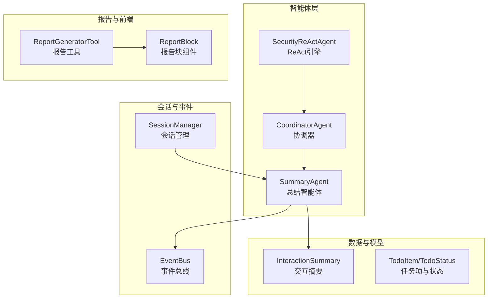
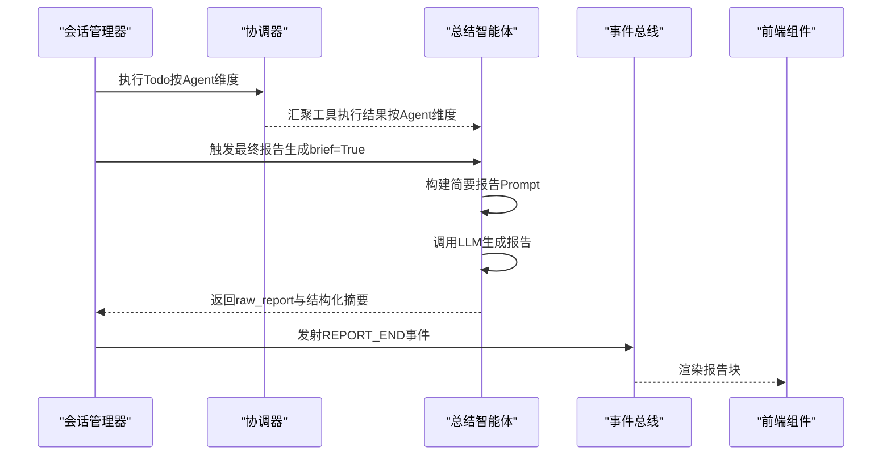
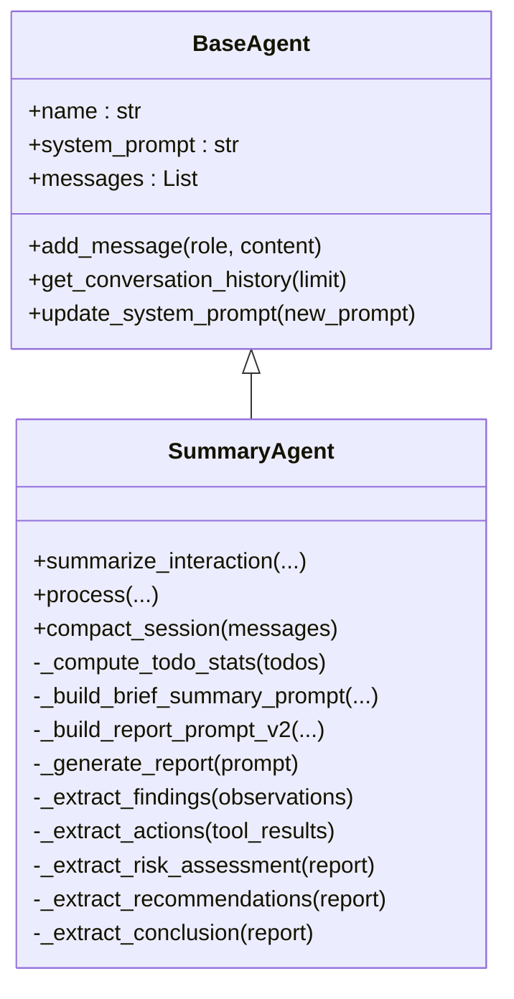
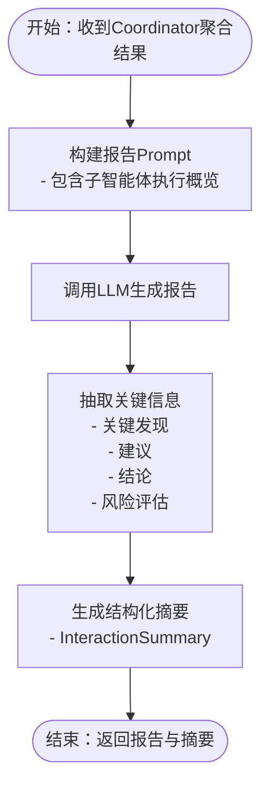
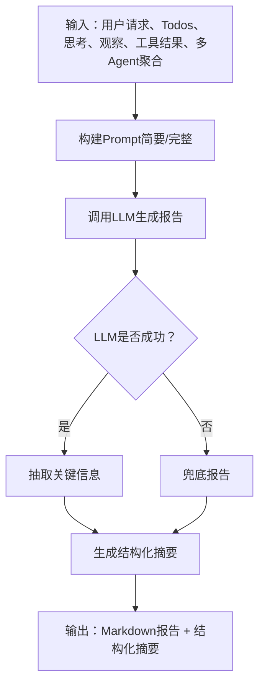
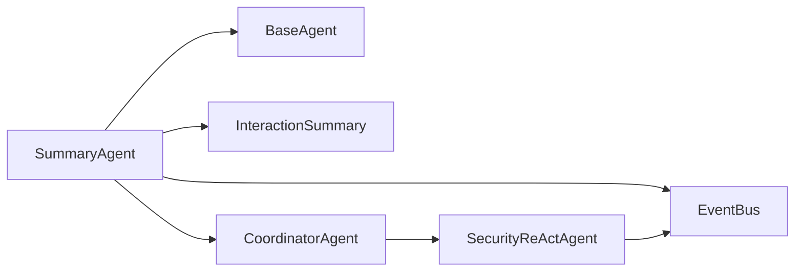

# 总结智能体

<cite>
**本文引用的文件**
- [summary_agent.py](file://core/agents/summary_agent.py)
- [base.py](file://core/agents/base.py)
- [models.py](file://core/models.py)
- [coordinator_agent.py](file://core/agents/coordinator_agent.py)
- [security_react.py](file://core/patterns/security_react.py)
- [session.py](file://core/session.py)
- [README_CN.md](file://README_CN.md)
- [README_EN.md](file://README_EN.md)
- [report_generator_tool.py](file://tools/reporting/report_generator_tool.py)
- [report_generator.py](file://defense/report_generator.py)
- [ReportBlock.tsx](file://terminal-ui/src/components/blocks/ReportBlock.tsx)
</cite>

## 目录
1. [简介](#简介)
2. [项目结构](#项目结构)
3. [核心组件](#核心组件)
4. [架构总览](#架构总览)
5. [详细组件分析](#详细组件分析)
6. [依赖关系分析](#依赖关系分析)
7. [性能考量](#性能考量)
8. [故障排查指南](#故障排查指南)
9. [结论](#结论)
10. [附录](#附录)

## 简介
本文件面向Secbot的“总结智能体”，系统阐述其如何整合多智能体的分析结果，生成结构化的最终报告。重点覆盖：
- 多智能体结果汇总机制（按Agent维度聚合）
- 报告生成与格式化流程（Markdown结构化输出）
- 对不同类型信息的处理（技术细节、风险评估、建议措施等）
- 报告生成示例与优化策略

## 项目结构
围绕总结智能体的关键文件与角色如下：
- 总结智能体：负责接收规划、思考、观察、工具执行结果以及多Agent聚合结果，生成结构化报告
- 基础智能体：提供统一的消息模型与系统提示词管理
- 会话与模型：提供交互摘要的数据结构与会话压缩能力
- 协调器：负责将Todo路由至专用子Agent，并按Agent维度聚合工具执行结果
- ReAct引擎：为各子Agent提供思考-行动-观察循环，最终由总结智能体汇总
- 报告工具与前端组件：支撑报告的生成与渲染

图表来源
- [summary_agent.py](file://core/agents/summary_agent.py#L53-L182)
- [coordinator_agent.py](file://core/agents/coordinator_agent.py#L40-L181)
- [security_react.py](file://core/patterns/security_react.py#L142-L628)
- [models.py](file://core/models.py#L85-L101)
- [README_CN.md](file://README_CN.md#L267-L268)

章节来源
- [summary_agent.py](file://core/agents/summary_agent.py#L1-L628)
- [coordinator_agent.py](file://core/agents/coordinator_agent.py#L1-L335)
- [security_react.py](file://core/patterns/security_react.py#L1-L800)
- [models.py](file://core/models.py#L1-L137)
- [README_CN.md](file://README_CN.md#L267-L268)

## 核心组件
- SummaryAgent：负责接收规划结果、ReAct历史、工具执行结果以及多Agent聚合结果，生成结构化报告与交互摘要
- CoordinatorAgent：将Todo路由至专用子Agent，并按Agent维度聚合工具执行结果，供SummaryAgent汇总
- SecurityReActAgent：为各子Agent提供ReAct循环，最终由SummaryAgent汇总
- InteractionSummary：结构化交互摘要，包含任务总结、Todo完成情况、关键发现、行动摘要、风险评估、建议、结论等
- 会话压缩：将对话历史压缩为简洁上下文，便于后续报告生成

章节来源
- [summary_agent.py](file://core/agents/summary_agent.py#L53-L182)
- [coordinator_agent.py](file://core/agents/coordinator_agent.py#L94-L181)
- [security_react.py](file://core/patterns/security_react.py#L142-L628)
- [models.py](file://core/models.py#L85-L101)

## 架构总览
总结智能体在多智能体协作中的位置与职责：
- 输入：规划结果（Todos）、ReAct思考与观察历史、工具执行结果、多Agent聚合结果
- 处理：构建报告Prompt、调用LLM生成报告、抽取关键信息（发现、建议、结论）、生成结构化摘要
- 输出：结构化报告（Markdown）、交互摘要对象、事件流（REPORT_END）

图表来源
- [session.py](file://core/session.py#L489-L519)
- [summary_agent.py](file://core/agents/summary_agent.py#L111-L182)
- [coordinator_agent.py](file://core/agents/coordinator_agent.py#L187-L196)
- [ReportBlock.tsx](file://terminal-ui/src/components/blocks/ReportBlock.tsx#L15-L27)

章节来源
- [session.py](file://core/session.py#L489-L519)
- [README_CN.md](file://README_CN.md#L267-L268)

## 详细组件分析

### SummaryAgent：多智能体结果汇总与报告生成
- 职责
  - 接收规划结果（Todos）、ReAct思考与观察历史、工具执行结果、多Agent聚合结果
  - 生成结构化报告（Markdown）与交互摘要
  - 提供简要总结与完整报告两种模式
  - 会话压缩：将最近对话压缩为简洁上下文
- 关键接口
  - summarize_interaction：生成交互摘要（支持brief模式）
  - process：向后兼容的旧接口（可生成纯文本报告）
  - compact_session：会话压缩
- 内部机制
  - 统计Todo完成情况
  - 构建简要/完整报告Prompt（含多Agent执行概览）
  - LLM生成报告后，抽取关键发现、建议、结论、风险评估
  - 生成结构化摘要对象（InteractionSummary）

图表来源
- [base.py](file://core/agents/base.py#L17-L125)
- [summary_agent.py](file://core/agents/summary_agent.py#L53-L612)

章节来源
- [summary_agent.py](file://core/agents/summary_agent.py#L53-L182)
- [summary_agent.py](file://core/agents/summary_agent.py#L266-L351)
- [summary_agent.py](file://core/agents/summary_agent.py#L353-L504)
- [summary_agent.py](file://core/agents/summary_agent.py#L510-L538)
- [summary_agent.py](file://core/agents/summary_agent.py#L540-L611)

### 多智能体结果汇总机制
- 协调器聚合
  - CoordinatorAgent在执行每个Todo后，将结果按Agent维度聚合到字典中
  - 提供get_agent_results_by_agent接口，供SummaryAgent读取
- 汇总到报告
  - SummaryAgent在构建报告Prompt时，将“子智能体执行概览”嵌入，体现各Agent的工具使用与成功率
  - 在简要总结中，直接展示各Agent的执行概览，便于快速了解多Agent协作情况

图表来源
- [coordinator_agent.py](file://core/agents/coordinator_agent.py#L187-L196)
- [summary_agent.py](file://core/agents/summary_agent.py#L317-L342)
- [summary_agent.py](file://core/agents/summary_agent.py#L422-L434)

章节来源
- [coordinator_agent.py](file://core/agents/coordinator_agent.py#L187-L196)
- [summary_agent.py](file://core/agents/summary_agent.py#L317-L342)
- [summary_agent.py](file://core/agents/summary_agent.py#L422-L434)

### 报告生成与格式化
- Prompt模板
  - 简要总结：突出“做了什么、完成情况、主要结论”，并包含失败工具与子Agent概览
  - 完整报告：包含任务总结、Todo完成情况、关键发现、风险评估、建议、综合结论等章节
- LLM生成与兜底
  - 通过统一的_LLM创建逻辑生成报告
  - LLM不可用时，提供兜底报告
- 结构化摘要
  - InteractionSummary包含任务摘要、Todo完成统计、关键发现、行动摘要、风险评估、建议、结论、原始报告

图表来源
- [summary_agent.py](file://core/agents/summary_agent.py#L111-L182)
- [summary_agent.py](file://core/agents/summary_agent.py#L510-L538)
- [models.py](file://core/models.py#L85-L101)

章节来源
- [summary_agent.py](file://core/agents/summary_agent.py#L280-L351)
- [summary_agent.py](file://core/agents/summary_agent.py#L353-L504)
- [summary_agent.py](file://core/agents/summary_agent.py#L510-L538)
- [models.py](file://core/models.py#L85-L101)

### 信息处理与类型化输出
- 技术细节
  - 从观察结果中提取关键发现（过滤错误/失败信息，截断过长文本）
  - 从工具执行结果中提取行动摘要（工具名+成功/失败）
- 风险评估
  - 仅在技术类交互中生成，通过启发式统计风险等级分布
- 建议措施
  - 从报告文本中抽取建议列表（基于标题与编号识别）
- 综合结论
  - 从报告中抽取结论片段，形成简洁总结

章节来源
- [summary_agent.py](file://core/agents/summary_agent.py#L540-L611)

### 会话压缩
- 作用：将最近对话压缩为简洁上下文，便于后续报告生成时提供背景
- 实现：取最近若干条消息，构造简短提示词，调用LLM生成压缩摘要

章节来源
- [summary_agent.py](file://core/agents/summary_agent.py#L222-L261)

### 报告生成示例与优化策略
- 示例
  - 渗透测试报告（Markdown）：包含概要统计、漏洞详情、修复建议汇总等章节
  - HTML报告：表格化展示等级与数量，支持富文本样式
- 优化策略
  - Prompt工程：明确报告结构与输出风格，确保一致性
  - 多Agent聚合：在Prompt中显式展示各Agent执行概览，提升报告可追溯性
  - 兜底机制：LLM失败时提供结构化兜底，保障报告可用性
  - 前端渲染：通过报告块组件统一渲染，提升用户体验

章节来源
- [report_generator_tool.py](file://tools/reporting/report_generator_tool.py#L229-L383)
- [ReportBlock.tsx](file://terminal-ui/src/components/blocks/ReportBlock.tsx#L15-L27)

## 依赖关系分析
- SummaryAgent依赖
  - 基础智能体：统一消息模型与系统提示词管理
  - 交互摘要模型：结构化输出
  - 协调器：多Agent聚合结果
  - 会话管理：最终报告生成与事件发射
- 协调器与子Agent
  - 将Todo路由至专用Agent，并聚合结果
  - 提供按Agent维度的结果查询接口
- ReAct引擎
  - 各子Agent基于ReAct循环产生思考与观察历史，供总结智能体汇总

图表来源
- [summary_agent.py](file://core/agents/summary_agent.py#L13-L15)
- [models.py](file://core/models.py#L85-L101)
- [coordinator_agent.py](file://core/agents/coordinator_agent.py#L40-L96)
- [security_react.py](file://core/patterns/security_react.py#L142-L176)

章节来源
- [summary_agent.py](file://core/agents/summary_agent.py#L13-L15)
- [coordinator_agent.py](file://core/agents/coordinator_agent.py#L40-L96)
- [security_react.py](file://core/patterns/security_react.py#L142-L176)

## 性能考量
- Prompt构建与LLM调用
  - 控制Prompt长度，避免超出上下文窗口
  - 在简要模式下减少重复信息，提高吞吐
- 多Agent聚合
  - 仅在必要时聚合结果，避免冗余
  - 对观察结果进行去噪与截断，降低LLM负担
- 事件与渲染
  - 通过事件总线异步发射报告，前端按块渲染，提升交互体验

## 故障排查指南
- LLM不可用
  - 检查模型提供商配置与连接状态
  - 使用兜底报告保障输出
- 报告结构异常
  - 核对Prompt模板是否完整
  - 确认抽取逻辑（发现/建议/结论）是否命中预期格式
- 多Agent结果缺失
  - 确认协调器是否正确聚合并提供查询接口
  - 检查事件流是否携带agent字段

章节来源
- [summary_agent.py](file://core/agents/summary_agent.py#L510-L538)
- [coordinator_agent.py](file://core/agents/coordinator_agent.py#L187-L196)
- [security_react.py](file://core/patterns/security_react.py#L227-L277)

## 结论
总结智能体通过统一的结构化报告生成流程，将多智能体的分析结果整合为可读性强、可追溯的最终报告。其关键优势在于：
- 明确的报告结构与Prompt模板
- 多Agent执行概览的可视化呈现
- 结构化摘要与事件驱动的输出
- 兜底机制与前端渲染的一致性

## 附录
- 相关文档
  - 多智能体架构范式与职责划分
  - 报告工具与前端组件的集成

章节来源
- [README_CN.md](file://README_CN.md#L267-L268)
- [README_EN.md](file://README_EN.md#L191-L192)
- [ReportBlock.tsx](file://terminal-ui/src/components/blocks/ReportBlock.tsx#L15-L27)