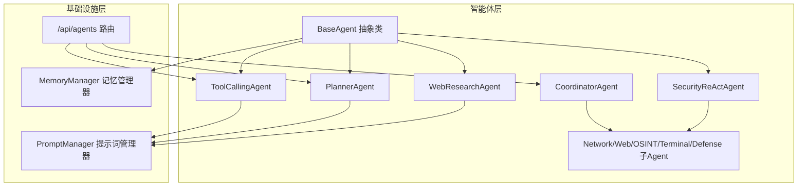
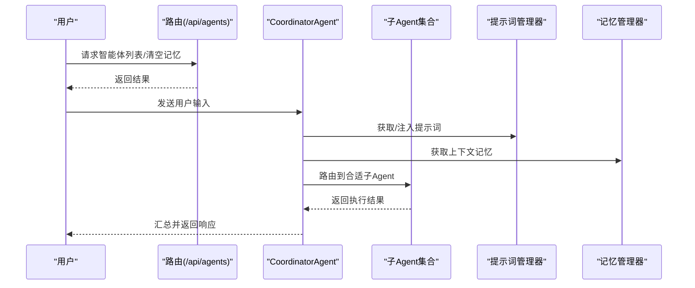
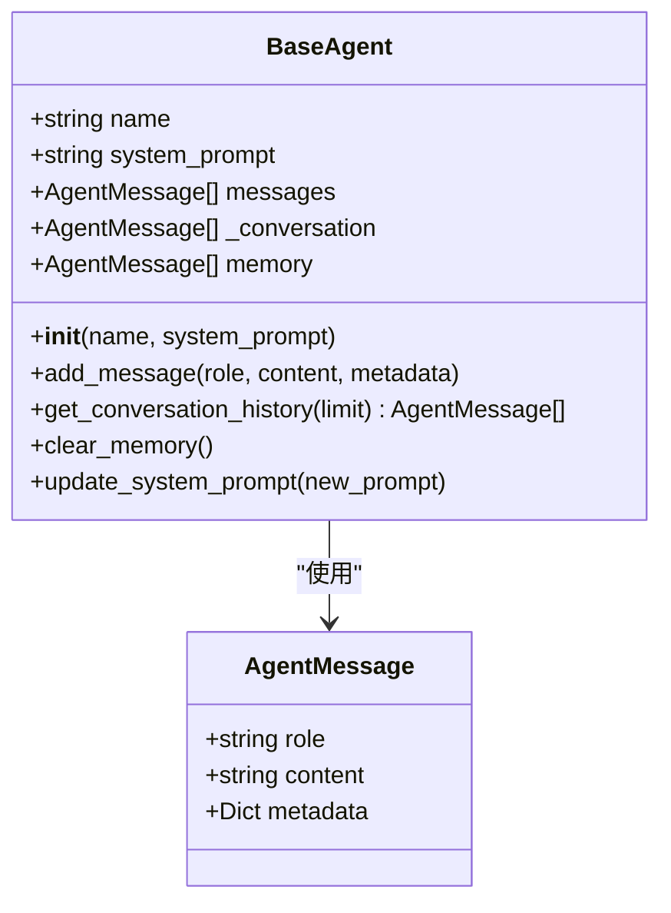
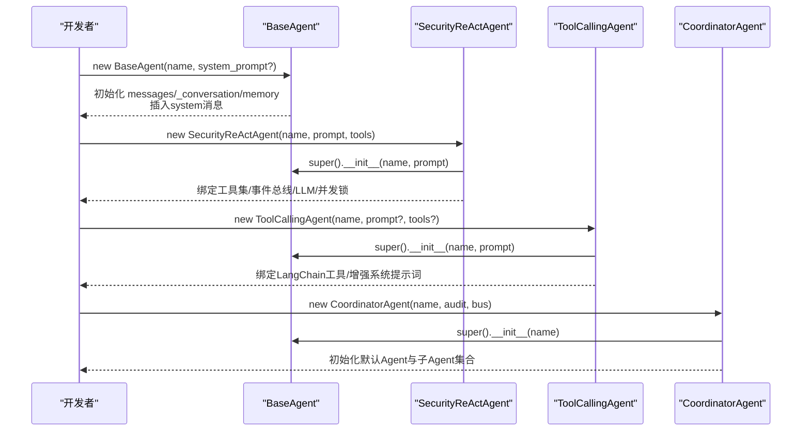
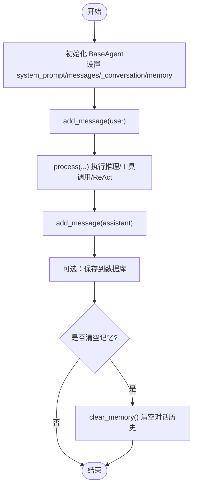
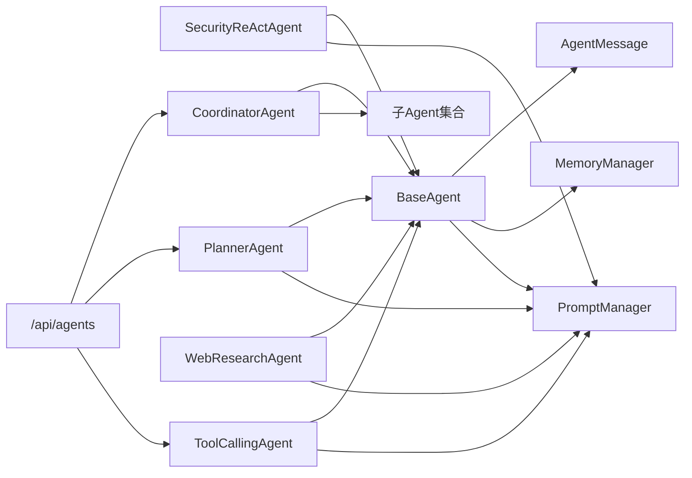

# 智能体基础架构

<cite>
**本文引用的文件**
- [core/agents/base.py](file://core/agents/base.py)
- [core/models.py](file://core/models.py)
- [core/memory/manager.py](file://core/memory/manager.py)
- [prompts/manager.py](file://prompts/manager.py)
- [router/agents.py](file://router/agents.py)
- [core/agents/coordinator_agent.py](file://core/agents/coordinator_agent.py)
- [core/agents/planner_agent.py](file://core/agents/planner_agent.py)
- [core/agents/specialist_agents.py](file://core/agents/specialist_agents.py)
- [core/agents/tool_calling_agent.py](file://core/agents/tool_calling_agent.py)
- [core/agents/web_research_agent.py](file://core/agents/web_research_agent.py)
- [core/patterns/security_react.py](file://core/patterns/security_react.py)
- [tests/test_agents.py](file://tests/test_agents.py)
</cite>

## 目录
1. [简介](#简介)
2. [项目结构](#项目结构)
3. [核心组件](#核心组件)
4. [架构总览](#架构总览)
5. [详细组件分析](#详细组件分析)
6. [依赖分析](#依赖分析)
7. [性能考虑](#性能考虑)
8. [故障排查指南](#故障排查指南)
9. [结论](#结论)
10. [附录](#附录)

## 简介
本文件系统性阐述 Secbot 智能体基础架构，重点围绕 BaseAgent 抽象类及其消息模型 AgentMessage 的设计理念与实现细节，深入解释智能体的初始化流程、系统提示词机制、消息历史管理与生命周期管理（消息添加、对话历史获取、记忆清空等）。同时，结合提示词管理器、记忆管理器、路由接口与典型智能体实现，提供完整的架构视图与扩展指南，帮助开发者基于 BaseAgent 快速创建自定义智能体。

## 项目结构
Secbot 的智能体体系位于 core/agents 目录，围绕 BaseAgent 抽象类构建，辅以提示词管理器、记忆管理器与路由接口，形成“提示词驱动 + 历史上下文 + 多智能体协作”的整体架构。

图表来源
- [core/agents/base.py](file://core/agents/base.py#L17-L125)
- [core/agents/tool_calling_agent.py](file://core/agents/tool_calling_agent.py#L75-L141)
- [core/patterns/security_react.py](file://core/patterns/security_react.py#L142-L190)
- [core/agents/planner_agent.py](file://core/agents/planner_agent.py#L20-L80)
- [core/agents/coordinator_agent.py](file://core/agents/coordinator_agent.py#L40-L97)
- [core/agents/specialist_agents.py](file://core/agents/specialist_agents.py#L32-L247)
- [core/agents/web_research_agent.py](file://core/agents/web_research_agent.py#L52-L83)
- [prompts/manager.py](file://prompts/manager.py#L15-L103)
- [core/memory/manager.py](file://core/memory/manager.py#L223-L325)
- [router/agents.py](file://router/agents.py#L15-L57)

章节来源
- [core/agents/base.py](file://core/agents/base.py#L17-L125)
- [prompts/manager.py](file://prompts/manager.py#L15-L103)
- [core/memory/manager.py](file://core/memory/manager.py#L223-L325)
- [router/agents.py](file://router/agents.py#L15-L57)

## 核心组件
- BaseAgent 抽象类：定义智能体的统一接口与通用行为，包括系统提示词、消息历史、对话记忆、生命周期管理等。
- AgentMessage 消息模型：标准化消息结构，包含角色、内容与元数据，支撑多智能体协作与事件流。
- 提示词管理器（PromptManager）：提供模板与链的加载、注册、保存与检索能力，支持从文件、数据库与内存中加载提示词。
- 记忆管理器（MemoryManager）：提供短期、情节与长期三层记忆存储与检索，支持上下文注入与蒸馏。
- 路由接口（/api/agents）：提供智能体列表与清空记忆的 REST 接口，便于外部系统调用。

章节来源
- [core/agents/base.py](file://core/agents/base.py#L10-L125)
- [prompts/manager.py](file://prompts/manager.py#L15-L201)
- [core/memory/manager.py](file://core/memory/manager.py#L223-L325)
- [router/agents.py](file://router/agents.py#L15-L57)

## 架构总览
Secbot 的智能体架构采用“提示词驱动 + ReAct 循环 + 多智能体协作”的设计。BaseAgent 作为抽象基类，向下派生出 ToolCallingAgent、SecurityReActAgent、PlannerAgent、WebResearchAgent 等具体智能体；CoordinatorAgent 负责在多子 Agent 间进行路由与结果聚合；MemoryManager 与 PromptManager 为智能体提供上下文与提示词支撑；Router 提供统一的外部接口。

图表来源
- [router/agents.py](file://router/agents.py#L15-L57)
- [core/agents/coordinator_agent.py](file://core/agents/coordinator_agent.py#L40-L97)
- [core/agents/specialist_agents.py](file://core/agents/specialist_agents.py#L32-L247)
- [prompts/manager.py](file://prompts/manager.py#L15-L103)
- [core/memory/manager.py](file://core/memory/manager.py#L223-L325)

## 详细组件分析

### BaseAgent 抽象类与 AgentMessage 消息模型
- 设计理念
  - 统一的消息模型与历史管理，确保不同智能体在对话、工具调用、ReAct 循环中的一致性。
  - 系统提示词可动态更新，支持针对不同命名的智能体自动选择默认提示词。
  - 对话历史与记忆分离：messages 为完整历史，_conversation 为对话级历史，memory 可替换为 MemoryManager。
- AgentMessage 结构
  - role：消息角色（user/assistant/system）
  - content：消息内容
  - metadata：可选元数据，用于携带工具调用、事件等上下文
- 生命周期方法
  - add_message：添加消息到历史与对话历史
  - get_conversation_history：按限制返回最近对话历史
  - clear_memory：清空对话历史；若 memory 为 MemoryManager，可通过外部接口清空持久记忆
  - update_system_prompt：更新系统提示词并同步到消息列表首条 system 消息

图表来源
- [core/agents/base.py](file://core/agents/base.py#L10-L125)

章节来源
- [core/agents/base.py](file://core/agents/base.py#L10-L125)

### 系统提示词机制
- 默认提示词策略
  - 若智能体名称包含特定关键字，采用专用安全提示词；否则使用通用提示词模板。
  - m-bot 命名的智能体使用专门的“开源版本自动化安全测试智能体”提示词。
- 动态更新
  - update_system_prompt 会同步更新消息列表中的首条 system 消息，保证后续推理使用最新提示词。

章节来源
- [core/agents/base.py](file://core/agents/base.py#L35-L122)

### 消息历史管理
- 历史结构
  - messages：完整历史（包含 system 消息）
  - _conversation：对话级历史（新增消息同步写入）
  - memory：默认为列表，可替换为 MemoryManager
- 获取与清空
  - get_conversation_history 支持 limit 限制返回最近 N 条
  - clear_memory 清空对话历史；持久记忆需由外部调用 MemoryManager.clear_all

章节来源
- [core/agents/base.py](file://core/agents/base.py#L91-L122)

### 智能体初始化流程
- BaseAgent.__init__
  - 设置 name、system_prompt（默认或自定义）
  - 初始化 messages、_conversation、memory
  - 若提供 system_prompt，则插入首条 system 消息
- SecurityReActAgent.__init__
  - 继承 BaseAgent，绑定工具集、事件总线、并发锁
  - 初始化 LLM、ReAct 历史、会话摘要上下文等
- ToolCallingAgent.__init__
  - 继承 BaseAgent，绑定 LangChain 工具包装器
  - 根据 settings 动态绑定工具或回退为纯对话模式
- CoordinatorAgent.__init__
  - 继承 BaseAgent，初始化默认 HackbotAgent 与多个专用子 Agent
  - 聚合工具集，维护按 Agent 维度的结果聚合

图表来源
- [core/agents/base.py](file://core/agents/base.py#L20-L34)
- [core/patterns/security_react.py](file://core/patterns/security_react.py#L152-L190)
- [core/agents/tool_calling_agent.py](file://core/agents/tool_calling_agent.py#L78-L141)
- [core/agents/coordinator_agent.py](file://core/agents/coordinator_agent.py#L50-L97)

章节来源
- [core/agents/base.py](file://core/agents/base.py#L20-L34)
- [core/patterns/security_react.py](file://core/patterns/security_react.py#L152-L190)
- [core/agents/tool_calling_agent.py](file://core/agents/tool_calling_agent.py#L78-L141)
- [core/agents/coordinator_agent.py](file://core/agents/coordinator_agent.py#L50-L97)

### 提示词管理器（PromptManager）
- 职责
  - 加载默认模板与链
  - 从文件/数据库加载/保存提示词链
  - 提供模板注册与检索
- 与智能体的集成
  - ToolCallingAgent 在初始化时可使用工具描述增强系统提示词
  - PlannerAgent、WebResearchAgent 等在推理时可引用 PromptManager 的链或模板

章节来源
- [prompts/manager.py](file://prompts/manager.py#L15-L201)

### 记忆管理器（MemoryManager）
- 三层记忆
  - 短期记忆（会话上下文缓冲区）
  - 情节记忆（跨会话事件与经验，持久化）
  - 长期记忆（知识库，持久化）
- 能力
  - remember/recall：添加与检索记忆
  - get_context_for_agent：生成适合注入智能体上下文的记忆块
  - distill_from_conversation：从对话蒸馏情节记忆
  - clear_all：清空所有记忆

章节来源
- [core/memory/manager.py](file://core/memory/manager.py#L223-L325)

### 路由接口（/api/agents）
- 列出智能体：返回可用智能体类型与描述
- 清空记忆：支持按智能体或全部清空对话记忆

章节来源
- [router/agents.py](file://router/agents.py#L15-L57)

### 典型智能体实现与扩展

#### ToolCallingAgent（工具调用智能体）
- 特点
  - 基于 LangChain 的工具绑定与调用
  - 自动增强系统提示词，包含工具描述
  - 支持模型切换与回退策略
- 扩展示例
  - 通过构造函数注入工具列表，自动绑定 LangChain 工具
  - 使用 switch_model 动态切换推理后端与模型

章节来源
- [core/agents/tool_calling_agent.py](file://core/agents/tool_calling_agent.py#L75-L141)

#### SecurityReActAgent（ReAct 引擎）
- 特点
  - ReAct 思考-行动-观察循环，支持自动执行与用户确认两种模式
  - 事件发射与 EventBus 集成，支持流式响应
  - 会话摘要上下文注入，支持多轮任务协同
- 扩展示例
  - 继承 SecurityReActAgent，设置 auto_execute 控制模式
  - 通过 tools_dict 注入工具集，实现领域化智能体

章节来源
- [core/patterns/security_react.py](file://core/patterns/security_react.py#L142-L190)

#### PlannerAgent（任务规划智能体）
- 特点
  - 判断请求类型（问候/简单/技术），生成结构化 TodoList
  - 支持依赖编排与并发控制，输出可执行计划
- 扩展示例
  - 基于 BaseAgent，自定义 system_prompt 与分类规则
  - 通过 _plan_technical_task_v2 扩展规划逻辑

章节来源
- [core/agents/planner_agent.py](file://core/agents/planner_agent.py#L20-L80)

#### CoordinatorAgent（多子 Agent 协调器）
- 特点
  - 对外暴露统一接口，内部委派给默认或专用子 Agent
  - 聚合工具集与执行结果，支持按 Agent 维度汇总
- 扩展示例
  - 新增子 Agent 类型，完善 _select_sub_agent 的路由逻辑
  - 通过 append_turn_to_session_context 传递会话摘要

章节来源
- [core/agents/coordinator_agent.py](file://core/agents/coordinator_agent.py#L40-L97)

#### 专用子 Agent（Network/Web/OSINT/Terminal/Defense）
- 特点
  - 统一继承 _SpecializedSecurityAgent（SecurityReActAgent 的子类）
  - 挂载专属工具集，标记 agent_type 便于事件流与前端渲染
- 扩展示例
  - 定义新的系统提示词与工具集，继承 _SpecializedSecurityAgent

章节来源
- [core/agents/specialist_agents.py](file://core/agents/specialist_agents.py#L32-L247)

#### WebResearchAgent（独立 ReAct 循环）
- 特点
  - 拥有独立工具集（搜索、提取、爬取、API 客户端）
  - 自主 ReAct 循环，适合独立研究任务
- 扩展示例
  - 增加新的研究工具，扩展 _get_tools_description 与提示词

章节来源
- [core/agents/web_research_agent.py](file://core/agents/web_research_agent.py#L52-L83)

### 生命周期管理流程
- 初始化：设置系统提示词、历史容器、事件总线等
- 处理输入：添加 user 消息，执行推理/工具调用/ReAct 循环
- 记录输出：添加 assistant 消息，可持久化到数据库
- 清空记忆：清空对话历史；持久记忆由外部接口清空

图表来源
- [core/agents/base.py](file://core/agents/base.py#L91-L122)
- [core/agents/tool_calling_agent.py](file://core/agents/tool_calling_agent.py#L271-L506)
- [core/patterns/security_react.py](file://core/patterns/security_react.py#L393-L628)

章节来源
- [core/agents/base.py](file://core/agents/base.py#L91-L122)
- [core/agents/tool_calling_agent.py](file://core/agents/tool_calling_agent.py#L271-L506)
- [core/patterns/security_react.py](file://core/patterns/security_react.py#L393-L628)

## 依赖分析
- BaseAgent 与 AgentMessage：核心抽象与消息模型
- SecurityReActAgent：依赖 LangChain LLM、工具集、事件总线、审计与确认机制
- ToolCallingAgent：依赖 LangChain 工具绑定、提示词增强、模型选择
- PlannerAgent：依赖提示词管理器、工具描述生成器
- CoordinatorAgent：依赖子 Agent 集合与工具聚合
- MemoryManager：提供三层记忆存储与检索
- PromptManager：提供模板与链管理
- Router：提供智能体列表与清空记忆接口

图表来源
- [core/agents/base.py](file://core/agents/base.py#L17-L125)
- [core/patterns/security_react.py](file://core/patterns/security_react.py#L142-L190)
- [core/agents/tool_calling_agent.py](file://core/agents/tool_calling_agent.py#L75-L141)
- [core/agents/planner_agent.py](file://core/agents/planner_agent.py#L20-L80)
- [core/agents/coordinator_agent.py](file://core/agents/coordinator_agent.py#L40-L97)
- [core/agents/web_research_agent.py](file://core/agents/web_research_agent.py#L52-L83)
- [prompts/manager.py](file://prompts/manager.py#L15-L103)
- [core/memory/manager.py](file://core/memory/manager.py#L223-L325)
- [router/agents.py](file://router/agents.py#L15-L57)

章节来源
- [core/agents/base.py](file://core/agents/base.py#L17-L125)
- [core/patterns/security_react.py](file://core/patterns/security_react.py#L142-L190)
- [core/agents/tool_calling_agent.py](file://core/agents/tool_calling_agent.py#L75-L141)
- [core/agents/planner_agent.py](file://core/agents/planner_agent.py#L20-L80)
- [core/agents/coordinator_agent.py](file://core/agents/coordinator_agent.py#L40-L97)
- [core/agents/web_research_agent.py](file://core/agents/web_research_agent.py#L52-L83)
- [prompts/manager.py](file://prompts/manager.py#L15-L103)
- [core/memory/manager.py](file://core/memory/manager.py#L223-L325)
- [router/agents.py](file://router/agents.py#L15-L57)

## 性能考虑
- 消息历史与上下文
  - 限制对话历史长度（BaseAgent.get_conversation_history 支持 limit），避免 Token 爆炸
  - MemoryManager 的短期记忆使用双端队列，控制最大回合数
- 工具调用与模型切换
  - ToolCallingAgent 在模型不支持工具时自动回退为纯对话模式，减少失败重试
  - SecurityReActAgent 支持流式响应与事件发射，降低前端等待时间
- 并发与锁
  - SecurityReActAgent 与 CoordinatorAgent 使用 asyncio.Lock 保证串行执行，避免资源竞争

## 故障排查指南
- 模型不可用或工具不支持
  - 现象：工具绑定失败或返回 400
  - 处理：检查 LLM_TOOLS_SUPPORTED 配置，或使用回退策略
- 空响应或响应格式异常
  - 现象：LLM 返回空内容或格式异常
  - 处理：检查提示词长度、网络连接与提供商配置
- 记忆清空无效
  - 现象：clear_memory 后持久记忆未清空
  - 处理：调用 MemoryManager.clear_all 或通过路由接口清空所有智能体记忆

章节来源
- [core/agents/tool_calling_agent.py](file://core/agents/tool_calling_agent.py#L295-L312)
- [core/agents/tool_calling_agent.py](file://core/agents/tool_calling_agent.py#L470-L498)
- [router/agents.py](file://router/agents.py#L34-L56)
- [core/memory/manager.py](file://core/memory/manager.py#L311-L316)

## 结论
Secbot 的智能体基础架构以 BaseAgent 为核心，结合提示词管理器、记忆管理器与多智能体协作机制，实现了从提示词驱动到 ReAct 循环再到任务规划与执行的完整闭环。通过标准化的消息模型、灵活的系统提示词机制与完善的生命周期管理，开发者可以基于 BaseAgent 快速扩展新的智能体类型，并在真实业务场景中实现安全测试、信息收集与任务编排的自动化。

## 附录

### 继承与扩展示例
- 继承 BaseAgent
  - 重写 process 方法，实现自定义推理逻辑
  - 在 __init__ 中设置 system_prompt 与工具集
- 继承 SecurityReActAgent
  - 通过 auto_execute 控制自动执行/用户确认模式
  - 通过 tools_dict 注入领域工具集
- 继承 ToolCallingAgent
  - 通过构造函数注入工具列表，自动增强系统提示词
  - 使用 switch_model 动态切换推理后端与模型

章节来源
- [core/agents/base.py](file://core/agents/base.py#L77-L89)
- [core/patterns/security_react.py](file://core/patterns/security_react.py#L142-L190)
- [core/agents/tool_calling_agent.py](file://core/agents/tool_calling_agent.py#L75-L141)

### 测试参考
- 智能体基本行为与记忆清空
  - 断言智能体名称、系统消息存在
  - 断言添加消息后历史长度变化
  - 断言清空记忆后仅保留系统消息

章节来源
- [tests/test_agents.py](file://tests/test_agents.py#L10-L33)