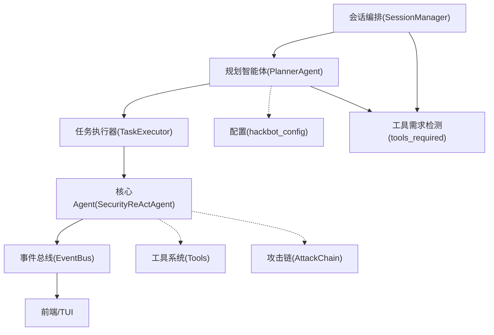
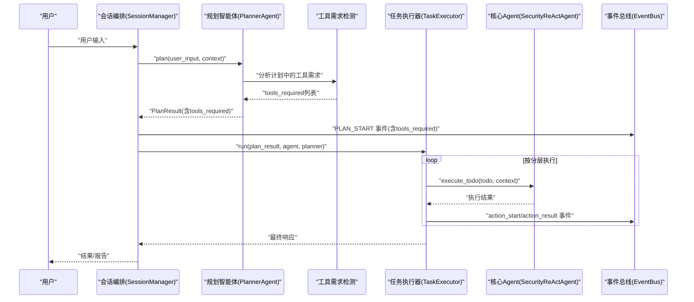
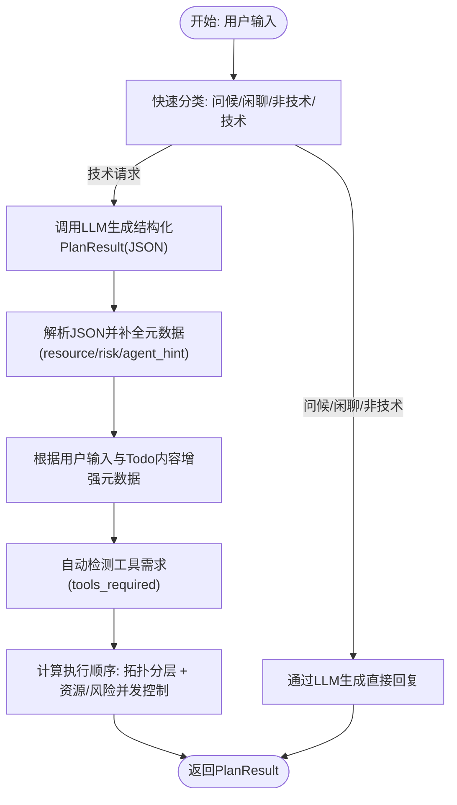
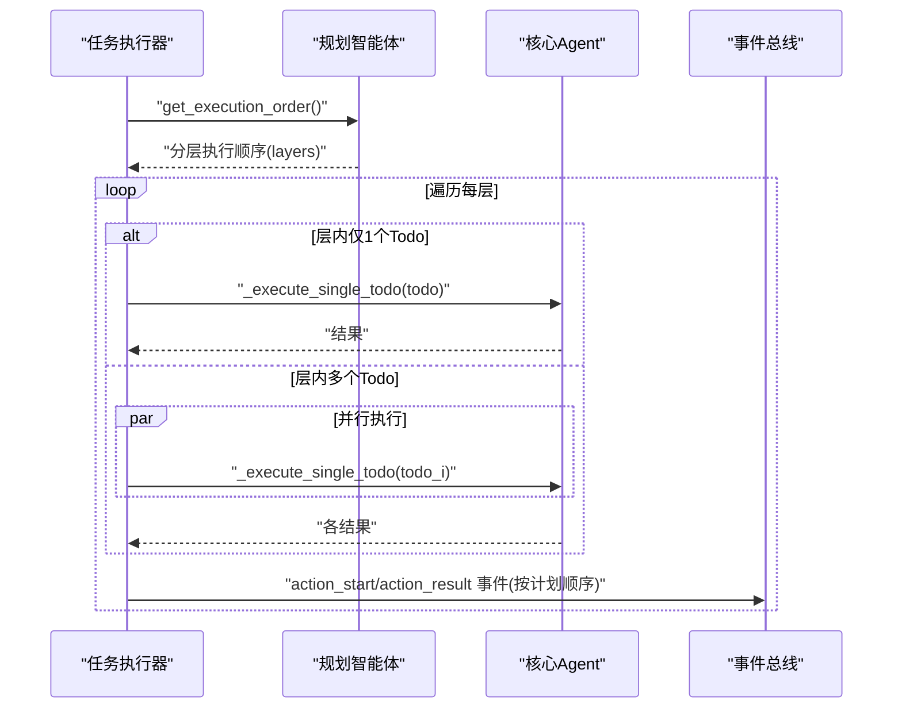
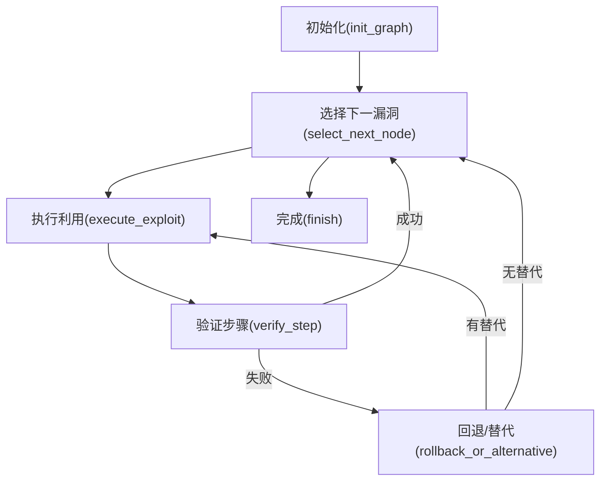
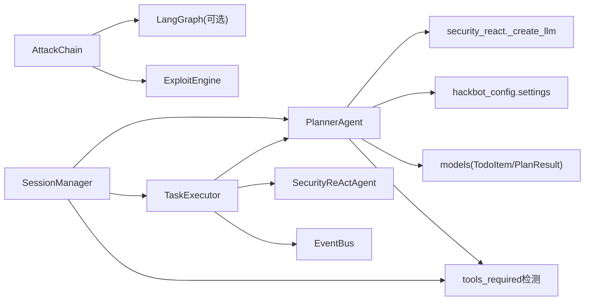

# 规划智能体

<cite>
**本文引用的文件**
- [planner_agent.py](file://core/agents/planner_agent.py)
- [models.py](file://core/models.py)
- [executor.py](file://core/executor.py)
- [session.py](file://core/session.py)
- [security_react.py](file://core/patterns/security_react.py)
- [attack_chain.py](file://core/attack_chain/attack_chain.py)
- [workflow.py](file://core/attack_chain/graph/workflow.py)
- [nodes.py](file://core/attack_chain/graph/nodes.py)
- [reconnaissance.py](file://core/attack_chain/reconnaissance.py)
- [__init__.py](file://hackbot_config/__init__.py)
- [base.py](file://tools/base.py)
- [event_bus.py](file://utils/event_bus.py)
</cite>

## 更新摘要
**变更内容**
- 增强了规划智能体的自动工具需求检测功能，能够分析生成的计划以确定执行所需的工具
- 新增了tools_required字段，用于实现更高效的资源分配和工具集成
- 改进了会话编排中的工具需求展示机制
- 优化了工具使用率统计和资源分配策略

## 目录
1. [简介](#简介)
2. [项目结构](#项目结构)
3. [核心组件](#核心组件)
4. [架构总览](#架构总览)
5. [详细组件分析](#详细组件分析)
6. [依赖关系分析](#依赖关系分析)
7. [性能考量](#性能考量)
8. [故障排查指南](#故障排查指南)
9. [结论](#结论)
10. [附录](#附录)

## 简介
本文件围绕Secbot的规划智能体（PlannerAgent）展开，系统阐述其结构化规划算法、依赖关系处理机制、并行执行策略、任务优先级排序，以及如何理解用户意图并生成可执行的Todo列表。文档同时结合会话编排、任务执行器、攻击链推理等模块，给出端到端的执行流程与优化建议。

**更新** 规划智能体现已增强自动工具需求检测功能，能够智能分析生成的计划以确定执行所需的工具，实现更高效的资源分配和工具集成。

## 项目结构
规划智能体位于后端Python核心模块中，与会话编排、任务执行、工具系统、攻击链推理等模块协同工作。整体采用"会话编排 → 规划 → 执行 → 摘要"的流水线式设计，支持简单问答直返与复杂任务的结构化规划。

**图表来源**
- [session.py:250-277](file://core/session.py#L250-L277)
- [planner_agent.py:546-556](file://core/agents/planner_agent.py#L546-L556)
- [models.py:79-80](file://core/models.py#L79-L80)

**章节来源**
- [session.py:139-456](file://core/session.py#L139-L456)
- [planner_agent.py:86-128](file://core/agents/planner_agent.py#L86-L128)
- [executor.py:46-133](file://core/executor.py#L46-L133)
- [security_react.py:393-628](file://core/patterns/security_react.py#L393-L628)
- [__init__.py:162-246](file://hackbot_config/__init__.py#L162-L246)
- [base.py:16-35](file://tools/base.py#L16-L35)

## 核心组件
- 规划智能体（PlannerAgent）：负责请求类型判断、结构化计划生成、依赖编排、资源与风险标注、执行顺序分层，**新增自动工具需求检测**。
- 任务执行器（TaskExecutor）：依据规划的分层顺序，串行或并行执行任务，实时推送事件。
- 会话编排（SessionManager）：路由简单问答与技术任务，协调规划与执行阶段，驱动事件总线，**支持工具需求展示**。
- 核心Agent（SecurityReActAgent）：基于ReAct循环执行工具，支持自动执行与用户确认两种模式。
- 攻击链（AttackChain）：面向渗透测试的自动化攻击链，支持LangGraph推理与回退执行器。
- 工具系统（Tools）：提供统一的工具抽象与执行结果封装。
- **工具需求检测（tools_required）**：**新增功能**，自动分析计划中的工具需求，实现更高效的资源分配。

**章节来源**
- [planner_agent.py:20-80](file://core/agents/planner_agent.py#L20-L80)
- [executor.py:17-38](file://core/executor.py#L17-L38)
- [session.py:32-76](file://core/session.py#L32-L76)
- [security_react.py:142-190](file://core/patterns/security_react.py#L142-L190)
- [attack_chain.py:11-213](file://core/attack_chain/attack_chain.py#L11-L213)
- [base.py:16-35](file://tools/base.py#L16-L35)
- [models.py:79-80](file://core/models.py#L79-L80)

## 架构总览
规划智能体在会话编排阶段被调用，生成结构化PlanResult（包含请求类型、计划摘要与Todo列表）。**新增的工具需求检测功能会在解析JSON计划时自动提取所需的工具名称**。随后由任务执行器按分层顺序执行，期间通过事件总线将思考、行动、观察、结果等阶段化信息推送到前端，实现线性渲染与可视化反馈。

**图表来源**
- [session.py:250-277](file://core/session.py#L250-L277)
- [planner_agent.py:546-556](file://core/agents/planner_agent.py#L546-L556)
- [executor.py:46-133](file://core/executor.py#L46-L133)
- [security_react.py:393-628](file://core/patterns/security_react.py#L393-L628)

## 详细组件分析

### 规划智能体（PlannerAgent）
- 请求类型判断：通过关键词规则快速区分问候、闲聊、非技术与技术请求，避免不必要的LLM调用。
- 结构化计划生成：调用LLM生成JSON格式的PlanResult，包含计划摘要与Todo列表，每个Todo包含id、内容、工具提示、依赖列表及可选的资源、风险等级、代理提示。
- 元数据推断：根据Todo内容与用户输入推断资源（host/subnet/web/domain）、风险等级（high/medium/low）与代理提示（网络侦察/WEB渗透/OSINT/终端操作/防御监控）。
- **工具需求检测**：**新增功能**，在解析JSON计划时自动提取所有非空的tool_hint，去重后生成tools_required列表，用于说明执行该计划需要哪些工具。
- 执行顺序分层：基于依赖关系进行拓扑分层，并在层内按资源与风险等级进行"安全并发"控制，确保同一资源上的高风险步骤串行，同时受全局并发上限约束。

**图表来源**
- [planner_agent.py:86-128](file://core/agents/planner_agent.py#L86-L128)
- [planner_agent.py:522-561](file://core/agents/planner_agent.py#L522-L561)
- [planner_agent.py:546-556](file://core/agents/planner_agent.py#L546-L556)
- [planner_agent.py:633-649](file://core/agents/planner_agent.py#L633-L649)
- [planner_agent.py:180-248](file://core/agents/planner_agent.py#L180-L248)

**章节来源**
- [planner_agent.py:20-80](file://core/agents/planner_agent.py#L20-L80)
- [planner_agent.py:86-128](file://core/agents/planner_agent.py#L86-L128)
- [planner_agent.py:180-248](file://core/agents/planner_agent.py#L180-L248)
- [planner_agent.py:522-561](file://core/agents/planner_agent.py#L522-L561)
- [planner_agent.py:546-556](file://core/agents/planner_agent.py#L546-L556)
- [planner_agent.py:633-649](file://core/agents/planner_agent.py#L633-L649)

### 任务执行器（TaskExecutor）
- 分层执行：读取规划器提供的执行顺序（每层内的多个Todo可并行），逐层串行或并行执行。
- 并发控制：同一层内使用异步聚合执行，保证异常不影响整体流程；完成后按原计划顺序推送事件，确保前端线性渲染。
- 上下文聚合：将已完成任务的结果按Todo维度与按资源维度聚合，供后续步骤引用。
- 事件推送：在每次行动前后推送事件，便于前端展示思考、执行与结果。

**图表来源**
- [executor.py:46-133](file://core/executor.py#L46-L133)
- [executor.py:135-178](file://core/executor.py#L135-L178)

**章节来源**
- [executor.py:17-38](file://core/executor.py#L17-L38)
- [executor.py:46-133](file://core/executor.py#L46-L133)
- [executor.py:135-178](file://core/executor.py#L135-L178)

### 会话编排（SessionManager）
- 路由决策：根据请求类型决定走QA简答或规划+执行链路；支持强制QA或强制Agent流程。
- 规划阶段：预加载可用工具列表传递给规划智能体，提升tool_hint准确性；发射规划开始事件，**包含tools_required信息**。
- 执行阶段：将PlanResult交由任务执行器与核心Agent执行；在执行过程中持续推送事件。
- 会话管理：维护会话历史、消息与事件分发。
- **工具需求展示**：**新增功能**，在PLAN_START事件中包含tools_required字段，向用户展示执行该计划需要集成的工具。

**章节来源**
- [session.py:139-456](file://core/session.py#L139-L456)
- [session.py:250-277](file://core/session.py#L250-L277)
- [session.py:449-473](file://core/session.py#L449-L473)

### 核心Agent（SecurityReActAgent）
- ReAct循环：Think → Action → Observation，直至得到Final Answer或达到最大迭代次数。
- 工具执行：严格按规划顺序执行，必要时进行敏感操作确认；通过事件总线推送思考与观察。
- 摘要生成：在结束时汇总思考与观察，生成结论与报告。

**章节来源**
- [security_react.py:393-628](file://core/patterns/security_react.py#L393-L628)
- [security_react.py:630-796](file://core/patterns/security_react.py#L630-L796)

### 攻击链（AttackChain）与LangGraph工作流
- 攻击链：整合信息收集、漏洞扫描、漏洞库检索、漏洞利用与后渗透，形成完整的自动化渗透测试流程。
- LangGraph推理：构建StateGraph，支持条件边与回退执行器；在不可用时自动回退到纯Python有限状态机。
- 节点逻辑：初始化资产与漏洞节点、选择下一漏洞、执行利用、验证与回退/替代路径，最终生成攻击链结果。

**图表来源**
- [workflow.py:46-96](file://core/attack_chain/graph/workflow.py#L46-L96)
- [nodes.py:35-119](file://core/attack_chain/graph/nodes.py#L35-L119)
- [nodes.py:122-189](file://core/attack_chain/graph/nodes.py#L122-L189)
- [nodes.py:192-234](file://core/attack_chain/graph/nodes.py#L192-L234)
- [nodes.py:237-261](file://core/attack_chain/graph/nodes.py#L237-L261)
- [nodes.py:264-321](file://core/attack_chain/graph/nodes.py#L264-L321)
- [nodes.py:324-353](file://core/attack_chain/graph/nodes.py#L324-L353)

**章节来源**
- [attack_chain.py:18-61](file://core/attack_chain/attack_chain.py#L18-L61)
- [workflow.py:46-96](file://core/attack_chain/graph/workflow.py#L46-L96)
- [nodes.py:35-119](file://core/attack_chain/graph/nodes.py#L35-L119)
- [nodes.py:122-189](file://core/attack_chain/graph/nodes.py#L122-L189)
- [nodes.py:192-234](file://core/attack_chain/graph/nodes.py#L192-L234)
- [nodes.py:237-261](file://core/attack_chain/graph/nodes.py#L237-L261)
- [nodes.py:264-321](file://core/attack_chain/graph/nodes.py#L264-L321)
- [nodes.py:324-353](file://core/attack_chain/graph/nodes.py#L324-L353)

### 数据模型与工具系统
- TodoItem：包含id、内容、状态、依赖、工具提示、资源、风险等级、代理提示、结果摘要等字段。
- PlanResult：封装请求类型、计划摘要、Todo列表，**新增tools_required字段**。
- BaseTool/ToolResult：工具抽象与执行结果封装，统一返回success/result/error。

**章节来源**
- [models.py:23-60](file://core/models.py#L23-L60)
- [models.py:72-80](file://core/models.py#L72-L80)
- [base.py:9-35](file://tools/base.py#L9-L35)

### 工具需求检测机制
**新增功能** 规划智能体现在具备自动工具需求检测能力，能够智能分析生成的计划以确定执行所需的工具。

- **检测原理**：在解析JSON计划时，遍历所有TodoItem的tool_hint字段，过滤掉None和空字符串，进行去重后生成tools_required列表。
- **应用场景**：
  - 规划阶段：自动提取计划中需要的工具名称，用于说明执行该计划需要哪些工具
  - 会话编排：在PLAN_START事件中传递tools_required信息给前端
  - 资源分配：为后续的工具注册和资源分配提供准确的数据支撑
- **实现细节**：在_parse_plan_json和_fallback_plan方法中都包含了工具需求检测逻辑，确保无论哪种规划方式都能提供准确的工具需求信息。

**章节来源**
- [planner_agent.py:546-556](file://core/agents/planner_agent.py#L546-L556)
- [planner_agent.py:647-649](file://core/agents/planner_agent.py#L647-L649)
- [models.py:79-80](file://core/models.py#L79-L80)

## 依赖关系分析
- 规划智能体依赖：
  - LLM创建与调用：通过安全ReAct引擎的工厂方法创建多厂商LLM实例。
  - 配置系统：读取推理后端提供商、模型与温度等配置。
  - 数据模型：使用TodoItem与PlanResult作为输入输出结构，**PlanResult包含tools_required字段**。
- 任务执行器依赖：
  - 规划智能体：获取分层执行顺序。
  - 核心Agent：执行单个Todo。
  - 事件总线：推送阶段事件。
- 会话编排依赖：
  - 规划智能体：生成计划。
  - 任务执行器：执行计划。
  - 事件总线：驱动前端渲染，**支持工具需求展示**。
- 攻击链依赖：
  - LangGraph：可选依赖，不可用时回退。
  - ExploitEngine：执行具体利用步骤。
  - 漏洞库服务：丰富漏洞信息。

**图表来源**
- [planner_agent.py:477-492](file://core/agents/planner_agent.py#L477-L492)
- [security_react.py:49-139](file://core/patterns/security_react.py#L49-L139)
- [__init__.py:162-246](file://hackbot_config/__init__.py#L162-L246)
- [models.py:23-80](file://core/models.py#L23-L80)
- [executor.py:24-37](file://core/executor.py#L24-L37)
- [session.py:56-58](file://core/session.py#L56-L58)
- [attack_chain.py:149-182](file://core/attack_chain/attack_chain.py#L149-L182)

**章节来源**
- [planner_agent.py:477-492](file://core/agents/planner_agent.py#L477-L492)
- [security_react.py:49-139](file://core/patterns/security_react.py#L49-L139)
- [__init__.py:162-246](file://hackbot_config/__init__.py#L162-L246)
- [models.py:23-80](file://core/models.py#L23-L80)
- [executor.py:24-37](file://core/executor.py#L24-L37)
- [session.py:56-58](file://core/session.py#L56-L58)
- [attack_chain.py:149-182](file://core/attack_chain/attack_chain.py#L149-L182)

## 性能考量
- LLM调用：规划阶段与ReAct阶段均可能触发LLM调用，建议合理设置温度与超时，避免阻塞；在不可用时使用回退计划。
- 并发控制：分层执行时，同一层最多并行max_parallel_per_layer个任务，避免资源争用与系统过载。
- 事件推送：按计划顺序推送事件，保证前端线性渲染，减少重复渲染成本。
- 攻击链推理：LangGraph不可用时回退到有限状态机，确保稳定性；可利用回退逻辑进行性能优化与调试。
- **工具需求检测性能**：**新增考虑**，工具需求检测采用简单的集合操作，时间复杂度为O(n)，其中n为TodoItem数量，对整体性能影响很小。

## 故障排查指南
- LLM连接失败：规划阶段与ReAct阶段均可能因LLM连接异常而回退到简单计划或错误提示，检查配置与网络。
- 依赖环或非法依赖：当存在环或非法依赖时，执行顺序计算会退化为一次性取出剩余任务，需检查Todo依赖列表。
- 工具不存在：核心Agent在执行时若找不到对应工具，会提示可用工具列表，需核对tool_hint与工具注册。
- 事件未推送：确认事件总线已正确初始化并监听相应事件类型。
- **工具需求缺失**：**新增故障排查**，如果tools_required为空，检查TodoItem的tool_hint字段是否正确设置，或确认规划是否成功解析。

**章节来源**
- [planner_agent.py:494-502](file://core/agents/planner_agent.py#L494-L502)
- [planner_agent.py:210-213](file://core/agents/planner_agent.py#L210-L213)
- [security_react.py:481-491](file://core/patterns/security_react.py#L481-L491)
- [executor.py:92-101](file://core/executor.py#L92-L101)

## 结论
规划智能体通过结构化规划与分层并行执行，实现了从复杂渗透测试任务到可执行Todo列表的高效转化。**新增的自动工具需求检测功能进一步提升了系统的智能化水平，能够自动分析计划中的工具需求，为资源分配和工具集成提供准确的数据支撑**。其依赖关系处理、资源与风险并发控制、事件驱动的可视化反馈，共同构成了端到端的自动化安全测试工作流。结合攻击链推理与会话编排，规划智能体在保证安全性与可控性的前提下，提升了任务执行效率与用户体验。

## 附录

### 任务规划示例（概念性说明）
- 输入：对目标站点执行基础渗透测试，包含信息收集与目录爆破。
- 规划阶段：规划智能体生成包含"信息收集→端口扫描→服务识别→目录爆破→结果分析"的结构化Todo列表，**自动检测到需要port_scan、service_detect、dir_bruteforce等工具**。
- 执行阶段：任务执行器按分层顺序并行执行，事件总线推送每一步的思考与结果。
- 输出：前端展示线性渲染的执行过程与最终报告，**同时显示执行该计划需要集成的工具列表**。

### 优化策略
- 规划阶段：提供更丰富的上下文（如工具列表、会话历史）以提升tool_hint准确性。
- 执行阶段：根据资源与风险等级动态调整并发层大小，平衡吞吐与稳定性。
- 攻击链：在LangGraph可用时启用推理，不可用时利用回退逻辑进行性能调优。
- 配置管理：通过配置模块统一管理LLM提供商与模型，便于切换与扩展。
- **工具需求检测优化**：**新增优化策略**，通过改进工具需求检测算法，提高工具识别的准确性；优化tools_required的生成逻辑，减少重复工具的出现；建立工具使用率统计机制，为未来的资源分配提供数据支撑。