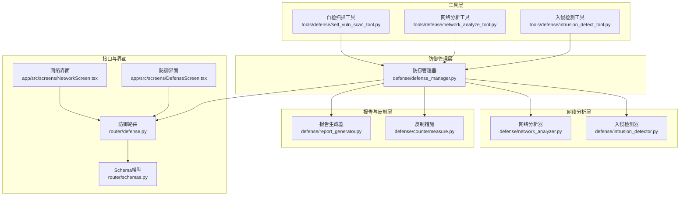
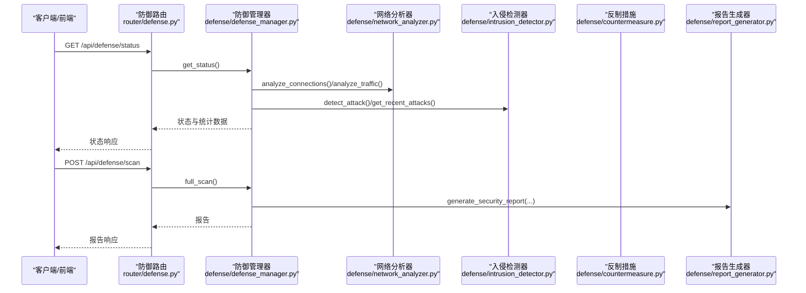
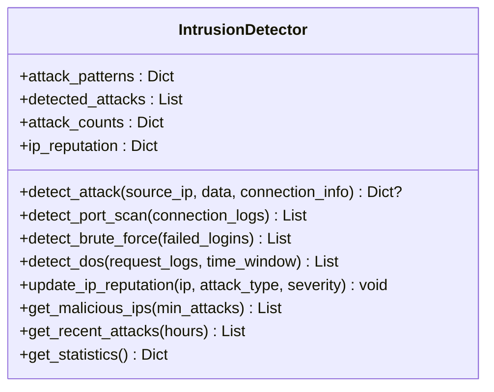
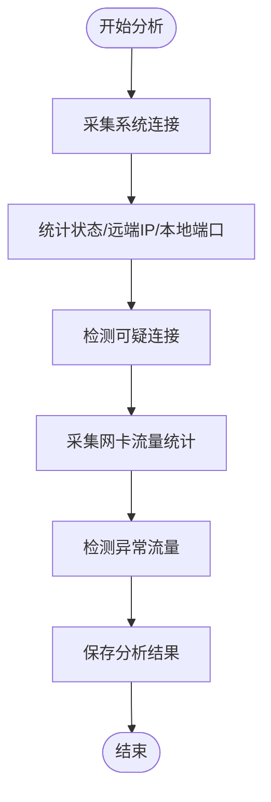
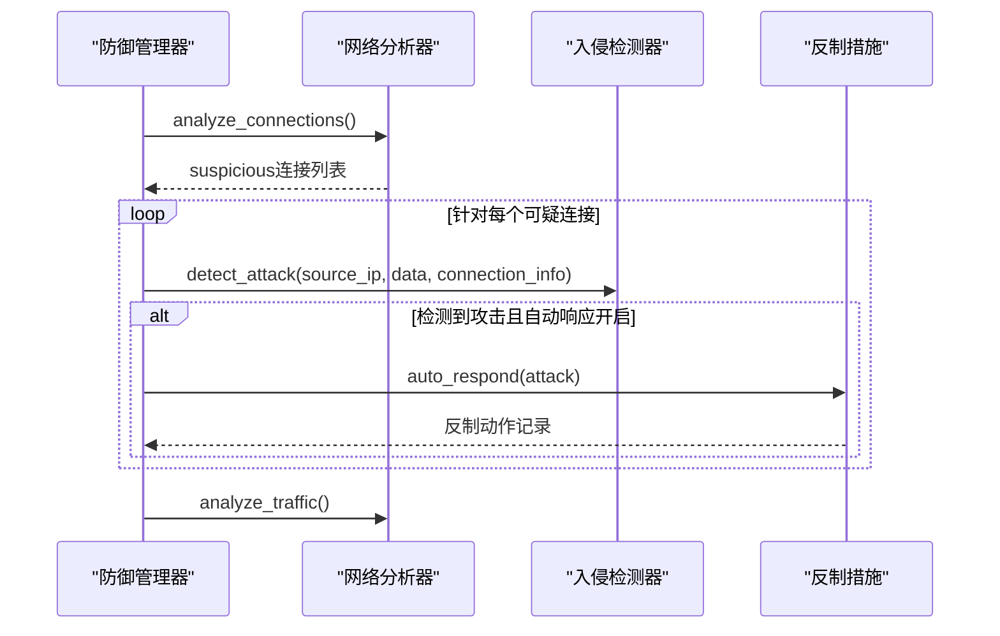
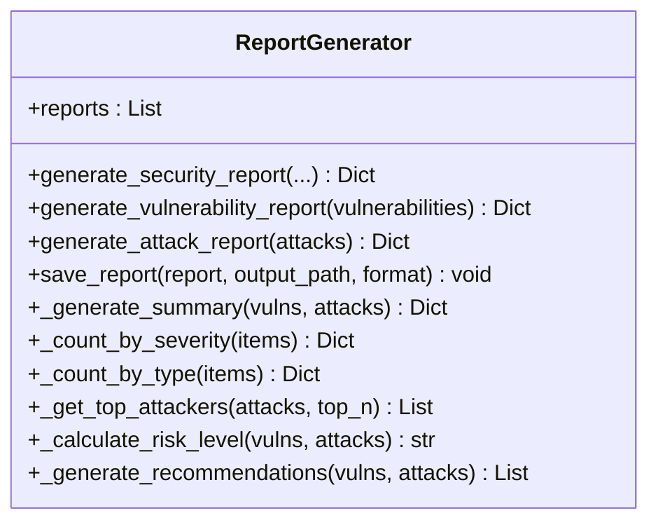
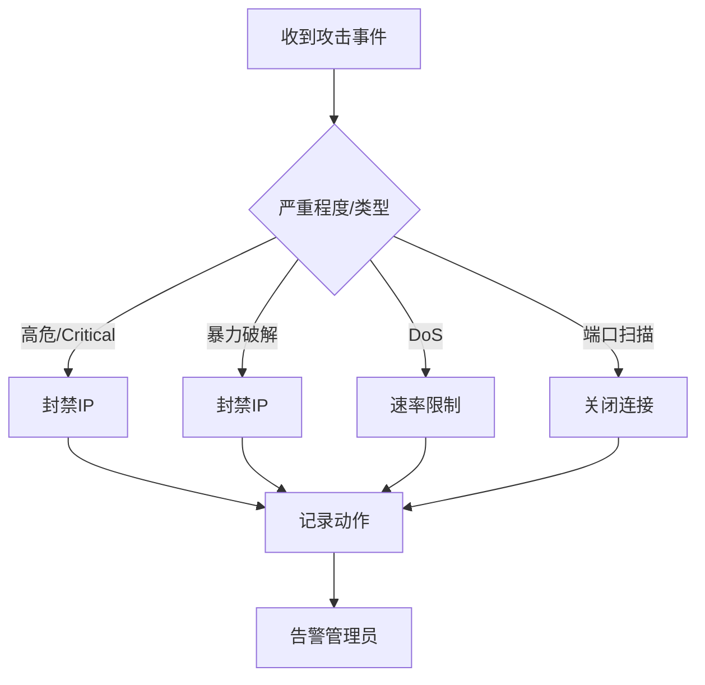
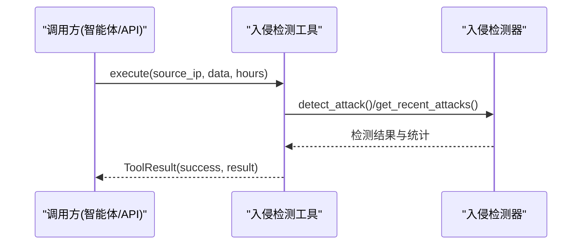
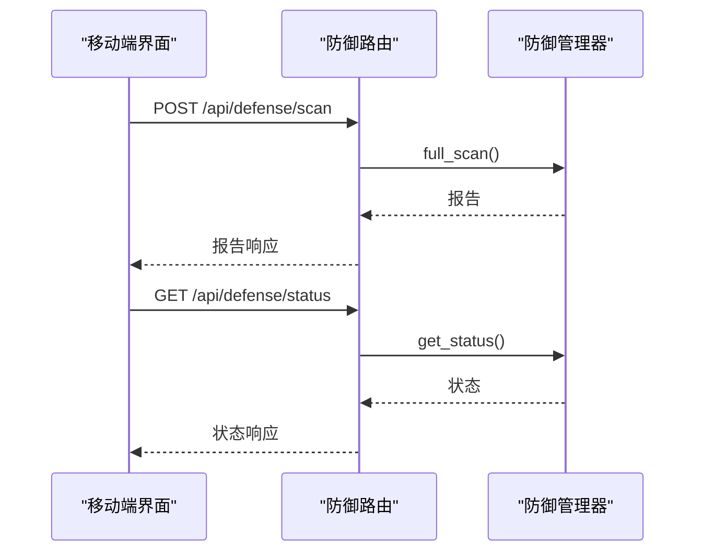
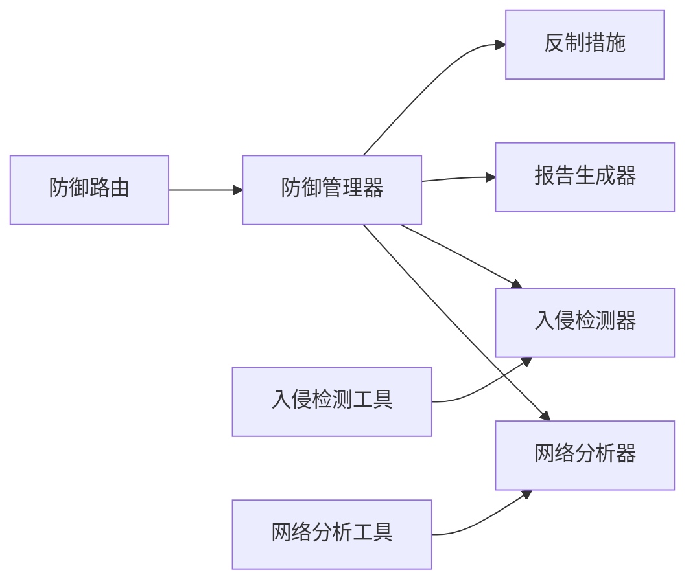

# 入侵检测系统

<cite>
**本文引用的文件**
- [defense/intrusion_detector.py](file://defense/intrusion_detector.py)
- [defense/network_analyzer.py](file://defense/network_analyzer.py)
- [defense/defense_manager.py](file://defense/defense_manager.py)
- [defense/report_generator.py](file://defense/report_generator.py)
- [defense/countermeasure.py](file://defense/countermeasure.py)
- [tools/defense/intrusion_detect_tool.py](file://tools/defense/intrusion_detect_tool.py)
- [tools/defense/network_analyze_tool.py](file://tools/defense/network_analyze_tool.py)
- [tools/defense/self_vuln_scan_tool.py](file://tools/defense/self_vuln_scan_tool.py)
- [router/defense.py](file://router/defense.py)
- [router/schemas.py](file://router/schemas.py)
- [app/src/screens/DefenseScreen.tsx](file://app/src/screens/DefenseScreen.tsx)
- [app/src/screens/NetworkScreen.tsx](file://app/src/screens/NetworkScreen.tsx)
</cite>

## 目录
1. [简介](#简介)
2. [项目结构](#项目结构)
3. [核心组件](#核心组件)
4. [架构总览](#架构总览)
5. [详细组件分析](#详细组件分析)
6. [依赖关系分析](#依赖关系分析)
7. [性能考量](#性能考量)
8. [故障排查指南](#故障排查指南)
9. [结论](#结论)
10. [附录](#附录)

## 简介
本文件面向Secbot的入侵检测系统，系统性阐述其工作原理、实现机制与使用方法，覆盖异常流量分析、攻击模式识别、行为基线建立、实时监控、历史数据分析、告警规则配置、策略配置与误报处理等关键主题。通过代码级分析与可视化图示，帮助安全运营人员与开发者快速理解并部署可靠的入侵检测体系。

## 项目结构
Secbot的入侵检测能力由“工具层”“防御管理层”“网络分析层”“报告与反制层”构成，并通过API路由与前端界面提供统一入口。核心文件分布如下：
- 工具层：提供可被智能体或API调用的入侵检测、网络分析、自检扫描等工具
- 防御管理层：编排各子模块，负责实时监控、自动响应与状态聚合
- 网络分析层：采集系统连接与流量数据，识别可疑行为
- 报告与反制层：生成各类安全报告，执行封禁、限流、告警等反制动作
- 路由与前端：暴露REST接口与移动端界面，支撑日常运维与可视化

图表来源
- [tools/defense/intrusion_detect_tool.py](file://tools/defense/intrusion_detect_tool.py#L1-L65)
- [tools/defense/network_analyze_tool.py](file://tools/defense/network_analyze_tool.py#L1-L85)
- [tools/defense/self_vuln_scan_tool.py](file://tools/defense/self_vuln_scan_tool.py#L1-L64)
- [defense/defense_manager.py](file://defense/defense_manager.py#L1-L160)
- [defense/network_analyzer.py](file://defense/network_analyzer.py#L1-L226)
- [defense/intrusion_detector.py](file://defense/intrusion_detector.py#L1-L235)
- [defense/report_generator.py](file://defense/report_generator.py#L1-L290)
- [defense/countermeasure.py](file://defense/countermeasure.py#L1-L235)
- [router/defense.py](file://router/defense.py#L1-L96)
- [router/schemas.py](file://router/schemas.py#L166-L197)
- [app/src/screens/DefenseScreen.tsx](file://app/src/screens/DefenseScreen.tsx#L1-L286)
- [app/src/screens/NetworkScreen.tsx](file://app/src/screens/NetworkScreen.tsx#L1-L241)

章节来源
- [defense/defense_manager.py](file://defense/defense_manager.py#L1-L160)
- [router/defense.py](file://router/defense.py#L1-L96)

## 核心组件
- 入侵检测器：基于正则模式匹配与统计阈值识别端口扫描、暴力破解、SQL注入、XSS、DoS、恶意软件等攻击；维护IP信誉与统计信息
- 网络分析器：采集系统连接与流量数据，识别可疑连接与异常流量
- 防御管理器：统一编排检测、分析、报告与反制流程，支持实时监控与自动响应
- 报告生成器：生成完整安全报告、漏洞报告与攻击报告，提供推荐与摘要
- 反制措施：根据攻击类型与严重程度自动封禁IP、限流、关闭连接、告警
- 工具层：封装入侵检测、网络分析、自检扫描为可复用工具，便于API与智能体调用
- 路由与界面：提供REST接口与移动端界面，支撑状态查询、封禁列表、扫描与解封操作

章节来源
- [defense/intrusion_detector.py](file://defense/intrusion_detector.py#L11-L235)
- [defense/network_analyzer.py](file://defense/network_analyzer.py#L12-L226)
- [defense/defense_manager.py](file://defense/defense_manager.py#L17-L160)
- [defense/report_generator.py](file://defense/report_generator.py#L11-L290)
- [defense/countermeasure.py](file://defense/countermeasure.py#L11-L235)
- [tools/defense/intrusion_detect_tool.py](file://tools/defense/intrusion_detect_tool.py#L6-L65)
- [tools/defense/network_analyze_tool.py](file://tools/defense/network_analyze_tool.py#L6-L85)
- [tools/defense/self_vuln_scan_tool.py](file://tools/defense/self_vuln_scan_tool.py#L6-L64)
- [router/defense.py](file://router/defense.py#L19-L96)
- [router/schemas.py](file://router/schemas.py#L166-L197)
- [app/src/screens/DefenseScreen.tsx](file://app/src/screens/DefenseScreen.tsx#L28-L184)
- [app/src/screens/NetworkScreen.tsx](file://app/src/screens/NetworkScreen.tsx#L31-L163)

## 架构总览
下图展示从API到工具、再到防御管理层与网络分析层的调用链路，以及反制与报告生成的闭环：

图表来源
- [router/defense.py](file://router/defense.py#L22-L96)
- [defense/defense_manager.py](file://defense/defense_manager.py#L34-L160)
- [defense/network_analyzer.py](file://defense/network_analyzer.py#L20-L100)
- [defense/intrusion_detector.py](file://defense/intrusion_detector.py#L56-L235)
- [defense/report_generator.py](file://defense/report_generator.py#L17-L94)

## 详细组件分析

### 入侵检测器（异常流量与攻击模式识别）
- 攻击模式识别
  - 正则模式库覆盖端口扫描、暴力破解、SQL注入、XSS、DoS、恶意软件等
  - 基于正则匹配触发检测，记录来源IP、时间戳、匹配模式、严重程度与数据样本
- 统计阈值检测
  - 端口扫描：按源IP统计端口集合数量超过阈值即判定
  - 暴力破解：按源IP+用户名统计失败登录次数超过阈值即判定
  - DoS：按时间窗口统计请求数超过阈值即判定
- 行为基线与信誉
  - 维护IP信誉：累计攻击次数、攻击类型集合、首次/最近出现时间、严重程度
  - 提供恶意IP列表与近期攻击列表，支持按小时过滤
- 复杂度与性能
  - 正则匹配与阈值统计均为线性复杂度，适合实时处理
  - 数据结构采用默认字典与集合，降低重复计算成本

图表来源
- [defense/intrusion_detector.py](file://defense/intrusion_detector.py#L11-L235)

章节来源
- [defense/intrusion_detector.py](file://defense/intrusion_detector.py#L14-L235)

### 网络分析器（异常流量与可疑连接）
- 连接分析
  - 采集系统连接，统计按状态、远端IP、本地端口分布
  - 识别可疑连接：大量连接到同一IP、连接到可疑端口、连接到可疑外部IP
- 流量分析
  - 采集网卡层面的收发字节数、包数、错误与丢包
  - 异常检测：单接口高流量、错误/丢包异常
- 复杂度与性能
  - 遍历连接与接口计数为线性复杂度，阈值判断常数开销
  - 本地IP与可疑IP判定为简化实现，便于在不同平台运行

图表来源
- [defense/network_analyzer.py](file://defense/network_analyzer.py#L20-L176)

章节来源
- [defense/network_analyzer.py](file://defense/network_analyzer.py#L12-L226)

### 防御管理器（编排与自动响应）
- 编排职责
  - 启动/停止实时监控，周期性分析连接与流量
  - 调用入侵检测器进行攻击检测，更新IP信誉
  - 在自动响应开启时执行反制措施（封禁、限流、关闭连接、告警）
  - 生成完整安全报告、漏洞报告与攻击报告
- 状态聚合
  - 返回监控状态、自动响应开关、封禁IP数、漏洞数、检测攻击数、恶意IP数与统计信息

图表来源
- [defense/defense_manager.py](file://defense/defense_manager.py#L63-L104)
- [defense/network_analyzer.py](file://defense/network_analyzer.py#L20-L100)
- [defense/intrusion_detector.py](file://defense/intrusion_detector.py#L56-L82)
- [defense/countermeasure.py](file://defense/countermeasure.py#L185-L223)

章节来源
- [defense/defense_manager.py](file://defense/defense_manager.py#L17-L160)

### 报告生成器（策略与建议输出）
- 报告类型
  - 完整安全报告：汇总系统信息、漏洞、网络分析、检测攻击与流量统计
  - 漏洞报告：按严重程度统计与建议
  - 攻击报告：按类型与严重程度统计、Top攻击者与建议
- 摘要与建议
  - 基于漏洞与攻击数量与严重程度计算风险等级
  - 生成针对性修复与防护建议（如账户锁定、参数化查询、速率限制、DDoS防护等）

图表来源
- [defense/report_generator.py](file://defense/report_generator.py#L11-L290)

章节来源
- [defense/report_generator.py](file://defense/report_generator.py#L17-L290)

### 反制措施（自动响应与封禁）
- 动作类型
  - 封禁IP：基于平台调用防火墙规则（Windows/iptables）
  - 速率限制：对IP实施请求速率限制
  - 关闭连接：终止与特定IP的活动连接
  - 告警：记录并上报攻击信息
- 自动响应策略
  - 依据攻击类型与严重程度选择动作组合
  - 记录反制历史，便于审计与回溯

图表来源
- [defense/countermeasure.py](file://defense/countermeasure.py#L185-L223)

章节来源
- [defense/countermeasure.py](file://defense/countermeasure.py#L11-L235)

### 工具层（API与智能体调用）
- 入侵检测工具
  - 支持实时检测与历史攻击查询，返回检测结果、统计与近期攻击列表
- 网络分析工具
  - 支持连接与流量分析，兼容权限受限环境的降级方案
- 自检扫描工具
  - 支持系统/网络/应用三类扫描，按严重程度分组

图表来源
- [tools/defense/intrusion_detect_tool.py](file://tools/defense/intrusion_detect_tool.py#L17-L52)
- [defense/intrusion_detector.py](file://defense/intrusion_detector.py#L56-L235)

章节来源
- [tools/defense/intrusion_detect_tool.py](file://tools/defense/intrusion_detect_tool.py#L6-L65)
- [tools/defense/network_analyze_tool.py](file://tools/defense/network_analyze_tool.py#L6-L85)
- [tools/defense/self_vuln_scan_tool.py](file://tools/defense/self_vuln_scan_tool.py#L6-L64)

### 路由与界面（使用与运维）
- 路由接口
  - /api/defense/scan：执行完整安全扫描并返回报告
  - /api/defense/status：获取防御系统状态
  - /api/defense/blocked：获取封禁IP列表
  - /api/defense/unblock：解封指定IP
  - /api/defense/report：生成漏洞/攻击报告
- 前端界面
  - 防御界面：执行扫描、查看状态、封禁列表与解封操作
  - 网络界面：内网发现、目标与授权管理

图表来源
- [router/defense.py](file://router/defense.py#L22-L96)
- [router/schemas.py](file://router/schemas.py#L166-L197)
- [app/src/screens/DefenseScreen.tsx](file://app/src/screens/DefenseScreen.tsx#L28-L184)

章节来源
- [router/defense.py](file://router/defense.py#L19-L96)
- [router/schemas.py](file://router/schemas.py#L166-L197)
- [app/src/screens/DefenseScreen.tsx](file://app/src/screens/DefenseScreen.tsx#L28-L184)
- [app/src/screens/NetworkScreen.tsx](file://app/src/screens/NetworkScreen.tsx#L31-L163)

## 依赖关系分析
- 组件耦合
  - 防御管理器聚合网络分析器、入侵检测器、报告生成器与反制措施，形成高内聚低耦合的编排层
  - 工具层通过延迟导入避免循环依赖，提升模块独立性
- 外部依赖
  - 网络分析依赖系统库采集连接与流量，具备跨平台兼容性
  - 反制措施依赖系统防火墙/iptables命令，需具备相应权限
- 潜在风险
  - 正则模式与阈值需持续迭代以降低误报
  - 反制动作需结合业务场景谨慎配置，避免影响正常业务

图表来源
- [defense/defense_manager.py](file://defense/defense_manager.py#L17-L32)
- [tools/defense/intrusion_detect_tool.py](file://tools/defense/intrusion_detect_tool.py#L23-L25)
- [tools/defense/network_analyze_tool.py](file://tools/defense/network_analyze_tool.py#L21-L23)
- [router/defense.py](file://router/defense.py#L26-L28)

章节来源
- [defense/defense_manager.py](file://defense/defense_manager.py#L17-L32)
- [tools/defense/intrusion_detect_tool.py](file://tools/defense/intrusion_detect_tool.py#L23-L25)
- [tools/defense/network_analyze_tool.py](file://tools/defense/network_analyze_tool.py#L21-L23)
- [router/defense.py](file://router/defense.py#L26-L28)

## 性能考量
- 实时监控
  - 监控间隔可配置，默认60秒；建议根据系统负载与告警时效性调整
  - 连接与流量采集为线性复杂度，建议在资源充足的环境中运行
- 检测精度
  - 正则模式与阈值需结合业务特征动态优化，定期评估误报率
  - 建议引入机器学习基线模型逐步替代静态阈值
- 反制开销
  - 封禁/限流/关闭连接均涉及系统命令调用，建议在高并发场景下合并动作并去重

## 故障排查指南
- 无法获取连接统计
  - 现象：连接分析失败或返回降级结果
  - 原因：权限不足（psutil在部分平台受限）、系统命令不可用
  - 处理：以管理员/root权限运行；确保netstat/lsof命令可用
- 反制失败
  - 现象：封禁/限流/关闭连接失败
  - 原因：平台不支持、防火墙规则冲突、权限不足
  - 处理：检查平台兼容性与防火墙策略；确认具备相应权限
- 告警未触发
  - 现象：攻击发生但未记录告警
  - 原因：自动响应关闭、反制模块异常
  - 处理：开启自动响应；检查反制模块日志
- 报告为空
  - 现象：扫描后报告字段缺失
  - 原因：扫描未执行或模块异常
  - 处理：先执行扫描；检查各模块状态

章节来源
- [tools/defense/network_analyze_tool.py](file://tools/defense/network_analyze_tool.py#L24-L52)
- [defense/countermeasure.py](file://defense/countermeasure.py#L24-L65)
- [router/defense.py](file://router/defense.py#L26-L30)

## 结论
Secbot的入侵检测系统通过“工具层—防御管理层—网络分析层—报告与反制层”的分层设计，实现了从实时监控、攻击识别、统计分析到自动反制与报告输出的闭环。建议在生产环境中结合业务特征持续优化正则模式与阈值，完善误报处理流程，并根据系统负载合理配置监控频率与反制策略，以构建稳定可靠的入侵检测体系。

## 附录

### 使用方法速览
- 实时监控
  - 通过防御管理器启动监控任务，周期性分析连接与流量，自动检测攻击并执行反制
- 历史数据分析
  - 通过入侵检测器查询近期攻击列表与统计信息，支持按小时过滤
- 告警规则配置
  - 在反制模块中配置自动响应策略（严重程度/攻击类型映射），并启用告警
- 界面操作
  - 在移动端界面执行安全扫描、查看状态、封禁/解封IP、生成报告

章节来源
- [defense/defense_manager.py](file://defense/defense_manager.py#L63-L104)
- [defense/intrusion_detector.py](file://defense/intrusion_detector.py#L200-L235)
- [defense/countermeasure.py](file://defense/countermeasure.py#L185-L223)
- [app/src/screens/DefenseScreen.tsx](file://app/src/screens/DefenseScreen.tsx#L42-L62)