# 安全防御与监控

<cite>
**本文引用的文件**
- [defense/__init__.py](file://defense/__init__.py)
- [defense/defense_manager.py](file://defense/defense_manager.py)
- [defense/intrusion_detector.py](file://defense/intrusion_detector.py)
- [defense/network_analyzer.py](file://defense/network_analyzer.py)
- [defense/vulnerability_scanner.py](file://defense/vulnerability_scanner.py)
- [defense/info_collector.py](file://defense/info_collector.py)
- [defense/report_generator.py](file://defense/report_generator.py)
- [defense/countermeasure.py](file://defense/countermeasure.py)
- [tools/defense/self_vuln_scan_tool.py](file://tools/defense/self_vuln_scan_tool.py)
- [tools/defense/network_analyze_tool.py](file://tools/defense/network_analyze_tool.py)
- [tools/defense/system_info_tool.py](file://tools/defense/system_info_tool.py)
- [tools/defense/intrusion_detect_tool.py](file://tools/defense/intrusion_detect_tool.py)
- [router/defense.py](file://router/defense.py)
- [core/memory/manager.py](file://core/memory/manager.py)
- [core/memory/vector_store.py](file://core/memory/vector_store.py)
</cite>

## 目录
1. [简介](#简介)
2. [项目结构](#项目结构)
3. [核心组件](#核心组件)
4. [架构总览](#架构总览)
5. [组件详解](#组件详解)
6. [依赖关系分析](#依赖关系分析)
7. [性能与扩展性](#性能与扩展性)
8. [故障排查指南](#故障排查指南)
9. [结论](#结论)
10. [附录](#附录)

## 简介
本文件面向Secbot安全防御与监控系统，围绕“主动防御”目标，系统梳理网络发现、入侵检测、系统状态监控、自动反制与报告生成等能力，并结合防御扫描工具链（自检扫描、网络分析、系统信息收集）与内存管理（知识存储、威胁情报与历史数据分析）给出实践指导。文档同时提供策略配置要点与典型应用场景，帮助用户构建可落地的安全监控体系。

## 项目结构
Secbot采用模块化分层组织，防御子系统位于defense目录，配套工具位于tools/defense，对外通过FastAPI路由暴露REST接口，内部通过MemoryManager与向量存储实现知识与经验沉淀。

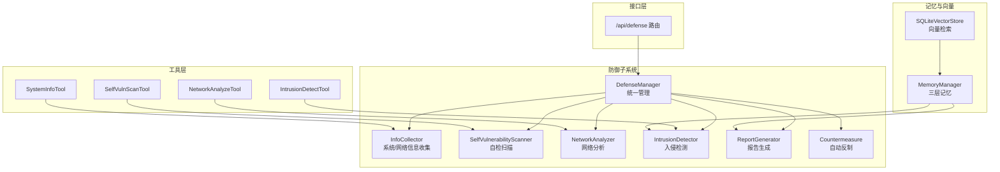

图示来源
- [defense/defense_manager.py](file://defense/defense_manager.py#L17-L160)
- [defense/info_collector.py](file://defense/info_collector.py#L23-L250)
- [defense/vulnerability_scanner.py](file://defense/vulnerability_scanner.py#L12-L314)
- [defense/network_analyzer.py](file://defense/network_analyzer.py#L12-L226)
- [defense/intrusion_detector.py](file://defense/intrusion_detector.py#L11-L235)
- [defense/report_generator.py](file://defense/report_generator.py#L11-L290)
- [defense/countermeasure.py](file://defense/countermeasure.py#L11-L235)
- [tools/defense/self_vuln_scan_tool.py](file://tools/defense/self_vuln_scan_tool.py#L6-L64)
- [tools/defense/network_analyze_tool.py](file://tools/defense/network_analyze_tool.py#L6-L85)
- [tools/defense/system_info_tool.py](file://tools/defense/system_info_tool.py#L6-L67)
- [tools/defense/intrusion_detect_tool.py](file://tools/defense/intrusion_detect_tool.py#L6-L65)
- [router/defense.py](file://router/defense.py#L1-L96)
- [core/memory/manager.py](file://core/memory/manager.py#L223-L325)
- [core/memory/vector_store.py](file://core/memory/vector_store.py#L30-L297)

章节来源
- [defense/__init__.py](file://defense/__init__.py#L1-L21)

## 核心组件
- 防御管理器：统一编排信息收集、漏洞扫描、网络分析、入侵检测、报告生成与自动反制，支持定时监控与状态查询。
- 信息收集器：采集系统、网络、进程、开放端口、用户等多维信息，具备容错与降级策略。
- 自检扫描器：扫描系统更新、不必要服务、文件权限、开放端口、防火墙、SSH配置等，形成可修复清单。
- 网络分析器：统计连接状态、监听端口、可疑连接与异常流量，提供连接摘要与流量摘要。
- 入侵检测器：基于规则匹配与统计阈值识别端口扫描、暴力破解、SQL注入、XSS、DoS、恶意软件等攻击。
- 报告生成器：汇总漏洞、攻击与网络状态，生成风险等级与修复建议。
- 自动反制器：根据攻击类型与严重度执行封禁、速率限制、关闭连接、告警等动作。
- 工具层：封装为可插拔工具，便于在工作流中调用。
- 记忆与向量：三层记忆（短期/情节/长期）与SQLite向量存储，支撑知识沉淀、经验检索与历史分析。

章节来源
- [defense/defense_manager.py](file://defense/defense_manager.py#L17-L160)
- [defense/info_collector.py](file://defense/info_collector.py#L23-L250)
- [defense/vulnerability_scanner.py](file://defense/vulnerability_scanner.py#L12-L314)
- [defense/network_analyzer.py](file://defense/network_analyzer.py#L12-L226)
- [defense/intrusion_detector.py](file://defense/intrusion_detector.py#L11-L235)
- [defense/report_generator.py](file://defense/report_generator.py#L11-L290)
- [defense/countermeasure.py](file://defense/countermeasure.py#L11-L235)
- [tools/defense/self_vuln_scan_tool.py](file://tools/defense/self_vuln_scan_tool.py#L6-L64)
- [tools/defense/network_analyze_tool.py](file://tools/defense/network_analyze_tool.py#L6-L85)
- [tools/defense/system_info_tool.py](file://tools/defense/system_info_tool.py#L6-L67)
- [tools/defense/intrusion_detect_tool.py](file://tools/defense/intrusion_detect_tool.py#L6-L65)
- [core/memory/manager.py](file://core/memory/manager.py#L223-L325)
- [core/memory/vector_store.py](file://core/memory/vector_store.py#L30-L297)

## 架构总览
防御系统采用“工具-模块-管理器-接口”的分层设计。工具层负责对外暴露能力；模块层实现具体功能；管理器负责编排与调度；接口层提供REST API；记忆与向量层提供知识与检索能力。

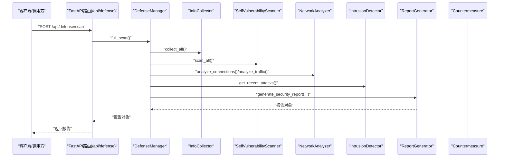

图示来源
- [router/defense.py](file://router/defense.py#L22-L30)
- [defense/defense_manager.py](file://defense/defense_manager.py#L34-L61)
- [defense/info_collector.py](file://defense/info_collector.py#L229-L242)
- [defense/vulnerability_scanner.py](file://defense/vulnerability_scanner.py#L296-L306)
- [defense/network_analyzer.py](file://defense/network_analyzer.py#L20-L99)
- [defense/intrusion_detector.py](file://defense/intrusion_detector.py#L200-L209)
- [defense/report_generator.py](file://defense/report_generator.py#L17-L56)

## 组件详解

### 防御管理器（DefenseManager）
- 职责：统一编排信息收集、漏洞扫描、网络分析、入侵检测、报告生成与自动反制；支持定时监控循环与状态查询。
- 关键流程：
  - 完整扫描：依次执行系统信息收集、漏洞扫描、网络连接与流量分析、攻击检测，最终生成综合报告。
  - 实时监控：周期性分析连接与流量，识别可疑连接并触发入侵检测，按策略自动反制。
  - 状态查询：聚合封禁IP数、漏洞数、攻击数、恶意IP数与统计信息。
- 并发模型：基于异步任务实现非阻塞监控循环。

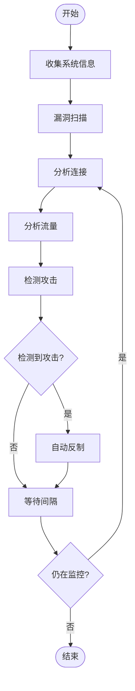

图示来源
- [defense/defense_manager.py](file://defense/defense_manager.py#L63-L104)

章节来源
- [defense/defense_manager.py](file://defense/defense_manager.py#L17-L160)

### 信息收集器（InfoCollector）
- 功能：系统信息（主机名、平台、CPU/内存/磁盘）、网络接口与连接、进程列表、开放端口、用户信息。
- 特点：逐项捕获异常，避免单点失败影响整体；对用户信息提供回退方案（兼容不同平台）。

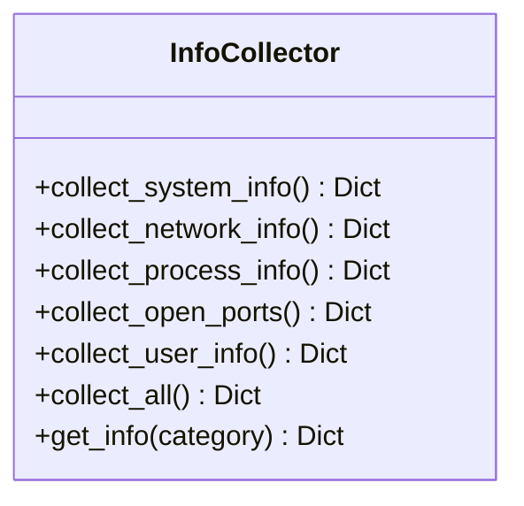

图示来源
- [defense/info_collector.py](file://defense/info_collector.py#L23-L250)

章节来源
- [defense/info_collector.py](file://defense/info_collector.py#L23-L250)

### 自检扫描器（SelfVulnerabilityScanner）
- 功能：系统漏洞（更新、服务、权限）、网络漏洞（开放端口、防火墙、SSH）、应用漏洞（简化实现）。
- 扫描策略：跨平台命令调用与系统接口探测，结果按严重度归档。

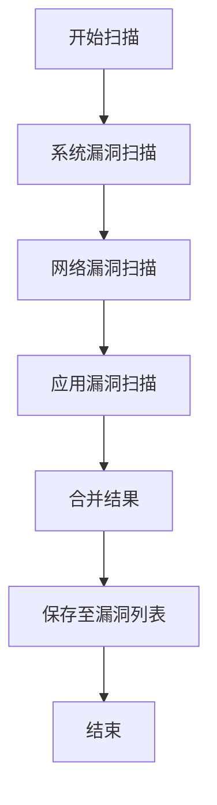

图示来源
- [defense/vulnerability_scanner.py](file://defense/vulnerability_scanner.py#L18-L93)
- [defense/vulnerability_scanner.py](file://defense/vulnerability_scanner.py#L296-L313)

章节来源
- [defense/vulnerability_scanner.py](file://defense/vulnerability_scanner.py#L12-L314)

### 网络分析器（NetworkAnalyzer）
- 功能：统计连接总数、按状态/远端IP/端口聚合；识别可疑连接（大量连接、可疑端口、疑似恶意IP）；分析异常流量（高带宽、错误包）。
- 输出：连接摘要与流量摘要，便于快速定位异常。

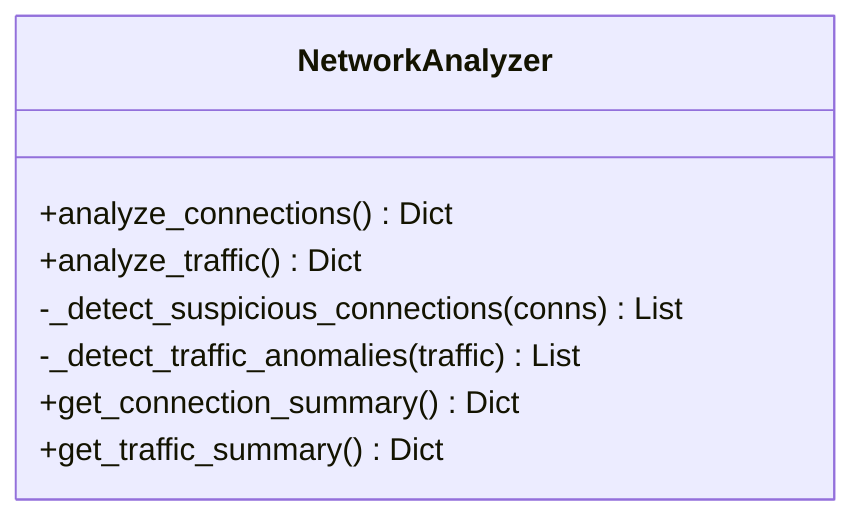

图示来源
- [defense/network_analyzer.py](file://defense/network_analyzer.py#L12-L226)

章节来源
- [defense/network_analyzer.py](file://defense/network_analyzer.py#L12-L226)

### 入侵检测器（IntrusionDetector）
- 规则引擎：基于正则表达式匹配常见攻击特征（端口扫描、暴力破解、SQL注入、XSS、DoS、恶意软件）。
- 统计检测：端口扫描（多端口短时间访问）、暴力破解（同一IP对同一用户多次失败登录）、DoS（单位时间请求数）。
- 信誉管理：维护IP信誉（攻击次数、类型、严重度、首次/末次出现时间）。
- 统计输出：总攻击数、恶意IP数、攻击类型分布、Top攻击者。

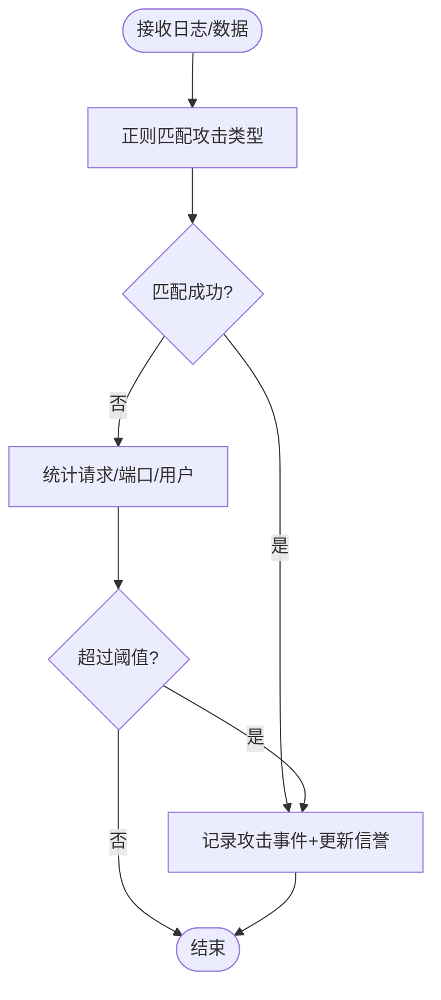

图示来源
- [defense/intrusion_detector.py](file://defense/intrusion_detector.py#L56-L82)
- [defense/intrusion_detector.py](file://defense/intrusion_detector.py#L84-L159)
- [defense/intrusion_detector.py](file://defense/intrusion_detector.py#L161-L222)

章节来源
- [defense/intrusion_detector.py](file://defense/intrusion_detector.py#L11-L235)

### 报告生成器（ReportGenerator）
- 能力：生成完整安全报告（摘要、系统信息、漏洞统计、网络分析、攻击统计、推荐）、漏洞专项报告、攻击专项报告。
- 输出：JSON/TXT两种格式，支持风险等级计算与建议生成。

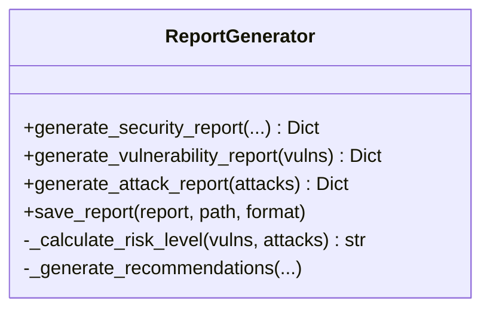

图示来源
- [defense/report_generator.py](file://defense/report_generator.py#L11-L290)

章节来源
- [defense/report_generator.py](file://defense/report_generator.py#L11-L290)

### 自动反制器（Countermeasure）
- 能力：封禁IP、解封IP、速率限制、关闭连接、告警通知。
- 策略：依据攻击类型与严重度选择动作组合，记录反制历史。

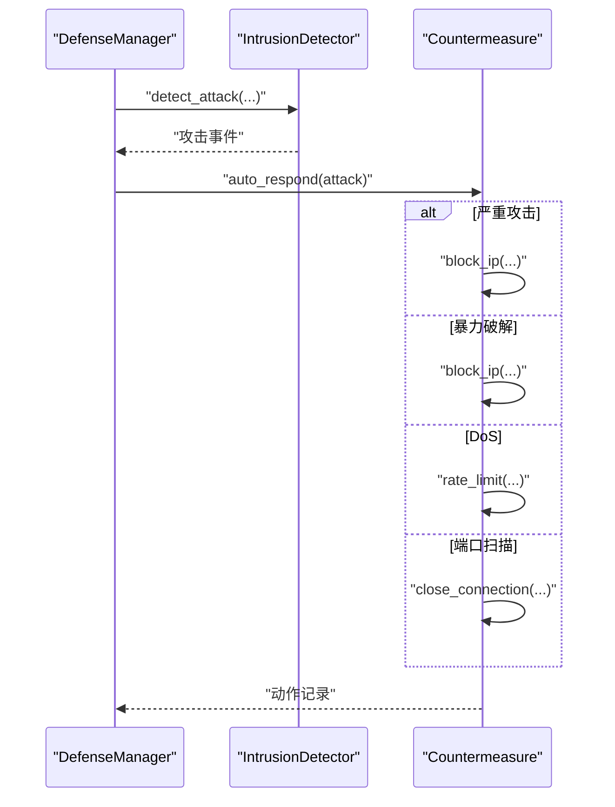

图示来源
- [defense/defense_manager.py](file://defense/defense_manager.py#L106-L124)
- [defense/countermeasure.py](file://defense/countermeasure.py#L185-L223)

章节来源
- [defense/countermeasure.py](file://defense/countermeasure.py#L11-L235)

### 防御扫描工具（工具层）
- 自检扫描工具：按类型（系统/网络/应用/全部）执行扫描，返回按严重度分组的结果。
- 网络分析工具：分析连接与流量，提供降级路径（命令行工具）。
- 系统信息工具：按类别收集系统/网络/进程/用户信息，容忍部分采集失败。
- 入侵检测工具：支持实时检测与近期攻击统计。

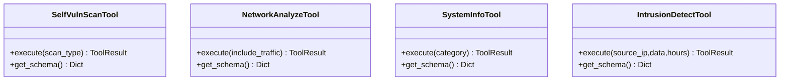

图示来源
- [tools/defense/self_vuln_scan_tool.py](file://tools/defense/self_vuln_scan_tool.py#L6-L64)
- [tools/defense/network_analyze_tool.py](file://tools/defense/network_analyze_tool.py#L6-L85)
- [tools/defense/system_info_tool.py](file://tools/defense/system_info_tool.py#L6-L67)
- [tools/defense/intrusion_detect_tool.py](file://tools/defense/intrusion_detect_tool.py#L6-L65)

章节来源
- [tools/defense/self_vuln_scan_tool.py](file://tools/defense/self_vuln_scan_tool.py#L6-L64)
- [tools/defense/network_analyze_tool.py](file://tools/defense/network_analyze_tool.py#L6-L85)
- [tools/defense/system_info_tool.py](file://tools/defense/system_info_tool.py#L6-L67)
- [tools/defense/intrusion_detect_tool.py](file://tools/defense/intrusion_detect_tool.py#L6-L65)

### 内存管理系统（知识存储与历史分析）
- 三层记忆：
  - 短期记忆：会话内上下文缓冲，限制轮数。
  - 情节记忆：跨会话事件与经验持久化。
  - 长期记忆：持久化知识库，支持按类别与重要度管理。
- 向量存储：SQLite向量索引（sqlite-vec），支持相似度检索，用于威胁情报与历史案例检索。
- 应用：将攻击事件、漏洞修复经验、策略调整纳入记忆，提升后续决策质量。

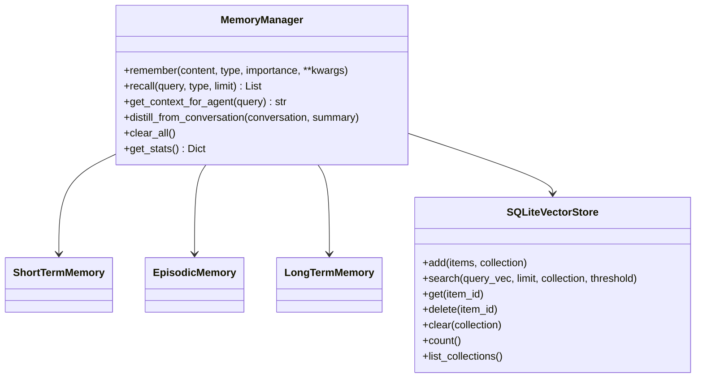

图示来源
- [core/memory/manager.py](file://core/memory/manager.py#L223-L325)
- [core/memory/vector_store.py](file://core/memory/vector_store.py#L30-L297)

章节来源
- [core/memory/manager.py](file://core/memory/manager.py#L16-L325)
- [core/memory/vector_store.py](file://core/memory/vector_store.py#L15-L297)

## 依赖关系分析
- 模块内聚：各防御模块职责清晰，耦合度低，便于独立演进与替换。
- 外部依赖：依赖psutil进行系统/网络信息采集；依赖subprocess执行平台命令；依赖sqlite进行向量与记忆持久化。
- 接口契约：路由层通过依赖注入获取DefenseManager实例，保证业务逻辑与接口解耦。
- 循环依赖：未发现直接循环依赖，整体呈星型依赖结构。

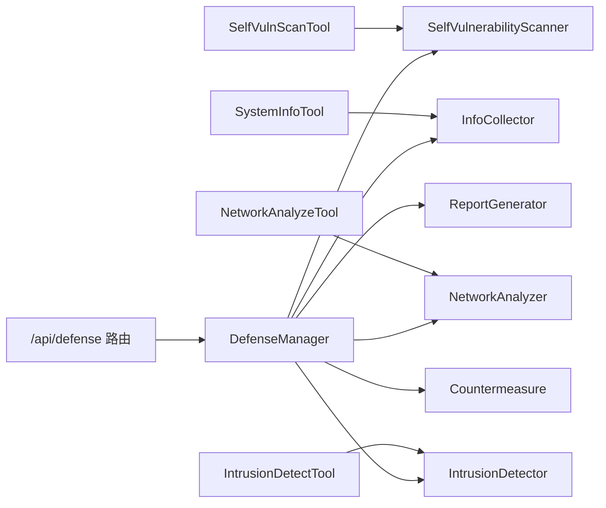

图示来源
- [router/defense.py](file://router/defense.py#L1-L96)
- [defense/defense_manager.py](file://defense/defense_manager.py#L1-L33)

章节来源
- [router/defense.py](file://router/defense.py#L1-L96)
- [defense/defense_manager.py](file://defense/defense_manager.py#L1-L33)

## 性能与扩展性
- 异步监控：监控循环使用异步任务，避免阻塞；建议合理设置检查间隔，平衡实时性与资源消耗。
- 采集降级：网络分析工具对受限平台提供命令行备选方案，降低权限门槛带来的失败率。
- 向量检索：sqlite-vec可用时启用ANN索引；不可用时采用余弦相似度遍历，建议在大规模数据场景引入专用向量数据库。
- 扫描粒度：自检扫描按类型拆分，支持按需执行，减少开销。

[本节为通用建议，不直接分析具体文件]

## 故障排查指南
- 无法获取网络连接统计（macOS/Linux）：工具层已内置命令行备选方案；若仍失败，检查系统权限与命令可用性。
- 封禁/解封失败：确认平台命令（Windows netsh、Linux iptables）可用与权限充足；查看反制历史定位失败原因。
- 报告生成异常：检查报告生成器输入参数（系统信息、漏洞、网络分析、攻击列表）完整性。
- 记忆/向量持久化失败：检查数据目录权限与磁盘空间；关注日志中的加载/保存异常提示。

章节来源
- [tools/defense/network_analyze_tool.py](file://tools/defense/network_analyze_tool.py#L27-L52)
- [defense/countermeasure.py](file://defense/countermeasure.py#L63-L96)
- [defense/report_generator.py](file://defense/report_generator.py#L95-L108)
- [core/memory/manager.py](file://core/memory/manager.py#L94-L119)
- [core/memory/vector_store.py](file://core/memory/vector_store.py#L45-L78)

## 结论
Secbot的防御体系以“信息收集—漏洞扫描—网络分析—入侵检测—自动反制—报告生成—记忆沉淀”为主线，既覆盖了主动防御的关键环节，又通过工具与接口层实现了良好的可扩展性与可运维性。结合三层记忆与向量检索，系统具备持续学习与优化的能力，有助于构建可持续演进的安全监控体系。

[本节为总结性内容，不直接分析具体文件]

## 附录

### 防御策略配置指南
- 自动响应开关：通过管理器构造参数控制是否自动反制，建议在演练阶段关闭，生产环境谨慎开启。
- 监控间隔：根据网络规模与资源情况设置，建议不低于10秒，避免频繁IO与系统抖动。
- 威胁情报集成：网络分析器与入侵检测器预留了威胁情报查询入口，建议接入外部情报源以提升可疑IP识别准确率。
- 报告与告警：定期生成报告并留存；反制器支持告警通知，建议对接企业通知渠道。

章节来源
- [defense/defense_manager.py](file://defense/defense_manager.py#L20-L32)
- [defense/countermeasure.py](file://defense/countermeasure.py#L166-L183)

### 实际应用场景
- 本机安全巡检：使用自检扫描工具与系统信息工具，生成漏洞与系统状态报告，按建议修复。
- 实时监控与反制：启动实时监控，对可疑连接与攻击行为自动封禁或速率限制，降低业务影响。
- 攻击溯源与复盘：利用入侵检测器统计与Top攻击者列表，结合记忆系统沉淀经验，完善策略。

章节来源
- [tools/defense/self_vuln_scan_tool.py](file://tools/defense/self_vuln_scan_tool.py#L17-L49)
- [tools/defense/system_info_tool.py](file://tools/defense/system_info_tool.py#L17-L50)
- [router/defense.py](file://router/defense.py#L63-L74)
- [defense/intrusion_detector.py](file://defense/intrusion_detector.py#L142-L159)
- [core/memory/manager.py](file://core/memory/manager.py#L299-L316)