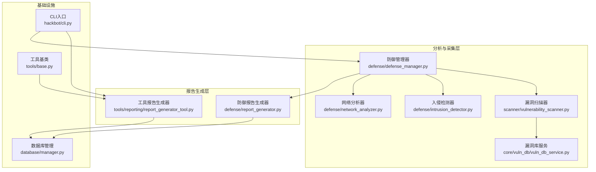
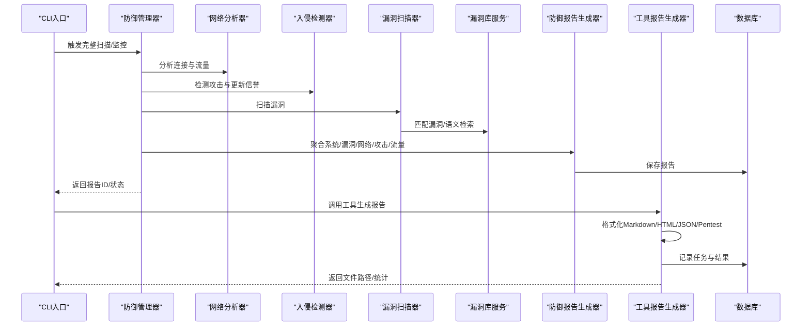
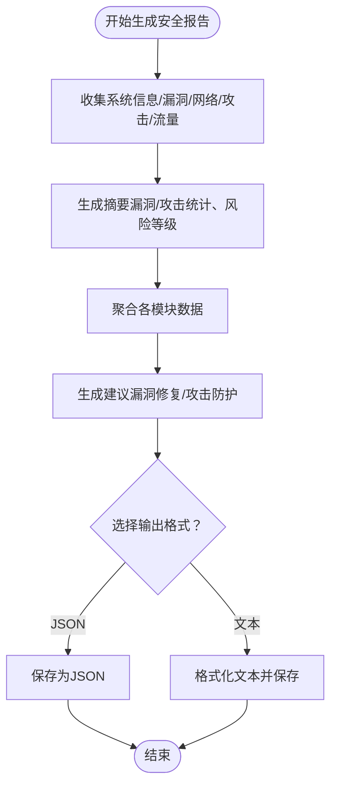
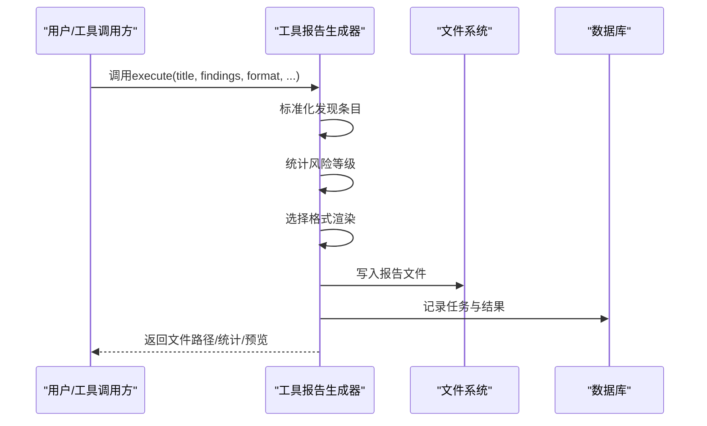
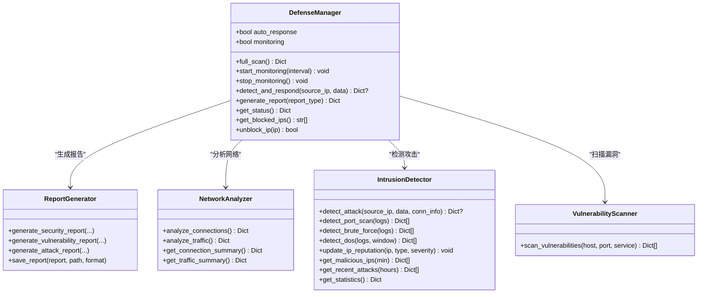
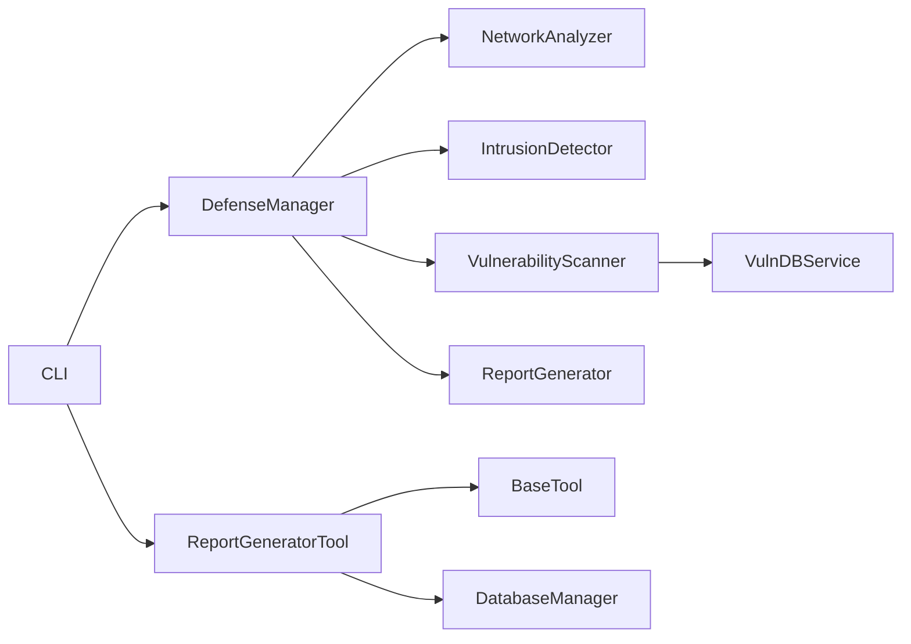

# 报告生成与分析

<cite>
**本文引用的文件**
- [defense/report_generator.py](file://defense/report_generator.py)
- [tools/reporting/report_generator_tool.py](file://tools/reporting/report_generator_tool.py)
- [tools/reporting/README.md](file://tools/reporting/README.md)
- [defense/defense_manager.py](file://defense/defense_manager.py)
- [defense/network_analyzer.py](file://defense/network_analyzer.py)
- [defense/intrusion_detector.py](file://defense/intrusion_detector.py)
- [scanner/vulnerability_scanner.py](file://scanner/vulnerability_scanner.py)
- [core/vuln_db/vuln_db_service.py](file://core/vuln_db/vuln_db_service.py)
- [reports/安全测试报告_20260305_094414.md](file://reports/安全测试报告_20260305_094414.md)
- [reports/渗透测试报告_20260306_201927.md](file://reports/渗透测试报告_20260306_201927.md)
- [tools/base.py](file://tools/base.py)
- [database/manager.py](file://database/manager.py)
- [hackbot/cli.py](file://hackbot/cli.py)
</cite>

## 目录
1. [简介](#简介)
2. [项目结构](#项目结构)
3. [核心组件](#核心组件)
4. [架构总览](#架构总览)
5. [详细组件分析](#详细组件分析)
6. [依赖分析](#依赖分析)
7. [性能考量](#性能考量)
8. [故障排查指南](#故障排查指南)
9. [结论](#结论)
10. [附录](#附录)

## 简介
本章节面向Secbot的报告生成与分析系统，系统性阐述自动化报告生成流程、数据分析与可视化、趋势分析与合规性检查能力，并提供报告工具的使用方法、模板配置、自定义字段设置与定期报告生成实践。同时给出不同类型报告的解读指南与改进建议，帮助用户基于数据洞察优化安全策略。

## 项目结构
围绕“报告生成与分析”的关键模块与文件如下：
- 防御侧报告生成：defense/report_generator.py
- 工具侧报告生成：tools/reporting/report_generator_tool.py
- 防御管理器：defense/defense_manager.py
- 网络分析：defense/network_analyzer.py
- 入侵检测：defense/intrusion_detector.py
- 漏洞扫描：scanner/vulnerability_scanner.py
- 漏洞库服务：core/vuln_db/vuln_db_service.py
- 示例报告：reports/*.md
- 工具基类：tools/base.py
- 数据库存储：database/manager.py
- CLI入口：hackbot/cli.py

图示来源
- [defense/report_generator.py](file://defense/report_generator.py#L11-L290)
- [tools/reporting/report_generator_tool.py](file://tools/reporting/report_generator_tool.py#L1-L407)
- [defense/defense_manager.py](file://defense/defense_manager.py#L17-L160)
- [defense/network_analyzer.py](file://defense/network_analyzer.py#L12-L226)
- [defense/intrusion_detector.py](file://defense/intrusion_detector.py#L11-L235)
- [scanner/vulnerability_scanner.py](file://scanner/vulnerability_scanner.py#L254-L289)
- [core/vuln_db/vuln_db_service.py](file://core/vuln_db/vuln_db_service.py#L27-L275)
- [database/manager.py](file://database/manager.py#L114-L148)
- [hackbot/cli.py](file://hackbot/cli.py#L32-L80)
- [tools/base.py](file://tools/base.py#L16-L36)

章节来源
- [defense/report_generator.py](file://defense/report_generator.py#L11-L290)
- [tools/reporting/report_generator_tool.py](file://tools/reporting/report_generator_tool.py#L1-L407)
- [defense/defense_manager.py](file://defense/defense_manager.py#L17-L160)
- [defense/network_analyzer.py](file://defense/network_analyzer.py#L12-L226)
- [defense/intrusion_detector.py](file://defense/intrusion_detector.py#L11-L235)
- [scanner/vulnerability_scanner.py](file://scanner/vulnerability_scanner.py#L254-L289)
- [core/vuln_db/vuln_db_service.py](file://core/vuln_db/vuln_db_service.py#L27-L275)
- [database/manager.py](file://database/manager.py#L114-L148)
- [hackbot/cli.py](file://hackbot/cli.py#L32-L80)
- [tools/base.py](file://tools/base.py#L16-L36)

## 核心组件
- 防御报告生成器：负责聚合系统信息、漏洞、网络分析、攻击检测与流量统计，生成结构化报告并支持JSON/文本导出。
- 工具报告生成器：面向工具链的报告生成，支持Markdown/HTML/JSON/Pentest四种格式，内置攻击链与利用结果渲染。
- 防御管理器：统一编排信息采集、漏洞扫描、网络分析、入侵检测与报告生成，支持实时监控与自动响应。
- 网络分析器：采集连接状态、监听端口、可疑连接与异常流量，提供连接与流量摘要。
- 入侵检测器：基于正则与阈值检测端口扫描、暴力破解、SQL注入、XSS、DoS与恶意软件等攻击类型。
- 漏洞扫描器：针对HTTP/SSH/FTP等服务进行敏感路径暴露、安全头缺失、目录列表、匿名登录等检测。
- 漏洞库服务：多源适配器+向量检索，提供CVE匹配、自然语言语义检索与多源同步。
- 数据库存储：提供扫描结果、审计轨迹、爬虫任务等表结构，支撑报告持久化与历史追踪。
- CLI入口：提供后端与TUI启动方式，便于一键启动与集成。

章节来源
- [defense/report_generator.py](file://defense/report_generator.py#L11-L290)
- [tools/reporting/report_generator_tool.py](file://tools/reporting/report_generator_tool.py#L11-L407)
- [defense/defense_manager.py](file://defense/defense_manager.py#L17-L160)
- [defense/network_analyzer.py](file://defense/network_analyzer.py#L12-L226)
- [defense/intrusion_detector.py](file://defense/intrusion_detector.py#L11-L235)
- [scanner/vulnerability_scanner.py](file://scanner/vulnerability_scanner.py#L254-L289)
- [core/vuln_db/vuln_db_service.py](file://core/vuln_db/vuln_db_service.py#L27-L275)
- [database/manager.py](file://database/manager.py#L114-L148)
- [hackbot/cli.py](file://hackbot/cli.py#L32-L80)

## 架构总览
下图展示从数据采集到报告生成与导出的端到端流程，涵盖防御管理器编排、分析模块、工具链与存储层。

图示来源
- [defense/defense_manager.py](file://defense/defense_manager.py#L34-L105)
- [defense/network_analyzer.py](file://defense/network_analyzer.py#L20-L100)
- [defense/intrusion_detector.py](file://defense/intrusion_detector.py#L56-L235)
- [scanner/vulnerability_scanner.py](file://scanner/vulnerability_scanner.py#L257-L289)
- [core/vuln_db/vuln_db_service.py](file://core/vuln_db/vuln_db_service.py#L90-L184)
- [defense/report_generator.py](file://defense/report_generator.py#L17-L108)
- [tools/reporting/report_generator_tool.py](file://tools/reporting/report_generator_tool.py#L35-L107)
- [database/manager.py](file://database/manager.py#L114-L148)

## 详细组件分析

### 防御报告生成器（defense/report_generator.py）
- 职责：生成综合安全报告，包含摘要、系统信息、漏洞统计、网络分析、攻击检测、流量统计与建议。
- 数据聚合：按严重程度与类型统计，计算风险等级，生成顶层建议。
- 输出：支持JSON与文本格式保存，文本格式提供清晰的摘要、漏洞与攻击统计、建议清单。
- 关键算法：按严重程度与类型计数、Top攻击者统计、风险等级计算（综合漏洞与攻击数量与严重度）。

图示来源
- [defense/report_generator.py](file://defense/report_generator.py#L17-L108)
- [defense/report_generator.py](file://defense/report_generator.py#L110-L182)
- [defense/report_generator.py](file://defense/report_generator.py#L183-L244)
- [defense/report_generator.py](file://defense/report_generator.py#L246-L288)

章节来源
- [defense/report_generator.py](file://defense/report_generator.py#L11-L290)

### 工具报告生成器（tools/reporting/report_generator_tool.py）
- 职责：将扫描发现标准化为结构化报告，支持多种格式（Markdown/HTML/JSON/Pentest）。
- 输入：标题、目标、发现列表（含风险/描述/建议）、可选攻击链与利用结果。
- 输出：报告文件路径、统计信息、内容预览。
- 特性：发现条目标准化、按风险排序、Pentest格式包含攻击链与利用结果渲染、HTML颜色分级。

图示来源
- [tools/reporting/report_generator_tool.py](file://tools/reporting/report_generator_tool.py#L35-L107)
- [tools/reporting/report_generator_tool.py](file://tools/reporting/report_generator_tool.py#L129-L174)
- [tools/reporting/report_generator_tool.py](file://tools/reporting/report_generator_tool.py#L176-L223)
- [tools/reporting/report_generator_tool.py](file://tools/reporting/report_generator_tool.py#L229-L383)
- [tools/base.py](file://tools/base.py#L9-L35)

章节来源
- [tools/reporting/report_generator_tool.py](file://tools/reporting/report_generator_tool.py#L11-L407)
- [tools/reporting/README.md](file://tools/reporting/README.md#L1-L29)
- [tools/base.py](file://tools/base.py#L16-L36)

### 防御管理器（defense/defense_manager.py）
- 职责：统一编排信息采集、漏洞扫描、网络分析、入侵检测与报告生成；支持实时监控与自动响应。
- 全量扫描：收集系统信息、漏洞、网络与攻击，生成综合报告。
- 实时监控：周期性分析连接与流量，检测可疑连接并触发入侵检测与自动反制。
- 报告生成：支持漏洞报告与攻击报告的独立生成。

图示来源
- [defense/defense_manager.py](file://defense/defense_manager.py#L17-L160)
- [defense/report_generator.py](file://defense/report_generator.py#L11-L94)
- [defense/network_analyzer.py](file://defense/network_analyzer.py#L12-L226)
- [defense/intrusion_detector.py](file://defense/intrusion_detector.py#L11-L235)
- [scanner/vulnerability_scanner.py](file://scanner/vulnerability_scanner.py#L254-L289)

章节来源
- [defense/defense_manager.py](file://defense/defense_manager.py#L17-L160)

### 网络分析器（defense/network_analyzer.py）
- 职责：采集连接状态、监听端口、远程IP分布、端口分布；检测可疑连接与异常流量。
- 可疑连接：大量连接到同一IP、连接到可疑端口、异常外部连接。
- 异常流量：高流量、网络错误过多。
- 摘要：提供连接总数、已建立/监听连接数、可疑连接数与Top远程IP。

章节来源
- [defense/network_analyzer.py](file://defense/network_analyzer.py#L12-L226)

### 入侵检测器（defense/intrusion_detector.py）
- 职责：基于正则与阈值检测多种攻击类型，维护IP信誉与攻击统计。
- 攻击类型：端口扫描、暴力破解、SQL注入、XSS、DoS、恶意软件。
- 统计：攻击总数、恶意IP数、各类攻击计数、Top攻击者。
- 信誉：按攻击次数、类型集合与最高严重度更新IP信誉。

章节来源
- [defense/intrusion_detector.py](file://defense/intrusion_detector.py#L11-L235)

### 漏洞扫描器（scanner/vulnerability_scanner.py）
- 职责：针对HTTP/SSH/FTP服务进行敏感路径暴露、安全头缺失、目录列表、匿名登录等检测。
- 方法：HTTP敏感路径探测、安全头检查、目录列表特征识别、SSH版本识别、FTP匿名登录探测。
- 结果：标准化漏洞条目（类型、严重度、描述、建议）。

章节来源
- [scanner/vulnerability_scanner.py](file://scanner/vulnerability_scanner.py#L254-L289)

### 漏洞库服务（core/vuln_db/vuln_db_service.py）
- 职责：多源适配器（CVE/NVD/ExploitDB/Mitre）+向量检索，提供CVE精确查询、扫描结果匹配、自然语言语义检索与多源同步。
- 能力：向量化嵌入、相似度检索、在线关键词补充、统计与生命周期管理。

章节来源
- [core/vuln_db/vuln_db_service.py](file://core/vuln_db/vuln_db_service.py#L27-L275)

### 示例报告（reports/*.md）
- 安全测试报告：包含概要统计（严重/高危/中危/低危/信息）、详细发现与建议。
- 渗透测试报告：包含概要统计、漏洞详情、攻击链分析、利用结果、风险评估与修复建议汇总。

章节来源
- [reports/安全测试报告_20260305_094414.md](file://reports/安全测试报告_20260305_094414.md#L1-L18)
- [reports/渗透测试报告_20260306_201927.md](file://reports/渗透测试报告_20260306_201927.md#L1-L40)

## 依赖分析
- 组件耦合：防御管理器作为编排中心，依赖网络分析器、入侵检测器、漏洞扫描器与报告生成器；漏洞扫描器进一步依赖漏洞库服务。
- 工具链：工具报告生成器继承工具基类，提供统一的执行接口与Schema定义。
- 存储：数据库管理器提供扫描结果、审计轨迹与爬虫任务表，支持报告与任务持久化。
- 入口：CLI提供后端与TUI启动选项，便于快速集成与部署。

图示来源
- [defense/defense_manager.py](file://defense/defense_manager.py#L17-L160)
- [scanner/vulnerability_scanner.py](file://scanner/vulnerability_scanner.py#L254-L289)
- [core/vuln_db/vuln_db_service.py](file://core/vuln_db/vuln_db_service.py#L27-L275)
- [tools/reporting/report_generator_tool.py](file://tools/reporting/report_generator_tool.py#L11-L407)
- [tools/base.py](file://tools/base.py#L16-L36)
- [database/manager.py](file://database/manager.py#L114-L148)
- [hackbot/cli.py](file://hackbot/cli.py#L32-L80)

章节来源
- [defense/defense_manager.py](file://defense/defense_manager.py#L17-L160)
- [tools/reporting/report_generator_tool.py](file://tools/reporting/report_generator_tool.py#L11-L407)
- [tools/base.py](file://tools/base.py#L16-L36)
- [database/manager.py](file://database/manager.py#L114-L148)
- [hackbot/cli.py](file://hackbot/cli.py#L32-L80)

## 性能考量
- 并发与异步：网络分析与流量统计、漏洞扫描采用异步I/O与事件循环，降低阻塞；防御管理器监控循环按间隔休眠，避免CPU占用过高。
- 检测阈值：可疑连接与异常流量阈值可按环境调整，避免误报与漏报。
- 向量检索：漏洞库服务在向量库为空时回退纯关键词匹配，保证可用性；建议定期同步多源数据以提升召回率。
- I/O与存储：报告生成与保存在磁盘上进行，建议定期清理旧报告与数据库冗余数据，控制IO压力。

## 故障排查指南
- 报告生成失败
  - 检查输入参数：标题、发现列表、格式是否正确。
  - 查看工具执行结果与错误信息，确认文件写入权限与路径。
- 漏洞匹配不准确
  - 确认漏洞库服务是否已同步多源数据；尝试自然语言检索或CVE ID直查。
- 网络分析异常
  - 检查psutil权限与系统支持情况；确认可疑端口与阈值设置合理。
- 入侵检测误报
  - 调整正则模式与阈值；结合IP信誉与近期攻击统计进行人工复核。
- 数据持久化问题
  - 检查数据库表结构与索引；确认写入与查询逻辑一致。

章节来源
- [tools/reporting/report_generator_tool.py](file://tools/reporting/report_generator_tool.py#L35-L107)
- [core/vuln_db/vuln_db_service.py](file://core/vuln_db/vuln_db_service.py#L190-L222)
- [defense/network_analyzer.py](file://defense/network_analyzer.py#L101-L175)
- [defense/intrusion_detector.py](file://defense/intrusion_detector.py#L56-L235)
- [database/manager.py](file://database/manager.py#L114-L148)

## 结论
Secbot的报告生成与分析系统通过防御管理器统一编排，结合网络分析、入侵检测、漏洞扫描与工具报告生成器，形成从数据采集到报告输出的闭环。系统支持多种报告格式与定制化字段，具备实时监控与自动响应能力，适合日常安全巡检与渗透测试场景。建议结合历史数据与趋势分析持续优化阈值与策略，提升检测准确性与响应效率。

## 附录

### 报告工具使用方法
- 工具名称：report_generator
- 主要参数：title（报告标题）、findings（发现列表，含title/risk/description/recommendation）、format（输出格式：markdown/html/json/pentest）、target（测试目标，可选）、attack_chain（攻击链结果，可选）、exploit_results（漏洞利用结果，可选）
- 使用示例：用户请求生成Markdown格式的渗透测试报告，传入标题、发现列表、攻击链与利用结果，工具返回文件路径、统计与内容预览。

章节来源
- [tools/reporting/report_generator_tool.py](file://tools/reporting/report_generator_tool.py#L24-L107)
- [tools/reporting/README.md](file://tools/reporting/README.md#L18-L23)

### 报告模板配置与自定义字段
- 模板类型：Markdown/HTML/JSON/Pentest
- 自定义字段：标题、目标、发现条目（title/risk/description/recommendation）、攻击链步骤与回退记录、利用结果（目标、成功与否、耗时等）
- 建议：在findings中明确risk等级（critical/high/medium/low/info），便于自动统计与排序。

章节来源
- [tools/reporting/report_generator_tool.py](file://tools/reporting/report_generator_tool.py#L129-L174)
- [tools/reporting/report_generator_tool.py](file://tools/reporting/report_generator_tool.py#L176-L223)
- [tools/reporting/report_generator_tool.py](file://tools/reporting/report_generator_tool.py#L229-L383)

### 定期报告生成与解读
- 定期生成：通过CLI或后端API触发全量扫描，防御管理器自动聚合数据并生成报告；也可使用工具报告生成器按需生成。
- 解读要点：
  - 概要统计：关注高危与严重漏洞数量变化趋势。
  - 漏洞详情：按风险排序，优先修复高危与严重漏洞。
  - 攻击链：若为渗透测试报告，关注攻击路径与权限提升过程。
  - 建议汇总：结合业务场景制定修复计划与加固策略。
- 改进建议：
  - 建立修复跟踪机制，闭环验证修复效果。
  - 结合趋势分析（周/月）识别薄弱环节，调整安全策略与资源投入。

章节来源
- [defense/defense_manager.py](file://defense/defense_manager.py#L34-L61)
- [tools/reporting/report_generator_tool.py](file://tools/reporting/report_generator_tool.py#L229-L383)
- [reports/安全测试报告_20260305_094414.md](file://reports/安全测试报告_20260305_094414.md#L1-L18)
- [reports/渗透测试报告_20260306_201927.md](file://reports/渗透测试报告_20260306_201927.md#L1-L40)