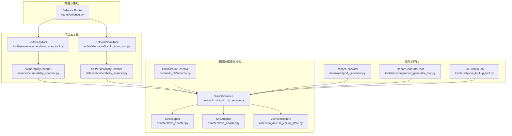
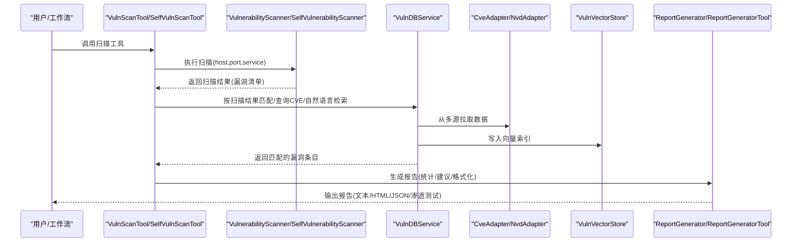
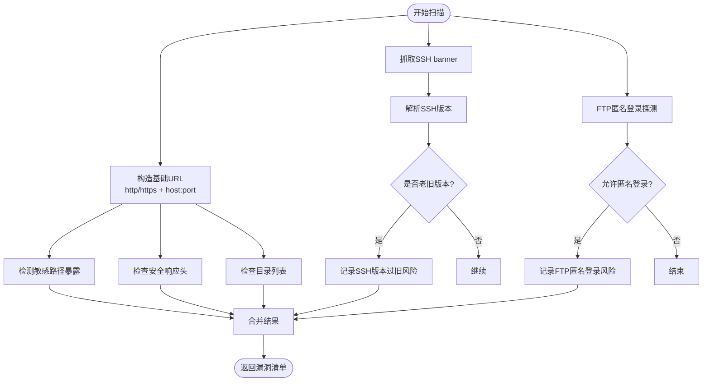
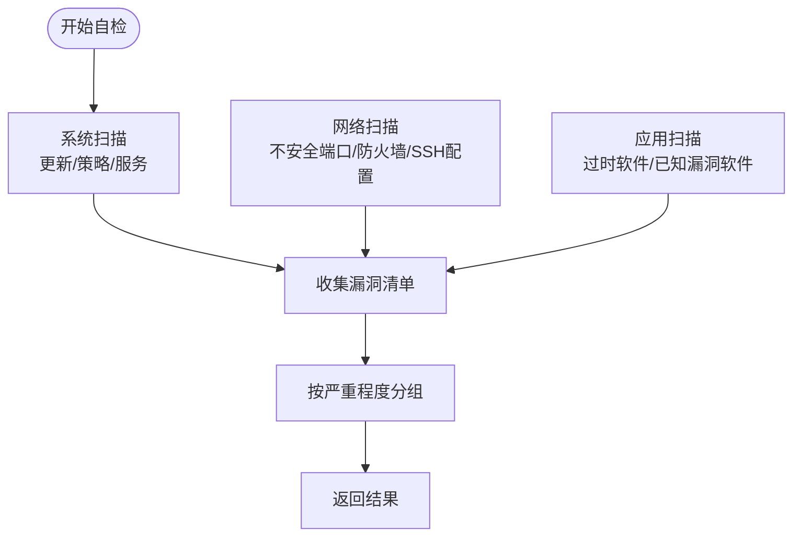
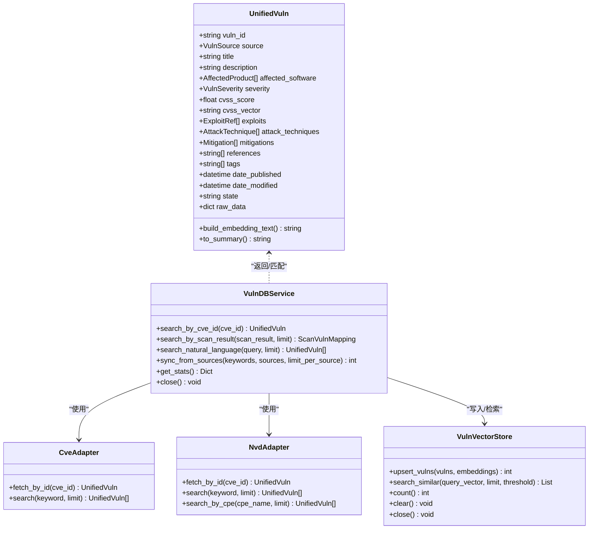
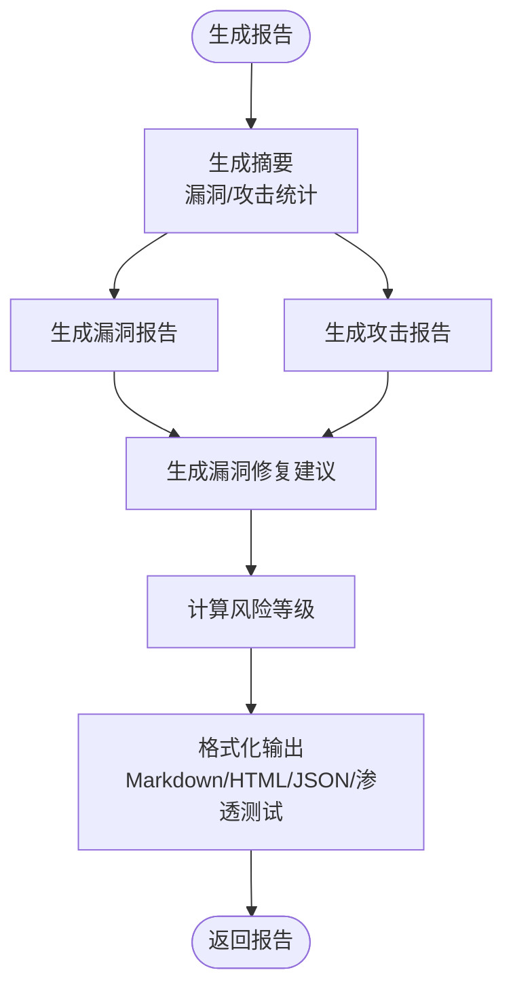
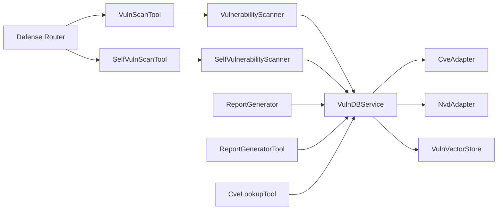

# 漏洞扫描与评估

<cite>
**本文引用的文件**
- [scanner/vulnerability_scanner.py](file://scanner/vulnerability_scanner.py)
- [defense/vulnerability_scanner.py](file://defense/vulnerability_scanner.py)
- [tools/pentest/security/vuln_scan_tool.py](file://tools/pentest/security/vuln_scan_tool.py)
- [tools/defense/self_vuln_scan_tool.py](file://tools/defense/self_vuln_scan_tool.py)
- [core/vuln_db/vuln_db_service.py](file://core/vuln_db/vuln_db_service.py)
- [core/vuln_db/schema.py](file://core/vuln_db/schema.py)
- [core/vuln_db/adapters/cve_adapter.py](file://core/vuln_db/adapters/cve_adapter.py)
- [core/vuln_db/adapters/nvd_adapter.py](file://core/vuln_db/adapters/nvd_adapter.py)
- [core/vuln_db/vuln_vector_store.py](file://core/vuln_db/vuln_vector_store.py)
- [tools/utility/cve_lookup_tool.py](file://tools/utility/cve_lookup_tool.py)
- [router/defense.py](file://router/defense.py)
- [defense/report_generator.py](file://defense/report_generator.py)
- [tools/reporting/report_generator_tool.py](file://tools/reporting/report_generator_tool.py)
</cite>

## 目录
1. [简介](#简介)
2. [项目结构](#项目结构)
3. [核心组件](#核心组件)
4. [架构总览](#架构总览)
5. [详细组件分析](#详细组件分析)
6. [依赖关系分析](#依赖关系分析)
7. [性能考量](#性能考量)
8. [故障排查指南](#故障排查指南)
9. [结论](#结论)
10. [附录](#附录)

## 简介
本文件面向Secbot的漏洞扫描与评估系统，系统性阐述漏洞检测算法、风险评估模型与修复建议生成机制，覆盖对外目标扫描与本机自检两类场景，并提供扫描策略配置、结果分析与修复跟踪的最佳实践，帮助用户高效管理与降低系统安全风险。

## 项目结构
围绕“漏洞扫描与评估”的主要代码分布在以下模块：
- 扫描器与工具
  - 外部目标扫描：scanner/vulnerability_scanner.py + tools/pentest/security/vuln_scan_tool.py
  - 本机自检扫描：defense/vulnerability_scanner.py + tools/defense/self_vuln_scan_tool.py
- 漏洞数据库与检索
  - 统一服务：core/vuln_db/vuln_db_service.py
  - 数据模型：core/vuln_db/schema.py
  - 适配器：core/vuln_db/adapters/cve_adapter.py、core/vuln_db/adapters/nvd_adapter.py
  - 向量存储：core/vuln_db/vuln_vector_store.py
- 报告与评估
  - 防御报告：defense/report_generator.py
  - 结构化报告工具：tools/reporting/report_generator_tool.py
  - CVE查询工具：tools/utility/cve_lookup_tool.py
- 路由与集成
  - 防御路由：router/defense.py

图表来源
- [scanner/vulnerability_scanner.py](file://scanner/vulnerability_scanner.py#L254-L289)
- [defense/vulnerability_scanner.py](file://defense/vulnerability_scanner.py#L12-L314)
- [tools/pentest/security/vuln_scan_tool.py](file://tools/pentest/security/vuln_scan_tool.py#L6-L55)
- [tools/defense/self_vuln_scan_tool.py](file://tools/defense/self_vuln_scan_tool.py#L6-L64)
- [core/vuln_db/vuln_db_service.py](file://core/vuln_db/vuln_db_service.py#L27-L275)
- [core/vuln_db/schema.py](file://core/vuln_db/schema.py#L68-L140)
- [core/vuln_db/adapters/cve_adapter.py](file://core/vuln_db/adapters/cve_adapter.py#L36-L155)
- [core/vuln_db/adapters/nvd_adapter.py](file://core/vuln_db/adapters/nvd_adapter.py#L37-L214)
- [core/vuln_db/vuln_vector_store.py](file://core/vuln_db/vuln_vector_store.py#L18-L107)
- [defense/report_generator.py](file://defense/report_generator.py#L11-L290)
- [tools/reporting/report_generator_tool.py](file://tools/reporting/report_generator_tool.py#L11-L407)
- [tools/utility/cve_lookup_tool.py](file://tools/utility/cve_lookup_tool.py#L8-L139)
- [router/defense.py](file://router/defense.py#L19-L96)

章节来源
- [scanner/vulnerability_scanner.py](file://scanner/vulnerability_scanner.py#L1-L289)
- [defense/vulnerability_scanner.py](file://defense/vulnerability_scanner.py#L1-L314)
- [tools/pentest/security/vuln_scan_tool.py](file://tools/pentest/security/vuln_scan_tool.py#L1-L55)
- [tools/defense/self_vuln_scan_tool.py](file://tools/defense/self_vuln_scan_tool.py#L1-L64)
- [core/vuln_db/vuln_db_service.py](file://core/vuln_db/vuln_db_service.py#L1-L275)
- [core/vuln_db/schema.py](file://core/vuln_db/schema.py#L1-L140)
- [core/vuln_db/adapters/cve_adapter.py](file://core/vuln_db/adapters/cve_adapter.py#L1-L155)
- [core/vuln_db/adapters/nvd_adapter.py](file://core/vuln_db/adapters/nvd_adapter.py#L1-L214)
- [core/vuln_db/vuln_vector_store.py](file://core/vuln_db/vuln_vector_store.py#L1-L107)
- [defense/report_generator.py](file://defense/report_generator.py#L1-L290)
- [tools/reporting/report_generator_tool.py](file://tools/reporting/report_generator_tool.py#L1-L407)
- [tools/utility/cve_lookup_tool.py](file://tools/utility/cve_lookup_tool.py#L1-L139)
- [router/defense.py](file://router/defense.py#L1-L96)

## 核心组件
- 外部目标漏洞扫描器：针对HTTP/HTTPS/SSH/FTP等服务进行轻量检测，识别敏感路径暴露、安全头缺失、目录列表、SSH版本过旧、FTP匿名登录等风险。
- 本机自检扫描器：对部署主机进行系统更新、密码策略、不必要服务、文件权限、开放端口、防火墙、SSH配置等检查。
- 漏洞数据库与检索：统一多源（CVE/NVD/Exploit-DB/MITRE）数据，构建向量索引，支持按扫描结果匹配、CVE精确查询、自然语言检索与在线关键词补充。
- 报告与评估：生成综合安全报告、漏洞报告、攻击报告，提供风险等级计算与修复建议汇总；同时支持结构化报告（Markdown/HTML/JSON/渗透测试报告）生成。
- 工具与路由：提供可调用的扫描工具与REST路由，便于在工作流中编排与集成。

章节来源
- [scanner/vulnerability_scanner.py](file://scanner/vulnerability_scanner.py#L254-L289)
- [defense/vulnerability_scanner.py](file://defense/vulnerability_scanner.py#L12-L314)
- [core/vuln_db/vuln_db_service.py](file://core/vuln_db/vuln_db_service.py#L27-L275)
- [defense/report_generator.py](file://defense/report_generator.py#L11-L290)
- [tools/reporting/report_generator_tool.py](file://tools/reporting/report_generator_tool.py#L11-L407)
- [tools/pentest/security/vuln_scan_tool.py](file://tools/pentest/security/vuln_scan_tool.py#L6-L55)
- [tools/defense/self_vuln_scan_tool.py](file://tools/defense/self_vuln_scan_tool.py#L6-L64)
- [router/defense.py](file://router/defense.py#L19-L96)

## 架构总览
系统采用“扫描器/工具层 + 漏洞数据库层 + 报告与评估层”的分层设计，扫描器负责采集原始风险，数据库层负责统一建模与检索增强，报告层负责风险量化与建议生成。

图表来源
- [tools/pentest/security/vuln_scan_tool.py](file://tools/pentest/security/vuln_scan_tool.py#L17-L42)
- [tools/defense/self_vuln_scan_tool.py](file://tools/defense/self_vuln_scan_tool.py#L17-L49)
- [scanner/vulnerability_scanner.py](file://scanner/vulnerability_scanner.py#L257-L289)
- [defense/vulnerability_scanner.py](file://defense/vulnerability_scanner.py#L18-L93)
- [core/vuln_db/vuln_db_service.py](file://core/vuln_db/vuln_db_service.py#L90-L184)
- [core/vuln_db/adapters/cve_adapter.py](file://core/vuln_db/adapters/cve_adapter.py#L44-L73)
- [core/vuln_db/adapters/nvd_adapter.py](file://core/vuln_db/adapters/nvd_adapter.py#L47-L72)
- [core/vuln_db/vuln_vector_store.py](file://core/vuln_db/vuln_vector_store.py#L35-L66)
- [tools/reporting/report_generator_tool.py](file://tools/reporting/report_generator_tool.py#L35-L107)
- [defense/report_generator.py](file://defense/report_generator.py#L17-L93)

## 详细组件分析

### 外部目标漏洞扫描器（HTTP/SSH/FTP）
- 功能要点
  - HTTP/HTTPS：检测敏感路径暴露（如.env/.git/config）、安全响应头缺失（X-Content-Type-Options/X-Frame-Options/HSTS）、目录列表启用。
  - SSH：抓取banner并解析版本，判定是否为老旧版本（如OpenSSH 7.4以下）。
  - FTP：探测匿名登录是否允许。
  - 自动推断：当服务类型未知时，按端口推断（80/8080/8000/8888=http，443/8443=https，22=ssh，21=ftp）。
- 风险评估与建议
  - 每类检测均返回风险等级（High/Medium/Low）与具体建议，便于快速定位与修复。
- 使用方式
  - 通过VulnScanTool传入host/port/service参数触发扫描。

图表来源
- [scanner/vulnerability_scanner.py](file://scanner/vulnerability_scanner.py#L35-L146)
- [scanner/vulnerability_scanner.py](file://scanner/vulnerability_scanner.py#L149-L208)
- [scanner/vulnerability_scanner.py](file://scanner/vulnerability_scanner.py#L211-L251)
- [scanner/vulnerability_scanner.py](file://scanner/vulnerability_scanner.py#L257-L289)

章节来源
- [scanner/vulnerability_scanner.py](file://scanner/vulnerability_scanner.py#L1-L289)
- [tools/pentest/security/vuln_scan_tool.py](file://tools/pentest/security/vuln_scan_tool.py#L1-L55)

### 本机自检扫描器（系统/网络/应用）
- 功能要点
  - 系统：检查系统更新状态、弱密码策略（占位）、不必要的服务（telnet/ftp/rsh等）。
  - 网络：检查不安全端口（21/23/135/139/445）、防火墙状态（Windows/UFW）、SSH配置（root登录、仅密码认证等）。
  - 应用：过时软件包与已知漏洞软件版本（占位，可扩展）。
- 输出与统计
  - 按严重程度分组统计，便于优先处理。
- 使用方式
  - 通过SelfVulnScanTool选择scan_type（system/network/application/all）。

图表来源
- [defense/vulnerability_scanner.py](file://defense/vulnerability_scanner.py#L18-L93)
- [defense/vulnerability_scanner.py](file://defense/vulnerability_scanner.py#L95-L314)
- [tools/defense/self_vuln_scan_tool.py](file://tools/defense/self_vuln_scan_tool.py#L17-L49)

章节来源
- [defense/vulnerability_scanner.py](file://defense/vulnerability_scanner.py#L1-L314)
- [tools/defense/self_vuln_scan_tool.py](file://tools/defense/self_vuln_scan_tool.py#L1-L64)

### 漏洞数据库与检索（统一服务）
- 数据模型
  - 统一漏洞数据模型（UnifiedVuln）包含漏洞ID、来源、标题、描述、受影响软件、严重性、CVSS评分、攻击技术、缓解措施、引用、标签、时间戳等字段，并提供向量化文本拼接方法。
- 适配器
  - CveAdapter：对接MITRE CVE API，提取描述、CVSS、受影响产品、引用与状态。
  - NvdAdapter：对接NVD 2.0 API，支持按CVE ID、关键词、CPE检索，提取CVSS、CWE标签、Exploit标记等。
- 向量检索
  - VulnVectorStore封装SQLite向量存储，支持upsert写入与相似度检索。
- 统一服务
  - VulnDBService整合适配器与向量存储，提供：
    - 精确CVE查询
    - 扫描结果匹配（向量+关键词+在线补充）
    - 自然语言语义检索
    - 多源同步与增量入库

图表来源
- [core/vuln_db/schema.py](file://core/vuln_db/schema.py#L68-L140)
- [core/vuln_db/vuln_db_service.py](file://core/vuln_db/vuln_db_service.py#L27-L275)
- [core/vuln_db/adapters/cve_adapter.py](file://core/vuln_db/adapters/cve_adapter.py#L36-L155)
- [core/vuln_db/adapters/nvd_adapter.py](file://core/vuln_db/adapters/nvd_adapter.py#L37-L214)
- [core/vuln_db/vuln_vector_store.py](file://core/vuln_db/vuln_vector_store.py#L18-L107)

章节来源
- [core/vuln_db/schema.py](file://core/vuln_db/schema.py#L1-L140)
- [core/vuln_db/vuln_db_service.py](file://core/vuln_db/vuln_db_service.py#L1-L275)
- [core/vuln_db/adapters/cve_adapter.py](file://core/vuln_db/adapters/cve_adapter.py#L1-L155)
- [core/vuln_db/adapters/nvd_adapter.py](file://core/vuln_db/adapters/nvd_adapter.py#L1-L214)
- [core/vuln_db/vuln_vector_store.py](file://core/vuln_db/vuln_vector_store.py#L1-L107)

### 报告与评估
- 风险等级计算
  - 基于漏洞数量与严重程度、攻击事件数量与严重程度综合评估风险等级（Critical/High/Medium/Low）。
- 建议生成
  - 针对漏洞与攻击类型分别生成修复与防护建议，支持去重与汇总。
- 报告格式
  - 支持Markdown/HTML/JSON/渗透测试报告，包含统计、详细发现、攻击链、利用结果与修复建议汇总。

图表来源
- [defense/report_generator.py](file://defense/report_generator.py#L17-L93)
- [defense/report_generator.py](file://defense/report_generator.py#L168-L244)
- [tools/reporting/report_generator_tool.py](file://tools/reporting/report_generator_tool.py#L129-L223)
- [tools/reporting/report_generator_tool.py](file://tools/reporting/report_generator_tool.py#L229-L383)

章节来源
- [defense/report_generator.py](file://defense/report_generator.py#L1-L290)
- [tools/reporting/report_generator_tool.py](file://tools/reporting/report_generator_tool.py#L1-L407)

### CVE查询与路由集成
- CVE查询工具
  - 支持按CVE ID查询与关键词搜索，返回描述、CVSS、受影响产品、引用与状态。
- 防御路由
  - 提供POST /api/defense/scan、GET /api/defense/status、GET /api/defense/blocked、POST /api/defense/unblock、GET /api/defense/report等接口，便于前端或自动化系统集成。

章节来源
- [tools/utility/cve_lookup_tool.py](file://tools/utility/cve_lookup_tool.py#L1-L139)
- [router/defense.py](file://router/defense.py#L1-L96)

## 依赖关系分析
- 组件耦合
  - 扫描工具依赖扫描器；扫描器与数据库服务解耦，通过统一服务接口交互。
  - 报告模块既可直接消费扫描结果，也可通过数据库服务进行增强匹配。
- 外部依赖
  - CVE/NVD在线API、嵌入模型（OllamaEmbeddings）、SQLite向量存储。
- 循环依赖
  - 当前模块间无循环导入迹象。

图表来源
- [tools/pentest/security/vuln_scan_tool.py](file://tools/pentest/security/vuln_scan_tool.py#L17-L42)
- [tools/defense/self_vuln_scan_tool.py](file://tools/defense/self_vuln_scan_tool.py#L17-L49)
- [scanner/vulnerability_scanner.py](file://scanner/vulnerability_scanner.py#L257-L289)
- [defense/vulnerability_scanner.py](file://defense/vulnerability_scanner.py#L18-L93)
- [core/vuln_db/vuln_db_service.py](file://core/vuln_db/vuln_db_service.py#L27-L44)
- [core/vuln_db/adapters/cve_adapter.py](file://core/vuln_db/adapters/cve_adapter.py#L36-L73)
- [core/vuln_db/adapters/nvd_adapter.py](file://core/vuln_db/adapters/nvd_adapter.py#L37-L72)
- [core/vuln_db/vuln_vector_store.py](file://core/vuln_db/vuln_vector_store.py#L18-L66)
- [defense/report_generator.py](file://defense/report_generator.py#L17-L93)
- [tools/reporting/report_generator_tool.py](file://tools/reporting/report_generator_tool.py#L35-L107)
- [tools/utility/cve_lookup_tool.py](file://tools/utility/cve_lookup_tool.py#L19-L37)
- [router/defense.py](file://router/defense.py#L22-L95)

## 性能考量
- 并发与异步
  - HTTP检测与banner抓取采用异步IO，提升并发效率；敏感路径与安全头检测通过线程池执行阻塞HTTP请求，避免阻塞事件循环。
- 向量检索阈值
  - 向量检索设置阈值过滤低相关度匹配，减少无关结果干扰。
- 嵌入与缓存
  - 延迟初始化嵌入模型，失败时回退空向量，保证稳定性；向量库按需写入，避免重复索引。
- I/O与超时
  - HTTP请求与系统命令调用设置合理超时，防止长时间阻塞。

章节来源
- [scanner/vulnerability_scanner.py](file://scanner/vulnerability_scanner.py#L43-L54)
- [scanner/vulnerability_scanner.py](file://scanner/vulnerability_scanner.py#L149-L167)
- [core/vuln_db/vuln_db_service.py](file://core/vuln_db/vuln_db_service.py#L52-L73)
- [core/vuln_db/vuln_db_service.py](file://core/vuln_db/vuln_db_service.py#L110-L113)

## 故障排查指南
- 扫描无结果或异常
  - 确认目标可达与端口开放；检查代理/防火墙；查看工具返回的错误信息。
- CVE查询失败
  - 检查网络连通性与API可用性；确认CVE ID格式正确；尝试关键词搜索作为替代。
- 报告生成异常
  - 确认输入的findings格式正确；检查目标参数与格式参数；查看日志输出。
- 防御路由报错
  - 检查路由依赖的防御管理器初始化状态；确认权限与配置正确。

章节来源
- [tools/utility/cve_lookup_tool.py](file://tools/utility/cve_lookup_tool.py#L36-L37)
- [tools/reporting/report_generator_tool.py](file://tools/reporting/report_generator_tool.py#L48-L49)
- [router/defense.py](file://router/defense.py#L29-L30)

## 结论
Secbot的漏洞扫描与评估系统通过“轻量扫描 + 统一数据库 + 检索增强 + 报告评估”的组合，实现了从发现到修复建议的闭环。外部目标扫描器与本机自检扫描器覆盖常见风险面，漏洞数据库服务提供多源统一与语义检索能力，报告模块则将结果结构化并给出可执行建议。结合路由与工具，系统可灵活融入自动化与运维流程，持续降低安全风险。

## 附录

### 使用方法与最佳实践
- 扫描策略配置
  - 外部目标：明确host/port/service，优先使用HTTP/HTTPS/SSH/FTP类型；若不确定可留空service由端口推断。
  - 本机自检：按需选择scan_type（system/network/application/all），定期执行以发现潜在配置问题。
- 结果分析
  - 依据风险等级（Critical/High/Medium/Low）优先处理；结合CVE与CVSS评分进一步评估影响。
  - 使用自然语言检索与CVE精确查询辅助关联已知漏洞。
- 修复跟踪
  - 生成报告后，将修复建议与任务系统联动；定期复查以验证修复效果。
- 修复优先级排序建议
  - 优先修复Critical漏洞与高频攻击事件；其次处理High漏洞；中低风险按影响面与资源分配逐步治理。

章节来源
- [tools/pentest/security/vuln_scan_tool.py](file://tools/pentest/security/vuln_scan_tool.py#L17-L39)
- [tools/defense/self_vuln_scan_tool.py](file://tools/defense/self_vuln_scan_tool.py#L17-L49)
- [core/vuln_db/vuln_db_service.py](file://core/vuln_db/vuln_db_service.py#L90-L184)
- [defense/report_generator.py](file://defense/report_generator.py#L168-L211)
- [tools/reporting/report_generator_tool.py](file://tools/reporting/report_generator_tool.py#L35-L107)