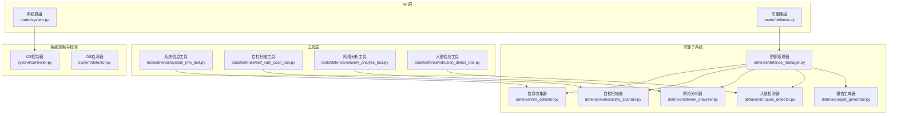
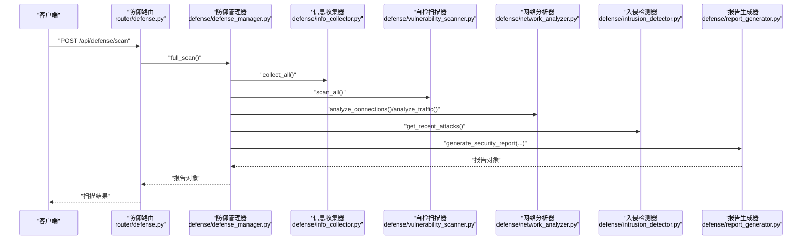
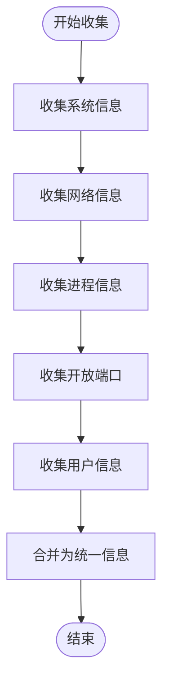
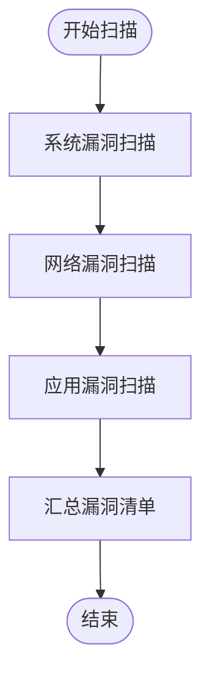
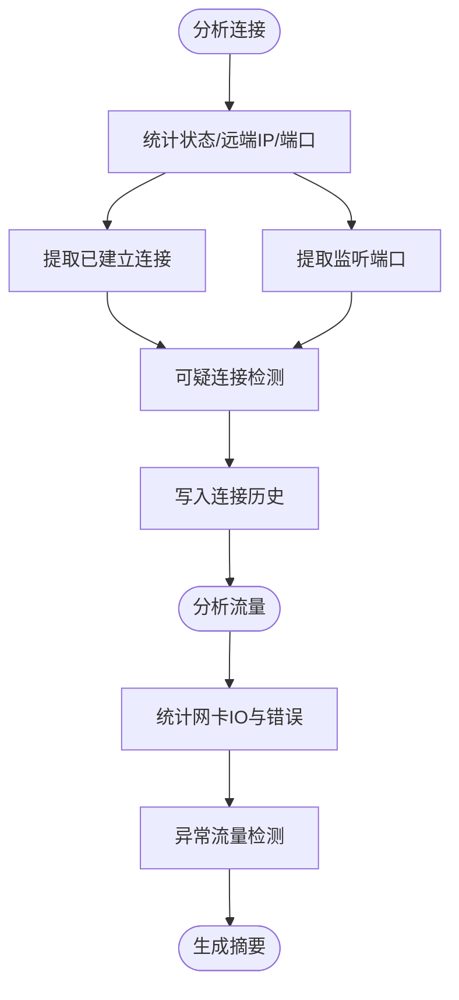
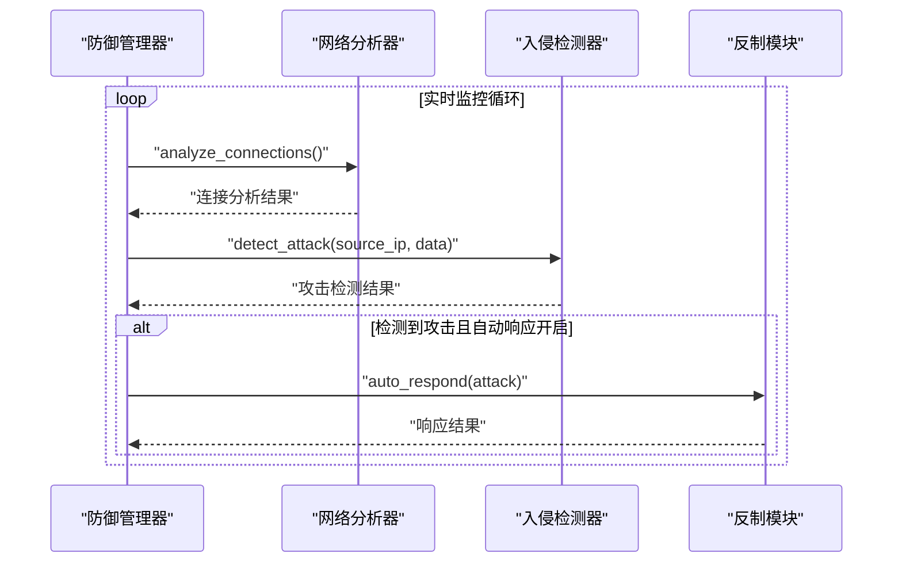
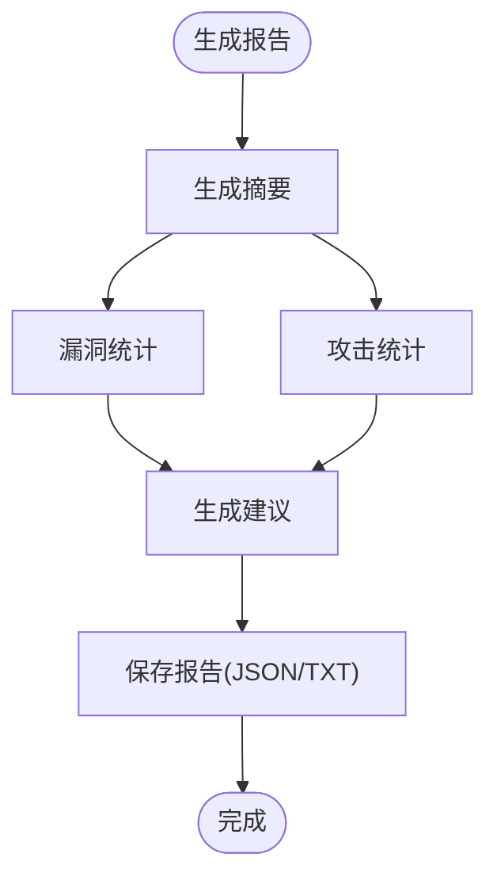
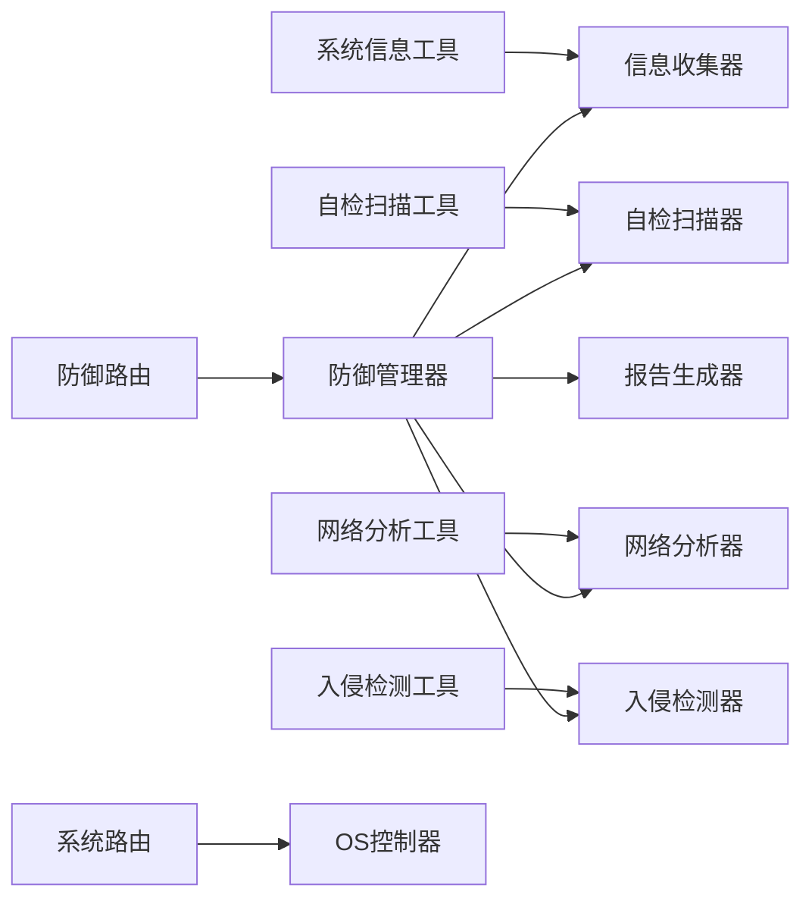

# 系统监控与自检

<cite>
**本文引用的文件**
- [defense/defense_manager.py](file://defense/defense_manager.py)
- [defense/info_collector.py](file://defense/info_collector.py)
- [defense/vulnerability_scanner.py](file://defense/vulnerability_scanner.py)
- [defense/network_analyzer.py](file://defense/network_analyzer.py)
- [defense/intrusion_detector.py](file://defense/intrusion_detector.py)
- [defense/report_generator.py](file://defense/report_generator.py)
- [tools/defense/system_info_tool.py](file://tools/defense/system_info_tool.py)
- [tools/defense/self_vuln_scan_tool.py](file://tools/defense/self_vuln_scan_tool.py)
- [tools/defense/network_analyze_tool.py](file://tools/defense/network_analyze_tool.py)
- [tools/defense/intrusion_detect_tool.py](file://tools/defense/intrusion_detect_tool.py)
- [router/system.py](file://router/system.py)
- [router/defense.py](file://router/defense.py)
- [system/controller.py](file://system/controller.py)
- [system/detector.py](file://system/detector.py)
</cite>

## 目录
1. [简介](#简介)
2. [项目结构](#项目结构)
3. [核心组件](#核心组件)
4. [架构总览](#架构总览)
5. [组件详解](#组件详解)
6. [依赖关系分析](#依赖关系分析)
7. [性能与可靠性考量](#性能与可靠性考量)
8. [故障排查指南](#故障排查指南)
9. [结论](#结论)
10. [附录](#附录)

## 简介
本章节面向Secbot的系统监控与自检能力，系统性阐述“系统信息收集机制”“自检扫描原理”“服务运行状态检查”“漏洞自检”“配置审计”“实时状态跟踪与历史趋势分析”“性能指标监控”“健康检查报告解读与改进建议”。文档既覆盖代码级实现细节，也提供面向非技术用户的使用指引与排障建议。

## 项目结构
Secbot围绕“防御管理器”聚合信息采集、漏洞扫描、网络分析、入侵检测、报告生成等能力，并通过API路由对外暴露系统状态与防御能力；同时提供工具层封装，便于在不同场景下调用。

图表来源
- [router/system.py](file://router/system.py#L195-L243)
- [router/defense.py](file://router/defense.py#L22-L96)
- [defense/defense_manager.py](file://defense/defense_manager.py#L17-L160)
- [defense/info_collector.py](file://defense/info_collector.py#L23-L250)
- [defense/vulnerability_scanner.py](file://defense/vulnerability_scanner.py#L12-L314)
- [defense/network_analyzer.py](file://defense/network_analyzer.py#L12-L226)
- [defense/intrusion_detector.py](file://defense/intrusion_detector.py#L11-L235)
- [defense/report_generator.py](file://defense/report_generator.py#L11-L290)
- [tools/defense/system_info_tool.py](file://tools/defense/system_info_tool.py#L6-L67)
- [tools/defense/self_vuln_scan_tool.py](file://tools/defense/self_vuln_scan_tool.py#L6-L64)
- [tools/defense/network_analyze_tool.py](file://tools/defense/network_analyze_tool.py#L6-L85)
- [tools/defense/intrusion_detect_tool.py](file://tools/defense/intrusion_detect_tool.py#L6-L65)
- [system/controller.py](file://system/controller.py#L10-L127)
- [system/detector.py](file://system/detector.py#L40-L124)

章节来源
- [router/system.py](file://router/system.py#L1-L243)
- [router/defense.py](file://router/defense.py#L1-L96)
- [system/controller.py](file://system/controller.py#L1-L127)
- [system/detector.py](file://system/detector.py#L1-L124)

## 核心组件
- 防御管理器：统一编排信息收集、漏洞扫描、网络分析、入侵检测与报告生成，支持实时监控与自动响应。
- 信息收集器：采集系统、网络、进程、开放端口、用户等多维信息。
- 自检扫描器：识别系统更新、弱密码策略、不必要服务、文件权限、开放端口、防火墙、SSH配置等风险。
- 网络分析器：统计连接状态、监听端口、可疑连接与异常流量，提供连接摘要与流量摘要。
- 入侵检测器：基于正则模式检测端口扫描、暴力破解、SQL注入、XSS、DoS、恶意软件等攻击。
- 报告生成器：汇总漏洞、攻击与网络状态，生成摘要、风险等级与修复建议。
- 工具层：以工具形式封装上述能力，便于在不同上下文调用。
- 系统路由与控制器：提供系统状态查询、CPU/内存/磁盘实时监控与配置信息。

章节来源
- [defense/defense_manager.py](file://defense/defense_manager.py#L17-L160)
- [defense/info_collector.py](file://defense/info_collector.py#L23-L250)
- [defense/vulnerability_scanner.py](file://defense/vulnerability_scanner.py#L12-L314)
- [defense/network_analyzer.py](file://defense/network_analyzer.py#L12-L226)
- [defense/intrusion_detector.py](file://defense/intrusion_detector.py#L11-L235)
- [defense/report_generator.py](file://defense/report_generator.py#L11-L290)
- [tools/defense/system_info_tool.py](file://tools/defense/system_info_tool.py#L6-L67)
- [tools/defense/self_vuln_scan_tool.py](file://tools/defense/self_vuln_scan_tool.py#L6-L64)
- [tools/defense/network_analyze_tool.py](file://tools/defense/network_analyze_tool.py#L6-L85)
- [tools/defense/intrusion_detect_tool.py](file://tools/defense/intrusion_detect_tool.py#L6-L65)
- [router/system.py](file://router/system.py#L195-L243)
- [router/defense.py](file://router/defense.py#L22-L96)
- [system/controller.py](file://system/controller.py#L10-L127)

## 架构总览
防御管理器作为中枢，协调各子模块完成“全量扫描—实时监控—自动响应—报告生成”的闭环。API路由提供系统状态与防御能力的HTTP接口，工具层提供可复用的扫描与检测能力。

图表来源
- [router/defense.py](file://router/defense.py#L22-L31)
- [defense/defense_manager.py](file://defense/defense_manager.py#L34-L61)
- [defense/info_collector.py](file://defense/info_collector.py#L229-L242)
- [defense/vulnerability_scanner.py](file://defense/vulnerability_scanner.py#L296-L306)
- [defense/network_analyzer.py](file://defense/network_analyzer.py#L20-L99)
- [defense/intrusion_detector.py](file://defense/intrusion_detector.py#L200-L209)
- [defense/report_generator.py](file://defense/report_generator.py#L17-L56)

## 组件详解

### 信息收集机制
- 能力范围：系统信息（主机名、平台、架构、CPU/内存/磁盘）、网络接口与连接、进程列表、开放端口、用户信息。
- 实现要点：逐项采集并容错，避免单点异常影响整体；对磁盘与网络接口遍历时进行异常捕获；对用户信息提供回退方案。
- 输出形态：结构化字典，按类别存储，支持增量收集与统一查询。

图表来源
- [defense/info_collector.py](file://defense/info_collector.py#L229-L242)

章节来源
- [defense/info_collector.py](file://defense/info_collector.py#L23-L250)

### 自检扫描原理
- 扫描维度：系统漏洞（更新、弱密码策略）、网络漏洞（不安全端口、防火墙、SSH配置）、应用漏洞（过时包、已知漏洞版本）。
- 实现要点：跨平台命令调用（Windows PowerShell、Linux apt/systemctl等），正则匹配与阈值判定，按严重程度分级。
- 输出形态：漏洞清单（类型、严重程度、描述、建议）。

图表来源
- [defense/vulnerability_scanner.py](file://defense/vulnerability_scanner.py#L296-L306)

章节来源
- [defense/vulnerability_scanner.py](file://defense/vulnerability_scanner.py#L12-L314)

### 网络状态监控与异常检测
- 连接分析：统计连接总数、按状态/远端IP/本地端口分布，提取已建立与监听连接，识别可疑连接（多连接、可疑端口、疑似恶意IP）。
- 流量分析：统计各网卡收发字节、错误包、丢弃包，检测异常高流量与错误率。
- 摘要输出：连接摘要与流量摘要，便于快速掌握态势。

图表来源
- [defense/network_analyzer.py](file://defense/network_analyzer.py#L20-L175)

章节来源
- [defense/network_analyzer.py](file://defense/network_analyzer.py#L12-L226)

### 入侵检测与自动响应
- 检测模式：端口扫描、暴力破解、SQL注入、XSS、DoS、恶意软件等攻击模式的正则匹配。
- 统计与信誉：按来源IP统计攻击次数，维护IP信誉（攻击次数、类型集合、严重程度）。
- 自动响应：在开启自动响应时，对检测到的攻击触发反制动作（如封禁IP）。

图表来源
- [defense/defense_manager.py](file://defense/defense_manager.py#L72-L99)
- [defense/network_analyzer.py](file://defense/network_analyzer.py#L20-L65)
- [defense/intrusion_detector.py](file://defense/intrusion_detector.py#L56-L82)

章节来源
- [defense/intrusion_detector.py](file://defense/intrusion_detector.py#L11-L235)
- [defense/defense_manager.py](file://defense/defense_manager.py#L63-L105)

### 报告生成与解读
- 报告类型：完整安全报告、漏洞报告、攻击报告。
- 摘要与风险等级：按漏洞与攻击数量与严重程度计算风险等级；提供Top攻击者与按类型/严重程度统计。
- 建议生成：结合漏洞与攻击类型，给出修复与防护建议。

图表来源
- [defense/report_generator.py](file://defense/report_generator.py#L17-L109)
- [defense/report_generator.py](file://defense/report_generator.py#L110-L244)

章节来源
- [defense/report_generator.py](file://defense/report_generator.py#L11-L290)

### 工具层使用方法
- 系统信息工具：按类别（system/network/process/user/all）收集系统/网络/进程/用户信息。
- 自检扫描工具：按类型（system/network/application/all）扫描本机漏洞，按严重程度分组。
- 网络分析工具：分析当前连接与流量，支持降级到命令行工具（如netstat）。
- 入侵检测工具：对给定数据进行实时检测，并返回近期攻击与统计。

章节来源
- [tools/defense/system_info_tool.py](file://tools/defense/system_info_tool.py#L6-L67)
- [tools/defense/self_vuln_scan_tool.py](file://tools/defense/self_vuln_scan_tool.py#L6-L64)
- [tools/defense/network_analyze_tool.py](file://tools/defense/network_analyze_tool.py#L6-L85)
- [tools/defense/intrusion_detect_tool.py](file://tools/defense/intrusion_detect_tool.py#L6-L65)

### 系统监控工具使用指南
- 实时状态跟踪：通过系统路由获取CPU/内存/磁盘实时状态，用于监控资源占用与健康状况。
- 历史趋势分析：结合连接历史与流量统计，观察连接数、监听端口变化与异常流量峰值。
- 性能指标监控：关注异常高流量、错误包、丢弃包与频繁连接到同一远端IP的行为。

章节来源
- [router/system.py](file://router/system.py#L195-L243)
- [defense/network_analyzer.py](file://defense/network_analyzer.py#L67-L99)

## 依赖关系分析
- 组件内聚与耦合：防御管理器聚合各子模块，形成高内聚低耦合；工具层通过导入子模块实现能力复用。
- 外部依赖：psutil用于系统/网络信息采集；subprocess用于跨平台命令调用；正则表达式用于入侵检测模式匹配。
- 循环依赖：未发现直接循环依赖；模块间通过函数调用与对象组合交互。

图表来源
- [defense/defense_manager.py](file://defense/defense_manager.py#L17-L33)
- [tools/defense/system_info_tool.py](file://tools/defense/system_info_tool.py#L21-L24)
- [tools/defense/self_vuln_scan_tool.py](file://tools/defense/self_vuln_scan_tool.py#L21-L24)
- [tools/defense/network_analyze_tool.py](file://tools/defense/network_analyze_tool.py#L21-L24)
- [tools/defense/intrusion_detect_tool.py](file://tools/defense/intrusion_detect_tool.py#L23-L26)
- [router/system.py](file://router/system.py#L195-L243)
- [router/defense.py](file://router/defense.py#L22-L31)
- [system/controller.py](file://system/controller.py#L10-L18)

章节来源
- [defense/defense_manager.py](file://defense/defense_manager.py#L17-L33)
- [system/controller.py](file://system/controller.py#L10-L18)

## 性能与可靠性考量
- 采集限制：连接与进程列表采样限制，避免大规模数据导致性能问题。
- 异常容错：各采集环节均进行异常捕获与日志记录，保证扫描稳定性。
- 平台差异：针对不同平台采用差异化命令与解析策略，必要时降级到命令行工具。
- 监控开销：实时监控周期可配置，避免过于频繁的系统调用造成负载。

[本节为通用指导，不直接分析具体文件]

## 故障排查指南
- 无法获取网络连接：在类Unix系统上，psutil网络接口可能受限，工具层会尝试使用命令行工具（如netstat）进行降级分析。
- 系统更新/服务状态检查失败：跨平台命令调用超时或权限不足会导致检查失败，建议在具备相应权限的环境下执行。
- 报告生成异常：检查报告生成器的输入字段完整性，确保漏洞与攻击数据结构正确。
- 防御状态查询失败：确认防御管理器实例已初始化且未处于异常状态。

章节来源
- [tools/defense/network_analyze_tool.py](file://tools/defense/network_analyze_tool.py#L24-L53)
- [defense/vulnerability_scanner.py](file://defense/vulnerability_scanner.py#L95-L120)
- [defense/report_generator.py](file://defense/report_generator.py#L17-L56)
- [router/defense.py](file://router/defense.py#L33-L49)

## 结论
Secbot的系统监控与自检体系以“防御管理器”为核心，整合信息收集、漏洞扫描、网络分析、入侵检测与报告生成，形成从“全量扫描—实时监控—自动响应—报告生成”的闭环。通过API路由与工具层，用户可在不同场景下灵活调用能力，实现对系统健康状况的持续观测与改进。

[本节为总结性内容，不直接分析具体文件]

## 附录

### API与工具参考
- 系统状态接口：获取CPU/内存/磁盘实时状态。
- 防御扫描接口：执行完整安全扫描并返回报告。
- 防御状态接口：获取监控状态、封禁IP数、漏洞数、攻击数与统计。
- 防御报告接口：按类型生成漏洞/攻击报告。
- 工具接口：系统信息、自检扫描、网络分析、入侵检测工具。

章节来源
- [router/system.py](file://router/system.py#L195-L243)
- [router/defense.py](file://router/defense.py#L22-L96)
- [tools/defense/system_info_tool.py](file://tools/defense/system_info_tool.py#L6-L67)
- [tools/defense/self_vuln_scan_tool.py](file://tools/defense/self_vuln_scan_tool.py#L6-L64)
- [tools/defense/network_analyze_tool.py](file://tools/defense/network_analyze_tool.py#L6-L85)
- [tools/defense/intrusion_detect_tool.py](file://tools/defense/intrusion_detect_tool.py#L6-L65)