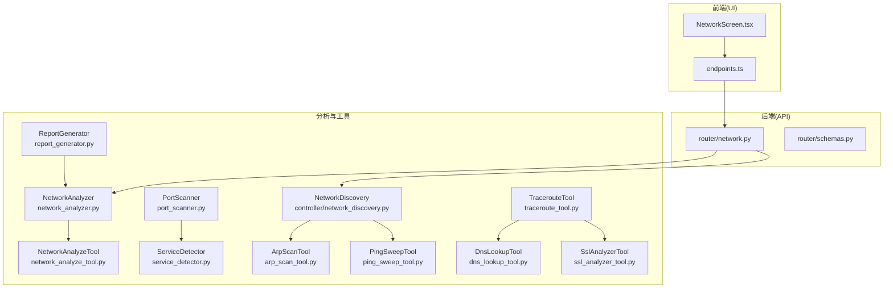
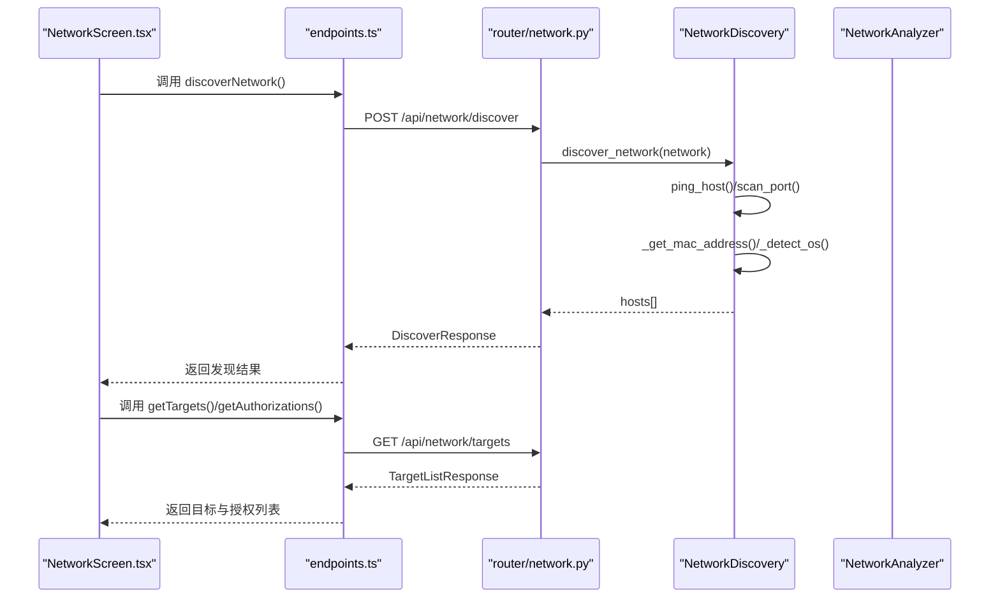
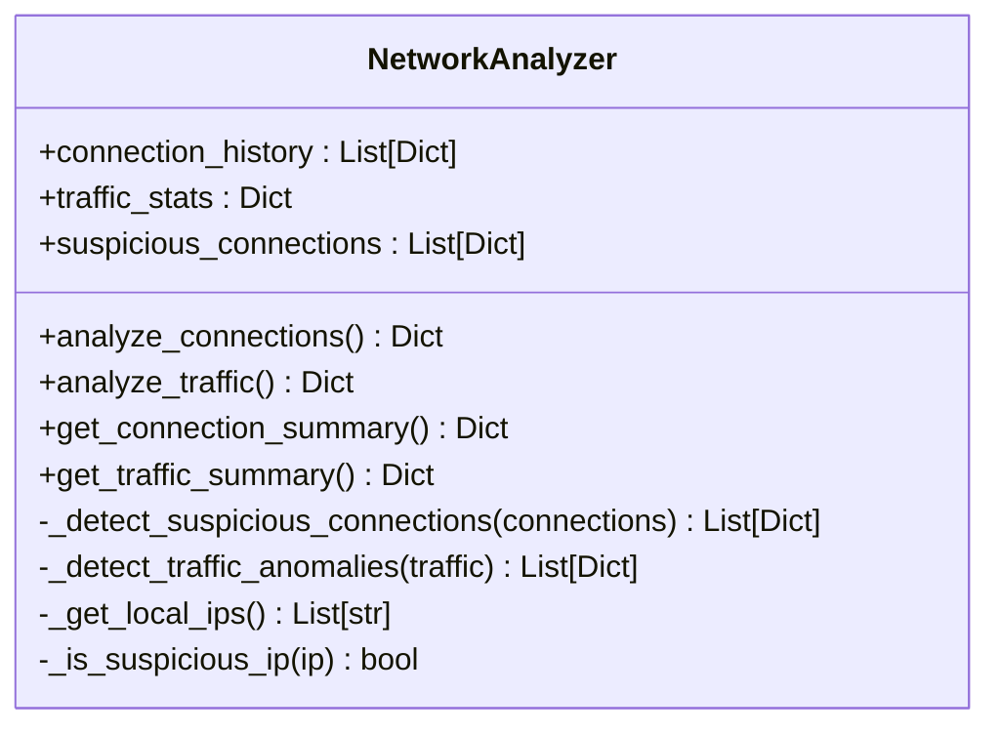
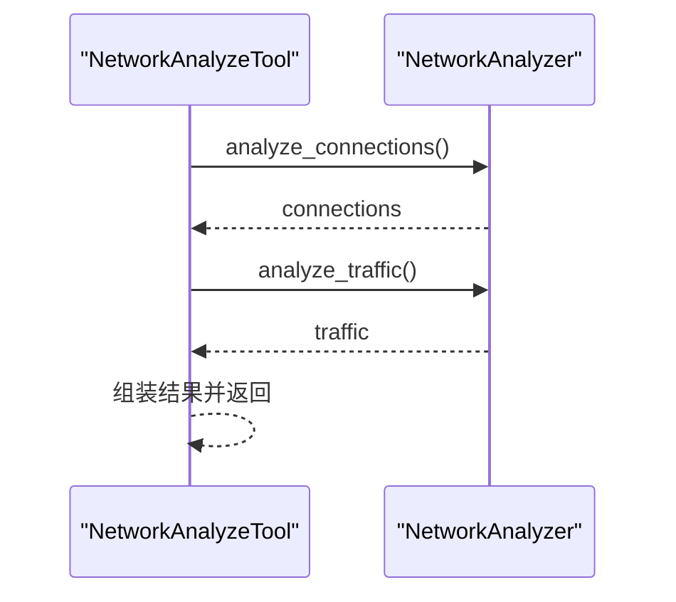
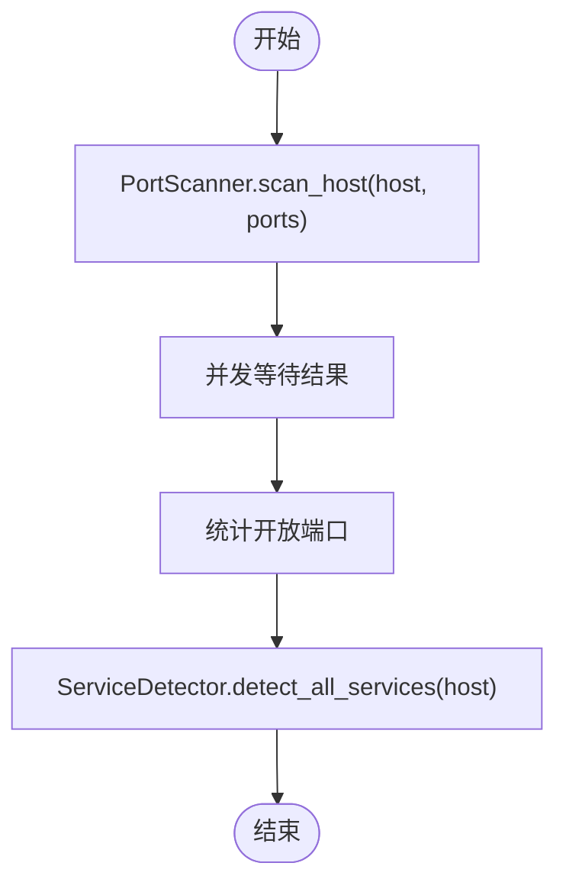
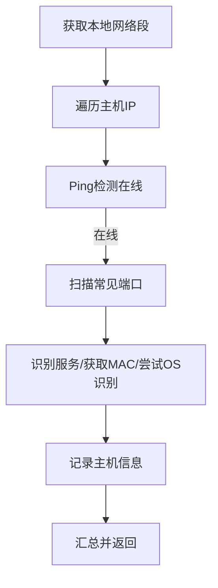
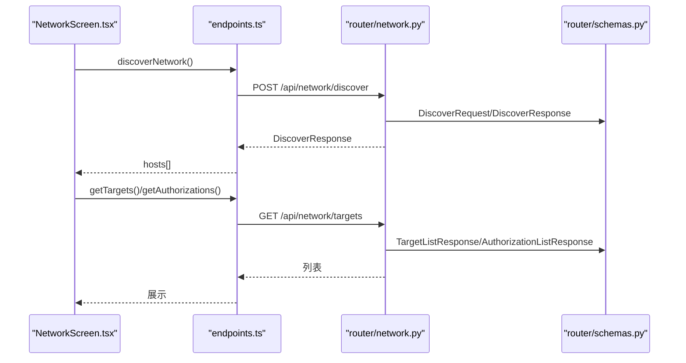
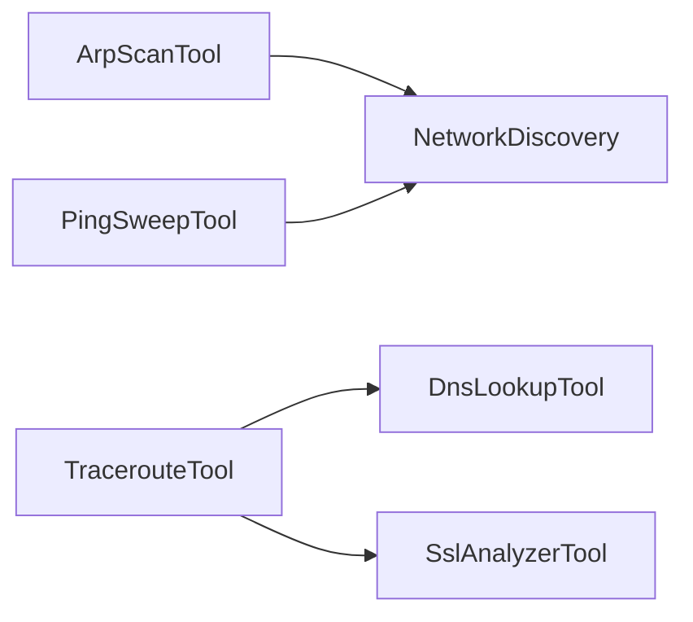
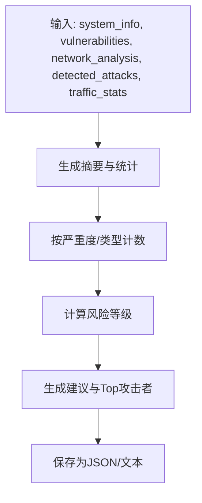
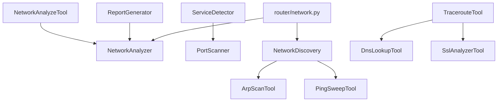

# 网络分析系统

<cite>
**本文引用的文件**
- [network_analyzer.py](file://defense/network_analyzer.py)
- [network_analyze_tool.py](file://tools/defense/network_analyze_tool.py)
- [port_scanner.py](file://scanner/port_scanner.py)
- [service_detector.py](file://scanner/service_detector.py)
- [network_discovery.py](file://controller/network_discovery.py)
- [network.py](file://router/network.py)
- [NetworkScreen.tsx](file://app/src/screens/NetworkScreen.tsx)
- [endpoints.ts](file://app/src/api/endpoints.ts)
- [schemas.py](file://router/schemas.py)
- [arp_scan_tool.py](file://tools/pentest/network/arp_scan_tool.py)
- [ping_sweep_tool.py](file://tools/pentest/network/ping_sweep_tool.py)
- [traceroute_tool.py](file://tools/pentest/network/traceroute_tool.py)
- [dns_lookup_tool.py](file://tools/pentest/network/dns_lookup_tool.py)
- [ssl_analyzer_tool.py](file://tools/pentest/network/ssl_analyzer_tool.py)
- [report_generator.py](file://defense/report_generator.py)
</cite>

## 目录
1. [简介](#简介)
2. [项目结构](#项目结构)
3. [核心组件](#核心组件)
4. [架构总览](#架构总览)
5. [详细组件分析](#详细组件分析)
6. [依赖关系分析](#依赖关系分析)
7. [性能与可扩展性](#性能与可扩展性)
8. [故障排查指南](#故障排查指南)
9. [结论](#结论)
10. [附录：使用与解读指南](#附录使用与解读指南)

## 简介
本文件面向Secbot的网络分析系统，系统性阐述其在网络拓扑分析、实时流量监控、协议识别、端口扫描、内网发现与目标管理等方面的功能与实现原理，并提供移动端UI使用方法、历史数据分析思路、网络健康检查流程以及报告解读与优化建议，帮助用户全面掌握网络状态与潜在风险。

## 项目结构
网络分析相关能力由后端Python模块、REST API路由、前端React Native页面与工具集合组成，形成“工具层 → 分析器 → 路由 → UI”的分层架构。

**图表来源**
- [NetworkScreen.tsx](file://app/src/screens/NetworkScreen.tsx#L1-L241)
- [endpoints.ts](file://app/src/api/endpoints.ts#L57-L82)
- [network.py](file://router/network.py#L22-L149)
- [network_analyzer.py](file://defense/network_analyzer.py#L12-L225)
- [network_analyze_tool.py](file://tools/defense/network_analyze_tool.py#L6-L84)
- [port_scanner.py](file://scanner/port_scanner.py#L14-L63)
- [service_detector.py](file://scanner/service_detector.py#L29-L56)
- [network_discovery.py](file://controller/network_discovery.py#L15-L233)
- [arp_scan_tool.py](file://tools/pentest/network/arp_scan_tool.py#L10-L167)
- [ping_sweep_tool.py](file://tools/pentest/network/ping_sweep_tool.py#L9-L90)
- [traceroute_tool.py](file://tools/pentest/network/traceroute_tool.py#L8-L89)
- [dns_lookup_tool.py](file://tools/pentest/network/dns_lookup_tool.py#L8-L79)
- [ssl_analyzer_tool.py](file://tools/pentest/network/ssl_analyzer_tool.py#L10-L115)
- [report_generator.py](file://defense/report_generator.py#L11-L290)

**章节来源**
- [NetworkScreen.tsx](file://app/src/screens/NetworkScreen.tsx#L1-L241)
- [endpoints.ts](file://app/src/api/endpoints.ts#L57-L82)
- [network.py](file://router/network.py#L22-L149)
- [network_analyzer.py](file://defense/network_analyzer.py#L12-L225)
- [network_discovery.py](file://controller/network_discovery.py#L15-L233)

## 核心组件
- 网络分析器：负责连接与流量统计、异常检测、摘要生成。
- 网络分析工具：对外暴露分析能力，支持是否包含流量统计的开关。
- 端口扫描器与服务识别器：快速扫描常见端口并识别服务类型。
- 内网发现器：自动获取本地网络段，批量Ping与端口扫描，识别主机与服务。
- 网络路由与Schema：提供内网发现、目标列表、授权管理等API。
- 前端网络页：内网发现、目标列表、授权列表与撤销授权。
- 报告生成器：整合系统信息、漏洞、网络分析、攻击检测与流量统计生成综合报告。

**章节来源**
- [network_analyzer.py](file://defense/network_analyzer.py#L12-L225)
- [network_analyze_tool.py](file://tools/defense/network_analyze_tool.py#L6-L84)
- [port_scanner.py](file://scanner/port_scanner.py#L14-L63)
- [service_detector.py](file://scanner/service_detector.py#L29-L56)
- [network_discovery.py](file://controller/network_discovery.py#L15-L233)
- [network.py](file://router/network.py#L22-L149)
- [NetworkScreen.tsx](file://app/src/screens/NetworkScreen.tsx#L31-L162)
- [report_generator.py](file://defense/report_generator.py#L11-L290)

## 架构总览
后端通过FastAPI路由提供网络分析能力；前端通过API封装调用后端接口，实现内网发现、目标管理与授权控制；分析器与工具层提供底层能力，支持实时监控与历史分析。

**图表来源**
- [NetworkScreen.tsx](file://app/src/screens/NetworkScreen.tsx#L45-L77)
- [endpoints.ts](file://app/src/api/endpoints.ts#L58-L71)
- [network.py](file://router/network.py#L25-L74)
- [network_discovery.py](file://controller/network_discovery.py#L74-L156)

**章节来源**
- [network.py](file://router/network.py#L22-L149)
- [network_discovery.py](file://controller/network_discovery.py#L15-L233)
- [NetworkScreen.tsx](file://app/src/screens/NetworkScreen.tsx#L31-L162)
- [endpoints.ts](file://app/src/api/endpoints.ts#L57-L82)

## 详细组件分析

### 网络分析器（NetworkAnalyzer）
- 连接分析：统计总数、按状态/远端IP/本地端口聚合，提取ESTABLISHED/LISTEN连接，记录可疑连接。
- 流量分析：按网卡统计收发字节数、包数、错误与丢包，检测异常高流量与错误。
- 异常检测：多连接到同一IP、可疑端口（如4444/5555等）、外部连接到疑似恶意IP。
- 摘要与历史：维护连接历史与流量快照，提供连接/流量摘要。

**图表来源**
- [network_analyzer.py](file://defense/network_analyzer.py#L12-L225)

**章节来源**
- [network_analyzer.py](file://defense/network_analyzer.py#L20-L225)

### 网络分析工具（NetworkAnalyzeTool）
- 封装NetworkAnalyzer，提供统一的分析入口，支持是否包含流量统计的开关。
- 返回连接统计、监听端口、可疑连接列表与可选的流量统计。

**图表来源**
- [network_analyze_tool.py](file://tools/defense/network_analyze_tool.py#L17-L74)
- [network_analyzer.py](file://defense/network_analyzer.py#L20-L99)

**章节来源**
- [network_analyze_tool.py](file://tools/defense/network_analyze_tool.py#L6-L84)

### 端口扫描器与服务识别器
- 端口扫描器：基于TCP connect异步并发扫描，支持常见端口与扩展端口范围，统计开放数量。
- 服务识别器：结合端口映射识别服务类型，先快速扫描再识别服务。

**图表来源**
- [port_scanner.py](file://scanner/port_scanner.py#L33-L62)
- [service_detector.py](file://scanner/service_detector.py#L42-L55)

**章节来源**
- [port_scanner.py](file://scanner/port_scanner.py#L14-L63)
- [service_detector.py](file://scanner/service_detector.py#L29-L56)

### 内网发现器（NetworkDiscovery）
- 自动获取本地网络段，批量Ping与端口扫描，识别主机名、MAC地址、开放端口与服务，尝试OS识别。
- 支持并发扫描，记录扫描历史与发现主机列表。

**图表来源**
- [network_discovery.py](file://controller/network_discovery.py#L121-L156)

**章节来源**
- [network_discovery.py](file://controller/network_discovery.py#L15-L233)

### 网络路由与前端集成
- 路由提供内网发现、目标列表、授权管理与撤销授权接口，使用Pydantic模型定义请求/响应。
- 前端NetworkScreen通过API封装调用后端，支持刷新、发现、撤销授权等交互。

**图表来源**
- [NetworkScreen.tsx](file://app/src/screens/NetworkScreen.tsx#L36-L77)
- [endpoints.ts](file://app/src/api/endpoints.ts#L58-L71)
- [network.py](file://router/network.py#L25-L149)
- [schemas.py](file://router/schemas.py#L203-L253)

**章节来源**
- [network.py](file://router/network.py#L22-L149)
- [schemas.py](file://router/schemas.py#L203-L253)
- [NetworkScreen.tsx](file://app/src/screens/NetworkScreen.tsx#L31-L162)
- [endpoints.ts](file://app/src/api/endpoints.ts#L57-L82)

### 其他网络分析工具
- ARP扫描：通过ARP协议或系统命令扫描局域网存活主机与MAC地址。
- Ping扫描：对CIDR网段进行并发存活检测，统计存活主机。
- Traceroute：追踪到目标的路由路径，解析每跳IP与延迟。
- DNS查询：查询A/AAAA/MX/NS/CNAME/TXT/SOA等记录，兼容dig与socket回退。
- SSL/TLS分析：抓取证书、协议版本、加密套件，评估安全风险。

**图表来源**
- [arp_scan_tool.py](file://tools/pentest/network/arp_scan_tool.py#L24-L155)
- [ping_sweep_tool.py](file://tools/pentest/network/ping_sweep_tool.py#L44-L76)
- [traceroute_tool.py](file://tools/pentest/network/traceroute_tool.py#L19-L73)
- [dns_lookup_tool.py](file://tools/pentest/network/dns_lookup_tool.py#L19-L67)
- [ssl_analyzer_tool.py](file://tools/pentest/network/ssl_analyzer_tool.py#L21-L97)

**章节来源**
- [arp_scan_tool.py](file://tools/pentest/network/arp_scan_tool.py#L10-L167)
- [ping_sweep_tool.py](file://tools/pentest/network/ping_sweep_tool.py#L9-L90)
- [traceroute_tool.py](file://tools/pentest/network/traceroute_tool.py#L8-L89)
- [dns_lookup_tool.py](file://tools/pentest/network/dns_lookup_tool.py#L8-L79)
- [ssl_analyzer_tool.py](file://tools/pentest/network/ssl_analyzer_tool.py#L10-L115)

### 报告生成器（ReportGenerator）
- 整合系统信息、漏洞、网络分析、攻击检测与流量统计，生成JSON/文本报告。
- 提供风险等级计算、推荐建议与前N攻击者统计。

**图表来源**
- [report_generator.py](file://defense/report_generator.py#L17-L109)

**章节来源**
- [report_generator.py](file://defense/report_generator.py#L11-L290)

## 依赖关系分析
- 组件耦合：NetworkAnalyzer被NetworkAnalyzeTool与防御报告生成器复用；PortScanner与ServiceDetector配合使用；NetworkDiscovery依赖系统命令与第三方库。
- 外部依赖：psutil用于网络连接与IO统计；系统命令（ping/arp/traceroute/dig）用于辅助发现与诊断。
- API契约：路由层以Pydantic模型约束请求/响应，确保前后端一致的数据结构。

**图表来源**
- [network_analyze_tool.py](file://tools/defense/network_analyze_tool.py#L20-L26)
- [network_analyzer.py](file://defense/network_analyzer.py#L12-L225)
- [service_detector.py](file://scanner/service_detector.py#L42-L55)
- [port_scanner.py](file://scanner/port_scanner.py#L33-L62)
- [network_discovery.py](file://controller/network_discovery.py#L74-L156)
- [arp_scan_tool.py](file://tools/pentest/network/arp_scan_tool.py#L50-L78)
- [ping_sweep_tool.py](file://tools/pentest/network/ping_sweep_tool.py#L61-L76)
- [traceroute_tool.py](file://tools/pentest/network/traceroute_tool.py#L33-L73)
- [dns_lookup_tool.py](file://tools/pentest/network/dns_lookup_tool.py#L36-L67)
- [ssl_analyzer_tool.py](file://tools/pentest/network/ssl_analyzer_tool.py#L43-L97)
- [report_generator.py](file://defense/report_generator.py#L17-L56)
- [network.py](file://router/network.py#L25-L74)

**章节来源**
- [network.py](file://router/network.py#L22-L149)
- [schemas.py](file://router/schemas.py#L203-L253)

## 性能与可扩展性
- 并发与异步：端口扫描与Ping扫描采用异步并发，提升吞吐；建议根据网络规模调整并发度与超时。
- 资源开销：流量统计与连接枚举依赖psutil，建议在资源受限环境降低采样频率或限制扫描范围。
- 可扩展点：异常检测规则可配置化；服务识别映射可动态扩展；报告生成支持多种格式与字段定制。

[本节为通用指导，无需具体文件引用]

## 故障排查指南
- 权限问题：在类Unix系统上，psutil.net_connections可能需要root权限；NetworkAnalyzeTool已内置降级逻辑（使用lsof/netstat），若仍失败，检查系统权限与依赖。
- 超时与失败：Traceroute/Ping/DNS/SSL分析存在超时保护；若失败，检查网络连通性、DNS解析器与目标可达性。
- 网络发现失败：确认本地网络段获取成功，系统命令可用（ping/arp/traceroute/dig），必要时手动指定网段。
- 报告生成异常：检查输入数据完整性与磁盘写入权限，确保输出目录存在。

**章节来源**
- [network_analyze_tool.py](file://tools/defense/network_analyze_tool.py#L24-L35)
- [traceroute_tool.py](file://tools/pentest/network/traceroute_tool.py#L33-L38)
- [dns_lookup_tool.py](file://tools/pentest/network/dns_lookup_tool.py#L36-L42)
- [ssl_analyzer_tool.py](file://tools/pentest/network/ssl_analyzer_tool.py#L43-L46)
- [network_discovery.py](file://controller/network_discovery.py#L24-L41)

## 结论
Secbot的网络分析系统以工具层、分析器与路由/UI三层架构实现内网发现、连接与流量分析、协议识别与端口扫描，并提供授权管理与报告生成能力。通过异步并发与模块化设计，系统具备良好的可扩展性与实用性，适合日常网络健康检查与安全审计场景。

[本节为总结，无需具体文件引用]

## 附录：使用与解读指南

### 实时流量监控与历史数据分析
- 实时监控：调用网络分析工具，开启流量统计开关，定期轮询连接与流量摘要，观察异常波动。
- 历史分析：利用连接历史与流量快照，对比不同时间段的连接分布、异常事件与接口负载，定位异常趋势。

**章节来源**
- [network_analyze_tool.py](file://tools/defense/network_analyze_tool.py#L17-L74)
- [network_analyzer.py](file://defense/network_analyzer.py#L67-L99)
- [network_analyzer.py](file://defense/network_analyzer.py#L200-L224)

### 网络健康检查流程
- 健康基线：检查ESTABLISHED/LISTEN连接数、异常端口与外部连接比例。
- 流量健康：关注接口错误包与丢包率，识别异常高流量时段。
- 安全基线：识别可疑连接（多连接、可疑端口、疑似恶意IP），及时阻断与处置。

**章节来源**
- [network_analyzer.py](file://defense/network_analyzer.py#L101-L175)
- [network_analyzer.py](file://defense/network_analyzer.py#L177-L198)

### 报告解读与优化建议
- 报告结构：包含摘要、漏洞统计、网络分析、攻击检测、流量统计与建议。
- 风险等级：依据漏洞数量与攻击强度综合评估，指导优先级。
- 优化建议：针对发现的漏洞与攻击类型，给出修复与防护建议（如强化认证、DDoS防护、速率限制等）。

**章节来源**
- [report_generator.py](file://defense/report_generator.py#L17-L56)
- [report_generator.py](file://defense/report_generator.py#L168-L244)

### 移动端使用方法
- 内网发现：点击“内网发现”，等待扫描完成，查看发现主机数量与列表。
- 目标管理：查看目标主机列表，了解开放端口与授权状态。
- 授权管理：对目标主机进行授权或撤销授权，注意凭据安全与最小权限原则。

**章节来源**
- [NetworkScreen.tsx](file://app/src/screens/NetworkScreen.tsx#L45-L77)
- [NetworkScreen.tsx](file://app/src/screens/NetworkScreen.tsx#L118-L156)
- [endpoints.ts](file://app/src/api/endpoints.ts#L58-L82)
- [network.py](file://router/network.py#L77-L149)