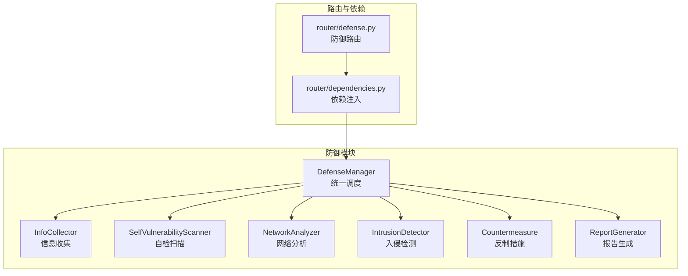
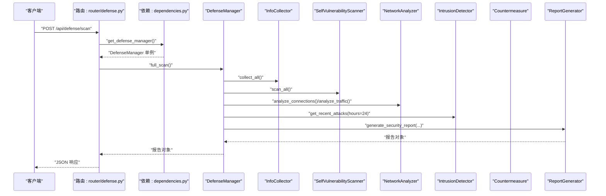
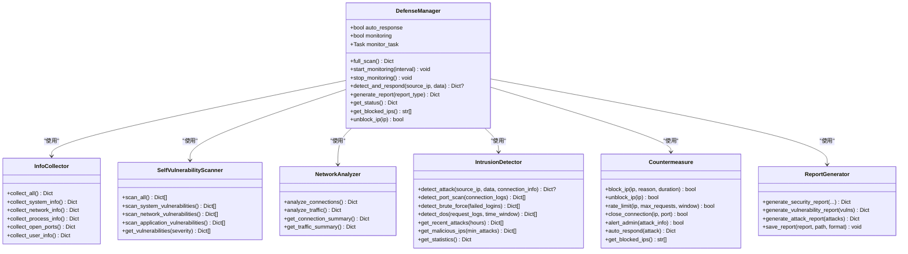
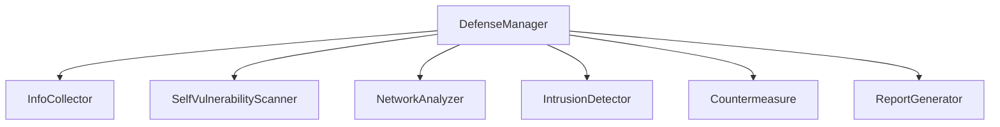

# 防御管理器

<cite>
**本文引用的文件**
- [defense_manager.py](file://defense/defense_manager.py)
- [countermeasure.py](file://defense/countermeasure.py)
- [info_collector.py](file://defense/info_collector.py)
- [intrusion_detector.py](file://defense/intrusion_detector.py)
- [network_analyzer.py](file://defense/network_analyzer.py)
- [vulnerability_scanner.py](file://defense/vulnerability_scanner.py)
- [report_generator.py](file://defense/report_generator.py)
- [defense.py](file://router/defense.py)
- [dependencies.py](file://router/dependencies.py)
- [__init__.py](file://defense/__init__.py)
- [README_CN.md](file://README_CN.md)
</cite>

## 目录
1. [简介](#简介)
2. [项目结构](#项目结构)
3. [核心组件](#核心组件)
4. [架构总览](#架构总览)
5. [详细组件分析](#详细组件分析)
6. [依赖关系分析](#依赖关系分析)
7. [性能考量](#性能考量)
8. [故障排查指南](#故障排查指南)
9. [结论](#结论)
10. [附录](#附录)

## 简介
防御管理器是Secbot主动防御体系的核心中枢，负责统一调度与协调多个防御子模块，实现从威胁检测到自动响应的闭环。它整合信息收集、漏洞扫描、网络分析、入侵检测、反制措施与报告生成等能力，提供统一的状态监控、实时告警与自动化处置能力，帮助用户建立高效、可审计的自动化防御体系。

## 项目结构
防御管理器位于defense目录，围绕“统一调度 + 多工具协调 + 状态监控 + 结果聚合”的设计原则组织，配合FastAPI路由与依赖注入，实现对外提供REST接口与内部模块协同。

图表来源
- [defense_manager.py](file://defense/defense_manager.py#L17-L160)
- [info_collector.py](file://defense/info_collector.py#L23-L250)
- [vulnerability_scanner.py](file://defense/vulnerability_scanner.py#L12-L314)
- [network_analyzer.py](file://defense/network_analyzer.py#L12-L226)
- [intrusion_detector.py](file://defense/intrusion_detector.py#L11-L235)
- [countermeasure.py](file://defense/countermeasure.py#L11-L235)
- [report_generator.py](file://defense/report_generator.py#L11-L290)
- [defense.py](file://router/defense.py#L1-L96)
- [dependencies.py](file://router/dependencies.py#L109-L114)

章节来源
- [defense_manager.py](file://defense/defense_manager.py#L17-L160)
- [README_CN.md](file://README_CN.md#L44-L49)

## 核心组件
- 统一调度器：DefenseManager，负责编排各防御子模块，提供完整扫描、实时监控、状态查询与报告生成等接口。
- 信息收集：InfoCollector，采集系统、网络、进程、端口、用户等基础信息。
- 自检扫描：SelfVulnerabilityScanner，扫描系统更新、服务、端口、文件权限、防火墙与SSH配置等。
- 网络分析：NetworkAnalyzer，分析连接状态、监听端口、可疑连接与异常流量。
- 入侵检测：IntrusionDetector，基于正则与统计规则检测端口扫描、暴力破解、SQL注入、XSS、DoS、恶意软件等。
- 反制措施：Countermeasure，自动封禁IP、速率限制、关闭连接、发送告警，并记录处置历史。
- 报告生成：ReportGenerator，生成安全报告、漏洞报告与攻击报告，包含统计与建议。
- 路由与依赖：router/defense.py提供REST接口，router/dependencies.py提供单例化的DefenseManager依赖注入。

章节来源
- [defense_manager.py](file://defense/defense_manager.py#L17-L160)
- [info_collector.py](file://defense/info_collector.py#L23-L250)
- [vulnerability_scanner.py](file://defense/vulnerability_scanner.py#L12-L314)
- [network_analyzer.py](file://defense/network_analyzer.py#L12-L226)
- [intrusion_detector.py](file://defense/intrusion_detector.py#L11-L235)
- [countermeasure.py](file://defense/countermeasure.py#L11-L235)
- [report_generator.py](file://defense/report_generator.py#L11-L290)
- [defense.py](file://router/defense.py#L1-L96)
- [dependencies.py](file://router/dependencies.py#L109-L114)

## 架构总览
防御管理器通过统一调度器串联各子模块，形成“采集—扫描—分析—检测—响应—报告”的闭环。对外通过FastAPI路由暴露REST接口，内部通过依赖注入共享单例实例，确保状态一致性与资源复用。

图表来源
- [defense.py](file://router/defense.py#L22-L30)
- [dependencies.py](file://router/dependencies.py#L176-L177)
- [defense_manager.py](file://defense/defense_manager.py#L34-L61)
- [info_collector.py](file://defense/info_collector.py#L229-L242)
- [vulnerability_scanner.py](file://defense/vulnerability_scanner.py#L296-L306)
- [network_analyzer.py](file://defense/network_analyzer.py#L20-L65)
- [intrusion_detector.py](file://defense/intrusion_detector.py#L200-L209)
- [report_generator.py](file://defense/report_generator.py#L17-L56)

## 详细组件分析

### 统一调度器：DefenseManager
- 职责：集中编排信息收集、漏洞扫描、网络分析、入侵检测、反制措施与报告生成；提供完整扫描、实时监控、状态查询与报告生成接口。
- 关键流程：
  - 完整扫描：依次调用各子模块，聚合结果并生成安全报告。
  - 实时监控：循环分析网络连接与流量，检测可疑行为并触发自动响应。
  - 状态查询：返回监控状态、自动响应开关、封禁IP数、漏洞数、攻击数、恶意IP数与统计信息。
  - 报告生成：支持漏洞报告与攻击报告；完整报告需先执行扫描。
- 依赖：InfoCollector、SelfVulnerabilityScanner、NetworkAnalyzer、IntrusionDetector、Countermeasure、ReportGenerator。

图表来源
- [defense_manager.py](file://defense/defense_manager.py#L17-L160)
- [info_collector.py](file://defense/info_collector.py#L23-L250)
- [vulnerability_scanner.py](file://defense/vulnerability_scanner.py#L12-L314)
- [network_analyzer.py](file://defense/network_analyzer.py#L12-L226)
- [intrusion_detector.py](file://defense/intrusion_detector.py#L11-L235)
- [countermeasure.py](file://defense/countermeasure.py#L11-L235)
- [report_generator.py](file://defense/report_generator.py#L11-L290)

章节来源
- [defense_manager.py](file://defense/defense_manager.py#L17-L160)

### 信息收集：InfoCollector
- 职责：采集系统信息（主机名、平台、CPU/内存/磁盘）、网络接口与连接、进程、开放端口、用户信息。
- 特点：逐项采集并容错，避免单点异常影响整体；限制连接与进程数量以控制性能开销。

章节来源
- [info_collector.py](file://defense/info_collector.py#L23-L250)

### 自检扫描：SelfVulnerabilityScanner
- 职责：扫描系统更新、不必要的服务、文件权限、不安全端口、防火墙状态与SSH配置等。
- 特点：跨平台适配（Windows/Linux），调用系统命令进行检查；支持扩展更多软件包与CVE查询。

章节来源
- [vulnerability_scanner.py](file://defense/vulnerability_scanner.py#L12-L314)

### 网络分析：NetworkAnalyzer
- 职责：分析连接状态、监听端口、可疑连接（大量连接、可疑端口、异常外部连接）与异常流量（高带宽、错误包）。
- 特点：统计维度丰富，支持连接摘要与流量摘要；阈值可配置以平衡误报与漏报。

章节来源
- [network_analyzer.py](file://defense/network_analyzer.py#L12-L226)

### 入侵检测：IntrusionDetector
- 职责：基于正则表达式与统计规则检测端口扫描、暴力破解、SQL注入、XSS、DoS、恶意软件等；维护IP信誉与攻击统计。
- 特点：支持按时间窗口检测DoS；按严重程度分级；记录攻击历史与Top攻击者。

章节来源
- [intrusion_detector.py](file://defense/intrusion_detector.py#L11-L235)

### 反制措施：Countermeasure
- 职责：自动封禁IP、速率限制、关闭连接、发送告警；记录处置历史。
- 特点：跨平台支持（Windows防火墙与Linux iptables）；根据攻击类型与严重程度采取差异化响应。

章节来源
- [countermeasure.py](file://defense/countermeasure.py#L11-L235)

### 报告生成：ReportGenerator
- 职责：生成安全报告、漏洞报告与攻击报告；汇总统计与风险等级；提供文本与JSON导出。
- 特点：支持按严重程度与类型统计；生成修复建议与防护建议。

章节来源
- [report_generator.py](file://defense/report_generator.py#L11-L290)

### 路由与依赖：对外接口与单例注入
- 路由：提供扫描、状态查询、封禁IP列表、解封、报告生成等接口。
- 依赖：通过依赖注入提供单例化的DefenseManager，确保多请求共享状态与资源。

章节来源
- [defense.py](file://router/defense.py#L1-L96)
- [dependencies.py](file://router/dependencies.py#L109-L114)

## 依赖关系分析
防御管理器内部模块之间为松耦合的协作关系，通过统一调度器进行编排；对外通过FastAPI路由与依赖注入提供稳定接口。

图表来源
- [defense_manager.py](file://defense/defense_manager.py#L17-L160)

章节来源
- [defense_manager.py](file://defense/defense_manager.py#L17-L160)
- [__init__.py](file://defense/__init__.py#L1-L21)

## 性能考量
- 采集与扫描限制：信息收集与网络连接分析限制了最大数量，避免高负载；自检扫描按模块分层执行，减少阻塞。
- 监控轮询：实时监控采用异步循环与sleep控制频率，避免CPU占用过高；异常捕获后继续轮询。
- 外部命令调用：反制与扫描涉及系统命令调用，建议在受控环境中运行并限制超时；日志记录便于审计与排障。
- 报告生成：统计与建议生成为纯内存计算，复杂度与数据规模线性相关。

[本节为通用性能指导，不直接分析具体文件]

## 故障排查指南
- 依赖注入问题：确认依赖注入容器已初始化DefenseManager单例；检查路由中是否正确调用依赖注入函数。
- 系统命令失败：反制与扫描依赖系统命令（Windows防火墙、Linux iptables、系统包管理器等），若失败需检查权限与环境。
- 监控异常：监控循环捕获异常并继续执行，若长时间无响应，检查网络分析与流量统计是否正常。
- 报告为空：完整报告需先执行扫描；漏洞与攻击报告可直接生成。

章节来源
- [dependencies.py](file://router/dependencies.py#L176-L177)
- [defense_manager.py](file://defense/defense_manager.py#L63-L104)
- [countermeasure.py](file://defense/countermeasure.py#L24-L65)
- [defense.py](file://router/defense.py#L85-L95)

## 结论
防御管理器通过统一调度与模块化设计，实现了从信息收集、漏洞扫描、网络分析、入侵检测到自动反制与报告生成的完整闭环。结合FastAPI路由与依赖注入，既满足对外接口需求，又保证内部状态一致性与可扩展性。建议在生产环境中合理配置监控间隔、阈值与自动响应策略，并定期审查报告与处置历史，持续优化防御效果。

[本节为总结性内容，不直接分析具体文件]

## 附录

### 防御策略配置示例与最佳实践
- 自动响应开关：通过构造函数参数控制是否自动响应；建议在测试环境开启，生产环境谨慎开启。
- 监控间隔：start_monitoring(interval)中设置轮询间隔（秒），建议根据系统负载与告警时效性调整。
- 反制策略：Countermeasure按攻击类型与严重程度采取差异化措施（封禁、速率限制、关闭连接、告警），建议结合业务场景定制阈值与规则。
- 报告类型：generate_report支持漏洞报告与攻击报告；完整报告需先执行扫描。
- 最佳实践：
  - 定期执行完整扫描，生成安全报告并跟踪修复进度。
  - 结合入侵检测统计与Top攻击者名单，优化网络与系统配置。
  - 对高危攻击（如暴力破解、DoS）启用自动封禁与速率限制。
  - 定期审查反制历史与处置效果，迭代规则与阈值。

章节来源
- [defense_manager.py](file://defense/defense_manager.py#L20-L32)
- [defense_manager.py](file://defense/defense_manager.py#L63-L104)
- [countermeasure.py](file://defense/countermeasure.py#L185-L223)
- [report_generator.py](file://defense/report_generator.py#L58-L93)